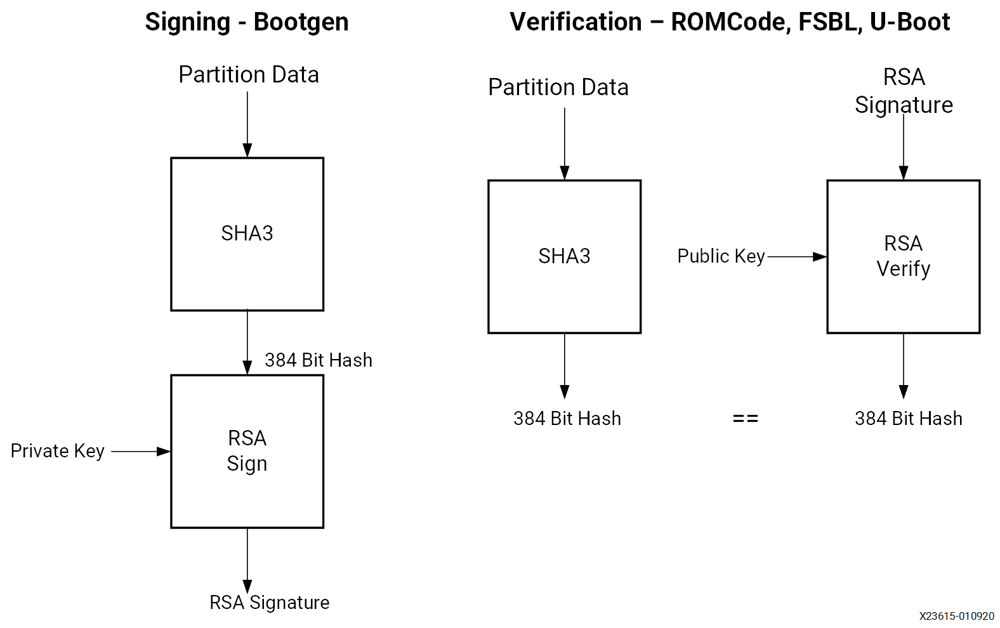
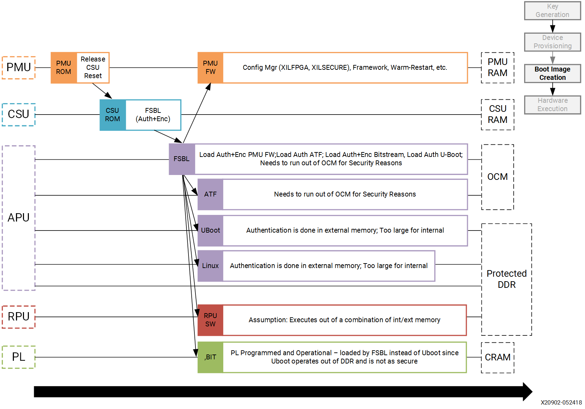

..
   Copyright 2015-2022 Xilinx, Inc.

   Licensed under the Apache License, Version 2.0 (the "License"); you may not use this file except in compliance with the License. You may obtain a copy of the License at http://www.apache.org/licenses/LICENSE-2.0.

   Unless required by applicable law or agreed to in writing, software distributed under the License is distributed on an "AS IS" BASIS, WITHOUT WARRANTIES OR CONDITIONS OF ANY KIND, either express or implied. See the License for the specific language governing permissions and limitations under the License.

===============================================
Use Secure Boot Features to Protect Your Design
===============================================

The secure boot functionality in Xilinx |trade| devices allows you to support the confidentiality, integrity, and authentication of partitions.

Secure boot in Zynq |reg| UltraScale+ |trade| MPSoCs is accomplished by combining the Hardware Root of Trust (HWRoT) capabilities with the option of encrypting all boot partitions. The HWRoT is based on the RSA-4096 asymmetric algorithm with SHA-3/384, which is hardware accelerated. Confidentiality is provided using 256-bit Advanced Encryption Standard Galois Counter Mode (AES-GCM).

This section focuses on how to use and implement the following:

-  Hardware Root of Trust with key revocation
-  Partition encryption with differential power analysis (DPA) countermeasures
-  Black key storage using the physically unclonable function (PUF)

The section :ref:`secure-boot-system-design-decisions` outlines high-level secure boot decisions which should be made early in design development.

The :ref:`hardware-root-of-trust` section discusses the use of a Root of Trust (RoT) in boot.

The :ref:`boot-image-confidentiality-and-dpa` section discusses the use of the operational key and key rolling techniques as countermeasures to a DPA attack. Changing the AES key reduces the exposure of both the key and the data protected by the key.

A red key is a key in unencrypted format. The :ref:`black-key-storage` section provides a method for storing the AES key in encrypted, or black format. Black key storage uses the physically unclonable function (PUF) as a Key Encryption Key (KEK).

The :ref:`example-practical-methods-in-secure-boot` section provides steps to develop and test systems that use AES encryption and RSA authentication.

.. _secure-boot-system-design-decisions:

Secure Boot System Design Decisions
-----------------------------------

The following are device level decisions affecting secure boot:

-  Boot mode
-  AES key storage location
-  AES storage state (encrypted or unencrypted)
-  Encryption and authentication requirements
-  Key provisioning

The boot modes which support secure boot are quad serial peripheral interface (QSPI), SD, eMMC, USB Boot, and NAND. The AES key is stored in either eFUSEs (encrypted or unencrypted), battery backed random access memory (BBRAM) (unencrypted only), or in external Non-Volatile Memory (NVM) (encrypted only).

In Zynq UltraScale+ MPSoC devices, partitions can be encrypted and/or authenticated on a partition basis. Xilinx generally recommends that all partitions be RSA authenticated. Partitions that are open source (such as U-Boot and Linux) or that do not contain any proprietary or confidential information typically do not need to be encrypted. In systems in which there are multiple sources/suppliers of sensitive data and/or proprietary IP, encrypting the partitions using unique keys can be important.

DPA resistance requirements are dictated by whether the adversary has physical access to the device.

The following table can be a good reference when deciding on features required to meet a specific secure system requirement. The following sections discuss the features in more detail.

+----------------------------------------------------+-----------------+
| System Consideration                               | Zynq            |
|                                                    | UltraScale+     |
|                                                    | Feature         |
+====================================================+=================+
| Ensure that only the users software and hardware   | Hardware Root   |
| runs on the device                                 | of Trust        |
+----------------------------------------------------+-----------------+
| Guarantee that the users software and hardware are | Hardware Root   |
| not modified                                       | of Trust        |
+----------------------------------------------------+-----------------+
| Ensure that an adversary cannot clone or reverse   | Boot Image      |
| engineer software/hardware                         | Confidentiality |
+----------------------------------------------------+-----------------+
| Protect sensitive data and proprietary             | Boot Image      |
| Intellectual Property (IP)                         | Confidentiality |
+----------------------------------------------------+-----------------+
| Ensure that Private Key (AES key) is protected     | DPA Protections |
| against side channel attacks                       |                 |
+----------------------------------------------------+-----------------+
| Private/Secret keys (AES key) is stored encrypted  | Black Key       |
| at rest                                            | Storage         |
+----------------------------------------------------+-----------------+

.. _hardware-root-of-trust:

Hardware Root of Trust
~~~~~~~~~~~~~~~~~~~~~~

Roots of trust are security primitives for storage (RTS), integrity (RTI), verification (RTV), measurement (RTM), and reporting (RTR). RoT consists of hardware, firmware, and software. The HWRoT has advantages over software RoTs because the HWRoT is immutable, has a smaller attack surface, and the behavior is more reliable.

The HWRoT is based on the CSU, eFUSEs, BBRAM (battery-backed RAM), and isolation elements. The HWRoT is responsible for validating that the operating environment and configuration have not been modified. The RoT acts as an anchor for boot, so an adversary cannot insert malicious code before detection mechanisms start.

Firmware and software run on the HWRoT during boot. Zynq UltraScale+ provides immutable bootROM code, a first stage boot loader, device
drivers, and the XILSKEY and XILSECURE libraries which run on the HWRoT. These provide a well-tested, proven in use API so that developers do not create security components from scratch with limited testing.

Data Integrity
^^^^^^^^^^^^^^

Data integrity is the absence of corruption of hardware, firmware, and software. Data integrity functions verify that an adversary has not tampered with the configuration and operating environment.

Zynq UltraScale+ verifies the integrity of partition(s) using both symmetric key (AES-GCM) and asymmetric key (RSA) authentication. RSA
uses a private/public key pair. The fielded embedded system only has the public key. Theft of the public key is of limited value since it is not possible, with current technology, to derive the private key from the public key.

Encrypted partitions are also authenticated using the Galois Counter Mode (GCM) mode of AES. In the secure boot flow, partitions are  first authenticated and then decrypted if necessary.

Authentication
^^^^^^^^^^^^^^

The following figure shows RSA signing and verification of partitions. From a secure facility, the Bootgen tool signs partitions, using the private key. In the device, the ROM verifies the FSBL and either the FSBL or U-Boot verifies the subsequent partitions, using the public key.

Primary and secondary private/public key pairs are used. The function of the primary private/ public key pair is to authenticate the secondary private/public key pair. The function of the secondary key is to sign/verify partitions.

To sign a partition, Bootgen first calculates the SHA3 of the partition data. The 384-bit hash is then RSA signed using the private key. The resulting RSA signature is placed in the authentication certificate. In the image, each signed partition has partition data followed by an authentication certificate which includes the RSA signature.

Verification of the FSBL is handled by the CSU ROM code. To verify the subsequent partitions, the FSBL or U-Boot uses the XILSECURE library.

There is a debug mode for authentication called boot header authentication. In this mode of authentication, the CSU ROM code does
not check the primary public key digests, the session key ID or the key revocation bits stored in the device eFUSEs. Therefore, this mode is not secure. However, it is useful for testing and debugging as it does not require programming of eFUSEs.

This tutorial uses this mode. However, fielded systems should not use boot header authentication. The example BIF file for a fully secured system is included at the end of this section.

.. _boot-image-confidentiality-and-dpa:

Boot Image Confidentiality and DPA
~~~~~~~~~~~~~~~~~~~~~~~~~~~~~~~~~~

AES is used to ensure the confidentiality of sensitive data and IP. Zynq UltraScale+ uses AES Galois Counter Mode (GCM) and a 256 AES bit key. The principle AES enhancements provided by Zynq UltraScale+ are increased resistance to differential power analysis (DPA) attacks and the availability of AES encryption/decryption post boot.

Bootgen and FSBL software support AES encryption. Private keys are used in AES encryption, and AES encryption is done by Bootgen using the key files. The key files can be generated by Bootgen or OpenSSL. The use of the operational key limits the exposure of the device key. The use of the operational key in key rolling is discussed in the next section. To maintain Boot image confidentiality, encrypted boot images can be created using Bootgen. Software examples to program keys to BBRAM and eFUSE are also available in the Vitis |trade| IDE. One such example is discussed in :ref:`example-practical-methods-in-secure-boot`.

.. note:: It is recommended that you generate your own keys for fielded systems and then provide those keys to the development tools. Refer to AR `76171 <https://www.xilinx.com/support/answers/76171.html>`_ for details.

DPA Protections
~~~~~~~~~~~~~~~

Key rolling is used for DPA resistance. Key rolling and black key store can be used in the same design. In key rolling, software and bitstream is broken up into multiple data blocks, each encrypted with a unique AES key. The initial key is stored in BBRAM or eFUSE NVM. Keys for successive data blocks are encrypted in the previous data block. After the initial key, the key update register is used as the key source.

A 96-bit initialization vector is included in the NKY key file. The IV uses 96 bits to initialize AES counters. When key rolling is used, a 128-bit IV is provided in the boot header. The 32 least significant bits define the block size of data to decrypt using the current key. The block sizes following the initial block defined in the IV are defined as attributes in the Bootgen Image Format (BIF) file.

An efficient method of key rolling uses the operational key. With the operational key, Bootgen creates an encrypted secure header with the user-specified operational key and the first block IV. The AES key in eFUSE or BBRAM is used only to decrypt the 384-bit secure header with the 256-bit operational key. This limits the exposure of the device key to DPA attacks.

.. _black-key-storage:

Black Key Storage
~~~~~~~~~~~~~~~~~

The PUF enables storing the AES key in encrypted (black) format. The black key can be stored either in eFUSEs or in the boot header. When
needed for decryption, the encrypted key in eFUSEs or the boot header is decrypted using the PUF generated key encrypting key (KEK).

There are two steps in using the PUF for black key storage. In the first, PUF registration software is used to generate PUF helper data and the PUF KEK. The PUF registration data allows the PUF to re-generate the identical key each time the PUF generates the KEK. For more details on the use of PUF registration software, see :ref:`puf-registration-in-boot-header-mode`. For more information on PUF Registration - eFUSE mode, see *Programming BBRAM and eFUSEs*
(`XAPP1319 <https://docs.xilinx.com/v/u/en-US/xapp1319-zynq-usp-prog-nvm>`_).

The helper data and encrypted user key must both be stored in eFUSEs if the PUF eFUSE mode is used, and in the boot header if the PUF boot header mode is used. The procedure for the PUF boot header mode is discussed in :ref:`using-puf-in-boot-header-mode`. For the procedure to use PUF in eFUSE mode, see *Programming BBRAM and eFUSEs* (`XAPP1319 <https://docs.xilinx.com/v/u/en-US/xapp1319-zynq-usp-prog-nvm>`_).

This tutorial uses PUF boot header mode as it does not require programming of eFUSEs, and is therefore useful for test and debug However, the most common mode is PUF eFUSE mode, as the PUB boot header mode requires a unique run of Bootgen for each and every device. 

.. _example-practical-methods-in-secure-boot:

Example: Practical Methods in Secure Boot
-----------------------------------------

This section outlines the steps to develop secure boot in a Zynq UltraScale+ system. Producing a secure embedded system is a two-step
process. In the first phase, the cryptographic keys are generated and programmed into NVM. In the second phase, the secure system is developed and tested. Both steps use the Vitis IDE to create software projects, generate the image, and program the image. For the second phase, a test system can be as simple as fsbl.elf and hello.elf files. In this section, you will use the same images used in :ref:`boot-sequence-for-sd-boot`, but this time the images will be assembled together, and have the secure attributes enabled as part of the secure boot sequence.

This section starts by showing how to generate AES and RSA keys. Following key generation, systems using the advanced AES and RSA methods are developed and tested. Keys generated in this section are also included in the `ref_files/secure_boot_sd <https://github.com/Xilinx/Embedded-Design-Tutorials/tree/2023.1/docs/Introduction/ZynqMPSoC-EDT/ref_files/secure_boot_sd>`_ directory.

The methods used to develop AES functionality are provided in the following sections:

-  :ref:`generating-keys-for-authentication`

-  :ref:`enabling-encryption-using-key-rolling`

-  :ref:`enabling-use-of-an-operational-key`

-  :ref:`using-the-puf`

- :ref:`creating-rsa-privatepublic-key-pairs` provides the steps to authenticate all partitions loaded at boot. This section also shows how to revoke keys.

A requirement in the development of a secure system is to add security attributes which are used in image generation. Bootgen generates a Boot Image Format (BIF) file. The BIF file is a text file. In its simplest form, the BIF is a list of partitions to be loaded at boot. Security attributes are added to the BIF to specify cryptographic functionality. In most cases, the Bootgen GUI (Create Boot Image wizard in the Vitis IDE) is used to generate the BIF file. In some cases, adding security attributes requires editing the Bootgen generated BIF file. In Create Boot Image Wizard in the Vitis IDE, after the Security tab is selected, the Authentication and Encryption tabs are used to specify security attributes.

After implementing AES and RSA cryptography in secure boot, a boot test should be executed. The system loads successfully and displays the FSBL messages on the terminal. These messages indicate the cryptographic operations performed on each partition. The :ref:`debugging-problems-with-secure-boot` section provides the debugging steps to follow if the secure boot test fails.

Sample Design Overview
~~~~~~~~~~~~~~~~~~~~~~

The sample design demonstrates loading various types of images into the device. It includes loading a FSBL, PMU Firmware, U-Boot, Linux, RPU software and a PL configuration image. In this sample, all of these images are loaded by the FSBL which performs all authentication and decryption. This is not the only means of booting a system. However, it is the simple and secure method.

Different sections within the boot image have different levels of security and are loaded into different locations. The following table
explains the contents of the final boot image.

**Final Boot Image with Secure Attributes**

+--------------+--------------+--------------+--------------+---------+
| Binary       | RSA          | AES          | Exception    | Loader  |
|              | A            | Encrypted    | Level        |         |
|              | uthenticated |              |              |         |
+==============+==============+==============+==============+=========+
| FSBL         | Yes          | Yes          | EL3          | CSU ROM |
+--------------+--------------+--------------+--------------+---------+
| PMU Firmware | Yes          | Yes          | NA           | FSBL    |
+--------------+--------------+--------------+--------------+---------+
| PL Bitstream | Yes          | Yes          | NA           | FSBL    |
+--------------+--------------+--------------+--------------+---------+
| Trusted      | Yes          | No           | EL3          | FSBL    |
| Firmware-A   |              |              |              |         |
| (TF-A)       |              |              |              |         |
+--------------+--------------+--------------+--------------+---------+
| R5 Software  | Yes          | Yes          | NA           | FSBL    |
+--------------+--------------+--------------+--------------+---------+
| U-Boot       | Yes          | No           | EL2          | FSBL    |
+--------------+--------------+--------------+--------------+---------+
| Linux        | Yes          | No           | EL1          | FSBL    |
+--------------+--------------+--------------+--------------+---------+

.. note::

   1. In a secure boot sequence, the PMU image is loaded by the FSBL. Using the bootROM/CSU to load the PMU firmware introduces a
      security weakness as the key/IV combination is used twice: first to decrypt the FSBL, and then again to decrypt the PMU image. This
      is not allowed for the secure systems.
   2. As of 2019.1, U-Boot does not perform a secure authenticated loading of Linux. Instead of U-Boot, FSBL loads the Linux images
      to a memory address and then uses U-Boot to jump to that memory address.

This tutorial demonstrates assembling the binaries that are created using :doc:`Design Example 1: Using GPIOs, Timers, and Interrupts <./7-design1-using-gpio-timer-interrupts>` in a boot image with all the security features enabled. This section also shows how a PL bitstream can be added as a part of the secure boot flow. Follow the information in this chapter until :ref:`modifying-the-build-settings` to create all the necessary files and then switch back.

.. note:: If you have not run MPSoC Design Example 1, you can run the script (see :ref:`reference-design-automation`) in the example’s ``ref_files`` to generate the binaries with one ``make all`` command.

Enabling the security features in boot image is done in two different methods. In the first method, the BIF file is manually created using a text editor and then that BIF file is used to make Bootgen create keys. This enables you to identify the sections of the BIF file that are enabled which security features. The second method uses the Create Boot Image wizard in the Vitis IDE. It demonstrates the same set of security features and reuses the keys from the first method for convenience.

.. _generating-keys-for-authentication:

Generating Keys for Authentication
~~~~~~~~~~~~~~~~~~~~~~~~~~~~~~~~~~

There are multiple methods of generating keys. These include, but are not limited to, using Bootgen, customized key files, OpenSSL and
hardware security modules (HSMs). This tutorial covers methods using bootgen. The Bootgen created files can be used as templates for creating files containing user-specified keys from the other key sources.

The creation of keys using Bootgen commands requires the generation and modification of the BIF files. The key generation section of this
tutorial creates these BIF files “by hand” using a text editor. The next section, building your boot image demonstrates how to create these BIF files using the Bootgen GUI (create Boot Image Wizard).

.. _creating-rsa-privatepublic-key-pairs:

Creating RSA Private/Public Key Pairs
~~~~~~~~~~~~~~~~~~~~~~~~~~~~~~~~~~~~~

For this example, you will create the primary and secondary keys in the PEM format. The keys are generated using Bootgen command-line options. Alternatively, you can create the keys using external tools such as OpenSSL.

The following steps describe the process of creating the RSA private/public key pairs:

1. Launch the shell from the Vitis IDE by clicking **Xilinx → Vitis Shell**.

2. Create a file named ``key_generation.bif``.

   .. note:: The ``key_generation.bif`` file will be used to create both the asymmetric keys in these steps and the symmetric keys in later steps.

   .. code-block::

      the_ROM_image:
      {
      [pskfile]psk0.pem 
      [sskfile]ssk0.pem
      [auth_params]spk_id = 0; ppk_select = 0 
      [fsbl_config]a53_x64
      [bootloader]fsbl_a53.elf 
      [destination_cpu = pmu]pmufw.elf
      [destination_device = pl]edt_zcu102_wrapper.bit
      [destination_cpu = a53-0, exception_level = el-3, trustzone] bl31.elf
      [destination_cpu = r5-0]tmr_psled_r5.elf
      [destination_cpu = a53-0, exception_level = el-2]u-boot.elf 
      [load = 0x1000000, destination_cpu = a53-0]image.ub
      }

3. Save the ``key_generation.bif`` file in the ``C:\edt\secure_boot_sd\keys`` directory.

4. Copy all of the ELF, BIF, and UB files built in :doc:`Design Example 1: Using GPIOs, Timers, and Interrupts <./7-design1-using-gpio-timer-interrupts>` to ``C:\edt\secure_boot_sd\keys directory``.

   -  `bl31.elf`
   -  `edt_zcu102_wrapper.bit`
   -  `fsbl_a53.elf`
   -  `image.ub`
   -  `pmufw.elf`
   -  `tmr_psled_r5.elf`
   -  `u-boot.elf`

5. Navigate to the folder containing the BIF file.

   .. code::
   
      cd C:\edt\secure_boot_sd\keys

6. Run the following command to generate the keys:

   .. code::
   
      bootgen -p zu9eg -arch zynqmp -generate_keys auth pem -image key_generation.bif

7. Verify that the files ``psk0.pem`` and ``ssk0.pem`` are generated at the location specified in the BIF file
   (``c:\edt\secure_boot_sd\keys``).

.. note:: 2020.3 (and previous) Bootgen fails to replace the old authentication key files with new authentication key files generated using the ``-generate_keys`` option. It is recommended that you check the existence and permissions of the target key files before generation. Refer to AR `76125 <https://www.xilinx.com/support/answers/76125.html>`_ for details.

.. _generating-sha3-of-public-key-in-an-rsa-privatepublic-key-pair:

Generating SHA3 of Public Key in an RSA Private/Public Key Pair
^^^^^^^^^^^^^^^^^^^^^^^^^^^^^^^^^^^^^^^^^^^^^^^^^^^^^^^^^^^^^^^

The following steps are required only for RSA authentication in eFUSE mode, and can be skipped for RSA authentication in boot header mode. The 384 bits from ``sha3.txt`` can be programmed to eFUSE for RSA  authentication in eFUSE mode. For more information, see *Programming BBRAM and eFUSEs* (`XAPP1319 <https://docs.xilinx.com/v/u/en-US/xapp1319-zynq-usp-prog-nvm>`_).

1. Perform the steps from the prior section.

2. Now that the PEM files have been defined, add ``authentication = rsa`` attributes as shown below to ``key_generation.bif``.

   .. code-block::

      the_ROM_image:
      {
      [pskfile]psk0.pem [sskfile]ssk0.pem
      [auth_params]spk_id = 0; ppk_select = 0 [fsbl_config]a53_x64
      [bootloader, authentication = rsa]fsbl_a53.elf [destination_cpu = pmu,authentication = rsa]pmufw.elf
      [destination_device = pl, authentication = rsa]edt_zcu102_wrapper.bit
      [destination_cpu = a53-0, exception_level = el-3, trustzone,authentication = rsa]bl31.elf
      [destination_cpu = r5-0, authentication = rsa]tmr_psled_r5.elf
      [destination_cpu = a53-0, exception_level = el-2, authentication = rsa]u-boot.elf
      [load = 0x1000000, destination_cpu = a53-0, authentication = rsa]image.ub
      }

3. Use the ``bootgen`` command to calculate the hash of the PPK:

   .. code:: 
   
      bootgen -p zcu9eg -arch zynqmp -efuseppkbits ppk0_digest.txt -image key_generation.bif

4. Verify that the file ``ppk0_digest.txt`` is generated at the location specified (``c:\edt\secure_boot_sd\keys``).

Additional RSA Private/Public Key Pairs
^^^^^^^^^^^^^^^^^^^^^^^^^^^^^^^^^^^^^^^

Follow the steps in this section to generate the secondary RSA private/public key pair required for key revocation, which requires the
programming of eFUSE. For more information, see *Programming BBRAM and eFUSEs* (`XAPP1319 <https://docs.xilinx.com/v/u/en-US/xapp1319-zynq-usp-prog-nvm>`_). You can skip this section if you do not intend to use key revocation.

Repeat the steps from :ref:`creating-rsa-privatepublic-key-pairs` and :ref:`generating-sha3-of-public-key-in-an-rsa-privatepublic-key-pair` to generate the second RSA private/public key pair and the SHA3 of the second PPK.

1. Perform the steps from the prior section, replacing ``psk0.pem``, ``ssk0.pem``, and ``ppk0_digest.txt`` with ``psk1.pem``, ``ssk1.pem``, and ``ppk1_digest.pem`` respectively. Save this file as ``key_generation_1.bif``. That BIF file will look like the following:

   .. code-block::

      the_ROM_image:
      {
      [pskfile]psk1.pem 
      [sskfile]ssk1.pem
      [auth_params]spk_id = 1; ppk_select = 1 [fsbl_config]a53_x64
      [bootloader]fsbl_a53.elf [destination_cpu = pmu]pmufw.elf
      [destination_device = pl]edt_zcu102_wrapper.bit
      [destination_cpu = a53-0, exception_level = el-3, trustzone]bl31.elf
      [destination_cpu = r5-0]tmr_psled_r5.elf
      [destination_cpu = a53-0, exception_level = el-2]u-boot.elf [load = 0x1000000, destination_cpu = a53-0]image.ub
      }

2. Run the ``bootgen`` command to create the RSA private/public key pairs.

   .. code-block::
   
      bootgen -p zu9eg -arch zynqmp -generate_keys auth pem -image key_generation_1.bif

3. Add ``authentication = rsa`` attributes to the ``key_generation_1.bif`` file. The BIF file will look like the following:

   .. code-block::

      the_ROM_image:
      {
      [pskfile]psk1.pem 
      [sskfile]ssk1.pem
      [auth_params]spk_id = 1; ppk_select = 1 
      [fsbl_config]a53_x64
      [bootloader, authentication = rsa]fsbl_a53.elf
      [destination_cpu = pmu, authentication = rsa]pmufw.elf
      [destination_device = pl, authentication = rsa]edt_zcu102_wrapper.bit
      [destination_cpu = a53-0, exception_level = el-3, trustzone, authentication = rsa]bl31.elf
      [destination_cpu = r5-0, authentication = rsa]tmr_psled_r5.elf
      [destination_cpu = a53-0, exception_level = el-2, authentication = rsa]u-boot.elf 
      [load = 0x1000000, destination_cpu = a53-0, authentication = rsa]image.ub
      }

4. Run the ``bootgen`` command to generate the hash of the primary RSA public key.

   .. code-block::
   
      bootgen -p zcu9eg -arch zynqmp -efuseppkbits ppk1_digest.txt -image key_generation_1.bif``

5. Verify that the files ``ppk1.pem``, ``spk1.pem``, and ``ppk1_digest.txt`` are all generated at the location specified (``c:\edt\secure_boot\keys``).

Enabling Boot Header Authentication
^^^^^^^^^^^^^^^^^^^^^^^^^^^^^^^^^^^

Boot header authentication is a mode of authentication that instructs the ROM to skip the checks of the eFUSE hashes for the PPKs, the
revocation status of the PPKs, and the session IDs for the secondary keys. This mode is useful for testing and debugging because it does not require programming of eFUSEs. This mode can be permanently disabled for a device by programming the RSA_EN eFUSEs, which forces RSA
authentication with the eFUSE checks. Fielded systems should use the RSA_EN eFUSE to force the eFUSE checks and disable boot header
authentication.

Add the ``bh_auth_enable`` attribute to the ``[fsbl_config]`` line so that the BIF file appears as follows:

.. code-block::

   the_ROM_image:
   {
   [pskfile]psk0.pem 
   [sskfile]ssk0.pem
   [auth_params]spk_id = 0; ppk_select = 0 
   [fsbl_config]a53_x64,bh_auth_enable 
   [bootloader, authentication = rsa]fsbl_a53.elf
   [destination_cpu = pmu, authentication = rsa]pmufw.elf 
   [destination_device = pl, authentication = rsa]edt_zcu102_wrapper.bit
   [destination_cpu = a53-0, exception_level = el-3, trustzone, authentication = rsa]bl31.elf
   [destination_cpu = r5-0, authentication = rsa]tmr_psled_r5.elf
   [destination_cpu = a53-0, exception_level = el-2, authentication = rsa]u-boot.elf 
   [load = 0x1000000, destination_cpu = a53-0, authentication = rsa]image.ub
   }

Generating Keys for Confidentiality
~~~~~~~~~~~~~~~~~~~~~~~~~~~~~~~~~~~

Image confidentiality is discussed in the :ref:`boot-image-confidentiality-and-dpa` section. In this
section you will modify the BIF file from the authentication section by adding the attributes required to enable image confidentiality, using the AES-256-GCM encryption algorithm. At the end, a ``bootgen`` command will be used to create all of the required AES-256 keys.

Using AES Encryption
^^^^^^^^^^^^^^^^^^^^

1. Enable image confidentiality by specifying the key source for the initial encryption key (``bbram_red_key`` for now) using the ``[keysrc_encryption]`` ``bbram_red_key`` attribute.

2. On several of the partitions, enable confidentiality by adding the ``encryption = aes`` attribute. Specify a unique key file for each
   partition. Having a unique key file for each partition allows each partition to use a unique set of keys which increases security
   strength by not reusing keys and reducing the amount of information encrypted on any one key. The ``key_generation.bif`` file should now look as follows:

   .. code-block::

      the_ROM_image:
      {
      [pskfile]psk0.pem 
      [sskfile]ssk0.pem
      [auth_params]spk_id = 0; ppk_select = 0 [keysrc_encryption]bbram_red_key
      [fsbl_config]a53_x64, bh_auth_enable
      [bootloader, authentication = rsa, encryption = aes, aeskeyfile = fsbl_a53.nky]fsbl_a53.elf
      [destination_cpu = pmu, authentication = rsa, encryption = aes, aeskeyfile = pmufw.nky]pmufw.elf
      [destination_device = pl, authentication = rsa, encryption = aes, aeskeyfile = edt_zcu102_wrapper.nky]edt_zcu102_wrapper.bit
      [destination_cpu = a53-0, exception_level = el-3, trustzone, authentication = rsa]bl31.elf
      [destination_cpu = r5-0, authentication = rsa, encryption = aes,aeskeyfile = tmr_psled_r5.nky]tmr_psled_r5.elf
      [destination_cpu = a53-0, exception_level = el-2, authentication = rsa]u-boot.elf
      [load = 0x1000000, destination_cpu = a53-0, authentication = rsa]image.ub
      }

Enabling DPA Protections
^^^^^^^^^^^^^^^^^^^^^^^^

This section provides the steps for using an operational key, and also demonstrates key rolling effective countermeasures against differential power analysis (DPA).

.. _enabling-use-of-an-operational-key:

Enabling Use of an Operational Key
^^^^^^^^^^^^^^^^^^^^^^^^^^^^^^^^^^^^

Use of an operational key limits the amount of information encrypted using a device key. Enable use of the operational key by adding the
``opt_key`` attribute to the ``[fsbl_config]`` line of the BIF file. The ``key_generation.bif`` file should now appear as shown below:

.. code:: 

      {
      [pskfile]psk0.pem 
      [sskfile]ssk0.pem
      [auth_params]spk_id = 0; ppk_select = 0 
      [keysrc_encryption]bbram_red_key
      [fsbl_config]a53_x64, bh_auth_enable, opt_key
      [bootloader, authentication = rsa, encryption = aes, aeskeyfile = fsbl_a53.nky]fsbl_a53.elf
      [destination_cpu = pmu, authentication = rsa, encryption = aes, aeskeyfile = pmufw.nky]pmufw.elf
      [destination_device = pl, authentication = rsa, encryption = aes, aeskeyfile = edt_zcu102_wrapper.nky]edt_zcu102_wrapper.bit
      [destination_cpu = a53-0, exception_level = el-3, trustzone, authentication = rsa]bl31.elf
      [destination_cpu = r5-0, authentication = rsa, encryption = aes, aeskeyfile = tmr_psled_r5.nky]tmr_psled_r5.elf
      [destination_cpu = a53-0, exception_level = el-2, authentication = rsa]u-boot.elf
      [load = 0x1000000, destination_cpu = a53-0, authentication = rsa]image.ub
      }

.. _enabling-encryption-using-key-rolling:

Enabling Encryption Using Key Rolling
^^^^^^^^^^^^^^^^^^^^^^^^^^^^^^^^^^^^^

Use of key rolling limits the amount of information encrypted using any of the other keys. Key rolling is enabled on a partition-by-partition basis using the blocks attribute in the BIF file. The blocks attribute allows you to specify the amount of information in bytes to encrypt with each key. For example, ``blocks=4096,1024(3),512(*)`` would use the first key for 4096 bytes, the second through fourth keys for 1024 bytes, and all remaining keys for 512 bytes. In this example, the block command will be used to limit the life of each key to 1728 bytes.

Enable use of key rolling by adding the ``blocks`` attribute to each of the encrypted partitions. The ``key_generation.bif`` file should appear as shown below:

.. code-block::

      the_ROM_image:
      {
      [pskfile]psk0.pem
      [sskfile]ssk0.pem
      [auth_params]spk_id = 0; ppk_select = 0
      [keysrc_encryption]bbram_red_key
      [fsbl_config]a53_x64, bh_auth_enable, opt_key
      [bootloader, authentication = rsa, encryption = aes, aeskeyfile = fsbl_a53.nky, blocks = 1728(*)]fsbl_a53.elf
      [destination_cpu = pmu, authentication = rsa, encryption = aes,aeskeyfile = pmufw.nky, blocks = 1728(*)]pmufw.elf
      [destination_device = pl, authentication = rsa, encryption = aes,aeskeyfile = edt_zcu102_wrapper.nky, blocks = 1728(*)]edt_zcu102_wrapper.bit
      [destination_cpu = a53-0, exception_level = el-3, trustzone, authentication = rsa]bl31.elf
      [destination_cpu = r5-0, authentication = rsa, encryption = aes, aeskeyfile = tmr_psled_r5.nky, blocks = 1728(*)]tmr_psled_r5.elf
      [destination_cpu = a53-0, exception_level = el-2, authentication = rsa]u-boot.elf
      [load = 0x1000000, destination_cpu = a53-0, authentication = rsa]image.ub
      }

.. _generating-all-of-the-aes-keys:

Generating All of the AES Keys
^^^^^^^^^^^^^^^^^^^^^^^^^^^^^^

When all the desired encryption features have been enabled, you can generate all key files by running Bootgen. Some of the source files (for example, ELF) contain multiple sections. These individual sections will be mapped to separate partitions, and each partition will have a unique key file. In this case, the key file will be appended with a “.1.”. For example, if the ``pmufw.elf`` file contains multiple sections, both a ``pmufw.nky`` and a ``pmufw.1.nky`` file will be generated.

1. Create all of the necessary NKY files by running the ``bootgen`` command that creates the final ``BOOT.bin`` image.

   .. code-block::

      bootgen -p zcu9eg -arch zynqmp -image key_generation.bif

2. Verify that the NKY files were generated. These file should include ``edt_zcu102_wrapper.nky, fsbl_a53.nky, pmu_fw.nky, pmu_fw.1.nky, pmu_fw.2.nky, tmr_psled_r5.nky, and tmr_psled_r5.1.nky.``

Using Key Revocation
~~~~~~~~~~~~~~~~~~~~

Key revocation allows you to revoke a RSA primary or secondary public key. Key revocation can be used due to elapsed time of key use, or if there is an indication that the key is compromised. The primary and secondary key revocation is controlled by one-time programmable eFUSEs. The Xilinx Secure Key Library is used for key revocation, allowing key revocation in fielded devices. Key revocation is discussed further in the *Zynq UltraScale+ Device Technical Reference Manual* (`UG1085 <https://docs.xilinx.com/v/u/en-US/ug1085-zynq-ultrascale-trm>`_).

.. _using-the-puf:

Using the PUF
^^^^^^^^^^^^^

In this section, the PUF is used for black key storage in the PUF boot header mode. RSA authentication is required when the PUF is used. In PUF boot header mode, the PUF helper data and the encrypted user's AES key are stored in the boot header. This section shows how to create a BIF for using the PUF. Because the helper data and encrypted user key are unique for each and every board, the Bootgen image created only works on the board from which the helper data originated.

.. _puf-registration-in-boot-header-mode:

PUF Registration in Boot Header Mode
^^^^^^^^^^^^^^^^^^^^^^^^^^^^^^^^^^^^

The PUF registration software is included in the XILSKEY library. The PUF registration software operates in a boot header mode or eFUSE mode. The boot header mode allows development without programming the OTP eFUSEs. The eFUSE mode is used in production. This lab runs through PUF registration in boot header mode only. For PUF registration using eFUSE, see *Programming BBRAM and eFUSEs* (`XAPP1319 <https://docs.xilinx.com/v/u/en-US/xapp1319-zynq-usp-prog-nvm>`_).

The PUF registration software accepts a red (unencrypted) key as input, and produces syndrome data (helper data), which also contains CHASH and AUX, and a black (encrypted) key. When the PUF boot header mode is used, the output is put in the boot header. When the PUF eFUSE mode is used, the output is programmed into eFUSEs.

1. In the Vitis IDE, navigate to tmr_psled_r5 Board Support Package Settings.

2. Ensure that the xilskey and the xilsecure libraries are enabled.

   .. image:: ./media/image80.png

3. Click **OK**. Rebuild the hardware platform for changes to apply. Navigate to tmr_psled_r5_bsp settings.

4. Scroll to the Libraries section. Click **xilskey 6.8 Import Examples**.

5. In the view, select **xilskey_puf_registration example**. Click **OK**.

   .. image:: ./media/image81.png

6. In the Project Explorer view, verify that the xilskey_puf_example_1 application is created.

7. In the Project Explorer view, xilskey_puf_example_1 ‘Src’, double-click **xilskey_puf_registration.h** to open it in the Vitis IDE.

8. Edit xilskey_puf_registration.h as follows:

   1. Change ``#define XSK_PUF_INFO_ON_UART`` from ``FALSE`` to ``TRUE``.

   2. Ensure that ``#define XSK_PUF_PROGRAM_EFUSE`` is set to ``FALSE``.

   3. Set ``XSK_PUF_AES_KEY`` (256-bit key).

      The key must be entered in hex format and should be Key 0 from the ``fsbl_a53.nky`` file that you generated in :ref:`generating-all-of-the-aes-keys`. You can find a sample key below:

      .. code-block::

          #define XSK_PUF_AES_KEY
          "68D58595279ED1481C674383583C1D98DA816202A57E7FE4F67859CB069CD510"

      .. note:: Do not copy this key. Refer to the **fsbl_a53.nky** file for your key.

   4. Set the ``XSK_PUF_BLACK_KEY_IV``. The initialization vector IV is a 12-byte piece of data of your choice.

      .. code::
      
         #define XSK_PUF_BLACK_KEY_IV \"E1757A6E6DD1CC9F733BED31\"

      .. image:: ./media/image82.png

9.  Save the file and exit.

10. In the Project Explorer view, right-click the **xilskey_puf_example_1** project and select **Build Project**.

11. In the Vitis IDE, select **Xilinx → Create Boot Image**.

12. Select **Zynq MP** in the Architecture view.

13. Specify the BIF path in the Output BIF file path view as ``C:\edt\secureboot_sd\puf_registration\puf_registration.bif``.

14. Specify the output path in the Output Path view as ``C:\edt\secureboot_sd\puf_registration\BOOT.bin``.

15. In the Boot Image Partitions pane, click **Add**. Add the partitions and set the destination CPU of the xilskey_puf_example_1 application to R5-0:

   .. code::
   
       C:\edt\fsbl_a53\Debug\fsbl_a53.elf
       C:\edt\xilskey_puf_example_1\Debug\xilskey_puf_example_1.elf

16. Click **Create Image** to create the boot image for PUF registration.

    .. image:: ./media/image83.png

17. Insert an SD card into the PC SD card slot.

18. Copy ``C:\edt\secureboot_sd\puf_registration\BOOT.bin`` to the SD card.

19. Move the SD card from the PC SD card slot to the ZCU102 card slot.

20. Start a terminal session using Tera Term or Minicom depending on the host machine being used, as well as the COM port and baud rate for your system.

21. In the communication terminal menu bar, select **File → Log**. Enter ``C:\edt\secureboot_sd\puf_registration\puf_registration.log`` in the view.

22. Power cycle the board.

23. After the puf_registration software has run, exit the communication terminal.

24. The ``puf_registration.log`` file is used in :ref:`using-puf-in-boot-header-mode`. Open ``puf_registration.log`` in a text editor.

25. Save the PUF Syndrome data that starts after ``App PUF Syndrome data Start!!!`` and ends at ``PUF Syndrome data End!!!``, non-inclusive, to a file named ``helperdata.txt``.

26. Save the black key IV identified by ``App: Black Key IV`` to a file named ``black_iv.txt``.

27. Save the black key to a file named ``black_key.txt``.

28. The files ``helperdata.txt``, ``black_key.txt``, and ``black_iv.txt`` can be saved in ``C:\edt\secure_boot_sd\keys``.

.. _using-puf-in-boot-header-mode:

Using PUF in Boot Header Mode
^^^^^^^^^^^^^^^^^^^^^^^^^^^^^

The following steps describe the process to update the BIF file from the previous sections to include using the PUF in Boot Header mode. This section makes use of the syndrome data and black key created during PUF registration process.

1. Enable use of the PUF by adding all of the fields and attributes indicated in bold to the BIF file (``key_generation.bif``) as shown
   below.

   .. code-block::

      the_ROM_image:
      {
      [pskfile]psk0.pem
      [sskfile]ssk0.pem
      [auth_params]spk_id = 0; ppk_select = 0
      [keysrc_encryption]bh_blk_key
      [bh_key_iv]black_iv.txt
      [bh_keyfile]black_key.txt
      [puf_file]helperdata.txt
      [fsbl_config]a53_x64, bh_auth_enable, opt_key, puf4kmode, shutter=0x0100005E,pufhd_bh
      [bootloader, authentication = rsa, encryption = aes, aeskeyfile = fsbl_a53.nky, blocks = 1728(*)]fsbl_a53.elf
      [destination_cpu = pmu, authentication = rsa, encryption = aes, aeskeyfile = pmufw.nky, blocks = 1728(*)]pmufw.elf
      [destination_device = pl, authentication = rsa, encryption = aes, aeskeyfile = edt_zcu102_wrapper.nky, blocks = 1728(*)]edt_zcu102_wrapper.bit
      [destination_cpu = a53-0, exception_level = el-3, trustzone, authentication = rsa]bl31.elf
      [destination_cpu = r5-0, authentication = rsa, encryption = aes, aeskeyfile = tmr_psled_r5.nky, blocks =1728(*)]tmr_psled_r5.elf
      [destination_cpu = a53-0, exception_level = el-2, authentication = rsa]u-boot.elf
      [load = 0x1000000, destination_cpu = a53-0, authentication = rsa]image.ub
      }

2. The above BIF file can be used for creating a final boot image using an AES key encrypted in the boot image header with the PUF KEK. This should be done using the following ``bootgen`` command:

   .. code:
   
      bootgen -p zcu9eg -arch zynqmp -image key_generation.bif -w -o BOOT.bin``

   .. note:: The above steps can also be executed with PUF in eFUSE mode. In this case, repeat the previous steps using the PUF in eFUSE mode. This requires enabling the programming of eFUSEs during PUF registration by setting the ``XSK_PUF_PROGRAM_EFUSE`` macro in the ``xilskey_puf_registration.h`` file used to build the PUF registration application. The BIF must also be modified to use the encryption key from eFUSE, and the helper data and black key files should be removed. PUF in eFUSE mode is not covered in this tutorial to avoid programming the eFUSEs on development or tutorial systems.
      
   .. code::

      [keysrc_encryption]efuse_blk_key
      [bh_key_iv]black_iv.txt

System Example Using the Vitis IDE Create Boot Image Wizard
~~~~~~~~~~~~~~~~~~~~~~~~~~~~~~~~~~~~~~~~~~~~~~~~~~~~~~~~~~~~

The previous sections enabled the various security features (authentication, confidentiality, DPA protections, and black key
storage) by hand editing the BIF file. This section performs the same operations, but uses the Bootgen Wizard as a starting point. The Bootgen Wizard creates a base BIF file, and then adds the additional security features that are not supported by the wizard using a text editor.

1. Change directory to the ``bootgen_files`` directory.

   .. code::
   
      cd C:\edt\secure_boot_sd\bootgen_files

2. Copy the below data from the previous example to this example.

   .. code-block::

       cp ../keys/*nky .
       cp ../keys/*pem .
       cp ../keys/black_iv.txt .
       cp ../keys/helperdata.txt .
       cp ../keys/*.elf .
       cp ../keys/edt_zcu102_wrapper.bit .
       cp ../keys/image.ub .
       cp ../keys/black_key.txt.

3. Click **Programs → Xilinx Design Tools → Vitis <version number> → Xilinx Vitis 2022.2** to launch the Vitis IDE.

4. Click **Xilinx Tools → Create Boot Image** from the menu bar to launch the Create Boot Image wizard.

5.  elect Zynq MP as the Architecture.

6. Enter the Output BIF file path as ``C:\edt\secure_boot_sd\bootgen_files\design_bh_bkey_keyrolling.bif``.

7. Select BIN as the output format.

8. Enter the output path ``C:\edt\secure_boot_sd\bootgen_files\BOOT.bin``.

9. Enable authentication.

   1. Click the **Security** page.

   2. Check the Use Authentication check box.

   3. Browse to select the **psk0.pem** file for the PSK and the **ssk0.pem** for the SSK.

   4. Ensure PPK select is 0.

   5. Enter SPK ID as 0.

   6. Check the **Use BH Auth** check box.

      .. image:: ./media/image84.jpeg

10. Enable encryption.

    1. Click the **Encryption** page.

    2. Check the **Use Encryption** check box.

    3. Provide the part name as **zcu9eg**.

    4. Check the **Operational Key** check box.

       .. image:: ./media/image85.png

11. Click the **Basic** page.

12. Add the FSBL binary to the boot image.

    1. Click **Add**.

    2. Use the browse button to select the **fsbl_a53.elf** file.

    3. Make sure the partition type is **bootloader** and the destination CPU is **a53x64**.

    4. Change the authentication to **RSA**.

    5. Change the encryption to **AES**.

    6. Browse to the **fsbl_a53.nky** file that was generated earlier and add the key file.

    7. Click **OK**.

       .. image:: ./media/image86.png

13. Add the PMU firmware binary to the boot image.

    1. Click **Add**.

    2. Use the browse button to select the **pmufw.elf** file.

    3. Make sure the partition type is **datafile**.

    4. Change the destination CPU to **PMU**.

    5. Change the authentication to **RSA**.

    6. Change the encryption to **AES**.

    7. Add the **pmufw.nky** file as the key file.

    8. Click **OK**.

       .. image:: ./media/image87.png

14. Add the PL bitstream to the boot image.

    1. Click the **Add**.

    2. Use the browse button to select the **edt_zcu102_wrapper.bit** file.

    3. Make sure the partition type is **datafile**.

    4. Make sure the destination device is **PL**.

    5. Change the authentication to **RSA**.

    6. Change the encryption to **AES**.

    7. Add the **edt_zcu102_wrapper.bit** file as the key file.

    8. Click **OK**.

       .. image:: ./media/image88.png

15. Add the Trusted Firmware-A (TF-A) binary to the image.

    1. Click **Add**.

    2. Use the browse button to select the **bl31.elf** file.

    3. Make sure the partition type is **datafile**.

    4. Make sure the destination CPU is **A53 0**.

    5. Change the authentication to **RSA**.

    6. Make sure the encryption is **none**.

    7. Make sure the exception level is **EL3** and click **Enable TrustZone**.

    8. Click **OK**.

       .. image:: ./media/image89.png

16. Add the R5 software binary to the boot image.

    1. Click **Add**.

    2. Use the browse button to select the **tmr_psled_r5.elf** file.

    3. Make sure the partition type is **datafile**.

    4. Make sure the destination CPU is **R5 0**.

    5. Change the authentication to **RSA**.

    6. Change the encryption to **AES**.

    7. Add the **tmr_psled_r5.nky** file as the key file.

    8. Click **OK**.

       .. image:: ./media/image90.png

17. Add the U-Boot software binary to the boot image.

    a. Click **Add**.

    b. Use the browse button to select the **u-boot.elf** file.

    c. Make sure the partition type is **datafile**.

    d. Make sure the destination CPU is **A53 0**.

    e. Change the authentication to **RSA**.

    f. Make sure that encryption is **none**.

    g. Change the exception level to **EL2**.

    h. Click **OK**.

    .. image:: ./media/image91.png

18. Add the Linux image to the boot image.

    1. Click **Add**.

    2. Use the browse button to select the **image.ub** file.

    3. Make sure the partition type is **datafile**.

    4. Make sure the destination CPU is **A53 0**.

    5. Change the authentication to **RSA**.

    6. Make sure that the encryption is **none**.

    7. Update the load field to **0x2000000**.

    8. Click **OK**.

       .. image:: ./media/image92.png

19. Click **Create image**.

    .. image:: ./media/image93.png

20. The ``design_bh_bkey_keyrolling.bif`` file should look similar to the following:

    .. code-block::

       //arch = zynqmp; split = false; format = BIN; key_part_name = zcu9eg
       the_ROM_image:
       {
       [pskfile]C:\edt\secure_boot_sd\bootgen_files\psk0.pem
       [sskfile]C:\edt\secure_boot_sd\bootgen_files\ssk0.pem
       [auth_params]spk_id = 0; ppk_select = 0
       [keysrc_encryption]efuse_red_key
       [fsbl_config]bh_auth_enable, opt_key
       [bootloader, encryption = aes, authentication = rsa, aeskeyfile = C:\edt\secure_boot_sd\bootgen_files\fsbl_a53.nky]C:\edt\secure_boot_sd\bootgen_files\fsbl_a53.elf
       [encryption = aes, authentication = rsa, aeskeyfile = C:\edt\secure_boot_sd\bootgen_files\pmufw.nky, destination_cpu = pmu]C:\edt\secure_boot_sd\bootgen_files\pmufw.elf
       [encryption = aes, authentication = rsa, aeskeyfile = C:\edt\secure_boot_sd\bootgen_files\edt_zcu102_wrapper.nky, destination_device = pl]C:\edt\secure_boot_sd\bootgen_files\edt_zcu102_wrapper.bit
       [authentication = rsa, destination_cpu = a53-0, exception_level = el-3, trustzone]C:\edt\secure_boot_sd\bootgen_files\bl31.elf
       [encryption = aes, authentication = rsa, aeskeyfile = C:\edt\secure_boot_sd\bootgen_files\tmr_psled_r5.nky, destination_cpu =r5-0]C:\edt\secure_boot_sd\bootgen_files\tmr_psled_r5.elf
       [authentication = rsa, destination_cpu = a53-0, exception_level = el-2]C:\edt\secure_boot_sd\bootgen_files\u-boot.elf
       [authentication = rsa, load = 0x2000000, destination_cpu = a53-0]C:\edt\secure_boot_sd\bootgen_files\image.ub
       }

    .. note:: This BIF file is still missing several security features that are not supported by the Create Boot Image wizard. These are features are key rolling and black key store.

21. Add black key store by changing the ``keysrc_encryption`` and adding the other additional items so that the BIF file looks like the following:

    .. code-block::

       the_ROM_image:
       {
       [pskfile]C:\edt\secure_boot_sd\bootgen_files\psk0.pem
       [sskfile]C:\edt\secure_boot_sd\bootgen_files\ssk0.pem
       [auth_params]spk_id = 0; ppk_select = 0
       [keysrc_encryption]bh_blk_key
       [bh_key_iv]black_iv.txt
       [bh_keyfile]black_key.txt
       [puf_file]helperdata.txt
       [fsbl_config]a53_x64, bh_auth_enable, opt_key,puf4kmode,shutter=0x0100005E,pufhd_bh
       [bootloader, encryption = aes, authentication = rsa, aeskeyfile = C:\edt\secure_boot_sd\bootgen_files\fsbl_a53.nky]C:\edt\secure_boot_sd\bootgen_files\fsbl_a53.elf
       [encryption = aes, authentication = rsa, aeskeyfile = C:\edt\secure_boot_sd\bootgen_files\pmufw.nky, destination_cpu = pmu]C:\edt\secure_boot_sd\bootgen_files\pmufw.elf
       [encryption = aes, authentication = rsa, aeskeyfile = C:\edt\secure_boot_sd\bootgen_files\edt_zcu102_wrapper.nky, destination_device= pl]C:\edt\secure_boot_sd\bootgen_files\edt_zcu102_wrapper.bit
       [authentication = rsa, destination_cpu = a53-0, exception_level = el-3, trustzone]C:\edt\secure_boot_sd\bootgen_files\bl31.elf
       [encryption = aes, authentication = rsa, aeskeyfile = C:\edt\secure_boot_sd\bootgen_files\tmr_psled_r5.nky, destination_cpu = r5-0]C:\edt\secure_boot_sd\bootgen_files\tmr_psled_r5.elf
       [authentication = rsa, destination_cpu = a53-0, exception_level = el-2]C:\edt\secure_boot_sd\bootgen_files\u-boot.elf
       [authentication = rsa, load = 0x2000000, destination_cpu = a53-0]C:\edt\secure_boot_sd\bootgen_files\image.ub
       }

22. Enable key rolling by adding the block attributes to the encrypted partitions. The updated BIF file should now look like the following:

    .. code-block::

       //arch = zynqmp; split = false; format = BIN; key_part_name = zcu9eg
       the_ROM_image:
       {
       [pskfile]C:\edt\secure_boot_sd\bootgen_files\psk0.pem
       [sskfile]C:\edt\secure_boot_sd\bootgen_files\ssk0.pem
       [auth_params]spk_id = 0; ppk_select = 0
       [keysrc_encryption]bh_blk_key
       [bh_key_iv]black_iv.txt
       [bh_keyfile]black_key.txt
       [puf_file]helperdata.txt
       [fsbl_config]a53_x64, bh_auth_enable, opt_key, puf4kmode,shutter=0x0100005E,pufhd_bh
       [bootloader, encryption = aes, authentication = rsa, aeskeyfile = C:\edt\secure_boot_sd\bootgen_files\fsbl_a53.nky, blocks = 1728(*)]C:\edt  \secure_boot_sd\bootgen_files\fsbl_a53.elf
       [encryption = aes, authentication = rsa, aeskeyfile = C:\edt\secure_boot_sd\bootgen_files\pmufw.nky, destination_cpu = pmu, blocks = 1728(*)]C:\edt\secure_boot_sd\bootgen_files\pmufw.elf
       [encryption = aes, authentication = rsa, aeskeyfile = C:\edt\secure_boot_sd\bootgen_files\edt_zcu102_wrapper.nky, destination_device = pl, blocks = 1728(*)]C:\edt\secure_boot_sd\bootgen_files\edt_zcu102_wrapper.bit
       [authentication = rsa, destination_cpu = a53-0, exception_level = el-3, trustzone]C:\edt\secure_boot_sd\bootgen_files\bl31.elf
       [encryption = aes, authentication = rsa, aeskeyfile = C:\edt\secure_boot_sd\bootgen_files\tmr_psled_r5.nky, destination_cpu = r5-0, blocks = 1728(*)]C:\edt\secure_boot_sd\bootgen_files\tmr_psled_r5.elf
       [authentication = rsa, destination_cpu = a53-0, exception_level = el-2]C:\edt\secure_boot_sd\bootgen_files\u-boot.elf
       [authentication = rsa, load = 0x2000000, destination_cpu = a53-0]C:\edt\secure_boot_sd\bootgen_files\image.ub
       }

23. Generate the boot image by running the following command. Note that the ``- encryption_dump`` flag has been added. This flag causes the log file ``aes_log.txt`` to be created. The log file details all encryption operations that were used. This allows you to see which keys and IVs were used on which sections of the boot image.

   .. code::

      bootgen -p zcu9eg -arch zynqmp -image design_bh_bkey_keyrolling.bif -w -o BOOT.bin -encryption_dump

Booting the System Using a Secure Boot Image
^^^^^^^^^^^^^^^^^^^^^^^^^^^^^^^^^^^^^^^^^^^^

This section demonstrates how to use the ``BOOT.bin`` boot image created in prior sections to perform a secure boot using the ZCU102.

1. Copy the BOOT.bin image, the ``boot.scr`` file generated in PetaLinux, and the ``ps_pl_linux_app.elf`` file.\
2. Insert the SD card into the ZCU102.
3. Set SW6 of the ZCU102 for SD boot mode (1=ON; 2,3,4=OFF).

   .. image:: ./media/image43.jpeg

4. Connect Serial terminals to ZCU102 (115200, eight data bits, one stop bit, no parity).
5. Power on the ZCU102.
6. When the terminal reaches the U-Boot ``ZynqMP>`` prompt, type ``bootm 0x2000000``.

   .. note:: `0x2000000` is the address of image.ub

   .. image:: ./media/image94.png

7. Log into Linux using the following credentials:

   .. code::

      Login: root;
      Password: root

   Run the Linux application as described in :doc:`Design Example 1: Using GPIOs, Timers, and Interrupts <./7-design1-using-gpio-timer-interrupts>`.

   .. image:: ./media/image95.png

Running the Linux Application
^^^^^^^^^^^^^^^^^^^^^^^^^^^^^

Use the following steps to run a Linux application:

1. Copy the application from SD card mount point to ``/tmp``.

   .. code:: bash

      mount /dev/mmcblk0p1 /media/
      cp /media/ps_pl_linux_app.elf /tmp

2. Run the application.

   .. code:: bash

      /tmp/ps_pl_linux_app.elf

Sample BIF for a Fielded System
^^^^^^^^^^^^^^^^^^^^^^^^^^^^^^^

The following BIF file is an example for a fielded system. For this BIF file to work on a board, it requires the RSA_EN, PPK0 Digest, black AES key and PUF helper data to all be programmed in the eFUSEs. Because programming these eFUSEs severely limits the use of the device or board for testing and debugging, it is only included here as a reference. It is not part of the tutorial.

The following changes are made to the final ``generation.bif`` file reach the following result:

1. Change from PUF boot header mode to PUF eFUSE mode.

   1. Change the ``keysrc_encryption`` attribute to ``efuse_blk_key``.

   2. Remove the ``bh_keyfile`` and ``puf_file`` lines.

   3. Remove the ``puf4kmode`` and ``pufhd_bh`` attributes from the ``fsbl_config`` line.

2. Change from boot header authentication to eFUSE authentication. Remove the ``bh_auth_enable`` attribute from the ``fsbl_config``
   line.

   .. code-block::

      //arch = zynqmp; split = false; format = BIN; key_part_name = zcu9eg
      the_ROM_image:
      {
      [pskfile]C:\edt\secure_boot_sd\bootgen_files\psk0.pem
      [sskfile]C:\edt\secure_boot_sd\bootgen_files\ssk0.pem
      [auth_params]spk_id = 0; ppk_select = 0
      [keysrc_encryption]bh_blk_key
      [bh_key_iv]black_iv.txt
      [bh_keyfile]black_key.txt
      [puf_file]helperdata.txt
      [fsbl_config]a53_x64, bh_auth_enable, opt_key, puf4kmode,shutter=0x0100005E,pufhd_bh
      [bootloader, encryption = aes, authentication = rsa, aeskeyfile = C:\edt\secure_boot_sd\bootgen_files\fsbl_a53.nky, blocks = 1728(*)]C:\edt\secure_boot_sd\bootgen_files\fsbl_a53.elf
      [encryption = aes, authentication = rsa, aeskeyfile = C:\edt\secure_boot_sd\bootgen_files\pmufw.nky, destination_cpu = pmu, blocks =1728(*)]C:\edt\secure_boot_sd\bootgen_files\pmufw.elf
      [encryption = aes, authentication = rsa, aeskeyfile = C:\edt\secure_boot_sd\bootgen_files\edt_zcu102_wrapper.nky, destination_device= pl, blocks = 1728(*)]C:\edt\secure_boot_sd\bootgen_files\edt_zcu102_wrapper.bit
      [authentication = rsa, destination_cpu = a53-0, exception_level = el-3,trustzone]C:\edt\secure_boot_sd\bootgen_files\bl31.elf
      [encryption = aes, authentication = rsa, aeskeyfile = C:\edt\secure_boot_sd\bootgen_files\tmr_psled_r5.nky, destination_cpu = r5-0,blocks = 1728(*)]C:\edt\secure_boot_sd\bootgen_files\tmr_psled_r5.elf
      [authentication = rsa, destination_cpu = a53-0, exception_level = el-2]C:\edt\secure_boot_sd\bootgen_files\u-boot.elf
      [authentication = rsa, load = 0x2000000, destination_cpu = a53-0]C:\edt\secure_boot_sd\bootgen_files\image.ub
      }

.. _debugging-problems-with-secure-boot:

Debugging Problems with Secure Boot
-----------------------------------

This appendix describes how to debug security failures. One procedure determines if PUF registration has been run on the device. A second
procedure checks the value of the boot header in the boot image.

Determine if PUF Registration is Running
~~~~~~~~~~~~~~~~~~~~~~~~~~~~~~~~~~~~~~~~

The following steps can be used to verify if the PUF registration software has been run on the device:

1. In the Vitis IDE, select **Xilinx → XSCT Console**.

2. Enter the following commands at the prompt:

   .. code-block::

      xsct% connect
      xsct% targets
      xsct% targets -set -filter {name =~ "Cortex-A53 #0"}
      xsct% rst -processor
      xsct% mrd -force 0xFFCC1050 (0xFFCC1054)

3. This location contains the CHASH and AUX values. If non-zero, PUF registration software has been run on the device.

Read the Boot Image
~~~~~~~~~~~~~~~~~~~

You can use the Bootgen utility to verify the header values and the partition data used in the boot image.

1. Change to the directory containing ``BOOT.bin``.

2. From an XSCT prompt, run the following command.

   .. code::
   
      bootgen_utility --bin BOOT.bin --out myfile --arch zynqmp

3. Look for “BH” in ``myfile``.

.. |trade|  unicode:: U+02122 .. TRADEMARK SIGN
   :ltrim:
.. |reg|    unicode:: U+000AE .. REGISTERED TRADEMARK SIGN
   :ltrim: