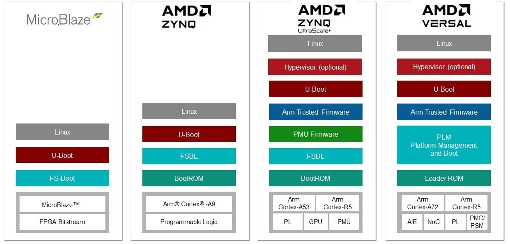

<a href="../docs-cn/README.md">简体中文</a> | <a href="../docs/README.md">English</a>

<table width="100%">
 <tr width="100%">
    <td align="center"><h1>エンベデッド デザインの資料</h1>
    </td>
 </tr>
</table>
ザイリンクスおよびそのエコシステム パートナーは、コンセプトからリリースまでを効率的で迅速に移行するエンベデッド ツールおよびランタイム環境を提供しています。ザイリンクス Zynq® SoC および Zynq UltraScale+ MPSoC デバイス、MicroBlaze™ プロセッサ コア、オープンソース オペレーティング システムやベアメタル ドライバーを含む Arm Cortex-M1/M3 マイクロ コントローラー、複数のランタイムとマルチ OS 環境、高度な統合開発環境、コンパイラ、デバッガー、およびプロファイリング ツールを使用したエンベデッド システムの作成に必要なすべてのコンポーネントが提供されます。

ザイリンクスから入手可能なエンベデッド ツールの詳細は、[ザイリンクス エンベデッド ソフトウェア インフラストラクチャ](https://www.xilinx.com/products/design-tools/embedded-software.html)を参照してください。

このリポジトリには、エンベデッド デザインの作成に関する情報が含まれます。含まれる資料は、次のとおりです。

# 入門チュートリアル

エンベデッド デザイン チュートリアルでは、ザイリンクス デバイスのエンベデッド フローの概要を示します。

 <table style="width:100%">
 <tr>
 <td align="center"><b>チュートリアル</b></td>
 <td align="center"><b>デバイス</b></td>
 <td align="center"><b>内容</b></td>
 </tr>
 <tr>
 <td align="center"><a href="Introduction/Versal-EDT/README.md">Versal ACAP (Adaptive Compute Acceleration Platform) (日本語版)</a></td>
 <td>Versal&trade; ACAP デバイス</td><td>Versal&trade; VMK180/VCK190 評価ボードにザイリンクス Vivado&reg; Design Suite フローを使用する方法について説明します。</td></tr>
<tr>
<td align="center"><a href="../docs/Introduction/ZynqMPSoC-EDT/README.md">Zynq UltraScale+ MPSoC エンベデッド デザイン チュートリアル (英語版)</a></td>
<td>Zynq&reg; UltraScale+&trade; MPSoC デバイス</td><td>Zynq UltraScale+ MPSoC デバイスにザイリンクス Vivado Design Suite フローを使用する方法について説明します。</td></tr>
<tr>
<td align="center"><a href="../docs/Introduction/Zynq7000-EDT/README.md">Zynq-7000 SoC エンベデッド デザイン チュートリアル (英語版)</a></td>
<td>Zynq-7000 SoC デバイス</td><td>Zynq-7000 SoC デバイスにザイリンクス Vivado Design Suite フローを使用する方法について説明します。</td></tr>
</table>

# 機能チュートリアル

<table style="width:100%">
<tr>
<td align="center"><b>ガイド</b></td>
<td align="center"><b>内容</b></td>
</tr>
<tr>
 <td align="center"><a href="../docs/Feature_Tutorials/README.MD">エンベデッド システムの高度な機能チュートリアル (英語版)</a></td>
 <td>ソフトウェア プロファイリングおよびデバッグ可能な FSBL を作成する例も含め、Vitis ソフトウェア プラットフォームの高度な機能を紹介します。</a></td></tr>
 </table>

# デバッグ ガイド

 <table style="width:100%">
<tr>
<td align="center"><b>ガイド</b></td>
<td align="center"><b>内容</b></td>
</tr>
<tr>
 <td align="center"><a href="../docs/Vitis-Embedded-Software-Debugging/README.md">Vitis エンベデッド ソフトウェア デバッグ ガイド (英語版)</a></td>
 <td>エンベデッド ソフトウェアのデバッグの具体例を紹介し、さまざまなザイリンクス デバッグ機能がどのように役立つかを説明します。</td></tr>
 </table>

# ユーザー ガイド

<table style="width:100%">
<tr>
<td align="center"><b>ガイド</b></td>
<td align="center"><b>内容</b></td>
</tr>
<tr>
 <td align="center"><a href="../docs/SPA-UG/README.md">Vitis 統合ソフトウェア プラットフォーム ユーザー ガイド: システム パフォーマンス解析 (英語版)</a></td>
 <td>パフォーマンス解析ツールボックスの技術的な詳細と、その利便性および機能を活用するための手法を説明します。</td></tr>
<tr>
 <td align="center"><a href="../docs/Performance_Benchmark/Dhrystone/README.md">Versal Dhrystone ベンチマーク ユーザー ガイド (英語版)</a></td>
 <td>Dhrystone ベンチマークのリファレンス デザインを生成し、Dhrystone アプリケーションを構築および実行する手順を示します。</td></tr></table>
 

この資料は 2022 年 2 月 9 日時点の表記バージョンの英語版を翻訳したもので、内容に相違が生じる場合には原文を優先します。資料によっては英語版の更新に対応していないものがあります。
日本語版は参考用としてご使用の上、最新情報につきましては、必ず最新英語版をご参照ください。

Copyright&copy; 2019-2021 Xilinx

