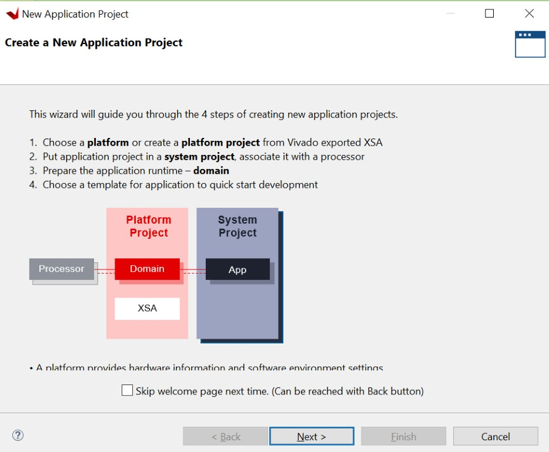
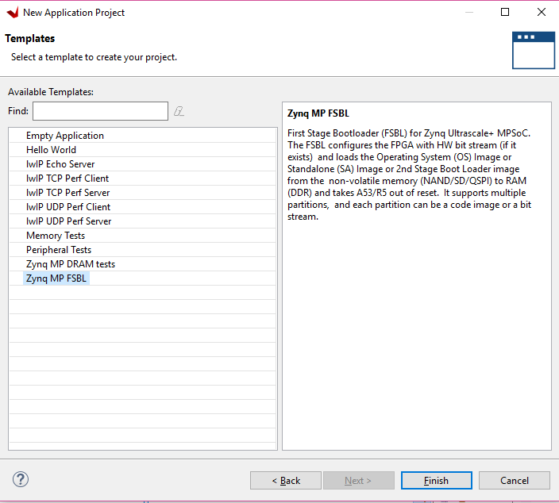
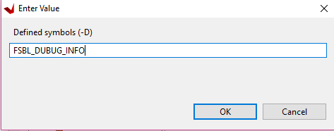
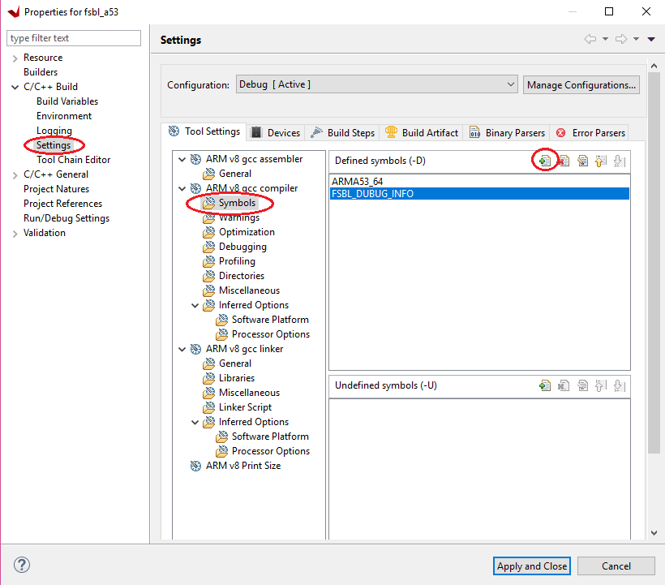

## Creating First Stage Boot Loader for Arm Cortex-A53-Based APU

 FSBL can load the required application or data to memory and launch
 applications on the target CPU core. One FSBL has been provided in the
 platform project but you can create an additional FSBL application as
 a general application for further modification or debugging purposes.

 In this example, you will create an FSBL image targeted for Arm™
 Cortex-A53 core 0.

1. Launch the Vitis IDE if it is not already open.

2. Set the workspace path based on the project you created in [Zynq UltraScale+ MPSoC Processing System Configuration](3-system-configuration.md). For example, `C:\\edt`.

3. Select **File → New → Application Project**. The New Project dialog
     box opens.

    

4. Use the information in the following table to make your selections
     in the New Project wizard:

   |  Screen       |  System Properties   |  Settings            |
   |----------------------|----------------------|----------------------|
   | Platform             | Select platform from repository | edt_zcu102_wrapper   |
   | Application project details | Application project name | fsbl_a53             |
   |                      | System project name  | fsbl_a53_system      |
   |                      | Target processor     | psu_cortexa53_0      |
   | Domain               | Domain               | standalone on        |
   |                      |                      | psu_cortexa53_0      |
   | Templates            | Available templates  | Zynq MP FSBL         |

5. In the Templates page, select **Zynq MP FSBL**.

    

6. Click **Finish**.

    The Vitis IDE creates the system project and the FSBL application.

    By default, the FSBL is configured to show basic print messages. Next,
    you will modify the FSBL build settings to enable debug prints. For a
    list of the possible debug options for FSBL, refer to the
    ``fsbl_a53/src/xfsbl_debug.h`` file.

For this example, enable FSBL_DEBUG_INFO by doing the following:

1. In the Explorer view, right-click the **fsbl_a53 application**.

2. Click **C/C++ Build Settings**.

3. Select **Settings → ARM V8 gcc compiler → Symbols**.

4. Click the **Add** button.

   

5. Enter FSBL_DEBUG_INFO.

   

    The symbols settings are as shown in the following figure.

    

6. Click **OK** to accept the changes and close the Settings view.

7. Navigate to the BSP settings. Under **Overview → Drivers → psu_cortexa53_0 → extra_compiler_flags**, edit **extra_compiler_flags** to append -Os -flto -ffat-lto- objects.

8. Right-click the **fsbl_a53** application and select **Build Project**.

9. The FSBL executable is now saved as ``fsbl_a53/debug/fsbl_a53.elf``.

    In this tutorial, the application name ``fsbl_a53`` is to identify that
    the FSBL is targeted for the APU (the Arm Cortex-A53 core).

    >**Note:** If the system design demands, the FSBL can be targeted to
    run on the RPU.

## Debugging FSBL Using the Vitis Debugger

 The FSBL is built with size optimization and link time optimization flags, that is -Os and LTO optimizations by default in the Vitis debugger. This reduces the memory footprint of FSBL. This needs to be disabled for debugging FSBL.

 Removing optimization can lead to increased code size, resulting in
 failure to build the FSBL. To disable the optimization (for
 debugging), some FSBL features that are not required need to be
 disabled in the ``xfsbl_config.h`` file of the FSBL.

 Now, create a new FSBL for this section instead of modifying the FSBL
 created in the [Build Software for PS Subsystems](4-build-sw-for-ps-subsystems.md). This is to avoid disturbing the FSBL_a53 project, which will be used extensively in rest of the chapters in
 this tutorial.

### Create and Modify FSBL

 Use the following steps to create an FSBL project.

1. Launch the Vitis debugger if it is not already open.

2. Set the Workspace path based on the project you created in [Build Software for PS Subsystems](4-build-sw-for-ps-subsystems.md). For example,
     C:\edt.

3. Select **File→ New → Application Project**. The New Project dialog
     box opens.

4. Use the information in the following table to make your selections
     in the New Project dialog box.

    *Table 8:* **Settings to Create FSBL_debug Project**

   |  Wizard Screen        |  System Properties    |  Settings     |
   |-----------------------|-----------------------|--------------------|
   | Platform              | Select platform from repository | edt_zcu102_wrapper |
   | Application project details  | Application project name  | fsbl_debug         |
   |                       | System project name   | fsbl_debug_system  |
   |                       | Target processor      | psu_cortexa53_0    |
   | Domain                | Domain                | psu_cortexa53_0    |
   | Templates             | Available templates   | Zynq MP FSBL       |

5. Click **Finish**.

    The Vitis debugger creates the System project and an FSBL application.
    Now disable Optimizations as shown below.

1. In the Explorer view, right-click the **fsbl_debug application**.

2. Click **C/C++ Build Settings**.

3. Select **Settings→ Tool Settings page→ Arm v8 gcc Compiler→ Miscellaneous**.

4. Remove `-flto -ffat-lto-objects` from other flags, as shown below.

    

    Similarly, the fsbl_debug_bsp needs to be modified to disable
    optimization.

5. Right-click **fsbl_debug_bsp** and select **Board Support Package
     Settings**.

6. Under **Overview → Drivers → psu_cortexa53_0 → extra_compiler_flags**, edit **extra_compiler_flags** to ensure
     extra compiler has this value `-g -Wall -Wextra -Os` as shown below.

    

7. Click **OK**, to save these settings. BSP rebuilds automatically
     after this.

8. Go to the **fsbl_debug→ src → fsbl_config.h file**. In the FSBL code
     include the options and disable the following:

    - `#define FSBL_NAND_EXCLUDE_VAL (1U)`

    - `#define FSBL_SECURE_EXCLUDE_VAL (1U)`

    - `#define FSBL_SD_EXCLUDE_VAL (1U)`

 >**Note:** '1' is disable and '0' is enable.

 At this point, FSBL is ready to be debugged.

 You can either debug the FSBL like any other standalone application (as shown in [Debugging Using XSCT](#debugging-using-xsct), or debug FSBL as a part of a Boot
 image by using the 'Attach to running target' mode of System Debugger.

© Copyright 2017-2021 Xilinx, Inc.

Licensed under the Apache License, Version 2.0 (the "License"); you may not use this file except in compliance with the License. You may obtain a copy of the License at

http://www.apache.org/licenses/LICENSE-2.0

Unless required by applicable law or agreed to in writing, software distributed under the License is distributed on an "AS IS" BASIS, WITHOUT WARRANTIES OR CONDITIONS OF ANY KIND, either express or implied. See the License for the specific language governing permissions and limitations under the License.