# Secure Boot

## Secure Boot Sequence

 The secure boot functionality in Zynq® UltraScale+™ MPSoC allows you to
 support the confidentiality, integrity, and authentication of partitions.
 Secure boot is accomplished by combining the Hardware Root of Trust
 (HWRoT) capabilities of the Zynq UltraScale+ device with the option of
 encrypting all boot partitions. The HWRoT is based on the RSA-4096
 asymmetric algorithm with SHA-3/384, which is hardware accelerated.
 Confidentiality is provided using 256-bit Advanced Encryption Standard Galois Counter Mode (AES-GCM). This section focuses on how to use and implement the following:

- Hardware Root of Trust with key revocation
- Partition encryption with differential power analysis (DPA) countermeasures
- Black key storage using the physically unclonable function (PUF)

 The section [Secure Boot System Design Decisions](#secure-boot-system-design-decisions) outlines high-level secure boot decisions which should be made early in design
 development. The [Hardware Root of Trust](#hardware-root-of-trust) section discusses the use of a Root of Trust (RoT) in boot. The [Boot Image Confidentiality and DPA](#boot-image- confidentiality-and-dpa) section discusses methods to use AES encryption.

 The [Boot Image Confidentiality and DPA](#boot-image-confidentiality-and-dpa) section discusses the use of the operational key and key rolling techniques as countermeasures to a DPA attack. Changing the AES key reduces the exposure of both the key and the data protected by the key.

 A red key is a key in unencrypted format. The [Black Key Storage](#black-key-storage) section provides a method for storing the AES key in encrypted, or black format. Black key storage uses the physically unclonable function (PUF) as a Key Encryption Key (KEK).

 The [Practical Methods in Secure Boot](#practical-methods-in-secure-boot) section provides steps to develop and test systems that use AES encryption and RSA authentication.

### Secure Boot System Design Decisions

The following are device level decisions affecting secure boot:

- Boot mode
- AES key storage location
- AES storage state (encrypted or unencrypted)
- Encryption and authentication requirements
- Key provisioning

 The boot modes which support secure boot are quad serial peripheral interface (QSPI), SD, eMMC, USB Boot, and NAND. The AES key is stored in either eFUSEs (encrypted or unencrypted), battery backed random access memory (BBRAM) (unencrypted only), or in external NVM (encrypted only).

 In Zynq UltraScale+ MPSoC devices, partitions can be encrypted and/or authenticated on a partition basis. Xilinx generally recommends that all partitions be RSA authenticated. Partitions that are open source (such as U-Boot and Linux) or that do not contain any proprietary or confidential information typically do not need to be encrypted. In systems in
 which there are multiple sources/suppliers of sensitive data and/or proprietary IP, encrypting the partitions using unique keys can be important.

 DPA resistance requirements are dictated by whether the adversary has physical access to the device.

 The following table can be a good reference when deciding on features required to meet a specific secure system requirement. The following sections discuss the features in more detail.


| System Consideration/          | Zynq UltraScale+ Feature  |
|-----------------------------------|--------------------------------|
|  Ensure that only the users software and hardware runs on the device      | HWRoT                         |
|  Guarantee that the users software and hardware are not modified        | HWR                         |
|  Ensure that an adversary cannot clone or reverse engineer software/hardware  | Boot Image Confidentiality    |
|  Protect sensitive data and proprietary Intellectual Property (IP)       | Boot Image Confidentiality     |
|  Ensure that Private Key (AES key) is protected against side channel attacks    | DPA Protections                |
|  Private/Secret keys (AES key) is stored encrypted at rest | Black Key Storage              |

#### Hardware Root of Trust

 Roots of trust are security primitives for storage (RTS), integrity
 (RTI), verification (RTV), measurement (RTM), and reporting (RTR). RoT
 consists of hardware, firmware, and software. The HWRoT has advantages
 over software RoTs because the HWRoT is immutable, has a smaller attack
 surface, and the behavior is more reliable.

 The HWRoT is based on the CSU, eFUSEs, BBRAM, and isolation elements.
 The HWRoT is responsible for validating that the operating environment
 and configuration have not been modified. The RoT acts as an anchor
 for boot, so an adversary cannot insert malicious code before
 detection mechanisms start.

 Firmware and software run on the HWRoT during boot. Zynq UltraScale+
 provides immutable bootROM code, a first stage boot loader, device
 drivers, and the XILSKEY and XILSECURE libraries which run on the
 HWRoT. These provide a well-tested, proven in use API so that
 developers do not create security components from scratch with limited
 testing.

##### Data Integrity

 Data integrity is the absence of corruption of hardware, firmware, and
 software. Data integrity functions verify that an adversary has not
 tampered with the configuration and operating environment.

 Zynq UltraScale+ verifies the integrity of partition(s) using both
 symmetric key (AES-GCM) and asymmetric key (RSA) authentication. RSA
 uses a private/public key pair. The fielded embedded system only has
 the public key. Theft of the public key is of limited value since it
 is not possible, with current technology, to derive the private key
 from the public key.

 Encrypted partitions are also authenticated using the Galois Counter
 Mode (GCM) mode of AES. In the secure boot flow, partitions are first
 authenticated and then decrypted if necessary.

##### Authentication

 The following figure shows RSA signing and verification of partitions.
 From a secure facility, the Bootgen tool signs partitions, using the
 private key. In the device, the ROM verifies the FSBL and either the
 FSBL or U-Boot verifies the subsequent partitions, using the public
 key.

 Primary and secondary private/public key pairs are used. The function
 of the primary private/ public key pair is to authenticate the
 secondary private/public key pair. The function of the secondary key
 is to sign/verify partitions.

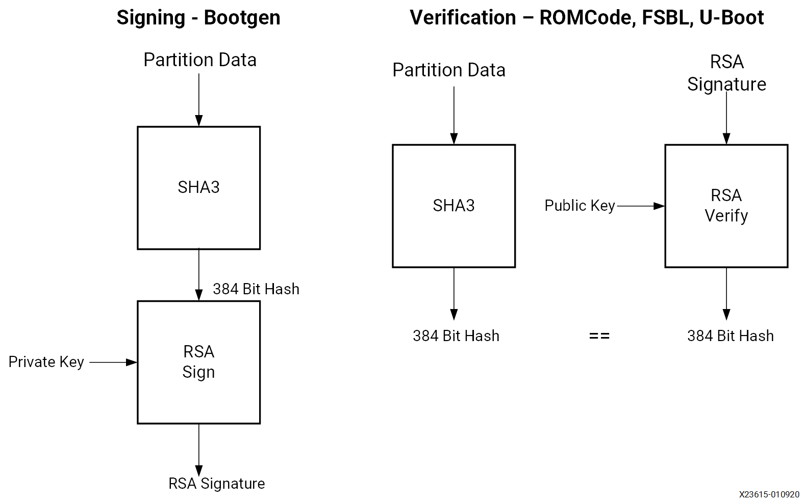

 To sign a partition, Bootgen first calculates the SHA3 of the
 partition data. The 384-bit hash is then RSA signed using the private
 key. The resulting RSA signature is placed in the authentication
 certificate. In the image, each signed partition has partition data
 followed by an authentication certificate which includes the RSA
 signature.

 Verification of the FSBL is handled by the CSU ROM code. To verify the
 subsequent partitions, the FSBL or U-Boot uses the XILSECURE library.

 There is a debug mode for authentication called boot header
 authentication. In this mode of authentication, the CSU ROM code does
 not check the primary public key digests, the session key ID or the
 key revocation bits stored in the device eFUSEs. Therefore, this mode
 is not secure. However, it is useful for testing and debugging as it
 does not require programming of eFUSEs.

 This tutorial uses this mode. However, fielded systems should not use
 boot header authentication. The example BIF file for a fully secured
 system is included at the end of this section.

#### Boot Image Confidentiality and DPA

 AES is used to ensure the confidentiality of sensitive data and IP. Zynq
 UltraScale+ uses AES Galois Counter Mode (GCM) and a 256 AES bit key. The principle AES enhancements provided by Zynq UltraScale+ are increased resistance to differential power analysis
 (DPA) attacks and the availability of AES encryption/decryption post
 boot.

 Bootgen and FSBL software support AES encryption. Private keys are
 used in AES encryption, and AES encryption is done by Bootgen using
 the key files. The key files can be generated by Bootgen or OpenSSL.
 The use of the operational key limits the exposure of the device key.
 The use of the operational key in key rolling is discussed in the next
 section. To maintain Boot image confidentiality, encrypted boot images
 can be created using Bootgen. Software examples to program keys to
 BBRAM and eFUSE are also available in the Vitis™ IDE. One such example
 is discussed in [Practical Methods in Secure Boot](#practical-methods-in-secure-boot).

**Note:** It is recommended that you generate your own keys for fielded systems and then provide those keys to the development tools.
Refer to AR [76171](https://www.xilinx.com/support/answers/76171.html) for details.

#### DPA Protections

 Key rolling is used for DPA resistance. Key rolling and black key
 store can be used in the same design. In key rolling, software and
 bitstream is broken up into multiple data blocks, each encrypted with
 a unique AES key. The initial key is stored in BBRAM or eFUSE NVM.
 Keys for successive data blocks are encrypted in the previous data
 block. After the initial key, the key update register is used as the
 key source.

 A 96-bit initialization vector is included in the NKY key file. The IV
 uses 96 bits to initialize AES counters. When key rolling is used, a
 128-bit IV is provided in the boot header. The 32 least significant
 bits define the block size of data to decrypt using the current key.
 The block sizes following the initial block defined in the IV are
 defined as attributes in the Bootgen Image Format (BIF) file.

 An efficient method of key rolling uses the operational key. With the
 operational key, Bootgen creates an encrypted secure header with the
 user-specified operational key and the first block IV. The AES key in
 eFUSE or BBRAM is used only to decrypt the 384-bit secure header with
 the 256-bit operational key. This limits the exposure of the device
 key to DPA attacks.

#### Black Key Storage

 The PUF enables storing the AES key in encrypted (black) format. The
 black key can be stored either in eFUSEs or in the boot header. When
 needed for decryption, the encrypted key in eFUSEs or the boot header
 is decrypted using the PUF generated key encrypting key (KEK).

 There are two steps in using the PUF for black key storage. In the
 first, PUF registration software is used to generate PUF helper data
 and the PUF KEK. The PUF registration data allows the PUF to
 re-generate the identical key each time the PUF generates the KEK. For
 more details on the use of PUF registration software, see [PUF Registration in Boot Header Mode](#puf-registration-in-boot-header-mode). For more information on
 PUF Registration - eFUSE mode, see *Programming BBRAM and eFUSEs*
 ([XAPP1319](https://www.xilinx.com/cgi-bin/docs/ndoc?t=application_notes%3Bd%3Dxapp1319-zynq-usp-prog-nvm.pdf)).

 The helper data and encrypted user key must both be stored in eFUSEs
 if the PUF eFUSE mode is used, and in the boot header if the PUF
 boot header mode is used. The procedure for the PUF boot header mode is
 discussed in [Using PUF in Boot Header Mode](#using-puf-in-boot-header-mode). For the procedure to use PUF in
 eFUSE mode, see *Programming BBRAM and eFUSEs*
 ([XAPP1319](https://www.xilinx.com/cgi-bin/docs/ndoc?t=application_notes%3Bd%3Dxapp1319-zynq-usp-prog-nvm.pdf)).

 This tutorial uses PUF boot header mode as it does not require
 programming of eFUSEs, and is therefore useful for test and debug.
 However, the most common mode is PUF eFUSE mode, as the PUB boot header
 mode requires a unique run of bootgen for each and every device. The
 example BIF file for a fully secured system is included at the end of
 the [Secure Boot Sequence](#secure-boot-sequence) section demonstrates
 the PUF eFUSE mode.

### Practical Methods in Secure Boot

 This section outlines the steps to develop secure boot in a Zynq
 UltraScale+ system. Producing a secure embedded system is a two-step
 process. In the first phase, the cryptographic keys are generated and
 programmed into NVM. In the second phase, the secure system is
 developed and tested. Both steps use the Vitis IDE to create software
 projects, generate the image, and program the image. For the second
 phase, a test system can be as simple as fsbl.elf and hello.elf files.
 In this section, you will use the same images used in [Boot Sequence for SD-Boot](#boot-sequence-for-sd-boot), but this time the images will be assembled together, and have the secure attributes enabled as part of the secure boot sequence.

 This section starts by showing how to generate AES and RSA keys.
 Following key generation, systems using the advanced AES and RSA
 methods are developed and tested. Keys generated in this section are
 also included in the ref_files directory.

 <!--TODO: resolve keys in ref_files directory-->

 The methods used to develop AES functionality are provided in the
 following sections:

- [Generating Keys for Authentication](#generating-keys-for-authentication)

- [Enabling Encryption Using Key Rolling](#enabling-encryption-using-key-rolling)

- [Enabling Use of an Operational Key](#enabling-use-of-an-operational-key)

- AES key in eFUSE

- [Using the PUF](#using-the-puf)

 [Creating RSA Private/Public Key Pairs](#creating-rsa-privatepublic-key-pairs) provides the steps to authenticate all partitions loaded at boot. This section also shows how to revoke keys.

 A requirement in the development of a secure system is to add security
 attributes which are used in image generation. Bootgen generates a
 Boot Image Format (BIF) file. The BIF file is a text file. In its
 simplest form, the BIF is a list of partitions to be loaded at boot.
 Security attributes are added to the BIF to specify cryptographic
 functionality. In most cases, the Bootgen GUI (Create Boot Image
 wizard) is used to generate the BIF file. In some cases, adding
 security attributes requires editing the Bootgen generated BIF file.
 In Create Boot Image Wizard in the Vitis IDE, after the Security tab
 is selected, the Authentication and Encryption tabs are used to
 specify security attributes.

 After implementing AES and RSA cryptography in secure boot, a boot
 test is done. The system loads successfully and displays the FSBL
 messages on the terminal. These messages indicate the cryptographic
 operations performed on each partition. [Debugging Problems with Secure Boot](#debugging-problems-with-secure-boot) provides the steps it is necessary to follow if the secure boot test fails.

#### Sample Design Overview

 The sample design demonstrates loading various types of images into
 the device. It includes loading a FSBL, PMU Firmware, U-Boot, Linux,
 RPU software and a PL configuration image. In this sample, all of
 these images are loaded by the FSBL which performs all authentication
 and decryption. This is not the only means of booting a system.
 However, it is the simple and secure method, as of 2019.1.

(./media/sample-design.png)

 Different sections within the boot image have different levels of
 security and are loaded into different locations. The following table
 explains the contents of the final boot image.

**Final Boot Image with Secure Attributes**

|  Binary     | RSA Authenticated |  AES Encrypted | Exception Level  | Loader        |
|-------------|-------------|-------------|-------------|-------------|
| FSBL        | Yes         | Yes         | EL3         | CSU ROM     |
| PMU Firmware        | Yes         | Yes         | NA          | FSBL        |
| PL Bitstream         | Yes         | Yes         | NA          | FSBL        |
| Arm Trusted Firmware (ATF) | Yes         | No          | EL3         | FSBL        |
| R5 Software | Yes         | Yes         | NA          | FSBL        |
| U-Boot      | Yes         | No          | EL2         | FSBL        |
| Linux       | Yes         | No          | EL1         | FSBL        |

>**Note:**
>
>1. In a secure boot sequence, the PMU image is loaded by the FSBL. Using the bootROM/CSU to load the PMU firmware introduces a security weakness as the key/IV combination is used twice: first to decrypt the FSBL, and then again to decrypt the PMU image. This is not allowed for the secure systems.
> 2. As of 2019.1, U-Boot does not perform a secure authenticated loading of Linux. Instead of U-Boot, FSBL loads the Linux images to a memory address and then uses U-Boot to jump to that memory address.

 This tutorial demonstrates assembling the binaries that are created
 using [System Design Examples](7-system-design-examples.md) in a boot image with all the security features enabled. This section also shows how a PL bitstream can be added as a
 part of the secure boot flow. Follow the information in this chapter until [Modifying the Build Settings](7-system-design-examples.md#modifying-the-build-settings) to create all the
 necessary files and then switch back.

 Enabling the security features in boot image is done in two different
 methods. In the first method, the BIF file is manually created
 using a text editor and then that BIF file is used to make Bootgen
 create keys. This enables you to identify the sections of the BIF file
 that are enabled which security features. The second method uses the
 Create Boot Image wizard in the Vitis IDE. It demonstrates the same
 set of security features and reuses the keys from the first method for
 convenience.

#### Generating Keys for Authentication

 There are multiple methods of generating keys. These include, but are
 not limited to, using Bootgen, customized key files, OpenSSL and
 hardware security modules (HSMs). This tutorial covers methods using
 bootgen. The Bootgen created files can be used as templates for
 creating files containing user-specified keys from the other key
 sources.

 The creation of keys using Bootgen commands requires the generation
 and modification of the BIF files. The key generation section of this
 tutorial creates these BIF files "by hand" using a text editor. The
 next section, building your boot image demonstrates how to create
 these BIF files using the Bootgen GUI (create Boot Image Wizard).

#### Creating RSA Private/Public Key Pairs

 For this example, you will create the primary and secondary keys in
 the PEM format. The keys are generated using Bootgen command-line
 options. Alternatively, you can create the keys using external tools such as OpenSSL.

 The following steps describe the process of creating the RSA
 private/public key pairs:

1. Launch the shell from the Vitis IDE.

2. Select **Xilinx → Vitis Shell**.

3. Create a file named `key_generation.bif`.

    >**Note:** The `key_generation.bif` file will be used to create both
    the asymmetric keys in these steps and the symmetric keys in later
    steps.

    ```
    the_ROM_image:
    {
    [pskfile]psk0.pem [sskfile]ssk0.pem
    [auth_params]spk_id = 0; ppk_select = 0 [fsbl_config]a53_x64
    [bootloader]fsbl_a53.elf [destination_cpu = pmu]pmufw.elf
    [destination_device = pl]edt_zcu102_wrapper.bit
    [destination_cpu = a53-0, exception_level = el-3, trustzone] bl31.elf
    [destination_cpu = r5-0]tmr_psled_r5.elf
    [destination_cpu = a53-0, exception_level = el-2]u-boot.elf [load =
    0x1000000, destination_cpu = a53-0]image.ub
    }
    ```

4. Save the `key_generation.bif` file in the C:\edt\secure_boot_sd\keys directory.

5. Copy all of the ELF, BIF, and UB files built in [System Design Examples](7-system-design-examples.md) to `C:\edt\secure_boot_sd\keys directory`.

6. Navigate to the folder containing the BIF file.

    `cd C:\edt\secure_boot_sd\keys`

7. Run the following command to generate the keys:

    `bootgen -p zu9eg -arch zynqmp -generate_keys auth pem -image key_generation.bif`

8. Verify that the files `psk0.pem` and `ssk0.pem` are generated at the location specified in the BIF file (`c:\edt\secure_boot_sd\keys`).

**Note:** 2020.3 (and previous) Bootgen fails to replace the old authentication key files with new authentication key files generated using the ``-generate_keys`` option. It is recommended that you check the existence and permissions of the target key files before generation. Refer to AR [76125](https://www.xilinx.com/support/answers/76125.html) for details.


##### Generating SHA3 of Public Key in an RSA Private/Public Key Pair

 The following steps are required only for RSA authentication in eFUSE mode, and can be skipped for RSA authentication in boot header mode. The 384 bits from ``sha3.txt`` can be programmed to eFUSE for RSA authentication in eFUSE mode. For more information, see _Programming BBRAM and eFUSEs_ ([XAPP1319](https://www.xilinx.com/cgi-bin/docs/ndoc?t=application_notes%3Bd%3Dxapp1319-zynq-usp-prog-nvm.pdf)).

1. Perform the steps from the prior section.

2. Now that the PEM files have been defined, add ``authentication = rsa`` attributes as shown below to `key_generation.bif`.

    ```
    the_ROM_image:
    {
    [pskfile]psk0.pem [sskfile]ssk0.pem
    [auth_params]spk_id = 0; ppk_select = 0 [fsbl_config]a53_x64
    [bootloader, authentication = rsa]fsbl_a53.elf [destination_cpu = pmu,
    authentication = rsa]pmufw.elf
    [destination_device = pl, authentication = rsa]edt_zcu102_wrapper.bit
    [destination_cpu = a53-0, exception_level = el-3, trustzone,
    authentication = rsa]bl31.elf
    [destination_cpu = r5-0, authentication = rsa]tmr_psled_r5.elf
    [destination_cpu = a53-0, exception_level = el-2, authentication = rsa]uboot.
    elf
    [load = 0x1000000, destination_cpu = a53-0, authentication = rsa]image.ub
    }
    ```

3. Use the ``bootgen`` command to calculate the hash of the PPK:

    `bootgen -p zcu9eg -arch zynqmp -efuseppkbits ppk0_digest.txt -image key_generation.bif`

4. Verify that the file `ppk0_digest.txt` is generated at the location specified (`c:\edt\secure_boot_sd\keys`).

##### Additional RSA Private/Public Key Pairs

 Follow the steps in this section to generate the secondary RSA private/public key
 pair required for key revocation, which requires the programming of eFUSE.
 For more information, see _Programming BBRAM and eFUSEs_ ([XAPP1319](https://www.xilinx.com/cgi-bin/docs/ndoc?t=application_notes%3Bd%3Dxapp1319-zynq-usp-prog-nvm.pdf)). You can skip this section if you do not intend to use key revocation.

 Repeat the steps from [Creating RSA Private/Public Key Pairs](#creating-rsa-privatepublic-key-pairs) and [Generating SHA3 of Public Key in an RSA Private/Public Key Pair](#generating-sha3-of-public-key-in-an-rsa-privatepublic-key-pair) to generate the second RSA private/public key pair and the SHA3 of the second PPK.

1. Perform the steps from the prior section, replacing
     `psk0.pem`, `ssk0.pem`, and `ppk0_digest.txt` with `psk1.pem`, `ssk1.pem`,
     and `ppk1_digest.pem` respectively. Save this file as
     `key_generation_1.bif`. That BIF file will look like the following:  

    ```
    the_ROM_image:
    {
    [pskfile]psk1.pem [sskfile]ssk1.pem
    [auth_params]spk_id = 1; ppk_select = 1 [fsbl_config]a53_x64
    [bootloader]fsbl_a53.elf [destination_cpu = pmu]pmufw.elf
    [destination_device = pl]edt_zcu102_wrapper.bit
    [destination_cpu = a53-0, exception_level = el-3, trustzone]bl31.elf
    [destination_cpu = r5-0]tmr_psled_r5.elf
    [destination_cpu = a53-0, exception_level = el-2]u-boot.elf [load =
    0x1000000, destination_cpu = a53-0]image.ub
    }
    ```

2. Run the ``bootgen`` command to create the RSA private/public key pairs.

    `bootgen -p zu9eg -arch zynqmp -generate_keys auth pem -image key_generation_1.bif`

3. Add ``authentication = rsa`` attributes to the `key_generation_1.bif` file. The BIF file will look like the following:

    ```
    the_ROM_image:
    {
    [pskfile]psk1.pem [sskfile]ssk1.pem
    [auth_params]spk_id = 1; ppk_select = 1 [fsbl_config]a53_x64
    [bootloader, authentication = rsa]fsbl_a53.elf
    [destination_cpu = pmu, authentication = rsa]pmufw.elf
    [destination_device = pl, authentication = rsa]edt_zcu102_wrapper.bit
    [destination_cpu = a53-0, exception_level = el-3, trustzone,
    authentication = rsa]bl31.elf
    [destination_cpu = r5-0, authentication = rsa]tmr_psled_r5.elf
    [destination_cpu = a53-0, exception_level = el-2, authentication = rsa]uboot.
    elf [load = 0x1000000, destination_cpu = a53-0, authentication =
    rsa]image.ub
    }
    ```

4. Run the ``bootgen`` command to generate the hash of the primary RSA public key.

    `bootgen -p zcu9eg -arch zynqmp -efuseppkbits ppk1_digest.txt -image key_generation_1.bif`

5. Verify that the files `ppk1.pem`, `spk1.pem`, and `ppk1_digest.txt` are all generated at the location specified (`c:\edt\secure_boot\keys`).

##### Enabling Boot Header Authentication

 Boot header authentication is a mode of authentication that instructs
 the ROM to skip the checks of the eFUSE hashes for the PPKs, the
 revocation status of the PPKs, and the session IDs for the secondary
 keys. This mode is useful for testing and debugging because it does not
 require programming of eFUSEs. This mode can be permanently disabled
 for a device by programming the RSA_EN eFUSEs, which forces RSA
 authentication with the eFUSE checks. Fielded systems should use the
 RSA_EN eFUSE to force the eFUSE checks and disable boot header
 authentication.

 Add the `bh_auth_enable` attribute to the ``[fsbl_config]`` line so that
 the BIF file appears as follows:

```
the_ROM_image:
{
[pskfile]psk0.pem [sskfile]ssk0.pem
[auth_params]spk_id = 0; ppk_select = 0 [fsbl_config]a53_x64,
bh_auth_enable [bootloader, authentication = rsa]fsbl_a53.elf
[destination_cpu = pmu, authentication = rsa]pmufw.elf [destination_device
= pl, authentication = rsa]edt_zcu102_wrapper.bit
[destination_cpu = a53-0, exception_level = el-3, trustzone, authentication
= rsa]bl31.elf
[destination_cpu = r5-0, authentication = rsa]tmr_psled_r5.elf
[destination_cpu = a53-0, exception_level = el-2, authentication = rsa]uboot.
elf [load = 0x1000000, destination_cpu = a53-0, authentication =
rsa]image.ub
}
```

#### Generating Keys for Confidentiality

 Image confidentiality is discussed in the [Boot Image Confidentiality and
 DPA](#boot-image-confidentiality-and-dpa) section. In this section you
 will modify the BIF file from the authentication section by adding
 the attributes required to enable image confidentiality, using the
 AES-256-GCM encryption algorithm. At the end, a ``bootgen`` command will
 be used to create all of the required AES-256 keys.

##### Using AES Encryption

1. Enable image confidentiality by specifying the key source for the
     initial encryption key (``bbram_red_key`` for now) using the
     ``[keysrc_encryption]`` `bbram_red_key` attribute.

2. On several of the partitions, enable confidentiality by adding the ``encryption = aes`` attribute. Specify a unique key file for each partition. Having a unique key file for each partition allows each partition to use a unique set of keys which increases security strength by not reusing keys and reducing the amount of information encrypted on any one key. The `key_generation.bif` file should now look as follows:

        ```
        the_ROM_image:
        {
        [pskfile]psk0.pem [sskfile]ssk0.pem
        [auth_params]spk_id = 0; ppk_select = 0 [keysrc_encryption]bbram_red_key
        [fsbl_config]a53_x64, bh_auth_enable
        [bootloader, authentication = rsa, encryption = aes, aeskeyfile = fsbl_a53.nky]fsbl_a53.elf
        [destination_cpu = pmu, authentication = rsa, encryption = aes, aeskeyfile = pmufw.nky]pmufw.elf
        [destination_device = pl, authentication = rsa, encryption = aes, aeskeyfile = edt_zcu102_wrapper.nky]edt_zcu102_wrapper.bit
        [destination_cpu = a53-0, exception_level = el-3, trustzone, authentication = rsa]bl31.elf
        [destination_cpu = r5-0, authentication = rsa, encryption = aes,aeskeyfile = tmr_psled_r5.nky]tmr_psled_r5.elf
        [destination_cpu = a53-0, exception_level = el-2, authentication = rsa]uboot.elf
        [load = 0x1000000, destination_cpu = a53-0, authentication = rsa]image.ub
        }
        ```

##### Enabling DPA Protections

 This section provides the steps for using an operational key, and also demonstrates key
 rolling effective countermeasures against differential power analysis (DPA).

##### Enable Use of an Operational Key

 Use of an operational key limits the amount of information encrypted
 using a device key. Enable use of the operational key by adding the
 ``opt_key`` attribute to the ``[fsbl_config]`` line of the BIF file. The
 ``key_generation.bif`` file should now appear as shown below:

```the_ROM_image:
{
[pskfile]psk0.pem [sskfile]ssk0.pem
[auth_params]spk_id = 0; ppk_select = 0 [keysrc_encryption]bbram_red_key
[fsbl_config]a53_x64, bh_auth_enable, opt_key
[bootloader, authentication = rsa, encryption = aes, aeskeyfile = fsbl_a53.nky]fsbl_a53.elf
[destination_cpu = pmu, authentication = rsa, encryption = aes, aeskeyfile = pmufw.nky]pmufw.elf
[destination_device = pl, authentication = rsa, encryption = aes, aeskeyfile = edt_zcu102_wrapper.nky]edt_zcu102_wrapper.bit
[destination_cpu = a53-0, exception_level = el-3, trustzone, authentication = rsa]bl31.elf
[destination_cpu = r5-0, authentication = rsa, encryption = aes, aeskeyfile = tmr_psled_r5.nky]tmr_psled_r5.elf
[destination_cpu = a53-0, exception_level = el-2, authentication = rsa]uboot.elf
[load = 0x1000000, destination_cpu = a53-0, authentication = rsa]image.ub
}
```

##### Enabling Encryption Using Key Rolling

 Use of key rolling limits the amount of information encrypted using
 any of the other keys. Key rolling is enabled on a partition-by-partition basis using the blocks attribute in the BIF file. The blocks attribute allows you to specify the amount of information
 in bytes to encrypt with each key. For example, blocks=4096,1024(3),512(\*) would use the first key for 4096 bytes, the second through fourth keys for 1024 bytes, and all remaining keys
 for 512 bytes. In this example, the block command will be used to limit the life of each key to 1728 bytes.

 Enable use of key rolling by adding the ``blocks`` attribute to each
 of the encrypted partitions. The ``key_generation.bif`` file should appear as shown below:

```
the_ROM_image:
{
[pskfile]psk0.pem
[sskfile]ssk0.pem
[auth_params]spk_id = 0; ppk_select = 0
[keysrc_encryption]bbram_red_key
[fsbl_config]a53_x64, bh_auth_enable, opt_key
[bootloader, authentication = rsa, encryption = aes, aeskeyfile = fsbl_a53.nky, blocks = 1728(*)]fsbl_a53.elf
[destination_cpu = pmu, authentication = rsa, encryption = aes,aeskeyfile = pmufw.nky, blocks = 1728(*)]pmufw.elf
[destination_device = pl, authentication = rsa, encryption = aes,aeskeyfile = edt_zcu102_wrapper.nky, blocks = 1728(*)]edt_zcu102_wrapper.bit
[destination_cpu = a53-0, exception_level = el-3, trustzone, authentication = rsa]bl31.elf
[destination_cpu = r5-0, authentication = rsa, encryption = aes, aeskeyfile = tmr_psled_r5.nky, blocks = 1728(*)]tmr_psled_r5.elf
[destination_cpu = a53-0, exception_level = el-2, authentication = rsa]uboot.elf
[load = 0x1000000, destination_cpu = a53-0, authentication = rsa]image.ub
}
```

##### Generating All of the AES Keys

 When all the desired encryption features have been enabled, you can
 generate all key files by running Bootgen. Some of the source files
 (for example, ELF) contain multiple sections. These individual
 sections will be mapped to separate partitions, and each partition
 will have a unique key file. In this case, the key file will be
 appended with a ".1.". For example, if the `pmu_fw.elf` file contains
 multiple sections, both a `pmu_fw.nky` and a `pmu_fw.1.nky` file will be
 generated.

1. Create all of the necessary NKY files by running the ``bootgen`` command
     that creates the final `BOOT.bin` image.

    `bootgen -p zcu9eg -arch zynqmp -image key_generation.bif`

2. Verify that the NKY files were generated. These file should include `edt_zcu102_wrapper.nky, fsbl_a53.nky, pmu_fw.nky, pmu_fw.1.nky, pmu_fw.2.nky, tmr_psled_r5.nky, and tmr_psled_r5.1.nky.`

### Using Key Revocation

 Key revocation allows you to revoke a RSA primary or secondary public
 key. Key revocation can be used due to elapsed time of key use, or if
 there is an indication that the key is compromised. The primary and
 secondary key revocation is controlled by one-time programmable eFUSEs.
 The Xilinx Secure Key Library is used for key revocation, allowing key
 revocation in fielded devices. Key revocation is discussed further in the _Zynq UltraScale+ Device Technical Reference Manual_ ([UG1085](https://www.xilinx.com/cgi-bin/docs/ndoc?t=user_guides%3Bd%3Dug1085-zynq-ultrascale-trm.pdf)).

#### Using the PUF

 In this section, the PUF is used for black key storage in the PUF boot header mode. RSA authentication is required when the PUF is used. In PUF boot header mode, the PUF helper data and the encrypted user\'s AES key are stored in the boot header. This section shows how to create
 a BIF for using the PUF. Because the helper data and encrypted user key are unique for each and every board, the Bootgen image created only works on the board from which the helper data originated.

 At the end of the [Secure Boot Sequence](#secure-boot-sequence) section, a different BIF file demonstrates using the PUF in eFUSE mode. In PUF eFUSE mode, the PUF helper data and encrypted user\'s AES key are stored in eFUSEs. In PUF eFUSE mode, a single boot image can be used across all boards.

#### PUF Registration in Boot Header Mode

 The PUF registration software is included in the XILSKEY library. The PUF registration software operates in a boot header mode or eFUSE mode. The boot header mode allows development without programming the OTP eFUSEs. The eFUSE mode is used in production. This lab runs through PUF registration in boot header mode only. For PUF registration using eFUSE, see _Programming BBRAM and eFUSEs_ ([XAPP1319](https://www.xilinx.com/cgi-bin/docs/ndoc?t=application_notes%3Bd%3Dxapp1319-zynq-usp-prog-nvm.pdf)).

 The PUF registration software accepts a red (unencrypted) key as input, and produces syndrome data (helper data), which also contains CHASH and AUX, and a black (encrypted) key. When the PUF boot header mode is used, the output is put in the boot header. When the PUF eFUSE mode is used, the output is programmed into eFUSEs.

1. In the Vitis IDE, navigate to tmr_psled_r5 Board Support Package Settings.

2. Ensure that the xilskey and the xilsecure libraries are enabled.

     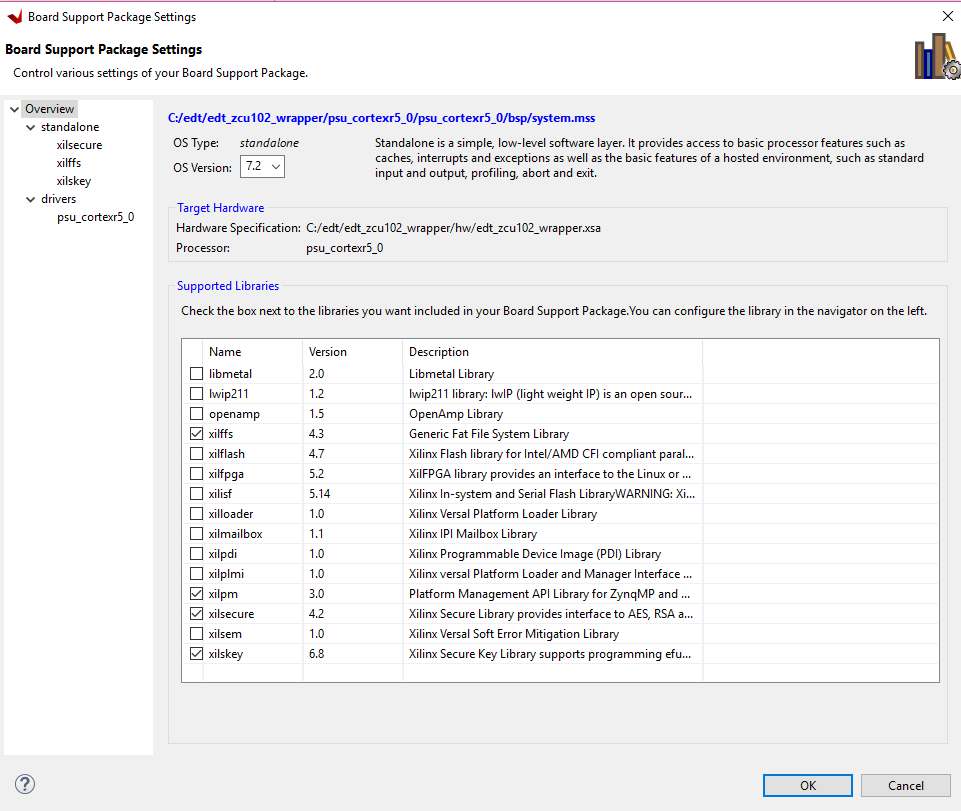

3. Click **OK**. Rebuild the hardware platform for changes to apply. Navigate to tmr_psled_r5_bsp settings.

4. Scroll to the Libraries section. Click **xilskey 6.8 Import Examples**.

5. In the view, select **xilskey_puf_registration example**. Click **OK**.

    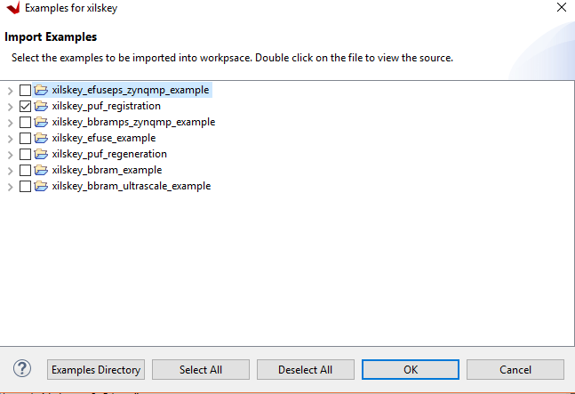

6. In the Project Explorer view, verify that the xilskey_puf_example_1 application is created.

7. In the Project Explorer view, xilskey_puf_example_1 'Src', double-click **xilskey_puf_registration.h** to open it in the Vitis IDE.

8. Edit xilskey_puf_registration.h as follows:

    1. Change ``\#define XSK_PUF_INFO_ON_UART`` from ``FALSE`` to ``TRUE``.

    2. Ensure that ``\#define XSK_PUF_PROGRAM_EFUSE`` is set to ``FALSE``.

    3. Set ``XSK_PUF_AES_KEY`` (256-bit key).

        The key must be entered in hex format and should be Key 0 from the
        ``fsbl_a53.nky`` file that you generated in [Generating All of the AES Keys](#generating-all-of-the-aes-keys). You can find a sample key
        below:

        ```
        #define XSK_PUF_AES_KEY
        "68D58595279ED1481C674383583C1D98DA816202A57E7FE4F67859CB069CD510"
        ```

        >**Note:** Do not copy this key. Refer to the ``fsbl_a53.nky`` file for
        your key.

    4. Set the ``XSK_PUF_BLACK_KEY_IV``. The initialization vector IV is a 12-byte piece of data of your choice.

        `#define XSK_PUF_BLACK_KEY_IV \"E1757A6E6DD1CC9F733BED31\"`

        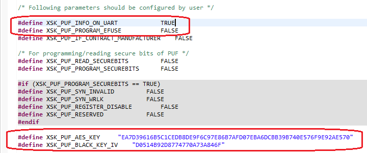

9. Save the file and exit.

10. In the Project Explorer view, right-click the **xilskey_puf_example_1** project and select **Build Project**.

11. In the Vitis IDE, select **Xilinx → Create Boot Image**.

12. Select **Zynq MP** in the Architecture view.

13. Specify the BIF path in the Output BIF file path view as `C:\edt\secureboot_sd\puf_registration\puf_registration.bif`.

14. Specify the output path in the Output Path view as `C:\edt\secureboot_sd\puf_registration\BOOT.bin`.

15. In the Boot Image Partitions pane, click **Add**. Add the partitions and set the destination CPU of the xilskey_puf_example_1 application to R5-0:

    ```
    C:\edt\fsbl_a53\Debug\fsbl_a53.elf
    C:\edt\xilskey_puf_example_1\Debug\xilskey_puf_example_1.elf
    ```

16. Click **Create Image** to create the boot image for PUF
     registration.

    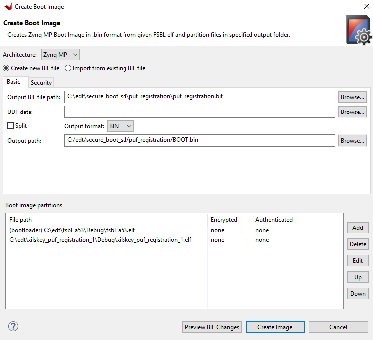

17. Insert an SD card into the PC SD card slot.

18. Copy `C:\edt\secureboot_sd\puf_registration\BOOT.bin` to the SD card.

19. Move the SD card from the PC SD card slot to the ZCU102 card slot.

20. Start a terminal session using Tera Term or Minicom depending on the
     host machine being used, as well as the COM port and baud rate for
     your system.

21. In the communication terminal menu bar, select **File → Log**. Enter
     `C:\edt\secureboot_sd\puf_registration\puf_registration.log` in the view.

22. Power cycle the board.

23. After the puf_registration software has run, exit the communication
     terminal.

24. The `puf_registration.log` file is used in [Using PUF in Boot Header Mode](#using-puf-in-boot-header-mode). Open `puf_registration.log` in a text editor.

25. Save the PUF Syndrome data that starts after ``App PUF Syndrome data Start!!!`` and ends at ``PUF Syndrome data End!!!``, non-inclusive, to a file named `helperdata.txt`.

26. Save the black key IV identified by ``App: Black Key IV`` to a file named `black_iv.txt`.

27. Save the black key to a file named `black_key.txt`.

28. The files `helperdata.txt`, `black_key.txt`, and `black_iv.txt` can be saved in `C:\edt\secure_boot_sd\keys`.

##### Using PUF in Boot Header Mode

The following steps describe the process to update the BIF file from the previous sections to include using the PUF in Boot Header mode. This section makes use of the syndrome data and black key created during PUF registration process.

1. Enable use of the PUF by adding all of the fields and attributes indicated in bold to the BIF file (`key_generation.bif`) as shown below.

    ```
    the_ROM_image:
    {
    [pskfile]psk0.pem
    [sskfile]ssk0.pem
    [auth_params]spk_id = 0; ppk_select = 0
    [keysrc_encryption]bh_blk_key
    [bh_key_iv]black_iv.txt
    [bh_keyfile]black_key.txt
    [puf_file]helperdata.txt
    [fsbl_config]a53_x64, bh_auth_enable, opt_key, puf4kmode, shutter=0x0100005E,pufhd_bh
    [bootloader, authentication = rsa, encryption = aes, aeskeyfile = fsbl_a53.nky, blocks = 1728(*)]fsbl_a53.elf
    [destination_cpu = pmu, authentication = rsa, encryption = aes, aeskeyfile = pmufw.nky, blocks = 1728(*)]pmufw.elf
    [destination_device = pl, authentication = rsa, encryption = aes, aeskeyfile = edt_zcu102_wrapper.nky, blocks = 1728(*)]edt_zcu102_wrapper.bit
    [destination_cpu = a53-0, exception_level = el-3, trustzone, authentication = rsa]bl31.elf
    [destination_cpu = r5-0, authentication = rsa, encryption = aes, aeskeyfile = tmr_psled_r5.nky, blocks =1728(*)]tmr_psled_r5.elf
    [destination_cpu = a53-0, exception_level = el-2, authentication = rsa]uboot.elf
    [load = 0x1000000, destination_cpu = a53-0, authentication = rsa]image.ub
    }
    ```

2. The above BIF file can be used for creating a final boot image using an AES key encrypted in the boot image header with the PUF KEK. This should be done using the following ``bootgen`` command:

    `bootgen -p zcu9eg -arch zynqmp -image key_generation.bif -w -o BOOT.bin`

 >**Note:** The above steps can also be executed with PUF in eFUSE mode. In this case, repeat the previous steps using the PUF in eFUSE mode. This requires enabling the programming of eFUSEs during PUF registration by setting the ``XSK_PUF_PROGRAM_EFUSE`` macro in the ``xilskey_puf_registration.h`` file used to build the PUF registration application. The BIF must also be modified to use the encryption key from eFUSE, and the helper data and black key files should be removed. PUF in eFUSE mode is not covered in this tutorial to avoid programming the eFUSEs on development or tutorial systems.

 ```
 [keysrc_encryption]efuse_blk_key
 [bh_key_iv]black_iv.txt
 ```

 ##### System Example Using the Vitis IDE Create Boot Image Wizard

 The previous sections enabled the various security features (authentication, confidentiality, DPA protections, and black key storage) by hand editing the BIF file. This section performs the same operations, but uses the Bootgen Wizard as a starting point. The Bootgen Wizard creates a base BIF file, and then adds the additional security features that are not supported by the wizard using a text editor.

1. Change directory to the ``bootgen_files`` directory.

    `cd C:\edt\secure_boot_sd\bootgen_files`

2. Copy the below data from the previous example to this example.

    ```
    cp ../keys/*nky .
    cp ../keys/*pem .
    cp ../keys/black_iv.txt .
    cp ../keys/helperdata.txt .
    cp ../keys/*.elf .
    cp ../keys/edt_zcu102_wrapper.bit .
    cp ../keys/image.ub .
    cp ../keys/black_key.txt.
    ```

3. Click **Programs → Xilinx Design Tools → Vitis 2020.2 → Xilinx Vitis 2020.2** to launch the Vitis IDE.

4. Click **Xilinx Tools → Create Boot Image** from the menu bar to launch the Create Boot Image wizard.

5. Select Zynq MP as the Architecture.

6. Enter the Output BIF file path as `C:\edt\secure_boot_sd\bootgen_files\design_bh_bkey_keyrolling.bif`.

7. Select BIN as the output format.

8. Enter the output path `C:\edt\secure_boot_sd\bootgen_files\BOOT.bin`.

9. Enable authentication.

    1. Click the **Security** page.

    2. Check the Use Authentication check box.

    3. Browse to select the **psk0.pem** file for the PSK and the **ssk0.pem** for the SSK.

    4. Ensure PPK select is 0.

    5. Enter SPK ID as 0.

    6. Check the **Use BH Auth** check box.

        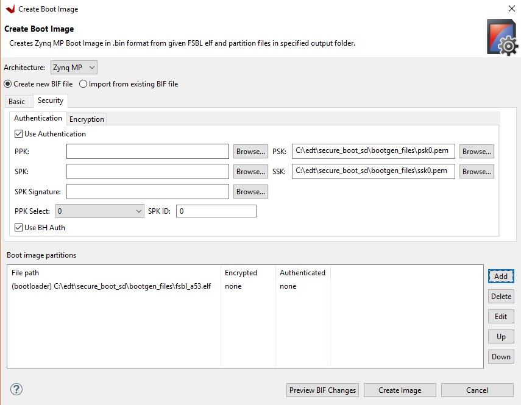

10. Enable encryption.

    1. Click the **Encryption** page.

    2. Check the **Use Encryption** check box.

    3. Provide the part name as **zcu9eg**.

    4. Check the **Operational Key** check box.

        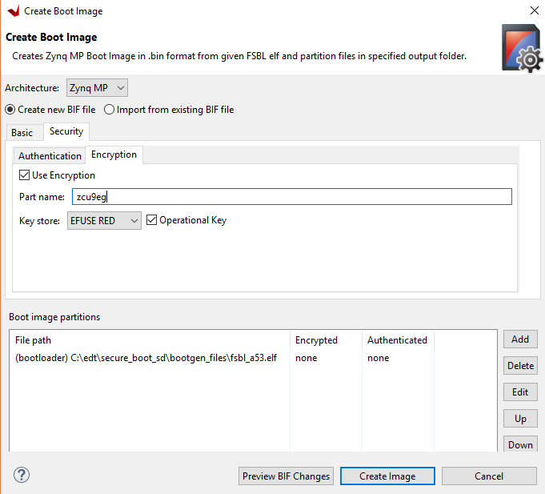

11. Click the **Basic** page.

12. Add the FSBL binary to the boot image.

    1. Click **Add**.

    2. Use the browse button to select the **fsbl_a53.elf** file.

    3. Make sure the partition type is **bootloader** and the destination CPU is **a53x64**.

    4. Change the authentication to **RSA**.

    5. Change the encryption to **AES**.

    6. Browse to the **fsbl_a53.nky** file that was generated earlier and add the key file.

    7. Click **OK**.

        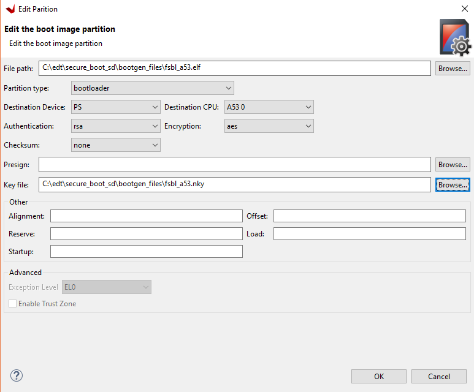

13. Add the PMU firmware binary to the boot image.

    1. Click **Add**.

    2. Use the browse button to select the **pmufw.elf** file.

    3. Make sure the partition type is **datafile**.

    4. Change the destination CPU to **PMU**.

    5. Change the authentication to **RSA**.

    6. Change the encryption to **AES**.

    7. Add the **pmufw.nky** file as the key file.

    8. Click **OK**.

        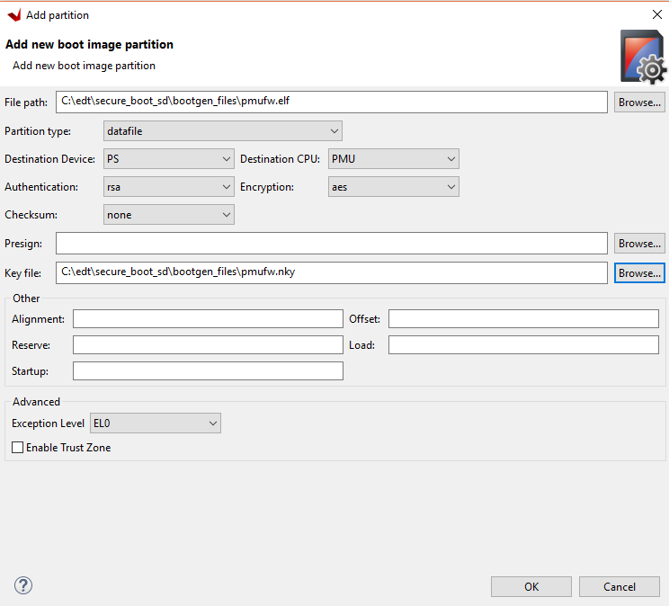

14. Add the PL bitstream to the boot image.

    1. Click the **Add**.

    2. Use the browse button to select the **edt_zcu102_wrapper.bit** file.

    3. Make sure the partition type is **datafile**.

    4. Make sure the destination device is **PL**.

    5. Change the authentication to **RSA**.

    6. Change the encryption to **AES**.

    7. Add the **edt_zcu102_wrapper.bit** file as the key file.

    8. Click **OK**.

        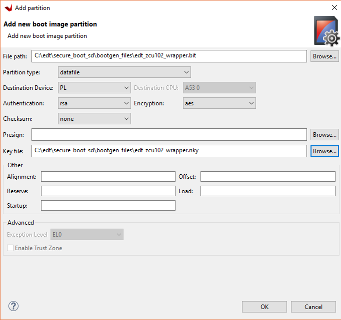

15. Add the Arm Trusted Firmware (ATF) binary to the image.

    1. Click **Add**.

    2. Use the browse button to select the **bl31.elf** file.

    3. Make sure the partition type is **datafile**.

    4. Make sure the destination CPU is **A53 0**.

    5. Change the authentication to **RSA**.

    6. Make sure the encryption is **none**.

    7. Make sure the exception level is **EL3** and click **Enable TrustZone**.

    8. Click **OK**.

        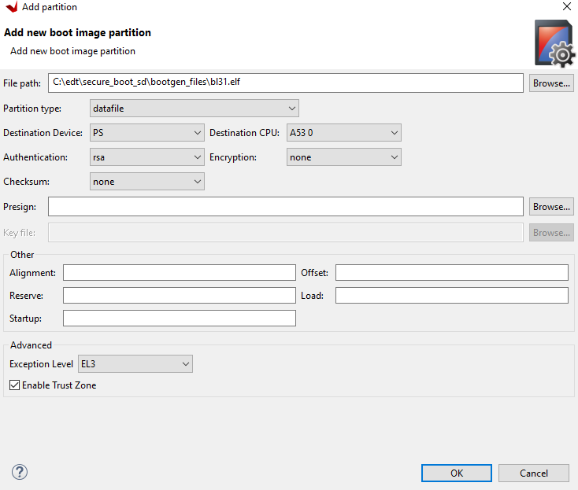

16. Add the R5 software binary to the boot image.

    1. Click **Add**.

    2. Use the browse button to select the **tmr_psled_r5.elf** file.

    3. Make sure the partition type is **datafile**.

    4. Make sure the destination CPU is **R5 0**.

    5. Change the authentication to **RSA**.

    6. Change the encryption to **AES**.

    7. Add the **tmr_psled_r5.nky** file as the key file.

    8. Click **OK**.

        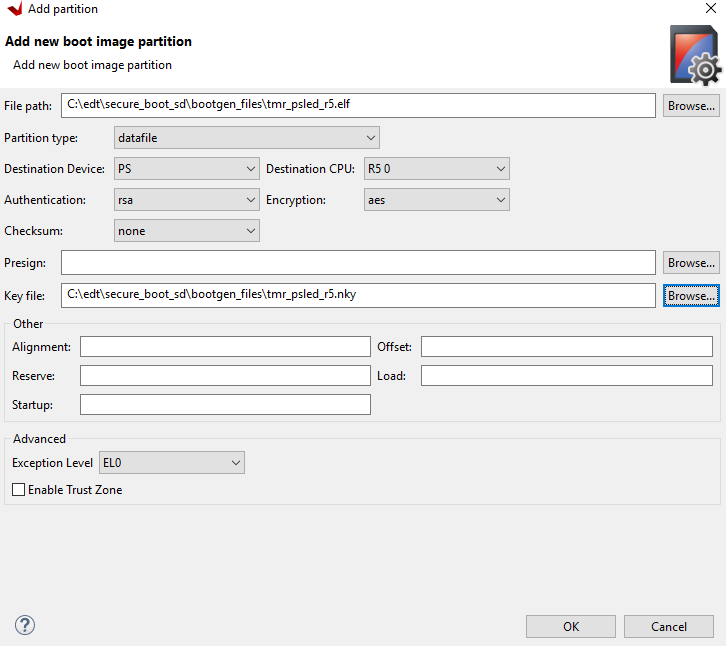

17. Add the U-Boot software binary to the boot image.

    a. Click **Add**.

    b. Use the browse button to select the **u-boot.elf** file.

    c. Make sure the partition type is **datafile**.

    d. Make sure the destination CPU is **A53 0**.

    e. Change the authentication to **RSA**.

    f. Make sure that encryption is **none**.

    g. Change the exception level to **EL2**.

    h. Click **OK**.

         

18. Add the Linux image to the boot image.

    1. Click **Add**.

    2. Use the browse button to select the **image.ub** file.

    3. Make sure the partition type is **datafile**.

    4. Make sure the destination CPU is **A53 0**.

    5. Change the authentication to **RSA**.

    6. Make sure that the encryption is **none**.

    7. Update the load field to **0x2000000**.

    8. Click **OK**.

        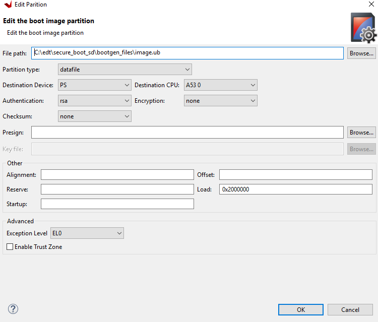

19. Click **Create image**.

    

20. The `design_bh_bkey_keyrolling.bif` file should look similar to the following:

    ```
    //arch = zynqmp; split = false; format = BIN; key_part_name = zcu9eg
    the_ROM_image:
    {
    [pskfile]C:\edt\secure_boot_sd\bootgen_files\psk0.pem
    [sskfile]C:\edt\secure_boot_sd\bootgen_files\ssk0.pem
    [auth_params]spk_id = 0; ppk_select = 0
    [keysrc_encryption]efuse_red_key
    [fsbl_config]bh_auth_enable, opt_key
    [bootloader, encryption = aes, authentication = rsa, aeskeyfile = C:\edt\secure_boot_sd\bootgen_files\fsbl_a53.nky]C:\edt\secure_boot_sd
    \bootgen_files\fsbl_a53.elf
    [encryption = aes, authentication = rsa, aeskeyfile = C:\edt\secure_boot_sd\bootgen_files\pmufw.nky, destination_cpu = pmu]C:\edt\secure_boot_sd\bootgen_files\pmufw.elf
    [encryption = aes, authentication = rsa, aeskeyfile = C:\edt\secure_boot_sd\bootgen_files\edt_zcu102_wrapper.nky, destination_device = pl]C:\edt\secure_boot_sd\bootgen_files\edt_zcu102_wrapper.bit
    [authentication = rsa, destination_cpu = a53-0, exception_level = el-3, trustzone]C:\edt\secure_boot_sd\bootgen_files\bl31.elf
    [encryption = aes, authentication = rsa, aeskeyfile = C:\edt\secure_boot_sd\bootgen_files\tmr_psled_r5.nky, destination_cpu =
    r5-0]C:\edt\secure_boot_sd\bootgen_files\tmr_psled_r5.elf
    [authentication = rsa, destination_cpu = a53-0, exception_level = el-2]C:\edt\secure_boot_sd\bootgen_files\u-boot.elf
    [authentication = rsa, load = 0x2000000, destination_cpu = a53-0]C:\edt\secure_boot_sd\bootgen_files\image.ub
    }
    ```

    **Note:** This BIF file is still missing several security features that are not supported by the Create Boot Image wizard. These are features are key rolling and black key store.

21. Add black key store by changing the **keysrc_encryption** and adding the other additional items so that the BIF file looks like the following:

    ```
    the_ROM_image:
    {
    [pskfile]C:\edt\secure_boot_sd\bootgen_files\psk0.pem
    [sskfile]C:\edt\secure_boot_sd\bootgen_files\ssk0.pem
    [auth_params]spk_id = 0; ppk_select = 0
    [keysrc_encryption]bh_blk_key
    [bh_key_iv]black_iv.txt
    [bh_keyfile]black_key.txt
    [puf_file]helperdata.txt
    [fsbl_config]a53_x64, bh_auth_enable, opt_key,puf4kmode,shutter=0x0100005E,pufhd_bh
    [bootloader, encryption = aes, authentication = rsa, aeskeyfile = C:\edt\secure_boot_sd\bootgen_files\fsbl_a53.nky]C:\edt\secure_boot_sd
    \bootgen_files\fsbl_a53.elf
    [encryption = aes, authentication = rsa, aeskeyfile = C:\edt\secure_boot_sd\bootgen_files\pmufw.nky, destination_cpu = pmu]C:\edt
    \secure_boot_sd\bootgen_files\pmufw.elf
    [encryption = aes, authentication = rsa, aeskeyfile = C:\edt\secure_boot_sd\bootgen_files\edt_zcu102_wrapper.nky, destination_device
    = pl]C:\edt\secure_boot_sd\bootgen_files\edt_zcu102_wrapper.bit
    [authentication = rsa, destination_cpu = a53-0, exception_level = el-3, trustzone]C:\edt\secure_boot_sd\bootgen_files\bl31.elf
    [encryption = aes, authentication = rsa, aeskeyfile = C:\edt\secure_boot_sd\bootgen_files\tmr_psled_r5.nky, destination_cpu =
    r5-0]C:\edt\secure_boot_sd\bootgen_files\tmr_psled_r5.elf
    [authentication = rsa, destination_cpu = a53-0, exception_level = el-2]C:\edt\secure_boot_sd\bootgen_files\u-boot.elf
    [authentication = rsa, load = 0x2000000, destination_cpu = a53-0]C:\edt\secure_boot_sd\bootgen_files\image.ub
    }
    ```

22. Enable key rolling by adding the block attributes to the encrypted partitions. The updated BIF file should now look like the following:

    ```
    //arch = zynqmp; split = false; format = BIN; key_part_name = zcu9eg
    the_ROM_image:
    {
    [pskfile]C:\edt\secure_boot_sd\bootgen_files\psk0.pem
    [sskfile]C:\edt\secure_boot_sd\bootgen_files\ssk0.pem
    [auth_params]spk_id = 0; ppk_select = 0
    [keysrc_encryption]bh_blk_key
    [bh_key_iv]black_iv.txt
    [bh_keyfile]black_key.txt
    [puf_file]helperdata.txt
    [fsbl_config]a53_x64, bh_auth_enable, opt_key, puf4kmode,shutter=0x0100005E,pufhd_bh
    [bootloader, encryption = aes, authentication = rsa, aeskeyfile = C:\edt\secure_boot_sd\bootgen_files\fsbl_a53.nky, blocks = 1728(*)]C:\edt
    \secure_boot_sd\bootgen_files\fsbl_a53.elf
    [encryption = aes, authentication = rsa, aeskeyfile = C:\edt\secure_boot_sd\bootgen_files\pmufw.nky, destination_cpu = pmu, blocks =
    1728(*)]C:\edt\secure_boot_sd\bootgen_files\pmufw.elf
    [encryption = aes, authentication = rsa, aeskeyfile = C:\edt\secure_boot_sd\bootgen_files\edt_zcu102_wrapper.nky, destination_device
    = pl, blocks = 1728(*)]C:\edt\secure_boot_sd\bootgen_files
    \edt_zcu102_wrapper.bit
    [authentication = rsa, destination_cpu = a53-0, exception_level = el-3, trustzone]C:\edt\secure_boot_sd\bootgen_files\bl31.elf
    [encryption = aes, authentication = rsa, aeskeyfile = C:\edt\secure_boot_sd\bootgen_files\tmr_psled_r5.nky, destination_cpu = r5-0,
    blocks = 1728(*)]C:\edt\secure_boot_sd\bootgen_files\tmr_psled_r5.elf
    [authentication = rsa, destination_cpu = a53-0, exception_level = el-2]C:\edt\secure_boot_sd\bootgen_files\u-boot.elf
    [authentication = rsa, load = 0x2000000, destination_cpu = a53-0]C:\edt\secure_boot_sd\bootgen_files\image.ub
    }
    ```

23. Generate the boot image by running the following command. Note that the `- encryption_dump` flag has been added. This flag causes the log file `aes_log.txt` to be created. The log file details all encryption operations that were used. This allows you to see which keys and IVs were used on which sections of the boot image.

     `bootgen -p zcu9eg -arch zynqmp -image design_bh_bkey_keyrolling.bif -w -o BOOT.bin -encryption_dump`

#### Booting the System Using a Secure Boot Image

This section demonstrates how to use the ``BOOT.bin`` boot image created in prior sections to perform a secure boot using the ZCU102.

1. Copy the BOOT.bin image, the ``boot.scr`` file generated in PetaLinux, and the `ps_pl_linux_app.elf` file.

2. Insert the SD card into the ZCU102.

3. Set SW6 of the ZCU102 for SD boot mode (1=ON; 2,3,4=OFF).

    

4. Connect Serial terminals to ZCU102 (115200, eight data bits, one stop bit, no parity).

5. Power on the ZCU102.

6. When the terminal reaches the U-Boot ``ZynqMP\`` prompt, type ``bootm 0x2000000``.

    

7. Log into Linux using the following credentials:

    Login: root;
    Password: root

    Run the Linux application as described in [Design Example 1: Using
    GPIOs, Timers, and Interrupts](7-system-design-examples.md#design-example-1-using-gpios-timers-and-interrupts).

    

#### Running the Linux Application

 Use the following steps to run a Linux application:

1. Copy the application from SD card mount point to `/tmp`.

    `# cp /run/media/mmcblk0p1/ps_pl_linux_app.elf /tmp`

    >**Note:** Mount the SD card manually if you fail to find SD card
    contents in this location.

    `# mount /dev/mmcblk0p1 /media/`

2. Copy the application to /tmp.

    `# cp /media/ps_pl_linux_app.elf /tmp`

3. Run the application.

    `# /tmp/ps_pl_linux_app.elf`

#### Sample BIF for a Fielded System

 The following BIF file is an example for a fielded system. For this BIF file to work on a board, it requires the RSA_EN, PPK0 Digest, black AES key and PUF helper data to all be programmed in the eFUSEs. Because programming these eFUSEs severely limits the use of the device or board for testing and debugging, it is only included here as a reference. It is not part of the tutorial.

 The following changes are made to the final `generation.bif` file reach the following result:

1. Change from PUF boot header mode to PUF eFUSE mode.

    1. Change the ``keysrc_encryption`` attribute to ``efuse_blk_key``.

    2. Remove the ``bh_keyfile`` and ``puf_file`` lines.

    3. Remove the ``puf4kmode`` and ``pufhd_bh`` attributes from the ``fsbl_config`` line.

2. Change from boot header authentication to eFUSE authentication. Remove the ``bh_auth_enable`` attribute from the ``fsbl_config`` line.

```
//arch = zynqmp; split = false; format = BIN; key_part_name = zcu9eg
the_ROM_image:
{
[pskfile]C:\edt\secure_boot_sd\bootgen_files\psk0.pem
[sskfile]C:\edt\secure_boot_sd\bootgen_files\ssk0.pem
[auth_params]spk_id = 0; ppk_select = 0
[keysrc_encryption]bh_blk_key
[bh_key_iv]black_iv.txt
[bh_keyfile]black_key.txt
[puf_file]helperdata.txt
[fsbl_config]a53_x64, bh_auth_enable, opt_key, puf4kmode,shutter=0x0100005E,pufhd_bh
[bootloader, encryption = aes, authentication = rsa, aeskeyfile = C:\edt\secure_boot_sd\bootgen_files\fsbl_a53.nky, blocks = 1728(*)]C:\edt
\secure_boot_sd\bootgen_files\fsbl_a53.elf
[encryption = aes, authentication = rsa, aeskeyfile = C:\edt\secure_boot_sd\bootgen_files\pmufw.nky, destination_cpu = pmu, blocks =
1728(*)]C:\edt\secure_boot_sd\bootgen_files\pmufw.elf
[encryption = aes, authentication = rsa, aeskeyfile = C:\edt\secure_boot_sd\bootgen_files\edt_zcu102_wrapper.nky, destination_device
= pl, blocks = 1728(*)]C:\edt\secure_boot_sd\bootgen_files
\edt_zcu102_wrapper.bit
[authentication = rsa, destination_cpu = a53-0, exception_level = el-3,trustzone]C:\edt\secure_boot_sd\bootgen_files\bl31.elf
[encryption = aes, authentication = rsa, aeskeyfile = C:\edt\secure_boot_sd\bootgen_files\tmr_psled_r5.nky, destination_cpu = r5-0,
blocks = 1728(*)]C:\edt\secure_boot_sd\bootgen_files\tmr_psled_r5.elf
[authentication = rsa, destination_cpu = a53-0, exception_level = el-2]C:\edt\secure_boot_sd\bootgen_files\u-boot.elf
[authentication = rsa, load = 0x2000000, destination_cpu = a53-0]C:\edt\secure_boot_sd\bootgen_files\image.ub
}
```

## Debugging Problems with Secure Boot

This appendix describes how to debug security failures. One procedure determines if PUF registration has been run on the device. A second procedure checks the value of the boot header in the boot image.

### Determine if PUF Registration is Running

The following steps can be used to verify if the PUF registration software has been run on the device:

1. In the Vitis IDE, select **Xilinx → XSCT Console**.

2. Enter the following commands at the prompt:

    ```
    xsct% connect
    xsct% targets
    xsct% targets -set -filter {name =~ "Cortex-A53 #0"}
    xsct% rst -processor
    xsct% mrd -force 0xFFCC1050 (0xFFCC1054)
    ```

3. This location contains the CHASH and AUX values. If non-zero, PUF registration software has been run on the device.

### Read the Boot Image

 You can use the Bootgen utility to verify the header values and the partition data used in the boot image.

1. Change to the directory containing ``BOOT.bin``.

2. From an XSCT prompt, run the following command.

    `bootgen_utility --bin BOOT.bin --out myfile --arch zynqmp`

3. Look for "BH" in ``myfile``.

© Copyright 2017-2021 Xilinx, Inc.

Licensed under the Apache License, Version 2.0 (the "License"); you may not use this file except in compliance with the License. You may obtain a copy of the License at

http://www.apache.org/licenses/LICENSE-2.0

Unless required by applicable law or agreed to in writing, software distributed under the License is distributed on an "AS IS" BASIS, WITHOUT WARRANTIES OR CONDITIONS OF ANY KIND, either express or implied. See the License for the specific language governing permissions and limitations under the License.