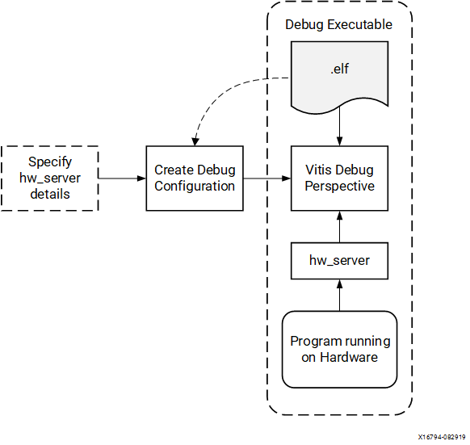
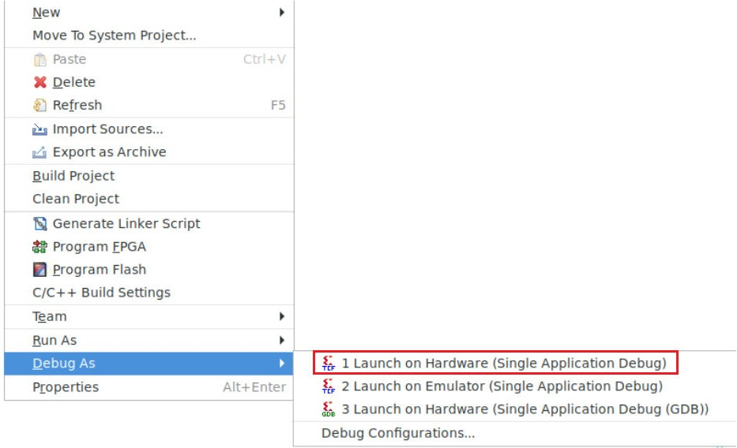
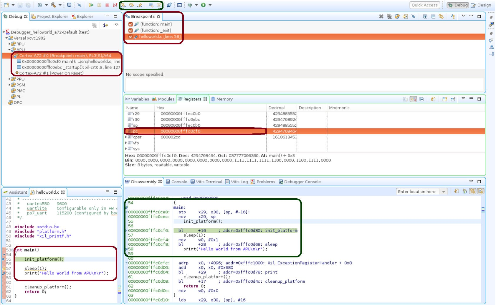
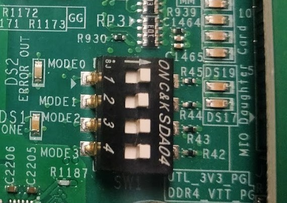
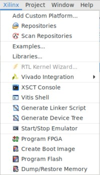
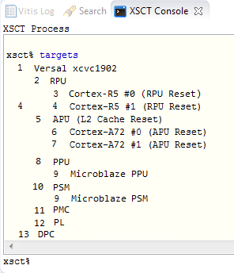
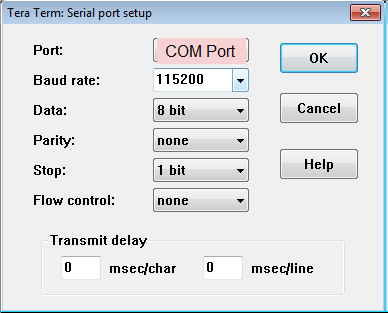
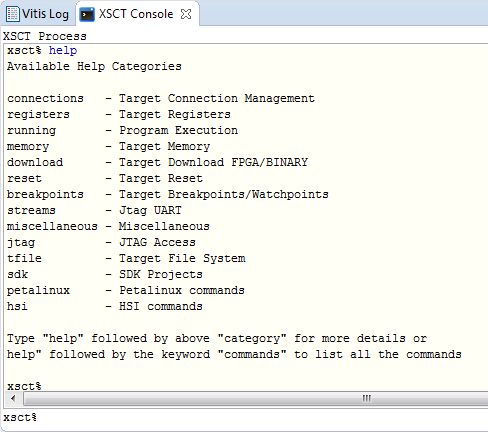
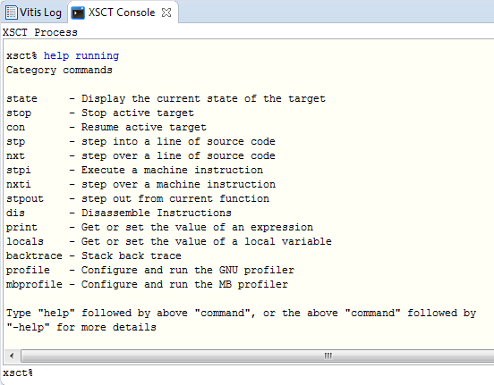

# Debugging Using the Vitis Software Platform

This chapter describes debugging possibilities with the design flow you have already been working with. The first option is debugging using the Xilinx&reg; Vitis&trade; software platform.

The Vitis software platform debugger provides the following debug capabilities:

- Supports debugging of programs on Arm&reg; Cortex&trade;-A72, Arm Cortex-R5F, and MicroBlaze&trade; processor architectures (heterogeneous multi-processor hardware system debugging).

- Supports debugging of programs on hardware boards.

- Supports debugging on remote hardware systems.

- Provides a feature-rich IDE to debug programs.

- Provides a tool command language (Tcl) interface for running test scripts and automation.

The Vitis software platform debugger enables you to see what is happening to a program while it executes. You can set breakpoints or watch points to stop the processor, step through program execution, view the program variables and stack, and view the contents of the memory in the system.

The Vitis software platform supports debugging through Xilinx system debugger.

## Xilinx System Debugger

The Xilinx&reg; Vitis&trade; software platform debugger enables you to step through your code line by line. You can set breakpoints or watchpoints to stop the processor, step through program execution, view the program variables and stack, and view the contents of the memory in the system.

The debugger supports debugging through Single Application Debug and GNU Debugger (GDB). The Xilinx customized system debugger is derived from open-source tools and is integrated with the Vitis software platform.

The Xilinx system debugger uses the Xilinx hw_server as the underlying debug engine. The Vitis software platform translates each user interface action into a sequence of target communication framework (TCF) commands. It then processes the output from System Debugger to display the current state of the program being debugged. It communicates to the processor on the hardware using Xilinx hw_server. The debug workflow is described in the following figure.

*Figure 1:* **System Debugger Flow**



The debug workflow is made up of the following components.

- **Executable ELF File:** To debug your application, you must use an elf file compiled for debugging. The debug elf file contains additional debug information for the debugger to make direct associations between the source code and the binaries generated from that original source. To manage the build configurations, right-click the software application and select **Build Configurations → Manage**.

- **Debug Configuration:** To launch the debug session, you must create a debug configuration in the Vitis software platform. This configuration captures options required to start a debug session, including the executable name, processor target to debug, and other information. To create a debug configuration, right-click your software application and select **Debug As→ Debug Configurations**.

- **The Vitis Software Platform Debug Perspective:** Using the Debug perspective, you can manage the debugging or running of a program in the Workbench. You can control the execution of your program by setting breakpoints, suspending launched programs, stepping through your code and examining the contents of variables. To view the **Debug** perspective select **Window→ Open Perspective → Debug**.

You can repeat the cycle of modifying the code, building the executable, and debugging the program in the Vitis software platform.

>***Note*:** If you edit the source after compiling, it changes the line numbering as the debug information is linked directly to the source. Similarly, debugging optimized binaries can also cause unexpected jumps in the execution trace.

## Debugging Software Using the Vitis Software Platform

This example describes debugging a hello world application.

If you did not create a hello world application on APU or RPU, follow the steps in [Running a Bare-Metal Hello World Application](./2-cips-noc-ip-config.md#running-a-bare-metal-hello-world-application) or [Running a Bare-Metal Hello World Application on DDR Memory](./2-cips-noc-ip-config.md#running-a-bare-metal-hello-world-application-on-ddr-memory).

After you create the Hello World Application, work through the following example to debug the software using the Vitis software platform.

1. Right-click the application and click **Build Project** to build the application.

2. Right-click the application project and select **Debug As→ Launch on Hardware (Single Application Debug)** as shown in the following figure.

    

    >***Note*:** The Debug perspective can also be launched by selecting **Window→ Debug Perspective**.

    

    >***Note*:** The addresses shown on this page might slightly differ from the addresses shown on your system.

    The processor is currently sitting at the beginning of `main()` method with program execution suspended at line 0x00000000fffc0cf0. You can confirm this information in the Disassembly view, which shows the assembly-level program execution also suspended at `0x00000000fffc0cf0`.

    >***Note*:** If the **Disassembly** view is not visible, select **Window →  Disassembly**.

3. The helloworld.c window also shows execution suspended at the first executable line of C code. Select the **Registers** view to confirm that the program counter, pc register, contains `0x00000000fffc0cf0`.

    >***Note*:** If the Registers view is not visible, select **Window → Registers**.

4. Double-click in the margin (to the left of the line numbers) of the `helloworld.c` window next to the line of code that reads `printf("Hello World from APU\n\r");`. This sets a breakpoint at the `printf` command. To confirm the breakpoint, review the Breakpoints view.

    >***Note*:** If the Breakpoints view is not visible, select **Window →   Breakpoints**.

5. Select **Run → Step Into** to step into the `init_platform()` routine. Program execution suspends at location `0x00000000fffc0cf0`. The call stack is now two levels deep.

6. Select **Run → Resume** to continue running the program to the breakpoint.

    Program execution stops at the line of code that includes the `printf` command. The **Disassembly** and **Debug** windows both show program execution stopped at `0x00000000fffc0cf4`.

    >***Note*:** The execution address in your debugging window might differ if you modified the helloworld source code in any way.

7. Select **Run → Resume** to run the program to conclusion.

    When the program completes, the **Debug** window shows that the program is suspended in a routine called **exit**. This happens when you are running under control of the debugger.

8. Re-run your code several times. Experiment with single-stepping, examining memory, breakpoints, modifying code, and adding print statements. Try adding and moving views.

    >**TIP:** You can use the Vitis software platform debugging shortcuts for step-into (F5), step-return (F7), step-over (F6), and resume (F8). Alternatively, you can use the toolbar buttons.

## Debugging Using XSCT

You can debug in the command line mode using XSDB, which is encapsulated as a part of XSCT. This example describes debugging the bare-metal application hello_world_r5 using XSCT.

The following steps indicate how to load a bare-metal application on Arm Cortex-R5F using XSCT.

This example is just to demonstrate the command line debugging possibility using XSDB/XSCT. Based on the requirement, you can choose to debug the code using either the system debugger graphical interface or the command line debugger in XSCT. All XSCT commands are scriptable and this applies to the commands covered in this example.

### Setting Up Target

1. Connect a USB cable between USB-JTAG connector on the target and the USB port on the host machine.

2. Set the board in JTAG Boot mode, where SW1 is set as shown in following figure.

     

3. Power on the board using the power switch SW13.

4. Click **XSCT Console** button in the Vitis software platform toolbar to open the XSCT Console view. Alternatively, you can open the XSCT Console view by clicking **Xilinx → XSCT Console**.

    

5. In the **XSCT Console** view, connect to the target over JTAG using the connect command:

    ``xsct% connect``

    The connect command returns the channel ID of the connection.

6. Load the pdi/bin file:

    ``device program <path to .pdi file>``

    >***Note*:** The PDI file can be found at
    `C:\edt\edt_versal\edt_versal.runs\impl_1\edt_versal_wrapper.pdi`. In Windows, path names should be enclosed in braces, for example, {`C:\path\to\file.pdi`} to prevent the backslash being interpreted as an escape character. This is not necessary for Linux, which uses forward slashes.

### Loading the Application Using XSCT

Following are the steps to load the application using XSCT.

1. Run `xsct% targets`.

    The targets command lists the available targets and allows you to select a target through its ID. The targets are assigned IDs as they are discovered on the JTAG chain, so the target IDs can change from session to session.

    >***Note*:** For non-interactive usage such as scripting, the `-filter` option can be used to select a target instead of selecting the target through its ID.

    The targets are listed as shown in the following figure.

    

2. Now download the hello_world_r5 application on the Arm&reg; Cortex-R5F Core 0.

3. Select RPU Cortex&trade;-R5F Core 0 target ID.

    ``` tcl
    xsct% targets 3
    xsct% rst -processor
    ```

    The command `rst -processor` clears the reset on an individual processor core. This step is important because when the Versal ACAP boots up the JTAG boot mode, all the Cortex- A72 and Cortex-R5F cores are held in reset. You must clear the resets on each core, before debugging on these cores. The rst command in XSDB can be used to clear the resets.

    >***Note*:** The command rst -cores clears resets on all the processor cores in the group (such as APU or RPU) of which the current target is a child. For example, when Cortex-A72 \#0 is the current target, `rst -cores` clears resets on all the Cortex-A72 cores in APU.

    `xsct% dow {C:\edt\edt_vck190\helloworld_r5\Debug\helloworld_r5.elf}`

    or

    `xsct% dow C:/edt/edt_vck190/helloworld_r5/Debug/helloworld_r5.elf`

    At this point, you can see the sections from the elf file downloaded sequentially. The XSCT prompt can be seen after a successful download. Now, configure a serial terminal (Tera Term, Mini com, or the Vitis software platform Serial Terminal interface for UART-0 USB-serial connection).

### Serial Terminal Configuration

1. Start a terminal session, using Tera Term or Mini com depending on the host machine being used, and the COM port and baud rate as shown in following figure.

    

2. For port settings, verify the COM port in the device manager. There are three USB UART interfaces exposed by the VCK190 board. Select the COM port associated with the interface with the lowest number. So in this case, for UART-0, select the com-port with interface-0.

### Running and Debugging Application Using XSCT

1. Before you run the application, set a breakpoint at `main()`.

    `xsct% bpadd -addr &main`

    This command returns the breakpoint ID. You can verify the breakpoints planted using command bplist. For more details on breakpoints in XSCT, type `help breakpoint` in XSCT.

2. Resume the processor core.

    `xsct% con`

    The following message is displayed when the core hits the breakpoint.

    `xsct% Info: Cortex-R5 \#0 Stopped at 0x10021C (Breakpoint)`

3. At this point, you can view registers when the core is stopped.

    `xsct% rrd`

4. View local variables.

    `xsct% locals`

5. Step over a line of the source code and view the stack trace.

    ``` tcl
    xsct% nxt
    Info: Cortex-R5 #0 Stopped at 0x100490 (Step)
    xsct% bt
    ```

    You can use the `help` command to find other options.

    

    You can use the `help running` command to get a list of possible options for running or debugging an application using XSCT.

    

6. You can now run the code.

    `xsct% con`

    At this point, you can see the Cortex-R5F application print messages on the UART-0 terminal.
	
© Copyright 2020-2021 Xilinx, Inc.

*Licensed under the Apache License, Version 2.0 (the “License”); you may not use this file except in compliance with the License. You may obtain a copy of the License at [http://www.apache.org/licenses/LICENSE-2.0](http://www.apache.org/licenses/LICENSE-2.0).*

*Unless required by applicable law or agreed to in writing, software distributed under the License is distributed on an “AS IS” BASIS, WITHOUT WARRANTIES OR CONDITIONS OF ANY KIND, either express or implied. See the License for the specific language governing permissions and limitations under the License.*