# System Design Example using Scalar Engine and Adaptable Engine

This chapter guides you through building a system based on Versal&trade; devices using available tools and supported software blocks. This chapter demonstrates how to use the Vivado&reg; tool to create an embedded design using PL AXI GPIO. It also demonstrates the steps to configure and build the Linux operating system for an Arm&reg; Cortex&trade;-A72 core-based APU on a Versal ACAP device.

Examples using the PetaLinux tool are also provided in this chapter.

## Design Example: Using AXI GPIO

The Linux application uses a PL-based AXI GPIO interface to monitor the DIP switch of the board and accordingly control the board's LEDs. The LED application can run on both the VMK180/VCK190.

### Configuring Hardware

The first step in this design is to configure the PS and PL sections. You can do this using the Vivado IP integrator. You start with adding the required IPs from the Vivado IP catalog and then connect the components to blocks in the PS subsystem. To configure the hardware, follow these steps:

>***Note*:** If the Vivado Design Suite is open already, jump to step 3.

1. Open the Vivado project you created in [Versal ACAP CIPS and NoC (DDR) IP Core Configuration](../docs/2-cips-noc-ip-config.md).

    `C:/edt/edt_versal/edt_versal.xpr`

2. In the Flow Navigator, under **IP Integrator**, click **Open Block Design**.

    

3. Right-click the block diagram and select **Add IP**.

#### Connecting IP Blocks to Create a Complete System

To connect IP blocks to create a system, follow these steps.

1. Double-click the Versal&trade; ACAP CIPS IP core.

2. Click **PS-PMC→ PL-PS Interfaces**.

    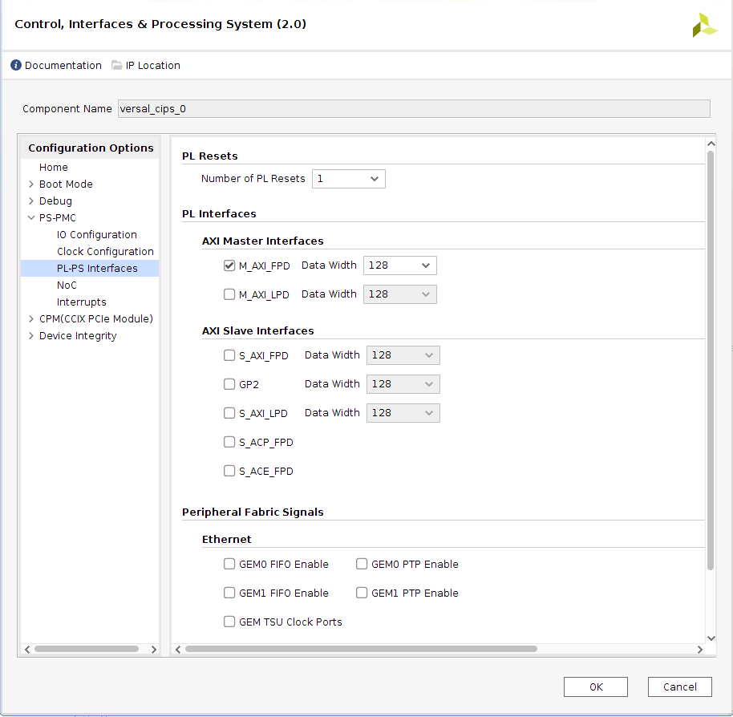

3. Enable the M_AXI_FPD interface, and set the Number of PL Resets to 1, as shown in the previous figure.

4. Click **Clock Configuration**, and then click on the Output Clocks tab.

5. Expand PMC Domain Clocks. Then expand PL Fabric Clocks. Configure the PL0_REF_CLK clock as shown in the following figure:

    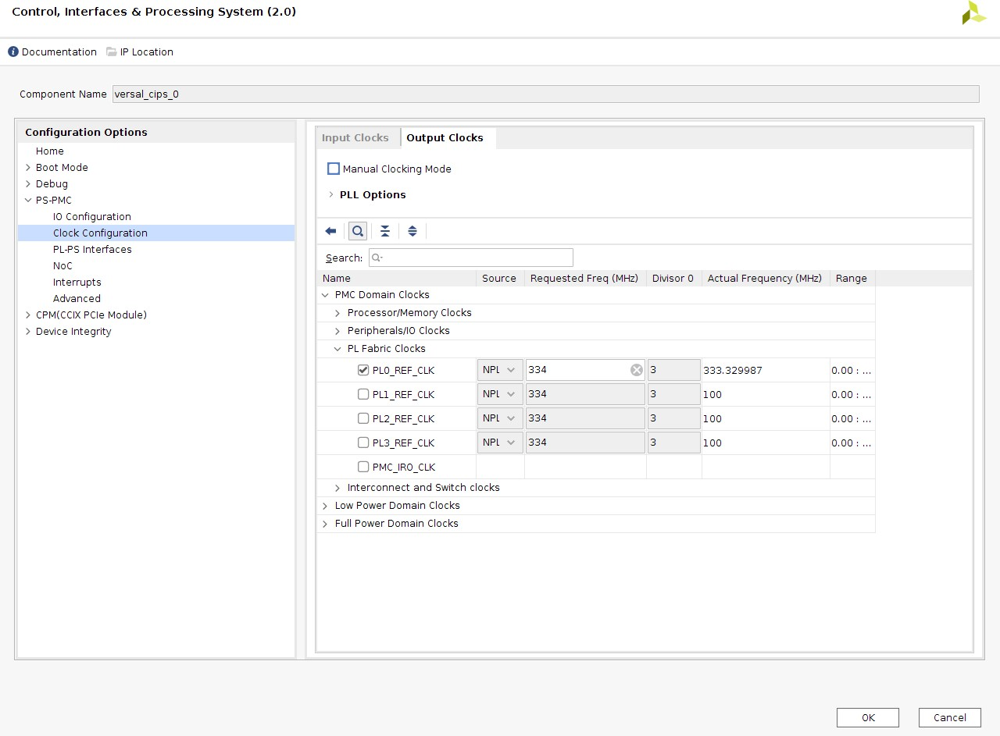

6. Click **OK** to complete the configuration and return to the block diagram.

#### Adding and Configuring IP Addresses

To add and configure IP addresses, follow these steps.

1. Right-click the block diagram and select **Add IP** from the IP catalog.

2. Search for AXI GPIO and double-click the **AXI GPIO IP** to add it to your design.

3. Add another instance of the AXI GPIO IP into the design.

4. Click **Run Connection Automation** in the Block Design view.
     

    The Run Connection Automation dialog box opens.

5. In the Run Connection Automation dialog box, select the All Automation check box.

    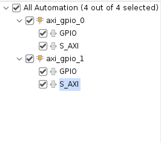

    This checks the automation for all the ports of the AXI GPIO IP.

6. Click **GPIO** of `axi_gpio_0` and set the Select Board Part Interface to **Custom** as shown below.

     

7. Make the same setting for GPIO of axi_gpio_1.

8. Click **S_AXI** of axi_gpio_0. Set the configurations as shown in the following figure:

    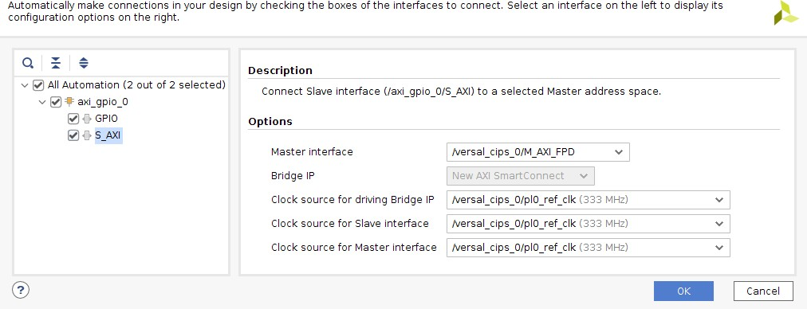

9. Make the same setting for S_AXI of axi_gpio_1. This configuration sets the following connections:

    - Connects the S_AXI of AXI_GPIO to M_AXI_FPD of CIPS with SmartConnect as a bridge IP between CIPS and AXI GPIO IPs.

    - Enables the processor system reset IP.

    - Connects the `pl0_ref_clk` to the processor system reset, AXI GPIO, and the SmartConnect IP clocks.

    - Connects the reset of the SmartConnect and AXI GPIO to the `peripheral_aresetn` of the processor system reset IP.

10. Click **OK**.

11. Click **Run Connection Automation** in the block design window and select the All Automation check box.

12. Click **ext_reset_in** and configure the setting as shown below.

    

    This connects the `ext_reset_in` of the processor system reset IP to the pl_resetn of the CIPS.

13. Click **OK**.

14. Disconnect the `aresetn` of SmartConnect IP from `peripheral_aresetn` of processor system reset IP.

15. Connect the `aresetn` of SmartConnect IP to `interconnect_aresetn` of processor system reset IP.

     

16. Double-click the axi_gpio_0 IP to open it.

17. Go to the IP Configuration tab and configure the settings as shown in the following figure.

     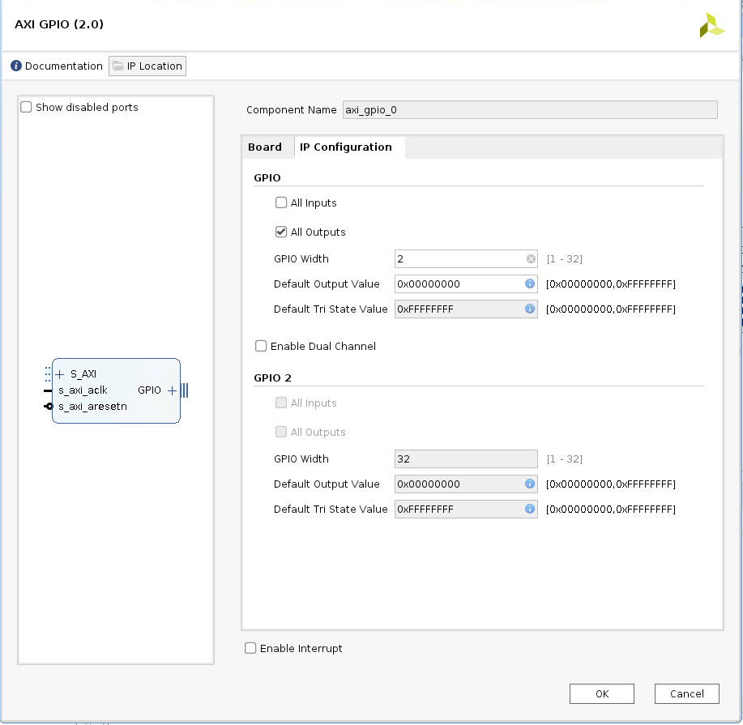

18. Make the same setting for axi_gpio_1.

19. Add four more instances of Slice IP.

20. Delete the external pins of the AXI GPIO IP and expand the interfaces.

21. Connect the output pin gpio_io_0 of axi_gpio_0 to slice 0 and slice 1.

22. Similarly, connect the output pin gpio_io_0 of axi_gpio_1 to slice 2 and slice 3.

23. Make the output of Slice IP as External.

24. Configure each Slice IP as shown below.

    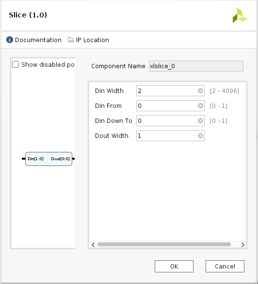

    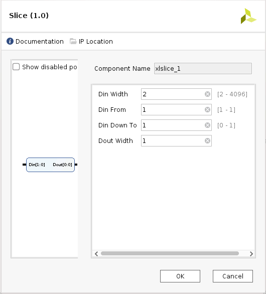

    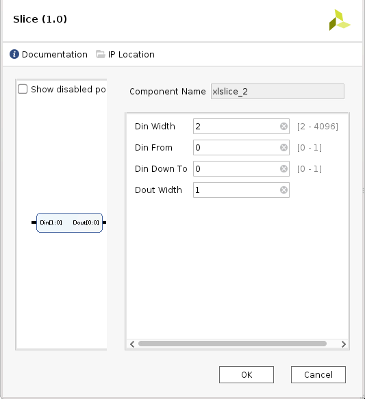

    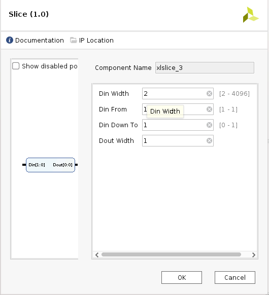

The overall block design is shown in the following figure:

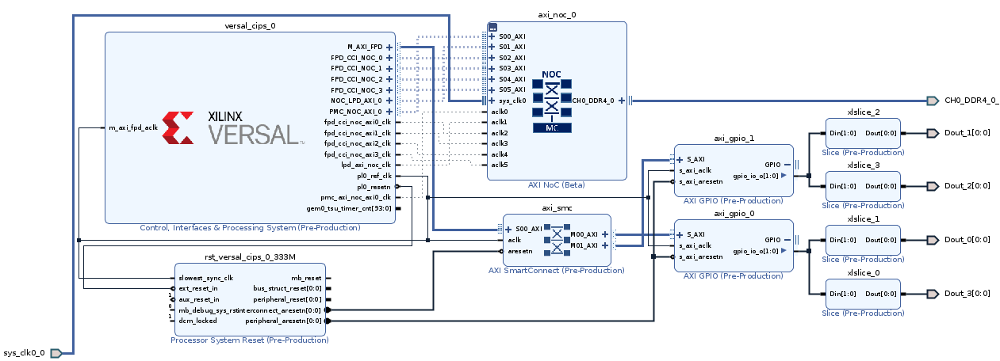

#### Validating the Design and Generating the Output

To validate the design and to generate the output product, follow these steps:

1. Return to the block design view and save your block design (press **Ctrl+S**).

2. Right-click the white space of the block diagram view, and select **Validate Design**. Alternatively, you can press the **F6** key.

    A dialog box with the following message opens:

    

3. Click **OK** to close the message.

4. Click the **Sources** window.
   1. Expand Constraints.
   2. Right-click on **constrs_1-> ADD Sources**.
   The Add Sources window opens.
   3. Choose **Add or Create Constraints** option and click **Next**.
   4. Choose the .xdc file to be added
        >***Note**:* The constraints file is provided as part of the package in the `pl_axigpio/ constrs` folder.
   5. Click **Finish**.

5. Click **Hierarchy**.

6. In the Sources window, under Design Sources, expand **edt_versal_wrapper**.

7. Right-click the top-level block design, edt_versal_i : edt_versal (`edt_versal.bd`), and select **Generate Output Products**.

    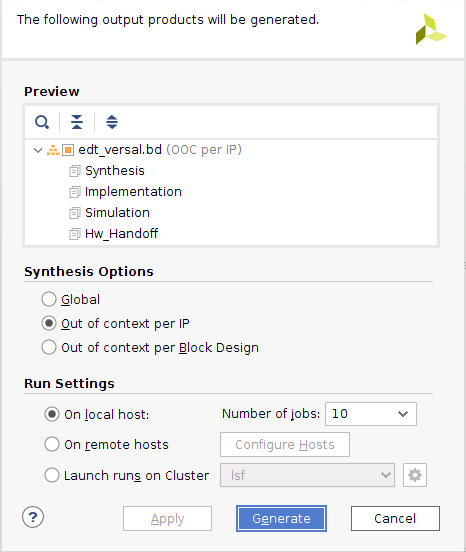

8. Click **Generate**.

9. When the Generate Output Products process completes, click **OK**.

10. In the Sources window, click the **IP Sources** view. Here, you can see the output products that you just generated, as shown in the following figure.

    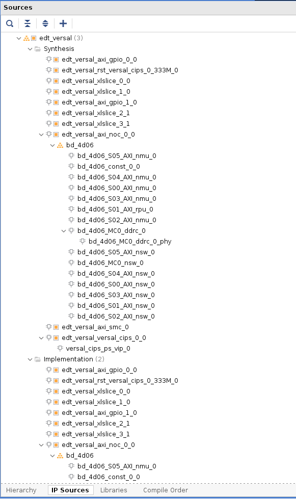

#### Synthesizing, Implementing, and Generating the Device Image

Follow these steps to generate a device image for the design.

1. Go to **Flow Navigator→ Program and Debug**, click **Generate Device Image** and click **OK**.

2. A No Implementation Results Available menu appears. Click **Yes**.

3. A Launch Run menu appears. Click **OK**.

    When the Device Image Generation completes, the Device Image Generation Completed dialog box opens.

4. Click **Cancel** to close the window.

5. Export hardware after you generate the Device Image.

    >***Note*:** The following steps are optional and you can skip these and go to the [Exporting Hardware](#exporting-hardware) section. These steps provide the detailed flow for generating the device image by running synthesis and implementation before generating device image. If you need to understand the flow of generating the device image, follow the steps provided below.

6. Go to **Flow Navigator→ Synthesis** and click **Run Synthesis**.

    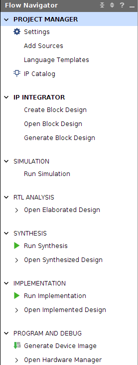

7. If Vivado prompts you to save your project before launching synthesis, click **Save**.

    While synthesis is running, a status bar is displayed in the upper right-hand window. This status bar spools for various reasons throughout the design process. The status bar signifies that a process is working in the background. When synthesis is complete, the Synthesis Completed dialog box opens.

7. Select **Run Implementation** and click **OK**.

    When implementation completes, the Implementation Completed dialog box opens.

8. Select **Generate Device Image** and click **OK**.

    When Device Image Generation completes, the Device Image Generation Completed dialog box opens.

9.  Click **Cancel** to close the window.

    Export hardware, after you generate Device Image.

#### Exporting Hardware

1. From the Vivado main menu, select **File→ Export → Export Hardware**. The Export Hardware dialog box opens.

2. Choose **Include bitstream** and click **Next**.

3. Provide a name for your exported file (or use the default provided) and choose the location. Click **Next**.

    A warning message appears if a hardware module has already been exported. Click **Yes** to overwrite the existing XSA file, if the overwrite message is displayed.

4. Click **Finish**.

## Example Project: FreeRTOS GPIO Application Project With RPU

This section explains how to configure and build the FreeRTOS application for an Arm&reg; Cortex&trade;-R5F core based RPU on a Versal device.

The following steps demonstrate the procedure to create a FreeRTOS Application from Arm Cortex-R5F:

1. Start the Vitis&trade; IDE and create a new workspace, for example, `c:/edt/freertos`.
2. Select **File→ New → Application Project**. The **Creating a New Application Project** wizard opens. If this is the first time that you have launched the Vitis&trade; IDE, you can select **Create Application Project** on the Welcome screen as shown in the following figure.

    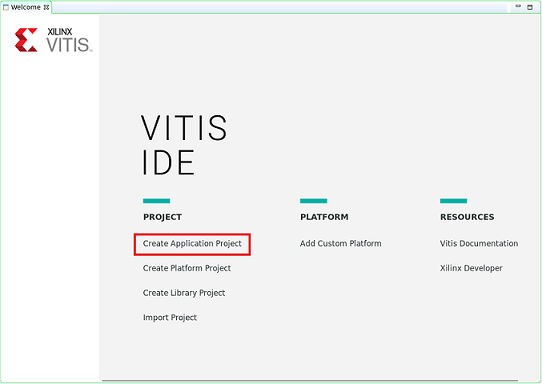

    >***Note**:* Optionally, you can check the box next to **Skip welcome page next time** to skip seeing the welcome page every time.

3. There are four components of an application project in the Vitis IDE: a target platform, a system project, a domain and a template.To create a new application project in the Vitis IDE, follow these steps:

    1. A target platform is composed of a base hardware design and the meta-data used in attaching accelerators to declared interfaces. Choose a platform or create a platform project from the XSA that you exported from the Vivado Design Suite.
    2. Put the application project in a system project, and associate it with a processor.
    3. The domain defines the processor and operating system used for running the host program on the target platform.
    4. Choose a template for the application, to quick start development. Use the following information to make your selections in the wizard screens.

    *Table 9:* **Wizard Information**

   |  Wizard Screen  |  System Properties        |  Setting or Command to Use  |
   |:----------------|:--------------------------|:----------------------------|
   | Platform        | Create a new platform from hardware (XSA)        | Click Browse to add your XSA file  |
   |                  |  Platform Name            |  vck190_platform    |
   | Application Project Detail       |  Application project name       |  freertos_gpio_test |
   |                 |  Select a system project   |  +Create New        |
   |                 |  System project name       |  freertos_gpio_test_system              |
   |                 |  Processor                 |  psv_cortexr5_0     |
   |   Dom            |  Select a domain           |  +Create New        |
   |                 |  Name                      |  The default name assigned  |
   |                 |  Display Name              |  The default name assigned  |
   |                 |  Operating System          |  freertos10_xilinx  |
   |                 |  Processor                 |  psv_cortexr5_0     |
   |  Templates      |  Available                 |  Freertos Hello     |
   |                 |  Templates                 |  world              |
 
 The Vitis software platform creates the board support package for the Platform project (**vck190_platform**) and the system project (**freertos_gpio_test_system**) containing an application project named **freertos_gpio_test** under the Explorer view after performing the preceding steps.

4. Right click the `freertos_hello_world.c` file under `src/` and rename the `freertos_hello_world.c` file to `freertos_gpio_test.c`. Copy the `freertos_gpio_test.c` file from the FreeRTOS project path, `<design-package>/vck190/freertos/` to `freertos_gpio_test.c` under `src/`.
5. Right-click **freertos_gpio_test_system** and select **Build Project**. Alternatively, you can click .
   >***Note*:** If you cannot see the project explorer, click the restore icon on the left panel and then perform this step.

For building the Linux images and incorporating the FreeRTOS elf into the image, see [Example Project: Creating Linux Images Using PetaLinux](#example-project-creating-linux-images-using-petalinux).

## Example Project: Creating Linux Images Using PetaLinux

This section explains how to  configure and build the Linux operating system for an Arm Cortex-A72 core-based APU on a Versal device. You can use the PetaLinux tool with the board-specific BSP to configure and build Linux images.

This example needs a Linux host machine. Refer to the [PetaLinux Tools Documentation Reference Guide (UG1144)](https://www.xilinx.com/cgi-bin/docs/rdoc?v=latest;d=ug1144-petalinux-tools-reference-guide.pdf) for information on dependencies and installation procedure for the PetaLinux tool.

>**Important:** *This example uses the VCK190 PetaLinux BSP to create a PetaLinux project. Ensure that you have downloaded the respective BSP for PetaLinux (VCK190/VMK180).*
>
>- If you are using the VCK190 board, download the `xilinx-vck190-es1-v2020.2-final.bsp` file from <https://www.xilinx.com/member/vck190_headstart.html>.
>
> - If you are using the VMK180 board, download the VMK180 PetaLinux 2020.2 BSP (xilinx- vmk180-v2020.2-final.bsp) from <https://www.xilinx.com/member/vmk180_headstart.html>.

1. Copy the respective board's PetaLinux BSP to the current directory.
2. Set up the PetaLinux environment
    ```
    $ source <petalinux-tools-path>/settings.csh
    ```

3. Create a PetaLinux project using the following command.
   
   ```
   $ petalinux-create -t project -s xilinx-vck190-vxxyy.z-final.bsp -n led_example
   ```

   >***Note*:** For VMK180 board, use `xilinx-vmk180-vxxyy.z-final.bsp` after the `-s` option in the command.

4. Change to the PetaLinux project directory using the following command.

    ```
    $cd led_example
    ```

5. Copy the hardware platform project XSA to the Linux host machine.

    >***Note*:** For the VMK180 board, use the XSA file which you generated in the [Design Example: Using AXI GPIO](#design-example-using-axi-gpio).

6. Reconfigure the BSP using the following commands.

    ```
    $ petalinux-config --get-hw-description=<path till the directory containing the respective xsa file>
    ```

    This command opens the PetaLinux Configuration window. For this example, no need to change anything in this window.

7. Click **<Save>** to save the above configuration and then **<Exit>** to exit the configuration wizard.

8. Create a Linux application named gpiotest within the PetaLinux project using the following command.

    ```
    $petalinux-create -t apps --template install --name gpiotest --enable
    ```

9.  Copy application files from `<design-package>/<vck190 or vmk180>/linux/bootimages` to the project using the following commands.

    ```
    $cp <design-package>/vck190/linux/design_files/gpiotest_app/gpiotest/files/* <plnxproj-root>/project-spec/meta-user/recipes-apps/gpiotest/files/

    $cp <design-package>/vck190/linux/design_files/gpiotest_app/gpiotest.bb
    <plnx-proj-root>/project-spec/meta-user/recipes-apps/gpiotest/gpiotest.bb

    $cp <design-package>/vck190/linux/design_files/device_tree/system-user.dtsi <plnx-proj-root>/project-spec/meta-user/recipes-bsp/device-tree/files/system-user.dtsi
    ```

10. Enable GPIO support within kernel configuration.

    ```
    $petalinux-config -c kernel
    ```

    >***Note*:** This command opens the kernel configuration wizard for the PetaLinux project.

11. Navigate to **Device drivers→ GPIO Support** and enable it by pressing the **<Y>** key. Press **Enter** and enable the Debug GPIO calls and `/sys/class/gpio/...(sysfs interface)` entries by pressing the **<Y>** key as shown in the following figure.

    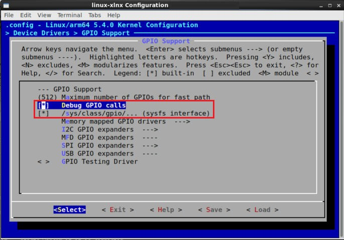

12. Navigate to **Memory mapped GPIO drivers** and enable Xilinx GPIO support and Xilinx Zynq GPIO support by pressing **<Y>** key as shown in the following figure.

    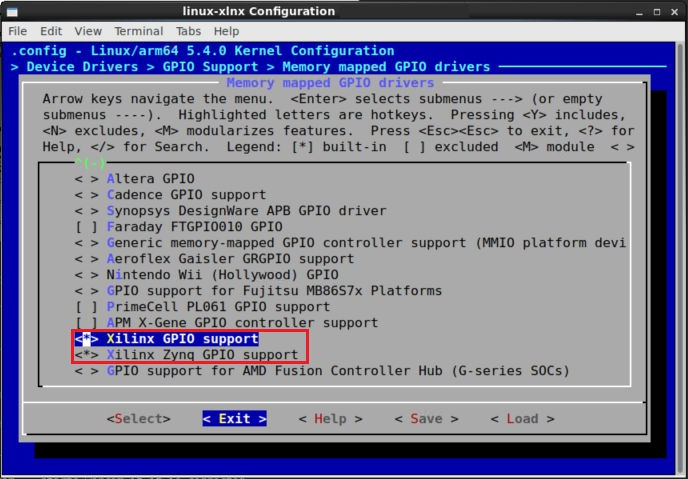

13. Click **<Save>** to save the above configuration and then **<Exit>** option to exit the configuration wizard.

14. Build the Linux images using the following command.

    ```
    $ petalinux-build
    ```

### Combining FreeRTOS and APU Images using a BIF File

1. Open the XSCT console in your Vitis IDE workspace.

2. Navigate to the `images/linux` directory of your PetaLinux project:

    ```
    $ cd <petalinux-project>/images/linux/
    ```

3. Copy the `freertos_gpio_test.elf` from `<design-package>/vck190/freertos/freertos_gpio_test.elf` to the `images/linux` directory.

    ```
    $ cp <design-package>/freertos/freertos_gpio_test.elf.
    ```

4. Copy the `bootgen.bif` file from `<design-package>/` to the `images/linux` directory.

    ```
    $ cp <design-package>/bootgen.bif.
    ```

5. Run the following command to create `BOOT.BIN`.

    ```
    $ bootgen -image bootgen.bif -arch versal -o BOOT.BIN -w
    ```

    This creates a `BOOT.BIN` image file in the `<petalinux-project>/images/linux/` directory.

>***Note*:** To run the images using SD boot mode, see [Boot Sequence for SD-Boot Mode](./4-boot-and-config.md#boot-sequence-for-sd-boot-mode).

© Copyright 2020-2021 Xilinx, Inc.

*Licensed under the Apache License, Version 2.0 (the “License”); you may not use this file except in compliance with the License. You may obtain a copy of the License at [http://www.apache.org/licenses/LICENSE-2.0](http://www.apache.org/licenses/LICENSE-2.0).*

*Unless required by applicable law or agreed to in writing, software distributed under the License is distributed on an “AS IS” BASIS, WITHOUT WARRANTIES OR CONDITIONS OF ANY KIND, either express or implied. See the License for the specific language governing permissions and limitations under the License.*

