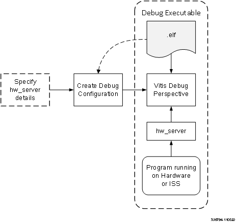

# Debugging with the Vitis Software Platform

This chapter describes debug possibilities with the design flow you
have already been working with. The first option is debugging with
software using the Xilinx&reg; Vitis&trade; unified software platform.

The Vitis software platform debugger provides the following debug
capabilities:

-   Debugging of programs on MicroBlaze&trade; and Arm Cortex&trade;-A9
    processor architectures (heterogeneous multi-processor hardware
    system debugging)

-   Debugging of programs on hardware boards

-   Debugging on remote hardware systems

-   A feature-rich integrated design environment (IDE) to debug
    programs

-   A Tool Command Language (Tcl) interface for running test
    scripts and automation

The Vitis debugger enables you to see what is happening to a program
while it executes. You can set breakpoints or watchpoints to stop the
processor, step through program execution, view the program variables
and stack, and view the contents of the memory in the system.

The Vitis software platform supports debugging through Xilinx System
Debugger and GNU Debugger (GDB).

**Note:** The GDB flow is deprecated and will not be available for
future devices.

## Xilinx System Debugger

The Xilinx System Debugger uses the Xilinx hw_server as the underlying
debug engine. The Vitis software platform translates each user
interface action into a sequence of Target Communication Framework
(TCF) commands. It then processes the output from System Debugger to
display the current state of the program being debugged. It
communicates to the processor on the hardware using Xilinx hw_server.

The debug workflow is described in the following figure.

The workflow is made up of the following components:

-   **Executable ELF File:** To debug your application, you must use an
    Executable and Linkable Format (ELF) file compiled for debugging.
    The debug ELF file contains additional debug information for the
    debugger to make direct associations between the source code and
    the binaries generated from that original source. To choose a build configuration, click the dropdown menu of the hammer icon on the tool bar and select Debug or Release. To manage a
    build configuration, right-click the software application, select **C/C++ Build Settings**, choose the configuration in the drop down menu, then change the build settings accordingly.

-   **Debug Configuration:** To launch the debug session, you must
    create a debug configuration in the Vitis software platform. This
    configuration captures the options required to start a debug session,
    including the executable name, processor target to debug, and
    other information. To create a debug configuration, right-click
    your software application and select **Debug As → Debug Configurations**.

-   **Debug Perspective:** Using the Debug perspective, you can manage
    the debugging or running of a program in the Vitis IDE. You can
    control the execution of your program by setting breakpoints,
    suspending launched programs, stepping through your code, and
    examining the contents of variables. To view the Debug
    perspective, select **Window → Open Perspective → Debug**. You can also quickly switch the perspective using the Design or Debug buttons on the upper-right corner of the Vitis IDE.

You can repeat the cycle of modifying the code, building the
executable, and debugging the program in the Vitis software platform.

**Note:** If you edit the source after compiling, the line numbering
will be out of step because the debug information is tied directly to
the source. Similarly, debugging optimized binaries can also cause
unexpected jumps in the execution trace.

## Example 3: Debugging Standalone Software Using the Vitis Software Platform

In this example, you will walk through debugging the "Hello World" application created in [Example 2](./2-using-zynq.md#example-2-creating-and-running-a-hello-world-application).

### Input and Output Files

- Input files: Vitis workspace from Example 2
- Output files: N/A

### Debugging Standalone Applications in the Vitis IDE

1.  In the C/C++ perspective, right-click the Hello_world project and select **Debug As → Debug Configurations**.

    In Target Setup tab, fill the Hardware Platform field with the one
    exported by the Vivado&reg; Design Suite, and click the **Debug** button.

    

    The Debug perspective opens.

    **Note:** If the Debug Perspective window does not automatically
    open, select **Window → Open perspective** and select **Debug** in the
    Open Perspective dialog box.

    

    **Note:** The addresses shown on this page might differ slightly from the addresses shown on your system.

    The processor is currently sitting at the beginning of `main()`. You can confirm this
    information in the Disassembly view, which shows the assembly-level program execution also suspended at the same address.

    **Note:** If the Disassembly view is not visible, select **Window → Show view**, select **Disassembly** under **Debug**, and click **Open**.

2.  The helloworld.c window also shows execution suspended at the first
    executable line of C code.

    **Note:** If the Registers view is not visible, select **Window → Show view → Debug→ Registers**.

3.  Double-click in the margin of the helloworld.c window next to the
    line of code that reads `init_platform()` and `print()`. This sets the
    breakpoints at `init_platform()` and `print()`. To confirm the
    breakpoints, review the Breakpoints view.

    **Note:** If the Breakpoints view is not visible, select **Window → Show view → Debug → Breakpoints**.

4.  Select **Run → Step Into** to step into the ``init_platform()`` routine.

    The program executes one step. The call stack is now two levels deep.

5.  Select **Run → Resume** to continue running the program to the
    breakpoint.

    Program execution stops at the line of code that includes the print
    command. 

    **Note:** The execution address in your debugging window might
    differ if you modified the "Hello World" source code in any way.

6.  Select **Run → Resume** to run the program to conclusion.

    When the program completes, the Terminal view shows the Hello World
    print and the Debug view shows that the program is suspended in a
    routine called ``exit``. This happens when you are running under control
    of the debugger.

7.  Rerun your code several times. Experiment with single-stepping, examining memory, breakpoints, modifying code, and adding print statements. Try adding and moving views.

    **TIP:** You can use Vitis tool debugging shortcuts for step-into (F5), step-over (F6), step-return (F7), and resume (F8).

8.  Click Disconnect button on the tool bar to disconnect to the board, or exit the Vitis software platform directly.

See the [next chapter](./4-linux-for-zynq.md) for building and debugging Linux applications for Zynq-7000 SoCs.

© Copyright 2015–2021 Xilinx, Inc.

Licensed under the Apache License, Version 2.0 (the "License"); you may not use this file except in compliance with the License. You may obtain a copy of the License at

http://www.apache.org/licenses/LICENSE-2.0

Unless required by applicable law or agreed to in writing, software distributed under the License is distributed on an "AS IS" BASIS, WITHOUT WARRANTIES OR CONDITIONS OF ANY KIND, either express or implied. See the License for the specific language governing permissions and limitations under the License.
