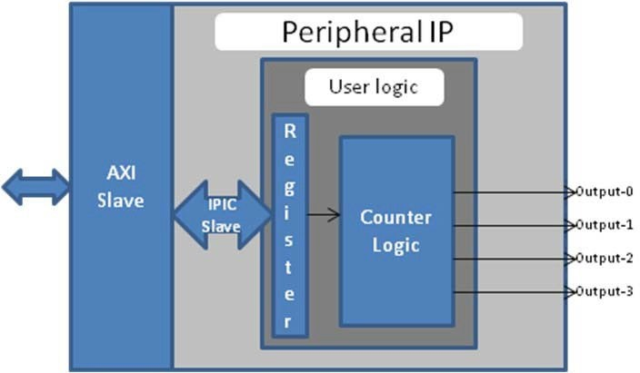
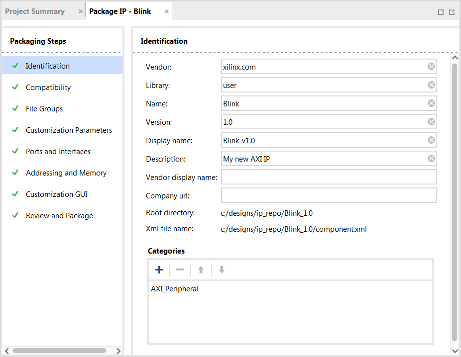
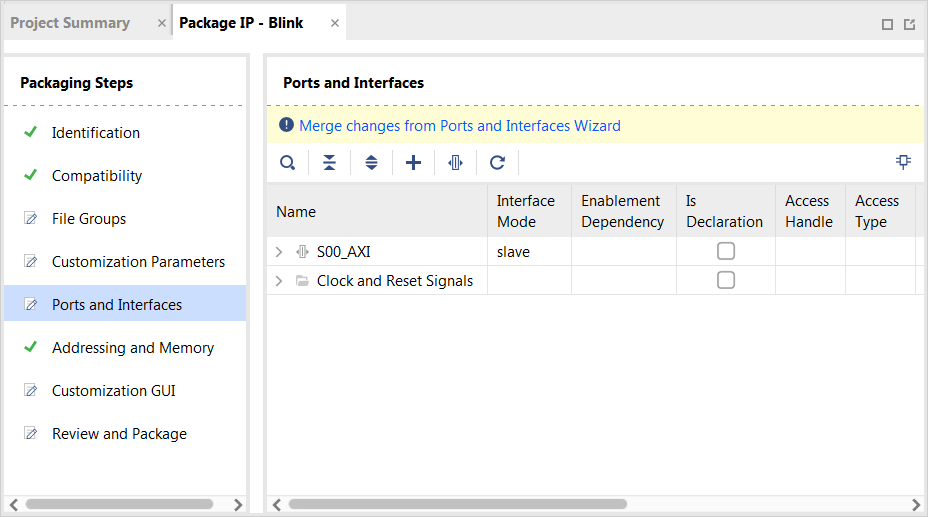
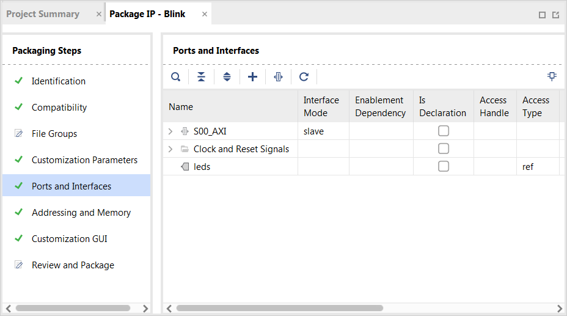
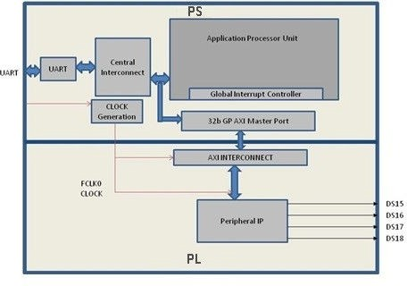
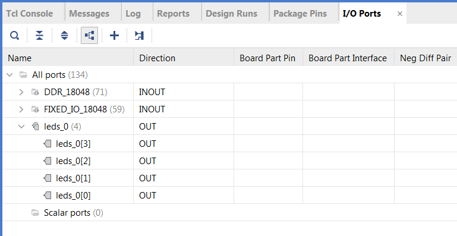
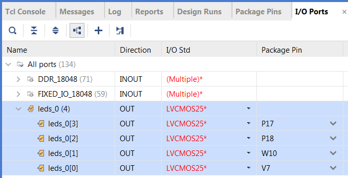

# Creating Custom IP and Device Drivers for Linux

In this chapter, you will create an intellectual property (IP) using
the Create and Package New IP wizard. You will also design a system to
include the new IP created for the Xilinx&reg; Zynq&reg;-7000 SoC device.

For the IP, you will develop a Linux-based device driver as a module
that can be dynamically loaded onto the running kernel.

You will also develop Linux-based application software for the system
to execute on the Zynq SoC ZC702 board.

**IMPORTANT**: You will need to rebuild the Linux kernel: a Linux host machine to run PetaLinux is required.

## Creating Peripheral IP

In this section, you will create an AXI4-Lite compliant slave
peripheral IP framework using the Create and Package New IP wizard.
You will also add functionality and port assignments to the peripheral
IP framework.

The peripheral IP you will create is an AXI4-Lite compliant slave IP.
It includes a 28-bit counter. The four most significant bits of the counter drive the
four output ports of the peripheral IP. The block diagram is shown in the
following figure.



The block diagram includes the following configuration register:

| Register Name    | Control Register       |
| ---------------- | ---------------------- |
| Relative Address | 0x0000_0000            |
| Width            | 1 bit                  |
| Access Type      | Read/Write             |
| Description      | Start/Stop the Counter |

 | Field Name  | Bits | Type | Reset Value | Description                        |
 | ----------- | ---- | ---- | ----------- | ---------------------------------- |
 | Control Bit | 0    | R/W  | 0x0         | 1 : Start Counter 2 : Stop Counter |

## Example 11: Creating Peripheral IP

### Creating Peripheral IP

In this section, you will create an AXI4-Lite compliant slave peripheral IP.

1.  Create a new project as described in [Creating a New Embedded Project with Zynq SoC](2-using-zynq.md#example-1-creating-a-new-embedded-project-with-zynq-soc).

2.  With the Vivado design open, select **Tools → Create and Package New IP**. Click **Next** to continue.

3.  Select **Create a new AXI4 peripheral** and then click **Next**.

4.  Fill in the peripheral details as follows:

   | Screen      | System Property    | Setting or Comment to Use |
   | ------------------ | ------------------ | ------------------------- |
   | Peripheral Details | Name               | Blink                     |
   |                    | Version            | 1.0                       |
   |                    | Display name       | Blink_v1.0                |
   |                    | Description        | My new AXI IP             |
   |                    | IP location        | C:/designs/ip_repro       |
   |                    | Overwrite existing | unchecked                 |

5.  Click **Next**.

6.  In the Add Interfaces page, accept the default settings and click **Next**.

7.  In the Create Peripheral page, select **Edit IP** and then click **Finish**. Upon completion of the new IP generation process, the Package IP window opens (see the following figure).

    

8.  In the Hierarchy view of the **Sources** window, right-click
    **blink_v1_0** under the Design Sources folder and select **Open File**. You need to add Verilog code that creates output ports
    to map to the external LEDs on the ZC702 board. Navigate to the line ``//Users to add ports here`` and add ``output wire \[3:0\] leds``below this line, as shown in the following example:

    ```
    //Users to add ports here
    output wire [3:0] leds,
    //User ports ends
    ```

9.  Find the instantiation to the AXI bus interface and add ``.leds(leds)``, as shown in the following example, to map the port
    connections:

    ```
    .S_AXI_RREADY(s00_axi_rready),
      .leds(leds)
      );
    ```

10. Save and close ``blink_v1_0.v``.

11. Under **Sources → Hierarchy → Design Sources→ blink_v1_0**, right-click **blink_v1_0\_S00_AXI_inst - blink_v1_0\_S00_AXI** and select **Open File**.

    Next, you will need to add Verilog code that creates output ports to
    map to the external LEDs on the ZC702 board and also create the logic
    code to blink the LEDs when register 0 is written to.

12. Navigate to the line ``//Users to add ports here`` and add ``output wire \[3:0\] leds`` below this line, as shown in the example below:

    ```
    //Users to add ports here
    output wire [3:0] leds,
    //User ports ends
    ```

13. Find the AXI4-Lite signals section:

    ```
    // AXI4LITE signals
      reg [C_S_AXI_ADDR_WIDTH-1 : 0] axi_awaddr;
      reg axi_awready;
      reg axi_wready;
      reg [1 : 0] axi_bresp;
      reg axi_bvalid;
      reg [C_S_AXI_ADDR_WIDTH-1 : 0] axi_araddr;
      reg axi_arready;
      reg [C_S_AXI_DATA_WIDTH-1 : 0] axi_rdata;
      reg [1 : 0] axi_rresp;
      reg axi_rvalid;
    ```

    After this section, add a custom register, which you will use as a counter. Add the following code:

    ```
    // add 28-bit register to use as counter
    reg [27:0] count;
    ```

14. Find the I/O connections assignments section:

    ```
    // I/O Connections assignments
      assign S_AXI_AWREADY = axi_awready;
      assign S_AXI_WREADY = axi_wready;
      assign S_AXI_BRESP = axi_bresp;
      assign S_AXI_BVALID = axi_bvalid;
      assign S_AXI_ARREADY = axi_arready;
      assign S_AXI_RDATA = axi_rdata;
      assign S_AXI_RRESP = axi_rresp;
      assign S_AXI_RVALID = axi_rvalid;
    ```

    Add the following code at the bottom:

    ```
    // assign MSB of count to LEDs
      assign leds = count[27:24];
    ```

15. Toward the bottom of the file, find the section that states ``Add user logic here``. Add the following code, which will increment the count while the slv_reg0 is set to 0x1. If the register is not set, the counter will not increment.

    ```
    // Add user logic here
      // on positive edge of input clock
      always @( posedge S_AXI_ACLK )
      begin
      //if reset is set, set count = 0x0
      if ( S_AXI_ARESETN == 1'b0 )
      begin
      count <= 28'b0;
      end
      else
      begin
      //when slv_reg_0 is set to 0x1, increment count
      if (slv_reg0 == 2'h01)
      begin
      count <= count+1;
      end
      else
      begin
      count <= count;
      end
      end
      end
      // User logic ends
      ```

16. Save and close **blink_v1_0_S00_AXI.v**.

17. Open the **Package IP - blink** page. Under **Packaging Steps**, select **Ports and Interfaces**.

18. Click the **Merge Changes from Ports and Interfaces Wizard** link.

    

19. Make sure that the window is updated and includes the LEDs output ports.

    

20. Under Packaging Steps, select **Review and Package**. At the bottom of the Review and Package page, click **Re-Package IP**.

    The view that opens states that packaging is complete and asks if you would like to close the project.

21. Click **Yes**.

**Note:** The custom core creation process that you have worked
through is very simple with the example Verilog included in the IP
creation process. For more information, refer to the _GitHub Zynq Cookbook: How to Run BFM Simulation_ <a href="https://github.com/imrickysu/ZYNQ-Cookbook/wiki/How-to-run-BFM-simulation">web page</a>.

### Integrating Peripheral IP with PS GP Master Port

You will now create a system for the ZC702 board by instantiating the
peripheral IP as a slave in the Zynq SoC programmable logic (PL)
section. You will then connect it with the processor through the
processing system (PS) general purpose (GP) master port. The block
diagram for the system is shown in the following figure.



This system covers the following connections:

-   Peripheral IP connected to PS general purpose master port 0
    (``M_AXI_GP0``). This connection is used by the PS CPU to configure peripheral IP register configurations.

-   Four output ports for peripheral IP connected to DS15, DS16, DS17, and DS18 on-board LEDs.

In this system, when you run application code, a message appears on
the serial terminal and asks you to choose the option to make the LEDs
start or stop blinking.

-   When you select the start option on the serial terminal, all four
    LEDs start blinking.

-   When you select the stop option, all four LEDs stop blinking and
    retain the previous state.

### Connecting an AXI4-Lite Compliant Custom Slave IP

In this section, you will connect the AXI4-Lite compliant custom slave
peripheral IP that you created in [Creating Peripheral IP](#creating-peripheral-ip).

1.  Open the Vivado project you previously created in [Creating a New Embedded Project with Zynq SoC](2-using-zynq.md#example-1-creating-a-new-embedded-project-with-zynq-soc).

2.  Add the custom IP to the existing design. Right-click the Diagram view and select **Add IP**.

3.  Type "blink" into the search view. Blink_v1.0 appears. Double-click the IP to add it to the design.

4.  Click **Run Connection Automation** to make automatic port connections.

5.  With the **All Automation** box checked by default, click **OK** to make the connections. Your new IP is automatically connected, but the ``leds`` output port is disconnected.

6.  Right-click the **leds** port and select **Make External**.

        

7.  In the Flow Navigator view, navigate to **RTL Analysis** and select **Open Elaborated Design**.

8.  Click **OK**.

9.  After the elaborated design opens, click the **I/O Ports** window and expand **All ports → led_0**.

    

10. Edit the ``leds`` port settings as follows:

    | Port Name | I/O Std  | Package Pin |
    | --------- | -------- | ----------- |
    | Leds[3]   | LVCMOS25 | P17         |
    | Leds[2]   | LVCMOS25 | P18         |
    | Leds[1]   | LVCMOS25 | W10         |
    | Leds[0]   | LVCMOS25 | V7          |


    The following figure shows the completed ``leds`` port settings in the I/O Ports window.

    

11. Select **Generate Bitstream**.

12. The Save Project view opens. Ensure that the check box is selected and then click **Save**.

13. If a message appears stating that synthesis is Out-of-date, click **Yes**.

14. After the bitstream generation completes, export the hardware and launch the Vitis unified software platform as described in [Exporting a Hardware Platform](2-using-zynq.md#exporting-a-hardware-platform).

**Note:** Make sure to select **Include bitstream** instead of **Pre-synthesis** on the **Output** page of the **Export Hardware
Platform** wizard.

## Linux-Based Device Driver Development

Modules in Linux are pieces of code that can be loaded and unloaded
into the kernel on demand. A piece of code that you add in this way is
called a loadable kernel module (LKM). These modules extend the
functionality of the kernel without the need to reboot the system.
Without modules, you would need to build monolithic kernels and add
new functionality directly into the kernel image. Besides having
larger kernels, this has the disadvantage of requiring you to rebuild
and reboot the kernel every time you want new functionality.
>
LKMs typically are one of the following things:

-   **Device drivers:** A device driver is designed for a specific piece
    of hardware. The kernel uses it to communicate with that piece of
    hardware without having to know any details of how the hardware
    works.

-   **File system drivers:** A file system driver interprets the contents
    of a file system as files and directories.

-   **System calls:** User space programs use system calls to get
    services from the kernel.

On Linux, each piece of hardware is represented by a file named as a
device file, which provides the means to communicate with the
hardware. Most hardware devices are used for output as well as input,
so device files provide input/output control (ioctl) to send and
receive data to and from hardware. Each device can have its own ioctl
commands, which can be of the following types:

-   **read ioctl:** These commands send information from a process to the kernel.

-   **write ioctl:** These commands return information to a process.

-   Both read and write ioctl.

-   Neither read nor write ioctl.

For more details about LKM, refer to the <a href="http://tldp.org/LDP/lkmpg/2.6/html/index.html">Linux Kernel Module
Programming Guide</a>.

In this section you are going to develop a peripheral IP device driver as an LKM, which is dynamically loadable onto the running kernel. You must build the peripheral IP LKM as part of the same kernel build process that generates the base kernel image.

**Note:** If you do not want to compile the device driver, you can skip the example in this section and jump to [Loading a Module into the Kernel and Application Execution](#example-13-loading-the-module-into-a-kernel-and-application-execution). In that section, you can use the kernel image, which contains ``blink.ko`` (``image.ub`` in the shared ZIP files). See [Design Files for This Tutorial](2-using-zynq.md#design-files-for-this-tutorial).

For kernel compilation and device driver development, you must use the Linux workstation. Before you start developing the device driver, the following steps are required:

1.  Set the toolchain path in your Linux workstation.

2.  Download the kernel source code and compile it. For downloading and compilation, refer to the steps mentioned in the [Xilinx Zynq Linux Wiki Page](https://xilinx-wiki.atlassian.net/wiki/spaces/A/pages/18841961/Zynq+Linux).

## Example 12: Device Driver Development

You will use a Linux workstation for this example project. The device
driver software is provided in the LKM folder of the ZIP file that
accompanies this guide. See [Design Files for This Tutorial](2-using-zynq.md#design-files-for-this-tutorial).

1.  Under the PetaLinux project directory, use the command below to
    create your module:

    ```
    petalinux-create -t modules \--name mymodule \--enable
    ```
    >
    PetaLinux creates the module under the following directory:

    ```
    \<plnx-project\>/project-spec/meta-user/ recipes-modules/
    ```

    For this exercise, create the \"blink\" module:

    ```
    petalinux-create -t modules \--name blink \--enable
    ```

    The default driver creation includes a Makefile, C-file, and README
    files. In this exercise, PetaLinux creates ``blink.c``, a Makefile, and
    README files. It also contains the bit bake recipe ``blink.bb``.

2.  Change the C-file (driver file) and the Makefile as per your
    driver.

3.  Take the LKM folder (reference files) and copy ``blink.c`` and ``blink.h``
    into this directory.

4.  Open the ``blink.bb`` recipe and add a ``blink.h`` entry in ``SRC_URI``.

5.  Run the command ``petalinux-build``.

    After successful compilation the ``.ko`` file is created in the following
    location:

    ```
    <petalinux-build_directory>/build/tmp/sysroots-components/zc702_zynq7/blink/lib/modules/5.4.0-xilinx-v2020.2/extra/blink.ko
    ```

6.  You can install the driver using the ``modprobe`` command, which will be
    explained in further detail in the next section.

## Example 13: Loading the Module into a Kernel and Application Execution

In this section you will boot Linux onto the Zynq SoC Board and load
the peripheral IP as an LKM onto it. You will develop the application
for the system and execute it onto the hardware.

### Loading the Module into Kernel Memory

The ``modprobe`` command makes an ``init_module`` system call to load the LKM into the kernel
memory. The ``init_module`` system call invokes the LKM initialization routine immediately after it loads the LKM. As part of its
initialization routine, ``insmod`` passes to the address of the subroutine
to ``init_module``.

In the peripheral IP device driver, you already set up ``init_module`` to
call a kernel function that registers the subroutines. It calls the
kernel's ``register_chrdev`` subroutine, passing the major and minor
number of the devices it intends to drive and the address of its own
\"open\" routine among the arguments. The subroutine ``register_chrdev``
specifies in base kernel tables that when the kernel wants to open
that particular device, it should call the open routine in your LKM.

### Application Software

The ``main()`` function in the application software is the entry point for
the execution. It opens the device file for the peripheral IP and then
waits for the user selection on the serial terminal.

If you select the start option on the serial terminal, all four LEDs
start blinking. If you select the stop option, all four LEDs stop
blinking and retain the previous state.

## Example 13: Loading a Module into a Kernel and Executing the Application

#### Booting Linux on the Target Board

Boot Linux on the Zynq SoC ZC702 target board, as described in [Booting Linux on a Zynq SoC Board](7-linux-booting-debug.md#booting-linux-on-a-zynq-soc-board).

#### Loading Modules and Executing Applications

In this section, you will use the Vitis software platform installed on a Windows machine.

1.  Open the Vitis software platform. You must run the Target Communication Frame (TCF) agent on the host machine.

2.  In the XSCT Console view, type ``connect`` to connect to the Xilinx Software Command-Line Tool (XSCT).

3.  In the Vitis software platform, select **File → New → Application Project** to open the New Application Project wizard.

4.  Use the information in the table below to make your selections in the wizard screens.
   
    | Screen               | System Property                                     | Setting or Command to Use                                                                           |
    | --------------------------- | --------------------------------------------------- | --------------------------------------------------------------------------------------------------- |
    | Platform                    | Select a platform from repository                   | Click hw_platform [custom].                                                                         |
    | Application Project Details | Application project name                            | Enter linux_blinkled_app                                                                            |
    |                             | Select target processor for the Application project | Select ps7_cortexa9 SMP.                                                                            |
    | Domain                      | Select a domain                                     | Click linux_application_domain.                                                                     |
    |                             | Application settings                                | If known, enter the sysroot, root FS, and kernel image paths. Otherwise, leave these options blank. |
    | Templates                   | Available Templates                                 | Linux Empty Application                                                                             |

5.  Click **Finish**. The New Application Project wizard closes and the Vitis software platform creates the linux_blinkled_app project under the Explorer view.

6.  In the Explorer view, expand the **linux_blinkled_app** project, right-click the **src** directory, and select **Import**. The Import Sources view opens.

7.  Browse for the ``LKM_App`` folder and select the ``linux_blinkled_app.c`` and ``blink.h`` files.

    **Note:** The application software file name for the system is
    ``linux_blinkled_app.c`` and the header file name is ``blink.h``. These files
    are available in the LKM folder of the ZIP file that accompanies this
    guide. See [Design Files for This Tutorial](2-using-zynq.md#design-files-for-this-tutorial). Add the
    ``linux_blinkled_app.c`` and ``blink.h`` files.

8.  Click **Finish**.

    Right-click on the **linux_blinkled_app** project and select **Build Project**
    to generate ``linux_blinkled_app.elf`` file in binary folders. Check the
    Console window for the status of this action.

9.  Connect the board.

10. Because you have a bitstream for the PL fabric, you must download the bitstream. Select **Xilinx → Program FPGA**. The Program FPGA view opens. It displays the bitstream exported from Vivado.

11. Click **Program** to download the bitstream and program the PL fabric.

12. Follow the steps described in [Linux Booting and Debug in the Vitis Software Platform](./7-linux-booting-debug.md) to load the Linux image and start it.

    After the kernel boots successfully, in a serial terminal, navigate to ``/lib/modules/\<kernel-version\>/extra`` and run the command:

    ``modprobe blink.ko``

    You will see the following message:

    ```
    <1>Hello module world.
    <1>Module parameters were (0xdeadbeef) and "default"
    blink_init: Registers mapped to mmio = 0xf09f4000
    Registration is a success the major device number is 244.
    ```

    If you want to talk to the device driver, create a device file by running the following command:

    ``mknod /dev/blink_Dev c 244 0``

    The device file name is important, because the ioctl program assumes that is the file you will use.

13. Create a device node. Run the ``mknod`` command and select the the string from the printed message.

    For example, the command ``mknod /dev/blink_Dev c 244 0`` creates the ``/dev/blink_Dev`` node.

14. Select **Window → Open perspective → Remote System Explorer** and click **Open**. The Vitis software platform opens the Remote
    Systems Explorer perspective.

15. In the Remote Systems view, do the following:

    a.  Right-click and select **New → Connection** to open the New
        Connection wizard.

    b.  Select the **SSH Only** and click **Next**.

    c.  In the Host name field, type the target board IP. To determine the target IP, type "ifconfig eth0" at the Zynq prompt in the serial terminal. The target IP assigned to the board displays.

    d.  Set the connection name as **blink** and type a description.

    e.  Click **Finish** to create the connection.

    f.  Expand **blink → sftp Files → Root**. The Enter Password wizard opens.

    g.  Enter the user ID and password (**root/root**). Select the **Save user ID** and **Save password** options.

    h.  Click **OK**.

        The window displays the root directory content, because you previously
        established the connection between the Windows host machine and the
        target board.

    i.  Right-click the **/** in the path name and create a new directory; name it "Apps".

    j.  Using the Remote System Explorer perspective, copy the ``linux_blinkled_app.elf`` file from the \<project-dir\>
        ``linux_blinkled_app/Debug`` folder and paste it into the ``/Apps`` directory under **blink connection**.

16. In the serial terminal, type ``cd Apps`` at the ``Zynq\prompt`` to open
    the ``/Apps`` directory.

17. Go to the ``Apps`` directory at the ``root\@xilinx-zc702-2020_2: Linux``
    prompt, and type ``chmod 777 linux_blinkled_app.elf`` to change the
    ``linux_blinkled_app.elf`` file mode to executable mode.

18. At the ``root\@xilinx-zc702-2020_2:`` prompt, type
    ``./linux_blinkled_app.elf`` to execute the application.

19. Follow the instruction printed on the serial terminal to run the
    application. The application asks you to enter 1 or 0 as input.

    -   Type 1, and observe the LEDs DS15, DS16, DS17, and DS18. They start
        glowing.

    -   Type 0, and observe that the LEDs stop at their state. No more
        blinking changes. Repeat your inputs and observe the LEDs.

20. After you finish debugging the Linux application, close the Vitis
    software platform.

© Copyright 2015–2021 Xilinx, Inc.

Licensed under the Apache License, Version 2.0 (the "License"); you may not use this file except in compliance with the License. You may obtain a copy of the License at

http://www.apache.org/licenses/LICENSE-2.0

Unless required by applicable law or agreed to in writing, software distributed under the License is distributed on an "AS IS" BASIS, WITHOUT WARRANTIES OR CONDITIONS OF ANY KIND, either express or implied. See the License for the specific language governing permissions and limitations under the License.
