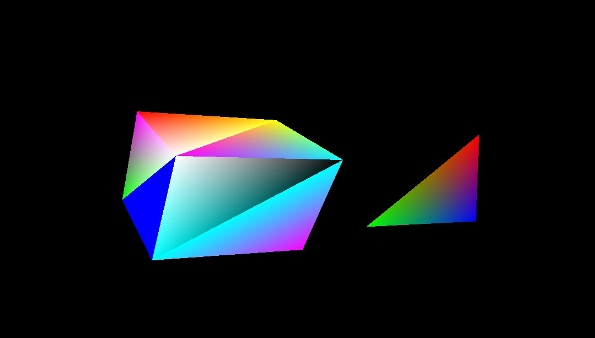

## Design Example: Example Setup for a Graphics and DisplayPort Based Sub-System

 This design example is primarily based on the graphics processing unit
 and the DisplayPort on a Zynq® UltraScale+™ MPSoC device. The main idea
 behind this example is to demonstrate the configurations, packages,
 and tool flow required for running designs based on GPU and DP on a
 Zynq UltraScale+ MPSoC device. This design example can be broken down
 into the following steps:

1. Configuring the hardware.
2. Configuring PetaLinux RootFS to include the required packages:

    1. GPU-related packages

    2. X Window System and dependencies

3. Building boot and Linux images using PetaLinux.
4. Building a graphics OpenGL ES application targeted for Mali GPU. This application is based on the X Window System.
5. Loading Linux on the ZCU102 board and running the graphics application on the target to see the result on the DisplayPort.

### Configuring the Hardware

 In this section, you will configure the processing system to set dual
 lower GT lanes for the DisplayPort. The hardware configuration in this
 section is based on the same Vivado project that you created in
 [Design Example 1: Using GPIOs, Timers, and Interrupts](#design-example-1-using-gpios-timers-and-interrupts).

#### Configuring Hardware in Vivado IP Integrator

1. Ensure that the edt_zcu102 project and the block design are open in Vivado.

2. Double-click the Zynq UltraScale+ processing system block in the Block Diagram window and wait till the Re-customize IP page opens.

3. In the Re-customize IP window, click **I/O Configuration → High Speed**.

4. Deselect PCIe peripheral connection.

5. Expand DisplayPort and set Lane Selection to **Dual Lower**, as shown in following figure:

     

    >**Note:** The DisplayPort lane selection is set to Dual Lane to
    support UHD\@30 resolution in the design example of this tutorial.
    This configuration locks the display for UHD\@30 as well as lower
    resolutions such as 1080p60 for corresponding monitors.

6. Click **OK** to close the Re-customize IP wizard.

    >**CAUTION!** Do not click the **Run Block Automation** link. Clicking
    the link resets the design as per board preset and disables the
    design updates you made using in this section.*

7. Click **File → Save Block Design** to save the block design. Alternatively, press **Ctrl+S** to save the block design.

8. Click **Generate Bitstream**, re-synthesize the design and generate the bitstream.

9. After the bitstream is generated successfully, export the hardware platform using the Vivado export hardware platform wizard as shown in [Exporting Hardware Platform](#exporting-hardware-platform).

10. Copy the XSA file to a Linux host machine.

 The next section describes how to build Linux for your hardware
 configuration and also add additional software packages for GPU and
 the X Window System.

### Modifying the Configuration and Building Linux Images Using PetaLinux

 Reconfigure the PetaLinux BSP in sync with the new hardware changes.
 This section uses the PetaLinux project you created in Example
 Project: Create Linux Images using PetaLinux.

1. Change to the PetaLinux directory using the following command:

    `$ cd xilinx-zcu102-2020.1`

2. Copy the hardware platform ``edt_zcu102_wrapper.xsa`` in the Linux host machine.

3. Reconfigure the BSP using the following command:

    `$ petalinux-config --get-hw-description=<path containingedt_zcu102_wrapper.xsa>/`

    The PetaLinux configuration wizard opens.

4. Save and exit the wizard without any additional configuration settings. Wait until PetaLinux reconfigures the project.

5. Clean the existing bootloader image. This is to ensure that the bootloader is recreated in sync with new hardware design.

    `$ petalinux-build -c bootloader -x distclean`

### Building the Mali OpenGLES Application

 This section leads you through building a triangle-based cube
 application. This application is written in OpenGLES and is based on
 the X Window System. For more details and for the application source
 code, refer to ``tricube`` in the ``design_files`` folder of the zip file that
 accompanies this tutorial. See [Design Files for This Tutorial](2-getting-started.md#design-files-for-this-tutorial).

 Use the following steps to build the OpenGLES application:

1. Copy the entire ``tricube`` application source directory to the Linux host machine in the ``recipe-apps`` directory of the PetaLinux project.

    `<PetaLinux-Project>/project-spec/meta-user/recipes-apps/tricube`

2. Add the newly created ``tricube`` to ``user-rootfsconfig``, which is located in `<plnx_project>/project-spec/meta-user/conf/user-rootfsconfig`.

    With this addition, the file will appear as shown below:

    ```
    CONFIG_gpio-demo
    CONFIG_peekpoke
    CONFIG_tricube
    ```

3. Refer to recipe `tricube/tricube.bb` for detailed instructions and
     libraries used for building this application. The X Window System
     (X11) packages included while building the above application are
     application dependent. Libraries included in `tricube.bb` recipe are
     based on the packages that were used in the application.

### Enable GPU Libraries and Other Packages in RootFS

 In this section, you will use the PetaLinux RootFS configuration
 wizard to add the Mali GPU libraries. PetaLinux is shipped with Mali
 GPU libraries and device drivers for the Mali GPU. By default, the Mali
 driver is enabled in the kernel tree, but Mali user libraries need to
 be configured (on an as-needed basis) in the root file system. In
 addition to this, you will use the same wizard to include the X Window
 System libraries.

1. Open the PetaLinux RootFS Configuration wizard:

    `$ petalinux-config -c rootfs`

2. Navigate to and enable the following packages:

    ```
    Filesystem Packages ---> libs ---> libmali-xlnx ---> libmali-xlnx
    Filesystem Packages ---> libs ---> libmali-xlnx ---> libmali-xlnx-dev
    ```

    These packages enable you to build and run OpenGLES applications
    targeted for Mali GPU in the Zynq UltraScale+ MPSoC device.

3. Add the X11 package groups to add X Window related packages:

    ```
    Petalinux Package Groups > packagegroup-petalinux-x11 >packagegrouppetalinux-
    x11
    Petalinux Package Groups > packagegroup-petalinux-x11 >
    packagegroup-petalinux-x11-dev
    ```

4. Add the OpenGLES application created in the earlier section:

    `User Packages \-\--\ \[\*\]tricube`

5. After enabling all the packages, save the config file and exit the RootFS configuration settings.

6. Build the Linux images using the following command:

    `$ petalinux-build`

    >**Note:** If the PetaLinux build fails, use the following commands
    to build again:

7. Verify that the `image.ub` Linux image file is generated in the `images/linux` directory.

8. Generate the boot image for this design example as follows:

    ```
    $ petalinux-package --boot --fsbl images/linux/zynqmp_fsbl.elf --pmufw images/linux/pmufw.elf --atf images/linux/bl31.elf --fpga images/linux/system.bit
    --u-boot images/linux/u-boot.elf
    ```

 A `BOOT.BIN` Boot image is created. It is composed of the FSBL boot
 loader, the PL bitstream, PMU firmware, ATF, and U-Boot.

 >**IMPORTANT!:** This example uses GPU packages based on the X Window
 System, which is the default setting in PetaLinux 2019.2. To enable
 Frame Buffer fbdev based GPU packages in PetaLinux 2019.2, add the
 following line in `/project-spec/meta-user/conf/petalinuxbsp.conf`:
 >
 >*DISTRO_FEATURES_remove_zynqmp = " x11"*
 >
 >See the example eglfbdev application (based on fdev) available in the [Design Files for This Tutorial](2-getting-started.md#design-files-for-this-tutorial). For more information, see Xilinx Answer Record [68821](https://www.xilinx.com/cgi-bin/docs/ndoc?t=answers%3Bd%3D68821.html).

### Loading Linux and Running the OpenGLES Application on the Target and Viewing the Result on the DisplayPort

#### Preparing the SD Card

 Now that the Linux images and the application are both built, copy the ``BOOT.BIN`` and `image.ub` images to an SD card and load the SD card in the ZCU102 board/

#### Running the Application on a Linux Target

##### Setting Up the Target

1. Load the SD card into the J100 connector of the ZCU102 board.

2. Connect the micro USB cable to micro USB port J83 on ZCU102 board. Connect the other end to an open USB port on the host machine. Also, make sure that the JTAG cable is disconnected. If the JTAG cable is connected, the system might hang.

3. Connect a DisplayPort monitor to the ZCU102 board. The DisplayPort cable from the DP monitor can be connected to the DisplayPort connector on the ZCU102 board.

    >**Note:** These images were tested on a UHD\@30 Hz and FullHD\@60
    Hz DisplayPort capable monitor.

4. Configure the board to boot in SD boot mode by setting switch SW6.

5. Connect 12V power to the ZCU102 6-Pin Molex connector.

6. Start a terminal session, using Tera Term or Minicom depending on the host machine being used, as well as the COM port and baud rate for your system.

7. For port settings, verify the COM port in the device manager.

    There are four USB-UART interfaces exposed by the ZCU102 board. Select
    the COM port associated with the interface with the lowest number. In
    this case, for UART-0, select the COM port with interface-0.

#### Powering On the Target and Running the Applications

1. Turn on the ZCU102 board using SW1, and wait until Linux loads on the board.

2. After Linux loads, log in to the target Linux console using ``root`` for the login and password.

3. Set the display parameters and start ``Xorg`` with the correct depth.

    ```
    # export DISPLAY=:0.0
    # /usr/bin/Xorg -depth 16&
    ```

4. Run the ``tricube`` application.

   `# tricube`

    At this point, you can see a rotating multi-colored cube and a
    rotating triangle on the display port. Notice that the cube is also
    made of multi-colored triangles.

    
    
© Copyright 2017-2021 Xilinx, Inc.

Licensed under the Apache License, Version 2.0 (the "License"); you may not use this file except in compliance with the License. You may obtain a copy of the License at

http://www.apache.org/licenses/LICENSE-2.0

Unless required by applicable law or agreed to in writing, software distributed under the License is distributed on an "AS IS" BASIS, WITHOUT WARRANTIES OR CONDITIONS OF ANY KIND, either express or implied. See the License for the specific language governing permissions and limitations under the License.