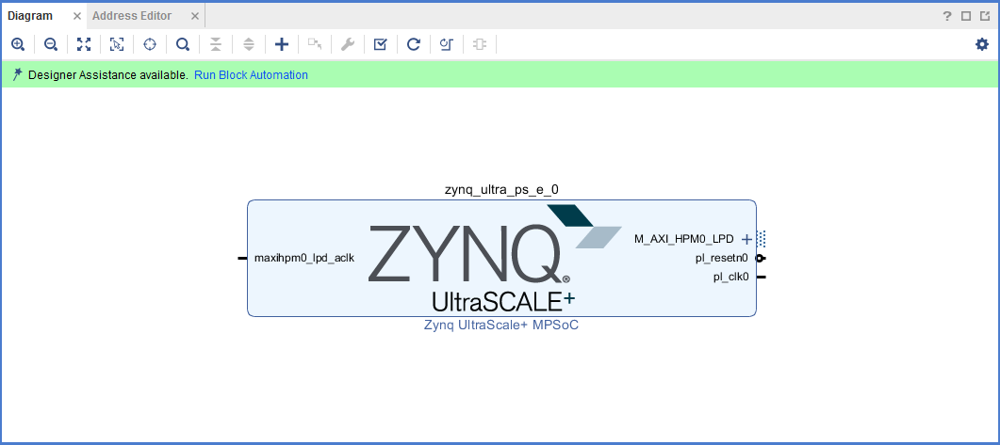

..
   Copyright 2015-2022 Xilinx, Inc.

   Licensed under the Apache License, Version 2.0 (the "License"); you may not use this file except in compliance with the License. You may obtain a copy of the License at http://www.apache.org/licenses/LICENSE-2.0.

   Unless required by applicable law or agreed to in writing, software distributed under the License is distributed on an "AS IS" BASIS, WITHOUT WARRANTIES OR CONDITIONS OF ANY KIND, either express or implied. See the License for the specific language governing permissions and limitations under the License.

====================================================================================
Zynq UltraScale+ MPSoC Processing System Configuration with the Vivado Design Suite 
====================================================================================

This chapter demonstrates how to use the Vivado |reg| Design Suite to develop an embedded system using the Zynq |reg| UltraScale+ |trade| MPSoC Processing System (PS).

The Zynq UltraScale+ device consists of quad-core Arm |reg| Cortex |trade|-A53-based APU, dual-core Arm |reg| Cortex |trade|-R5F RPU, Mali |trade| 400 MP2 GPU, many hard Intellectual Property (IP) components, and Programmable Logic (PL). This offering can be used in two ways:

-  The Zynq UltraScale+ PS can be used in a standalone mode, without attaching any additional fabric IP.

-  IP cores can be instantiated in fabric and attached to the Zynq UltraScale+ PS as a PS+PL combination.

Zynq UltraScale+ System Configuration
-------------------------------------

Creating a Zynq UltraScale+ system design involves configuring the PS to select the appropriate boot devices and peripherals. To start with, as long as the PS peripherals and available MIO connections meet the design requirements, no bitstream is required. This chapter guides you through creating a simple PS-based design that does not require a bitstream.

Example 1: Creating a New Embedded Project with Zynq UltraScale+ MPSoC
----------------------------------------------------------------------

For this example, you will launch the Vivado Design Suite and create a project with an embedded processor system as the top level.

Design Input and Output files
~~~~~~~~~~~~~~~~~~~~~~~~~~~~~

This example design requires no input files. We will create the Vivado design from scratch. The design includes the processing system module of the MPSoC. No PL IPs will be added in this example design, so this design does not need to run through implementation and bitstream generation.

The output of this example design is the hardware configuration XSA. It will be used for further software development.

-  Input: N/A
-  Output: ``edt_zcu102_wrapper.xsa``

Starting Your Design
~~~~~~~~~~~~~~~~~~~~

1. Launch the Vivado Design Suite.

2. In the Vivado Quick Start page, click **Create Project** to open the New Project wizard.

3. Use the information in the following table to make selections in each of the wizard screens.

   +---------------------+----------------------+----------------------+
   | Screen              | System Property      | Setting or Command   |
   |                     |                      | to Use               |
   +=====================+======================+======================+
   | Project Name        | Project name         | **edt_zcu102**       |
   +---------------------+----------------------+----------------------+
   |                     | Project Location     | **C:/edt**           |
   +---------------------+----------------------+----------------------+
   |                     | Create Project       | Leave this checked   |
   |                     | Sub-directory        |                      |
   +---------------------+----------------------+----------------------+
   | Project Type        | Specify the type of  | RTL Project          |
   |                     | project to create    |                      |
   +---------------------+----------------------+----------------------+
   |                     | Do not specify       | Leave this checked.  |
   |                     | sources at this time |                      |
   |                     | check box            |                      |
   +---------------------+----------------------+----------------------+
   |                     | Project is an        | Leave this unchecked |
   |                     | extensible Vitis     |                      |
   |                     | platform             |                      |
   +---------------------+----------------------+----------------------+
   | Default Part        | Select               | Select **Boards**    |
   |                     |                      | tab                  |
   +---------------------+----------------------+----------------------+
   |                     | Display Name         | Select **Zynq        |
   |                     |                      | UltraScale+ ZCU102   |
   |                     |                      | Evaluation Board**   |
   +---------------------+----------------------+----------------------+
   | New Project Summary | Project Summary      | Review the project   |
   |                     |                      | summary              |
   +---------------------+----------------------+----------------------+

4. Click **Finish**. The New Project wizard closes and the project you just created opens in the Vivado design tool.

Creating a Block Design Project
~~~~~~~~~~~~~~~~~~~~~~~~~~~~~~~

You will now use the IP integrator to create a block design project.

1. In the Flow Navigator pane, expand IP integrator and click **Create Block Design**.

   .. image:: ./media/image7.png

   The Create Block Design wizard opens.

2. Use the following information to make selections in the Create Block Design wizard.

   +---------------------+-------------------+-------------------------------+
   | Screen              | System Property   | Setting or Command to Use     |
   +=====================+===================+===============================+
   | Create Block Design | Design Name       | edt_zcu102                    |
   +---------------------+-------------------+-------------------------------+
   |                     | Directory         | `<Local to Project>`          |
   +---------------------+-------------------+-------------------------------+
   |                     | Specify Source    | Set Design Sources            |
   +---------------------+-------------------+-------------------------------+

3. Click **OK**.

   The Diagram view opens with a message stating that this design is empty. The next step is to add some IP from the catalog.

4. Click **Add IP** |image1|.

5. In the search box, type ``zynq`` to find the Zynq device IP.

6. Double-click the **Zynq UltraScale+ MPSoC IP** to add it to the block design.

The Zynq UltraScale+ MPSoC processing system IP block appears in the Diagram view, as shown in the following figure.

Managing the Zynq UltraScale+ Processing System in Vivado
~~~~~~~~~~~~~~~~~~~~~~~~~~~~~~~~~~~~~~~~~~~~~~~~~~~~~~~~~

Now that you have added the processing system for the Zynq MPSoC to the design, you can begin managing the available options.

1. Double-click the **Zynq UltraScale+ Processing System** block in the Block Diagram window.

   The Re-customize IP view opens, as shown in the following figure. Notice that by default, the processor system does not have any peripherals connected.

   .. image:: ./media/image10.png

2. Click **Cancel** to exit the view without making changes to the design.

   .. tip:: *In the Block Diagram window, notice the message stating that designer assistance is available, as shown in the following figure. When designer assistance is available, you can click the link to have Vivado perform that step in your design.*

   .. image:: ./media/image12.png

3. You will now use a preset template created for the ZCU102 board. Click the **Run Block Automation** link.

   The Run Block Automation view opens.

4. Click **OK** to accept the default processor system options and make default pin connections.

   This configuration wizard enables many peripherals in the Processing System with some multiplexed I/O (MIO) pins assigned to them according to the board layout of the ZCU102 board. For example, UART0 and UART1 are enabled. The UART signals are connected to a USB-UART connector through UART to the USB converter chip on the ZCU102 board.

5. To verify, double-click the Zynq UltraScale+ Processing System block in the block diagram window.

   Note the check marks that appear next to each peripheral name in the Zynq UltraScale+ device block diagram, signifying the I/O Peripherals that are active.

   .. image:: ./media/image13.jpeg

6. In the block diagram, click one of the green I/O peripherals, as shown in the previous figure. The I/O Configuration view opens for the selected peripheral.

   .. image:: ./media/image14.png

   This page enables you to configure low speed and high speed peripherals. For this example, you will continue with the basic connection enabled using Board preset for ZCU102.

7.  In the Page Navigator, select **PS-PL Configuration**.

8. In PS-PL Configuration, expand **PS-PL Interfaces** and expand the **Master Interface**.

   The PS-PL AXI Master interface enables AXI HPM0 FPD and AXI HPM1 FPD in the default board setup. For this example, you start with a design with only PS logic (no PL), so the PS-PL interfaces can be disabled.

9. Deselect **AXI HPM0 FPD** and **AXI HPM1 FPD**. The PS-PL configuration looks like the following figure.

   .. image:: ./media/image15.png

10. Click **OK** to close the Re-customize IP wizard.

Validating the Design, Creating the Wrapper, and Generating the Block Design
~~~~~~~~~~~~~~~~~~~~~~~~~~~~~~~~~~~~~~~~~~~~~~~~~~~~~~~~~~~~~~~~~~~~~~~~~~~~

The block design provides all the IP configuration and block connection information. Vivado can validate the block design before running
synthesis and implementation. This can help save time if the design has errors. After validation, generate the source files from the block
design so that the synthesizer can consume and process them. You also need to generate a wrapper for the block design because Vivado requires the design top to be an HDL file.

1. Right-click in the white space of the Block Diagram view and select **Validate Design**. Alternatively, you can press the **F6** key.

   A message dialog box that states “Validation successful. There are no errors or critical warnings in this design” opens.

2. Click **OK** to close the message.

3. In the Block Design view, click the **Sources** page.

4. Click **Hierarchy**.

5. Under Design Sources, right-click **edt_zcu102** and select **Create HDL Wrapper**.

   The Create HDL Wrapper dialog box opens. Use this dialog box to create a HDL wrapper file for the processor subsystem.

   .. tip:: The HDL wrapper is a top-level entity required by the design tools.

6. Select **Let Vivado Manage Wrapper** and auto-update and click **OK**.

7. In the Block Diagram, Sources window, under Design Sources, you can see **edt_zcu102_wrapper** is created by Vivado. Expand the hierarchy, you can see **edt_zcu102.bd** is instantiated.

8. Select **Generate Block Design** from Flow Navigator -> IP INTEGRATOR.

   The Generate Output Products dialog box opens, as shown in the following figure.

   .. figure:: ./media/image18.png

      Generate Output Products dialog

   .. note:: If you are running the Vivado Design Suite on a Linux host machine, you might see additional options under Run Settings. In this case, continue with the default settings.

9. Select Synthesis Options to **Global** and click **Generate**.

   This step generates all the required output products for the selected source. For example, constraints do not need to be manually created for the IP processor system. The Vivado tools automatically generate the XDC file for the processor subsystem when **Generate Output Products** is selected.

   If you select **Out of Context Per IP**, Vivado runs synthesis for each IP during the generation. This takes longer than the Global option.

10. When the Generate Output Products process completes, click **OK**.

11. In the Block Diagram Sources window, click the **IP Sources** tab. Here you can see the output products that you just generated, as shown in the following figure.

    .. figure:: ./media/image19.png

       Generated output products

Exporting Hardware
~~~~~~~~~~~~~~~~~~

To write a hardware platform using the GUI, follow these steps:

1. Select **File→ Export → Export Hardware** in the Vivado Design Suite. The Export Hardware Platform window opens.

2. Click **Next**.

3. In the output window, select **Pre-synthesis** and click **Next**.

4. Provide the **XSA file name** and **Export path**, then click **Next**.

   .. figure:: ./media/image20.png

      Files window for Export Hardware

5. Click **Finish** to generate the hardware platform file in the specified path. It will be the input file of next examples.

   .. note:: The difference between the pre-synthesis XSA and the post-implementation XSA for embedded designs is whether the bitstream is included. If you are running applications in the Vitis IDE, you can configure the bitstream to hardware before running the application. If there is a bitstream in the XSA file, the Vitis IDE uses it by default. If a bitstream is not available, or if you wish to use another bitstream file, specify the bitstream path in the Vitis IDE.

   For this example, we do not have programmable logic, so the pre-synthesis XSA is used.

Example Summary
~~~~~~~~~~~~~~~

In this example, you created a Vivado design with an MPSoC processing system and configured it for the ZCU102 board. You exported the hardware XSA file for future software development example projects.

In the :doc:`next chapter <./4-build-sw-for-ps-subsystems>`, you will learn how to develop software based on the hardware created in this example.

.. |trade|  unicode:: U+02122 .. TRADEMARK SIGN
   :ltrim:
.. |reg|    unicode:: U+000AE .. REGISTERED TRADEMARK SIGN
   :ltrim: