# Advanced Debug Techniques

This section covers the use of the Vitis™ software platform to debug a Linux kernel using the OS aware debug feature. OS aware debug over JTAG helps you to visualize the following OS-specific information, although this is not an exhaustive list:

- Processes/threads that are currently running
- Process-/thread-specific stack trace
- Registers
- Variables 

To support this, the JTAG debugger identifies the OS running on the target and is aware of the intrinsics of the OS. You can debug the OS running on the processor cores and the processes/threads running on the OS simultaneously: more details are provided below. Also, if you don't have a board in hand, you can use QEMU for debug.

## Getting Started

To start the debug session, perform the following steps:

1. Install the PetaLinux 2021.1 tool on your development environment.
2. Download the 2021.1 [Petalinux ZCU102 BSP](https://www.xilinx.com/member/forms/download/xef.html?filename=xilinx-zcu102-v2021.1-final.bsp) from the Xilinx website (`xilinx-zcu102-v2021.1-final.bsp`).
3. Source the PetaLinux tool locally.
4. Run the following command: `petalinux-create -t project -n OS_debug -s xilinx-zcu102-v2021.1-final.bsp`.
5. Change the directory to `OS_debug/`.
5. Disable `cpuidle` so that the debugger works properly by editing the file `./project-spec/meta-user/recipes-bsp/device-tree/files/system-user.dtsi` with the following:

   ```
   /include/ "system-conf.dtsi"
   / {
      chosen {
         bootargs = "earlycon clk_ignore_unused cpuidle.off=1";
         stdout-path = "serial0:115200n8";
      };
   };
   ```
6. Run ``petalinux-config``. Browse to **Image Packaging Configuration > INITRAMFS/INITRD Image Name** and change from the existing ``petalinux-initramfs-image`` to ``petalinux-image-minimal``. Save the modifcation and exit menuconfig. Starting from 2021.1, this change is required to load the complete rootfs post boot. For more details, refer to the "Option to Change RAM-Based Filesystem" section in the _PetaLinux Tools Reference Guide_ ([UG1144](https://www.xilinx.com/cgi-bin/docs/rdoc?v=latest;d=ug1144-petalinux-tools-reference-guide.pdf)).

   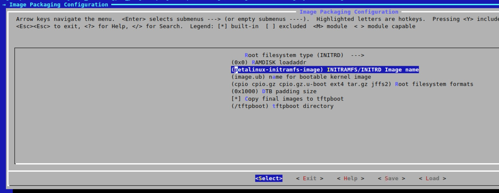
   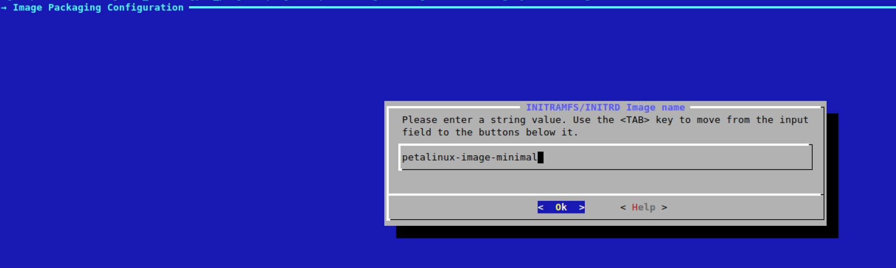
   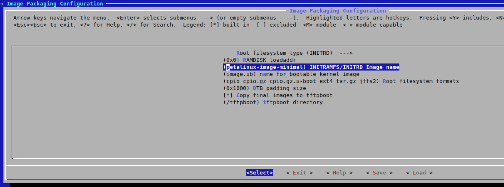

7. Run ``petalinux-build``.
8. Run ``petalinux-package --boot --format BIN --fsbl images/linux/zynqmp_fsbl.elf --u-boot images/linux/u-boot.elf --fpga images/linux/system.bit --force``.

To boot the Linux kernel, perform the following steps:

1. Copy the `image.ub`, `BOOT.BIN`, and `boot.scr` to the SD card.
2. Connect the SD card to the ZCU102 board.
3. Set the UART terminal to ``baudrate =115200`` and start the board.

## Setting Up the OS Aware Debug Session

1. Launch the Vitis software platform, version 2021.1. Make sure your board is connected to host PC using JTAG. If you are using a remote board, refer to the remote connection section.
2. Select **Debug > Debug Configurations**.
3. Double-click **Single Application Debug** and make sure the option **Attach to running target** is selected for the Debug Type.
4. Click **Debug** to apply the debug configuration and launch the debugger.

   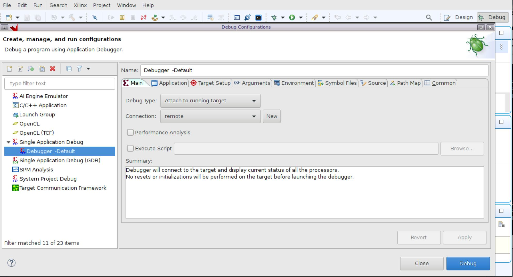

5. The debugger launches, but you will not yet see any kernel-related information. Select **PSU > APU > Cortex-A53#0**, then right-click and select **Symbol Files** to set the symbol files for the kernel so that the symbols and source code information are available to the Vitis IDE.

   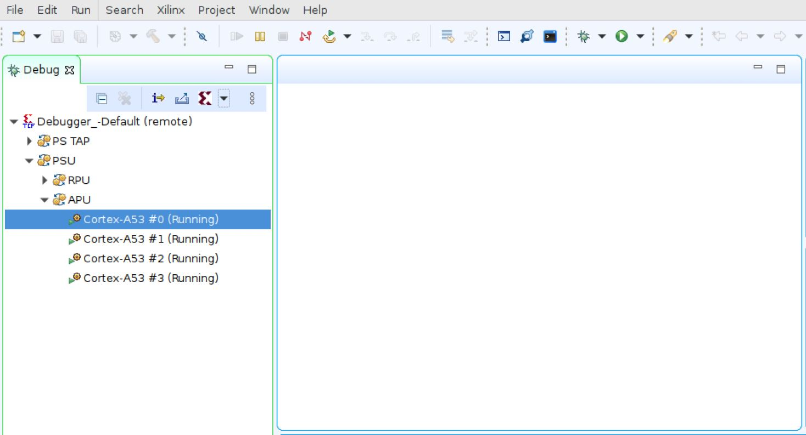

6. In the menu, click **Add** and set the path to the `vmlinux` file, which is available at `<petalinux_proj_path>/images/linux/vmlinux`. Select the other options as shown in the image below. Click **OK**, then click **OK** again in the Symbol Files window.

   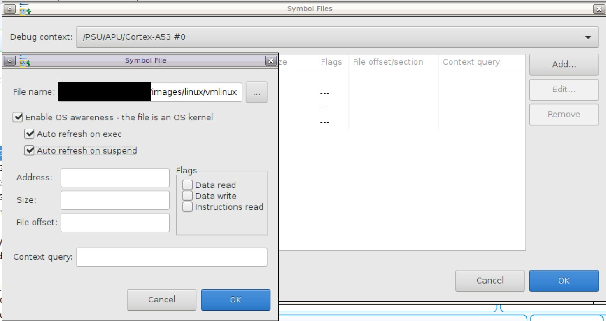

10. Wait for a minute or so, and then you will be able to see the Linux option appear beneath APU.

   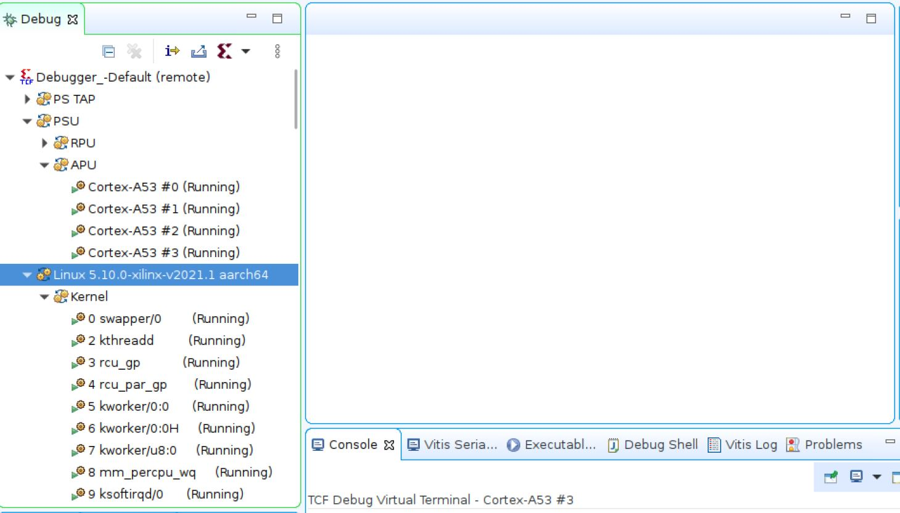

## Debug View

In Debug view, you can see the kernel threads and processes that are running.

The top part of the view shows the kernel threads that are running on the target board:


The bottom part of the view shows the processes that are running on the target board: If you run a top command in the Linux kernel, you can see the process identifiers (PIDs) which match with the process view in the Vitis IDE. In the following example, the PID of uhdpc is 747, and the same can be seen in the Vitis process list.

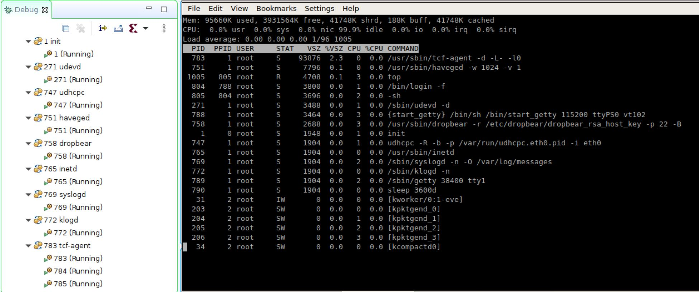


### Error 1: AXI GPIO Application Debug

The application used here is a sample GPIO userspace application which uses `sysfs` calls to manage the on-board LED on ZCU102. The design uses an AXI GPIO connected to the 8-bit LEDs on the ZCU102 board.

**Note:** The PetaLinux project must be rebuilt for this example.

The Vivado example design, shown in the following figure, has an AXI GPIO connected to the Zynq UltraScale+ MPSoC Processor Configuration IP. The AXI GPIO is further connected to the on-board 8-bit LED available on the ZCU102 board (GPIO_LED[7-0]: DS38, DS37, DS39, DS40, DS41, DS42, DS43, DS44). Refer to callout 21 in the ZCU102 Evaluation Board Components figure in the _ZCU102 Evaluation Board User Guide_ ([UG1182](https://www.xilinx.com/support/documentation/boards_and_kits/zcu102/ug1182-zcu102-eval-bd.pdf)) for the location of the LEDs on the board.

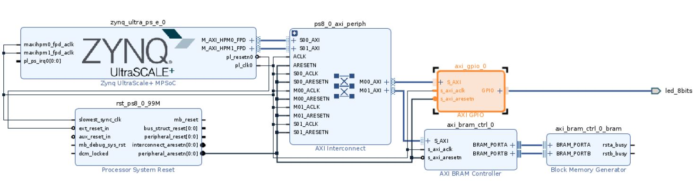

#### Vivado

In Vivado, source the `Vivado.tcl` file which generates the block design and runs through the synthesis, implementation, and device image generation processes automatically. This completes the generation of the required hardware for building the software artifacts.

1. Source ``settings.sh`` for Vivado 2021.1. To create the project, browse to the scripts folder and run the following from the command line:

   ```
   vivado -source vivado.tcl
   ```

2. The Vivado project will be built in the ``Hardware`` directory. Wait until the "Device Image Generation successfully completed" message appears, then click **Open Implemented Design**. 

3. You can export the XSA to the ``Hardware`` folder using the following Tcl command:

   ```write_hw_platform -fixed -include_bit -force -file ../Hardware/mpsoc_preset_wrapper.xsa```

#### PetaLinux

In PetaLinux, import the custom hardware generated from Vivado on top of the ZCU102 BSP. After the project build is completed, you should have the kernel image and the required root file system to load Linux on the ZCU102 board. 

Perform the following steps using PetaLinux 2021.1.

1. Run ``petalinux-create -t project -n gpio_project -s xilinx-zcu102-v2021.1-final.bsp``. 
2. Change the directory to ``gpio_project/``.
3. Run ``petalinux-config --get-hw-description=./Hardware``(point to the folder where the ``mpsoc_preset_wrapper.xsa`` file is present).
4. Disable ``cpuidle`` so that the debugger works properly by edit the file ``./project-spec/meta-user/recipes-bsp/device-tree/files/system-user.dtsi`` with the following:

   ```
   /include/ "system-conf.dtsi"
   / {
      chosen {
         bootargs = "earlycon clk_ignore_unused cpuidle.off=1";
         stdout-path = "serial0:115200n8";
      };
   };
   ```
5. Run ``petalinux-config``. Browse to **Image Packaging Configuration > INITRAMFS/INITRD Image Name** and change from the existing ``petalinux-initramfs-image`` to ``petalinux-image-minimal``. Save the modifcation and exit menuconfig.

   
   
    

6. Run ``petalinux-build``. 
7. Run ``petalinux-package --boot --format BIN --fsbl images/linux/zynqmp_fsbl.elf --u-boot images/linux/u-boot.elf --fpga images/linux/system.bit --force``.

#### Vitis

In the Vitis IDE, import the custom hardware generated from Vivado to build your Linux userspace application which will be executed after loading Linux. The userspace application uses SysFS calls to the GPIO driver and is used to toggle the ZCU102 on-board LEDs connected to the AXI GPIO IP.

1. Source ``settings.sh`` for Vitis 2021.1 or launch an XSCT instance. Enter the ``scripts`` directory, and from the command line run the following:

   ```xsct vitis.tcl```

   The Vitis workspace will be created in the ``scripts`` folder in a folder with the same name as you have specified for your workspace.  Launch the  Vitis IDE and select the workspace to open the working directory.

2. Copy the ``testapp_a53.elf`` application over to the SD card along with the ZCU102 Linux images, and boot the board.

2. Set up OS aware debug ([see above](#setting-up-the-os-aware-debug-session)) in the Vitis workspace you have built. Set the path map to point to the compiled ``testapp_a53.elf`` executable on your local system.

   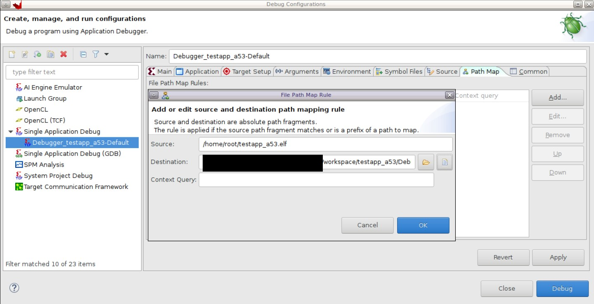

3. Mount the SD card, copy the ELF to the Linux file system, and execute the application. You will notice that the LED DS38 is not on. 

4. To debug this issue, set a breakpoint in the application ``main()`` function in the workspace as shown below.

   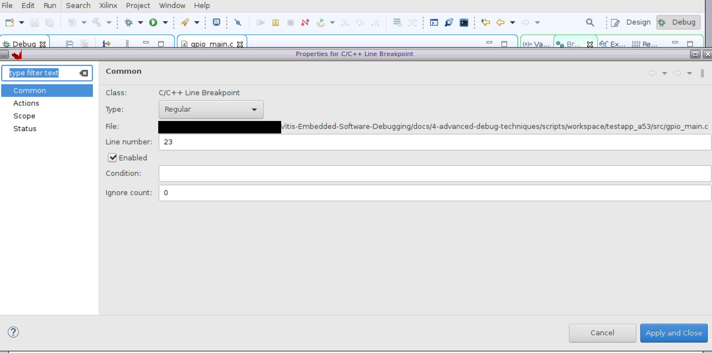

5. Relaunch the application ``testapp_a53.elf``. It should hit the breakpoint.

   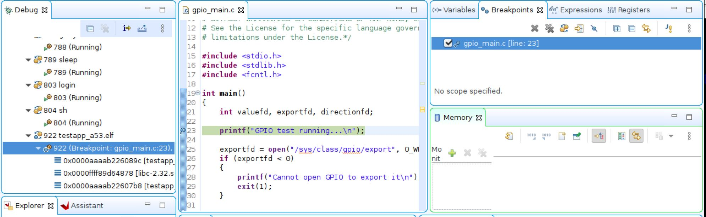

6. Run to line 66 of the ``gpio_main.c`` file.

   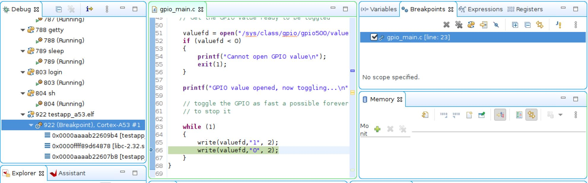

7. Use the Memory viewer to see what went wrong. Go to the XSCT console and enter the following:

   ```
   xsct% targets
   xsct% targets 5 <- this should point to the PSU instance from targets
   xsct% memmap -addr 0xa0000000 -size 0x10 <- 0xa0000000 is the base address of the AXI GPIO
   ```
   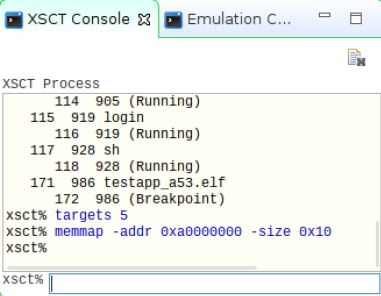

8. Select **PSU** in the Memory viewer add the address for the AXI GPIO base register: 0xA0000000.

   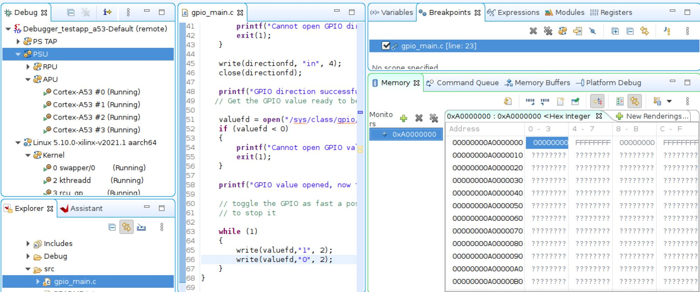

   Refer to the AXI GPIO register address:

   ```
   0xA0000000 = GPIO_DATA = 0x00000000
   0xA0000004 = GPIO_TRI_STATE = 0xFFFFFFFF
   ```
   So, the LED is not glowing because by default the GPIO direction is set to input.

   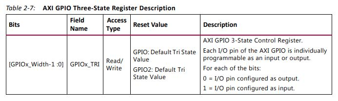

   This is happening because the direction is incorrectly set to input in the C code.

9. Modify the C code to set the direction to output from input: 

    ```
    write(directionfd, "out", 4);
	```

10. Rebuild the application and copy the updated one to the SD card. Repeat the steps above. 

11. In the Memory viewer, the value of register 0xA0000000 toggles between 0x0 and 0x1. You should see that the LED DS38 has started to glow.

   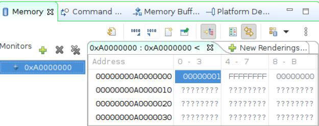

   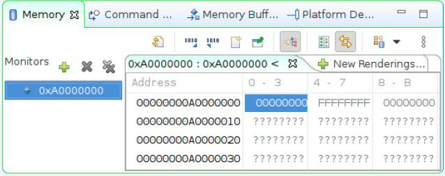

For more details about the AXI GPIO node, refer to [this page](https://xilinx-wiki.atlassian.net/wiki/spaces/A/pages/18841846/AXI+GPIO ) on the Xilinx wiki (specifically, the section about SysFS usage). 

**Note:** There is a known issue that the register 0XA0000004 value would not update in the Memory viewer. To check the direction, manually enter the following: 

```
root@xilinx-zcu102-2021_1:~# cat /sys/class/gpio/gpio500/direction 
out
```

### Error 2: Debugging a Kernel Crash

**Disclaimer:** This example is intended solely to demonstrate kernel-level debugging in the Vitis IDE.

1. Copy over the `BOOT.BIN`, `image.ub`, and `boot.scr` from `bootimages/Error_1_Kernel_Crash/` to the ZCU102 SD card and boot the board.

2. The boot should stop after a crash (see the following example).

   ```
   [    7.128821] user pgtable: 4k pages, 48-bit VAs, pgdp=000000087a082000
   [    7.135259] [0000000000000000] pgd=0000000000000000
   [    7.137519] usb 2-1: new SuperSpeed Gen 1 USB device number 2 using xhci-hcd
   [    7.140130] Internal error: Oops: 96000044 [#1] SMP
   [    7.152025] Modules linked in:
   [    7.155074] CPU: 1 PID: 143 Comm: kworker/1:1 Not tainted 5.4.0-xilinx-v2020.2 #1
   [    7.162548] Hardware name: ZynqMP ZCU102 Rev1.0 (DT)
   [    7.167512] Workqueue: events deferred_probe_work_func
   [    7.172643] pstate: 20000005 (nzCv daif -PAN -UAO)
   [    7.177429] pc : sdhci_arasan_probe+0x44/0x828
   [    7.181862] lr : platform_drv_probe+0x50/0xa0
   [    7.186209] sp : ffff8000124b3ae0
   [    7.189507] x29: ffff8000124b3ae0 x28: ffff00087a98cf00 
   [    7.194812] x27: ffff00087f7eab60 x26: 0000000000000000 
   [    7.200116] x25: ffff800010d8a000 x24: ffff00087a135040 
   [    7.205420] x23: ffff80001114ee10 x22: 0000000000000000 
   [    7.210724] x21: ffff00087ab75000 x20: ffff00087ab75010 
   [    7.216028] x19: 0000000000000000 x18: 0000000000000001 
   [    7.221332] x17: ffff00087a81df88 x16: 0000000008d9ee20 
   [    7.226636] x15: ffff00087a135468 x14: ffffffffffffffff 
   [    7.231940] x13: ffff000877eade8a x12: 0000000000000030 
   [    7.237244] x11: 0000000000000020 x10: 0101010101010101 
   [    7.242548] x9 : 0000000000000000 x8 : ffff000877ea9700 
   [    7.247852] x7 : 0000000000000000 x6 : 00000001aa251ab1 
   [    7.253156] x5 : 00ffffffffffffff x4 : 0000000000000000 
   [    7.258135] usb 2-1: New USB device found, idVendor=054c, idProduct=09c2, bcdDevice= 1.00
   [    7.258462] x3 : ffff00087a135040 x2 : 0000000000000000 
   [    7.266638] usb 2-1: New USB device strings: Mfr=1, Product=2, SerialNumber=3
   [    7.271924] x1 : ffff800010d8a828 x0 : 0000000000000000 
   [    7.271930] Call trace:
   [    7.279061] usb 2-1: Product: Storage Media
   [    7.284358]  sdhci_arasan_probe+0x44/0x828
   [    7.284363]  platform_drv_probe+0x50/0xa0
   [    7.286801] usb 2-1: Manufacturer: Sony
   [    7.290964]  really_probe+0xd8/0x2f8
   [    7.290968]  driver_probe_device+0x54/0xe8
   [    7.295058] usb 2-1: SerialNumber: 5C07104BE28715C291
   [    7.299044]  __device_attach_driver+0x80/0xb8
   [    7.299048]  bus_for_each_drv+0x74/0xc0
   [    7.299054]  __device_attach+0xdc/0x138
   [    7.304692] usb-storage 2-1:1.0: USB Mass Storage device detected
   [    7.306431]  device_initial_probe+0x10/0x18
   [    7.306435]  bus_probe_device+0x90/0x98
   [    7.306439]  deferred_probe_work_func+0x6c/0xa0
   [    7.306446]  process_one_work+0x1c4/0x338
   [    7.310742] scsi host2: usb-storage 2-1:1.0
   [    7.315564]  worker_thread+0x260/0x488
   [    7.315569]  kthread+0x120/0x128
   [    7.315573]  ret_from_fork+0x10/0x18
   [    7.315580] Code: f90067e2 d2800002 f90033e1 f94146bb (b900001f) 
   [    7.370880] ---[ end trace 7a82e0978c685cff ]---
   [    7.805494] [drm] Cannot find any crtc or sizes
   [    8.389808] scsi 2:0:0:0: Direct-Access     Sony     Storage Media    PMAP PQ: 0 ANSI: 6
   [    9.483269] sd 2:0:0:0: [sda] 15199296 512-byte logical blocks: (7.78 GB/7.25 GiB)
   [    9.491954] sd 2:0:0:0: [sda] Write Protect is off
   [    9.496748] sd 2:0:0:0: [sda] Mode Sense: 23 00 00 00
   [    9.502874] sd 2:0:0:0: [sda] No Caching mode page found
   [    9.508190] sd 2:0:0:0: [sda] Assuming drive cache: write through
   [    9.541220]  sda: sda1
   [    9.547109] sd 2:0:0:0: [sda] Attached SCSI removable disk
   ```
3. Set up the OS aware debug session by attaching to the running target. Load the attached symbol file, `vmlinux`, for the ZCU102 board. The `vmlinux` file should already have been generated as part of the steps outlined in [Getting Started](#getting-started).

4. In the Vitis IDE, add a breakpoint at the function `start_kernel`.

   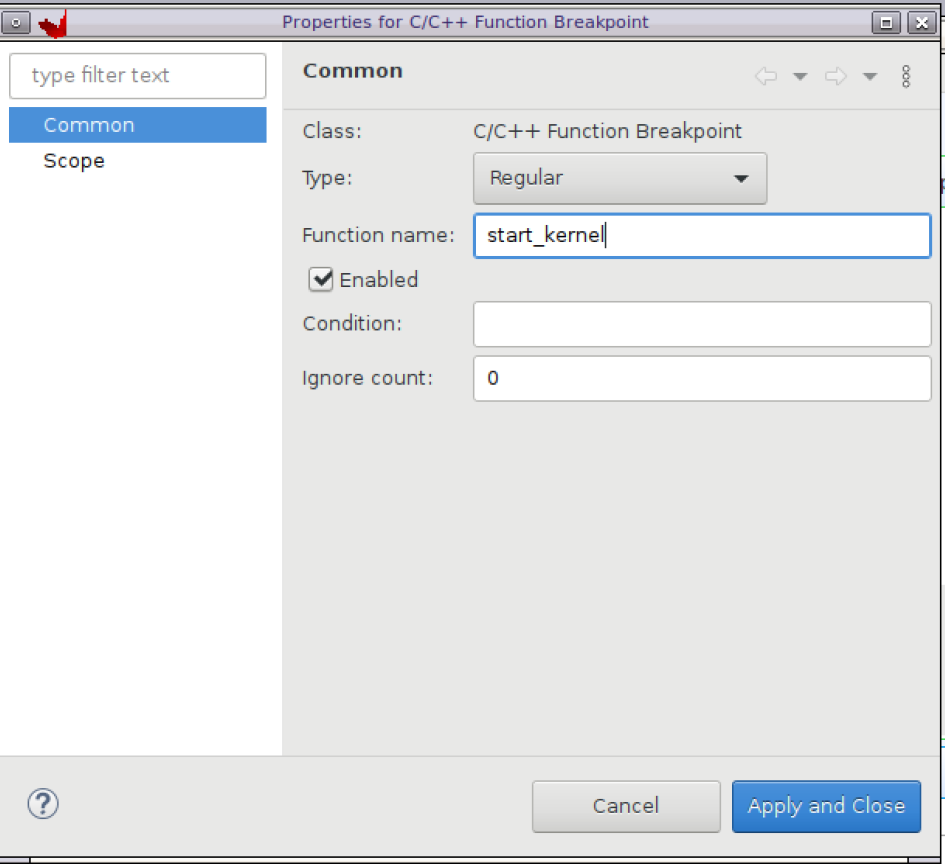

6. Restart the board and wait for the breakpoint to be hit.

7. Use the `step` function to move over the driver code and you will notice a bug related to a null pointer dereference. As can be seen in the crash, the issue seems to be with the probe function of the SDHCI driver code. The code can be reviewed [here](https://github.com/Xilinx/linux-xlnx/blob/master/drivers/mmc/host/sdhci-of-arasan.c).

8. When the driver is updated, the boot should work without issue.

**Note:** The default ZCU102 pre-built image will not have this error.

### Error 3: Debugging a Kernel Process

This section demonstrates how to debug a kernel process using the Vitis IDE. First, you need to complete the steps explained in [Setting Up the OS Aware Debug Session](#setting-up-the-os-aware-debug-session). You also need to ensure that you have PetaLinux set up as described in [Getting Started](#getting-started).

The next step focuses on the `dropbear` process. For more details about Dropbear, refer to [this website](https://matt.ucc.asn.au/dropbear/dropbear.html). By default, PetaLinux enables Dropbear while compiling the root file system, and then deletes the intermediate source files. These files are required for debugging `dropbear` or any other processes compiled by PetaLinux (e`x- udev`, `tcf-agent`, and so on). Perform the following steps to make sure that the source/symbols are _not_ deleted by the PetaLinux build.

1. Run the command `petalinux-build -c dropbear -x compile -f`. The files will be available at: `<petalinux_proj_path>/build/tmp/work/cortexa72-cortexa53-xilinx-linux/dropbear/2020.80-r0/build`. The executable is `dropbearmulti`. 

2. The next step is to set up the Linux OS aware debug session, but remember to set the path map for `dropbearmulti` before you do this. 

3. Open **Debug Configurations** and add the path map to point to the `dropbearmulti` source files.

   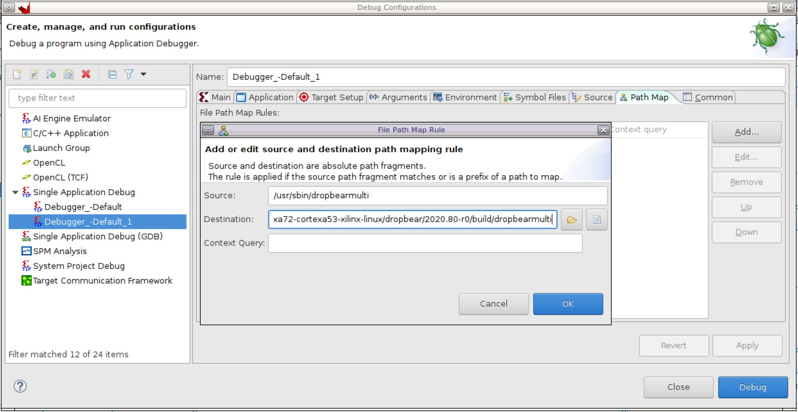

4. Launch the debug configuration and enable OS aware debug by setting the `vmlinux` symbol files.

5. Notice the PID of the `dropbear` in the Vitis IDE. Select the process, right-click it, and select **Suspend**.

   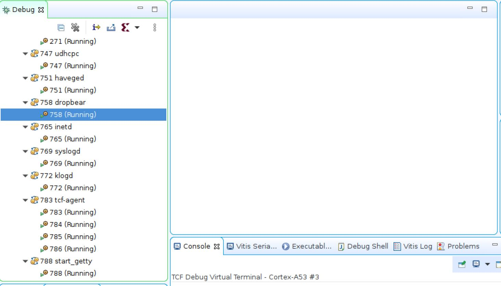

6. Locate the source file, `svr-main.c`, which can be found at `<petalinux_proj_path>/build/tmp/work/cortexa72-cortexa53-xilinx-linux/dropbear/2020.80-r0/dropbear-2020.80/svr-main.c`.

   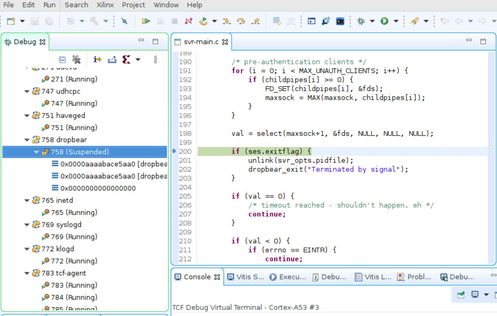

7. In line 114, notice function `main_noinetd()`. Add a breakpoint in the Vitis IDE, as illustrated in the following figure. 

   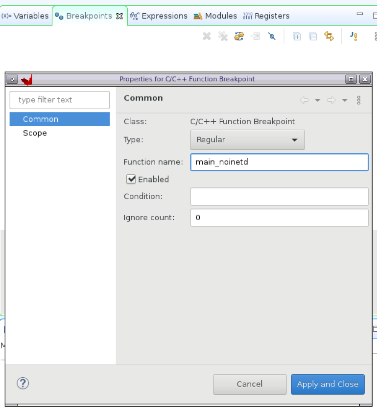

8. Resume the `dropbear` process by selecting it the Vitis IDE and pressing **F8**.

9. Stop the `dropbear` process and then restart it to see if the breakpoint can be hit.

   ```
   root@xilinx-zcu102-2021_1:~# /etc/init.d/dropbear stop  
   Stopping Dropbear SSH server: stopped /usr/sbin/dropbear (pid 758)
   dropbear.
   root@xilinx-zcu102-2021_1:~# /etc/init.d/dropbear start
   Starting Dropbear SSH server: dropbear
   ```

10. The breakpoint has been hit at `main_noinetd()`.

   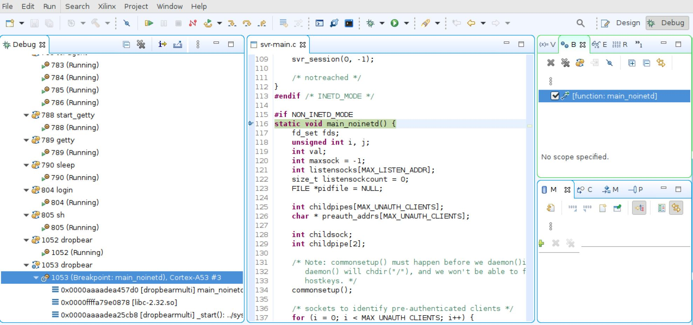

11. Use the `step` functions to browse over the code and debug if you see any issues.

   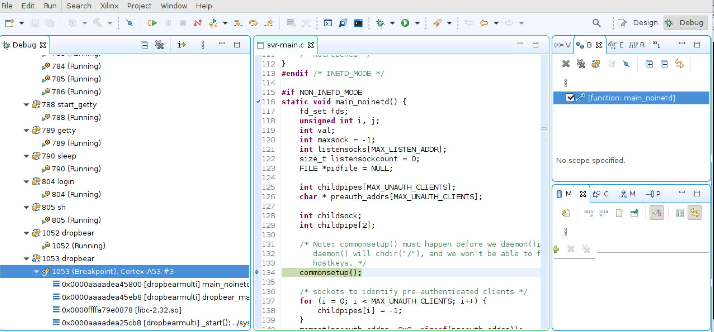

### Error 4: Debugging a Kernel Module

This section uses an example to demonstrate how to debug kernel modules easily using the Vitis IDE. It focuses on the lightweight Linux kernel module `lkm_demo1`. First, you need to complete the steps explained in [Setting Up the OS Aware Debug Session](#setting-up-the-os-aware-debug-session). You also need to ensure that you have PetaLinux set up as described in [Getting Started](#getting-started).

1. Run the command `petalinux-create -t modules --name lkm-demo1 --enable`. 

2. By default, the PetaLinux tools remove all the build artifacts after the build is completed successfully. To debug the kernel modules, the symbol and object files are required. You can retain the workspace for the Linux kernel and out-of-tree modules by adding the following variable to the `petalinuxbsp.conf` file at the end:

   ```
   $ vi ./project-spec/meta-user/conf/petalinuxbsp.conf

   RM_WORK_EXCLUDE += "lkm-demo1"
   ```

3. Replace the file `./project-spec/meta-user/recipes-modules/lkm-demo1/files/lkm-demo1.c` with the one available in the `src` folder.

4. The folder where the artifacts for `lkm-demo1` should be available is `<petalinux_proj_path>/build/tmp/work/zynqmp_generic-xilinx-linux/lkm-demo1/1.0-r0/`. 

5. Run the command `petalinux-build`.

6. Generate the `BOOT.BIN` and copy it over to the SD card along with `image.ub` and `boot.scr`.

7. Boot the board type the command `insmod /lib/modules/5.10.0-xilinx-v2021.1/extra/lkm-demo1.ko`. The module will crash as shown below.
  
   ```
   root@xilinx-zcu102-2021_1:~# insmod /lib/modules/5.10.0-xilinx-v2021.1/extra/lkm-demo1.ko 
   [   90.899879] <1>Hello module world.
   [   90.903310] Organized Panic!......
   [   90.906725] Unable to handle kernel NULL pointer dereference at virtual address 0000000000000000
   [   90.915505] Mem abort info:
   [   90.918297]   ESR = 0x96000046
   [   90.921340]   EC = 0x25: DABT (current EL), IL = 32 bits
   [   90.926649]   SET = 0, FnV = 0
   [   90.929698]   EA = 0, S1PTW = 0
   [   90.932837] Data abort info:
   [   90.935709]   ISV = 0, ISS = 0x00000046
   [   90.939539]   CM = 0, WnR = 1
   [   90.942500] user pgtable: 4k pages, 48-bit VAs, pgdp=0000000805206000
   [   90.948934] [0000000000000000] pgd=000000080664e003, p4d=000000080664e003, pud=0000000805cf1003, pmd=0000000000000000
   [   90.959554] Internal error: Oops: 96000046 [#1] SMP
   [   90.964422] Modules linked in: lkm_demo1(O+) zocl(O) uio_pdrv_genirq
   [   90.970782] CPU: 1 PID: 814 Comm: insmod Tainted: G           O      5.10.0-xilinx-v2021.1 #1
   [   90.979295] Hardware name: ZynqMP ZCU102 Rev1.0 (DT)
   [   90.984252] pstate: 60000005 (nZCv daif -PAN -UAO -TCO BTYPE=--)
   [   90.990256] pc : lkm_demo1_init+0x38/0x1000 [lkm_demo1]
   [   90.995478] lr : lkm_demo1_init+0x28/0x1000 [lkm_demo1]
   [   91.000691] sp : ffff80001429bb10
   [   91.003997] x29: ffff80001429bb10 x28: 0000000000000013 
   [   91.009302] x27: 0000000000000100 x26: ffff800008ddd280 
   [   91.014606] x25: ffff8000100ecf80 x24: 0000000000000003 
   [   91.019910] x23: 0000000000000000 x22: ffff000800344080 
   [   91.025214] x21: ffff800008de0000 x20: ffff000800344080 
   [   91.030518] x19: ffff800008ddd000 x18: 0000000000000030 
   [   91.035822] x17: 0000000000000000 x16: 0000000000000000 
   [   91.041126] x15: ffff000800344498 x14: 0720072007200720 
   [   91.046430] x13: ffff8000113c3de0 x12: 000000000000053d 
   [   91.051734] x11: 00000000000001bf x10: ffff8000113efde0 
   [   91.057038] x9 : 00000000fffff800 x8 : ffff8000113c3de0 
   [   91.062342] x7 : ffff8000113efde0 x6 : 0000000000000000 
   [   91.067646] x5 : 0000000000005ff4 x4 : 0000000000000000 
   [   91.072950] x3 : 0000000000000000 x2 : 0000000000000000 
   [   91.078254] x1 : ffff800008ddd000 x0 : ffff800008ddc000 
   [   91.083558] Call trace:
   [   91.086001]  lkm_demo1_init+0x38/0x1000 [lkm_demo1]
   [   91.090873]  do_one_initcall+0x54/0x1bc
   [   91.094699]  do_init_module+0x54/0x240
   [   91.098438]  load_module+0x1ec8/0x2500
   [   91.102180]  __do_sys_finit_module+0xb8/0xfc
   [   91.106442]  __arm64_sys_finit_module+0x24/0x30
   [   91.110967]  el0_svc_common.constprop.0+0x94/0x1c0
   [   91.115750]  do_el0_svc+0x44/0xb0
   [   91.119057]  el0_svc+0x14/0x20
   [   91.122102]  el0_sync_handler+0x1a4/0x1b0
   [   91.126104]  el0_sync+0x174/0x180
   [   91.129415] Code: d2800002 b0ffffe1 91000033 90ffffe0 (b900005f) 
   [   91.135499] ---[ end trace a492e574dceee8f8 ]---
   Segmentation fault
   ```

You can now use Vitis OS aware debug to check what has gone wrong in the kernel module. To do that, power cycle the board and relaunch the Linux kernel on the target board. Do not insert the module. Set up the Linux OS aware debug by following the steps explained in [Setting Up the OS Aware Debug Session](#setting-up-the-os-aware-debug-session). When the OS aware debug view is ready, work through the following steps. 

1. Open **Debug > Debug Configurations** and go to the **Path Map** tab. 

   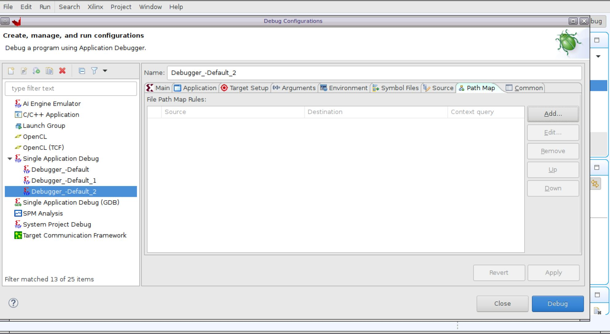

2. Click **Add** and provide the link to the artifacts of the `lkm-demo1.ko` file (`<petalinux_proj_path>/build/tmp/work/zynqmp_generic-xilinx-linux/lkm-demo1/1.0-r0/lkm-demo1.ko`). 

   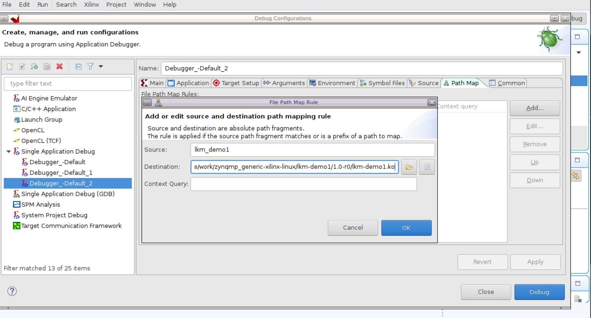

3. Apply and click **Debug**.

4. Debug session will get launched. If in case the Linux processes are not seen, then set the `vmlinux` file as mentioned in the Getting Started section.

5. Go to the **Breakpoints** tab and add a C/C++ function breakpoint at the function `lkm_demo1_init` (this is the module init function).

   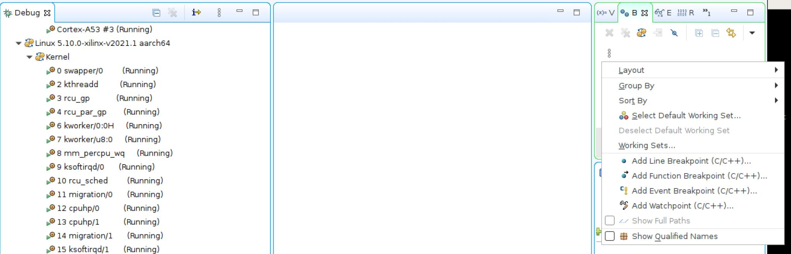

   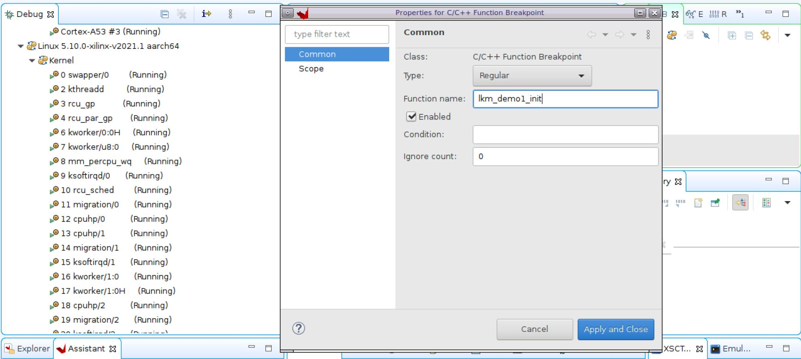

6. Browse over to the Linux kernel prompt and run `insmod /lib/modules/5.10.0-xilinx-v2021.1/extra/lkm-demo1.ko`.

7. Wait for the breakpoint to be hit in the Vitis IDE. 

   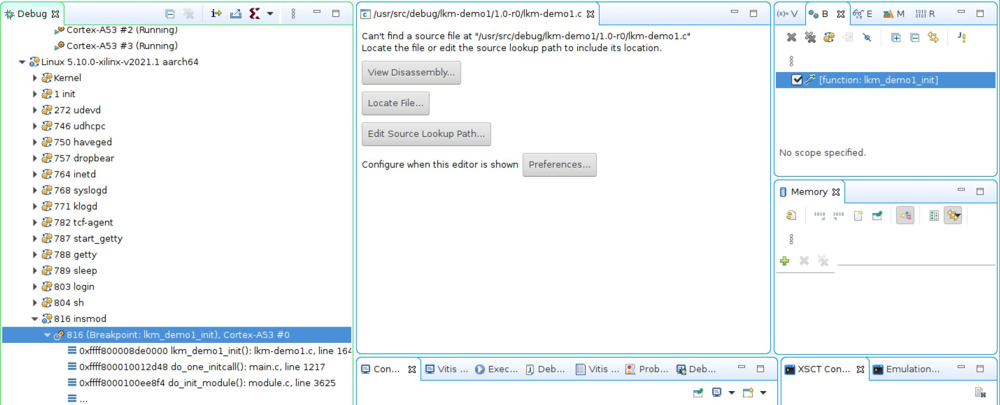

8. Look for the source files using the Locate Files option. The file should be available at `<petalinux_proj_path>/build/tmp/work/zynqmp_generic-xilinx-linux/lkm-demo1/1.0-r0/lkm_demo1.c`. 

9. Step over the code and you will see the problem:

   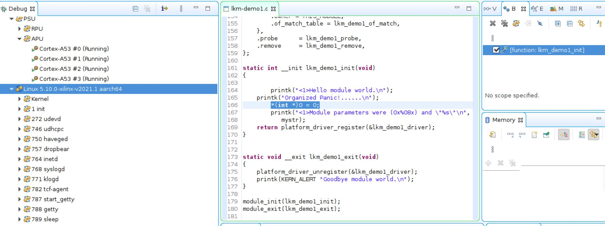

   In parallel, you can see the `printks` on the Linux terminal:

   ```
   root@xilinx-zcu102-2021_1:~# insmod /lib/modules/5.10.0-xilinx-v2021.1/extra/lkm-demo1.ko 
   [   67.665105] <1>Hello module world.
   [   67.668523] Organized Panic!......
   ```

   Refer to line 166, where there is a NULL pointer dereference which is causing the segmentation fault.

10. Make the changes in the `lkm_demo1.c` file and rebuild the image. You can now fix the kernel module crash issue and debug it.

### Error 5: Debug Using QEMU

Repeat the steps from [Debugging Bare-Metal Applications](/docs/Vitis-Embedded-Software-Debugging/docs/2-debugging-bare-metal-applications) but this time using QEMU. To launch debug using QEMU, refer to [Standalone Application Debug Using System Debugger on QEMU](https://docs.xilinx.com/r/en-US/ug1400-vitis-embedded/Standalone-Application-Debug-Using-System-Debugger-on-QEMU).

## Further Reading

### Attaching an Application to System Debugger

Refer to [Attach and Debug using Xilinx System Debugger](https://docs.xilinx.com/r/en-US/ug1400-vitis-embedded/Attach-and-Debug-using-Xilinx-System-Debugger) for more information. 

### Path Mapping

When an application is compiled with debug flags (for example, `-O0 -g`), the compiler stores references to the source paths in the debug sections of the ELFs. This information is used by the debugger to map the PC address of the target processor to the source line in the code. Path mapping allows you to debug an application when its sources are not available at the location where it was compiled. For example, you can compile an application on Windows and debug it on Linux, or debug a pre-built Linux kernel image, without having to recompile the sources. In both cases, you can download and run the images using [XSCT](https://docs.xilinx.com/r/en-US/ug1400-vitis-embedded/Xilinx-Software-Command-Line-Tool?tocId=CwnQ90bFNEhE~pGBspGuOQ), and then attach the debugger.

After this is done, the debugger should issue a warning about the missing source files when the processor is stopped. You can then enable path mapping in one of the following ways, so that the debugger can find the sources from a different location. 

**Note:** The source files at the new location should exactly match the source files at the original location.

1. Click **Edit source lookup path**.
2. Right-click **Debug Configuration** and select **Path Mapping**.
3. Select **Add Path Mapping**.
4. Enter the compilation path as the source path. Enter the new location where the sources are available as the destination path. For example, if the application was compiled at `C:\testapp`, and the same sources are available at `/scratch/source`, the source path would be `C:\testapp`, and the destination path would be `/scratch/source`.
5. Save the settings by clicking **OK**. The debugger now shows the source files from the new path.

### Using Remote Host

Refer to [Using a Remote Host with System Debugger](https://docs.xilinx.com/r/en-US/ug1400-vitis-embedded/Using-a-Remote-Host-with-System-Debugger) for more information. 

### Basic Setup for OS Aware Debug

These steps are required if you are _not_ using the Xilinx provided BSP. The kernel must be built with the following steps for OS aware debug to work. 

1. Enable kernel debug and debug info in the kernel menuconfig:
   - Type `petalinux-config -c kernel`.
   - Go to **Kernel hacking**.

     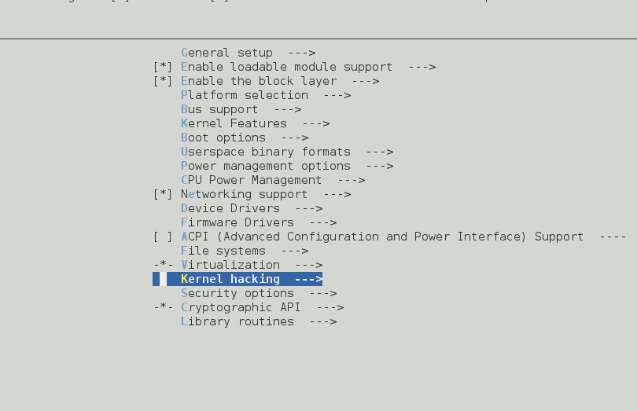

   - Make sure that kernel debugging is enabled.
   
     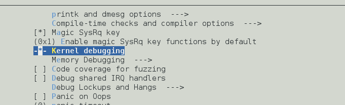

   - Go to **Compile-time checks and compiler options**.
   
     

   - Make sure that **Compile the kernel with debug info** is enabled.
   
     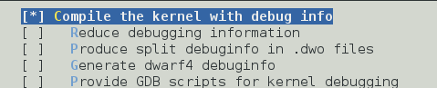

2. Disable CPU idle power management:
   - Go to CPU power management and disable CPU idle PM support (only for Zynq UltraScale+ MPSoC).
   - Save the configuration and exit.
   - When the exit is completed, press **enter**.

3. Run the PetaLinux build using the `petalinux-build` command.
   - Copy over the `BOOT.BIN`, `image.ub`, and `boot.scr` from the `linux/images/` folder to the SD card. 
   - Boot the board.

### OS Awareness (OSA) Options in the Vitis IDE

Refer to [Enabling OS Aware Debug](https://docs.xilinx.com/r/en-US/ug1400-vitis-embedded/Enabling-OS-Aware-Debug).

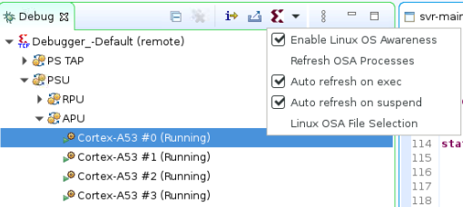

_Copyright 2021 Xilinx Inc. Licensed under the Apache License, Version 2.0 (the "License"); you may not use this file except in compliance with the License. You may obtain a copy of the License at http://www.apache.org/licenses/LICENSE-2.0. Unless required by applicable law or agreed to in writing, software distributed under the License is distributed on an "AS IS" BASIS, WITHOUT WARRANTIES OR CONDITIONS OF ANY KIND, either express or implied. See the License for the specific language governing permissions and limitations under the License._
