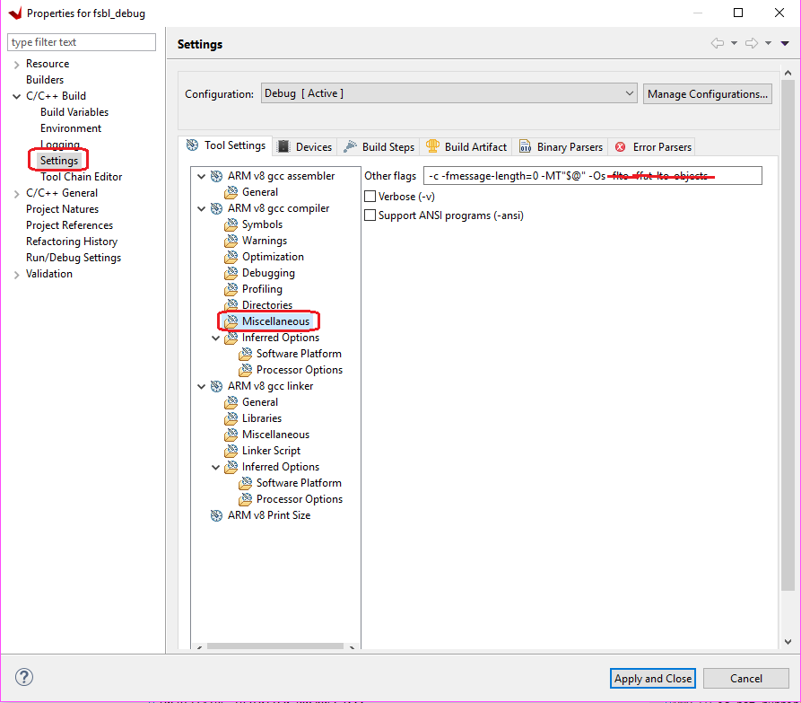

# Creating a Debuggable First Stage Boot Loader

First Stage Boot Loader (FSBL) can initialize the SoC device, load the required application or data to memory, and launch applications on the target CPU core. An FSBL is provided in the Vitis platform project (if you enabled creating boot components while creating the platform project), but you are free to create additional FSBL applications as general applications for further modification or debugging purposes.

## Enabling Detailed Prints in FSBL

If you desire more detailed information during the boot process, but are not planning to modify the FSBL source code, you can set FSBL to print more information - but it is not necessary to run FSBL in Vitis debugger. In this example, you will create an FSBL image targeted for Arm™ Cortex-A53 core 0 and update its properties to enable detailed print info.

1. Launch the Vitis IDE if it is not already open.

2. Set the Vitis workspace. For example, `C:\edt\fsbl_debug_info`.

3. Select **File → New → Application Project**. The New Project dialog box opens.

4. Use the information in the following table to make your selections in the New Project wizard:

   | Screen                      | System Properties                         | Settings                   |
   | --------------------------- | ----------------------------------------- | -------------------------- |
   | Platform                    | Create a new platform from hardware (XSA) |                            |
   |                             | XSA File                                  | zcu102                     |
   |                             | Platform Name                             | zcu102                     |
   |                             | Generate boot components                  | Uncheck                      |
   | Application project details | Application project name                  | fsbl_a53                   |
   |                             | System project name                       | fsbl_a53_system            |
   |                             | Target processor                          | psu_cortexa53_0            |
   | Domain                      | Domain                                    | standalone_psu_cortexa53_0 |
   |                             | Operating System                          | standalone                 |
   |                             | Processor                                 | psu_cortexa53_0            |
   |                             | Architecture                              | 64-bit                     |
   | Templates                   | Available templates                       | Zynq MP FSBL               |


    **Note:** To save build time, boot components are not created in this example. If the default FSBL is needed, check **Generate Boot Components**. 

5. Click **Finish**. The Vitis IDE creates the system project and the FSBL application.

By default, the FSBL is configured to show basic print messages. Next, you will modify the FSBL build settings to enable debug prints. For a list of the possible debug options for FSBL, refer to the `src/xfsbl_debug.h` file.

```C
#if defined (FSBL_DEBUG_DETAILED)
#define XFsblDbgCurrentTypes ((DEBUG_DETAILED) | (DEBUG_INFO) | (DEBUG_GENERAL) | (DEBUG_PRINT_ALWAYS))
#elif defined (FSBL_DEBUG_INFO)
#define XFsblDbgCurrentTypes ((DEBUG_INFO) | (DEBUG_GENERAL) | (DEBUG_PRINT_ALWAYS))
#elif defined (FSBL_DEBUG)
#define XFsblDbgCurrentTypes ((DEBUG_GENERAL) | (DEBUG_PRINT_ALWAYS))
#elif defined (FSBL_PRINT)
#define XFsblDbgCurrentTypes (DEBUG_PRINT_ALWAYS)
#else
#define XFsblDbgCurrentTypes (0U)
#endif
```

Medium level verbose printing is good for most designs. Enable `FSBL_DEBUG_INFO` by performing the following steps:

1. In the Explorer view, right-click the **fsbl_a53** application.

2. Click **C/C++ Build Settings**.

3. Select **Settings → ARM V8 gcc compiler → Symbols**.

4. Click the **Add** button.

   

5. Enter `FSBL_DEBUG_INFO`.

   

    The symbol settings are as shown in the following figure.

    

6. Click **OK** to accept the changes and close the Settings view. Now that the symbol is defined, GCC will build the application with this symbol.

## Stripping Out Unused Functions

The FSBL application is capable of performing numerous tasks. The tasks it executes are based on the user definition in header files. Some functions are not executed by default. GCC includes these functions into the compiled executable by default. Because FSBL runs on OCM, and OCM only has a capacity of 128 KB, unused functions must be stripped out to make FSBL fit into OCM. Run the following instructions to update the BSP compile settings to strip out unused functions:

1. Double-click **fsbl_a53.prj**. 
2. Click the **Navigate to the BSP settings** button. 
3. Click the **Modify BSP Settings...** button.
4. Under **Overview → Drivers → psu_cortexa53_0 → extra_compiler_flags**, edit **extra_compiler_flags** to append `-Os -flto -ffat-lto-objects`.

## Building the Project

Right-click the **fsbl_a53** application and select **Build Project**. The FSBL executable is now saved as ``fsbl_a53/debug/fsbl_a53.elf``. In this tutorial, the application name ``fsbl_a53`` is to identify that the FSBL is targeted for the APU (the Arm Cortex-A53 core).

**Note:** If the system design demands, FSBL can be targeted to run on the RPU.

## Debugging FSBL Using the Vitis Debugger

Sometimes you need to modify FSBL source code to add more custom features. To debug these features, you need to run FSBL in Vitis debugger. This example guides you through the steps to run FSBL in Vitis debugger.

FSBL is built with size optimization and link time optimization flags (such as `-Os`). These optimizations reduce the memory footprint of FSBL but can make debugging difficult. Removing optimizations can lead to increased code size, which can result in FBSL build failure (because FSBL needs to run on the 128 KB OCM). Instead, these optimizations should be disabled for debugging purposes. To do this, some FSBL features should be disabled in the ``xfsbl_config.h`` file of the FSBL if they are not required.

### Creating and Modifying FSBL

1. Launch the Vitis IDE if it is not already open.

2. Set the Vitis workspace. For example, `C:\edt\fsbl_debuggable`.

3. Select **File → New → Application Project**. The New Project dialog box opens.

4. Use the information in the following table to make your selections in the New Project wizard:

   | Screen                      | System Properties                         | Settings                   |
   | --------------------------- | ----------------------------------------- | -------------------------- |
   | Platform                    | Create a new platform from hardware (XSA) |                            |
   |                             | XSA File                                  | zcu102                     |
   |                             | Platform Name                             | zcu102                     |
   |                             | Generate boot components                  | Uncheck                      |
   | Application project details | Application project name                  | fsbl_debug                   |
   |                             | System project name                       | fsbl_debug_system            |
   |                             | Target processor                          | psu_cortexa53_0            |
   | Domain                      | Domain                                    | standalone_psu_cortexa53_0 |
   |                             | Operating System                          | standalone                 |
   |                             | Processor                                 | psu_cortexa53_0            |
   |                             | Architecture                              | 64-bit                     |
   | Templates                   | Available templates                       | Zynq MP FSBL               |

5. Click **Finish**. The Vitis IDE creates the system project and the FSBL application.

### Disabling Optimizations

1. In the Explorer view, right-click the **fsbl_debug** application.

2. Click **C/C++ Build Settings**.

3. Select **Settings→ Tool Settings page→ Arm v8 gcc Compiler→ Miscellaneous**.

4. Remove `-flto -ffat-lto-objects` from other flags, as shown below.

    


5.  Similarly, the **fsbl_debug_bsp** needs to be modified. Right-click **fsbl_debug_bsp** and select **Board Support Package Settings**.

6.  Under **Overview → Drivers → psu_cortexa53_0 → extra_compiler_flags**, edit **extra_compiler_flags** to ensure **extra compiler** only has this value `-g -Wall -Wextra -Os` as shown below.

    

7.  Click **OK** to save these settings. BSP rebuilds automatically after this.

8. The next step is to remove unused functions to save code space. Go to the **fsbl_debug→ src → fsbl_config.h file**. In the FSBL code, include the options and disable the following:

    - `#define FSBL_NAND_EXCLUDE_VAL (1U)`

    - `#define FSBL_SECURE_EXCLUDE_VAL (1U)`

    - `#define FSBL_SD_EXCLUDE_VAL (1U)`

 >**Note:** '1' is disable and '0' is enable.

 At this point, FSBL is ready to be debugged.

 You can either debug the FSBL like any other standalone application, or debug FSBL as a part of a boot image by using the **Attach to running target** mode in System Debugger.


<hr class="sphinxhide"></hr>

<p class="sphinxhide" align="center"><sub>Copyright © 2019–2024 Advanced Micro Devices, Inc.</sub></p>

<p class="sphinxhide" align="center"><sup><a href="https://www.amd.com/en/corporate/copyright">Terms and Conditions</a></sup></p>
