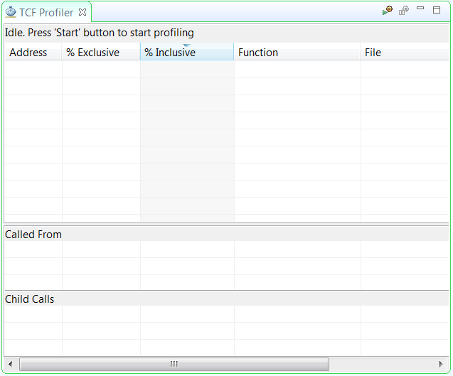
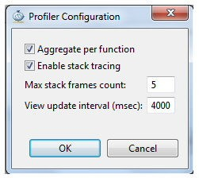
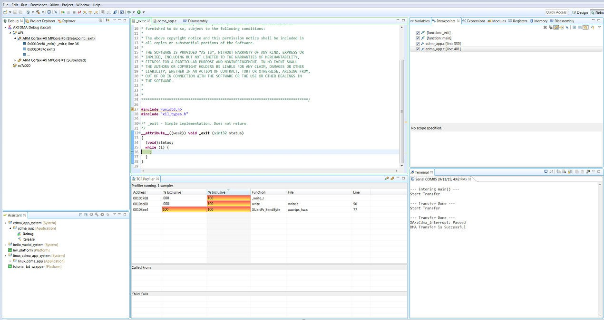

# Software Profiling Using the Vitis Software Platform

In this chapter, you will enable profiling features for the standalone
domain or board support package (BSP) and the application related to
AXI CDMA, which you created in [Linux Booting
and Debug in the Vitis Software Platform](docs\Introduction\Zynq7000-EDT\7-linux-booting-debug.md).

## Profiling an Application in the Vitis Software Platform with System Debugger

Profiling is a method by which the software execution time of each
routine is determined. You can use this information to determine
critical pieces of code and optimal code placement in a design.
Routines that are frequently called are best suited for placement in
fast memories, such as cache memory. You can also use profiling
information to determine whether a piece of code can be placed in
hardware, thereby improving overall performance.

You can use the system debugger in the Vitis unified software platform
to profile your application.

1.  Select the application you want to profile.

2.  Right-click the application and select **Debug As → Launch on Hardware (Single Application Debug)**.

If the Confirm Perspective Switch popup window appears, click **Yes**.
The Debug perspective opens.

3.  When the application stops at main, open the TCF Profiler view by
    selecting **Window→ Show view→ Debug→ TCF Profiler**.

    

4.  Click the **Start** button to begin
    profiling. Select the **Aggregate Per Function** option in the
    Profiler Configuration dialog box. Adjust the **View update
    interval** according to your required profile sample time. The
    minimum time is 100 ms.

        

5.  Click the **Resume** button to continue running the
    application.

    To view the profile data in the TCF Profiler view (shown in the
    following figure), you must add an exit breakpoint for the application
    to stop.

    

## Additional Design Support Options

To assist in your design goals, you might want to learn about the
System Performance Analysis (SPA) toolbox.

### The System Performance Analysis (SPA) Toolbox

To address the need for performance analysis and benchmarking, the
Vitis software platform has a System Performance Analysis (SPA)
toolbox to provide early exploration of hardware and software systems.
You can use this common toolbox for performance validation to ensure
consistent and expected performance throughout the design process.

For more information on exploring and exercising the SPA toolbox using
the Vitis software platform, refer to the following documentation:

-   *Vitis Unified Software Platform Documentation: Embedded Software
    Development*
    ([UG1400](https://www.xilinx.com/cgi-bin/docs/rdoc?v=2020.2%3Bd%3Dug1400-vitis-embedded.pdf))

-   *System Performance Analysis of an SoC*
    ([XAPP1219](https://www.xilinx.com/support/documentation/application_notes/xapp1219-system-performance-modeling.pdf))

Copyright © 2019–2024 Advanced Micro Devices, Inc.

<a href="https://www.amd.com/en/corporate/copyright">Terms and Conditions</a>

