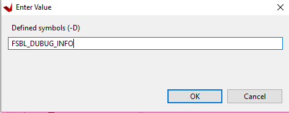
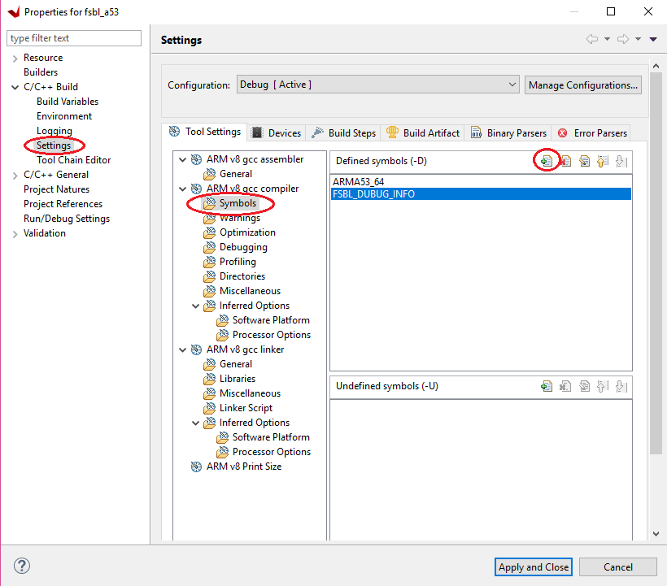
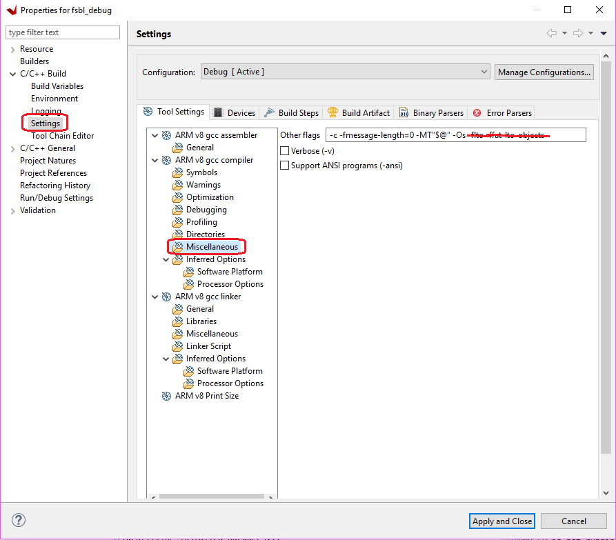
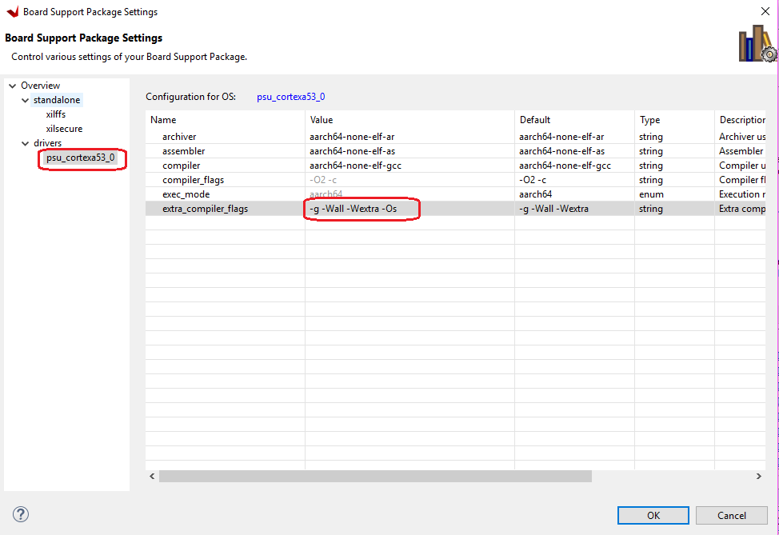

# Creating Debuggable First Stage Boot Loader

First Stage Boot Loader (FSBL) can initialize the SoC device, load the required application or data to memory and launch applications on the target CPU core. One FSBL has been provided in the Vitis platform project, if you enabled creating boot components while creating the platform project, but you are free to create additional FSBL applications as general applications for further modification or debugging purposes.

## Enable Detailed Prints in FSBL

Sometimes you wish to understand more detailed info during the boot process, but you are not going to modify the FSBL source code. In this case, you can set FSBL to print more information, but you don't need to run FSBL in Vitis debugger.

In this example, you will create an FSBL image targeted for Arm™ Cortex-A53 core 0, and update its properties to enable detailed print info.

1. Launch the Vitis IDE if it is not already open.

2. Set the Vitis workspace. For example, `C:\edt\fsbl_debug_info`.

3. Select **File → New → Application Project**. The New Project dialog box opens.

4. Use the information in the following table to make your selections in the New Project wizard:

   | Screen                      | System Properties                         | Settings                   |
   | --------------------------- | ----------------------------------------- | -------------------------- |
   | Platform                    | Create a new platform from hardware (XSA) |                            |
   |                             | XSA File                                  | zcu102                     |
   |                             | Platform Name                             | zcu102                     |
   |                             | Generate boot components                  | Uncheck                      |
   | Application project details | Application project name                  | fsbl_a53                   |
   |                             | System project name                       | fsbl_a53_system            |
   |                             | Target processor                          | psu_cortexa53_0            |
   | Domain                      | Domain                                    | standalone_psu_cortexa53_0 |
   |                             | Operating System                          | standalone                 |
   |                             | Processor                                 | psu_cortexa53_0            |
   |                             | Architecture                              | 64-bit                     |
   | Templates                   | Available templates                       | Zynq MP FSBL               |

    > Note: We don't create boot components in this example to save build time. If the default FSBL is needed, please check **Generate Boot Components**. 

5. Click **Finish**.

    The Vitis IDE creates the system project and the FSBL application.

By default, the FSBL is configured to show basic print messages. Next, you will modify the FSBL build settings to enable debug prints. For a list of the possible debug options for FSBL, refer to the `src/xfsbl_debug.h` file.

```C
#if defined (FSBL_DEBUG_DETAILED)
#define XFsblDbgCurrentTypes ((DEBUG_DETAILED) | (DEBUG_INFO) | (DEBUG_GENERAL) | (DEBUG_PRINT_ALWAYS))
#elif defined (FSBL_DEBUG_INFO)
#define XFsblDbgCurrentTypes ((DEBUG_INFO) | (DEBUG_GENERAL) | (DEBUG_PRINT_ALWAYS))
#elif defined (FSBL_DEBUG)
#define XFsblDbgCurrentTypes ((DEBUG_GENERAL) | (DEBUG_PRINT_ALWAYS))
#elif defined (FSBL_PRINT)
#define XFsblDbgCurrentTypes (DEBUG_PRINT_ALWAYS)
#else
#define XFsblDbgCurrentTypes (0U)
#endif
```


Medium level verbose printing is good for most designs. Enable `FSBL_DEBUG_INFO` by doing the following steps:

1. In the Explorer view, right-click the **fsbl_a53** application.

2. Click **C/C++ Build Settings**.

3. Select **Settings → ARM V8 gcc compiler → Symbols**.

4. Click the **Add** button.

   

5. Enter `FSBL_DEBUG_INFO`.

   

    The symbols settings are as shown in the following figure.

    

6. Click **OK** to accept the changes and close the Settings view.

    By defining the symbol, gcc will build the application with this symbol.

The FSBL application is capable of doing a lot of tasks. The tasks it executes are based on the user definition in header files. Some functions are not executed by default. GCC will include these functions into the compiled executable by default. Since FSBL runs on OCM, and OCM has only 128KB capacity, we need to strip out unused functions to make FSBL fit into OCM. Run the following instructions to update BSP compile settings to strip out unused functions:

1. Double click fsbl_a53.prj. 

2. Click **Navigate to the BSP settings** button. 
3. Click **Modify BSP Settings...** button.
4. Under **Overview → Drivers → psu_cortexa53_0 → extra_compiler_flags**, edit **extra_compiler_flags** to append `-Os -flto -ffat-lto-objects`.

Finally, let's build the project.

1. Right-click the **fsbl_a53** application and select **Build Project**.

    The FSBL executable is now saved as ``fsbl_a53/debug/fsbl_a53.elf``.

    In this tutorial, the application name ``fsbl_a53`` is to identify that
    the FSBL is targeted for the APU (the Arm Cortex-A53 core).

    >**Note:** If the system design demands, the FSBL can be targeted to run on the RPU.

## Debugging FSBL Using the Vitis Debugger

Sometimes you need to modify FSBL source code to add more custom features. To debug these features, you wish to run FSBL in Vitis debugger. This example guides you through the steps to run FSBL in Vitis debugger.

The FSBL is built with size optimization and link time optimization flags, like `-Os` and LTO optimizations. These optimization reduces the memory footprint of FSBL but makes the debugging difficult. These optimizations need to be disabled for debugging FSBL.

Removing optimization can lead to increased code size, resulting in failure to build the FSBL because FSBL needs to run on the 128KB OCM. To disable the optimization for debugging, some FSBL features need to be disabled in the ``xfsbl_config.h`` file of the FSBL if they are not required for the debugging purpose.


### Create and Modify FSBL

1. Launch the Vitis IDE if it is not already open.

2. Set the Vitis workspace. For example, `C:\edt\fsbl_debuggable`.

3. Select **File → New → Application Project**. The New Project dialog box opens.

4. Use the information in the following table to make your selections in the New Project wizard:

   | Screen                      | System Properties                         | Settings                   |
   | --------------------------- | ----------------------------------------- | -------------------------- |
   | Platform                    | Create a new platform from hardware (XSA) |                            |
   |                             | XSA File                                  | zcu102                     |
   |                             | Platform Name                             | zcu102                     |
   |                             | Generate boot components                  | Uncheck                      |
   | Application project details | Application project name                  | fsbl_debug                   |
   |                             | System project name                       | fsbl_debug_system            |
   |                             | Target processor                          | psu_cortexa53_0            |
   | Domain                      | Domain                                    | standalone_psu_cortexa53_0 |
   |                             | Operating System                          | standalone                 |
   |                             | Processor                                 | psu_cortexa53_0            |
   |                             | Architecture                              | 64-bit                     |
   | Templates                   | Available templates                       | Zynq MP FSBL               |

5. Click **Finish**.

    The Vitis IDE creates the system project and the FSBL application.

Now disable Optimizations as shown below.

1. In the Explorer view, right-click the **fsbl_debug** application.

2. Click **C/C++ Build Settings**.

3. Select **Settings→ Tool Settings page→ Arm v8 gcc Compiler→ Miscellaneous**.

4. Remove `-flto -ffat-lto-objects` from other flags, as shown below.

    

Similarly, the **fsbl_debug_bsp** needs to be modified.

1.  Right-click **fsbl_debug_bsp** and select **Board Support Package Settings**.

2.  Under **Overview → Drivers → psu_cortexa53_0 → extra_compiler_flags**, edit **extra_compiler_flags** to ensure **extra compiler** only has this value `-g -Wall -Wextra -Os` as shown below.

    

3.  Click **OK**, to save these settings. BSP rebuilds automatically after this.

Remove unused functions to save code space.

1.  Go to the **fsbl_debug→ src → fsbl_config.h file**. In the FSBL code
     include the options and disable the following:

    - `#define FSBL_NAND_EXCLUDE_VAL (1U)`

    - `#define FSBL_SECURE_EXCLUDE_VAL (1U)`

    - `#define FSBL_SD_EXCLUDE_VAL (1U)`

 >**Note:** '1' is disable and '0' is enable.

 At this point, FSBL is ready to be debugged.

 You can either debug the FSBL like any other standalone application, or debug FSBL as a part of a Boot image by using the **Attach to running target** mode of System Debugger.

------

© Copyright 2017-2021 Xilinx, Inc.

Licensed under the Apache License, Version 2.0 (the "License"); you may not use this file except in compliance with the License. You may obtain a copy of the License at

http://www.apache.org/licenses/LICENSE-2.0

Unless required by applicable law or agreed to in writing, software distributed under the License is distributed on an "AS IS" BASIS, WITHOUT WARRANTIES OR CONDITIONS OF ANY KIND, either express or implied. See the License for the specific language governing permissions and limitations under the License.