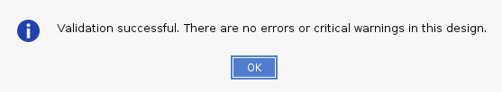

****************************************************
Versal CIPS and NoC (DDR) IP Core Configuration
****************************************************

This chapter describes the steps required to create an embedded design in the AMD Vivado |trade| Design Suite using the *Versal Embedded Common Platform Simple PL Example* design. It also describes how to configure and build the Linux operating system for an Arm |reg| Cortex |trade|-A72 core-based APU on a Versal device.

Examples using the Yocto are provided in this chapter.

.. note:: The design files for this chapter have been validated with Vivado Design Suite 2026.1.

.. _5-creating-embedded-project:

Creating a New Embedded Project with a Versal Device
~~~~~~~~~~~~~~~~~~~~~~~~~~~~~~~~~~~~~~~~~~~~~~~~~~~

For example, launch the Vivado Design Suite and create a project with an embedded processor system at the top level.

Starting the Design
-------------------

1. Launch the **Vivado Design Suite**.

2. In the Vivado Quick Start page, click **Example Project** to Open Example Project wizard.

   .. image:: ./media/ch5_vivado_quick_start_page.png

3. In the Example Project dialog, click **Refresh** to ensure the latest example designs are available.

4. From the available design categories, select **Versal Embedded Common Platform – Simple PL**, as shown in the following figure:

   .. image:: ./media/ch5_design_categories.png

5. Click **Next**.

6. Use the information provided in the following table to make the selections on each screen of the wizard.

   .. note:: Make sure that there is no existing folder named ``edt`` on the ``C:`` drive, as the project is currently configured to use ``C:\edt`` as its location.

   *Table 8:* **System Property Settings**

   +--------------------------+-----------------------+-------------------------------+
   | **Wizard Screen System** | **System Properties** | **Setting or command to use** |
   +==========================+=======================+===============================+
   | Project Name             | Project Name          | edt_versal                    |
   +--------------------------+-----------------------+-------------------------------+
   |                          | Project Location      | C:/edt                        |
   +--------------------------+-----------------------+-------------------------------+
   |                          | Create Project        | Leave the check box selected  |
   |                          | Subdirectory          |                               |
   +--------------------------+-----------------------+-------------------------------+  
   | Default Part             | Select                | Boards                        |
   +--------------------------+-----------------------+-------------------------------+
   |                          | Display Name          | Versal VMK180/VCK190/VPK180   |
   |                          |                       | Evaluation Platform           |
   +--------------------------+-----------------------+-------------------------------+
   | Project Summary          | Project Summary       | Review the Project Summary    |
   +--------------------------+-----------------------+-------------------------------+

   The following screenshots display the wizard screens for configuring the Project Configuration Settings.

   .. image:: ./media/ch5_project_name.png

   .. image:: ./media/ch5_default_part.png

   .. image:: ./media/ch5_new_project_summary.png

7. Click **Finish** to create the project.

The Vivado Design Suite creates the project and automatically opens the example block design as shown in the following figure:

   .. image:: ./media/ch5_example_block_design.png

Modifying the CIPS_0 Configuration
~~~~~~~~~~~~~~~~~~~~~~~~~~~~~~~~~~~~

After the project is created, perform the following configuration updates:

1.	In the Example Block Design, locate the **CIPS_0** block.

2.	Double-click the **CIPS_0** block. The Re-customize IP dialog box opens, displaying the configuration as shown in the following image:

   .. image:: ./media/ch5_CIPS_0.png

3. Click **Next** 

4. Click on **PS PMC**

   .. image:: ./media/ch5_PS_PMC_tab.png

5.	Navigate to **Interrupts and Errors** section.

   .. image:: ./media/ch5_interrupts_and_errors.png

6. Disable the interrupt feature as follows: 

   - Uncheck all interrupt-related options.

      .. image:: ./media/ch5_disable_interrupts.png

7. Click **OK** to apply the changes.

8.	Click **Finish**.

The overall block design is shown in the following figure:

   .. image:: ./media/ch2_block_design.png

..
   Configuring Hardware
   ~~~~~~~~~~~~~~~~~~~~

   The first step in this design is to configure the PS and PL sections. You can do this using the Vivado IP integrator. Start with adding the required IPs from the Vivado IP catalog and then connect the components to blocks in the PS subsystem. To configure the hardware, follow these steps:

   .. note:: If the Vivado Design Suite is open already, jump to step 3.

   1. Open the Vivado project you created in :doc:`../docs/2-cips-noc-ip-config`.

      `C:/edt/edt_versal/edt_versal.xpr`

   2. In the Flow Navigator, under **IP Integrator**, click **Open Block Design**.

      .. image:: ./media/image5.png

   3. Right-click the block diagram and select **Add IP**.

   Connecting IP Blocks to Create a Complete System
   ------------------------------------------------

   To connect IP blocks to create a system, follow these steps.

   1. Double-click the Versal CIPS IP core.

   2. Click **PS-PMC→ PS-PL Interfaces**.

   3. Enable the M_AXI_FPD interface and set the **Number of PL Resets** to 1, as shown in the Image.

      .. image:: ./media/PS_PL_Interfaces.png
      
   4. Click **Clocking**, and then click on the Output Clocks tab.

   5. Expand PMC Domain Clocks. Then expand PL Fabric Clocks. Configure the PL0_REF_CLK to 300 MHz as shown in the following figure:

      .. image:: ./media/clocking_ps_PMC.png

   6. Click **OK** and **Finish** to complete the configuration and return to the block diagram.

   Adding and Configuring IP Addresses
   -----------------------------------

   To add and configure IP addresses, follow these steps.

   1. Right-click the block diagram and select **Add IP** from the IP catalog.

   2. Search for AXI GPIO and double-click the **AXI GPIO IP** to add it to your design.

   3. Add another instance of the AXI GPIO IP into the design.

   4. Search for **AXI Uartlite** in the IP catalog and add it into the design.

   5. Click **Run Connection Automation** in the Block Design view.
      
      .. image:: ./media/image62.png

      The Run Connection Automation dialog box opens.

   6. In the Run Connection Automation dialog box, select the All Automation check box.

      .. image:: ./media/image63.png

      This checks the automation for all the ports of the AXI GPIO IP.

   7. Click **GPIO** of `axi_gpio_0` and set the Select Board Part Interface to **Custom** as shown below.

      .. image:: ./media/image64.jpg

   8. Click **S_AXI** of `axi_gpio_0`. Set the configurations as shown in the following figure:

      .. image:: ./media/gpio_config0.png
      
   9. Repeat previous step 7 and Step 8 for `axi_gpio_1`.

   10. Click **S_AXI** of `axi_uartlite_0`. Set the configurations as shown in the following figure:

      .. image:: media/s-axi-uartlite.png

   11. This configuration sets the following connections:

      - Connects the `S_AXI of AXI_GPIO` and AXI Uartlite to `M_AXI_FPD` of CIPS with SmartConnect as a bridge IP between CIPS and AXI GPIO IPs.
      - Enables the processor system reset IP.
      - Connects the `pl0_ref_clk` to the processor system reset, AXI GPIO, and the SmartConnect IP clocks.
      - Connects the reset of the SmartConnect and AXI GPIO to the `peripheral_aresetn` of the processor system reset IP.

   12. Click **UART** of `axi_uartlite_0`. Set the configurations as shown in the following figure:

      .. image:: media/uart.png

   13. Click **OK**.

   14. Click **Run Connection Automation** in the block design window and select the All Automation check box.

   15. Click **ext_reset_in** and configure the setting as shown below.

      .. image:: ./media/image66.jpg

      This connects the `ext_reset_in` of the processor system reset IP to the `pl_resetn` of the CIPS.

   16. Click **OK**.

   17. Disconnect the `aresetn` of SmartConnect IP from `peripheral_aresetn` of processor system reset IP.

   18. Connect the `aresetn` of SmartConnect IP to `interconnect_aresetn` of processor system reset IP.

      .. image:: ./media/image67.jpeg

   19. Double-click the axi_gpio_0 IP to open it.

   20. Go to the IP Configuration tab and configure the settings as shown in the following figure.

      .. image:: ./media/image68.png

   21. Make the same setting for axi_gpio_1.

   22. Add four more instances of Slice IP.

   23. Delete the external pins of the AXI GPIO IP and expand the interfaces.

   24. Connect the output pin gpio_io_0 of axi_gpio_0 to slice 0 and slice 1.

   25. Similarly, connect the output pin gpio_io_0 of axi_gpio_1 to slice 2 and slice 3.

   26. Make the output of Slice IP as External.

   27. Configure each Slice IP as shown below.

      .. image:: ./media/image69.png

      .. image:: ./media/image70.png

      .. image:: ./media/image71.png

      .. image:: ./media/image72.png

   28. Double-click **axi_uartlite_0** to open the IP.

   29. In the Board tab, set Board interface as shown below:

      .. image:: media/board-interface.png
      
   30. Go to the IP Configuration tab and configure the settings as shown in the following figure.

      .. image:: media/configure-ip-settings.png

   31. Add **Clock Wizard IP**. Double-click to open the IP.

   32. Go to Clocking Features tab and set the configuration as shown below:

      .. image:: media/clocking-features.png

   33. Make sure the Source option in **Input Clock Information** is set to **Global buffer**.
      
   34. Go to Output clocks tab and configure as follows:

      .. image:: media/output-clocks-tab.png

   35. Right-click `pl0_ref_clk` of CIPS and click **Disconnect Pin**.

   36. Connect the `pl0_ref_clk` from CIPS to input `clk_in1` of the Clocking wizard.

   37. Connect the output of clocking wizard to `slowest_sync_clock` of Processor System Reset IP.

      This will help in avoiding timing failure. 

   The overall block design is shown in the following figure:

   .. image:: media/image73.png

Validating the Design and Generating the Output
-----------------------------------------------

To validate the design and to generate the product output, follow these steps:

1. Right-click in the white space of the Block Diagram view and select **Validate Design** or press the **F6** Key.

2.	The tool verifies the design connections, clocking, and configuration.

   Once the validation is complete, A message dialog box opens:

   .. image:: ./media/ch5_validation_successful.png

3. In the Block Diagram window, press **Ctrl+S** to save the block design.

4. In the Sources window, under Design Sources, expand ``edf_base_pl_wrapper``.

5. Right-click the top-level block design, ``edf_base_pl_i : edf_base_pl`` (``edf_base_pl.bd``), and select **Generate Output Products**.

   .. image:: ./media/ch5_generate_output_products.png

6. Click **Generate**.

7.	When the Generate Output Products process is completed, click **OK**.

8.	In the Sources window, click the **IP Sources** view. Here, you can see the output products that you just generated, as shown in the following figure.

   .. image:: ./media/ch2_output_products.png

Synthesizing, Implementing, and Generating the Device Image
-----------------------------------------------------------

Follow these steps to generate a device image for the design.

1.	Go to **Flow Navigator → Program and Debug**, and click **Generate Device Image**. 

2.	A No Implementation Results Available menu appears. Click **Yes**.

   .. image:: ./media/ch5_no_implementation_results_available.png

3. A Launch Runs menu appears. Click **OK**.

   .. image:: ./media/ch5_launch_runs.png

4. When the Device Image Generation is completed, the Device Image Generation Completed dialog box opens.

   .. image:: ./media/ch5_device_image_generation_completed.png

5. Click **Cancel** to close the dialog box.

6. After generating the Device Image, export the **Hardware**.

.. _exporting-hardware-5:

Exporting Hardware
------------------

1.	From the Vivado main menu, select **File → Export → Export Hardware**. The Export Hardware Platform dialog box opens.

2.	Choose **Include Device Image** and click **Next**.

   .. image:: ./media/ch5_export_hardware_platform.png

3. Provide a name for your exported file (or use the default provided), choose the Location and click **Next**.

   .. image:: ./media/ch5_export_hardware_platform_files.png

   .. note:: A warning message appears if a hardware module is already been exported. 
      
   1. If the overwrite message is displayed, click **Yes** to overwrite the existing XSA file.

4. Click **Finish** to complete the export process.

.. note:: This procedure can also be used to create embedded projects targeting the other Versal platforms, such as VMK180 and VPK180.

.. _running-bare-metal-hello-world-application:

Running a Bare-Metal Hello World Application
~~~~~~~~~~~~~~~~~~~~~~~~~~~~~~~~~~~~~~~~~~~~
In this example, you will learn how to manage the board settings, make cable connections, connect to the board through your PC, and run a Hello World software application from Arm Cortex-A72 and Arm Cortex-R5F on DDR memory in the Vitis software platform.

You will create a new Vitis project, similar to the one in `running-bare-metal-hello-world-application`, except that it will use the default linker scripts, which will reference the DDR memory.

1. Manage board settings, make cable connections, and connect to the board through your system and launch the Vitis software platform as discussed in steps 1 through 7 in `running-bare-metal-hello-world-application`.

   .. note:: Create a new Vitis workspace for this. Do not use the workspace created in `running-bare-metal-hello-world-application`.

2. Create a bare-metal Hello World system project with an application running on Arm Cortex-A72 and modify its source code as discussed in steps 1 and 2 of `creating-a-hello-world-application-for-the-arm-cortex-a72-on-ocm` and steps 1 and 2 of Modifying the helloworld_a72 Application Source Code.

   .. note:: Ensure that the SW1 switch is set to JTAG boot mode as shown in the following figure.

   .. image:: media/image19.jpeg

3. Select the component (hello_world_a72) application and select **Build** to generate the project elf files within the Debug folder of the application project.

4. Create an additional RPU domain for your platform (created in Step 2) as discussed in Creating the Standalone Application Project for the Arm Cortex-R5F.

5. Create a bare-metal Hello World application running on Arm Cortex-R5F within the existing system project (Step 2) and modify its source code as discussed in steps 1 and 2 of Creating the Standalone Application Project for the Arm Cortex-R5F and steps 1 and 2 of Modifying the helloworld_r5 Application Source Code.

6. Select the component (hello_world_r5) application and select **Build** to generate the project elf files within the Debug folder of the application project.

Refer to Running Applications in the JTAG Mode using the System Debugger in the Vitis Software Platform for running the applications built above in JTAG mode using system debugger in the Vitis software platform and to `generating-boot-image-for-standalone-application` for generating boot images for standalone applications.

Creating a Hello World Application for the Arm Cortex-A72 on OCM
~~~~~~~~~~~~~~~~~~~~~~~~~~~~~~~~~~~~~~~~~~~~~~~~~~~~~~~~~~~~~~~~

The following steps demonstrate the procedure to create a Hello World application from Arm Cortex-A72 on OCM. 

Creating the Platform
---------------------

Follow these steps to create the platform for VCK190:

1. Select the workspace.
   
   .. image:: media/new-create-platform-vck190.png

2. Select **File→ New Component → Platform**. Use the following information to make your selections on the Wizard screens:

   +--------------+---------------------+--------------------------------+
   | **Wizard     | **System            | **Setting or command to use**  |
   | Screen**     | Properties**        |                                |
   +==============+=====================+================================+
   | Platform     | Component name      | vck190_platform                |
   +--------------+---------------------+--------------------------------+
   |              | Component location  | < platform path >              |
   +--------------+---------------------+--------------------------------+
   |              | Hardware Design     | Click the browser button to    |
   |              | (XSA)               | add your XSA file              |
   +--------------+---------------------+--------------------------------+
   | Domain       | Operating System    | standalone                     |
   +--------------+---------------------+--------------------------------+
   |              | Processor           | psv_cortexa72_0                |
   +--------------+---------------------+--------------------------------+

3. Select the Hardware Design (XSA) and click **Next**.

4. Select Operating System and Processor, then click **Next** and **Finish**.

   The platform is created successfully.
   
   .. image:: media/new-platform.png

Creating a Hello World Application from Example
--------------------------------------------

Follow these steps to create a Hello world application using the created platform:

1. In the left navigation pane, click the **Examples** icon.

   .. image:: media/ch2-examples_icon.png
   
2. Select **Hello World** and click **Create Application Component from Template**.

   .. image:: media/Hello_world_new_vitis.PNG

   +--------------+---------------------+--------------------------------+
   |    **Wizard  | **System            | **Setting or Command to Use**  |
   |    Screen**  | Properties**        |                                |
   +==============+=====================+================================+
   |              | Component name      | hello_world_a72                |
   |  Application |                     |                                |
   |    Details   |                     |                                |
   +--------------+---------------------+--------------------------------+
   |              | Component location  | < Application path >           |
   +--------------+---------------------+--------------------------------+
   |              | Hardware Design     | Select the platform created    |
   |              | (XSA)               | (vck190_platform)              |
   +--------------+---------------------+--------------------------------+
   |    Domain    | Operating System    | standalone                     |
   +--------------+---------------------+--------------------------------+
   |              | Processor           | psv_cortexa72_0                |
   +--------------+---------------------+--------------------------------+

3. Add the Component name and click **Next**.

4. Select the Created Platform and click **Next**.

5. Select Domain “\ *standalone_psv_cortexa72_0*\ ” and click **Next**.

6. Click on **Finish** the Hello world Application is created
   Successfully.

   .. image:: media/apu_helloworld_example.PNG

.. note::
   
   The Vitis software platform creates the board support package for the platform project (vck190_platform) and the system project (hello_world_a72_system) containing an application project named helloworld_a72 under the Explorer view after performing the above steps.

Modifying the helloworld_a72 Application Source Code
-----------------------------------------------------

1. Double-click **hello_world_a72**, then double-click **Source > src** and select **helloworld.c**.

   This opens the ``helloworld.c`` source file for the hello_world_a72 application.

2. Modify the code to add ``sleep (1)`` arguments in the print commands as
   shown below:

   .. code::

      sleep (1);
      print("Hello World from APU\\n\\r");
      print("Successfully ran Hello World application from APU\\n\\r");

   .. image:: media/apu_example_code.PNG

Building the Application
------------------------

1. Select the Component (platform) to be built.

   .. image:: media/ch2_build_platform.png

2. Click **Build**.

   .. image:: media/build_button_new_vitis.png

3. Select the Component (Application) to be built.

   .. image:: media/build_apu.PNG
   
4. Click **Build**.

   .. image:: media/build_button_new_vitis.png
   
   The project is built successfully.

.. _creating-a-hello-world-application-for-the-arm-cortex-r5f:

Creating the Standalone Application Project for the Arm Cortex-R5F
~~~~~~~~~~~~~~~~~~~~~~~~~~~~~~~~~~~~~~~~~~~~~~~~~~~~~~~~~~~~~~~~~

The following steps demonstrate the procedure to create a Hello World application from Arm Cortex-R5F.

1. In the left navigation pane, click the **Example** icon.

   .. image:: media/ch2-examples_icon_new_vitis.png

2. Select **Hello World** and click **Create Application Component from Template**.

   .. image:: media/Hello_world_new_vitis.PNG

   Use the following information to make your selections on the wizard
   screens:

   +--------------+--------------------+----------------------------------+
   | **Wizard     | **System           | **Setting or command to use**    |
   | Screen**     | Properties**       |                                  |
   +==============+====================+==================================+
   | Application  | Component name     | hello_world_r5                   |
   | Details      |                    |                                  |
   +--------------+--------------------+----------------------------------+
   |              | Component location | < Application path >             |
   +--------------+--------------------+----------------------------------+
   |              | Hardware Design    | Select the platform created      |
   |              | (XSA)              | (vck190_platform)                |
   +--------------+--------------------+----------------------------------+
   | Domain       | Operating System   | standalone                       |
   +--------------+--------------------+----------------------------------+
   |              | Processor          | psv_cortexr5_0                   |
   +--------------+--------------------+----------------------------------+

3. Add the **Component name** and click **Next**.
   
4. Select the Created Platform and click **Next**.

5. In the Domain page, click **Create New**, select `standalone_psv_cortexr5_0` and click **Next**.

   .. image:: media/ch2_domain_page.png

6. Click **Finish** and the Hello world Application is created successfully.

   .. image:: media/hello_world_r5.PNG

.. _modifying-the-helloworld_r5-application-source-code:   

Modifying the helloworld_r5 Application Source Code
----------------------------------------------------

1. Double-click **hello_world_r5**, then double-click **Source > src** and select **helloworld.c**.

   This opens the ``helloworld.c`` source file for the hello_world_r5 application.

2. Modify the arguments in the print commands as shown below:

   .. code::
      
      print("Hello World from RPU\n\r");
      print("Successfully ran Hello World application from RPU\n\r");

   .. image:: media/rpu_source_code.PNG

Building the Application
-------------------------

1. Select the **Component** (Application) to be built.
   
   .. image:: media/rpu_build_select.PNG

2. Click **Build**.

   .. image:: media/build_button_new_vitis.png
   
   The project is built successfully.

Modifying the Application Linker Script for the Application Project helloworld_r5
----------------------------------------------------------------------------------

The following steps demonstrate the procedure to modify the application linker script for the application project helloworld_r5.

.. note:: The Vitis software platform provides a linker script generator to simplify the task of creating a linker script for GCC. The linker script generator GUI examines the target hardware platform and determines the available memory sections. All you need to do is assign the different code and data sections in the ELF file to different memory regions.

1. Select the application project (helloworld_r5) in the Vitis Explorer view.

   .. note:: The linker will use the DDR memory if it exists on the platform. Otherwise, it will default to the on-chip memory (OCM).

2. In the `src` directory, delete the default ``lscript.ld`` file.

3. Right-click **helloworld_r5** and click **Reset Linker Script**.

   .. image:: ./media/linker_script.PNG

   .. note:: In the Generate linker script dialog box, the left side is read-only, except for the Output Script name and project build settings in the Modify project build settings as follows field. On the right side, you have two options to allocate memory: The Basic tab and the Advanced tab. Both perform the same tasks; however, the Basic tab is less granular and treats all types of data as "data" and all types of instructions as "code." This is often sufficient to accomplish most tasks. Use the Advanced tab for precise allocation of software blocks into various types of memory.

   .. note:: To terminate the debug configuration, delete the debug configuration.

      .. image:: media/terminate_new_vitis.PNG

.. _running-applications-in-jtag-mode:

Running Applications in the JTAG Mode using the System Debugger in the Vitis Software Platform
~~~~~~~~~~~~~~~~~~~~~~~~~~~~~~~~~~~~~~~~~~~~~~~~~~~~~~~~~~~~~~~~~~~~~~~~~~~~~~~~~~~~~~~~~~~~~~~

To run an application, you must create a Run configuration that captures the settings for executing the application. You can either create a Run configuration for the whole system project or independent applications.

Creating a Run Configuration for the System Project
---------------------------------------------------

1. Select the component (hello_wolrd) application and Click On **Run** 

2. Create a Run Configuration.

   .. image:: media/run-configuration-1.jpg

The following logs are displayed on the terminal:

   .. code-block::

      [0.012]****************************************
      [0.049]Xilinx Versal Platform Loader and Manager 
      [0.087]Release 2026.1   Sep  1 2026  -  21:39:23
      [0.126]Platform Version: v2.0 PMC: v2.0, PS: v2.0
      [0.171]BOOTMODE: 0x0, MULTIBOOT: 0x0
      [0.204]****************************************
      [0.421]Non Secure Boot
      [3.573]PLM Initialization Time 
      [3.604]***********Boot PDI Load: Started***********
      [3.666]Loading PDI from SBI
      [3.694]Monolithic/Master Device
      [3.941]0.291 ms: PDI initialization time
      [3.982]+++Loading Image#: 0x1, Name: lpd, Id: 0x04210002
      [4.032]---Loading Partition#: 0x1, Id: 0xC
      [57.737] 53.658 ms for Partition#: 0x1, Size: 10944 Bytes
      [62.703]---Loading Partition#: 0x2, Id: 0xB
      [86.690] 20.144 ms for Partition#: 0x2, Size: 36528 Bytes
      [89.093]+++Loading Image#: 0x2, Name: fpd, Id: 0x0420C003
      [93.935]---Loading Partition#: 0x3, Id: 0x8
      [98.468] 0.694 ms for Partition#: 0x3, Size: 4544 Bytes
      [102.643]+++Loading Image#: 0x3, Name: pl_cfi, Id: 0x18700000
      [107.996]---Loading Partition#: 0x4, Id: 0x3
      [743.330] 631.404 ms for Partition#: 0x4, Size: 994064 Bytes
      [745.807]---Loading Partition#: 0x5, Id: 0x5
      [1593.667] 843.930 ms for Partition#: 0x5, Size: 1318720 Bytes
      [1596.329]+++Loading Image#: 0x4, Name: aie_subsys, Id: 0x0421C005
      [1602.113]---Loading Partition#: 0x6, Id: 0x7
      [1611.623] 5.496 ms for Partition#: 0x6, Size: 1936 Bytes
      [1613.879]***********Boot PDI Load: Done***********
      [1618.372]5228.975 ms: ROM Time
      [1621.177]Total PLM Boot Time 
      Hello World from APU
      Successfully ran Hello World application from APU 

	
.. note:: Both the APU and RPU applications print on the same console as both applications are using UART0 for these applications. The application software sends the hello world strings for both APU and RPU to the UART0 peripheral of the PS section. From UART0, the hello world string goes byte-by-byte to the serial terminal application running on the host machine, which displays it as a string.

.. _noc-ip-core-configuration:

-----------------------------------
NoC (and DDR) IP Core Configuration
-----------------------------------

This section describes the NoC (and DDR) configuration and related connections required for use with the CIPS configured earlier in this chapter. The Versal CIPS IP core allows you to configure two superscalar, multi-core Arm Cortex-A72 based APUs, two Arm Cortex-R5F RPUs, a platform management controller (PMC), and a CCIX PCIe |reg| module (CPM). The NoC IP core allows configuring the NoC and enabling the DDR memory controllers.

Configuring the NoC IP Core in an Existing Project
~~~~~~~~~~~~~~~~~~~~~~~~~~~~~~~~~~~~~~~~~~~~~~~~~~

For this example, launch the Vivado Design Suite and the project with basic CIPS configuration as shown in `Creating a New Embedded Project with Versal Devices <#creating-a-new-embedded-project-with-versal-devices>`__.

Configuring Your Design
-----------------------

To configure your design, follow these steps:

1. Open the design created in `Creating a New Embedded Project with Versal Devices <#creating-a-new-embedded-project-with-versal-devices>`__, ``edt_versal.xpr``.

2. Open the block design, ``edt_versal.bd``.
   
3. Add **AXI NoC IP** from the IP catalog.

4. Click **Run Block Automation**.

5. Make the run block settings as shown in the following figure:

   .. image:: ./media/block-auto1.png
      :width: 600

6. Open **CIPS → PS-PMC**.
   
7. Click **NoC**. Enable the NoC Non-Coherent Interfaces PS to NoC Interface 0/1 as shown below.

   .. image:: media/noc-interface.png
      :width: 600

8. Click **OK** and **Finish** to complete and exit CIPS configuration.

9. Double-click the **NoC IP**. From the General Tab, set **Number of AXI Slave interfaces** and **AXI Clocks** to 8:

   .. image:: media/noc-settings.png
      :width: 600

10. From the Inputs tab, configure the following settings for S06 AXI and S07 AXI:

   .. image:: media/noc-axi.png
      :width: 600

11. Configure the following settings from the Connectivity tab:

    .. image:: media/noc-connectivity.png
      :width: 600

12. Click **OK**.

13. Make connections between CIPS and NoC as shown below

    .. image:: media/noc-ip-1.png
       :width: 600

    This adds the AXI NoC IP for DDR access.

    .. image:: media/noc-ip.png
       :width: 600
 
Validating the Design and Generating the Output
-----------------------------------------------

To validate the design and generate the output, follow these steps:

1. Right-click in the white space of the Block Diagram view and select **Validate Design**. Alternatively, you can press the F6 key. A message dialog box opens as shown below.
   
   The Vivado tool will prompt you to map the IPs in the design to an address. Click **Yes**.

   .. image:: media/assign-address.png

   .. note:: The number of address segments may vary depending on the number of memory mapped IPs in the design.

   Once the validation is complete, A message dialog box opens as shown below:

   .. image:: media/validation_message.PNG

2. Click **OK** to close the message.

3. In the Block Design Sources window, under Design Sources, expand **edt_versal_wrapper**.

4. Right-click the top-level block diagram, titled edt_versal_i: edt_versal (``edt_versal.bd``) and select **Generate Output Products**.

   The Generate Output Products dialog box opens, as shown in the following figure.

   .. image:: ./media/Generate_op_products_dial_box.png

   .. note:: If you are running the Vivado Design Suite on a Windows machine, you might see different options under Run Settings. In this case, continue with the default settings.

5. Click **Generate**.

   This step builds all required output products for the selected source. You do not need to manually create constraints for the IP processor system. The Vivado Design Suite automatically generates the XDC file for the processor subsystem when you select **Generate Output Products**.

6. When the Generate Output Products process completes, click **OK**. Click the **Design Runs** window on the bottom window to see OOC Module Runs/Synthesis/Implementation runs.

7. In the Sources window, click the **IP Sources** view. Here you can see the output products that you just generated, as shown in the following figure.

   .. image:: ./media/ip-sources-final.png

Synthesizing, Implementing, and Generating the Device Image
-----------------------------------------------------------

Follow these steps to generate a device image for the design.

1. Go to **Flow Navigator→ Program and Debug** and click **Generate Device Image**.

2. A No Implementation Results Available menu appears. Click **Yes**.

3. A Launch Run menu appears. Click **OK**.

   When the Device Image Generation completes, the Device Image Generation Completed dialog box opens.

4. Click **Cancel** to close the window.

5. Export hardware after you generate the Device Image and click **OK**.
   
.. note:: The following steps are optional and you can skip these and go to the :ref:`exporting-hardware-1` section. These steps provide the detailed flow for generating the device image by running synthesis and implementation before generating device image. To understand the flow for generating the device image, follow the steps provided below.

   1. Go to **Flow Navigator → Synthesis** and click **Run Synthesis**.

      .. image:: media/image17.png

   2. If Vivado prompts you to save your project before launching synthesis, click **Save**.

      While synthesis is running, a status bar is displayed in the upper right-hand window. This status bar spools for various reasons throughout the design process. The status bar signifies that a process is working in the background. When synthesis is complete, the Synthesis Completed dialog box opens.

   3. Select **Run Implementation** and click **OK**.

      When implementation completes, the Implementation Completed dialog box opens.

   4. Select **Generate Device Image** and click **OK**.

      When Device Image Generation completes, the Device Image Generation Completed dialog box opens.

   5. Click **Cancel** to close the window.

      Export hardware after you generate the Device Image.

.. _exporting-hardware-1: 

Exporting Hardware
------------------

1. From the Vivado main menu, select **File→ Export → Export Hardware**. The Export Hardware dialog box opens.

2. Choose **Include device image** and click **Next**.

3. Provide a name for your exported file (or use the default provided) and choose the location. Click **Next**.

   A warning message appears if a hardware module has already been exported. Click **Yes** to overwrite the existing XSA file, if the overwrite message is displayed.

4. Click **Finish**.

.. _bare-metal-hello-world-on-ddr:

Running a Bare-Metal Hello World Application on DDR Memory
~~~~~~~~~~~~~~~~~~~~~~~~~~~~~~~~~~~~~~~~~~~~~~~~~~~~~~~~~~

In this example, you will learn how to manage the board settings, make cable connections, connect to the board through your PC, and run a Hello World software application from Arm Cortex-A72 and Arm Cortex-R5F on DDR memory in the Vitis Software Platform.

You will create a new Vitis project, similar to the one in :ref:`running-bare-metal-hello-world-application`, except that it will use the default linker scripts, which will reference the DDR memory.

1. Manage board settings, make cable connections, and connect to the board through your system and launch the Vitis software platform as discussed in steps 1 through 7 in :ref:`running-bare-metal-hello-world-application`.

   .. note:: Create a new Vitis workspace for this. Do not use the workspace created in :ref:`running-bare-metal-hello-world-application`.

2. Create a bare-metal Hello World system project with an application running on Arm Cortex-A72 and modify its source code as discussed in steps 1 and 2 of :ref:`creating-a-hello-world-application-for-the-arm-cortex-a72-on-ocm` and steps 1 and 2 of Modifying the helloworld_a72 Application Source Code.

3. Select the component (hello_world_a72) application and select **Build** to generate the project elf files within the Debug folder of the application project.
        
4. Create an additional RPU domain for your platform (created in Step 2) as discussed in :ref:`creating-a-hello-world-application-for-the-arm-cortex-r5f`.
        
5. Create a bare-metal Hello World application running on Arm Cortex-R5F within the existing system project (Step 2) and modify its source code as discussed in steps 1 and 2 of :ref:`creating-a-hello-world-application-for-the-arm-cortex-r5f` and steps 1 and 2 of :ref:`modifying-the-helloworld_r5-application-source-code`.

6. Select the component (hello_world_r5) application and select **Build** to generate the project elf files within the Debug folder of the application project.

Refer to :ref:`running-applications-in-jtag-mode` for running the applications built above in JTAG mode using system debugger in the Vitis software platform and to :ref:`generating-boot-image-for-standalone-application` for generating boot images for standalone applications. 

.. |trade|  unicode:: U+02122 .. TRADEMARK SIGN
   :ltrim:
.. |reg|    unicode:: U+000AE .. REGISTERED TRADEMARK SIGN
   :ltrim:

.. |build| image:: ./media/image29.png

.. Copyright © 2020–2025 Advanced Micro Devices, Inc

.. `Terms and Conditions <https://www.amd.com/en/corporate/copyright>`_.
