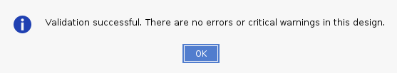
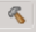

****************************************************
Versal CIPS and NoC (DDR) IP Core Configuration
****************************************************

The AMD Versal |trade| Control, Interfaces and Processing System (CIPS) IP core allows you to configure the processing system and the PMC block, including boot mode, peripherals, clocks, interfaces, and interrupts, among other things.

This chapter describes how to perform the following tasks:

- Creating an AMD Vivado |trade| project for Versal devices to select the appropriate boot devices and peripherals by configuring the CIPS IP core.
- Creating and running a Hello World software application on the on-chip-memory (OCM) of the Arm |reg| Cortex |trade|-A72 processor.
- Creating and running a Hello World software application on the tightly-coupled-memory (TCM) of the Arm Cortex-R5F processor.
  
The NoC IP core configures the DDR memory and data path across the DDR memory and processing engines in the system (Scalar Engines, Adaptable Engines, and AI Engines).

- Creating and running a Hello World software application on Arm Cortex-A72 using DDR as memory.
- Creating and running a Hello World software application on Arm Cortex-R5F using DDR as memory.

.. note:: The design files for this chapter have been validated with Vivado Design Suite 2022.1.

=============
Prerequisites
=============

To create and run Hello World applications discussed in this chapter, install the AMD Vitis |trade| unified software platform. For installation procedures, see *Vitis Unified Software Platform Documentation: Embedded Software Development* (`UG1400 <https://docs.xilinx.com/access/sources/dita/map?isLatest=true&ft:locale=en-US&url=ug1400-vitis-embedded>`__).

.. _cips-ip-core-configuration:

==========================
CIPS IP Core Configuration
==========================

Creating a Versal system design involves configuring the CIPS IP core to select the appropriate boot devices and peripherals. To start with, if the CIPS IP core peripherals and available multiplexed I/O (MIO) connections meet the requirements, no PL component is required. This chapter guides you through creating a simple CIPS IP core-based design.

.. _creating-new-embedded-project-versal-devices:

Creating a New Embedded Project with a Versal Device
~~~~~~~~~~~~~~~~~~~~~~~~~~~~~~~~~~~~~~~~~~~~~~~~~~~~

For this example, launch the Vivado Design Suite and create a project with an embedded processor system as the top level.

Starting Your Design
--------------------

1. Start the Vivado Design Suite.
2. Optional: This step is required only if you have an ES1 board. In the Tcl Console, type the following command to enable ES1 boards:

   .. code-block::

        enable_beta_device

   Press **Enter**.

   .. note:: You have to add ``enable_beta_device`` in the ``~/.Xilinx/Vivado/Vivado_init.tcl`` (Linux host) too.

3. In the Vivado Quick Start page, click **Create Project** to open the New Project wizard.

4. Use the following information in the table to make selections in each of the wizard screens.

   *Table 1:* **System Property Settings**

   +----------+--------------------------+--------------------------------+
   | Wizard   | System Property          | Setting or Command to Use      |
   | Screen   |                          |                                |
   | System   |                          |                                |
   +==========+==========================+================================+
   | Project  | Project Name             | edt_versal                     |
   | Name     |                          |                                |
   +----------+--------------------------+--------------------------------+
   |          | Project Location         | C:/edt                         |
   +----------+--------------------------+--------------------------------+
   |          | Create Project           | Leave this checked             |
   |          | Subdirectory             |                                |
   +----------+--------------------------+--------------------------------+
   | Project  | Specify the type of      | RTL Project                    |
   | Type     | project to create. You   |                                |
   |          | can start with RTL or a  |                                |
   |          | synthesized EDIF         |                                |
   +----------+--------------------------+--------------------------------+
   |          | Do not specify sources   | Leave this unchecked           |
   |          | at this time check box   |                                |
   +----------+--------------------------+--------------------------------+
   |          | Project is an extensible | Leave this unchecked           |
   |          | Vitis platform checkbox  |                                |
   +----------+--------------------------+--------------------------------+
   | Add      | Do not make any changes  |                                |
   | Sources  | to this screen           |                                |
   +----------+--------------------------+--------------------------------+
   | Add      | Do not make any changes  |                                |
   | Con      | to this screen           |                                |
   | straints |                          |                                |
   +----------+--------------------------+--------------------------------+
   | Default  | Select                   | **Boards**                     |
   | Part     |                          |                                |
   +----------+--------------------------+--------------------------------+
   |          | Display Name             | Versal VMK180/VCK190/VPK180    |
   |          |                          | Evaluation Platform            |
   +----------+--------------------------+--------------------------------+
   | Project  | Project Summary          | Review the project summary     |
   | Summary  |                          |                                |
   +----------+--------------------------+--------------------------------+

   .. note:: Select **Display Name** as VPK180 Evaluation platform for creating project for SSI devices.

5. Click **Finish**. The New Project wizard closes and the project you just created opens in the Vivado design tool.

   .. note:: Check the version number while choosing a board. For ES1 silicon, the board version is 1.3. For production silicon, the board version is 2.2. Select the version based on the silicon on the board.

Creating an Embedded Processor Project
--------------------------------------

To create an embedded processor project:

1. In the Flow Navigator, under IP integrator, click **Create Block Design**.
   
   .. image:: media/image5.png
   
   The Create Block Design wizard opens.

2. Use the following information to make selections in the Create Block Design wizard.

   +-------------------+---------------------+------------------------+
   | Wizard Screen     | System Property     | Setting or Command to  |
   |                   |                     | Use                    |
   +===================+=====================+========================+
   | Create Block      | Design Name         | edt_versal             |
   | Design            |                     |                        |
   +-------------------+---------------------+------------------------+
   |                   | Directory           | ``<Local to Project>`` |
   +-------------------+---------------------+------------------------+
   |                   | Specify Source Set  | Design Sources         |
   +-------------------+---------------------+------------------------+

3. Click **OK**.

   The diagram window view opens with a message that states that this design is empty. To get started, add an IP from the IP catalog.

4. Click the **Add IP** button |add_ip|.

5. In the search box, type CIPS to find the Control, Interfaces and Processing System.

6. Double-click the **Control, Interface & Processing System IP** to add it to the block design. The CIPS IP core appears in the diagram view, as shown in the following figure:

   .. image:: media/image7.png
      :width: 600

Managing the Versal CIPS IP Core in the Vivado Design Suite
----------------------------------------------------------------

Now that you have added the processor system for Versal devices to the design, you can begin managing the available options.

1. Click **Run Block Automation**.

2. Configure the run block settings as shown in the following figure:

   .. image:: media/run-automation-1.png
      :width: 600

3. Double-click **versal_cips_0** in the Block Diagram window.

4. Ensure that all the settings for **Design Flow** and **Presets** are as shown in the following figure.
   
   .. image:: media/4-full-system.png
      :width: 600

5. Click **Next**, then click **PS PMC**.

   .. image:: media/ps-pmc.png
      :width: 600

   .. note:: VCK190 preset values will set QSPI and SD as the default boot modes. No changes are required.

6. Click **Interrupts** and configure settings as shown in figure below:

   .. image:: media/interrupts.png
      :width: 600

7.  Click **OK** and **Finish** to close the CIPS GUI.

Validating the Design and Generating the Output
-----------------------------------------------

To validate the design and to generate the output products, follow these steps:

1. Right-click in the white space of the Block Diagram view and select **Validate Design**. Alternatively, you can press the F6 key. A message dialog box opens as shown below.

   Once the validation is complete, A message dialog box opens as shown below:

   .. image:: media/validation_message.PNG

2. In the Block Design view, click **Sources** tab  

3. Click **Hierarchy** and Expand Design Sources Folder, right-click **edt_versal** and select **Create HDL Wrapper**.

   The Create HDL Wrapper dialog box opens. Use this dialog box to create an HDL wrapper file for the processor subsystem.

   .. tip:: The HDL wrapper is a top-level entity required by the design tools.
   
4. Select **Let Vivado manage wrapper and auto-update** and click **OK**.

5. In the Block Design Sources window, under Design Sources, expand edt_versal_wrapper.

6. Right-click the top-level block diagram, titled `edt_versal_i: edt_versal (edt_versal.bd)` and select Generate Output Products.

   The Generate Output Products dialog box opens, as shown in the following figure.

   .. image:: media/Generate_op_products_dial_box.png

   .. note:: If you are running the Vivado Design Suite on a Windows machine, you might see different options under Run Settings. In this case, continue with the default settings.

7. Click **Generate**.

   This step builds all the required output products for the selected source. You do not need to manually create constraints for the IP processor system. The Vivado Design Suite automatically generates the XDC file for the processor subsystem when you select **Generate Output Products**.

8. In the Block Design Sources window, click the **IP Sources** tab. Here you can see the output products that you just generated, as shown in the following figure.

   .. image:: media/ip-sources.png

Synthesizing, Implementing, and Generating the Device Image
-----------------------------------------------------------

Follow these steps to generate a device image for the design.

1. Go to **Flow Navigator→ Program and Debug** and click **Generate Device Image**.

2. A No Implementation Results Available menu appears. Click **Yes**.

3. A Launch Run menu appears. Click **OK**.

   When the Device Image Generation completes, the Device Image Generation Completed dialog box opens.

4. Click **Cancel** to close the window.

5. Export hardware after you generate the Device Image.

.. note:: The following steps are optional and you can skip these and go to the :ref:`exporting-hardware-2` section. These steps provide the detailed flow for generating the device image by running synthesis and implementation before generating the device image. To understand the flow for generating the device image, follow these steps.

   1. Go to **Flow Navigator→ Synthesis**, click **Run Synthesis** and click **OK**.

      .. image:: media/image17.png

   2. If Vivado prompts you to save your project before launching synthesis, click **Save**.

      While synthesis is running, a status bar is displayed in the upper right-hand window. This status bar spools for various reasons throughout the design process. The status bar signifies that a process is working in the background. When synthesis is complete, the Synthesis Completed dialog box opens.

   3. Select **Run Implementation** and click **OK**.

      When implementation completes, the Implementation Completed dialog box opens.

   4. Select **Generate Device Image** and click **OK**.

      The Device Image Generation Completed dialog box opens.

   5. Click **Cancel** to close the window.

      Export the hardware after you generate the device image.

.. _exporting-hardware-2:

Exporting Hardware
------------------

1. From the Vivado toolbar, select **File → Export→ Export Hardware**.

   The Export Hardware dialog box opens.

2. Choose **Include device image** and click **Next**.

3. Provide a name for your exported file (or use the default provided) and choose the location. Click **Next**.

   A warning message appears if a Hardware Module has already been exported. Click **Yes** to overwrite the existing XSA file, if the overwrite message is displayed.

4. Click **Finish**.

.. _running-bare-metal-hello-world-application:

Running a Bare-Metal Hello World Application
~~~~~~~~~~~~~~~~~~~~~~~~~~~~~~~~~~~~~~~~~~~~
In this example, you will learn how to manage the board settings, make cable connections, connect to the board through your PC, and run a Hello World software application from Arm Cortex-A72 and Arm Cortex-R5F on DDR memory in the Vitis software platform.

You will create a new Vitis project, similar to the one in `running-bare-metal-hello-world-application`, except that it will use the default linker scripts, which will reference the DDR memory.

1. Manage board settings, make cable connections, and connect to the board through your system and launch the Vitis software platform as discussed in steps 1 through 7 in `running-bare-metal-hello-world-application`.

   .. note:: Create a new Vitis workspace for this. Do not use the workspace created in `running-bare-metal-hello-world-application`.

2. Create a bare-metal Hello World system project with an application running on Arm Cortex-A72 and modify its source code as discussed in steps 1 and 2 of `creating-a-hello-world-application-for-the-arm-cortex-a72-on-ocm` and steps 1 and 2 of Modifying the helloworld_a72 Application Source Code.

   .. note:: Ensure that the SW1 switch is set to JTAG boot mode as shown in the following figure.

   .. image:: media/image19.jpeg

3. Select the component (hello_world_a72) application and select **Build** to generate the project elf files within the Debug folder of the application project.

4. Create an additional RPU domain for your platform (created in Step 2) as discussed in Creating the Standalone Application Project for the Arm Cortex-R5F.

5. Create a bare-metal Hello World application running on Arm Cortex-R5F within the existing system project (Step 2) and modify its source code as discussed in steps 1 and 2 of Creating the Standalone Application Project for the Arm Cortex-R5F and steps 1 and 2 of Modifying the helloworld_r5 Application Source Code.

6. Select the component (hello_world_r5) application and select **Build** to generate the project elf files within the Debug folder of the application project.

Refer to Running Applications in the JTAG Mode using the System Debugger in the Vitis Software Platform for running the applications built above in JTAG mode using system debugger in the Vitis software platform and to `generating-boot-image-for-standalone-application` for generating boot images for standalone applications.

Creating a Hello World Application for the Arm Cortex-A72 on OCM
-----------------------------------------------------------------

The following steps demonstrate the procedure to create a Hello World application from Arm Cortex-A72 on OCM. 

Creating the Platform
^^^^^^^^^^^^^^^^^^^^^^^

Follow these steps to create the platform for VCK190:

1. Select the workspace.
   
   .. image:: media/new-create-platform-vck190.png

2. Select **File→ New Component → Platform**. Use the following information to make your selections on the Wizard screens:

   +--------------+---------------------+--------------------------------+
   | **Wizard     | **System            | **Setting or command to use**  |
   | Screen**     | Properties**        |                                |
   +==============+=====================+================================+
   | Platform     | Component name      | Vck190_platform                |
   +--------------+---------------------+--------------------------------+
   |              | Component location  | < platform path >              |
   +--------------+---------------------+--------------------------------+
   |              | Hardware Design     | Click the browser button to    |
   |              | (XSA)               | add your XSA file              |
   +--------------+---------------------+--------------------------------+
   | Domain       | Operating System    | Standalone                     |
   +--------------+---------------------+--------------------------------+
   |              | Processor           | Psv_cortexa72_0                |
   +--------------+---------------------+--------------------------------+

3. Select the Hardware Design (XSA) and click **Next**.

4. Select Operating System and Processor, then click **Next** and **Finish**.

   The platform is created successfully.
   
   .. image:: media/new-platform.png

Creating a Hello World Application from Example
^^^^^^^^^^^^^^^^^^^^^^^^^^^^^^^^^^^^^^^^^^^^^^^^^^^^

Follow these steps to create a Hello world application using the created platform:

1. Select **File** > **New Components** > **From Example**.
   
2. Select **Hello World** and click **Create Application Component from Template**.

   .. image:: media/Hello_world_new_vitis.PNG

   +--------------+---------------------+--------------------------------+
   |    **Wizard  | **System            | **Setting or Command to Use**  |
   |    Screen**  | Properties**        |                                |
   +==============+=====================+================================+
   |              | Component name      | hello_world_a72                |
   |  Application |                     |                                |
   |    Details   |                     |                                |
   +--------------+---------------------+--------------------------------+
   |              | Component location  | < Application path >           |
   +--------------+---------------------+--------------------------------+
   |              | Hardware Design     | Select the platform created    |
   |              | (XSA)               | (Vck190_platform)              |
   +--------------+---------------------+--------------------------------+
   |    Domain    | Operating System    | standalone                     |
   +--------------+---------------------+--------------------------------+
   |              | Processor           | psv_cortexa72_0                |
   +--------------+---------------------+--------------------------------+

3. Add the Component name and click **Next**.

4. Select the Created Platform and click **Next**.

5. Select Domain “\ *standalone_psv_cortexa72_0*\ ” and click **Next**.

6. Click on **Finish** the Hello world Application is created
   Successfully.

   .. image:: media/apu_helloworld_example.PNG

.. note::
   
   The Vitis software platform creates the board support package for the platform project (vck190_platform) and the system project (hello_world_a72_system) containing an application project named helloworld_a72 under the Explorer view after performing the above steps.

Modifying the helloworld_a72 Application Source Code
^^^^^^^^^^^^^^^^^^^^^^^^^^^^^^^^^^^^^^^^^^^^^^^^^^^^

1. Double-click **hello_world_a72**, then double-click **Source > src** and select **helloworld.c**.

   This opens the ``helloworld.c`` source file for the hello_world_a72 application.

2. Modify the code to add ``sleep (1)`` arguments in the print commands as
   shown below:

   .. code::

      sleep (1);
      print("Hello World from APU\\n\\r");
      print("Successfully ran Hello World application from APU\\n\\r");

   .. image:: media/apu_example_code.PNG

Building the Application
^^^^^^^^^^^^^^^^^^^^^^^^

1. Select the Component (Application) to be built.

   .. image:: media/build_apu.PNG
   
2. Click **Build**.

   .. image:: media/build_button_new_vitis.png
   
   The project is built successfully.

.. _creating-a-hello-world-application-for-the-arm-cortex-r5f:

Creating the Standalone Application Project for the Arm Cortex-R5F
------------------------------------------------------------------

The following steps demonstrate the procedure to create a Hello World application from Arm Cortex-R5F.

1. Select **File > New Components > From Example**.

2. Select **Hello World** and click **Create Application Component from Template**.

   .. image:: media/Hello_world_new_vitis.PNG

   Use the following information to make your selections on the wizard
   screens:

   +--------------+--------------------+----------------------------------+
   | **Wizard     | **System           | **Setting or command to use**    |
   | Screen**     | Properties**       |                                  |
   +==============+====================+==================================+
   | Application  | Component name     | hello_world_r5                   |
   | Details      |                    |                                  |
   +--------------+--------------------+----------------------------------+
   |              | Component location | < Application path >             |
   +--------------+--------------------+----------------------------------+
   |              | Hardware Design    | Select the platform created      |
   |              | (XSA)              | (Vck190_platform)                |
   +--------------+--------------------+----------------------------------+
   | Domain       | Operating System   | standalone                       |
   +--------------+--------------------+----------------------------------+
   |              | Processor          | psv_cortexr5_0                   |
   +--------------+--------------------+----------------------------------+

3. Add the **Component name** and click **Next**.
   
4. Select the Created Platform and click **Next**.

5. Select Domain “\ *standalone_psv_cortexr5_0*\ ” and click **Next**.

6. Click **Finish** and the Hello world Application is created successfully.

   .. image:: media/hello_world_r5.PNG

Modifying the helloworld_r5 Application Source Code
^^^^^^^^^^^^^^^^^^^^^^^^^^^^^^^^^^^^^^^^^^^^^^^^^^^

1. Double-click **hello_world_r5**, then double-click **Source > src** and select **helloworld.c**.

   This opens the ``helloworld.c`` source file for the hello_world_r5 application.

2. Modify the arguments in the print commands as shown below:

   .. code::
      
      print("Hello World from RPU\n\r");
      print("Successfully ran Hello World application from RPU\n\r");

   .. image:: media/rpu_source_code.PNG

Building the Application
^^^^^^^^^^^^^^^^^^^^^^^^^^

1. Select the **Component** (Application) to be built.
   
   .. image:: media/rpu_build_select.PNG

2. Click **Build**.

   .. image:: media/build_button_new_vitis.png
   
   The project is built successfully.

Modifying the Application Linker Script for the Application Project helloworld_r5
^^^^^^^^^^^^^^^^^^^^^^^^^^^^^^^^^^^^^^^^^^^^^^^^^^^^^^^^^^^^^^^^^^^^^^^^^^^^^^^^^

The following steps demonstrate the procedure to modify the application linker script for the application project helloworld_r5.

.. note:: The Vitis software platform provides a linker script generator to simplify the task of creating a linker script for GCC. The linker script generator GUI examines the target hardware platform and determines the available memory sections. All you need to do is assign the different code and data sections in the ELF file to different memory regions.

1. Select the application project (helloworld_r5) in the Vitis Explorer view.

   .. note:: The linker will use the DDR memory if it exists on the platform. Otherwise, it will default to the on-chip memory (OCM).

2. In the `src` directory, delete the default ``lscript.ld`` file.

3. Right-click **helloworld_r5** and click **Reset Linker Script**.

   .. image:: ./media/linker_script.PNG

   .. note:: In the Generate linker script dialog box, the left side is read-only, except for the Output Script name and project build settings in the Modify project build settings as follows field. On the right side, you have two options to allocate memory: The Basic tab and the Advanced tab. Both perform the same tasks; however, the Basic tab is less granular and treats all types of data as "data" and all types of instructions as "code." This is often sufficient to accomplish most tasks. Use the Advanced tab for precise allocation of software blocks into various types of memory.

   .. note:: To terminate the debug configuration, delete the debug configuration.

      .. image:: media/terminate_new_vitis.PNG

.. _running-applications-in-jtag-mode:

Running Applications in the JTAG Mode using the System Debugger in the Vitis Software Platform
~~~~~~~~~~~~~~~~~~~~~~~~~~~~~~~~~~~~~~~~~~~~~~~~~~~~~~~~~~~~~~~~~~~~~~~~~~~~~~~~~~~~~~~~~~~~~~~

To run an application, you must create a Run configuration that captures the settings for executing the application. You can either create a Run configuration for the whole system project or independent applications.

Creating a Run Configuration for the System Project
---------------------------------------------------

1. Select the component (hello_wolrd) application and Click On **Run** 

2. Create a Run Configuration.

   .. image:: media/run-configuration-1.jpg

Creating a Run Configuration for a Single Application within a System Project
------------------------------------------------------------------------------

You can create a run configuration for a single application within a system project in two ways:

Method I
^^^^^^^^

1. Right-click on the system project **helloworld_system** and select **Run As → Run Configurations**. The Run configuration dialog box opens.

2. Double-click **System Project Debug** to create a run configuration.

   The Vitis software platform creates a new run configuration with the name: SystemDebugger_helloworld_system_1. Rename this to SystemDebugger_helloworld_system_A72. For the remaining options, refer to the following table.

   *Table 7:* **Create, Manage, and Run Configurations Settings**

   +-----------------+-----------------------+---------------------------+
   | Wizard Tab      | System Properties     | Setting or Command to Use |
   +=================+=======================+===========================+
   | Main            | Project               | helloworld_system         |
   +-----------------+-----------------------+---------------------------+
   |                 | Debug only selected   | Check this box            |
   |                 | applications          |                           |
   +-----------------+-----------------------+---------------------------+
   |                 | Selected Applications | Click the **Edit** button |
   |                 |                       | and check helloworld_a72  |
   +-----------------+-----------------------+---------------------------+
   |                 | Target → Hardware     | Attach to the running     |
   |                 | Server                | target (local). If not    |
   |                 |                       | already added, add using  |
   |                 |                       | the New button.           |
   +-----------------+-----------------------+---------------------------+

3. Click **Apply**.

4. Click **Run**.

   .. note:: If there is an existing run configuration, a dialog box appears asking whether you want to terminate the process. Click **Yes**. The following logs are displayed on the terminal.

   .. code-block::

		[0.015]****************************************
		[0.070]Xilinx Versal Platform Loader and Manager
		[0.126]Release 2022.1   Apr 21 2022  -  12:04:39
		[0.183]Platform Version: v2.0 PMC: v2.0, PS: v2.0
		[0.247]BOOTMODE: 0x0, MULTIBOOT: 0x0
		[0.299]****************************************
		[0.527]Non Secure Boot
		[3.404]PLM Initialization Time
		[3.452]***********Boot PDI Load: Started***********
		[3.512]Loading PDI from SBI
		[3.559]Monolithic/Master Device
		[3.649]0.113 ms: PDI initialization time
		[3.706]+++Loading Image#: 0x1, Name: lpd, Id: 0x04210002
		[3.772]---Loading Partition#: 0x1, Id: 0xC
		[53.571] 49.716 ms for Partition#: 0x1, Size: 2960 Bytes
		[58.402]---Loading Partition#: 0x2, Id: 0xB
		[62.748] 0.506 ms for Partition#: 0x2, Size: 48 Bytes
		[66.880]---Loading Partition#: 0x3, Id: 0xB
		[107.887] 37.165 ms for Partition#: 0x3, Size: 59376 Bytes
		[110.195]---Loading Partition#: 0x4, Id: 0xB
		[114.126] 0.008 ms for Partition#: 0x4, Size: 1936 Bytes
		[119.012]---Loading Partition#: 0x5, Id: 0xB
		[122.946] 0.011 ms for Partition#: 0x5, Size: 3536 Bytes
		[128.004]+++Loading Image#: 0x2, Name: pl_cfi, Id: 0x18700000
		[133.169]---Loading Partition#: 0x6, Id: 0x3
		[640.261] 503.167 ms for Partition#: 0x6, Size: 759632 Bytes
		[642.740]---Loading Partition#: 0x7, Id: 0x5
		[1025.311] 378.646 ms for Partition#: 0x7, Size: 577856 Bytes
		[1027.903]+++Loading Image#: 0x3, Name: fpd, Id: 0x0420C003
		[1033.047]---Loading Partition#: 0x8, Id: 0x8
		[1037.459] 0.403 ms for Partition#: 0x8, Size: 1552 Bytes
		[1042.085]***********Boot PDI Load: Done***********
		[1046.554]3348.594 ms: ROM Time
		[1049.325]Total PLM Boot Time
		Hello World from APU
		Successfully ran Hello World application from APU
	
.. note:: Both the APU and RPU applications print on the same console as both applications are using UART0 for these applications. The application software sends the hello world strings for both APU and RPU to the UART0 peripheral of the PS section. From UART0, the hello world string goes byte-by-byte to the serial terminal application running on the host machine, which displays it as a string.

Method II
^^^^^^^^^

1. Right-click on the application project hello_world_r5 and select **Run As → Run Configurations**. The Run Configuration dialog box opens.

2. Verify if this should be "Single Application Debug".

3. Double-click **Single Project Debug** to create a run configuration.

   The Vitis software platform creates a new run configuration with the name: Debugger_helloworld_r5-Default. For the remaining options, refer to the following table.

   *Table 8:*  **Create, Manage, and Run Configurations Settings**

   +-------------+---------------------+---------------------------------+
   | Wizard Tab  | System Properties   | Setting or Command to Use       |
   +=============+=====================+=================================+
   | Main        | Debug Type          | Standalone Application Debug    |
   +-------------+---------------------+---------------------------------+
   |             | Connection          | Connect to the board. If        |
   |             |                     | connected already, select the   |
   |             |                     | connection here.                |
   +-------------+---------------------+---------------------------------+
   |             | Project             | helloworld_r5                   |
   +-------------+---------------------+---------------------------------+
   |             | Configuration       | Debug                           |
   +-------------+---------------------+---------------------------------+

4. Click **Apply**.

5. Click **Run**.

   .. note:: If there is an existing run configuration, a dialog box appears asking whether you want to terminate the process. Click **Yes**. The following logs are displayed on the terminal.

   .. code-block::

		[0.015]****************************************
		[0.070]Xilinx Versal Platform Loader and Manager
		[0.126]Release 2022.1   Apr 21 2022  -  12:04:39
		[0.183]Platform Version: v2.0 PMC: v2.0, PS: v2.0
		[0.247]BOOTMODE: 0x0, MULTIBOOT: 0x0
		[0.299]****************************************
		[0.527]Non Secure Boot
		[3.404]PLM Initialization Time
		[3.452]***********Boot PDI Load: Started***********
		[3.512]Loading PDI from SBI
		[3.559]Monolithic/Master Device
		[3.649]0.113 ms: PDI initialization time
		[3.706]+++Loading Image#: 0x1, Name: lpd, Id: 0x04210002
		[3.772]---Loading Partition#: 0x1, Id: 0xC
		[53.571] 49.716 ms for Partition#: 0x1, Size: 2960 Bytes
		[58.402]---Loading Partition#: 0x2, Id: 0xB
		[62.748] 0.506 ms for Partition#: 0x2, Size: 48 Bytes
		[66.880]---Loading Partition#: 0x3, Id: 0xB
		[107.887] 37.165 ms for Partition#: 0x3, Size: 59376 Bytes
		[110.195]---Loading Partition#: 0x4, Id: 0xB
		[114.126] 0.008 ms for Partition#: 0x4, Size: 1936 Bytes
		[119.012]---Loading Partition#: 0x5, Id: 0xB
		[122.946] 0.011 ms for Partition#: 0x5, Size: 3536 Bytes
		[128.004]+++Loading Image#: 0x2, Name: pl_cfi, Id: 0x18700000
		[133.169]---Loading Partition#: 0x6, Id: 0x3
		[640.261] 503.167 ms for Partition#: 0x6, Size: 759632 Bytes
		[642.740]---Loading Partition#: 0x7, Id: 0x5
		[1025.311] 378.646 ms for Partition#: 0x7, Size: 577856 Bytes
		[1027.903]+++Loading Image#: 0x3, Name: fpd, Id: 0x0420C003
		[1033.047]---Loading Partition#: 0x8, Id: 0x8
		[1037.459] 0.403 ms for Partition#: 0x8, Size: 1552 Bytes
		[1042.085]***********Boot PDI Load: Done***********
		[1046.554]3348.594 ms: ROM Time
		[1049.325]Total PLM Boot Time
		Hello World from RPU
		Successfully ran Hello World application from RPU

.. _noc-ip-core-configuration:

===================================
NoC (and DDR) IP Core Configuration
===================================

This section describes the NoC (and DDR) configuration and related connections required for use with the CIPS configured earlier in this chapter. The Versal CIPS IP core allows you to configure two superscalar, multi-core Arm Cortex-A72 based APUs, two Arm Cortex-R5F RPUs, a platform management controller (PMC), and a CCIX PCIe |reg| module (CPM). The NoC IP core allows configuring the NoC and enabling the DDR memory controllers.

Configuring the NoC IP Core in an Existing Project
~~~~~~~~~~~~~~~~~~~~~~~~~~~~~~~~~~~~~~~~~~~~~~~~~~

For this example, launch the Vivado Design Suite and the project with basic CIPS configuration as shown in `Creating a New Embedded Project with Versal Devices <#creating-a-new-embedded-project-with-versal-devices>`__.

Configuring Your Design
-----------------------

To configure your design, follow these steps:

1. Open the design created in `Creating a New Embedded Project with Versal Devices <#creating-a-new-embedded-project-with-versal-devices>`__, ``edt_versal.xpr``.

2. Open the block design, ``edt_versal.bd``.
   
3. Add **AXI NoC IP** from the IP catalog.

4. Click **Run Block Automation**.

5. Make the run block settings as shown in the following figure:

   .. image:: ./media/block-auto1.png
      :width: 600

6. Open **CIPS → PS-PMC**.
   
7. Click **NoC**. Enable the NoC Non-Coherent Interfaces PS to NoC Interface 0/1 as shown below.

   .. image:: media/noc-interface.png
      :width: 600

8. Click **OK** and **Finish** to complete and exit CIPS configuration.

9. Double-click the **NoC IP**. From the General Tab, set **Number of AXI Slave interfaces** and **AXI Clocks** to 8:

   .. image:: media/noc-settings.png
      :width: 600

10. From the Inputs tab, configure the following settings for S06 AXI and S07 AXI:

   .. image:: media/noc-axi.png
      :width: 600

11. Configure the following settings from the Connectivity tab:

    .. image:: media/noc-connectivity.png
      :width: 600

12. Click **OK**.

13. Make connections between CIPS and NoC as shown below

    .. image:: media/noc-ip-1.png
       :width: 600

    This adds the AXI NoC IP for DDR access.

    .. image:: media/noc-ip.png
       :width: 600
 
Validating the Design and Generating the Output
-----------------------------------------------

To validate the design and generate the output, follow these steps:

1. Right-click in the white space of the Block Diagram view and select **Validate Design**. Alternatively, you can press the F6 key. A message dialog box opens as shown below.
   
   The Vivado tool will prompt you to map the IPs in the design to an address. Click **Yes**.

   .. image:: media/assign-address.png

   .. note:: The number of address segments may vary depending on the number of memory mapped IPs in the design.

   Once the validation is complete, A message dialog box opens as shown below:

   .. image:: media/validation_message.PNG

2. Click **OK** to close the message.

3. In the Block Design Sources window, under Design Sources, expand **edt_versal_wrapper**.

4. Right-click the top-level block diagram, titled edt_versal_i: edt_versal (``edt_versal.bd``) and select **Generate Output Products**.

   The Generate Output Products dialog box opens, as shown in the following figure.

   .. image:: ./media/Generate_op_products_dial_box.png

   .. note:: If you are running the Vivado Design Suite on a Windows machine, you might see different options under Run Settings. In this case, continue with the default settings.

5. Click **Generate**.

   This step builds all required output products for the selected source. You do not need to manually create constraints for the IP processor system. The Vivado Design Suite automatically generates the XDC file for the processor subsystem when you select **Generate Output Products**.

6. When the Generate Output Products process completes, click **OK**. Click the **Design Runs** window on the bottom window to see OOC Module Runs/Synthesis/Implementation runs.

7. In the Sources window, click the **IP Sources** view. Here you can see the output products that you just generated, as shown in the following figure.

   .. image:: ./media/ip-sources-final.png

Synthesizing, Implementing, and Generating the Device Image
-----------------------------------------------------------

Follow these steps to generate a device image for the design.

1. Go to **Flow Navigator→ Program and Debug** and click **Generate Device Image**.

2. A No Implementation Results Available menu appears. Click **Yes**.

3. A Launch Run menu appears. Click **OK**.

   When the Device Image Generation completes, the Device Image Generation Completed dialog box opens.

4. Click **Cancel** to close the window.

5. Export hardware after you generate the Device Image and click **OK**.
   
.. note:: The following steps are optional and you can skip these and go to the :ref:`exporting-hardware-1` section. These steps provide the detailed flow for generating the device image by running synthesis and implementation before generating device image. To understand the flow for generating the device image, follow the steps provided below.

   1. Go to **Flow Navigator → Synthesis** and click **Run Synthesis**.

      .. image:: media/image17.png

   2. If Vivado prompts you to save your project before launching synthesis, click **Save**.

      While synthesis is running, a status bar is displayed in the upper right-hand window. This status bar spools for various reasons throughout the design process. The status bar signifies that a process is working in the background. When synthesis is complete, the Synthesis Completed dialog box opens.

   3. Select **Run Implementation** and click **OK**.

      When implementation completes, the Implementation Completed dialog box opens.

   4. Select **Generate Device Image** and click **OK**.

      When Device Image Generation completes, the Device Image Generation Completed dialog box opens.

   5. Click **Cancel** to close the window.

      Export hardware after you generate the Device Image.

.. _exporting-hardware-1: 

Exporting Hardware
------------------

1. From the Vivado main menu, select **File→ Export → Export Hardware**. The Export Hardware dialog box opens.

2. Choose **Include device image** and click **Next**.

3. Provide a name for your exported file (or use the default provided) and choose the location. Click **Next**.

   A warning message appears if a hardware module has already been exported. Click **Yes** to overwrite the existing XSA file, if the overwrite message is displayed.

4. Click **Finish**.

.. _bare-metal-hello-world-on-ddr:

Running a Bare-Metal Hello World Application on DDR Memory
~~~~~~~~~~~~~~~~~~~~~~~~~~~~~~~~~~~~~~~~~~~~~~~~~~~~~~~~~~

In this example, you will learn how to manage the board settings, make cable connections, connect to the board through your PC, and run a Hello World software application from Arm Cortex-A72 and Arm Cortex-R5F on DDR memory in the Vitis software platform.

You will create a new Vitis project, similar to the one in :ref:`running-bare-metal-hello-world-application`, except that it will use the default linker scripts, which will reference the DDR memory.

1. Manage board settings, make cable connections, and connect to the board through your system and launch the Vitis software platform as discussed in steps 1 through 7 in :ref:`running-bare-metal-hello-world-application`.

   .. note:: Create a new Vitis workspace for this. Do not use the workspace created in :ref:`running-bare-metal-hello-world-application`.

2. Create a bare-metal Hello World system project with an application running on Arm Cortex-A72 and modify its source code as discussed in steps 1 through 3 of :ref:`creating-a-hello-world-application-for-the-arm-cortex-a72-on-ocm` and steps 1 through 3 of `Modifying the helloworld_a72 Application Source Code <#modifying-the-helloworld-a72-application-source-code>`__.

3. Right-click **helloworld_system** and select **Build Project** or click |build| to generate the project elf files within the Debug folder of the application project.
        
4. Create an additional RPU domain for your platform (created in Step 2) as discussed in `Adding a New RPU Domain to the Platform Project <#adding-a-new-rpu-domain-to-the-platform-project>`__.
        
5. Create a bare-metal Hello World application running on Arm Cortex-R5F within the existing system project (Step 2) and modify its source code as discussed in steps 1 through 3 of `Creating the Standalone Application Project for the Arm Cortex-R5F <#creating-the-standalone-application-project-for-the-arm-cortex-r5f>`__ and steps 1 through 3 of `Modifying the helloworld_r5 Application Source Code <#modifying-the-helloworld-r5-application-source-code>`__.

6. Right-click **helloworld_system** and select Build Project or click |build| to generate the project elf files within the Debug folder of the application project.

Refer to `Running Applications in the JTAG Mode using the System Debugger in the Vitis Software Platform <#running-applications-in-the-jtag-mode-using-the-system-debugger-in-the-vitis-software-platform>`__ for running the applications built above in JTAG mode using system debugger in the Vitis software platform and to :ref:`generating-boot-image-for-standalone-application` for generating boot images for standalone applications.

.. |trade|  unicode:: U+02122 .. TRADEMARK SIGN
   :ltrim:
.. |reg|    unicode:: U+000AE .. REGISTERED TRADEMARK SIGN
   :ltrim:
.. |add_ip| image:: media/image6.png

.. |image30| image:: ./media/image30.png

.. Copyright © 2020–2024 Advanced Micro Devices, Inc
.. `Terms and Conditions <https://www.amd.com/en/corporate/copyright>`_.