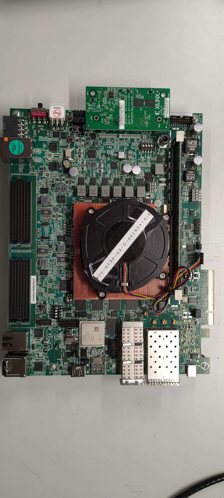

**********************
Boot and Configuration
**********************

The purpose of this chapter is to show how to integrate and load boot loaders, bare-metal applications (For APU/RPU), and the Linux Operating System for AMD Versal |trade| devices. This chapter discusses the following topics:

- System software: PLM, Trusted firmware-A (TF-A), and U-Boot.
- Steps to generate boot image for standalone application.
- Boot sequences for SD boot and QSPI boot modes.

You can achieve these configurations using the AMD Vitis |trade| software platform and the PetaLinux tool flow. While :doc:`../docs/2-cips-noc-ip-config` focused only on creating software blocks for each processing unit in the PS, this chapter explains how these blocks can be loaded as a part of a larger system.

---------------
System Software
---------------

The following system software blocks cover most of the boot and configuration for this chapter.

Platform Loader and Manager
~~~~~~~~~~~~~~~~~~~~~~~~~~~

The platform loader and manager (PLM) is the software that runs on one of the dedicated processors in the Platform Management Controller (PMC) block of the Versal device. It is responsible for boot and run time management, including platform management, error management, partial reconfiguration, and subsystem restart of the device. The PLM can reload images, and load partial PDIs and service interrupts. The PLM reads the programmable device image from the boot source and configures the components of the system, including the NoC initialization, DDR memory initialization, programmable logic, and processing system, and then completes the device boot.

U-Boot
~~~~~~

U-Boot acts as a secondary boot loader. After the PLM handoff, U-Boot loads Linux onto the Arm A72 APU and configures the rest of the peripherals in the processing system based on the board configuration. U-Boot can fetch images from various memory sources such as SATA, TFTP, SD, and QSPI. U-Boot can be configured and built using the PetaLinux tool flow.

Trusted Firmware-A
~~~~~~~~~~~~~~~~~~~~

The Trusted Firmware-A (ATF) is a transparent bare-metal application layer executed in Exception Level 3 (EL3) on the APU. The ATF includes a Secure Monitor layer for switching between the secure and the non-secure world. The Secure Monitor calls and implementation of Trusted Board Boot Requirements (TBBR) makes the ATF layer a mandatory requirement to load Linux on the APU on Versal devices. The PLM loads the ATF to be executed by the APU, which keeps running in EL3 awaiting a service request. The PLM also loads U-Boot into the DDR memory to be executed by the APU. The DDR memory loads the Linux OS in the SMP mode on the APU. The ATF (`bl31.elf`) is built, by default, in PetaLinux. You can find it in the PetaLinux project images directory.

.. _generating-boot-image-for-standalone-application:

------------------------------------------------
Generating Boot Image for Standalone Application
------------------------------------------------

The Vitis software platform supports boot image creation wizard for Versal devices. To generate a boot image PDI or ``Boot.bin``, you can either use Bootgen command line options or use the wizard in Vitis. This tutorial shows how to create Boot image using Bootgen, which is released as a part of the Vitis software platform package. The primary function of Bootgen is to integrate the various partitions of the bootable image. Bootgen uses a BIF file (Bootgen Image Format) as an input and generates a single file image in binary BIN or PDI format. It outputs a single file image which can be loaded into non-volatile memory (QSPI or SD card). Use the following steps to generate a PDI/BIN file:

1. Open Vitis IDE and go to **Terminal -> New Terminal** to launch XSCT.

   xsct

***Software Commandline Tool (XSCT) v2024.1.0***
  ****SW Build 0 on 2024-05-19-14:06:07***
    ** Copyright 1986-2022 Xilinx, Inc. All Rights Reserved.
    ** Copyright 2022-2024 Advanced Micro Devices, Inc. All Rights Reserved.

Warning: XSCT has been deprecated. It will still be available for several releases.It's recommended to start new projects with new python command line tool.
         Use "vitis -s <script>" (script mode) and "vitis -i" (interactive mode) to load new Python CLI for Vitis.

xsct% 

2. Create a folder where you want to generate the boot image by typing the following command in the XSCT Console:

   .. code-block::

        mkdir bootimages
        cd bootimages/
    
3. Copy the sd_boot.bif file present within the ``<design-package>/<board-name>/ready_to_test/qspi_images/standalone/<cips or cips_noc>/<apu or rpu>/`` directory, the PDI file present within ``<Vitis platform project>/hw/<.pdi-file>``, and the application elf files present within the ``<Vitis application-project>/Debug`` folder to the folder created in step 2.

   .. note:: If needed, open the ``sd_boot.bif`` file in a text editor of your choice and modify the name of the PDI or elfs as per your Vitis projects.

4. Run the following command in the XSCT Console view.

   .. code-block::

      bootgen -image <bif filename>.bif -arch versal -o BOOT.BIN

   The following log is displayed in the XSCT Console view.

   .. image:: ./media/xsct-console.png

.. _loading-yocto-images-versal-board-using-jtag:

------------------------------------------------------
Loading Yocto Images on a Versal Board using JTAG
------------------------------------------------------

This section describes how to load Versal Yocto images using JTAG mode on the Versal board. The ``versal.tcl`` script includes the commands required to select the appropriate Versal targets, program ``BOOT.BIN``, and download the Linux kernel (Image), root file system (``rootfs.cpio.gz.u-boot``), and device tree (``system.dtb``) to their designated DDR memory locations before starting execution.

Copy the following Tcl script into a file named ``versal.tcl`` and execute it from the XSCT console:

.. code-block::

      connect

      # Wait for HW server connection
      for {set i 0} {$i < 20} {incr i} {
         if {[ta] != ""} { break }
         after 50
      }

      # Select Versal target
      targets -set -nocase -filter {name =~ "*Versal*"}

      puts "Programming BOOT.BIN..."
      device program BOOT.BIN

      stop
      after 2000

      # Load Linux kernel
      puts "Loading Image at 0x00200000"
      dow -data -force Image 0x00200000

      after 1000

      # Load rootfs
      puts "Loading rootfs.cpio.gz.u-boot at 0x04000000"
      dow -data -force rootfs.cpio.gz.u-boot 0x04000000

      after 1000

      # Load DTB
      puts "Loading system.dtb at 0x00100000"
      dow -data -force system.dtb 0x00100000

      after 1000

      # Continue execution
      con
      exit

..
   1. Build the Linux images using the command:

      .. code::
      
         $petalinux-build

   2. Build the BOOT.BIN using the command: 

      .. code::
      
         $petalinux-package --boot --uboot

   3. Create the Tcl script using `petalinux` command from the Versal project directory:

      .. code::
      
         $petalinux-boot --jtag --kernel --tcl versal.tcl

      .. note:: The ``versal.tcl`` file includes commands to select appropriate targets and download application files to required locations in the DDR memory.

         .. image:: ./media/versal_tcl.JPG
   
   4. Modify the generated `versal.tcl` file as follows:

      a. Rename `ramdisk.cpio.gz` to `rootfs.cpio.gz.u-boot` as this tutorial uses the `rootfs` image.
      b. Add the following lines to load `BOOT.BIN` to the DDR memory before the `con` command:

         .. code-block:: 

            puts stderr "INFO: Loading image: BOOT.BIN at 0x70000000" 
            dow -data -force "BOOT.BIN" 0x70000000
            after 2000

5. Set the boot mode switch SW1 to ON-ON-ON-ON JTAG boot mode, as shown in the following figure.

   .. image:: ./media/jtag-boot-mode.png
      :width: 500

6. Configure the Tera Term serial application with default serial settings **115200,N8** and open the Tera Term console. 

7. In the XSCT console, connect to the target over JTAG using the `connect` command: 

   .. code::
   
      xsct% connect

   The connect command returns the channel ID of the connection.

8. Run the following target command to list the available targets and select a target using its ID.

   .. code::

      xsct% targets

   The IDs can change from session to session as the targets are assigned IDs as they are discovered on the JTAG chain.

9. Download the `versal.tcl` file which will load the `BOOT.BIN`, `rootfs.cpio.gz.uboot`, and `boot.scr` images on the DDR memory of the VCK190 board using the following commands:

   .. code-block::

      xsct% targets 1
      xsct% rst
      xsct > source versal.tcl

10. After running the preceding commands, you can see the PLM and U-Boot boot logs on the serial console. For example:

    .. code-block::

         INFO: boot mode is jtag
         Connecting to device com0.  Use Ctrl-\ to escape.
         [0.012]****************************************
         [0.045]Xilinx Versal Platform Loader and Manager 
         [0.080]Release 2026.1   Apr  5 2011  -  23:00:00
         [0.116]Platform Version: v2.0 PMC: v2.0, PS: v2.0
         [0.155]BOOTMODE: 0x0, MULTIBOOT: 0x0
         [0.183]****************************************
         [0.396]Non Secure Boot
         [3.533]PLM Initialization Time 
         [3.557]***********Boot PDI Load: Started***********
         [3.611]Loading PDI from SBI
         [3.633]Monolithic/Master Device
         [3.881]0.286 ms: PDI initialization time
         [3.914]+++Loading Image#: 0x1, Name: lpd, Id: 0x04210002
         [3.957]---Loading Partition#: 0x1, Id: 0xC
         [61.138] 57.148 ms for Partition#: 0x1, Size: 10944 Bytes
         [66.089]---Loading Partition#: 0x2, Id: 0x0
         [100.691] 30.781 ms for Partition#: 0x2, Size: 49168 Bytes
         PSM Firmware version: 2026.1 [Build: May 28 2026 07:24:55 ] 
         [108.268]+++Loading Image#: 0x2, Name: fpd, Id: 0x0420C003
         [113.334]---Loading Partition#: 0x3, Id: 0x8
         [117.930] 0.690 ms for Partition#: 0x3, Size: 4544 Bytes
         [122.169]+++Loading Image#: 0x3, Name: pl_cfi, Id: 0x18700000
         [127.510]---Loading Partition#: 0x4, Id: 0x3
         [805.270] 673.853 ms for Partition#: 0x4, Size: 993280 Bytes
         [807.728]---Loading Partition#: 0x5, Id: 0x5
         [1733.161] 921.529 ms for Partition#: 0x5, Size: 1321072 Bytes
         [1735.794]+++Loading Image#: 0x4, Name: aie_subsys, Id: 0x0421C005
         [1741.561]---Loading Partition#: 0x6, Id: 0x7
         [1748.412] 2.860 ms for Partition#: 0x6, Size: 1936 Bytes
         [1750.880]+++Loading Image#: 0x5, Name: apu_ss, Id: 0x1C000000
         [1756.051]---Loading Partition#: 0x7, Id: 0x0
         [1810.946] 50.903 ms for Partition#: 0x7, Size: 82960 Bytes
         [1813.320]---Loading Partition#: 0x8, Id: 0x0
         [1849.880] 32.569 ms for Partition#: 0x8, Size: 49152 Bytes
         [1852.253]---Loading Partition#: 0x9, Id: 0x0
         [1862.043] 5.800 ms for Partition#: 0x9, Size: 10288 Bytes
         [1864.332]---Loading Partition#: 0xA, Id: 0x0
         [2903.330] 1035.006 ms for Partition#: 0xA, Size: 1499472 Bytes
         [2906.450]***********Boot PDI Load: Done***********
         [2910.544]56571.176 ms: ROM Time
         [2913.430]Total PLM Boot Time 
         NOTICE:  TF-A running on SILICON 0
         NOTICE:  BL31: Secure code at 0x0
         NOTICE:  BL31: Non secure code at 0x8000000
         NOTICE:  BL31: v2.14.0(release):xlnx-rebase-v2.14_test-tag
         NOTICE:  BL31: Built : 03:57:47, Apr 30 2026

         U-Boot 2026.01 (May 18 2026 - 08:20:36 +0000)

         CPU:   Versal
         Silicon: v2
         Chip:  v2
         Model: Xilinx Versal vck190 Eval board rev1.1
         DRAM:  2 GiB (total 16 GiB)
         EL Level:	EL2
         Multiboot:	0
         Core:  42 devices, 23 uclasses, devicetree: board
         MMC:   mmc@f1050000: 0
         Loading Environment from nowhere... OK
         In:    serial@ff000000
         Out:   serial@ff000000
         Err:   serial@ff000000
         Bootmode: JTAG_MODE
         Net:   
         ZYNQ GEM: ff0c0000, mdio bus ff0c0000, phyaddr 1, interface rgmii-id

         Warning: ethernet@ff0c0000 (eth0) using random MAC address - 2a:04:62:db:ec:83
         eth0: ethernet@ff0c0000Get shared mii bus on ethernet@ff0d0000

         ZYNQ GEM: ff0d0000, mdio bus ff0c0000, phyaddr 2, interface rgmii-id

         Warning: ethernet@ff0d0000 (eth1) using random MAC address - b6:5d:29:d6:d1:cb
         , eth1: ethernet@ff0d0000
         starting USB...
         Starting the controller
         USB XHCI 1.10
         Bus usb@fe200000: 1 USB Device(s) found
               scanning usb for storage devices... 0 Storage Device(s) found
         Saving Environment to nowhere... not possible
         Saving Environment to nowhere... not possible
         Cannot persist EFI variables without system partition
         Missing TPMv2 device for EFI_TCG_PROTOCOL
         Missing RNG device for EFI_RNG_PROTOCOL
         Hit any key to stop autoboot:  0 
         Versal> 
         Versal> 

.. _boot-sequence-sd-boot-mode:
	
-------------------------------
Boot Sequence for SD-Boot Mode
-------------------------------

The following steps demonstrate the boot sequence for the SD-boot mode.

1. To verify the image, copy the required images to the SD card:

   - For standalone, copy the `BOOT.BIN` to the SD card.

   - For Linux images, navigate to the `<plnx-proj-root>/images/linux` and copy `BOOT.BIN`, Image, `rootfs.cpio.gz.uboot`, `boot.scr` to the SD card.

   .. note:: You can either boot the VCK190/VMK180/VPK180 board using the ready-to-test images as part of the released package path, ``<design-package>/<vck190 or vmk180 or vpk180>/ready_to_test/qspi_images/linux/``, or refer to :ref:`creating-linux-images-using-yocto` to build your own set of Linux images using the yocto tool.

2. Load the SD card into the VMK180/VCK190/VPK180 board in the J302 connector.

3. Connect the Micro USB cable into the VMK180/VCK190/VPK180 Board Micro USB port (J207), and the other end into an open USB port on the host machine.

4. Configure the board to boot in SD-Boot mode (1-ON, 2-OFF, 3-OFF, 4-OFF) by setting the SW1 switch as shown in the following figure.

   .. image:: ./media/sd_boot_mode.JPG

5. Connect 12V power to the VMK180/VCK190/VPK180 6-Pin Molex connector.

6. Start a terminal session using Tera Term or Minicom depending on the host machine being used. Set the COM port and baud rate for your system, as shown in the following figure.

   .. image:: ./media/image46.png

7. For port settings, verify COM Port in the device manager and select the com port with interface-0.

8. Turn on the VMK180/VCK190/VPK180 board using the power switch (SW13).

   .. note:: Logs for standalone images are displayed on the terminal. For Linux images, you can log in using `user: root` and `pw: root` after the boot-up sequence on the terminal. After that, run `gpiotest` on the terminal. You will see logs as shown in the following figure.

   .. image:: ./media/led_example_console_prints.PNG

GPIOTEST Application Running Steps
~~~~~~~~~~~~~~~~~~~~~~~~~~~~~~~~~~

1. After booting, log in with username as petalinux and set your password when prompted.

2. Run the following command to gain root privileges:

   .. code::

      $ sudo -i

3. Navigate to the GPIO class directory:

   .. code::

      $ cd /sys/class/gpio

4. Export the required GPIO pins (512, 513, and 514):

   .. code::

      $ echo 512 > Set 
      $ echo 513 > /sys/class/gpio/export
      $ echo 514 > /sys/class/gpio/export

5. Set the direction to output for all three GPIO pins:

   .. code::

      $ echo out > /sys/class/gpio/gpio512/direction 
      $ echo out > /sys/class/gpio/gpio513/direction
      $ echo out > /sys/class/gpio/gpio514/direction

6. Write the value 1 to turn ON the respective LEDs:

   1. For GPIO 512:

      .. code-block::

         $ echo 1 > /sys/class/gpio/gpio512/value

      You can observe that LED R331 will glow as shown in the below snapshot.

      .. image:: ./media/ch3_gpiotest_image1.jpg

   2. For GPIO 513:

      .. code-block::

         $ echo 1 > /sys/class/gpio/gpio513/value

      You can observe that LED R332 will glow as shown in the below snapshot.

      .. image:: ./media/ch3_gpiotest_image2.jpg

   3. For GPIO 514:

      .. code-block::

         $ echo 1 > /sys/class/gpio/gpio514/value

      You can observe that LED R333 will glow as shown in the below snapshot.

      .. image:: ./media/ch3_gpiotest_image3.jpg

7. To turn off the LEDs, write the value 0 to the respective GPIO pins:

   .. code-block::

      $ echo 0 > /sys/class/gpio/gpio512/value
      $ echo 0 > /sys/class/gpio/gpio513/value
      $ echo 0 > /sys/class/gpio/gpio514/value

--------------------------------
Boot Sequence for QSPI Boot Mode
--------------------------------

This section demonstrates the boot sequence for the QSPI boot mode. For this, you need to connect a QSPI daughter card (part number: X_EBM-01, REV_A01) as shown in the following figure:

*Figure 2:* **Daughter Card on VCK190**

You need to flash the images to the daughter card using the following steps:

1. With the card powered off, install the QSPI daughter card.

2. Power on the board. Run modified version of Versal Tcl from the :ref:`loading-yocto-images-versal-board-using-jtag` section, to ensure that U-Boot is running and also to have Boot.BIN copied to DDR location. 

3. At the U-Boot stage, when the message **Hit any key to stop autoboot:** appears, hit any key, then run the following commands to flash the images on the QSPI daughter card:

   .. code-block::
      
         // check QSPI is available or not
         sf probe 0 0 0
         // Erase QSPI Flash of size 256 MB
         sf erase 0x0 0x10000000
         // Copy BOOT.BIN file from DDR address,0x70000000 to QSPI Flash address,0x0
         sf write 0x70000000 0x0 <BOOT.BIN_filesize_in_hex>
         // Copy Image file from DDR address,0x00200000 to QSPI Flash address,0xF00000
         sf write 0x00200000 0xF00000 <Image_filesize_in_hex>
         // Copy rootfs.cpio.gz.u-boot file from DDR address,0x04000000 to QSPI Flash address,0x2E00000
         sf write 0x04000000 0x2E00000 <rootfs.cpio.gz.u-boot_filesize_in_hex>
         // Copy boot.scr file from DDR address,0x20000000  to QSPI Flash address,0x7F80000
         sf write 0x20000000 0x7F80000 <boot.scr_filesize_in_hex>

4. After flashing the images, turn off the power switch on the board, and change the SW1 boot mode pin settings to QSPI boot mode (ON-OFF-ON-ON, M[0:3] = 0100) as shown in the following figure:

   .. image:: ./media/image52.png
      

5. Power cycle the board. The board now boots up using the images in the QSPI flash.   

.. |trade|  unicode:: U+02122 .. TRADEMARK SIGN
   :ltrim:
.. |reg|    unicode:: U+000AE .. REGISTERED TRADEMARK SIGN
   :ltrim:

.. Copyright © 2020–2025 Advanced Micro Devices, Inc
.. `Terms and Conditions <https://www.amd.com/en/corporate/copyright>`_.
