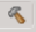

**************************************************************
System Design Example using Scalar Engine and Adaptable Engine
**************************************************************

This chapter describes the steps required to create an embedded design in the AMD Vivado |trade| Design Suite using the *Versal Embedded Common Platform Simple PL Example* design. The chapter further explains the necessary CIPS configuration changes, clock updates, and design validation procedures. It also describes how to configure and build the Linux operating system for an Arm |reg| Cortex |trade|-A72 core-based APU on a Versal device.

Examples using the Yocto are provided in this chapter.

.. note:: The design files for this chapter have been validated with Vivado Design Suite 2026.1.

.. _5-using-axi-gpio:

-------------------------------
Design Example: Using AXI GPIO
-------------------------------

The Linux application uses a PL-based AXI GPIO interface to monitor the DIP switch of the board and accordingly control the LEDs on the board. The LED application can run on VCK190 and VMK180 boards.

The RPU application uses the PL-based AXI UART lite to print the debug messages on the AXI UART console instead of using the PS UART console. The PL UART application can run on VCK190 and VMK180 boards.

.. _5-creating-embedded-project:

Creating a New Embedded Project with a Versal Device
~~~~~~~~~~~~~~~~~~~~~~~~~~~~~~~~~~~~~~~~~~~~~~~~~~~

For example, launch the Vivado Design Suite and create a project with an embedded processor system at the top level.

Starting the Design
-------------------

1. Launch the **Vivado Design Suite**.

2. In the Vivado Quick Start page, click **Example Project** to Open Example Project wizard.

   .. image:: ./media/ch5_vivado_quick_start_page.png

3. In the Example Project dialog, click **Refresh** to ensure the latest example designs are available.

4. From the available design categories, select **Versal Embedded Common Platform – Simple PL**, as shown in the following figure:

   .. image:: ./media/ch5_design_categories.png

5. Click **Next**.

6. Use the information provided in the following table to make the selections on each screen of the wizard.

   .. note:: Make sure that there is no existing folder named ``edt`` on the ``C:`` drive, as the project is currently configured to use ``C:\edt`` as its location.

   *Table 8:* **System Property Settings**

   +--------------------------+-----------------------+-------------------------------+
   | **Wizard Screen System** | **System Properties** | **Setting or command to use** |
   +==========================+=======================+===============================+
   | Project Name             | Project Name          | edt_versal                    |
   +--------------------------+-----------------------+-------------------------------+
   |                          | Project Location      | C:/edt                        |
   +--------------------------+-----------------------+-------------------------------+
   |                          | Create Project        | Leave the check box selected  |
   |                          | Subdirectory          |                               |
   +--------------------------+-----------------------+-------------------------------+  
   | Default Part             | Select                | Boards                        |
   +--------------------------+-----------------------+-------------------------------+
   |                          | Display Name          | Versal VMK180/VCK190/VPK180   |
   |                          |                       | Evaluation Platform           |
   +--------------------------+-----------------------+-------------------------------+
   | Project Summary          | Project Summary       | Review the Project Summary    |
   +--------------------------+-----------------------+-------------------------------+

   The following screenshots display the wizard screens for configuring the Project Configuration Settings.

   .. image:: ./media/ch5_project_name.png

   .. image:: ./media/ch5_default_part.png

   .. image:: ./media/ch5_new_project_summary.png

7. Click **Finish** to create the project.

The Vivado Design Suite creates the project and automatically opens the example block design as shown in the following figure:

   .. image:: ./media/ch5_example_block_design.png

Configure the PS and PL
~~~~~~~~~~~~~~~~~~~~~~~

Modifying the CIPS_0 Configuration
-----------------------------------

After the project is created, perform the following configuration updates:

1.	In the Example Block Design, locate the **CIPS_0** block.

2.	Double-click the **CIPS_0** block. The Re-customize IP dialog box opens, displaying the configuration as shown in the following image:

   .. image:: ./media/ch5_CIPS_0.png

3. Click **Next** 

4. Click on **PS PMC**

   .. image:: ./media/ch5_PS_PMC_tab.png

5.	Navigate to **Interrupts and Errors** section.

   .. image:: ./media/ch5_interrupts_and_errors.png

6. Disable the interrupt feature as follows: 

   - Uncheck all interrupt-related options.

      .. image:: ./media/ch5_disable_interrupts.png

   - Ensure that the **Inter Processor Interrupts (IPI)** option is enabled as shown in the following image:

      .. image:: ./media/ch5_inter_processor_interrupts.png

7. Click **OK** to apply the changes.

8.	Click **Finish**.

Updating the Clock Connections
--------------------------------

To ensure proper clocking for the AXI interface, update the clock connections in the block design as follows:

1. In the Block Design, locate the ``ilconstant_0`` block connected to the ``m_axi_lpd_aclk`` pin of the ``CIPS_0`` block.

   .. image:: ./media/ch5_ilconstant_0.png

2. Right-click the ``ilconstant_0`` block and select **Delete**.

3. Connect the ``clk_out1`` output (100MHz) of the ``clk_wizard_0`` block to the ``m_axi_lpd_aclk`` input of the ``CIPS_0`` block.

   .. image:: ./media/ch5_clk_out1.png

   .. note:: Driving the ``m_axi_lpd_aclk`` input with the ``clk_wizard_0`` clock output ensures that the AXI interface is clocked and helps prevent clock-domain, timing, and functional issues.

The overall block design is shown in the following figure:

   .. image:: ./media/ch5_block_design.png

..
   Configuring Hardware
   ~~~~~~~~~~~~~~~~~~~~

   The first step in this design is to configure the PS and PL sections. You can do this using the Vivado IP integrator. Start with adding the required IPs from the Vivado IP catalog and then connect the components to blocks in the PS subsystem. To configure the hardware, follow these steps:

   .. note:: If the Vivado Design Suite is open already, jump to step 3.

   1. Open the Vivado project you created in :doc:`../docs/2-cips-noc-ip-config`.

      `C:/edt/edt_versal/edt_versal.xpr`

   2. In the Flow Navigator, under **IP Integrator**, click **Open Block Design**.

      .. image:: ./media/image5.png

   3. Right-click the block diagram and select **Add IP**.

   Connecting IP Blocks to Create a Complete System
   ------------------------------------------------

   To connect IP blocks to create a system, follow these steps.

   1. Double-click the Versal CIPS IP core.

   2. Click **PS-PMC→ PS-PL Interfaces**.

   3. Enable the M_AXI_FPD interface and set the **Number of PL Resets** to 1, as shown in the Image.

      .. image:: ./media/PS_PL_Interfaces.png
      
   4. Click **Clocking**, and then click on the Output Clocks tab.

   5. Expand PMC Domain Clocks. Then expand PL Fabric Clocks. Configure the PL0_REF_CLK to 300 MHz as shown in the following figure:

      .. image:: ./media/clocking_ps_PMC.png

   6. Click **OK** and **Finish** to complete the configuration and return to the block diagram.

   Adding and Configuring IP Addresses
   -----------------------------------

   To add and configure IP addresses, follow these steps.

   1. Right-click the block diagram and select **Add IP** from the IP catalog.

   2. Search for AXI GPIO and double-click the **AXI GPIO IP** to add it to your design.

   3. Add another instance of the AXI GPIO IP into the design.

   4. Search for **AXI Uartlite** in the IP catalog and add it into the design.

   5. Click **Run Connection Automation** in the Block Design view.
      
      .. image:: ./media/image62.png

      The Run Connection Automation dialog box opens.

   6. In the Run Connection Automation dialog box, select the All Automation check box.

      .. image:: ./media/image63.png

      This checks the automation for all the ports of the AXI GPIO IP.

   7. Click **GPIO** of `axi_gpio_0` and set the Select Board Part Interface to **Custom** as shown below.

      .. image:: ./media/image64.jpg

   8. Click **S_AXI** of `axi_gpio_0`. Set the configurations as shown in the following figure:

      .. image:: ./media/gpio_config0.png
      
   9. Repeat previous step 7 and Step 8 for `axi_gpio_1`.

   10. Click **S_AXI** of `axi_uartlite_0`. Set the configurations as shown in the following figure:

      .. image:: media/s-axi-uartlite.png

   11. This configuration sets the following connections:

      - Connects the `S_AXI of AXI_GPIO` and AXI Uartlite to `M_AXI_FPD` of CIPS with SmartConnect as a bridge IP between CIPS and AXI GPIO IPs.
      - Enables the processor system reset IP.
      - Connects the `pl0_ref_clk` to the processor system reset, AXI GPIO, and the SmartConnect IP clocks.
      - Connects the reset of the SmartConnect and AXI GPIO to the `peripheral_aresetn` of the processor system reset IP.

   12. Click **UART** of `axi_uartlite_0`. Set the configurations as shown in the following figure:

      .. image:: media/uart.png

   13. Click **OK**.

   14. Click **Run Connection Automation** in the block design window and select the All Automation check box.

   15. Click **ext_reset_in** and configure the setting as shown below.

      .. image:: ./media/image66.jpg

      This connects the `ext_reset_in` of the processor system reset IP to the `pl_resetn` of the CIPS.

   16. Click **OK**.

   17. Disconnect the `aresetn` of SmartConnect IP from `peripheral_aresetn` of processor system reset IP.

   18. Connect the `aresetn` of SmartConnect IP to `interconnect_aresetn` of processor system reset IP.

      .. image:: ./media/image67.jpeg

   19. Double-click the axi_gpio_0 IP to open it.

   20. Go to the IP Configuration tab and configure the settings as shown in the following figure.

      .. image:: ./media/image68.png

   21. Make the same setting for axi_gpio_1.

   22. Add four more instances of Slice IP.

   23. Delete the external pins of the AXI GPIO IP and expand the interfaces.

   24. Connect the output pin gpio_io_0 of axi_gpio_0 to slice 0 and slice 1.

   25. Similarly, connect the output pin gpio_io_0 of axi_gpio_1 to slice 2 and slice 3.

   26. Make the output of Slice IP as External.

   27. Configure each Slice IP as shown below.

      .. image:: ./media/image69.png

      .. image:: ./media/image70.png

      .. image:: ./media/image71.png

      .. image:: ./media/image72.png

   28. Double-click **axi_uartlite_0** to open the IP.

   29. In the Board tab, set Board interface as shown below:

      .. image:: media/board-interface.png
      
   30. Go to the IP Configuration tab and configure the settings as shown in the following figure.

      .. image:: media/configure-ip-settings.png

   31. Add **Clock Wizard IP**. Double-click to open the IP.

   32. Go to Clocking Features tab and set the configuration as shown below:

      .. image:: media/clocking-features.png

   33. Make sure the Source option in **Input Clock Information** is set to **Global buffer**.
      
   34. Go to Output clocks tab and configure as follows:

      .. image:: media/output-clocks-tab.png

   35. Right-click `pl0_ref_clk` of CIPS and click **Disconnect Pin**.

   36. Connect the `pl0_ref_clk` from CIPS to input `clk_in1` of the Clocking wizard.

   37. Connect the output of clocking wizard to `slowest_sync_clock` of Processor System Reset IP.

      This will help in avoiding timing failure. 

   The overall block design is shown in the following figure:

   .. image:: media/image73.png

Validating the Design and Generating the Output
-----------------------------------------------

To validate the design and to generate the product output, follow these steps:

1. Right-click in the white space of the Block Diagram view and select **Validate Design** or press the **F6** Key.

2.	The tool verifies the design connections, clocking, and configuration.

   Once the validation is complete, A message dialog box opens:

   .. image:: ./media/ch5_validation_successful.png

3. In the Block Diagram window, press **Ctrl+S** to save the block design.

4. In the Sources window, under Design Sources, expand ``edf_base_pl_wrapper``.

5. Right-click the top-level block design, ``edf_base_pl_i : edf_base_pl`` (``edf_base_pl.bd``), and select **Generate Output Products**.

   .. image:: ./media/ch5_generate_output_products.png

6. Click **Generate**.

7.	When the Generate Output Products process is completed, click **OK**.

8.	In the Sources window, click the **IP Sources** view. Here, you can see the output products that you just generated, as shown in the following figure.

   .. image:: ./media/ch5_output_products.png

Synthesizing, Implementing, and Generating the Device Image
-----------------------------------------------------------

Follow these steps to generate a device image for the design.

1.	Go to **Flow Navigator → Program and Debug**, and click **Generate Device Image**.

2.	A No Implementation Results Available menu appears. Click **Yes**.

   .. image:: ./media/ch5_no_implementation_results_available.png

3. A Launch Runs menu appears. Click **OK**.

   .. image:: ./media/ch5_launch_runs.png

4. When the Device Image Generation is completed, the Device Image Generation Completed dialog box opens.

   .. image:: ./media/ch5_device_image_generation_completed.png

5. Click **Cancel** to close the dialog box.

6. After generating the Device Image, export the **Hardware**.

..
      .. note:: The following steps are optional, you can skip these and go to the :ref:`exporting-hardware-5` section.

      These steps provide the detailed flow for Generating the Device Image by running synthesis and implementation before generating the device image. To understand the flow for generating the device image, follow these steps:

      1.	Go to **Flow Navigator → Synthesis** and click **Run Synthesis**.

         .. image:: ./media/ch5_run_Synthesis.png

      2. If Vivado prompts you to save the project before launching synthesis, click **Save**.

         While synthesis is running, a status bar is displayed in the upper-right corner of the Vivado window. The status bar may appear and update throughout the design process as various tasks are executed. This indicates that Vivado is actively processing operations in the background. When synthesis is complete, the Synthesis Completed dialog box opens.

      3. Select **Run Implementation** and click **OK**.

         When implementation is completed, the Implementation Completed dialog box opens.

      4.	Select **Generate Device Image** and click **OK**.

         When Device Image Generation is completed, the Device Image Generation Completed dialog box opens.

      5.	Click **Cancel** to close the window.
         
         After generating the Device Image, export the **Hardware**.

.. _exporting-hardware-5:

Exporting Hardware
------------------

1.	From the Vivado main menu, select **File → Export → Export Hardware**. The Export Hardware Platform dialog box opens.

2.	Choose **Include Device Image** and click **Next**.

   .. image:: ./media/ch5_export_hardware_platform.png

3. Provide a name for your exported file (or use the default provided), choose the Location and click **Next**.

   .. image:: ./media/ch5_export_hardware_platform_files.png

   .. note:: A warning message appears if a hardware module is already been exported. 
      
   1. If the overwrite message is displayed, click **Yes** to overwrite the existing XSA file.

4. Click **Finish** to complete the export process.

.. _freertos-axi-uartlite-application-project:

--------------------------------------------------------------------
Example Project: FreeRTOS AXI UARTLITE Application Project with RPU
--------------------------------------------------------------------

This section explains how to configure and build the FreeRTOS application for an Arm Cortex-R5F core-based RPU on a Versal device.

There are four components of an application project in the Vitis IDE:

- Target platform
- System project
- Domain
- Template

Creating a new application project in the Vitis IDE has the following steps:

i. A target platform is composed of a base hardware design and the metadata used in attaching accelerators to declared interfaces. Choose a platform or create a platform project from the XSA that you exported from the Vivado Design Suite.

ii. Put the application project in a system project and associate it with a processor.

iii. The domain defines the processor and operating system used for running the host program on the target platform.

iv.  Choose a template for the application, to quick start development. Use the following information to make your selections in the wizard screens.

Creating the Platform
~~~~~~~~~~~~~~~~~~~~~~

To create a platform for the VCK190 device, follow these steps:

1. Select the workspace.
   
   .. image:: media/new-vck190-workspace.png

2. Select **File > New Component > Platform**.

   +--------------+---------------------+--------------------------------+
   |    **Wizard  |    **System         |    **Setting or command to     |
   |    Screen**  |    Properties**     |    use**                       |
   +==============+=====================+================================+
   |    Platform  |    Component name   |    vck190_platform             |
   +--------------+---------------------+--------------------------------+
   |              |    Component        |    < platform path >           |
   |              |    location         |                                |
   +--------------+---------------------+--------------------------------+
   |              |    Hardware Design  |    Click the browser button to |
   |              |    (XSA)            |    add your XSA file           |
   +--------------+---------------------+--------------------------------+
   |    Domain    |    Operating System |    freertos                    |
   +--------------+---------------------+--------------------------------+
   |              |    Processor        |    psv_cortexr5_0              |
   +--------------+---------------------+--------------------------------+

3. Select the Hardware Design (XSA) and click **Next**.

4. Select Operating System and Processor, click **Next**, then click
   **Finish**.

   Platform will be created Successfully.
   
   .. image:: media/new-vck190-platform.png

Creating an Empty Application
~~~~~~~~~~~~~~~~~~~~~~~~~~~~~

1. Launch the Vitis IDE and open the workspace where the platform is created.

   .. image:: media/new-vitis-launch.png

2. Select **File > New Component > Application**. **Creating a
   New Application Components** wizard opens. If this is the first time that you have launched the Vitis IDE, you can select **Create
   Application Component** on the Welcome screen as shown in the
   following figure.

3. Add the component name and the component location.

   +--------------+----------------------------+---------------------------+
   |    **Wizard  |    **System Properties**   |    **Setting or command   |
   |    Screen**  |                            |    to use**               |
   +==============+============================+===========================+
   |              |    Component name          |    freertos_gpio_test     |
   |  Application |                            |                           |
   |    Details   |                            |                           |
   +--------------+----------------------------+---------------------------+
   |              |    Component location      |    < Application path >   |
   +--------------+----------------------------+---------------------------+
   |              |    Select a platform from  |    vck190_platform        |
   |              |    repository              |                           |
   +--------------+----------------------------+---------------------------+
   |    Domain    |    Select a Domain         |    +Create New            |
   +--------------+----------------------------+---------------------------+
   |              |    Name                    | freertos_gpio_test_system |
   +--------------+----------------------------+---------------------------+
   |              |    Operating System        |    freertos               |
   +--------------+----------------------------+---------------------------+
   |              |    Processor               |    psv_cortexr5_0         |
   +--------------+----------------------------+---------------------------+

4. Select the Created Platform and click **Next**.

5. Add name and OS “\ *freertos*\ ”.

6. Select domain “\ *psv_cortexr5_0*\ ” and click **Next**.

7. Click **Finish** the Empty Application is created successfully.
   
   .. image:: media/new-welcome-screen.png

8. Delete the source files under ``freertos_gpio_test/Sources/src`` and copy the freertos source code files from the FreeRTOS project path, ``<design-package>/ch5_system_design_example_source__files/rpu/`` to the ``source/directory``.
   
9. Configure the Vitis IDE to enable AXI UARTLITE for RPU application debug console under the FreeRTOS Board Support Package.
   Navigate to vitis-comp.json under vpk180_platform project under Settings. Then select **Navigate to BSP Settings** under Board support package. Modify stdin and stdout to **axi_uarlite_0** by selecting it from the drop-down options, as shown in the following snippet.
   
    .. image:: media/configure-vitis-ide.png

Building the Application
~~~~~~~~~~~~~~~~~~~~~~~~~

1. Select the **Component** (Application) to be built.

   .. image:: media/new-flow.png

2. Click **Build**.

   .. image:: media/new-proj-built.png

   Project is built successfully. On the PL AXI UART Serial Console, RPU debug logs is printed as shown below:

   .. code::

      Gpio Initialization started
      Counter 0
      Counter 1
      Counter 2
      Counter 3
      Counter 4
      Counter 5

..
   .. _creating-linux-images-using-petalinux:

   -------------------------------------------------------
   Example Project: Creating Linux Images Using PetaLinux
   -------------------------------------------------------

   This section explains how to configure and build the Linux operating system for an Arm Cortex-A72 core-based APU on a Versal device. You can use the PetaLinux tool with the board-specific BSP to configure and build Linux images.

   This example needs a Linux host machine. Refer to the PetaLinux Tools Documentation Reference Guide `[UG1144] <https://www.xilinx.com/cgi-bin/docs/rdoc?v=latest;d=ug1144-petalinux-tools-reference-guide.pdf>`__ for information on dependencies and installation procedure for the PetaLinux tool.

   .. important:: 

      This example uses the VCK190 PetaLinux BSP to create a PetaLinux project. Ensure that you have downloaded the respective BSP for PetaLinux (VCK190/VMK180/VPK180).

      .. list-table::
         :widths: 50 50
         :header-rows: 1

         * - Board
         - QSPI/SD

         * - VCK190 Production Board
         - `xilinx-vck190-v2022.2-final.bsp <https://account.amd.com/en/forms/downloads/xef.html?filename=xilinx-vck190-v2024.1-05230256.bsp>`__
         
         * - VMK180 Production Board
         - `xilinx-vmk180-v2022.2-final.bsp <https://account.amd.com/en/forms/downloads/xef.html?filename=xilinx-vmk180-v2024.1-05230256.bsp>`__

         * - VPK180 Production Board
         - `xilinx-vpk180-v2023.1-final.bsp <https://account.amd.com/en/forms/downloads/xef.html?filename=xilinx-vpk180-v2024.1-05230256.bsp>`__

      

   1. Copy the respective board's PetaLinux BSP to the current directory.
      
   2. Set up the PetaLinux environment
      
      .. code-block::

         $ source <petalinux-tools-path>/settings.csh

   3. Create a PetaLinux project using the following command.
      
      .. code-block::
      
         $ petalinux-create -t project -s xilinx-vck190-vxxyy.z-final.bsp -n led_example

      .. note:: For the VMK180 board, use `xilinx-vmk180-vxxyy.z-final.bsp` after the `-s` option in the command.

   4. Change to the PetaLinux project directory using the following command.

      .. code-block::
      
         $cd led_example

   5. Copy the hardware platform project XSA to the Linux host machine.

      .. note:: For the VMK180 board, use the XSA file that you generated in the :ref:`5-using-axi-gpio`.

   6. Reconfigure the BSP using the following commands.

      .. code-block::

         $ petalinux-config --get-hw-description=<path till the directory containing the respective xsa file>

      This command opens the PetaLinux Configuration window. For this example, no need to change anything in this window.

   7. Click **<Save>** to save the above configuration and then **<Exit>** to exit the configuration wizard.

   8. Create a Linux application named gpiotest within the PetaLinux project using the following command.

      .. code-block::

         $petalinux-create -t apps --template install --name gpiotest --enable

   9. Copy application files from ``<design-package>/<vck190 or vmk180>/linux/bootimages`` to the project using the following commands.

      .. code-block::
      
         $cp <design-package>/ch5_system_design_example_source__files/apu/gpiotest_app/gpiotest/files/* <plnxproj-root>/project-spec/meta-user/recipes-apps/gpiotest/files/
         $cp <design-package>/ch5_system_design_example_source__files/apu/gpiotest_app/gpiotest/gpiotest.bb <plnx-proj-root>/project-spec/meta-user/recipes-apps/gpiotest/gpiotest.bb
         $cp <design-package>/ch5_system_design_example_source__files/apu/device_tree/system-user.dtsi <plnx-proj-root>/project-spec/meta-user/recipes-bsp/device-tree/files/system-user.dtsi

   10. Enable GPIO support within kernel configuration.

      .. code-block::
         
         $petalinux-config -c kernel

      .. note:: This command opens the kernel configuration wizard for the PetaLinux project.

   11. Navigate to **Device drivers→ GPIO Support** and enable it by pressing the **<Y>** key. Press **Enter** and enable the Debug GPIO calls and ``/sys/class/gpio/...(sysfs interface)`` entries by pressing the **<Y>** key as shown in the following figure.

      .. image:: ./media/versal_2021_gpio_debug.png

   12. Navigate to **Memory mapped GPIO drivers** and enable GPIO support and Zynq GPIO support by pressing **<Y>** key as shown in the following figure.

      .. image:: ./media/versal_2021_gpio_xilinx.png

   13. Click **<Save>** to save the above configuration and then **<Exit>** option to exit the configuration wizard.

   14. Configure ROOTFS to disable the AIE, STDC++, and Tcl options to reduce the rootfs size to fit into both SD and QSPI flash partitions. 
   
      .. code-block::
      
         petalinux-config -c rootfs

   15. Navigate to User Packages and disable aie-notebooks, openamp-demo-notebooks, packagegroup-petalinux-jupyter, pm-notebooks, python3-ipywidgets support by pressing <Y> key as shown in the following figure.

      .. image:: media/rootfs_config_aie.JPG

   16. Navigate to **Filesystem Packages → misc → gcc-runtime** and disable **libstdc++ support** by pressing <Y> key as shown in the following figure.

      .. image:: media/rootfs_config_stdc++.JPG

   17. Navigate to **Filesystem Packages → devel → tcltk → tcl** and disable **tcl support** by pressing <Y> key as shown in the following figure. 

      .. image:: media/rootfs_config_tcl.JPG

   18. Click **<Save>** to save the above configuration and then click **<Exit>** to exit the configuration wizard.

   19. Build the Linux images using the following command.

      .. code-block::
         
         $ petalinux-build

.. _creating-linux-images-using-yocto:

-------------------------------------------------------
Example Project: Creating Linux Images Using Yocto
-------------------------------------------------------

This section explains how to configure and build the Linux operating system for an Arm Cortex®-A72 core-based APU on a Versal device using the Yocto-based Embedded Development Framework (EDF). You can use the Yocto build system along with AMD provided manifests and layers to configure and build Linux images.

This example requires a Linux host machine. Refer to the Yocto Project documentation for information on dependencies and installation procedures.

   .. note:: 

      - This example uses the AMD Yocto manifest repository (yocto-manifests) to set up the build environment. 
      - Ensure sufficient disk space is available, as Yocto builds require significant storage. 
      - Ensure that the XSA file used matches the target hardware platform (for example, VCK190 board).

Generate System Device Tree
~~~~~~~~~~~~~~~~~~~~~~~~~~~~~~~~

1. Source the Vivado tool (2026.1 release version):

   .. code-block::

      $ source <vivado-tools-path>/settings64.sh

2. Run the sdtgen command to generate the sdtout:

   .. code-block::

      $ sdtgen
      sdtgen% set_dt_param -dir sdt_out -xsa <XSA_PATH> -board_dts <BOARD_DTS>
      sdtgen% generate_sdt
      sdtgen% exit

.. note:: 

      - The generated sdt_out directory contains the System Device Tree (SDT). 
      - This SDT is used as the hardware description input for generating the Yocto machine configuration.

Setup Yocto Workspace
~~~~~~~~~~~~~~~~~~~~~~

1. Create the project using the following commands:

   .. code-block::

      $ mkdir yocto_project 
      $ cd yocto_project

2. Download and configure the repo tool:

   .. code-block::

      $ curl https://storage.googleapis.com/git-repo-downloads/repo > repo
      $ chmod a+x repo

3. Initialize the Yocto workspace:

   .. code-block::

      $ repo init -u https://github.com/AMD-AECG-SSW-PUBLIC/yocto-manifests.git -b 2026.1 -m default-edf-internal.xml

4. Synchronize repositories:

   .. code-block::

      $ repo sync

5. Initialize the build environment:

   .. code-block::

      $ source internal-edf-init-build-env

   .. note::

      - The repo init command sets up the workspace using a manifest file.
      - The repo sync command fetches all Yocto layers and source repositories required for the build.

Configure Build Settings
~~~~~~~~~~~~~~~~~~~~~~~

1. Edit the ``local.conf`` file to set the machine and other build parameters:

   .. code-block::

      $ vi conf/local.conf

2. Add the following settings:
   
   .. code-block::

      TMPDIR = "/tmp/<user>/2026_1/<board_name>"
      INHERIT += "rm_work"

   .. note:: 
      
      - TMPDIR specifies the build output directory.
      - ``rm_work`` removes intermediate files to reduce disk usage.

Generate Machine Configuration
~~~~~~~~~~~~~~~~~~~~~~~~~~~~

Generate machine configuration from SDT using the following command:

   .. code-block::

     $ gen-machineconf parse-sdt --hw-description <path/to/std_out> -c conf -l conf/local.conf --native-sysroot /proj/petalinux/2026.1/petalinux-v2026.1_daily_latest/tool/petalinux-v2026.1-final/sysroots/x86_64-petalinux-linux/  --machine-name <machine-name> -O <BOARD_DTS>

   .. note::

      - This step converts the SDT into a Yocto-compatible machine configuration.
      - The generated machine is used by BitBake to build images specific to the target hardware.

Add Application into Yocto Project
~~~~~~~~~~~~~~~~~~~~~~~~~~~~~~~~~~

1. Create application directory:

   .. code-block::

      $ mkdir -p sources/meta-xilinx/meta-xilinx-core/recipes-apps/gpiotest

2. Copy recipe:
   
   .. code-block::

      $ cp <design-package>/ch7_system_design_example_source_files/apu/gpiotest_app/gpiotest/gpiotest.bbsources/meta-xilinx/meta-xilinx-core/recipes-apps/gpiotest/.

3. Create files directory and copy the application files:
   
   .. code-block::

      $ mkdir -p sources/meta-xilinx/meta-xilinx-core/recipes-apps/gpiotest/files
      $ cp <design-package>/ch7_system_design_example_source__files/apu/gpiotest_app/gpiotest/files/* sources/meta-xilinx/meta-xilinx-core/recipes-apps/gpiotest/files/.

   .. note::

      - The ``.bb`` file defines how the application is built within Yocto.
      - The ``files/`` directory contains source files used during the build.

Update Device Tree
------------------

1. Copy the device tree overlay file:

   .. code-block::

      $ cp <design-package>/ch7_system_design_example_source__files/apu/device_tree/system-user.dtsi sources/meta-xilinx/meta-xilinx-core/recipes-bsp/device-tree/files/.

2. Edit the configuration file and add the application to the image:

   .. code-block::

      $ vi conf/local.conf 
         IMAGE_INSTALL:append = " gpiotest"

   .. note:: ``IMAGE_INSTALL:append`` adds applications to the root filesystem.

Enable GPIO Support within Kernel Configuration
~~~~~~~~~~~~~~~~~~~~~~~~~~~~~~~~~~~~~~~~~~~~~~~

1. Run kernel configuration:

   .. code-block::

      $ bitbake -c menuconfig virtual/kernel

   .. note:: This command opens the kernel configuration wizard for the yocto project.

2. Navigate to **Device drivers → GPIO Support** and press **<Y>** key to enable. Press **Enter** and press **<Y>** to enable the Debug GPIO calls and ``/sys/class/gpio/...`` (sysfs interface) entries, as shown in the following figure:

   .. image:: ./media/ch7_gpio_debug_yocto.png

   .. image:: ./media/ch7_gpio_xilinx_yocto.png

3. Click **<Save>** to save the above configuration and click **<Exit>** option to exit the configuration wizard.

.. important::

   - GPIO sysfs support must be enabled to use user-space GPIO access in applications such as gpiotest.
   - If not enabled, the application might fail to access GPIO interfaces.

Build Boot Image
~~~~~~~~~~~~~~~~

Build boot components using the following command:

   .. code-block::
      
      $ MACHINE=<machine-name> bitbake xilinx-bootbin

This step generates `BOOT.BIN`, which includes firmware and bootloader components required for booting the platform.

Build Linux Image
~~~~~~~~~~~~~~~~

Build Linux filesystem and kernel image using the following command:

   .. code-block::

      $ MACHINE=amd-cortexa72-common bitbake core-image-full-cmdline

   .. note:: 
      
      - ``core-image-full-cmdline`` generates a console-based Linux image with standard utilities.
      - Alternative image types such as ``core-image-minimal`` can be used for smaller footprints.

Output Files
------------

Generated images at below path:

   .. code-block::
      
      $ /tmp/<user>/2026_1/<board_name>/deploy/images/<machine-name>

Combining FreeRTOS and APU Images using a BIF File
~~~~~~~~~~~~~~~~~~~~~~~~~~~~~~~~~~~~~~~~~~~~~~~~~~

1. Open the XSCT console in your Vitis IDE workspace.

2. Navigate to the ``/tmp/<user>/2026_1/<board_name>/deploy/images/<machine-name>`` directory of your Yocto project:

   .. code-block::

        $ cd /tmp/<user>/2026_1/<board_name>/deploy/images/<machine-name>

3. Freertos elf file is supported only for QSPI/SD boot images. Copy the `freertos_gpio_test.elf` from ``<design-package>/vck190/freertos/bootimages/freertos_gpio_test.elf`` to the ``/tmp/<user>/2026_1/<board_name>/deploy/images/<machine-name>`` directory.

   .. code-block::
        
        $ cp <design-package>/vck190/ready_to_test/freertos/<apu/rpu>/freertos_gpio_test.elf .

4. Copy the `sd_boot.bif` file from ``<design-package>/`` to the ``/tmp/<user>/2026_1/<board_name>/deploy/images/<machine-name>`` directory.

   .. code-block::

        $ cp <design-package>/vck190/ready_to_test/freertos/<apu/rpu>/sd_boot.bif .

5. Run the following command to create `BOOT.BIN`.

   .. code-block::

        $ bootgen -image sd_boot.bif -arch versal -o BOOT.BIN -w

   This creates a `BOOT.BIN` image file in the ``/tmp/<user>/2026_1/<board_name>/deploy/images/<machine-name>`` directory.

.. note:: To run the images using SD boot mode, see :ref:`boot-sequence-sd-boot-mode`.

.. |trade|  unicode:: U+02122 .. TRADEMARK SIGN
   :ltrim:
.. |reg|    unicode:: U+000AE .. REGISTERED TRADEMARK SIGN
   :ltrim:

.. Copyright © 2020–2025 Advanced Micro Devices, Inc
.. `Terms and Conditions <https://www.amd.com/en/corporate/copyright>`_.