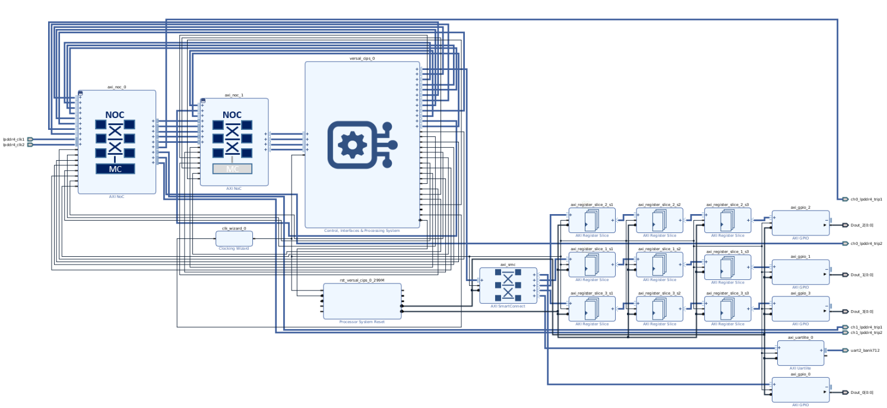
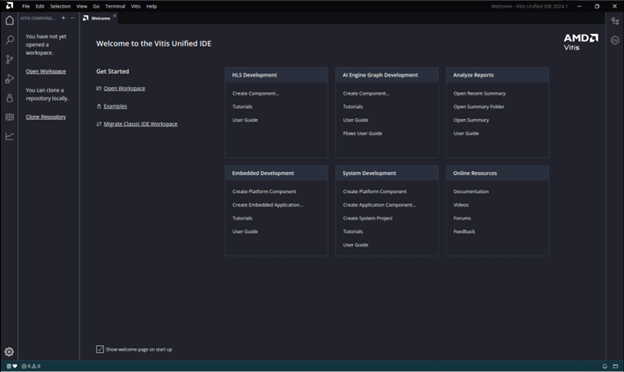

*********************************************************************************
System Design Example for Versal Stacked Silicon Interconnect Devices
*********************************************************************************

This chapter guides you through building a system based on AMD Versal |trade| devices using available tools and supported software blocks for Stacked Silicon Interconnect (SSI) devices. It explains how to create an embedded design using PL AXI GPIO and PL AXI UART using the AMD Vivado |trade| tool for the Versal Premium VP1802 SSI device based VPK180 board. Refer to the Documentation Reference Guide `(UG949) <https://docs.amd.com/r/en-US/ug949-vivado-design-methodology/Designing-with-SSI-Devices>`__ for information on designing with SSI devices. It also describes configuring and building the Linux operating system for an Arm |reg| Cortex |trade|-A72 core-based APU for a targeted Versal device.

.. _7-using-axi-gpio:

===============================
Design Example: Using AXI GPIO
===============================

The design example uses PL-based AXI GPIO interfaces to control the LEDs on the board using a Linux application (``gpiotest``). To use the four Super Logic Regions (SLR) available in the VP1802 SSI technology device, the PL AXI GPIO interface paths for LED0, LED1, LED2, and LED3 are routed through SLR-0, SLR-1, SLR-2, and SLR-3, respectively.

The RPU bare-metal example application uses the PL-based AXI UART lite to print the debug messages on the AXI UART console instead of using the PS UART console. 
 
The steps to configure the following are described in this design example:

- Versal CIPS IP core configuration for SSI technology devices. 
 
- NoC (DDR) IP Core configuration and related connections required for SSI technology devices.

- Configure AXI GPIO and AXI UART PL IPs and related connections to the CIPS through PS and PL interfaces.

Versal CIPS IP Core Configuration
~~~~~~~~~~~~~~~~~~~~~~~~~~~~~~~~~~~~~~
 
The Versal CIPS IP core allows you to configure the processing system and the PMC block, including boot mode, peripherals, clocks, interfaces, and interrupts, among other things.

Managing the Versal CIPS IP Core in the Vivado Design Suite
----------------------------------------------------------------

1. To create a new project and block design, follow the steps as given in :doc:`../docs/2-cips-noc-ip-config`.

2. To get started, add an IP from the IP catalog by clicking the **Add IP** button.

3. In the search box, type CIPS to find the Control, Interfaces, and Processing System.

4. Double-click the **Control, Interface and Processing System IP** to add it to the block design. The CIPS IP core appears in the diagram view, as shown in the following figure:

   .. image:: media/image7.png

5. Click **Run Block Automation**.

6. Configure the run block settings as shown in the following figure:

   .. image:: media/run-automation-1.png

7. Double-click **versal_cips_0** in the Block Diagram window.	

8. Ensure that all the settings for **Design Flow** and **Presets** are as shown in the following figure.
   
   .. image:: media/4-full-system.png
      
9. Click **Next**, then click **PS PMC**.

   .. image:: media/ch7_ps-pmc.png
   
   .. note:: For non SSI technology devices, one PS PMC is available.
	  
10. In **PSPMC** tab, go to Peripherals and enable the TTC peripherals as shown in figure below:

   .. image:: media/vpk_peripherals.png
	  
11. Make sure the **IO** configuration settings are as shown below:

   .. image:: media/vpk_io.png
      	  
   .. note:: VPK180 preset values sets QSPI and SD as the default boot modes. No changes are required.
   
12. Click **Interrupts** and configure settings as shown in the figure below:

   .. image:: media/ch7_interrupts.png

13. Click **OK** and **Finish** to close the CIPS GUI.	

NoC (and DDR) IP Core Configuration
~~~~~~~~~~~~~~~~~~~~~~~~~~~~~~~~~~~

This section describes the NoC (and DDR) configuration and related connections required for use with the CIPS configured earlier in the previous section. The NoC IP core allows configuring the NoC and enabling the DDR memory controllers.

Configuring NoC and CIPS
------------------------

1. Open **CIPS → PS-PMC**.

2. Click **NoC** and enable the NoC coherent, non-coherent interfaces and the NoC to PMC interfaces for Master SLR (SLR-0) as shown below.

   .. image:: media/vpk_noc-interface-slr0.png       

3. Enable PMC to NoC and NoC to PMC connectivity for slave SLRs (SLR-1, SLR-2, SLR3) as shown below.

   .. image:: media/vpk_noc-interface-slr-1.png
      :width: 600

   .. image:: media/vpk_noc-interface-slr-2.png
      :width: 600

   .. image:: media/vpk_noc-interface-slr-3.png
      :width: 600    	

4. Click **OK** and **Finish** to close the CIPS GUI.	  

5. Add two **AXI NoC IP** from the IP catalog.

6. Double-click the **axi_noc-0**. From Board tab, enable the LPDDR triplet and associated clocks as shown below.

   .. image:: media/vpk_noc_board.png      
	  
7. Select the General tab, set **Number of AXI Slave interfaces**, **AXI Clocks** to 8, and the **Number of Inter-NoC Master Interfaces** to 5 as shown below.

   .. image:: media/vpk_noc-settings.png      

8. From the Inputs tab, configure the following settings for the eight **AXI Slave interfaces** as shown below.

   .. image:: media/noc-axi.png      

9. Configure the following settings from the Connectivity tab.

    .. image:: media/vpk_noc-connectivity.png       

10. Click **OK**.

11. Double-click the **axi_noc-1**. From General tab, set **Number of AXI Slave interfaces** to 3, **Number of AXI Master interfaces** to 4, **AXI Clocks** to 7, and the **Number of Inter-NoC Slave Interfaces** to 5 as shown below.

   .. image:: media/vpk_noc_board1.png      

12. From the Inputs tab, configure the 3 **AXI Slave interfaces** to PS PMC as shown below:

   .. image:: media/vpk_noc-axi1.png      
	  
13. From the Outputs tab, configure the 4 **AXI Master interfaces** to PS PMC as shown below:

   .. image:: media/vpk_noc-axi2.png      
	  
14. Configure the following settings from the Connectivity tab.

   .. image:: media/vpk_noc-connectivity1.png      

15. Click **OK**.

16. Make connections between CIPS and NoC as shown below. 

   .. image:: media/vpk_noc-ip-new_view.png    
      

Configuring PL AXI GPIO and AXI UART
~~~~~~~~~~~~~~~~~~~~~~~~~~~~~~~~~~~~

This section describes the PS and PL configurations and the related connections to create a complete system with AXI GPIO and AXI UART. You can do this by adding the required IPs from the AMD Vivado |trade| IP catalog and then connect the components to blocks in the PS subsystem. To configure the hardware, follow these steps:
  
Configuring CIPS PS-PL interface
--------------------------------

To connect the PL IPs to CIPS, follow these steps.

1. Double-click the Versal CIPS IP core.

2. Click **PS-PMC→ PS-PL Interfaces**.

3. Enable the **M_AXI_FPD interface** and set the **Number of PL Resets** to 1, as shown in the Image.

   .. image:: ./media/ch7_PS_PL_Interfaces.png
	
4. Click **Clocking**, and then click on the Output Clocks tab.

5. Expand PMC Domain Clocks. Then expand PL Fabric Clocks. Configure the PL0_REF_CLK (PL CLK 0) to 300 MHz as shown in the following figure:

   .. image:: ./media/ch7_clocking_ps_PMC.png      

6. Click **OK** and **Finish** to complete the configuration and return to the block diagram.

Configuring PL Hardware
-----------------------

To configure the PL IPs used in this design example, follow these steps.

1. Right-click the block diagram and select **Add IP** from the IP catalog.

2. Search for AXI GPIO and double-click the **AXI GPIO IP** to add four instance of IP into the design.

3. Search for **AXI Uartlite** in the IP catalog and add it into the design.

4. Click **Run Connection Automation** in the Block Design view.
    
   .. image:: ./media/image62.png      

   The Run Connection Automation dialog box opens.

5. In the Run Connection Automation dialog box, select the All Automation check box.

   .. image:: ./media/vpk_image63.png
      
   This checks the automation for all the ports of the AXI GPIO IP.

6. Click **GPIO** of ``axi_gpio_0`` and set the Select Board Part Interface to **Custom** as shown below.

   .. image:: ./media/vpk_image64.png      

7. Click **S_AXI** of ``axi_gpio_0``. Set the configurations as shown in the following figure.

   .. image:: ./media/vpk_gpio_config0.png      
   
8. Repeat steps 6 and 7 for ``axi_gpio_1``, ``axi_gpio_2``, and ``axi_gpio_3``.

9. Click **S_AXI** of ``axi_uartlite_0``. Set the configurations as shown in the following figure.

   .. image:: media/vpk_s-axi-uartlite1.png      

10. Click **UART** of ``axi_uartlite_0``. Set the configurations as shown in the following figure.

   .. image:: media/vpk_s-axi-uartlite.png      
	  
11. Click **OK**.
	  
12. This configuration sets the following connections:

    - Connects the ``S_AXI of AXI_GPIO`` and AXI UART lite to ``M_AXI_FPD`` of CIPS with SmartConnect as a bridge IP between CIPS and AXI GPIO IPs.
    - Enables the processor system reset IP.
    - Connects the ``pl0_ref_clk`` to the processor system reset, AXI GPIO, and the SmartConnect IP clocks.
    - Connects the reset of the SmartConnect and AXI GPIO to the ``peripheral_aresetn`` of the processor system reset IP.

13. Click **Run Connection Automation** in the block design window and select the All Automation check box.

14. Click **ext_reset_in** and configure the setting as shown below.

   .. image:: media/ch7_image66.jpeg      

This connects the `ext_reset_in` of the processor system reset IP to the ``pl_resetn`` of the CIPS.

15. Click **OK**.

16. Disconnect the `aresetn` of SmartConnect IP from ``peripheral_aresetn`` of processor system reset IP.

17. Connect the `aresetn` of SmartConnect IP to ``interconnect_aresetn`` of processor system reset IP.

   .. image:: ./media/image67.jpeg       

18. Double-click the **axi_gpio_0** IP to open it.

19. Go to the IP Configuration tab, and configure the settings as shown in the following figure.

   .. image:: ./media/vpk_image68.png       

20. Make the same setting for ``axi_gpio_1``, ``axi_gpio_2``, and ``axi_gpio_3``.

21. Delete the external pins of the ``axi_gpio_0`` IP and expand the interface.

22. Make the output of ``axi_gpio_0`` IP as External.

23. Right-click the external port of ``axi_gpio_0`` IP and select External Port Properties and rename as Dout_0.

   .. image:: ./media/vpk_gpio_port.png       	

24. Repeat step 21 to step 23 for ``axi_gpio_1``, ``axi_gpio_2``, and ``axi_gpio_3`` and rename as Dout_1, Dout_2, and Dout_3, respectively.

25. Add three instances of **AXI Register Slice** IP to be placed on SLR-1, SLR-2, and SLR-3.

26. Right-click a Register Slice IP and select **Block Properties** and rename as axi_register_slice_1_s2 as shown below.

   .. image:: ./media/vpk_register_light_2.png
       
27. Double-click the AXI Register Slice IP, and set **Protocol** as AXI4LITE by setting it as manual as shown below.

   .. image:: media/vpk_register_light_1.png
        
28. Repeat step 26 and 27 for the second and third instances of AXI Register Slice IP and rename as ``axi_register_slice_2_s2`` and ``axi_register_slice_3_s2``, respectively.

.. note:: ``axi_register_slice_1_s2``, ``axi_register_slice_2_s2``, and ``axi_register_slice_3_s2`` are placed to SLR-1, SLR-2, and SLR-3, respectively using the constraints file provided as part of the package in the ``pl_gpio_uart/constrs` folder.

**SLR Crossing from SLR-0 to SLR-1** 

.. note:: SLR crossing registers are added to improve timing closure and alleviate routing congestion of long resources.

29. Add two instances of **AXI Register Slice** IP to handle the SLR crossing from SLR-0 to SLR-1.

30. Right-click the Register Slice IP and select **Block Properties** and rename as ``axi_register_slice_1_s1``.

31. Double-click the Register Slice IP and set the Register Slice Option as **SLR Crossing** as shown below.

    .. image:: media/vpk_slr_crossing_1.png         

32. Repeat step 30 and step 31 for the second instance of AXI Register Slice IP and rename as ``axi_register_slice_1_s3``.

**SLR Crossing from SLR-0 to SLR-2** 

33. Similarly add two instances of **AXI Register Slice** IP to handle the multi SLR crossing from SLR-0 to SLR-2.

34. Right-click a Register Slice IP and select **Block Properties** and rename as ``axi_register_slice_2_s1``.

35. Double-click a Register Slice IP and set the Register Slice Option as **Multi SLR Crossing** as shown below.

    .. image:: media/vpk_multi_slr_crossing_2_1.png         

36. Open SLR Crossing tab, and set Number of SLR Crossing as 2 as shown below.

    .. image:: media/vpk_multi_slr_crossing_2_2.png        
  
37. Repeat step 34, step 35, and step 36 for the second instance of AXI Register Slice IP and rename as ``axi_register_slice_2_s3``.

**SLR Crossing from SLR-0 to SLR-3** 

38. Similarly add two instances of **AXI Register Slice** IP to handle the SLR crossing from SLR-0 to SLR-3.

39. Right-click a Register Slice IP and select **Block Properties** and rename as ``axi_register_slice_3_s1``.

40. Double-click a Register Slice IP and set the Register Slice Option as **Multi SLR Crossing** as shown below.

    .. image:: media/vpk_multi_slr_crossing_3.png         

41. Open SLR Crossing tab, and set Number of SLR Crossing as 3 as shown below.

    .. image:: media/vpk_multi_slr_crossing_4.png        
	  
42. Repeat step 39, step 40, and step 41 for the second instance of the AXI Register Slice IP and rename as ``axi_register_slice_3_s3``.

43. Disconnect `axi_gpio_0` , `axi_gpio_1` , `axi_gpio_2` and `axi_gpio_3` from AXI smart connect and connect the register slices as shown below.
   
    .. image:: ./media/vpk_register_slice_con.PNG            

44. Click **Run Connection Automation** in the Block Design view. Select ``aclk`` of all register slices and click **OK**.

    .. image:: ./media/vpk_register_slice_con_clk.png       
	  
45. Double-click **axi_uartlite_0** to open the IP. Go to the IP Configuration tab and configure the settings as shown in the following figure.

    .. image:: media/vpk_configure-ip-settings.png

46. Add **Clock Wizard IP**. Double-click to open the IP.

47. Go to Clocking Features tab and set the configuration as shown below:

    .. image:: media/clocking-features.png

48. Make sure the Source option in **Input Clock Information** is set to **Global buffer**.
    
49. Go to Output clocks tab and configure the output clock as **250 MHz** as follows:

    .. image:: media/vpk_output-clocks-tab.png

50. Right-click ``pl0_ref_clk`` of CIPS and click **Disconnect Pin**.

51. Connect the ``pl0_ref_clk`` from CIPS to input ``clk_in1`` of the Clocking wizard.

52. Connect the output of clocking wizard to ``slowest_sync_clock`` of Processor System Reset IP.

    This helps in avoiding timing failure. 

The overall block design is shown in the following figure:

Validating the Design and Generating the Output
-----------------------------------------------

To validate the design and to generate the output product, follow these steps:

1. Return to the block design view and save your block design (press **Ctrl+S**).

2. Right-click in the white space of the Block Diagram view and select **Validate Design**. Alternatively, you can press the F6 key. A message dialog box opens as shown below.
   
   The Vivado tool prompts you to map the IPs in the design to an address. Click **Yes**.

   .. image:: media/vpk_assign-address.png

   .. note:: The number of address segments may vary depending on the number of memory mapped IPs in the design.

   Once the validation is complete, a message dialog box opens as shown below:

   .. image:: media/validation_message.PNG

3. Click **OK** to close the message.

4. Click the **Sources** window.

   1. Expand Constraints.

   2. Right-click on **constrs_1-> ADD Sources**.

      The Add Sources window opens.

   3. Choose **Add or Create Constraints** option and click **Next**.

   4. Choose the .xdc file to be added.

      .. note:: The constraints file is provided as part of the package in the ``pl_gpio_uart/constrs`` folder.
    
   5. Click **Finish**.

5. In the Block Design view, click **Sources** tab  

6. Click **Hierarchy** and Expand Design Sources Folder, right-click **edt_versal** and select **Create HDL Wrapper**.

   The Create HDL Wrapper dialog box opens. Use this dialog box to create an HDL wrapper file for the processor subsystem.

   .. tip:: The HDL wrapper is a top-level entity required by the design tools.
   
7. Select **Let Vivado manage wrapper and auto-update** and click **OK**.

8. In the Sources window, under Design Sources, expand **edt_versal_wrapper**.

9. Right-click the top-level block design, edt_versal_i : edt_versal (``edt_versal.bd``), and select **Generate Output Products**.

   .. image:: ./media/ch7_GOP.png

10. Click **Generate**.

11. When the Generate Output Products process completes, click **OK**.

12. In the Sources window, click the **IP Sources** view. Here, you can see the output products that you just generated, as shown in the following figure.

    .. image:: ./media/vpk_180_ip-sources-ch5-final.png

.. _synthesize-hardware-7:

Synthesizing, Implementing, and Generating the Device Image
-----------------------------------------------------------

Follow these steps to generate a device image for the design.

1. Go to **Flow Navigator→ Program and Debug**, click **Generate Device Image** and click **OK**.

2. A No Implementation Results Available menu appears. Click **Yes**.

3. A Launch Run menu appears. Click **OK**.

   When the Device Image Generation completes, the Device Image Generation Completed dialog box opens.

4. Click **Cancel** to close the window.

.. note:: The generated device image needs to be overlayed with `secio-sysmon.v3.cdo` file to enable accessing slave SLRs power rails. For more information refer to the Answer Record (`#000034400 <https://support.xilinx.com/s/article/000034400?language=en_US>`__.)
   
5. Copy secio-sysmon.v3.cdo from ``<design-package>/ref_files/EDT_2024.1_PACKAGE/ug1305-embedded-design-tutorial/vpk180/pl/pl_gpio_uart`` to the working directory.

6. Navigate to the generated device image path ``../project_1/project_1.runs/impl/`` and run the below command as mentioned in (AR#000034400)

   .. code-block::
    
       exec [exec which bootgen] -arch versal -image ./edt_versal_wrapper.bif -w -o ./edt_versal_wrapper.pdi -overlay_cdo ../../../secio-sysmon.v3.cdo  

7. Export hardware after you generate the new Device Image.

   .. note:: The following steps are optional and you can skip these and go to the :ref:`exporting-hardware-7` section. These steps provide the detailed flow for generating the device image by running synthesis and implementation before generating device image. If you need to understand the flow for generating the device image, follow the steps provided below.

   1. Go to **Flow Navigator→ Synthesis** and click **Run Synthesis**.

      .. image:: media/image17.png

   2. If Vivado prompts you to save your project before launching synthesis, click **Save**.

      While synthesis is running, a status bar is displayed in the upper right-hand window. This status bar spools for various reasons throughout the design process. The status bar signifies that a process is working in the background. When synthesis is complete, the Synthesis Completed dialog box opens.

   3. Select **Run Implementation** and click **OK**.

      When implementation completes, the Implementation Completed dialog box opens.

   4. Select **Generate Device Image** and click **OK**.

      When Device Image Generation completes, the Device Image Generation Completed dialog box opens.

   5.  Click **Cancel** to close the window.

       Export hardware, after you generate Device Image.

.. _exporting-hardware-7:

Exporting Hardware
------------------

1. From the Vivado main menu, select **File→ Export → Export Hardware**. The Export Hardware dialog box opens.

2. Choose **Include bitstream** and click **Next**.

3. Provide a name for your exported file (or use the default provided) and choose the location. Click **Next**.

   A warning message appears if a hardware module has already been exported. You may choose to pick a different name for this design or click **Yes** to overwrite the existing XSA file, if the overwrite message is displayed.

4. Click **Finish**.

====================================================================
Example Project: FreeRTOS AXI UARTLITE Application Project with RPU
====================================================================

This section explains how to configure and build the FreeRTOS application for an Arm Cortex-R5F core based RPU on a Versal device.

The following steps demonstrate the procedure to create a FreeRTOS Application from Arm Cortex-R5F:

Creating the Platform
~~~~~~~~~~~~~~~~~~~~~

To create the platform for VPK180, follow these steps:

1. Select the workspace.
   
   .. image:: media/new-create-platform-vck190.png

2. Select **File > New Component > Platform**.

   +--------------+-------------------+----------------------------------+
   |    **Wizard  |    **System       |    **Setting or command to use** |
   |    Screen**  |    Properties**   |                                  |
   +==============+===================+==================================+
   |    Platform  |    Component name |    Vpk180_platform               |
   +--------------+-------------------+----------------------------------+
   |              |    Component      |    < platform path >             |
   |              |    location       |                                  |
   +--------------+-------------------+----------------------------------+
   |              |    Hardware       |    Click the browser button to   |
   |              |    Design (XSA)   |    add your XSA file             |
   +--------------+-------------------+----------------------------------+
   |    Domain    |    Operating      |    freertos                      |
   |              |    System         |                                  |
   +--------------+-------------------+----------------------------------+
   |              |    Processor      |    Psv_cortexr5_0                |
   +--------------+-------------------+----------------------------------+

3. Select the Hardware Design (XSA) and click **Next**.

4. Select Operating System and Processor, click **Next**, then click **Finish**.

   Platform is created successfully.
   
   .. image:: media/new-plat-vpk180.png

Creating an Empty Application
~~~~~~~~~~~~~~~~~~~~~~~~~~~~~~

1. Launch Vitis IDE and open the workspace where the platform is created.

   .. image:: media/welcome-vitis-ide.png

2. Select **File > New Component > Application**. The **Creating a New Application Components** wizard opens. If this is the first time that you have launched the Vitis IDE, you can select **Create Application Component** on the Welcome screen.

3. Add the Component name and the component location.

   +----------------+-----------------------------+-------------------------------+
   |    **Wizard    |    **System Properties**    |    **Setting or               |  
   |    Screen**    |                             |    command to use**           |
   +================+=============================+===============================+
   |    Application |    Component name           |    freertos_gpio_test         |
   |    Details     |                             |                               |
   +----------------+-----------------------------+-------------------------------+
   |                |    Component location       |    < Application path >       |
   +----------------+-----------------------------+-------------------------------+
   |                |    Select a platform from   |    Vpk180_platform            |
   |                |    repository               |                               |
   +----------------+-----------------------------+-------------------------------+
   |    Domain      |    Select a Domain          |    +Create New                |
   +----------------+-----------------------------+-------------------------------+
   |                |    Name                     |    freertos_gpio_test_system  |
   +----------------+-----------------------------+-------------------------------+
   |                |    Operating System         |    freertos                   |
   +----------------+-----------------------------+-------------------------------+
   |                |    Processor                |    Psv_cortexa5_0             |
   +----------------+-----------------------------+-------------------------------+

4. Select the Created Platform and click **Next**.

5. Add name and OS “\ *freertos*\ ”.
   
6. Select domain “\ *psv_cortexr5_0*\ ” and click **Next**.

7. Click **Finish** and the Empty Application is created Successfully.
   
   .. image:: media/new-ch7-empty-app.png

8. Delete the source files under ``source/directory`` and copy the freertos source code files from the FreeRTOS project path, ``<design-package>/ch5_system_design_example_source__files/rpu/`` to the ``source/directory``.

9. Configure the Vitis IDE to enable AXI UARTLITE for RPU application debug console under the FreeRTOS Board Support Package.
   Navigate to vitis-comp.json under vpk180_platform project under Settings. Then select **Navigate to BSP Settings** under Board support package. Modify stdin and stdout to **axi_uarlite_0** by selecting it from the drop-down options, as shown in the following snippet.
   
    .. image:: media/configure-vitis-ide.png

Building the Application
~~~~~~~~~~~~~~~~~~~~~~~~~

1. Select the **Component** (Application) to be built.

   .. image:: media/new-flow.png

2. Click **Build**.

   .. image:: media/new-proj-built.png
   
   Project is built successfully. On PL AXI UART Serial Console, RPU debug logs is printed as shown below:

   .. code::

      Gpio Initialization started
      Counter 0
      Counter 1
      Counter 2
      Counter 3
      Counter 4
      Counter 5

.. _creating-linux-images-using-petalinux:

======================================================
Example Project: Creating Linux Images Using PetaLinux
======================================================

This section explains how to configure and build the Linux operating system for an Arm Cortex-A72 core-based APU on a Versal device. You can use the PetaLinux tool with the board-specific BSP to configure and build Linux images.

This example needs a Linux host machine. Refer to the PetaLinux Tools Documentation Reference Guide `UG1144 <https://www.xilinx.com/cgi-bin/docs/rdoc?v=latest;d=ug1144-petalinux-tools-reference-guide.pdf>`__ for information on dependencies and installation procedure for the PetaLinux tool.

.. important:: 

   This example uses the VPK180 PetaLinux BSP to create a PetaLinux project. Ensure that you have downloaded the respective BSP for PetaLinux (VPK180).

   .. list-table::
      :widths: 25 25 25 25
      :header-rows: 1

      * - Board
        - QSPI/SD
        - OSPI
        - eMMC

      * - VPK180 Production Board
        - `xilinx-vpk180-v2024.1-05230256.bsp <https://www.xilinx.com/member/forms/download/xef.html?filename=xilinx-vpk180-v2024.1-05230256.bsp>`
        - N/A 
        - N/A
    

1. Copy the respective board's PetaLinux BSP to the current directory.
   
2. Set up the PetaLinux environment
   
   .. code-block::

        $ source <petalinux-tools-path>/settings.csh

3. Create a PetaLinux project using the following command.
   
   .. code-block::
   
        $ petalinux-create -t project -s xilinx-vpk180-vxxyy.z-final.bsp -n led_example

   .. note:: 
   
      - For VPK180 board, use `xilinx-vpk180-vxxyy.z-final.bsp` after the `-s` option in the command.

4. Change to the PetaLinux project directory using the following command.

   .. code-block::
    
        $cd led_example

5. Copy the hardware platform project XSA to the Linux host machine.

   .. note:: For the VPK180 board, use the XSA file that you generated in the :ref:`7-using-axi-gpio`.

6. Reconfigure the BSP using the following commands.

   .. code-block::

        $ petalinux-config --get-hw-description=<path till the directory containing the respective xsa file>

   This command opens the PetaLinux Configuration window. For this example, no need to change anything in this window.

7. Click **<Save>** to save the above configuration and then **<Exit>** to exit the configuration wizard.

8. Create a Linux application named gpiotest within the PetaLinux project using the following command.

   .. code-block::

        $petalinux-create -t apps --template install --name gpiotest --enable

9. Copy application files from ``<design-package>/<vpk180>/linux/bootimages`` to the project using the following commands.

   .. code-block::
    
        $cp <design-package>/ch7_system_design_example_source__files/apu/gpiotest_app/gpiotest/files/* <plnxproj-root>/project-spec/meta-user/recipes-apps/gpiotest/files/
        $cp <design-package>/ch7_system_design_example_source__files/apu/gpiotest_app/gpiotest/gpiotest.bb <plnx-proj-root>/project-spec/meta-user/recipes-apps/gpiotest/gpiotest.bb
        $cp <design-package>/ch7_system_design_example_source__files/apu/device_tree/system-user.dtsi <plnx-proj-root>/project-spec/meta-user/recipes-bsp/device-tree/files/system-user.dtsi

10. Enable GPIO support within kernel configuration.

    .. code-block::
        
        $petalinux-config -c kernel

    .. note:: This command opens the kernel configuration wizard for the PetaLinux project.

11. Navigate to **Device drivers→ GPIO Support** and enable it by pressing the **<Y>** key. Press **Enter** and enable the Debug GPIO calls and ``/sys/class/gpio/...(sysfs interface)`` entries by pressing the **<Y>** key as shown in the following figure.

    .. image:: ./media/versal_2021_gpio_debug.png

12. Navigate to **Memory mapped GPIO drivers** and enable GPIO support and Zynq GPIO support by pressing **<Y>** key as shown in the following figure.

    .. image:: ./media/versal_2021_gpio_xilinx.png

13. Click **<Save>** to save the above configuration and then **<Exit>** option to exit the configuration wizard.

14. Configure ROOTFS to disable the AIE, STDC++, and Tcl options to reduce the rootfs size to fit into both SD and OSPI/QSPI Flash partitions. 
 
    .. code-block::
   
       petalinux-config -c rootfs

15. Navigate to User Packages and disable aie-notebooks, openamp-demo-notebooks, packagegroup-petalinux-jupyter, pm-notebooks, and python3-ipywidgets support by pressing <Y> key as shown in the following figure.

    .. image:: media/rootfs_config_aie.JPG

16. Navigate to **Filesystem Packages → misc → gcc-runtime** and disable **libstdc++ support** by pressing <Y> key as shown in the following figure.

    .. image:: media/rootfs_config_stdc++.JPG

17. Navigate to **Filesystem Packages → devel → tcltk → tcl** and disable **tcl support** by pressing <Y> key as shown in the following figure. 

    .. image:: media/rootfs_config_tcl.JPG

18. Click **<Save>** to save the above configuration and then click **<Exit>** to exit the configuration wizard.

    .. note:: Only SD and QSPI boot modes will work on VPK180 Production boards.

19. Build the Linux images using the following command.

    .. code-block::
       
        $ petalinux-build

   .. note:: Skipping steps 5 and 6 in the :ref:`synthesize-hardware-7` section will result in `PLM Error Status: 0x22220001` while booting PetaLinux.

After flashing the built images, all four LEDs which are connected to slave SLR will be turned on on the VPK180 board.

.. |build|  image:: ./media/image29.png

.. |trade|  unicode:: U+02122 .. TRADEMARK SIGN
   :ltrim:
.. |reg|    unicode:: U+000AE .. REGISTERED TRADEMARK SIGN
   :ltrim:

.. Copyright © 2020–2024 Advanced Micro Devices, Inc
.. `Terms and Conditions <https://www.amd.com/en/corporate/copyright>`_.