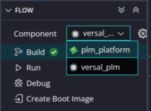
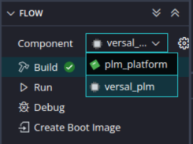
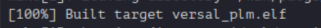

****************************
Appendix: Creating the PLM
****************************

Following are the steps to create a platform loader and manager (PLM) elf file in the AMD Vitis |trade| software platform. In Versal |trade| devices, the PLM executes in the PMC, and is used to bootstrap the APU and RPU.

======================
Creating the Platform
======================

Follow these steps to create a platform for the PLM:

1. Select the workspace.

   .. image:: media/location_new_vitis.PNG

2. Select **File > New Component > Platform**. The new application project wizard opens.

   Use the following information to make your selections on the wizard
   screens:

   +--------------+-------------------+-----------------------------------+
   |    **Wizard  |    **System       |    **Setting or command to use**  |
   |    Screen**  |    Properties**   |                                   |
   +==============+===================+===================================+
   |    Platform  |    Component name |    plm_platform                   |
   +--------------+-------------------+-----------------------------------+
   |              |    Component      |    < platform path >              |
   |              |    location       |                                   |
   +--------------+-------------------+-----------------------------------+
   |              |    Hardware       |    Click the browser button to    |
   |              |    Design (XSA)   |    add your XSA file              |
   +--------------+-------------------+-----------------------------------+
   |    Domain    |    Operating      |    standalone                     |
   |              |    System         |                                   |
   +--------------+-------------------+-----------------------------------+
   |              |    Processor      |    psv_pmc_0                      |
   +--------------+-------------------+-----------------------------------+

3. Select the Hardware Design (XSA) and click **Next**.

4. Select Operating System and Processor, click **Next** and **Finish**.

   Platform will be created successfully.
   
   .. image:: media/plm-platform.png

===============================================
Creating a Versal PLM Application from Example
===============================================

Follow these steps to create a Versal PLM application using the created platform:

1. Select **File > New Components > From Example**.

2. Select ``versal_plm`` and click **Create Application Component from Template**.

   .. image:: media/versal-plm.png

   Use the following information to make your selections on the wizard
   screens:

   +--------------+---------------------+--------------------------------+
   |    **Wizard  |    **System         |    **Setting or command to     |
   |    Screen**  |    Properties**     |    use**                       |
   +==============+=====================+================================+
   |              |    Component name   |    plm                         |
   |  Application |                     |                                |
   |    Details   |                     |                                |
   +--------------+---------------------+--------------------------------+
   |              |    Component        |    < Application path >        |
   |              |    location         |                                |
   +--------------+---------------------+--------------------------------+
   |              |    Hardware Design  |    Select the platform created |
   |              |    (XSA)            |    (plm_platform)              |
   +--------------+---------------------+--------------------------------+
   |    Domain    |    Operating System |    standalone                  |
   +--------------+---------------------+--------------------------------+
   |              |    Processor        |    psv_pmc_0                   |
   +--------------+---------------------+--------------------------------+

3. Add the **Component name** and click **Next**.

4. Select the Created Platform and click **Next**.

5. Select Domain “\ *standalone*\ ” and Processor “\ *psv_pmc_0*\ ” and
   click **Next**.

6. Click **Finish** and the ``versal_plm`` application is created successfully.
   
   .. image:: media/plm-success.png

The Vitis software platform creates the PLM application project and ``edt_versal_wrapper`` platform under the Explorer view.

Select the component (platform) and click **Build**.

Select the component (application) and click **Build**.

This generates the ``versal_plm.elf`` file within the `Output` folder of the application project. After building the project, build the platform as well.

.. |trade|  unicode:: U+02122 .. TRADEMARK SIGN
   :ltrim:
.. |reg|    unicode:: U+000AE .. REGISTERED TRADEMARK SIGN
   :ltrim:
 
.. Copyright © 2020–2023 Advanced Micro Devices, Inc
.. `Terms and Conditions <https://www.amd.com/en/corporate/copyright>`_.

