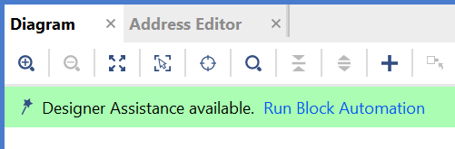
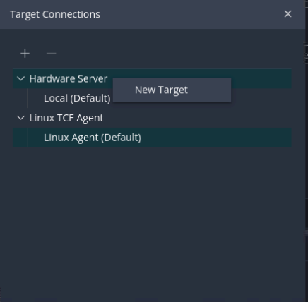
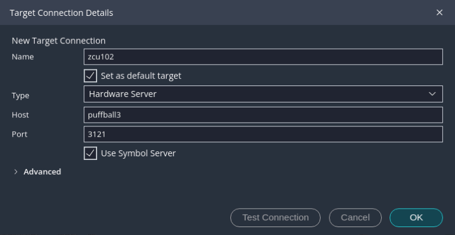

====================================
Using the Zynq SoC Processing System
====================================

The AMD Zynq |trade| SoC consists of Arm |reg| Cortex |trade|-A9 cores, many hard intellectual property components (IPs), and programmable logic (PL). This offering can be used in two ways:

-  The Zynq SoC PS can be used in a standalone mode, without attaching any additional fabric IP.
-  IP cores can be instantiated in fabric and attached to the Zynq PS as a PS+PL combination.

This chapter describes how to develop an embedded system with only the processing system (PS) of the Zynq |trade| 7000 SoC.

The creation of a Zynq device system design involves configuring the PS to select the appropriate boot devices and peripherals. To start with, as long as the PS peripherals and available MIO connections meet the design requirements, no bitstream is required. This chapter guides you through creating a simple PS-based design that does not require a bitstream.

-  Example 1 uses Vivado to design the hardware project of this embedded system.
-  Example 2 designs a “Hello World” software application in the Vitis IDE based on the Example 1 hardware.

.. _example-1-creating-a-new-embedded-project-with-zynq-soc:

Example 1: Creating a New Embedded Project with Zynq SoC
--------------------------------------------------------

For this example, you will launch the AMD Vivado |trade| Design Suite and create a project with an embedded processor system as the top level.

Input and Output Files (Example 1)
~~~~~~~~~~~~~~~~~~~~~~~~~~~~~~~~~~~~~

-  Input Files: N/A
-  Output Files: Vivado hardware handoff file ``system_wrapper.xsa``

Creating Your Hardware Design
~~~~~~~~~~~~~~~~~~~~~~~~~~~~~

1. Start the Vivado Design Suite.

   -  On Windows 10, click the start menu and find **Xilinx Design Tools → Vivado 2023.2**.
   -  On Linux, run `source <Vivado installation path>/settings64.sh` to set up the environment and run ``vivado &`` to launch the Vivado IDE.

2. In the Vivado Quick Start page, click **Create Project** to open the New Project wizard.

3. Use the information in the table below to make selections in each of the wizard screens.

   +---------+---------------------------------------------+--------------+
   | Screen  | System Property                             | Setting or   |
   |         |                                             | Command to   |
   |         |                                             | Use          |
   +=========+=============================================+==============+
   | Project | Project Name                                | edt_zc702    |
   | Name    |                                             |              |
   +---------+---------------------------------------------+--------------+
   |         | Project Location                            | C:/edt       |
   +---------+---------------------------------------------+--------------+
   |         | Create Project Subdirectory                 | Leave this   |
   |         |                                             | checked.     |
   +---------+---------------------------------------------+--------------+
   |         | Project is an extensible Vitis platform     | Leave this   |
   |         |                                             | unchecked.   |
   +---------+---------------------------------------------+--------------+
   | Project | Specify the type of sources for your        | RTL Project  |
   | Type    | design. You can start with RTL or a         |              |
   |         | synthesized EDIF.                           |              |
   +---------+---------------------------------------------+--------------+
   |         | Do not specify sources at this time         | Leave this   |
   |         |                                             | checked.     |
   +---------+---------------------------------------------+--------------+
   |         | Project is an extensible Vitis platform     | Leave this   |
   |         |                                             | unchecked.   |
   +---------+---------------------------------------------+--------------+
   | Default | Choose a default AMD part or board for your | Select the   |
   | Part    | project                                     | Boards tab.  |
   +---------+---------------------------------------------+--------------+
   |         | Boards                                      | ZYNQ-7 ZC702 |
   |         |                                             | Evaluation   |
   |         |                                             | Board        |
   +---------+---------------------------------------------+--------------+
   | New     | Project Summary                             | Review the   |
   | Project |                                             | project      |
   | Summary |                                             | summary.     |
   |         |                                             |              |
   +---------+---------------------------------------------+--------------+

4. Click **Finish**. The New Project wizard closes and the project you just created opens in the Vivado design tool.

Creating an Embedded Processor Block Diagram
~~~~~~~~~~~~~~~~~~~~~~~~~~~~~~~~~~~~~~~~~~~~

Perform the following steps to create an embedded processor project.

1. Create a new block diagram:

   1. In the Flow Navigator, under **IP Integrator**, click **Create Block Design**.
   2. The Create Block Design dialog box opens.
   3. Update **Design Name** if necessary. In this example, change it to **system**.
   4. Click **OK**.

   The Diagram window opens with a message that states that this design is empty. To get started, you will next add some IP from the catalog.

2. Add the Zynq Processing System IP to the block diagram:

   1. Click the **Add IP** button |Add-IP-Button|.
   2. In the search box, type **zynq** to find the Zynq device IP options.
   3. Double-click the **ZYNQ7 Processing System** IP to add it to the block design.

   The Zynq Processing System IP block appears in the Diagram view, as shown in the following figure.

   .. figure:: ./media/image9.png
      :alt: ZYNQ7 in block diagram

      ZYNQ7 in block diagram

Configuring the Zynq 7000 Processing System with Presets in Vivado
~~~~~~~~~~~~~~~~~~~~~~~~~~~~~~~~~~~~~~~~~~~~~~~~~~~~~~~~~~~~~~~~~~

In the Block Diagram window, notice the message stating that Designer assistance is available, as shown in the following figure.

1. Click the **Run Block Automation** link. The Run Block Automation view opens.

   Note that Cross Trigger In and Cross Trigger Out are disabled. For a detailed tutorial with information about cross trigger set-up, refer to the *Vivado Design Suite Tutorial: Embedded Processor Hardware Design* (`UG940 <https://docs.xilinx.com/v/u/en-US/ug940-vivado-tutorial-embedded-design>`_).

2. Click **OK** to accept the default processor system options and make default pin connections.

   The following image illustrates the automation result. It configures PS properties inside the block and connects fixed IO and DDR pins.

   .. image:: ./media/vivado_zynq_automation_result.png

Validating the Design and Connecting Ports
~~~~~~~~~~~~~~~~~~~~~~~~~~~~~~~~~~~~~~~~~~

Now, let’s validate the design.

1. Right-click in the white space of the Diagram window and select **Validate Design**. Alternatively, you can press the **F6** key or
   the check button on the block diagram toolbar.

   -  A critical message appears, indicating that the ``M_AXI_GP0_ACLK`` must be connected.

      .. figure:: ./media/image14.png

   -  Click **OK** to close the message window.

2. Connect the ``M_AXI_GP0_ACLK`` signal to PS generated PL clock signal.

   -  The PS can generate four clock signals with ``FCLK_CLK<number>``. These are the clocks for the PL fabric. The clock frequency can be adjusted in PS block settings.
   -  In the Diagram window of the ZYNQ7 Processing System block, locate the **M_AXI_GP0_ACLK** port. Hover your mouse over the connector port until the pencil button appears.
   -  Click the **M_AXI_GP0_ACLK** port and drag to the **FCLK_CLK0** port to make a connection between the two ports.

      .. image:: ./media/image15.png

3. Validate the design again to ensure there are no other errors.

   -  Right-click in the white space of the Diagram window and select **Validate Design**.

   A dialog box with the following message opens:

      Validation successful. There are no errors or critical warnings in this design.

   -  Click **OK** to close the message.

Creating an HDL Wrapper for the Block Diagram
~~~~~~~~~~~~~~~~~~~~~~~~~~~~~~~~~~~~~~~~~~~~~

1. Click the **Sources** window.

   It should be in the **Hierarchy** tab by default. If it is not there, click the **Hierarchy** tab.

2. Expand **Design Sources**, right-click the block diagram file **system(system.bd)**, and select **Create HDL Wrapper**.

   The Create HDL Wrapper view opens. You will use this view to create an HDL wrapper file for the processor subsystem.

   .. tip:: The HDL wrapper is a top-level entity required by the design tools.

3. Select **Let Vivado manage wrapper and auto-update** and click **OK**.

   ``system_wrapper.v`` is generated. It is set to the top module of this design automatically.

Generating the Block Design
~~~~~~~~~~~~~~~~~~~~~~~~~~~

1. In **Flow Navigator** window, click **Generate Block Design** under **IP Integrator**.

2. Change the Synthesis Options to **Global**.

   .. note:: If the synthesis option is **Global**, only wrapper files are generated during the block design generation phase, and the design will be synthesized as a whole at the synthesis stage. If the synthesis option is **Out of context per IP** or **Out of context per Block design**, the wrapper of the IP or block design will be generated and synthesized during block design generation, and the generated netlists will be combined together at the synthesis stage.

3. Click **Generate**.

   This step builds all the required output products for the selected source. For example, constraints do not need to be manually created for the IP processor system. The Vivado tools automatically generate the XDC file for the processor subsystem when **Generate Output Products** is selected.

4. When the Generate Output Products process completes, click **OK**.

5. In the Sources window, click the **IP Sources** view. Here you can see the output products that you just generated, as shown in the following figure.

   .. figure:: ./media/image18.png
      :alt: Generated IP Source Files

      Generated IP Source Files

Exporting Hardware
~~~~~~~~~~~~~~~~~~

Two types of hardware can be exported from Vivado: pre-synthesis and post-implementation. In the block design for this example, the hardware in the PL is the signal from ``FCLK_CLK0`` to ``M_AXI_GP0_ACLK``. It drives the clock of ``M_AXI_GP0``, because only pure PS functions will be tested in this example and PL resources will not be used, no loads are added to the ``M_AXI_GP0`` AXI interface. You can skip the synthesis, implementation, and bitstream generation phases to save time. We will export the pre-synthesis hardware in this case.

1. From the Vivado main menu, select **File→ Export → Export Hardware**. The Export Hardware Platform wizard opens.

2. Use the information in the following table to make selections in each of the wizard screens. Click **Next** wherever necessary.

   +--------+-----------------+---------------------------+
   | Screen | System Property | Setting or Command to Use |
   +========+=================+===========================+
   | Output |                 | Pre-synthesis.            |
   | Files  | XSA file name   | Leave as system_wrapper.  |
   |        | Export to       | Leave as C:/edt/edt_zc702.|
   +--------+-----------------+---------------------------+

3. Click **Finish**.

   After a while, the Vivado Tcl Console reports the following message; ``system_wrapper.xsa`` is the exported hardware handoff file.

   .. code::

         write_hw_platform -fixed -force -file C:/edt/edt_zc702/system_wrapper.xsa
         INFO: [Vivado 12-4895] Creating Hardware Platform: C:/edt/edt_zc702/system_wrapper.xsa ...
         INFO: [Hsi 55-2053] elapsed time for repository (C:/Xilinx/Vivado/2023.2/data/embeddedsw) loading 1 seconds
         INFO: [Vivado 12-12467] The Hardware Platform can be used for Hardware
         INFO: [Vivado 12-4896] Successfully created Hardware Platform: C:/edt/edt_zc702/system_wrapper.xsa

What's Next?
~~~~~~~~~~~~

Now you can start developing the software for your project using the Vitis software platform. The next sections help you create a software application for your hardware platform.

Example 2: Creating and Running a “Hello World” Application
-----------------------------------------------------------

In this example, you will learn how to manage the board settings, make cable connections, connect to the board through your PC, and run a simple “Hello World” software application in JTAG mode using System Debugger in the Vitis IDE.

Input and Output Files (Example 2)
~~~~~~~~~~~~~~~~~~~~~~~~~~~~~~~~~~~~~~~~

-  Input Files: ``system_wrapper.xsa``
-  Output Files: ``hello_world.elf``

.. _setting-up-the-board:

Setting Up the Board
~~~~~~~~~~~~~~~~~~~~

1. Connect the power cable to the board.

2. Connect the USB UART cable to J17.

3. Connect the USB JTAG cable:

   1. Connect a micro USB cable between the host machine and the ZC702 target board U23.
   .. note:: Do not to use J1.
   2. Make sure that the **SW10** switch settings for JTAG selection are set to choose USB JTAG:

      -  Bit-1 is 0
      -  Bit-2 is 1

   .. figure:: ./media/image68.jpeg
      :alt: JTAG Select SW10

   .. note:: 
   
       - 0 = switch is open. 
       - 1 = switch is closed.

4. Setup JTAG boot mode using the switch indicated in the following figure.

   -  Ensure that jumpers **J27** and **J28** are placed on the side farther from the SD card slot.
   -  Change the **SW16** switch setting as shown in the following figure.

   .. figure:: ./media/image32.jpeg
      :alt: JTAG Boot Setup

      JTAG Boot Setup

5. Power on the ZC702 board.

Creating a Vitis Unified Platform Project
~~~~~~~~~~~~~~~~~~~~~~~~~~~~~~~~~~~~~~~~~~~~~~~~~~~~~~~~~~~~~~~~~~

1. Launch the Vitis Unified IDE with any of the actions below:

   1. From the Vivado IDE, select **Tools → Launch Vitis IDE**.
   2. On Windows, launch the Vitis IDE by using the desktop shortcut or **Windows start menu → Xilinx Design Suite → Vitis 2023.2**.
   3. On Linux, run ``source <Vitis Installation Directory>/settings64.sh`` to set up the environment and run ``vitis &``.

2. Select **Open Workspace** and give the location as **C:/edt/edt_zc702_workspace** or any given location path.

   -  Unlike Vitis Classic IDE, the platform is not generated automatically. You need to do this manually.

3. Click **File → New Component → Platform**. Enter the platform project name as **zc702_edt**, as shown in following figure. Click **Next**.

   .. figure:: ./media/image25.png
       :alt: Platform Name

       Platform Name

4. In the **Select Platform Creation Flow** page, Select **Hardware Design** and click **browse** to specify the XSA file ``C:\edt\edt`\_zc702\system`\_wrapper.xsa\``, and click **OK**.

   -  When the XSA file is selected, the System Device Tree (SDT) is generated, and the metadata here is used to populate the processor list. Once the SDT is created, choose **standalone** and the processor is **ps7_cortexa9_0**.
   - Keep the **Generate boot Artifacts** option selected, as shown in the following figure.

   .. figure:: ./media/image26.png
       :alt: Select XSA

       Select XSA
   
-  Click **Finish**.

7. The platform project is created. In the **Vitis Components** view, double-click **zc702_edt → platform.spr** to view the platform view as shown in the following figure.

   .. image:: ./media/image27.png

8. In the **Vitis Components** view, expand **zc702_edt → Settings → vitis-comp.json**. 

   .. image:: ./media/image28.png

   You can select the **Hardware Specification** link to see the the address map for the entire processing system.

   .. image:: ./media/hardware_spec.png

9. Build the platform by highlighting the platfom in **Vitis Components** view, and under **FLOW**, clicking the hammer button as shown in following figure.

   .. figure:: ./media/image29.png
       :alt: Build Platform

       Build Project

10. As the project builds, you can see the output in the Console window.

   The build process takes some time because it is not only building the standalone BSP, but also boot components such as FSBL.

Recap
~~~~~~~~~~~~~~

Using the Vitis IDE, you have created a platform component. Within the Platform Component the tools generated a standalone domain with a ps7_cortexa9_0 processor and an FSBL application project. You have built a Platform Component, and the generated AMD platform definition file (``zc702_edt.xpfm``) can be used as a platform for the applications that you create in the Vitis IDE.

Creating the Hello World Application
~~~~~~~~~~~~~~~~~~~~~~~~~~~~~~~~~~~~
There are two ways to generate an Application template in the Vitis Unified IDE. You can go to activity bar **Examples** icon on the left hand side of the IDE. Alternatively, you can also navigate to **File → New Component → Application**. However, the subsequent method uses the **Empty Application** application template.

1. Here, we can use the **Examples** icon to create the **Hello World**

   .. image:: ./media/hello_world.png

   In the Create Application Component wizard, click **Next**.

2. Select the Platform generated in the previous step.

   .. image:: ./media/select_plat.png

This will use the domain generated in the platform by default. Click **Next** and **Finish**.

3. Highlight the **hello_world** application component in the **Vitis Components** view. Select the hammer icon under **FLOW**.

.. _running-the-hello-world-application-on-a-zc702-board:

Set Up Target Connections
~~~~~~~~~~~~~~~~~~~~~~~~~~~~~~~~~~~~~~~~~~~~~~~~~~

By default, there is a target connection set up for the localhost (127.0.0.1) at port 3121. However, you may connect remotely. For a remote connection you need to set up the target connection that will be used in the Launch Configuration later in this tutorial. 

To view the target connections, go to **Vitis → Target Connections**. 

Right click on the **Hardware Server**, select **New Target** and add your connection details.

Running the Hello World Application on a ZC702 Board
~~~~~~~~~~~~~~~~~~~~~~~~~~~~~~~~~~~~~~~~~~~~~~~~~~~~

1. Open a **Serial Communication Utility** for the COM port assigned to your system.

3. Highlight **hello_world** application in **Vitis Components** view. Select **Run Settings** to open a **Launch Configuration**.

   .. note:: Make sure that the **Target Connection** is correct.

5. Click **Run**.

   “Hello World” appears on the  Serial Terminal.

   .. note:: The software application do not require bitstream download to execute on the Zynq SoC evaluation board. The Arm Cortex-A9 dual core is already present on the board. Basic initialization of this system to run a simple application is accomplished by the First Stage Boot Loader (FSBL). The FSBL has ps7_init.c/h files that are packaged in the XSA file and extracted when the platform is created. The ps7_init.c/h have the settings made in the PS7 Subsystem in Vivado.

What Just Happened? (Example 2)
~~~~~~~~~~~~~~~~~~~~~~~~~~~~~~~~~~~

The application software sent the "Hello World" string to the UART1 peripheral of the PS section.

From UART1, the "Hello World" string goes byte-by-byte to the serial terminal application running on the host machine, which displays it as a string.

Additional Information
----------------------

Domain or Board Support Package
~~~~~~~~~~~~~~~~~~~~~~~~~~~~~~~

A domain or board support package (BSP) is a collection of software drivers and, optionally, the operating system on which to build your application. It is the support code for a given hardware platform or board that helps in basic initialization at power up and helps software applications to be run on top of it. You can create multiple applications to run on the domain. A domain is tied to a single processor in the platform.

Standalone OS
~~~~~~~~~~~~~

Standalone is a simple, low-level software layer. It provides access to basic processor features such as caches, interrupts, and exceptions, as well as the basic processor features of a hosted environment. These basic features include standard input/output, profiling, abort, and exit. It is a single-threaded semi-hosted environment.

The application you ran in this chapter was created on top of the standalone OS. The domain/BSP that your software application targets is selected during the New Platform Project creation process.

In the :doc:`next chapter <./3-debugging-vitis>`, you will learn how to debug software applications using the Vitis software platform.

.. |Add-IP-Button| image:: ./media/image8.png

.. include:: ../docs/substitutions.txt

.. Copyright © 2020–2024 Advanced Micro Devices, Inc

.. `Terms and Conditions <https://www.amd.com/en/corporate/copyright>`_.