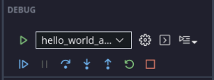

===========================================================================================
Debugging Standalone Applications with the Vitis Unified Software Platform
===========================================================================================

Although a simple “Hello World” application does not require much debugging, this chapter demonstrates the debugging setup and procedure in the Vitis Unified IDE in :ref:`example-3-debugging-standalone-software-using-the-vitis-software-platform`.

The Vitis software platform debugger provides the following debug
capabilities:

-  Debugging of programs on MicroBlaze |trade| and Arm Cortex |trade|-A9 processor architectures (heterogeneous multi-processor hardware system debugging)
-  Debugging of programs on hardware boards
-  Debugging on remote hardware systems
-  A feature-rich integrated design environment (IDE) to debug programs
-  A Tool Command Language (Tcl) interface for running test scripts and automation

The Vitis debugger enables you to see what is happening to a program while it executes. You can set breakpoints or watch points to stop the processor, step through program execution, view the program variables and stack, and view the contents of the memory in the system.

The Vitis software platform supports debugging through Vitis Unified System Debugger and GNU Debugger (GDB).

.. note:: The GDB flow is deprecated and might not be available in the future releases.

Vitis Unified System Debugger
-------------------------------------

The Vitis Unified System Debugger uses the Vitis hw_server as the underlying debug engine. The Vitis software platform translates each user interface action into a sequence of Target Communication Framework (TCF) commands. It then processes the output from System Debugger to display the current state of the program being debugged. It communicates to the processor on the hardware using Vitis hw_server.

The debug workflow is described in the following figure.

.. image:: ./media/Drawing1.png

The workflow is made up of the following components:

-  **Executable ELF File:** To debug your application, you must use an Executable and Linkable Format (ELF) file compiled for debugging. The debug ELF file contains additional debug information for the debugger to make direct associations between the source code and the binaries generated from that original source. In the Vitis Unified IDE, you can opt to Debug or Run, both functionalities contain the same compile options. However, in **Run** mode, the debugger will not be activated, and no Breakpoints will be hit. Highlight your application under FLOW, select Build and click the hammer icon.

-  **Launch Configuration:** To launch the debug session, you must create a Launch Configuration in the Vitis IDE. This configuration captures the options required to start a debug session, including the executable name, processor target to debug, and other information. To create a Launch Configuration, click on the open settings icon for either Debug or Run under FLOW and select **New Launch Configuration**.

-  **Debug View:** Using the Debug View, you can manage the debugging or running of a program in the Vitis IDE. You can control the execution of your program by setting breakpoints, suspending launched programs, stepping through your code, and examining the contents of variables. Select **Debug**, to launch the Debug View from a Launch Configuration. You can also quickly switch to the Debug View using the Debug icon on the left hand side of the Vitis IDE.

You can repeat the cycle of modifying the code, building the executable, and debugging the program in the Vitis software platform.

.. note:: If you edit the source after compiling, the line numbering will be out of step because the debug information is tied directly to the source. Similarly, debugging optimized binaries can also cause unexpected jumps in the execution trace.

.. _example-3-debugging-standalone-software-using-the-vitis-software-platform:

Example 3: Debugging Standalone Software Using the Vitis Software Platform
--------------------------------------------------------------------------

Setup Target Connections
~~~~~~~~~~~~~~~~~~~~~~~~~~~~~~~~~~~~~~~~~~~~~~~~~~

A target connection is established for the localhost (127.0.0.1) at port 3121, by default. However, if you opt for a remote connection, you need to set up the target connection for the Launch Configuration later in this tutorial. 

To view the target connections, go to **Vitis → Target Connections**. 

.. image:: ./media/new_target.PNG

Right click on the **Hardware Server** and select **New Target** and add your connection details.

.. image:: ./media/target_details.PNG

In this example, you will walk through debugging the “Hello World” application created in Example 2 in the :doc:`previous chapter <./2-using-zynq>`.

Input and Output Files
~~~~~~~~~~~~~~~~~~~~~~

-  Input files: Vitis workspace from Example 2
-  Output files: N/A

Debugging Standalone Applications in the Vitis IDE
~~~~~~~~~~~~~~~~~~~~~~~~~~~~~~~~~~~~~~~~~~~~~~~~~~

1. Highlight your application under Vitis Components, click the open settings icon for either **Debug** or **Run** under FLOW, and select **New Launch Configuration**.

   In Target Setup tab, fill the Hardware Platform field with the one exported by the Vivado |trade| Design Suite, and click the **Debug** button.

   .. image:: ./media/image58.png

   The Debug View opens.

   .. note:: You can also quickly switch to the Debug View using the Debug icon on the left hand side of the Vitis IDE.

   .. image:: ./media/image59.png

   .. note:: The addresses shown on this page might differ slightly from the addresses shown on your system.

   The processor is currently sitting at the beginning of ``main()``. You can confirm this information in the Disassembly view, which shows the assembly-level program execution also suspended at the same address.

   .. note:: If the Disassembly view is not visible, select **View → Disassembly view**.

2. The helloworld.c window also shows execution suspended at the first executable line of C code.

   .. note:: If the Registers view is not visible, select **View → Register Inspector** or Select **Register Inspector** from the icon on the right side of the IDE.

3. Double-click in the margin of the helloworld.c window next to the line of code that reads ``init_platform()`` and ``print()``. This sets the breakpoints at ``init_platform()`` and ``print()``. To confirm the breakpoints, review the Breakpoints view.

4. Select **Run → Step Into** to step into the ``init_platform()`` routine.

   The program executes one step. The call stack is now two levels deep.

5. Select **Run → Resume** to continue running the program to the breakpoint.

   Program execution stops at the line of code that includes the print command.

   .. note:: The execution address in your debugging window might differ if you modify the “Hello World” source code in any way.

6. Select **Run → Resume** to run the program to conclusion.

   When the program completes, the Terminal view shows the Hello World print and the Debug view shows that the program is suspended in a routine called ``exit()``. This happens when you are running under control of the debugger.

7. Rerun your code several times. Experiment with single-stepping, examining memory, breakpoints, modifying code, and adding print statements. Try adding and moving views.

8. Click the **Stop** button on the tool bar to disconnect to the board, or exit the Vitis software platform directly.

This chapter introduced standalone software building and debugging. In the :doc:`next chapter <./4-linux-for-zynq>`, you can start working on Linux applications for Zynq 7000 SoCs.

.. include:: ../docs/substitutions.txt

.. Copyright © 2020–2024 Advanced Micro Devices, Inc

.. `Terms and Conditions <https://www.amd.com/en/corporate/copyright>`_.