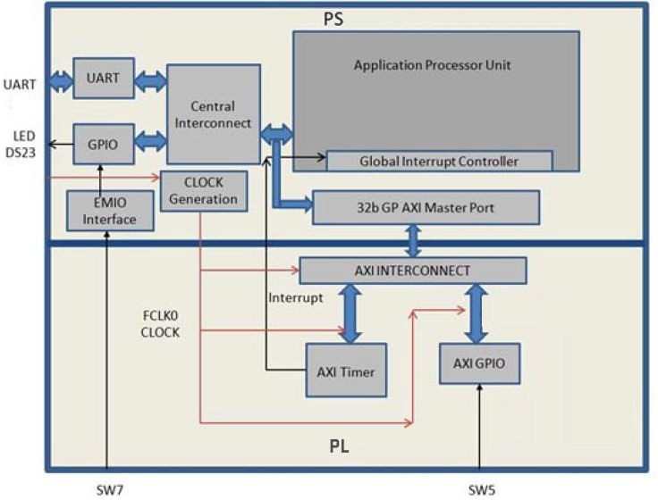

=================================
Using the GP Port in Zynq Devices
=================================

One of the unique features of using the AMD |trade| Zynq |reg| 7000 SoC as an embedded design platform is in using the Zynq SoC processing system (PS) for its Arm |trade| Cortex-A9 dual core processing system as well as the programmable logic (PL) available on it.

In this chapter, you will create a design with:

-  An AXI GPIO block and AXI Timer block instantiated in the fabric (PL). The interrupt signals of AXI Timer will be connected to the PS.
-  A Zynq SoC PS GPIO pin connected to the fabric (PL) side pin using the EMIO interface.

The flow of this chapter is similar to that in :doc:`Using the Zynq SoC Processing System <2-using-zynq>` and uses the Zynq device as a base hardware design. It is assumed that you understand the concepts discussed in :doc:`Using the Zynq SoC Processing System <./2-using-zynq>` regarding adding the Zynq device into a Vivado IP integrator block diagram design.

Adding IP in PL to the Zynq SoC Processing System
-------------------------------------------------

There is no restriction on the complexity of an intellectual property (IP) that can be added in fabric to be tightly coupled with the Zynq |trade| SoC PS. This section covers a simple example with an AXI GPIO, an AXI Timer with interrupt, and a PS section GPIO pin connected to a PL side pin using the EMIO interface. The block diagram for the system is as shown in the following figure.

   Target design block diagram

You can use the system created in :doc:`Using the Zynq SoC Processing System <2-using-zynq>` and continue with the following examples.

In the examples provided within this chapter, we will expand on the design with the following design changes:

-  The fabric-side AXI GPIO is assigned a 1-bit channel width and is connected to the **SW5** push-button switch on the ZC702 board.

-  The PS GPIO ports are modified to include a 1-bit interface that routes a fabric pin (using the EMIO interface) to the **SW7** push-button switch on the board.

-  In the PS section, another 1-bit GPIO is connected to the **DS23** LED on the board, which is on the MIO port.

-  The AXI timer interrupt is connected from the fabric to the PS section interrupt controller. The timer starts when you press any of the selected push buttons on the board. After the timer expires, the timer interrupt is triggered.

-  Along with making the above hardware changes, you will write the application software code. The code will function as follows:

   -  A message appears in the serial terminal and asks you to select the push button switch to use on the board (either **SW7** or **SW5**).

   -  When the appropriate button is pressed, the timer automatically starts, switches LED **DS23** OFF, and waits for the timer interrupt to happen.

   -  After the timer interrupt, LED **DS23** switches ON and execution starts again and waits for you to select the push button switch in the serial terminal again.

.. _example-6-adding-peripheral-pl-ip:

Example 6: Adding Peripheral PL IP
----------------------------------

Input and Output Files
~~~~~~~~~~~~~~~~~~~~~~

-  Input Files:

   -  Vivado project from Example 1 in :doc:`Using the Zynq SoC Processing System <2-using-zynq>`
   -  Vitis workspace in Example 2 in :doc:`Using the Zynq SoC Processing System <2-using-zynq>`

-  Output Files:

   -  Updated hardware handoff ``system_wrapper.xsa``
   -  ``hello_pl.elf``

Update Vivado Design Diagram
~~~~~~~~~~~~~~~~~~~~~~~~~~~~

In this example, you will add the AXI GPIO, AXI Timer, the interrupt instantiated in the fabric, and the EMIO interface. You will then validate the fabric additions.

1. Open the Vivado design created in :ref:`example-1-creating-a-new-embedded-project-with-zynq-soc`:

   1. Launch the AMD Vivado |trade| IDE.
   2. Under the Recent Projects column, click the **edt_zc702** design that you created in :ref:`example-1-creating-a-new-embedded-project-with-zynq-soc`.
   3. In Flow Navigator window, click **Open Block Design** under **IP Integrator**.

2. Add the AXI GPIO and AXI Timer IP:

   1. In the Diagram window, right-click in the blank space and select **Add IP**.
   2. In the search box, type AXI GPIO and double-click the **AXI GPIO** IP to add it to the block design. The AXI GPIO IP block appears in the Diagram window.
   3. In the Diagram window, right-click in the blank space and select **Add IP**.
   4. In the search box, type AXI Timer and double-click the **AXI Timer** IP to add it to the block design. The AXI Timer IP block appears in the Diagram view.

3. Enable the ZYNQ7 Processing System EMIO GPIO:

   1. Double-click the **ZYNQ7 Processing System** IP block.

      The Re-customize IP dialog box opens, as shown in the following figure.

      .. figure:: ./media/image39.jpeg
         :alt: Recustomize ZYNQ7 PS 5.5

         Recustomize ZYNQ7 PS 5.5

   2. Click **MIO Configuration**.
   3. Expand **I/O Peripherals→ GPIO** and enable the **EMIO GPIO (Width)** check box.
   4. Change the **EMIO GPIO (Width)** to **1**.

4. Enable the ZYNQ7 Processing System interrupt:

   1. Navigate to **Interrupts → Fabric Interrupts → PL-PS Interrupt Ports**.
   2. Check the **Fabric Interrupts** box to enable PL to PS interrupts.
   3. Check **IRQ_F2P[15:0]** to enable general interrupts. The CoreN_nFIQ signals are used for fast interrupt.
   4. Click **OK** to accept the changes to the ZYNQ7 Processing System IP. The diagram looks like the following figure.

      .. figure:: ./media/image40.png
         :alt: BD with Timer and GPIO

         BD with Timer and GPIO

5. Connect the PL IPs:

   1. Click the **Run Connection Automation** link at the top of the page to automate the connection process for the newly added IP blocks.
   2. In the Run Connection Automation dialog box, select the check box next to **All Automation**, as shown in the following figure.

      .. figure:: ./media/image41.png
         :alt: Connection Automation

         Connection Automation

   3. Click **OK**.

      Upon completion, the updated diagram looks like the following figure.

      .. figure:: ./media/image42.png
         :alt: Connected

         Connected

6. Customize the **AXI GPIO** IP block:

   1. Double-click the **AXI GPIO** IP block to customize it.
   2. Under the **Board** page, make sure that both **GPIO** and **GPIO2** are set to **Custom**.
   3. Select the **IP Configuration** page. In the GPIO section, change the **GPIO Width** to **1** because you only need one GPIO port.
   4. Ensure that **All Inputs** and **All Outputs** are both unchecked.
   5. Click **OK** to accept the changes.

7. Connect interrupt signals:

   -  Notice that the Interrupt port is not automatically connected to the AXI Timer IP Core. In the Block Diagram view, locate the **IRQ_F2P[0:0]** port on the ZYNQ7 Processing System.
   -  Scroll your mouse over the connector port until the pencil button appears, then click the **IRQ_F2P[0:0]** port and drag to the **interrupt** output port on the **axi_timer_0** to make a connection between the two ports.

8. Make the PS GPIO port external:

   -  Notice that the ZYNQ7 Processing System GPIO_0 port is not connected. Right-click the **GPIO_0** output port on the **ZYNQ7 Processing System** and select **Make External**.

   The pins are external but do not have the required constraints for our board. To constrain your hardware pins to specific device locations, follow the steps below. These steps can be used for any manual pin placements.

Assigning Location Constraints to External Pins
~~~~~~~~~~~~~~~~~~~~~~~~~~~~~~~~~~~~~~~~~~~~~~~

1. Click **Open Elaborated Design** under RTL Analysis in the Flow Navigator view.

   .. figure:: ./media/image43.png
      :alt: Open Elaborated Design

      Open Elaborated Design

   -  Click **OK** on the pop-up message.

      .. tip:: The design might take a few minutes to elaborate. If you want to do something else in Vivado while the design elaborates, you can click the **Background** button to have Vivado continue running the process in the background.

2. Select **I/O Planning** from the dropdown menu, as shown in the following figure, to display the **I/O Ports** window.

   .. figure:: ./media/image45.jpeg
      :alt: IO Planning Drop Down menu

      IO Planning Drop Down menu

3. Under the I/O Ports window at the bottom of the Vivado window (as seen in the following figure), expand the **GPIO_0_0\_** and **gpio_sw\_** ports to check the site (pin) map.

   .. image:: ./media/image47.png

4. Find **GPIO_0_0_tri_io[0]** and set the following properties, shown in the following figure:

   -  Package Pin = F19
   -  I/O Std = LVCMOS25

5. Find **gpio_sw_tri_io[0]** and set the following properties, shown in the following figure:

   -  Package Pin = G19
   -  I/O Std = LVCMOS25

   .. figure:: ./media/image48.png
      :alt: Pin Assigned

      Pin Assigned

   .. note:: For additional information about creating other design constraints, refer to the *Vivado Design Suite User Guide: Using Constraints* (`UG903 <https://docs.amd.com/access/sources/dita/map?Doc_Version=2023.2%20English&url=ug903-vivado-using-constraints>`_).

6. In the Flow Navigator, under Program and Debug, select **Generate Bitstream**.

   1. The Save Constraints window opens.
   2. Input a file name, such as **constraints**.
   3. Keep File Type = **XDC** and File Location = ``****``.
   4. Click **OK**.
   5. Click **OK** to launch synthesis, implementation first.
   6. In the Launch Runs window, keep launch runs on the local host and click **OK**.

      A constraints file is created and saved under the `Constraints` folder on the **Hierarchy** view of the **Sources** window.

      .. image:: ./media/image50.png
      
   7. After bitstream generation completes, click cancel in the pop-up window.

7. Export the hardware using **File→ Export → Export Hardware**. Use the information in the table below to make selections in each of the wizard screens. Click **Next** where necessary.

   +---------------------------+-----------------+-------------------------------+
   | Screen                    | System Property | Setting or Command to Use     |
   +===========================+=================+===============================+
   | Export Hardware Platform  |                 |                               |
   +---------------------------+-----------------+-------------------------------+
   | Output                    |                 | Select **Include bitstream**. |
   +---------------------------+-----------------+-------------------------------+
   | Files                     |   XSA Filename  |  Leave as system_wrapper.     |
   +---------------------------+-----------------+-------------------------------+
   |                           |   Export to     |  Leave as C:/edt/edt_zc702.   |
   +---------------------------+-----------------+-------------------------------+

   .. note:: If a pop-up appears saying the module is already exported, click **Yes** to overwrite the file.

   -  Click **Finish**.

   The exported file is located at ``C:/edt/edt_zc702/system_wrapper.xsa``.

Updating Hardware in the Vitis Software Platform
~~~~~~~~~~~~~~~~~~~~~~~~~~~~~~~~~~~~~~~~~~~~~~~~

Open the Vitis Unified IDE and manually update the exported hardware from
Vivado.

1.  Click **edt_zc702** → **Settings** → **vitis-comp.json**. 

   .. figure:: ./media/image52.png
      :alt: Switch XSA

      Switch XSA

2. In the **Switch XSA** view, browse for the exported XSA file (``C:/edt/edt_zc702/system_wrapper.xsa``) from Vivado and click **OK**.

3. Select the **Hardware Specification** using the same window, and you will be able to see the updated IP.

4. Rebuild the out-of-date platform project.

   -  Highlight the Platform Component and under **FLOW** select the hammer icon to build.

Testing the PL IP with Prepared Software
~~~~~~~~~~~~~~~~~~~~~~~~~~~~~~~~~~~~~~~~

1. Create a new standalone application for Arm Cortex-A9:

   -  Select **File → New Component → Application Project**.
   -  Give the Application Name: **hello_pl** and click **Next**.
   -  Select the **edt_zc702** and click **Next**.
   -  Choose the default domain in the Platform and click **Next**.
   -  Click **Finish**. The Vitis Unified IDE creates an empty application template called **hello_pl**.

2. Import the provided source file to hello_pl project:

   -  In Vitis Components view, go to **hello_pl → Sources** and right-click **src** and select **Import → files**.
   -  Point to the **ref_files/example6** directory of this repository.
   -  Select **hello_pl.c**.
   -  Click **Finish**.

3. Build the hello_pl project:

   - Highlight the **hello_pl** Application Component and under **FLOW** select the hammer icon to build.

4. Connect the USB cable for JTAG and serial.

5. Open your preferred serial communication utility with baud rate set to **115200**. In this example, we used MobaXterm.

   .. note:: This is the baud rate that the UART is programmed to on Zynq devices.

6. Change boot mode back to JTAG mode (as in :ref:`setting-up-the-board`).

   - Set **SW16** to 00000.

7. Run the project similar to the steps in :ref:`running-the-hello-world-application-on-a-zc702-board`.

   - Highlight the *hello_pl* Application Component and under **FLOW** select **Run**, and click **Open Settings** to launch the **Launch Configuration**.
   - Check the Target Connection is correct for your host to target board connection, and click **Run** icon.

    .. figure:: ./media/image56.png
       :alt: Run Configuration

       Run Configuration

Because you updated the hardware specification with the XSA that includes a post-implementation bitstream, the launch configuration sets the bitstream file automatically. If your XSA file does not contain a bitstream, click the **Browse** button to point to your bitstream. 

**Note** There are two ways to configure the ps7 susbsystem with the settings made in Vivado; using the FSBL or the ps7_init.tcl. When users export the XSA file, this will contain (amongst other files) the ps7_init.c/.h and the ps7_init.tcl. The ps7_init.tcl is a script that will have all the register writes to configure the ps7 subsystem over the debugger. The FSBL will use the ps7_init.c/.h files. Since the debugger will do the register writes sequentially, this could take a long time. The fsbl is deployed on the target, so this is quicker. Therefore, I would recommend using the FSBL.

**Note** When using the FSBL to configure the ps7 susbsystem, the debugger will set a breakpoint on the exit function of the FSBL. The debugger will wait until this breakpoint is hit, or a timeout occurs. If the timeout occurs, then this could mean that the breakpoint was not hit. This could be due to the symbol info not resolved by the debugger. If users are connecting remotely then a **symbol server** in the Target Connections can be used to try resolve this issue.

8. In the system, the AXI GPIO pin is connected to push button **SW5** on the board, and the PS section GPIO pin is connected to push button **SW7** on the board through an EMIO interface.

9. Follow the instructions printed on the serial terminal to run the application. See the following figure for the serial output logs.

    .. figure:: ./media/image57.png
       :alt: UART prints

       UART prints

Hello_PL Standalone Software Details
~~~~~~~~~~~~~~~~~~~~~~~~~~~~~~~~~~~~

The system you designed in this chapter requires application software for the execution on the board. This section describes the details about the application software.

The ``main()`` function in the application software is the entry point for the execution. This function includes initialization and the required settings for all peripherals connected in the system. It also has a selection procedure for the execution of the different use cases, such as AXI GPIO and PS GPIO using EMIO interface. You can select different use cases by following the instructions on the serial terminal.

The application software is programmed to accomplish the following
steps:

1. Initialize the AXI GPIO module.

2. Set a direction control for the AXI GPIO pin as an input pin, which is connected with the **SW5** push button on the board. The location is fixed by a LOC constraint in the user constraint file (XDC) during system creation.

3. Initialize the AXI Timer module with device ID 0.

4. Associate a timer callback function with AXI Timer ISR.

   This function is called every time the timer interrupt happens. This callback switches on the LED **DS23** on the board and sets the interrupt flag.

   The ``main()`` function uses the interrupt flag to halt execution, waits for timer interrupt to happen, and then restarts the execution.

5. Set the reset value of the timer, which is loaded to the timer during reset and timer starts.

6. Set timer options such as Interrupt mode and Auto Reload mode.

7. Initialize the PS section GPIO.

8. Set the PS section GPIO, channel 0, pin number 10 to the output pin, which is mapped to the MIO pin and physically connected to the LED **DS23** on the board.

9. Set PS Section GPIO channel number 2, pin number 0, to an input pin, which is mapped to PL side pin using the EMIO interface, and is physically connected to the **SW7** push button switch.

10. Initialize the snoop control unit global interrupt controller. Register the timer interrupt routine to interrupt ID **91**, register the exceptional handler, and enable the interrupt.

11. Execute a sequence in the loop to select between the AXI GPIO or PS GPIO use case using the serial terminal.

    The software accepts your selection from the serial terminal and executes the procedure accordingly. After the selection of the use case through the serial terminal, you must press a push button on the board as per the instruction on the terminal. This action switches off the LED DS23, starts the timer, and tells the function to wait infinitely for the timer interrupt to happen. After the timer interrupt happens, LED DS23 switches ON and restarts execution.

See the :doc:`next chapter <./6-using-hp-port>` for information about using the AXI HP (High Performance) slave port with the AXI Central DMA IP.

.. include:: ../docs/substitutions.txt

.. Copyright © 2020–2024 Advanced Micro Devices, Inc

.. `Terms and Conditions <https://www.amd.com/en/corporate/copyright>`_.