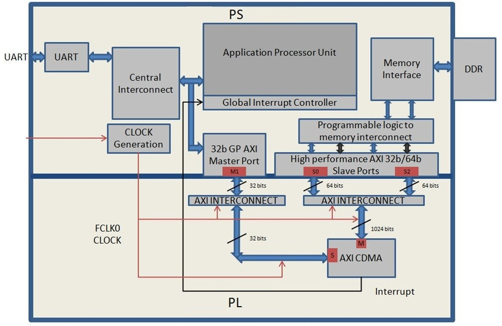

==========================================
Using the HP Slave Port with AXI CDMA IP
==========================================

In this chapter, you will instantiate AXI CDMA (Central DMA) IP in fabric and integrate it with the processing system high performance (HP) 64-bit slave port. In this system, a AXI CDMA instance acts as a master device to copy an array of the data from the source buffer location to the destination buffer location in the DDR system memory. The AXI CDMA uses the processing system HP slave port to get read/write access to the DDR system memory.

You will write standalone application software and Linux OS based application software using mmap() for the data transfer using the AXI CDMA block. You will also execute both standalone and Linux-based application software separately on the ZC702 board.

Integrating AXI CDMA with the Zynq SoC PS HP Slave Port
-------------------------------------------------------

AMD Zynq |trade| 7000 SoC devices internally provide four high performance (HP) AXI slave interface ports that connect the programmable logic (PL) to asynchronous FIFO interface (AFI) blocks in the processing system (PS). The HP ports enable a high throughput data path between AXI masters in the programmable logic and the processing system’s memory system (DDR and on- chip memory). HP slave ports are configurable to 64-bit or 32-bit interfaces.

In this section, you will create a design using AXI CDMA intellectual property (IP) as master in fabric and integrate it with the PS HP 64 bit slave port. The block diagram for the system is as shown in the following figure.

This system covers the following connections:

-  The AXI CDMA slave port is connected to the PS general purpose master port 1 (``M_AXI_GP1``). It is used by the PS CPU to configure the AXI CDMA register set for the data transfer and also to check the status.

-  The AXI CDMA master port is connected to the PS high performance slave port 0 (``S_AXI_HP0``). It is used by the AXI CDMA to read from the DDR system memory. It acts as the source buffer location for the CDMA during data transfer.

-  The AXI CDMA master port is connected to the PS high performance slave port 2 (``S_AXI_HP2``). It is used by the AXI CDMA to write the data to the DDR system memory. It acts as a destination buffer location for the CDMA during the Data transfer.

-  The AXI CDMA interrupt is connected from the fabric to the PS section interrupt controller. After data transfer or errors during data transaction, the AXI CDMA interrupt is triggered.

In this system, you will configure the HP slave port 0 to access a DDR memory location range from 0x20000000 to 0x2fffffff. This DDR system memory location acts as the source buffer location to CDMA for reading the data.

You will also configure HP slave port 2 to access a DDR memory location range from 0x30000000 to 0x3fffffff. This DDR system memory location acts as a destination location to CDMA for writing the data.

You will also configure the AXI CDMA IP data width of the data transfer channel to 1024 bits with the maximum burst length set to 32. With this setting, the CDMA maximum transfer size is set to 1024x32 bits in one transaction.

You will write the application software code for the above system. When you execute the code, it first initializes the source buffer memory with the specified data pattern and also clears the destination buffer memory by writing all zeroes to the memory location. It then starts configuring the CDMA register for the DMA transfer. It writes the source buffer location, destination buffer location, and number of bytes to be transferred to the CDMA registers and waits for the CDMA interrupt. When the interrupt occurs, it checks the status of the DMA transfers.

If the data transfer status is successful, it compares the source buffer data with the destination buffer data and displays the comparison result on the serial terminal.

If the data transfer status is an error, it displays the error status on the serial terminal and stops execution.

Example 7: Integrating AXI CDMA with the PS HP Slave Port
---------------------------------------------------------

Input and Output Files
~~~~~~~~~~~~~~~~~~~~~~

-  Input files:

   -  Vivado design from :ref:`example-6-adding-peripheral-pl-ip`
   -  Vitis workspace

-  Output files:

   -  Updated Vivado design and exported hardware handoff ``system_wrapper.xsa``
   -  ``cdma_app.elf`` to control and test the AXI CDMA IP

Update the Vivado Design
~~~~~~~~~~~~~~~~~~~~~~~~

1. Start with the system you created in :ref:`example-6-adding-peripheral-pl-ip`.

   1. Open the Vivado |reg| design from :ref:`example-6-adding-peripheral-pl-ip`.
   2. Open the block design from Flow Navigator **Open Block Design**.

2. Add the CDMA IP:

   1. In the Diagram window, right-click in the blank space and select **Add IP**.
   2. In the search box, type “CDMA” and double-click the **AXI Central Direct Memory Access** IP to add it to the block design. The AXI Central Direct Memory Access IP block appears in the Diagram view.

3. Add the **Contact** IP to concatenate the interrupt signals:

   1. In the Diagram window, right-click in the blank space and select **Add IP**.

   2. In the search box type “concat” and double-click the **Concat** IP to add it to the block design. The Concat IP block appears in the Diagram window. This block is used to concatenate the two interrupt signals if you are using the prior design with the AXI Timer.

   3. Right-click the net from the interrupt port to the **IRQ_F2P[0:0]** port and select **Delete**.

   4. Click the **IRQ_F2P[0:0]** port and drag to the **dout[1:0]** output port on the **Concat** IP core to make a connection between the two ports.

   5. Click the **interrupt** port on the AXI Timer IP core and drag to the **In0[0:0]** input port on the Concat IP core to make a connection between the two ports.

   6. Click the **cdma_introut** port on the AXI CDMA IP core and drag to the **In1[0:0]** input port on the Concat IP core to make a connection between the two ports.

4. Customize the PS to enable the **AXI HP0** and **AXI HP2** interface:

   1. Right-click the **ZYNQ7 Processing System** core and select **Customize Block**.

   2. Select **PS-PL Configuration** and expand the **HP Slave AXI Interface**.

   3. Select the checkbox for **S AXI HP0 interface** and for **S AXI HP2 interface**.

   4. Click **OK** to accept the changes.

5. Customize the CDMA IP:

   1. Right-click the **AXI CDMA IP** core and select **Customize Block**.
   2. Set the block settings in the Re-customize IP wizard page as follows:

      +---------------------------------+-----------------------------+
      |  System Property                | Setting or Command to Use   |
      +=================================+=============================+
      | Enable Scatter Gather           | Unchecked                   |
      +---------------------------------+-----------------------------+
      | Disable 4K Boundary Checks      | Unchecked                   |
      +---------------------------------+-----------------------------+
      | Allow Unaligned Transfers       | Unchecked                   |
      +---------------------------------+-----------------------------+
      | Write/Read Data Width           | 1024                        |
      +---------------------------------+-----------------------------+
      | Write/Read Burst Size           | 32                          |
      +---------------------------------+-----------------------------+
      | Enable Asynchronous Mode (Auto) | Unchecked                   |
      +---------------------------------+-----------------------------+
      | Enable CDMA Store and Forward   | Unchecked                   |
      +---------------------------------+-----------------------------+
      | Address Width                   | 32                          |
      +---------------------------------+-----------------------------+

   3. Click **OK** to accept the changes.

6. Connect the blocks

   1. Click the **Run Connection Automation** link in the Diagram window to automate the remaining connections.

   2. In the Run Connection Automation dialog box make sure the **All Automation** box is checked, then click **OK** to accept the default connections. The finished diagram should look like the following figure.

      .. figure:: ./media/image62.png
         :alt: block diagram

      .. note:: You might receive a critical warning message regarding forcibly mapping a net into a conflicting address. Address the error by manually updating the memory mapped address in the next steps. Click **OK** if you see the error message.

7. Assign the address manually. In most cases, Vivado connection automation can set up the address correctly. In the current use case, it is confused by the physical connection because HP0 and HP2 now cover the same address range. Resolve this issue by making sure that the address range of these two ports does not overlap.

   1. Select the **Address Editor** window.

      .. image:: ./media/image63.png

   2. In the Address Editor window, expand **axi_cdma_0 → axi_cdma_0/Data**. Right-click **HP2_DDR_LOWOCM** and select **Unassign**.

   3. In the Range column for **S_AXI_HP0**, select **256M**.

   4. Under Offset Address for **S_AXI_HP0**, set a value of **0x2000_0000**.

   5. In the Address Editor window, expand **axi_cdma_0 → axi_cdma_0/Data → Unassigned**. Right-click **HP2_DDR_LOWOCM** and select **Assign**.

   6. In the Range column for **S_AXI_HP2**, select **256M**.

   7. Under Offset Address for **S_AXI_HP2**, set a value of **0x3000_0000**.

      .. figure:: ./media/image64.png
         :alt: Final Address Settings

8. Generate the bitstream:

   1. In the Flow Navigator, select **Generate Bitstream** under **PROGRAM AND DEBUG**. The Save Project dialog box opens.
   2. Ensure that the **Block Design - system** check box is selected, then click **Save**.
  
      A message might appear that states synthesis is out of date. If it does, click **Yes**.

9. Export the hardware after bitstream generation completes by clicking **File → Export → Export Hardware**.

   .. note:: Make sure to select **Include bitstream** instead of **Pre-synthesis** on the Output page of the Export Hardware Platform wizard.

Designing Standalone Application Software for the Design
~~~~~~~~~~~~~~~~~~~~~~~~~~~~~~~~~~~~~~~~~~~~~~~~~~~~~~~~

The CDMA-based system that you designed in this chapter requires application software to execute on the board. This section describes the details of this software.

The ``main()`` function in the application software is the entry point for the execution. It initializes the source memory buffer with the specified test pattern and clears the destination memory buffer by writing all zeroes.

The application software then configures the CDMA register sets by providing information such as source buffer and destination buffer
starting locations. To initiate DMA transfer, it writes the number of bytes to be transferred in the CDMA register and waits for the CDMA interrupt to happen. After the interrupt, it checks the status of the DMA transfer and compares the source buffer with the destination buffer. Finally, it prints the comparison result in the serial terminal and stops running.

Application Software Programming Model
~~~~~~~~~~~~~~~~~~~~~~~~~~~~~~~~~~~~~~

The application software does the following tasks:

1. Initializes the source buffer with the specified test pattern. The source buffer location ranges from 0x20000000 to 0x2fffffff.

   Clears the destination buffer by writing all zeroes into the destination address range. The destination buffer location ranges from 0x30000000 to 0x3fffffff.

2. Initializes the AXI CDMA IP and does the following:

   a. Associates a CDMA callback function with AXI CDMA ISR and enables the interrupt.

      This callback function executes during the CDMA interrupt. It sets the interrupt done and/or error flags depending on the DMA
      transfer status.

      Application software waits for the callback function to populate these flags and executes the software according to the status
      flag.

   b. Configures the CDMA in simple mode.

   c. Checks the status register of the CDMA IP to verify the CDMA idle status.

   d. Sets the source buffer starting location, 0x20000000, to the CDMA register.

   e. Sets the destination buffer starting location, 0x30000000, to the CDMA register.

   f. Sets the number of bytes to transfer to the CDMA register. The application software starts the DMA transfer.

3. After the CDMA interrupt is triggered, the DMA transfer is checked status.

   If the transfer status is successful, the application software compares the source buffer location with the destination buffer location and displays the comparison result on the serial terminal, and then exits from the execution.

   If the transfer status displays an error, the software prints the error status in the serial terminal and stops running.

Creating the Standalone CDMA Application
~~~~~~~~~~~~~~~~~~~~~~~~~~~~~~~~~~~~~~~~

1. Launch the Vitis Unified IDE and open the workspace you worked on before.

2. Update the hardware specification:

   1. Select the **zc702_edt** platform Component, and select **Settings** and click on **vitis-comp.json**.
   2. Select **Switch XSA** and browse to the updated XSA above..

**Note:** Users can verify that the platform has updated by selecting the **Hardware Specification** and verify that the CDMA driver is present

3. Select **File → New Component → Application Project**.

   The Create Application Component wizard opens. Use the information in the table below to make your selections in the wizard screens.

   +----------------------+----------------------+---------------------------+
   | Screen               | System Property      | Setting or Command        |
   |                      |                      | to Use                    |
   +======================+======================+===========================+
   | Name and Location    | Name                 | cdma_app                  |
   |                      | Location             | default                   |
   +----------------------+----------------------+---------------------------+
   | Select Platform      | Name                 | zc702_edt                 |
   +----------------------+----------------------+---------------------------+
   | Select Domain        | Name                 | standalone_ps7_cortex9_0  |
   +----------------------+----------------------+---------------------------+

   Click **Finish**. The New Application Project wizard closes and the Vitis software platform creates the cdma_app application component
   under the Vitis Components view.

4. In the Vitis Components view, expand the **cdma_app** component, right-click the **src** directory, and select **Import** → *Files* to open the Import Sources dialog box.

5. In the Import Sources dialog box, click the **Browse** button next to the **From directory** field and specify the design files folder to `ref_files/example7 <https://github.com/Xilinx/Embedded-Design-Tutorials/tree/master/docs/Introduction/Zynq7000-EDT/ref_files/example7>`_.

6. Select the **cdma_app.c** file and click **Finish**.

7. Build the CDMA application component by clicking the hammer button on the **cdma_app** under **FLOWS**.

Running CDMA the App on ZC702
~~~~~~~~~~~~~~~~~~~~~~~~~~~~~

1. Open the serial communication utility with baud rate set to **115200**.

   .. note:: This is the baud rate that the UART is programmed to on Zynq devices.

2. Make sure that the boot mode of the board is set to JTAG and power on.

   .. note:: Refer to :ref:`setting-up-the-board` for information about setting up the board.

3. Run the project by right-clicking **cdma_app** and selecting **Run as → Run on Hardware**

4. Check the status of the CDMA transfer in the serial terminal. If the transfer is successful, the message “DMA Transfer is Successful displays. Otherwise, the serial terminal displays an error message.

   The expected result on the serial console is as follows:

   .. code-block::

      --- Entering main() ---
      Start Transfer

      --- Transfer Done ---
      Start Transfer

      --- Transfer Done ---
      XAxiCdma_Interrupt: Passed
      DMA Transfer is Successful

Up until now, the examples you have been working with have all been developed and debugged in a lab environment. JTAG is required to configure and control the applications. How can you deploy applications to the board so that it can run the applications after booting by itself? See the :doc:`next chapter <./7-linux-booting-debug>` for Linux boot image configuration.

.. include:: ../docs/substitutions.txt

.. Copyright © 2020–2024 Advanced Micro Devices, Inc

.. `Terms and Conditions <https://www.amd.com/en/corporate/copyright>`_.