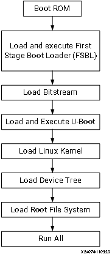

==============================
Linux Boot Image Configuration
==============================

In previous chapters, you used SD boot mode for all Linux examples. SD boot mode is easy to use for development. Sometimes it is necessary to change the boot source to QSPI Flash for its reliability and anti-vibration. In the board bring-up development phase, because the peripherals might not be available yet, boot with JTAG is a common technique for debugging. This chapter describes the detailed steps of these use cases.

Boot Methods
------------

The boot method of Zynq |trade| 7000 devices can be categorized into these two groups:

-  Master boot method
-  Slave boot method

Master Boot Method
~~~~~~~~~~~~~~~~~~

In the master boot method, the CPU loads and executes the external boot images from non-volatile memory into the processor system (PS). Different kinds of non-volatile memories such as QSPI, NAND, NOR flash, and SD cards are used to store boot images. In this method, the master boot method is further divided into secure and non-secure modes. Refer to the *Zynq 7000 SoC Technical Reference Manual* (`UG585 <https://www.xilinx.com/cgi-bin/docs/ndoc?t=user_guides;d=ug585-Zynq-7000-TRM.pdf>`_) for more details.

The boot process is initiated by one of the Arm |reg| Cortex |trade|-A9 CPUs in the processing system (PS) and it executes on-chip ROM code. The on-chip ROM code is responsible for loading the first stage boot loader (FSBL). The FSBL does the following:

-  Configures the FPGA with the hardware bitstream (if it exists)
-  Configures the MIO interface
-  Initializes the DDR controller
-  Initializes the clock PLL
-  Loads and executes the Linux U-Boot image from non-volatile memory to DDR memory

The U-Boot loads and starts the execution of the kernel image, the root file system, and the device tree from non-volatile RAM to DDR. It
finishes booting Linux on the target platform.

Slave Boot Method
~~~~~~~~~~~~~~~~~

JTAG can only be used in slave boot mode. An external host computer acts as the master to load the boot components into the OCM, DDR memory, or FPGA using a JTAG connection.

.. note:: The PS CPU remains in idle mode while the boot image loads. The slave boot method is always a non-secure mode of booting.

In JTAG boot mode, the CPU enters halt mode immediately after it disables access to all security related items and enables the JTAG port.
You must download the boot images into the DDR memory before restarting the CPU for execution.

Booting Linux from JTAG
~~~~~~~~~~~~~~~~~~~~~~~

The flowchart in the following figure describes the process used to boot Linux on the target platform.

This chapter will give you several examples with different boot mode configuration.

-  Example 9: Booting Linux with JTAG (Slave boot mode, non-secure)
-  Example 10: Booting Linux from QSPI Flash (Master boot mode, non-secure)

Example 9: Booting Linux with JTAG
----------------------------------

This section covers the flow for booting Linux on the target board using the pre-compiled images with JTAG.

Input and Output Files
~~~~~~~~~~~~~~~~~~~~~~

-  Input files: the files generated by PetaLinux in :ref:`example-4-creating-linux-images` or :ref:`example-5-creating-a-hello-world-application-for-linux-in-the-vitis-ide`.:

   -  `zynq_fsbl.elf`
   -  `u-boot.elf`
   -  `Image.ub`

-  Output files: N/A

.. _booting-linux-in-jtag-mode:

Booting Linux in JTAG Mode
~~~~~~~~~~~~~~~~~~~~~~~~~~

1. Check the following board connections and settings for Linux booting using JTAG mode:

   - Ensure that the settings of Jumpers J27 and J28 are set as described in :ref:`setting-up-the-board`.

   -  Ensure that the SW16 switch is set to 00000, as shown in the following figure.

      .. figure:: ./media/image67.jpeg
         :alt: JTAG Boot Mode

         JTAG Boot Mode

   -  Connect an Ethernet cable from the Zynq 7000 SoC board to your network or directly to your host machine.

   -  Connect the Windows host machine to your network.

   -  Connect the power cable to the board.

2. Connect a micro USB cable between the Windows host machine and the target board JTAG port with the following **SW10** switch settings as shown in the following figure.

   -  Bit-1 is 0
   -  Bit-2 is 1

   .. note:: 0 = switch is open. 1 = switch is closed. The correct JTAG mode has to be selected, according to the user interface. The JTAG mode is controlled by switch SW10 on the ZC702 and SW4 on the ZC706.

   .. image:: ./media/image68.jpeg

3. Connect a USB cable to connector J17 on the target board with the Windows host machine. This is used for USB to serial transfer.

4. Change Ethernet Jumper J30 and J43 as shown in the following figure.

   .. image:: ./media/image69.jpeg

5. Power on the target board.

6. Launch Vitis IDE with any workspace.

7. If the serial terminal is not open, connect the serial communication utility with the baud rate set to **115200**.

   .. note:: This is the baud rate that the UART is programmed to on Zynq devices.

8. Download the bitstream by selecting **Xilinx → Program FPGA**, then clicking **Program**.

9. Open the Xilinx System Debugger (XSCT) tool by selecting **Xilinx → XSCT Console**.

10. At the XSCT prompt, do the following:

    1. Run ``connect`` to connect with the PS section.
    2. Run ``targets`` to get the list of target processors.
    3. Run ``ta 2`` to select the processor CPU1.

      .. code-block::

            xsct% targets
            1 APU
            2 Arm Cortex-A9 MPCore #0 (Running)
            3 Arm Cortex-A9 MPCore #1 (Running)
            4 xc7z020
            xsct% ta 2
            xsct% targets
            1 APU
            2* Arm Cortex-A9 MPCore #0 (Running)
            3 Arm Cortex-A9 MPCore #1 (Running)
            4 xc7z02022

      .. note:: `ta` is a short command for `target`. XSCT accepts short commands. Enter any numbers of the preceding characters of the XSCT commands. As long as there are no conflicts, they can be recognized by XSCT.

    4.  Change working directory to `images/linux` in your PetaLinux project.

    .. note:: On Windows, the XSCT shell regards the Windows path divider `\` as escape character. Use ``/`` or ``\\`` instead, or add curly brackets ``{}`` for the Windows path name to make sure it is interpreted correctly.

    -  Run `dow zynq_fsbl.elf` to download PetaLinux FSBL.

    -  Run `con` to start execution of FSBL and then run `stop` to stop it.

    -  Run `dow u-boot.elf` to download `U-Boot.elf`.

    -  Run `con` to start execution of U-Boot. On the serial terminal, the auto-boot countdown message appears: ``Hit any key to stop autoboot: 3``.

    -  Press **Enter**. Automatic booting from U-Boot stops and a command prompt appears on the serial terminal.

    -  At the XSCT Prompt, run `stop`. The U-Boot execution stops.

    -  Run `dow -data image.ub 0x30000000` to download the Linux kernel image.

    -  Run `con` to start executing U-Boot.

11. At the command prompt of the serial terminal, run `bootm 0x30000000`. The Linux OS boots.

Booting Linux in JTAG Mode using QEMU
~~~~~~~~~~~~~~~~~~~~~~~~~~~~~~~~~~~~~~~~

Users can boot Linux (or u-Boot) from Petalinux over QEMU. QEMU is helpful for use cases where the hardware is in development or is unavailable for other reasons. 

To boot Linux using QEMU use the command below:

      .. code-block::

            petalinux-boot --qemu --kernel --qemu-args "-net nic,netdev=gem0 -netdev user,id=gem0,hostfwd=tcp:127.0.0.1:1540-10.0.2.15:1534 -net nic"

**Note:** The above command passes the qemu-args to enable GEM0 and uses host forwarding to setup a connection.

Example 10: Booting Linux from QSPI Flash
-----------------------------------------

In this example, you will make a Linux boot image for QSPI Flash, write it into Flash, and let it boot.

QSPI Flash on a board normally has less capacity than an SD card or eMMC because of its relatively high price. It layout should be planned
carefully. The Linux kernel image and rootfs can be stored in the same QSPI as this example, or stored in another non-volatile form of storage such as an SD card, NAND Flash, or eMMC. The only difference is the `BOOT.BIN` packaging contents.

In this example, you will not only package normal boot components, such as FSBL, bitstream, and U-Boot into `BOOT.BIN`, but also the
following:

-  The `boot.scr` file (read by U-Boot)
-  The flat image `image.ub` which contains the Linux kernel
-  The device tree (read by the Linux kernel)
-  rootfs

The normal boot components can be packaged continuously. After the bootROM loads FSBL, FSBL can load bitstream and U-Boot properly and give control to U-Boot.

U-Boot reads `boot.scr` from Flash offset 0x00FC0000 by default. Assign `boot.scr` to this address during packaging.

By default, it is programmed in `boot.scr` that if the boot mode is QSPI, `image.ub` should be read from Flash offset 0x01000000 (16 MB).
However, because ZC702 has only 16 MB QSPI Flash, `boot.scr` needs to be modified to load it from around the 5 MB area. Because the
`petalinux-package` command uses 0x00520000 by default, you can keep using this address.

The following table shows the memory address layout you will create in this example.

+---------------------+---------------------------------+--------+---------------------+
| Partition           | Flash Offset Address            | Size   | DDR Loading Address |
+=====================+=================================+========+=====================+
| FSBL                | 0x0                             | Very   | Address info        |
|                     |                                 | Small  | embedded in ELF     |
+---------------------+---------------------------------+--------+---------------------+
| Bitstream           | Continuous with previous        | 3.9 MB | FSBL loads it as    |
|                     |                                 |        | data                |
+---------------------+---------------------------------+--------+---------------------+
| u-boot              | Continuous with previous        | Very   | Address info        |
|                     | partition                       | Small  | embedded in ELF     |
+---------------------+---------------------------------+--------+---------------------+
| image.ub            | U-Boot loads it from 0x00520000 | 11 MB  | U-Boot loads it to  |
|                     |                                 |        | 0x10000000          |
+---------------------+---------------------------------+--------+---------------------+
| boot.scr            | U-Boot reads it from Flash      | 2 KB   | U-Boot loads it to  |
|                     | offset 0x00FC0000               |        | 0x03000000          |
+---------------------+---------------------------------+--------+---------------------+

.. _input-and-output-files-1:

Input and Output Files
~~~~~~~~~~~~~~~~~~~~~~

-  Input Files: PetaLinux project in :ref:`example-4-creating-linux-images` or :ref:`example-5-creating-a-hello-world-application-for-linux-in-the-vitis-ide`:

   -  `zynq_fsbl.elf`
   -  `u-boot.elf`
   -  `system.dtb`
   -  FPGA bit file: `system.bit` in the PetaLinux image directory or `system_wrapper.bit`` in the Vivado directory
   -  `image.ub`
   -  `boot.scr`

-  Output Files: ``BOOT.BIN`` binary to write to QSPI Flash

Reducing the Root File System Size
~~~~~~~~~~~~~~~~~~~~~~~~~~~~~~~~~~

Because there is limited QSPI Flash size, you need to shrink the rootfs size so that the rootfs can be packed into 16 MB QSPI Flash. If in your system you have larger QSPI Flash, this step can be skipped.

1. Use your preferred editor to open the `rootfs_config` file in the `<PetaLinux Project>/project-spec/configs` directory.

2. Comment the following lines:

   .. code-block::

      CONFIG_imagefeature-hwcodecs=y
      CONFIG_can-utils=y

   Save the file and quit the text editor.

3. Run `petalinux-config -c rootfs --silentconfig` to update the rootfs configuration

Changing boot.scr for image.ub Offset Address and Size
~~~~~~~~~~~~~~~~~~~~~~~~~~~~~~~~~~~~~~~~~~~~~~~~~~~~~~

By default, `boot.scr` loads image.ub from 0x01000000. It is possible to open `boot.scr` with a text editor to check the behavior. If your
system has more than 16 MB QSPI Flash, this step can be skipped, but it is important to pay attention to the boot image packaging step to make sure that the `image.ub` offset address is set to match the offset address in `boot.scr`.

1. Use a text editor to open `<PetaLinux Project>/project-spec/meta-user/recipes-bsp/u-boot/u-boot-zynq-scr.bbappend`.

2. Change `QSPI_KERNEL_OFFSET_zynq` to `0x520000` and `QSPI_FIT_IMAGE_SIZE_zynq` to `0xAE0000`, because these two
   variables are used in `/project-spec/meta-user/recipes-bsp/u-boot/u-boot-zynq-scr/boot.cmd.default.initrd` as `sf read @@QSPI_FIT_IMAGE_LOAD_ADDRESS@@ @@QSPI_KERNEL_OFFSET@@ @@QSPI_FIT_IMAGE_SIZE@@;`:

   .. code-block::

      QSPI_KERNEL_OFFSET_zynq = "0x520000"
      QSPI_FIT_IMAGE_SIZE_zynq = "0xAE0000"

   Save the file and quit the text editor.

Building the PetaLinux Image
~~~~~~~~~~~~~~~~~~~~~~~~~~~~

1. Rebuild the PetaLinux project:

   - Run the `petalinux-build` command.

   PetaLinux will generate the new U-Boot and `boot.scr`.

   .. note:: For more information, refer to the *PetaLinux Tools Documentation: Reference Guide* (`UG1144 <https://docs.xilinx.com/r/2022.2-English/ug1144-petalinux-tools-reference-guide>`_).

Making a Linux Bootable Image for QSPI Flash with PetaLinux
~~~~~~~~~~~~~~~~~~~~~~~~~~~~~~~~~~~~~~~~~~~~~~~~~~~~~~~~~~~

The `BOOT.BIN` file is generated by the Bootgen utility. It reads in the BIF for boot partition information. PetaLinux can help to create the BIF file with command line options and call Bootgen to generate the `BOOT.BIN`` file. Alternatively, the Vitis IDE can create BIF files with GUI wizards and call Bootgen as well. This section introduces the PetaLinux method. The next section introduces the Vitis IDE method..

1. Run the `petalinux-package --boot` command in the `<PetaLinux Project>/images/linux` directory:

   .. code-block::

      cd images/linux
      petalinux-package --boot --fpga ./system.bit --u-boot --add boot.scr --offset 0xfc0000 --kernel --force

   The `BOOT.BIN` file should be generated in the `images/linux` directory.

   -  The `--fpga` option assigns the optional FPGA bit file.
   -  `--u-boot` packages `u-boot.elf` into `BOOT.BIN`.
   -  `--add --offset` will add a data file to a specific Flash offset.
   -  `--kernel` adds `image.ub` to Flash offset 0x520000.
   -  `--force` forces an overwrite if `BOOT.BIN` already exists.
   -  FSBL is added by default. You don’t need to add an option to assign it.

   You can review the `bootgen.bif` contents in the `<PetaLinux Project>/build/` directory.

   .. note:: The ``petalinux-package --boot`` tool adds ``system.dtb`` into the ``BOOT.BIN`` for compatibility with a separate uImage, dtb and rootfs, instead of the FIT format for ``image.ub``. The added ``system.dtb`` partition is not used during boot if ``image.ub`` is used. For details, refer to the code in ``boot.scr``.

Making a Linux Bootable Image for QSPI Flash with the Vitis IDE
~~~~~~~~~~~~~~~~~~~~~~~~~~~~~~~~~~~~~~~~~~~~~~~~~~~~~~~~~~~~~~~

This method is an alternative to the PetaLinux method. If the PetaLinux tools and Vitis software platform are not installed on the same machine, copy the PetaLinux generated boot component files to the Vitis environment first.

1. In the Vitis Unified IDE, go to **Vitis** → **Create Boot Image** → **Zynq** to open the Create Boot Image wizard.

   .. image:: ./media/image86.png

   .. note:: You might see a different initial screen for the Create Boot Image wizard. When a system project is selected, the Vitis IDE tries to generate an initial BIF for that project. When a platform project is selected, or if it is in an empty workspace, the Vitis IDE will show the wizard with no initial values.

2. Choose **Create New BIF File**.

3. Specify the output BIF file path:

   -  Click **Browse** next to the **Output BIF file path** field.
   -  Navigate to any path. For example, `C:/edt/boot/output.bif`.
   -  Click **Save**.
   -  The **Output path** field will be updated automatically. The output ``BOOT.bin`` will be in the same directory with the BIF by default. You can also change the output path.

5. Click the **+** icon (Add Partition) to add the following boot image partitions:

   +-------------+-----------------+-----------+
   | File Path   | Partition Type  | Load      |
   +=============+=================+===========+
   | fsbl.elf    | bootloader      |           |
   +-------------+-----------------+-----------+    
   | system.bit  | datafile        |           |
   +-------------+-----------------+-----------+     
   | u-boot.elf  | datafile        |           |  
   +-------------+-----------------+-----------+     
   | image.ub    | datafile        | 0x520000  |
   +-------------+-----------------+-----------+
   | boot.scr    | datafile        | 0xfc0000  |
   +-------------+-----------------+-----------+

6. Click **Create Image** to create the `BOOT.bin` file in the specified output path folder.

7. Review the generated BIF. It should look like this example.

   .. code-block::

      //arch = zynq; split = false; format = BIN
      the_ROM_image:
      {
          [bootloader]C:\edt\edt_zc702_linux\qspi\fsbl.elf
          C:\edt\edt_zc702_linux\qspi\system.bit
          C:\edt\edt_zc702_linux\qspi\u-boot.elf
          [load = 0x10000000]C:\edt\edt_zc702_linux\qspi\image.ub
          [load = 0xFC0000]C:\edt\edt_zc702_linux\qspi\boot.scr
      }

Programming QSPI Flash with the Flash Programming Tool
~~~~~~~~~~~~~~~~~~~~~~~~~~~~~~~~~~~~~~~~~~~~~~~~~~~~~~

You can use the Flash Programming Tool in the Vitis IDE to program `BOOT.BIN` into the QSPI Flash. The Program Flash wizard in the Vitis
IDE provides an easy way to select files and programming modes. When the settings are ready, it can call the ``program_flash`` command line tool to do the programming task. This is an easy-to-use method. You can also use JTAG to load U-Boot to DDR and use the U-Boot to program QSPI Flash. This method will be introduced in the next section.

Following the steps below, you can program QSPI Flash with the flash programming tool in the Vitis software platform:

1. Power on the ZC702 board in JTAG boot mode (SW16 = 00000).

2. Select **Vitis → Program Flash** in the Vitis Unified IDE.

3. Set the Image File to the **BOOT.bin** file.

4. Set the Flash Type to **qspi-x4-single**.

5. Enable **Blank Check after Erase** and **Verify after flash**.

6. Select **Program**.

   .. figure:: ./media/vitis_program_flash.png
      :alt: Program Flash Tool

      Program Flash Tool

   Upon successful programming, a message appears in the Console window saying “Flash Operation Successful”.

7. Power off the board and boot it in QSPI boot mode (SW16=01000).

(Optional) Programming QSPI Flash with the Boot Image Using JTAG
~~~~~~~~~~~~~~~~~~~~~~~~~~~~~~~~~~~~~~~~~~~~~~~~~~~~~~~~~~~~~~~~

This is an alternative way for programming QSPI Flash with the flash programming tool. You can program QSPI Flash using JTAG and U-Boot. This method gives you more control because U-Boot is programmable. For example, you can extend this method to use Ethernet, rather than JTAG, to send ``BOOT.bin`` to the ZC702 DDR memory so that the program process can be faster.

1. Power on the ZC702 Board.

2. If a serial terminal is not already open, connect the serial terminal with the baud rate set to 115200.

   .. note:: This is the baud rate that the UART is programmed to on Zynq devices.

3. Select **Vitis → XSDB Console...** to open the XSCT tool.

4. From the XSCT prompt, do the following:

   -  Run ``connect`` to connect with the PS section.

   -  Run ``targets`` to get the list of target processors.

   -  Run ``ta 2`` to select the processor CPU1.

   -  Run ``dow fsbl.elf`` to download the FSBL image.

   -  Run ``con`` and then run ``stop`` to use FSBL to initialize the Zynq-7000 device.

   -  Run ``dow u-boot.elf`` to download the Linux U-Boot.

   -  Run ``dow -data BOOT.bin 0x08000000`` to download the Linux bootable image to the target memory at location 0x08000000.

      You just downloaded the binary executable to DDR memory. You can download the binary executable to any address in DDR memory.

   -  Type ``con`` to start execution of U-Boot. U-Boot begins booting. On the serial terminal, the autoboot countdown message appears:

      ``Hit any key to stop autoboot: 3``

5. Press **Enter**. Automatic booting from U-Boot stops and the U-Boot command prompt appears on the serial terminal.

6. Perform the following steps to use U-Boot to program the bootable image to QSPI Flash in the serial console:

   -  At the prompt, run ``sf probe 0 1000000 0`` to select the QSPI Flash and set the clock to 1 MHz.

   -  Run ``sf erase 0 0x01000000`` to erase the Flash data. This command completely erases 16 MB of on-board QSPI Flash memory.

   -  Run ``sf write 0x08000000 0 0xffffff`` to write the boot image on the QSPI Flash.

   Note that you already copied the bootable image at DDR location 0x08000000. This command copied the data, of the size equivalent to the bootable image size, from DDR to QSPI location 0x0.

   For this example, because you have 16 MB of Flash memory, you copied 16 MB of data. You can change the argument to adjust the bootable
   image size.

7. Power off the board and follow the booting steps described in the following section.

Booting Linux from QSPI Flash
~~~~~~~~~~~~~~~~~~~~~~~~~~~~~

1. After you program the QSPI Flash, set the SW16 switch on your board as shown in the following figure.

   .. image:: ./media/image88.jpeg

2. Connect the serial terminal using a 115200 baud rate setting.

   .. note:: This is the baud rate that the UART is programmed to on Zynq devices.

3. Switch on the board power.

   A Linux booting message appears on the serial terminal. After booting finishes, the `root@xilinx-zc702-2020_2:~#` prompt appears. Enter the login and password as root when prompted.

4. Check the board IP address connectivity as described in :ref:`booting-linux-in-jtag-mode`.

See the :doc:`next chapter <./8-custom-ip-driver-linux>` to connect the dots and create a more complicated design.

.. include:: ../docs/substitutions.txt

.. Copyright © 2020–2024 Advanced Micro Devices, Inc

.. `Terms and Conditions <https://www.amd.com/en/corporate/copyright>`_.