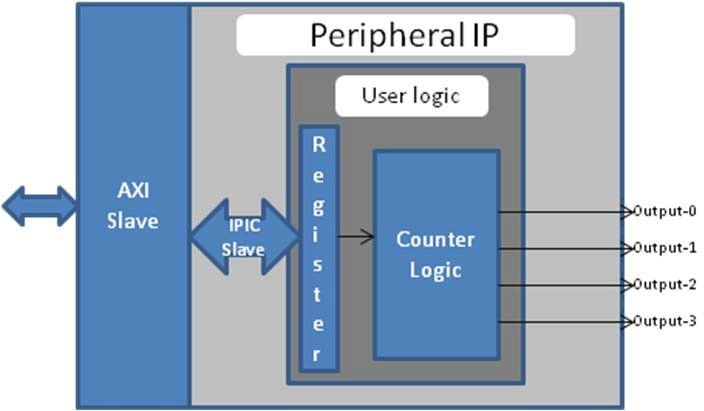
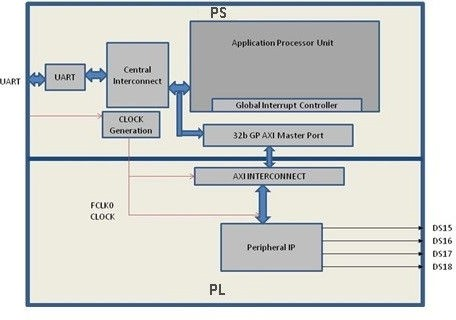

===============================================
Creating Custom IP and Device Drivers for Linux
===============================================

In this chapter, you will create an intellectual property (IP) using the Create and Package New IP wizard. You will also design a system to include the new IP created for the AMD |trade| Zynq |trade| 7000 SoC device.

For the IP, you will develop a Linux-based device driver as a module that can be dynamically loaded onto the running kernel.

You will also develop Linux-based application software for the system to execute on the AMD Zynq |trade| SoC ZC702 board.

.. important:: 
       
        You will need to rebuild the Linux kernel: a Linux host machine to run PetaLinux is required.

        -  :ref:`example-11-creating-peripheral-ip`: Creating Peripheral IP
        -  :ref:`example-12-device-driver-development`: Device Driver Development
        -  :ref:`example-13-loading-the-module-into-a-kernel-and-application-execution`: Loading the Module into a Kernel and Executing the Application

Creating Peripheral IP
----------------------

In this section, you will create an AXI4-Lite compliant slave peripheral IP framework using the Create and Package New IP wizard. You will also add functionality and port assignments to the peripheral IP framework.

The peripheral IP you will create is an AXI4-Lite compliant slave IP. It includes a 28-bit counter. The four most significant bits of the counter drive the four output ports of the peripheral IP. The block diagram is shown in the following figure.

   Custom IP Structure

The block diagram includes the following configuration register:

+---------------------+-------------------------+
| Register Name       | Control Register        |
+=====================+=========================+
| Relative Address    | 0x0000_0000             |
+---------------------+-------------------------+
| Width               | 1-bit                   |
+---------------------+-------------------------+
| Access Type         | Read/Write              |
+---------------------+-------------------------+
| Description         | Start/Stop the Counter  |
+---------------------+-------------------------+

|

+-------------+--------+---------+---------------+------------------------------------+
| Field Name  | Bits   | Type    | Reset Value   | Description                        |
+=============+========+=========+===============+====================================+
| Control     | Bit 0  |  R/W    | 0x0           | 1 : Start Counter 2 : Stop Counter |
+-------------+--------+---------+---------------+------------------------------------+

.. _example-11-creating-peripheral-ip:

Example 11: Creating Peripheral IP
----------------------------------

.. _creating-peripheral-ip:

Creating Peripheral IP
~~~~~~~~~~~~~~~~~~~~~~

In this section, you will create an AXI4-Lite compliant slave peripheral IP.

1. Create a new project as described in :ref:`Creating a New Embedded Project with Zynq SoC <example-1-creating-a-new-embedded-project-with-zynq-soc>`.

2. With the Vivado design open, select **Tools → Create and Package New IP**. Click **Next** to continue.

3. Select **Create a new AXI4 peripheral** and then click **Next**.

4. Fill in the peripheral details as follows:

   +---------------------+-------------------------+---------------------------------+
   | Screen              | System Property         | Setting or Comment to Use       |
   +=====================+=========================+=================================+
   | Peripheral Details  | Name                    | Blink                           |
   +---------------------+-------------------------+---------------------------------+
   |                     | Version                 | 1.0                             |
   +---------------------+-------------------------+---------------------------------+
   |                     | Display name            | Blink_v1.0                      |
   +---------------------+-------------------------+---------------------------------+
   |                     | Description             |  My new AXI IP                  |
   +---------------------+-------------------------+---------------------------------+
   |                     | IP location             | C:/designs/ip_repro             |
   +---------------------+-------------------------+---------------------------------+
   |                     | Overwrite               | existing unchecked              |
   +---------------------+-------------------------+---------------------------------+

5.  Click **Next**.

6.  In the Add Interfaces page, accept the default settings and click **Next**.

7.  In the Create Peripheral page, select **Edit IP** and then click **Finish**. Upon completion of the new IP generation process, the
    Package IP window opens (see the following figure).

    .. image:: ./media/image94.png

8.  In the Hierarchy view of the **Sources** window, right-click **blink_v1_0** under the Design Sources folder and select **Open
    File**. You need to add Verilog code that creates output ports to map to the external LEDs on the ZC702 board. Navigate to the line ``//Users to add ports here`` and add ``output wire \[3:0\] leds``\ below this line, as shown in the following example:

    .. code-block::

        //Users to add ports here
        output wire [3:0] leds,
        //User ports ends

9.  Find the instantiation to the AXI bus interface and add ``.leds(leds)``, as shown in the following example, to map the port connections:

    .. code-block::

       .S_AXI_RREADY(s00_axi_rready),
         .leds(leds)
         );

10. Save and close **blink_v1_0.v**.

11. Under **Sources → Hierarchy → Design Sources→ blink_v1_0**, right-click **blink_v1_0_S00_AXI_inst - blink_v1_0_S00_AXI** and select **Open File**.

    Next, you will need to add Verilog code that creates output ports to map to the external LEDs on the ZC702 board and also create the logic code to blink the LEDs when register 0 is written to.

12. Navigate to the line ``//Users to add ports here`` and add ``output wire \[3:0\] leds`` below this line, as shown in the example below:

    .. code-block::

       //Users to add ports here
       output wire [3:0] leds,
       //User ports ends

13. Find the AXI4-Lite signals section:

    .. code-block::

       // AXI4LITE signals
         reg [C_S_AXI_ADDR_WIDTH-1 : 0] axi_awaddr;
         reg axi_awready;
         reg axi_wready;
         reg [1 : 0] axi_bresp;
         reg axi_bvalid;
         reg [C_S_AXI_ADDR_WIDTH-1 : 0] axi_araddr;
         reg axi_arready;
         reg [C_S_AXI_DATA_WIDTH-1 : 0] axi_rdata;
         reg [1 : 0] axi_rresp;
         reg axi_rvalid;

    After this section, add a custom register, which you will use as a counter. Add the following code:

    .. code-block::

       // add 28-bit register to use as counter
       reg [27:0] count;

14. Find the I/O connections assignments section:

    .. code-block::

       // I/O Connections assignments
         assign S_AXI_AWREADY = axi_awready;
         assign S_AXI_WREADY = axi_wready;
         assign S_AXI_BRESP = axi_bresp;
         assign S_AXI_BVALID = axi_bvalid;
         assign S_AXI_ARREADY = axi_arready;
         assign S_AXI_RDATA = axi_rdata;
         assign S_AXI_RRESP = axi_rresp;
         assign S_AXI_RVALID = axi_rvalid;

    Add the following code at the bottom:

    .. code-block::

       // assign MSB of count to LEDs
         assign leds = count[27:24];

15. Toward the bottom of the file, find the section that states ``Add user logic here``. Add the following code, which will increment the count while the slv_reg0 is set to 0x1. If the register is not set, the counter will not increment.

    .. code-block::

       // Add user logic here
         // on positive edge of input clock
         always @( posedge S_AXI_ACLK )
         begin
         //if reset is set, set count = 0x0
         if ( S_AXI_ARESETN == 1'b0 )
         begin
         count <= 28'b0;
         end
         else
         begin
         //when slv_reg_0 is set to 0x1, increment count
         if (slv_reg0 == 2'h01)
         begin
         count <= count+1;
         end
         else
         begin
         count <= count;
         end
         end
         end
         // User logic ends

16. Save and close **blink_v1_0_S00_AXI.v**.

17. Open the **Package IP - blink** page. Under **Packaging Steps**, select **Ports and Interfaces**.

18. Click the **Merge Changes from Ports and Interfaces Wizard** link.

    .. image:: ./media/image95.png

19. Make sure that the window is updated and includes the LEDs output ports.

    .. image:: ./media/image96.png

20. Under Packaging Steps, select **Review and Package**. At the bottom of the Review and Package page, click **Re-Package IP**.

    The view that opens states that packaging is complete and asks if you would like to close the project.

21. Click **Yes**.

.. note:: The custom core creation process that you have worked through is very simple with the example Verilog included in the IP creation process. For more information, refer to the *GitHub Zynq Cookbook: How to Run BFM Simulation* web page.

Integrating Peripheral IP with PS GP Master Port
~~~~~~~~~~~~~~~~~~~~~~~~~~~~~~~~~~~~~~~~~~~~~~~~

You will now create a system for the ZC702 board by instantiating the peripheral IP as a slave in the Zynq SoC programmable logic (PL)
section. You will then connect it with the processor through the processing system (PS) general purpose (GP) master port. The block diagram for the system is shown in the following figure.

This system covers the following connections:

-  Peripheral IP connected to PS general purpose master port 0 (**M_AXI_GP0**). This connection is used by the PS CPU to configure
   peripheral IP register configurations.

-  Four output ports for peripheral IP connected to DS15, DS16, DS17, and DS18 on-board LEDs.

In this system, when you run application code, a message appears on the serial terminal and asks you to choose the option to make the LEDs start or stop blinking.

-  When you select the start option on the serial terminal, all four LEDs start blinking.

-  When you select the stop option, all four LEDs stop blinking and retain the previous state.

Connecting an AXI4-Lite Compliant Custom Slave IP
~~~~~~~~~~~~~~~~~~~~~~~~~~~~~~~~~~~~~~~~~~~~~~~~~

In this section, you will connect the AXI4-Lite compliant custom slave peripheral IP that you created in :ref:`creating-peripheral-ip`.

1.  Open the Vivado project you previously created in :ref:`example-1-creating-a-new-embedded-project-with-zynq-soc`.

2.  Add the custom IP to the existing design. Right-click the Diagram view and select **Add IP**.

3.  Type “blink” into the search view. Blink_v1.0 appears. Double-click the IP to add it to the design.

4.  Click **Run Connection Automation** to make automatic port connections.

5.  With the **All Automation** box checked by default, click **OK** to make the connections. Your new IP is automatically connected, but the **leds** output port is disconnected.

6.  Right-click the **leds** port and select **Make External**.

    .. image:: ./media/image98.jpeg

7.  In the Flow Navigator view, navigate to **RTL Analysis** and select **Open Elaborated Design**.

8.  Click **OK**.

9.  After the elaborated design opens, click the **I/O Ports** window and expand **All ports → led_0**.

    .. image:: ./media/image99.png

10. Edit the **leds** port settings as follows:

    +-----------+----------+---------------+
    | Port Name | I/O Std  | Package Pin   |
    +===========+==========+===============+
    | Leds[3]   | LVCMOS25 | P17           |
    +-----------+----------+---------------+
    | Leds[2]   | LVCMOS25 | P18           |
    +-----------+----------+---------------+
    | Leds[1]   | LVCMOS25 | W10           |
    +-----------+----------+---------------+
    | Leds[0]   | LVCMOS25 | V7            |
    +-----------+----------+---------------+

    The following figure shows the completed **leds** port settings in the I/O Ports window.

    .. image:: ./media/image100.png

11. Select **Generate Bitstream**.

12. The Save Project view opens. Ensure that the check box is selected and then click **Save**.

13. If a message appears stating that synthesis is Out-of-date, click **Yes**.

14. After the bitstream generation completes, export the hardware and launch the Vitis unified software platform.

.. note:: Make sure to select **Include bitstream** instead of **Pre-synthesis** on the **Output** page of the **Export Hardware Platform** wizard.

Linux-Based Device Driver Development
-------------------------------------

Modules in Linux are pieces of code that can be loaded and unloaded into the kernel on demand. A piece of code that you add in this way is called a loadable kernel module (LKM). These modules extend the functionality of the kernel without the need to reboot the system. Without modules, you would need to build monolithic kernels and add new functionality directly into the kernel image. Besides having larger kernels, this has the disadvantage of requiring you to rebuild and reboot the kernel every time you want new functionality. LKMs typically are one of the following things:

-  **Device drivers:** A device driver is designed for a specific piece of hardware. The kernel uses it to communicate with that piece of hardware without having to know any details of how the hardware works.

-  **File system drivers:** A file system driver interprets the contents of a file system as files and directories.

-  **System calls:** User space programs use system calls to get services from the kernel.

On Linux, each piece of hardware is represented by a file named as a device file, which provides the means to communicate with the hardware. Most hardware devices are used for output as well as input, so device files provide input/output control (ioctl) to send and receive data to and from hardware. Each device can have its own ioctl commands, which can be of the following types:

-  **read ioctl:** These commands send information from a process to the kernel.

-  **write ioctl:** These commands return information to a process.

-  Both read and write ioctl.

-  Neither read nor write ioctl.

For more details about LKM, refer to the Linux Kernel Module Programming Guide.

In this section you are going to develop a peripheral IP device driver as an LKM, which is dynamically loadable onto the running kernel. You must build the peripheral IP LKM as part of the same kernel build process that generates the base kernel image.

.. note:: If you do not want to compile the device driver, you can skip the example in this section and jump to :ref:`example-13-loading-the-module-into-a-kernel-and-application-execution`. In that section, you can use the kernel image, which contains ``blink.ko`` (``image.ub`` in the shared ZIP files). See :ref:`design-files-for-this-tutorial`.

For kernel compilation and device driver development, you must use the Linux workstation. Before you start developing the device driver, the following steps are required:

1. Set the toolchain path in your Linux workstation.

2. Download the kernel source code and compile it. For downloading and compilation, refer to the steps mentioned in the `AMD Zynq Linux
   Wiki Page <https://xilinx-wiki.atlassian.net/wiki/spaces/A/pages/18841961/Zynq+Linux>`_.

.. _example-12-device-driver-development:

Example 12: Device Driver Development
-------------------------------------

You will use a Linux workstation for this example project. The device driver software is provided in the LKM folder of the ZIP file that accompanies this guide.

We will discuss two ways to create a Linux Module; using the Petalinux Utility and using Vitis Unified IDE.

**Using Petalinux to Create the Module**

1. Under the PetaLinux project directory, use the command below to create your module:

   .. code-block::

      petalinux-create -t modules \--name mymodule \--enable

   PetaLinux creates the module in the `<plnx-project\>/project-spec/meta-user/ recipes-modules/` directory.

   For this exercise, create the "blink" module:

   .. code-block::

      petalinux-create -t modules \--name blink \--enable

   The default driver creation includes a Makefile, C-file, and README files. In this exercise, PetaLinux creates ``blink.c``, a Makefile, and README files. It also contains the bit bake recipe ``blink.bb``.

2. Change the C-file (driver file) and the Makefile as per your driver.

3. Take the LKM folder (reference files) and copy **blink.c** and **blink.h** into this directory.

4. Open the **blink.bb** recipe and add a ``blink.h`` entry in ``SRC_URI``.

5. Run the command ``petalinux-build``.

   After successful compilation the ``.ko`` file is created in the following location:

   .. code-block::

      <petalinux-build_directory>/build/tmp/sysroots-components/zc702_zynq7/blink/lib/modules/5.15.0-xilinx-v2022.2/extra/blink.ko

6. You can install the driver using the ``modprobe`` command, which will be explained in further detail in the next section.

**Using Vitis to Create the Module**

The advatange of using Vitis to create a linux module is that the user can develop the code, deploy it on the target, evaluate and modify and re-deploy if needed. 

1. Users will need to provide the Vitis IDE with the linux-xlnx generated in Petalinux. By default, Petalinux will delete the intermittent binaries such as the linux-xlnx. Users will need to tell Petalinux to keep these files.

   To do this, users can open the petalinuxbsp.conf in project-spec/meta-user/conf and append the content below:

   .. code-block::

      RM_WORK_EXCLUDE += "linux-xlnx"

2. Next, we can beuild the Petalinux project

   .. code-block::

      petalinux-build

3. Launch Vitis Unified IDE, and create a workspace. 

4. Select **User Managed Mode**, and add all the files from LKM folder. 

**Note** User Managed Mode is a new feature in Vitis Unified IDE that allows users to build makefile based applications without using the IDE

5. Create the **Build Configurations** 
	a. Right click anywhere in the Explorer View and select **Edit Build Configurations**
	b. Below is an example of two build conifgurations; build and clean
	
	.. image:: ./media/build_configurations.png
	
	**Note:** Users need to pass the **KVERSION** to the make file. This is the path to the **linux-zynq_generic_7z020-standard-build** in the petlainux project TMP_DIR. Users can get the TMP_DIR in **petalinux-config**

6. To build, right click in ther Explorer view and select **Build**. Then select the Build configuration. This will create a **blink.ko** file

7. Use scp to copy the blink.ko onto the kernel, and insmod/rmmod to load and remove the module.

.. _example-13-loading-the-module-into-a-kernel-and-application-execution:

Example 13: Loading a Module into a Kernel and Executing the Application
------------------------------------------------------------------------

In this example, you will boot Linux onto the Zynq |trade| SoC Board and load the peripheral IP as an LKM onto it. You will develop the application for the system and execute it onto the hardware.

Loading the Module into Kernel Memory
~~~~~~~~~~~~~~~~~~~~~~~~~~~~~~~~~~~~~

The ``modprobe`` command makes an ``init_module`` system call to load the LKM into the kernel memory. The ``init_module`` system call invokes the LKM initialization routine immediately after it loads the LKM. As part of its initialization routine, ``insmod`` passes to the address of the subroutine to ``init_module``.

In the peripheral IP device driver, you already set up ``init_module`` to call a kernel function that registers the subroutines. It calls the kernel’s ``register_chrdev`` subroutine, passing the major and minor number of the devices it intends to drive and the address of its own "open" routine among the arguments. The subroutine ``register_chrdev`` specifies in base kernel tables that when the kernel wants to open that particular device, it should call the open routine in your LKM.

Application Software
~~~~~~~~~~~~~~~~~~~~

The ``main()`` function in the application software is the entry point for the execution. It opens the device file for the peripheral IP and then waits for the user selection on the serial terminal.

If you select the start option on the serial terminal, all four LEDs start blinking. If you select the stop option, all four LEDs stop
blinking and retain the previous state.

Example Steps
~~~~~~~~~~~~~

Booting Linux on the Target Board
^^^^^^^^^^^^^^^^^^^^^^^^^^^^^^^^^

Boot Linux on the AMD Zynq SoC ZC702 target board.

Loading Modules and Executing Applications
^^^^^^^^^^^^^^^^^^^^^^^^^^^^^^^^^^^^^^^^^^

In this section, you will use the Vitis software platform installed on a Windows machine.

1.  Open the Vitis software platform. You must run the Target Communication Frame (TCF) agent on the host machine.

2.  In the XSDB Console view, type ``connect`` to connect to the Xilinx Software Debugger (XSDB).

3.  In the Vitis Unified IDE, select **File → New Component → Platform**  and populate using the table below.

    +-----------+-----------------------------------------------+----------------+
    | Screen    | System Property                               | Setting or     |
    |           |                                               | Command to     |
    |           |                                               | Use            |
    +===========+===============================================+================+
    | Create    |                                               |                |
    | Platform  | Component Name                                | linux_platform |
    | Component |                                               |                |
    +-----------+-----------------------------------------------+----------------+
    |           |                                               |                |
    |           | Component Location                            | default        |
    |           |                                               |                |
    +-----------+-----------------------------------------------+----------------+
    | Select    |                                               |                |
    | Platform  | Hardware Design                               | Select         |
    | Creation  |                                               |                |
    | Flow      |                                               |                |
    +-----------+-----------------------------------------------+----------------+
    |           |                                               |                |
    |           | Hardware Design (XSA)                         | Browse to XSA  |
    |           |                                               |                |
    +-----------+-----------------------------------------------+----------------+
    | Select    |                                               |                |
    | Operating | Operating System                              | linux          |
    | System &  |                                               |                |
    | Processor |                                               |                |
    +-----------+-----------------------------------------------+----------------+
    |           |                                               |                |
    |           | Processor                                     | ps7_cortexa9   |
    |           |                                               |                |
    +-----------+-----------------------------------------------+----------------+

4.  In the Vitis Unified IDE, select **File → New Component → Application** and populate using the table below.

    +-------------+-----------------------------------------------+--------------------+
    | Screen      | System Property                               | Setting or         |
    |             |                                               | Command to         |
    |             |                                               | Use                |
    +=============+===============================================+====================+
    | Create      |                                               |                    |
    | Application | Component Name                                | linux_blinkled_app |
    | Component   |                                               |                    |
    +-------------+-----------------------------------------------+--------------------+
    |             |                                               |                    |
    |             | Component Location                            | default            |
    |             |                                               |                    |
    +-------------+-----------------------------------------------+--------------------+
    | Select      |                                               |                    |
    | Platform    | Platform                                      | linux_platform     |
    +-------------+-----------------------------------------------+--------------------+
    | Sysroot     |                                               |                    |
    |             | Sysroot                                       | Browse to sysroot  |
    +-------------+-----------------------------------------------+--------------------+
    |             |                                               |                    |
    |             | Update Workspace Perference                   | Select             |
    +-------------+-----------------------------------------------+--------------------+

5.  Click **Finish**. The New Application linux_blinkled_app component is created in **Components** view.

6.  In the Components View, expand the **linux_blinkled_app** Component, right-click the **src** directory, and select **Import**. The Import
    Sources view opens.

7.  Browse for the **LKM_App** folder and select the **linux_blinkled_app.c** and **blink.h** files.

    .. note:: The application software file name for the system is ``linux_blinkled_app.c`` and the header file name is ``blink.h``. These files are available in the LKM folder of the ZIP file that accompanies this guide. See :ref:`design-files-for-this-tutorial`.

    Add the **linux_blinkled_app.c** and **blink.h** files.

8.  Click **Finish**.

    Under **FLOW** select (or highlight) the **linux_blinkled_app** component and click on the hammer icon to generate the ``linux_blinkled_app.elf`` file in binary folders. Check the Console window for the status of this action.

9.  Connect the board.

10. Follow the steps described in :doc:`Linux Booting and Debug in the Vitis Software Platform <./7-linux-booting-debug>` to load the Linux image and start it.

    After the kernel boots successfully, in a serial terminal, navigate to ``/lib/modules/\<kernel-version\>/extr`` and run the command:

    ``modprobe blink.ko``

    You will see the following message:

    .. code-block::

       <1>Hello module world.
       <1>Module parameters were (0xdeadbeef) and "default"
       blink_init: Registers mapped to mmio = 0xf09f4000
       Registration is a success the major device number is 244.

    If you want to talk to the device driver, create a device file by running the following command:

    ``mknod /dev/blink_Dev c 244 0``

    The device file name is important, because the ioctl program assumes that is the file you will use.

11. Create a device node. Run the ``mknod`` command and select the the string from the printed message.

    For example, the command ``mknod /dev/blink_Dev c 244 0`` creates the ``/dev/blink_Dev`` node.

12. Select **Window → Open perspective → Remote System Explorer** and click **Open**. The Vitis software platform opens the Remote Systems
    Explorer perspective.

13. In the Remote Systems view, do the following:

    a. Right-click and select **New → Connection** to open the New Connection wizard.

    b. Select the **SSH Only** and click **Next**.

    c. In the Host name field, type the target board IP. To determine the target IP, type “ifconfig eth0” at the Zynq prompt in the serial terminal. The target IP assigned to the board displays.

    d. Set the connection name as **blink** and type a description.

    e. Click **Finish** to create the connection.

    f. Expand **blink → sftp Files → Root**. The Enter Password wizard opens.

    g. Enter the Login (petalinux) and user will be prompted to enter new Login and Password.

    h. Click **OK**.

       The window displays the root directory content, because you previously established the connection between the Windows host machine and the target board.
	
	i. User can change the permissions here with **sudo -i**

    j. Right-click the **/** in the path name and create a new directory; name it “Apps”.

    k. Using the Remote System Explorer perspective, copy the **linux_blinkled_app.elf** file from the **/linux_blinkled_app/Debug** folder and paste it into the **/Apps** directory under **blink connection**.

14. In the serial terminal, type ``cd Apps`` to open the ``/Apps`` directory.

15. Go to the **Apps** directory. Type ``chmod 777 linux_blinkled_app.elf`` to change the ``linux_blinkled_app.elf`` file mode to executable mode.

16. At the prompt, type ``./linux_blinkled_app.elf`` to execute the application.

17. Follow the instruction printed on the serial terminal to run the application. The application asks you to enter 1 or 0 as input.

    -  Type 1, and observe the LEDs DS15, DS16, DS17, and DS18. They start glowing.

    -  Type 0, and observe that the LEDs stop at their state. No more blinking changes. Repeat your inputs and observe the LEDs.

18. After you finish debugging the Linux application, close the Vitis software platform.

.. include:: ../docs/substitutions.txt

.. Copyright © 2020–2024 Advanced Micro Devices, Inc

.. `Terms and Conditions <https://www.amd.com/en/corporate/copyright>`_.