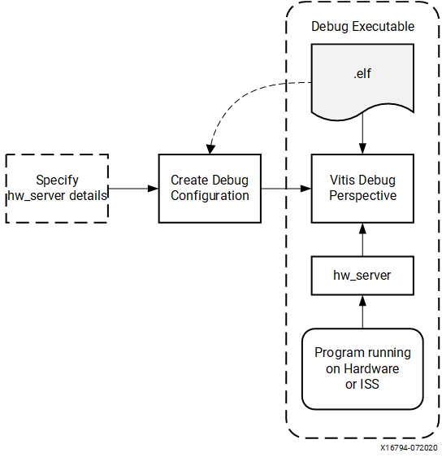

..

=========================================================
Debugging Standalone Applications with the Vitis Debugger
=========================================================

This chapter describes debug possibilities with the design flow you have already been working with. The first option is debugging with software using the Vitis |trade| debugger.

The Vitis debugger provides the following debug capabilities:

-  Debugging of programs on Arm |reg| Cortex |trade|-A53, Arm |reg| Cortex |trade|-R5F, and MicroBlaze |trade| processor architectures (heterogeneous multi-processor hardware system debugging)

-  Debugging of programs on hardware boards

-  Debugging on remote hardware systems

-  A feature-rich IDE to debug programs

-  A Tool Command Language (Tcl) interface for running test scripts and automation

The Vitis debugger enables you to see what is happening to a program while it executes. You can set breakpoints or watchpoints to stop the
processor, step through program execution, view the program variables and stack, and view the contents of the memory in the system.

The Vitis debugger supports debugging through Vitis System Debugger.

Vitis System Debugger
----------------------

The System Debugger uses the AMD hardware server as the underlying debug engine. The Vitis IDE translates each user interface
action into a sequence of Target Communication Framework (TCF) commands. It then processes the output from System Debugger to display the current state of the program being debugged. It communicates to the processor on the hardware using AMD hardware server.

The debug workflow is described in the following figure.

The workflow is made up of the following components:

-  **Executable ELF File:** To debug your application, you must use an executable and linkable format (ELF) file compiled for debugging. The debug ELF file contains additional debug information for the debugger to make direct associations between the source code and the binaries generated from that original source. To manage the build configurations, right-click the software application and select **Build Configurations → Manage**.

-  **Debug Configuration:** To launch the debug session, you must create a debug configuration in the Vitis debugger. This configuration captures the options required to start a debug session, including the executable name, processor target to debug, and other information. To create a debug configuration, select the **Settings** button beside **Debug** in the flow tab.

-  **Vitis Debug Perspective:** Using the Debug perspective, you can manage the debugging or running of a program in the workbench. You can control the execution of your program by setting breakpoints, suspending launched programs, stepping through your code, and examining the contents of variables. To view the Debug Perspective, select **Window → Debug**.

You can repeat the cycle of modifying the code, building the executable, and debugging the program in the Vitis debugger.

.. note:: If you edit the source after compiling, the line numbering will be out of step because the debug information is tied directly to the source. Similarly, debugging optimized binaries can also cause unexpected jumps in the execution trace.

Example 6: Debugging Software Using the Vitis Debugger
------------------------------------------------------

In this example, you will walk through debugging a “Hello World” application.

.. note:: If you did not create a “Hello World” application on the APU or RPU, follow the steps in :ref:`creating-a-custom-bare-metal-application-for-an-arm-cortex-a53-based-apu` to create a new “Hello World” application.

After you create the “Hello World” application, work through the
following example to debug the software using the Vitis debugger.

1. Connect the JTAG cable, set the boot mode to JTAG, and power on the board. Refer to the steps in :ref:`example-3-running-the-hello-world-application-from-arm-cortex-a53`.

2. Select the hello_a53 application and then click the Open Settings button beside Debug in the flow tab to review the launch settings. The select the **Debug** button. 
   
   .. note:: The above step launches the Application Debugger in the Debug perspective based on the project settings. Alternatively, you can create a debug configuration which looks like the following figure.

   .. figure:: ./media/vitis_single_app_debug_configurations.png

      Debug Configurations

   .. note:: The contents of Debug Configurations are identical to those in Run Configurations. The difference between run and debug is that debug stops at the `main()` function by default.

   If the Confirm Perspective Switch popup window appears, click **Yes**. The Debug perspective opens.

   .. note:: If the Debug perspective window does not open automatically, select **View → Debug**. 

   The Debug Perspective looks like this:

   .. image:: ./media/image46.jpeg

   .. note:: The addresses shown on this page might slightly differ from the addresses shown on your system.

   The processor is currently sitting at the beginning of `main()` with program execution suspended at program address `0000000000000c90`. You can confirm this information in the Disassembly view, which shows the assembly-level program execution also suspended at
   `0000000000000c90`.

   .. note:: If the Disassembly view is not visible, select **View → Disassembly View**.

3. The helloworld.c window also shows execution suspended at the first executable line of C code. Select the **Registers** view to confirm
   that the program counter, pc register, equals the program address in disassembly view. In this example, it is `0000000000000c90`.

   .. note:: If the Registers window is not visible, select **View → Register Inspector**.

4. Double-click in the margin of the **helloworld.c** window next to the line of code that reads print (“Hello World”);. This sets a breakpoint at the `printf` command. To confirm the breakpoint, review the Breakpoints window.

   .. note:: Breakpoints can be viewed in the debug view.

5. Select the **Step Into** button in the debug view to step into the `init_platform()` routine.

   Program execution suspends at the next instruction. In this example it would be `0000000000000c98`. The call stack is now two levels deep.

6. Select the **Continue** button in the debug view to continue running the program to the breakpoint.

   Program execution stops at the line of code that includes the `printf` command. The Disassembly and Debug windows both show program execution stopped at the program address of the `printf` command, in this example, its `000000000000c9c`.

   .. note:: The execution address in your debugging window might differ if you modified the “Hello World” source code in any way.

7. Select **Continue** to run the program to conclusion.

   When the program completes, the Debug window shows that the program is suspended in a routine called `exit`. This happens when you are running under control of the debugger.

8. Rerun your code several times. Experiment with single-stepping, examining memory, breakpoints, modifying code, and adding print statements. Try adding and moving views.

   .. tip:: You can use the Vitis debugger debugging shortcuts for step-into (F5), step-return (F7), step-over (F6), and resume (F8).

Example 7: Debugging Using XSDB
-------------------------------

You can use the previous steps to debug bare-metal applications running on RPU and PMU using the Vitis application debugger GUI.

Additionally, you can debug in command line mode using XSDB, which is encapsulated as a part of XSDB. In this example, you will debug the
bare-metal application testapp_r5 using XSDB.

The following steps indicate how to load a bare-metal application on R5 using XSDB. This example demonstrates the command line debugging
capability of XSDB. Based on your requirements, you can choose to debug the code using either the System Debugger GUI or the command line debugger in XSDB. All XSDB commands are scriptable, and this also applies to the commands covered in this example.

Setting Up the Target
~~~~~~~~~~~~~~~~~~~~~

1. Open the XSDB console:

   -  Click the **XSDB Console** button |image1| in the toolbar.

2. Connect to the target over JTAG:

   -  In the XSDB console, run `xsdb% connect`.

   The `connect` command returns the channel ID of the connection.

3. Command Targets lists the available targets and allows you to select a target through its ID. The targets are assigned IDs as they are
   discovered on the JTAG chain, so the target IDs can change from session to session.

   For non-interactive usage such as scripting, the ``-filter`` option can be used to select a target instead of selecting the target
   through its ID:

   .. code-block::

         xsdb% targets

   The targets are listed as shown in the following figure.

   .. figure:: ./media/image49.png

      xsdb - targets

4. Select the PSU target. The Arm APU and RPU clusters are grouped under PSU. Select Cortex-A53#0 as the target using the following command:

   .. code-block::
   
         xsdb% targets -set -filter {name =\~ \"Cortex-A53 \#0\"}

   The command ``targets`` now lists the targets and also shows the selected target highlighted with an asterisk (*) mark. You can also
   use the target number to select a target, as shown in the following figure.

   .. figure:: ./media/image50.png

      XSDB - selected target

5. The processor is now held in reset. To clear the processor reset, use the following command:

   .. code-block::
   
         rst -processor

6. Load the FSBL on Cortex-A53 #0. FSBL initializes the Zynq UltraScale+ processing system.

   .. code-block:: tcl

         xsdb% dow {C:\edt\edt_zcu102_workspace\zcu102\zynqmp_fsbl\build.elf}
         xsdb% con
         xsdb% stop

   .. note:: The {} used in the above command are required on Windows machines to enable backward slashes () in file paths. These brackets can be avoided by using forward "/" in paths. For Linux paths, use forward slashes; the paths in XSCT in Linux can work as-is, without any brackets.

Loading the Application Using XSDB
~~~~~~~~~~~~~~~~~~~~~~~~~~~~~~~~~~

1. Check and select the RPU Cortex-R5F Core 0 target ID.

   .. code-block::

      xsdb% targets
      xsdb% targets -set -filter {name =~ "Cortex-R5 #0"}
      xsdb% rst -processor

   The command ``rst -processor`` clears the reset on an individual processor core.

   This step is important, because when the Zynq MPSoC boots up JTAG boot mode, all the Cortex-A53 and Cortex-R5F cores are held in reset.
   You must clear the resets on each core before debugging on these cores. The ``rst`` command in XSDB can be used to clear the resets.

   .. note:: The command `rst -cores` clears resets on all the processor cores in the group (such as APU or RPU), of which the current target is a child. For example, when A53 #0 is the current target, `rst - cores` clears resets on all the Cortex-A53 cores in the APU.

2. Download the testapp_r5 application on Arm Cortex-R5F Core 0.

   -  Run `xsdb% dow {C:/edt/edt_zcu102_workspace/testapp_r5/buildtestapp_r5.elf}` or `xsdb% dow {C:/edt/edt_zcu102_workspace/testapp_r5/build/testapp_r5.elf}`.

   At this point, you can see the sections from the ELF file downloaded sequentially. The XSCT prompt can be seen after successful download. Now, configure a serial terminal (Tera Term, Minicom, or the serial terminal interface for a UART-1 USB-serial connection).

Serial Terminal Configuration
~~~~~~~~~~~~~~~~~~~~~~~~~~~~~

1. Start a terminal session using Tera Term or Minicom depending on the host machine being used. Set the COM port and baud rate as shown in following figure.

   .. image:: ./media/image44.png

2. For port settings, verify the COM port in the device manager. There are four USB UART interfaces exposed by the ZCU102 board. Select the COM port associated with the interface with the lowest number. In this case, for UART-0, select the COM port with interface-0.

3. Similarly, for UART-1, select the COM port with interface-1. Remember that the R5 BSP has been configured to use UART-1, so R5 application messages will appear on the COM port with the UART-1 terminal.

Running and Debugging the Application Using XSDB
~~~~~~~~~~~~~~~~~~~~~~~~~~~~~~~~~~~~~~~~~~~~~~~~

1. Before you run the application, set a breakpoint at `main()`:

   .. code-block::

        xsdb% bpadd -addr &main

   This command returns the breakpoint ID. You can verify the breakpoints planted using the command ``bplist``. For more details on
   breakpoints in XSCT, type ``help breakpoint`` in the XSCT console.

2. Resume the processor core:

   .. code-block::
   
        xsdb% con

   The following informative messages will be displayed when the core hits the breakpoint.

   .. code-block::

         xsdb% Info: Cortex-R5 \#0 (target 7) Stopped at 0x10021C (Breakpoint)

3. At this point, you can view registers when the core is stopped:

   .. code-block::

         xsdb% rrd

4. View local variables:

   .. code-block::
      
         xsdb% locals

5. Step over a line of the source code and view the stack trace:

   .. code-block::

         xsdb% nxt
         Info: Cortex-R5 #0 (target 6) Stopped at 0x100490 (Step)
         xsdb% bt

   You can use the ``help`` command to find other options:

   .. image:: ./media/image51.png

   You can use the ``help running`` command to get a list of possible options for running or debugging an application using XSDB.

   .. image:: ./media/image52.png

6. You can now run the code:

   .. code-block::
   
         xsdb% con

   At this point, you can see the Cortex-R5F application print a message on the UART-1 terminal.

   The :doc:`next chapter <./6-build-linux-sw-for-ps>` shows how to build and debug Linux applications.

.. |trade|  unicode:: U+02122 .. TRADEMARK SIGN
   :ltrim:
.. |reg|    unicode:: U+000AE .. REGISTERED TRADEMARK SIGN
   :ltrim:

.. Copyright © 2016–2025 Advanced Micro Devices, Inc
.. `Terms and Conditions <https://www.amd.com/en/corporate/copyright>`_.