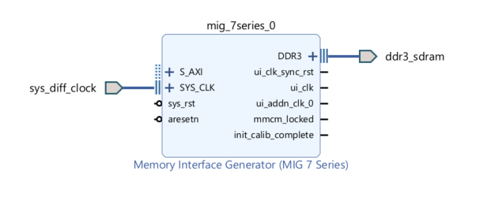
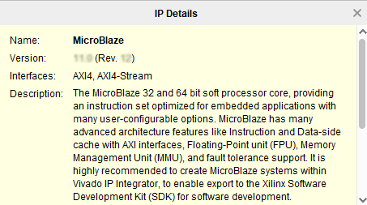
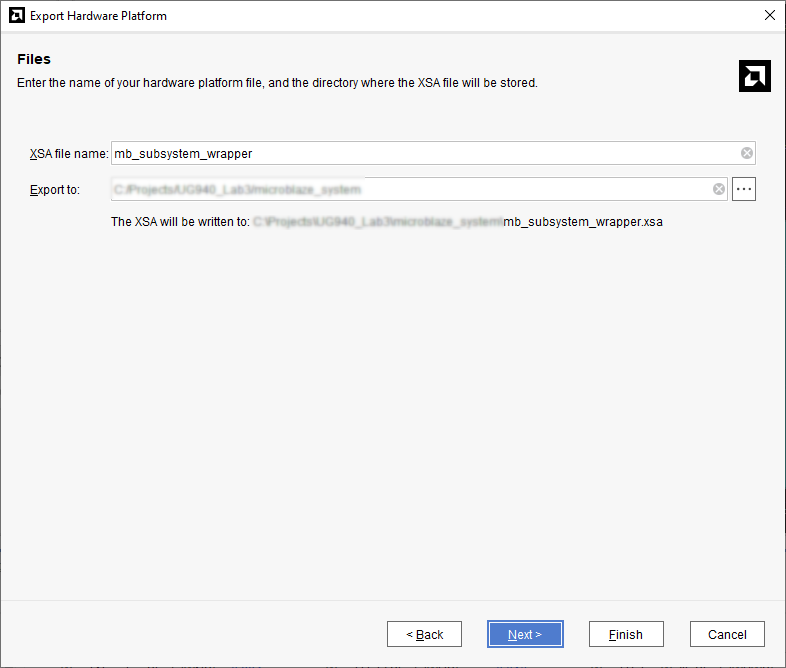
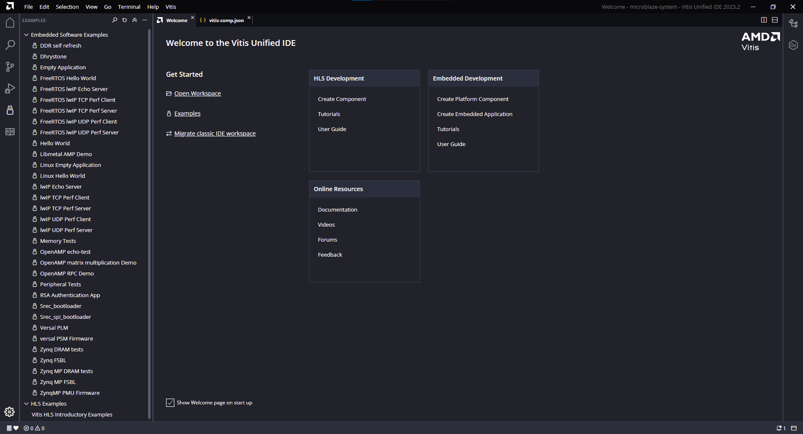
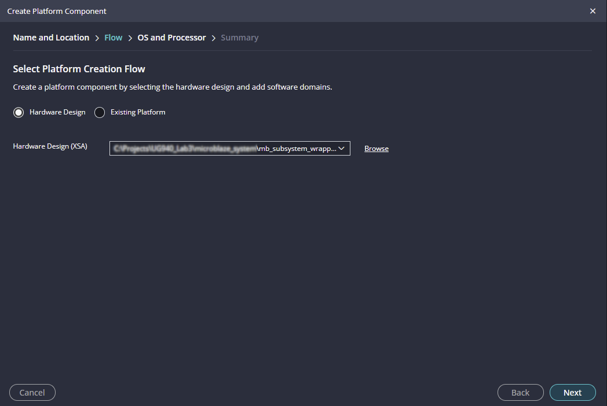
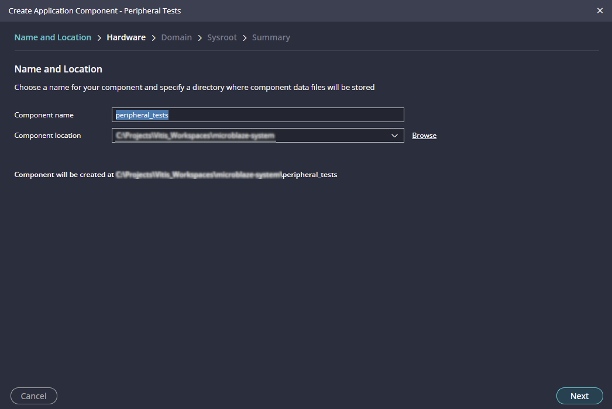
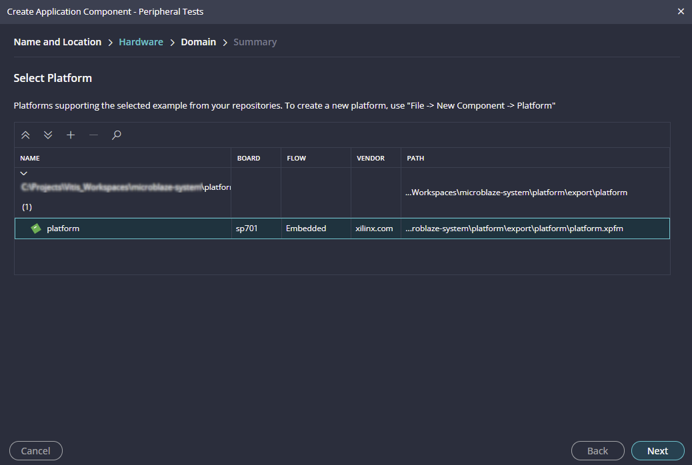
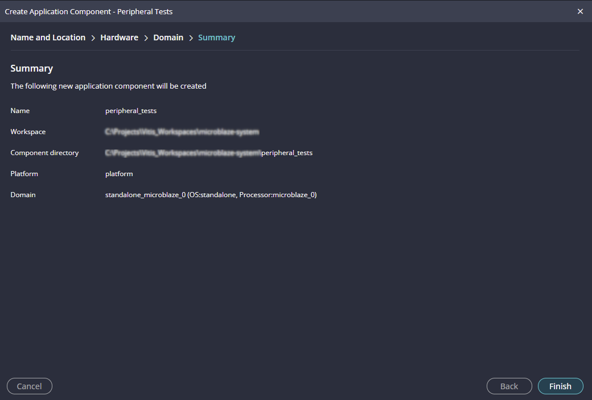
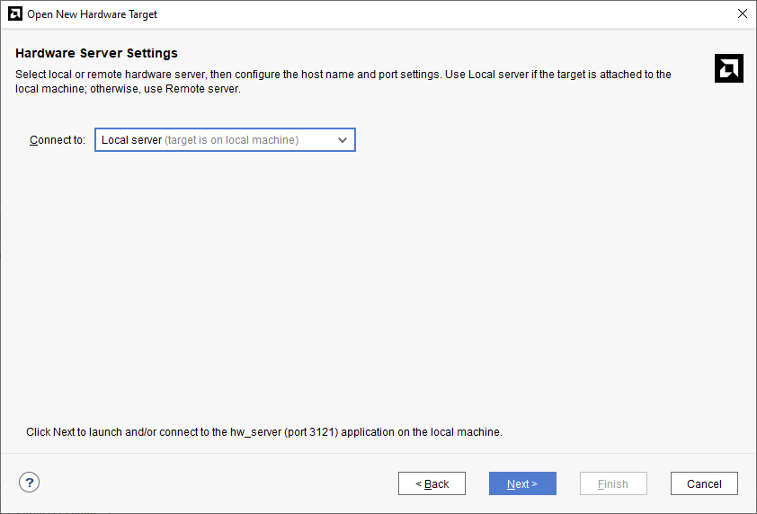
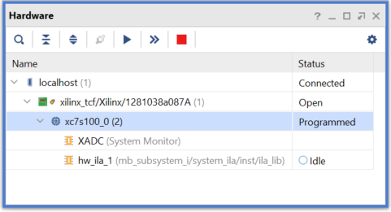

<p class="sphinxhide" align="right"><a href="../../../docs-cn/README.md">简体中文</a> | <a href="../../../docs-jp/README.md">日本語</a></p>
<table class="sphinxhide" width="100%">
  <tr width="100%">
    <td align="center">  
    </td>
 </tr>
</table>

# Programming an Embedded MicroBlaze Processor

## Introduction

 In this tutorial, you create a simple AMD MicroBlaze™ system for a Spartan-7 FPGA using AMD Vivado™ IP integrator.

 The MicroBlaze system includes native AMD IP including:
* MicroBlaze processor
* AXI block RAM
* Double Data Rate 3 (DDR3) memory
* UARTLite
* AXI GPIO
* MicroBlaze Debug Module (MDM)
* Proc Sys Reset
* Local memory bus (LMB)

 Parts of the block design are constructed using the Platform Board Flow feature.

 This lab also shows the cross-trigger capability of the MicroBlaze processor.

 The feature is demonstrated using a software application code developed in the Vitis software platform in a stand-alone application mode.

 This lab targets the AMD SP701 FPGA Evaluation Kit.

## Step 1: Start the Vivado IDE and Create a Project

1. Start the Vivado IDE by clicking the Vivado desktop icon or by typing `vivado` at a command prompt.

2. From the Quick Start page, select **Create Project**.

3. In the New Project dialog box, use the following settings:

    a. In the Project Name dialog box, type the project name and location.
    
    b. Make sure that the **Create project subdirectory** check box is selected. Click **Next**.

    c. In the Project Type dialog box, select **RTL project**. Ensure that the **Do not specify sources at this time** check box is cleared. Click **Next**.

    d. In the Add Sources dialog box, set the Target language to either **VHDL** or **Verilog**. You can leave the Simulator language selection to **Mixed**.

    e. Click **Next**.

    f. In Add Constraints dialog box, click **Next**.

    g. In the Default Part dialog box, select **Boards** and choose **Spartan-7 SP701 Evaluation Platform**. Click **Next**.

    h. Review the project summary in the New Project Summary dialog box and click **Finish** to create the project.

Because you selected the SP701 board when you created the Vivado IDE project, you see the following message in the Tcl Console:

```set_property board_part xilinx.com:sp701:part0:1.1 [current_project]```

Although Tcl commands are available for many of the actions performed in the Vivado IDE, they are not explained in this tutorial. Instead, a Tcl script is provided that can be used to recreate this entire project. See the Tcl Console for more information. You can also refer to the *Vivado Design Suite Tcl Command Reference Guide*([UG835](https://docs.xilinx.com/access/sources/dita/map?Doc_Version=2023.2%20English&url=ug835-vivado-tcl-commands)) for information about the `write_bd_tcl` commands.

## Step 2: Create an IP Integrator Design

1. From Flow Navigator, under IP integrator, select **Create Block Design**.

2. Specify the IP subsystem design name. For this step, you can use `mb_subsystem` as the Design name. Leave the Directory field set to its default value of \<Local to Project\>. Leave the Specify source set drop-down list set to its default value of Design Sources.

3. Click **OK** in the Create Block Design dialog box, shown in the following figure.

    

4. In the IP integrator diagram area, right-click and select **Add IP**.

    The IP integrator Catalog opens. Alternatively, you can also select the Add IP icon in the middle of the canvas.

    

5. Type `mig` in the Search field to find the MIG core, then select **Memory Interface Generator (MIG 7 Series)**, and press **Enter**.

   

    The Designer Assistance link becomes active in the block design banner.

6. Click **Run Block Automation**.

   

    The Run Block Automation dialog box opens.

   

7. Click **OK**. This instantiates the MIG core and connects the I/O interfaces to the I/O interfaces for the DDR memory on the SP701 board.

   

8. Right-click anywhere in the block design canvas, and select **Add IP**. The IP catalog opens.

9.  In the Search field, type `micr` to find the MicroBlaze IP, then select **MicroBlaze**, and press **Enter**.

 ***Note:*** If not displayed by default, the IP Details window can be displayed by clicking **CTRL+Q** on the keyboard while searching for IP.

   

### Use the Board Window to Connect to Board Interfaces

There are several ways to use an existing interface in IP integrator. Use the Board window to instantiate some of the interfaces that are present on the SP701 board. 

1. Navigate to the **Windows>Board**.
2. Select the **Board** window to see the interfaces present on the SP701 board.

   

   In the Board window, notice that the DDR3 SDRAM interface is connected as shown by the circle  in the following figure. This is because you used the Block Automation feature in the previous steps to connect the MIG core to the board interfaces for DDR3 SDRAM memory.

   

3. From the Board window, select **UART** under the Miscellaneous folder, and drag and drop it into the block design canvas.

    This instantiates the AXI Uartlite IP on the block design.

4. From the Board window, select **LED** under the General Purpose Input or Output folder, and drag and drop it into the block design canvas.

    This instantiates the GPIO IP on the block design and connects it to the on-board LEDs. 

5. Next, from the Board window, select **FPGA Reset** under the Reset folder, and drag and drop it into the block design canvas.

    This connects the CPU push button reset to the MIG core IP. 

    The block design now should look like the following figure.
    

### Add Peripheral: AXI block RAM Controller

1. Add the AXI block RAM Controller, shown in the following figure, by right-clicking the IP integrator canvas and selecting **Add IP**.

    

    The block design now should look like the following figure.

   

### Run Block Automation

1. Click **Run Block Automation**, as shown below.
    

    The **Run Block Automation** dialog box opens.

2. On the **Run Block Automation** dialog box:

    a. Leave Preset as the default value, **None**.

    b. Set Local Memory to **64 KB**.

    c. Leave the Local Memory ECC as the default value, **None**.

    d. Set Cache Configuration to **32 KB**.

    e. Set Debug Module to **Extended Debug**.

    f. Leave the Peripheral AXI Port option as the default value, **Enabled**.

    g. Leave the Interrupt Controller option unchecked.

    h. Leave The Clock source option set to **/mig_7series_0/ui_addn_clk_0 (100 MHz)**.

    

3. Click **OK**.

    This generates a basic MicroBlaze system in the IP integrator diagram area, as shown in the following figure.

   

### Use Connection Automation

Run Connection Automation provides several options that you can select to make connections. This section will walk you through the first connection, and then you will use the same procedure to make the rest of the required connections for this tutorial.

1. Click **Run Connection Automation** as shown in the following figure.
    

    The Run Connection Automation dialog box opens.

2. Check the All Automation check box in the left pane of the dialog box as shown in the following figure. 
    This selects interfaces to run Connection Automation for.
   

3. Use the following table to set options in the Run Connection Automation dialog box.

    *Table 1:* **Run Connection Automation Options**
<table>
<colgroup>
<col style="width: 33%" />
<col style="width: 33%" />
<col style="width: 33%" />
</colgroup>
<thead>
<tr class="header">
<th>
<strong>Connection</strong></th>
<th>
<strong>More Information</strong>
</th>
<th>
<strong>Setting</strong></th>
</tr>
</thead>
<tbody>
<tr class="odd">
<td><p>axi_bram_ctrl_0</p>
<ul>
<li><p>BRAM_PORTA</p></li>
</ul></td>
<td>The only option for this automation is to instantiate a new Block
Memory Generator as shown under options.</td>
<td>Leave the Blk_Mem_Gen to its default option of Auto.</td>
</tr>

<tr class="even">
<td><p>axi_bram_ctrl_0</p>
<ul>
<li><p>BRAM_PORTB</p></li>
</ul></td>
<td>The Run Connection Automation dialog box opens and gives you two choices:
<ul>
<li><p>Instantiate a new BMG and connect the PORTB of the AXI block RAM
Controller to the new BMG IP</p></li>
<li><p>Use the previously instantiated BMG core and automatically
configure it to be a true dual- ported memory and connected to PORTB of
the AXI block RAM Controller.</p></li>
</ul>
</td>
<td>Leave the Blk_Mem_Gen option to its default value of Auto.</td>
</tr>

<tr class="odd">
<td>axi_bram_ctrl_0
<ul>
<li><p>S_AXI</p></li>
</ul>
</td>
<td>Two options are presented in this case. The Master field can be set for either cached or non-cached accesses.</td>
<td>The Run Connection Automation dialog box offers to connect this to the /microblaze_0 (Cached).
Leave it to its default value. In case, cached accesses are not desired
this could be changed to /microblaze_0 (Periph).</p>
<p>Leave the Clock Connection (for unconnected clks) field set to its
default value of Auto.</p></td>
</tr>

<tr class="even">
<td>axi_gpio_0
<ul>
<li>S_AXI</li>
</ul>
</td>
<td>The Master field is set to its default value of /microblaze_0 (Periph).
<p>The Clock Connection (for unconnected clks) field is set to its
default value of Auto.</p>
</td>
<td>Keep these default settings.</td>
</tr>

<tr class="even">
<td>axi_uartlite_0
<ul>
<li><p>S_AXI</p></li>
</ul>
</td>
<td>The Master field is set to its default value of /microblaze_0 (Periph).
<p>The Clock Connection (for unconnected clks) field is set to its
default value of Auto.</p>
</td>
<td>Keep these default settings.</td>

<tr class="even">
<td><p>mdm_1</p>
<ul>
<li><p>TRIG_IN_0</p></li>
</ul></td>
<td>This will be connected to a new System ILA core’s TRIG_OUT pin.</td>
<td>Leave the ILA Connection settings to its default value of Auto.</td>
</tr>
<tr class="odd">
<td><p>mdm_1</p>
<ul>
<li><p>TRIG_OUT_0</p></li>
</ul></td>
<td>This will be connected to the System ILA core’sTRIG_IN pin.</td>
<td>Leave the ILA Connections settings to its default value of
Auto.</td>
</tr>
<tr class="even">
<td>mig_7series_0
<ul>
<li><p>S_AXI</p></li>
</ul>
</td>
<td>The Master field is set to microblaze_0 (Cached). Leave it to this value so the accesses to
the DDR3 memory are cached accesses.
<p>The Clock Connection (for unconnected clks) field is set to its
default value of Auto.</p>
</td>
<td>Keep these default settings.</td>
</tr>


<tr class="odd">
<td><p>Rst_mig_7_series_0_100M</p>
<ul>
<li><p>ext_reset_in</p></li>
</ul></td>
<td>The reset pin of the Processor Sys Rreset IP will be connected to
the board reset pin.</td>
<td>Keep the default setting.</td>
</tr>
</tbody>
</table>

4. After setting the appropriate options, as shown in the table above, click **OK**.

    At this point, your IP integrator diagram area should look like the following figure.

    

***Note*:** The relative placement of your IP might be slightly different.

### Mark Nets for Debugging

1. To monitor the AXI transactions taking place between the MicroBlaze and the GPIO, select the interface net connecting M00_AXI interface pin of 
    the microblaze_0\_axi_periph instance and the S_AXI interface pin of the axi_gpio_0 instance.

2. Right-click and select **Debug** from the context menu.

   ***Note*:** The Designer Assistance is available as indicated by the Run Connection Automation link in the banner of the block design.

3. Click **Run Connection Automation**.

4. In the Run Connection Automation dialog box, go with the default setting as shown in the following figure.
    

5. Click **OK**.

6. Click the Regenerate Layout button in the IP integrator toolbar to generate an optimum layout for the 
    block design. The block diagram should look like the following figure.
    

***Note*:** The relative placement of your IP might be slightly different.

### Add Connection Between MDM and AXI SmartConnect

In order to enable JTAG-based debugging of the AXI BRAM Controller and the DDR3 RAM, a connection between the MicroBlaze Debug Module (MDM) and AXI SmartConnect must be made.

1. Click **Run Connection Automation**.

2. In the Run Connection Automation dialog box box set the Slave interface option to either **/axi_bram_ctrl_0/S_AXI** or **/mig_7series_0/S_AXI**.

  

   Either option will connect to the same AXI SmartConnect instance allowing for JTAG memory access.
3. Click the Regenerate Layout button  in the IP integrator toolbar to generate an optimum layout for the block design. The block diagram should look like the following figure.

   

***Note*:** The relative placement of your IP might be slightly different.

This connection connects the AXI4 master port of the MicroBlaze Debug Module (MDM) to the AXI SmartConnect for direct access to memory from JTAG. This allows fast program download, as well as transparent memory access when the connected MicroBlaze processors are executing.

## Step 3: Memory-Mapping the Peripherals in IP Integrator

1. Click the **Address Editor** window.

2. In the Address Editor, do the following:

    a. Expand the microblaze_0 instance by clicking on the Expand All icon  in the toolbar to the top of the Address Editor window.

    b. Ensure the range of microblaze_0/mig_7_series_0/memmap IP in both the Data and the Instruction section are **512 MB**, and mdm_1/mig_7_series_0/memmap also tis **512 MB**, as shown in the following figure.

   

    c. The top of the Address Editor window should show Assigned (11), indicating all 11 interfaces were assigned addresses. If Unassigned shows any interfaces unassigned, click on the **Assign All** arrow .

You must also ensure that the memory in which you are going to run and store your software is within the cacheable address range. This occurs when you enable Instruction Cache and Data Cache, while running the Block Automation for the MicroBlaze processor.

To use either Memory IP DDR or AXI block RAM, those IP must be in the cacheable area; otherwise, the MicroBlaze processor cannot read from or write to them.

Validating the design will automatically re-configure the MicroBlaze processor's cacheable address range.

## Step 4: Validate Block Design

To run design rule checks on the design:

1. Click the Validate Design button on the toolbar, or select **Tools > Validate Design**.

    The Validate Design dialog box informs you that there are no critical warnings or errors in the design.

2. Click **OK**.

3. Save your design by pressing **Ctrl+S**, or select **File > Save Block Design**.

## Step 5: Generate Output Products

1. In the Sources window, select the block design, then right-click it and select **Generate Output Products**. Alternatively, you can click 
    **Generate Block Design in the Flow Navigator**.

    The Generate Output Products dialog box opens.

2. Click **Generate**.

    

    The Generate Output Products dialog box informs you that Out-of-context module runs were launched.

3. Click **OK**.

4. Wait a few minutes for all the Out-of-Context module runs to finish as shown in the Design Runs windows.
   

## Step 6: Create a Top-Level Wrapper

1. Under Design Sources, right-click the block design `mb_subsystem` and click **Create HDL Wrapper**.

    In the Create HDL Wrapper dialog box, Let Vivado manage wrapper and auto-update is selected by default.

2. Click **OK**.

    

## Step 7: Take the Design through Implementation

1. In the Flow Navigator, click **Generate Bitstream**.

    The No implementation Results Available dialog box opens.

2. Click **Yes**.

    The Launch Runs dialog box opens.

3. Make the appropriate choices and click **OK**.

    Bitstream generation can take several minutes to complete. Once it finishes, the Bitstream Generation Completed dialog box asks you to select what to do next.

4. Keep the default selection of Open Implemented Design and click **OK**.

5. Verify that all timing constraints have been met by looking at the Timing - Design Timing Summary window, as shown in the following figure.
    

## Step 8: Export the Design to the Vitis software platform

 **IMPORTANT!** *For the usb driver to install, you must power on and connect the board to the host PC before launching the Vitis software platform.*

Next, open the design and export to the Vitis software platform.

1. From the Vivado File menu, select **File > Export > Export Hardware**. The Export Hardware Platform dialog box opens.

2. Click **Next**.

3. Select the **Include bitstream** option using the radio button in the Output view and click **Next**.
    

4. Leave the XSA file name field at its default value and click **Next**. (The following figure shows Windows-specific settings.)
    

5. Click **Finish**. This will export the hardware XSA File in the lab1 project directory.
    

6. To launch the Vitis software platform, select **Tools > Launch Vitis IDE**. The Eclipse Launcher dialog box opens.

## Step 9: Create a "Platform Component"

The Vitis software platform launches in a separate window.


1. Select **Open Workspace** and select an new folder for the desired Workspace location, such as C:\Projects\Vitis_Workspaces\microblaze-system (Windows-specific).

2. Select **File > New Component > Platform** or under **Embedded Development** click **Create Platform Component**.
    

3. Click **Next**.

4. In the Platform Creation Flow window, select the **Hardware Design** option and Click **Browse** to open the Select Hardware Design (XSA) window. Navigate to the directory where the XSA file was created in Vivado and click **Open**.
    

5. Click **Next**.

6. In the Operating System and Processor window, select the **standalone** for the operating sytem and **microblaze_0** for the processor.
    

7. Click **Next**.

8. Review the Platform Component Creation Summary and click **Finish**.
    

## Step 10: Create a "Peripheral Test" Application

1. Select **File > New Component > From Examples** or under **Get Started** click **Examples**.
    

2. Select **Peripheral Tests**.
    

3. Click on **Create Application Component from Template**.
    

4. Click **Next**.

5. In the Platform page, select the previously created platform.
    
    
6. Click **Next**.

7. In the Domain page leave all the fields at their default values and click **Next**.
    

8. Review the Summary and click **Finish**.
    

9. A new ```peripheral_tests``` application is created. If the `testperiph.c` file is not already open, select **MICROBLAZE-SYSTEM/peripheral_tests [Application]/Sources/src/testperiph.c**, and double-click to open the source file. Modify the source file by inserting a while statement at approximately line 18. Press **Ctrl + S** to save the file.
    a. In line 18, add ` while(1)` above the curly brace as shown in the following figure.
   

10. To build the application select **peripheral_tests** under **Flow > Component** and click on **Build**. Click **OK** on the pop-up window to build the associated platform.

    

11. Wait for the application to finish compiling.

## Step 11: Execute the Software Application on a SP701 Board

**IMPORTANT!** *Make sure that you have connected the target board to the host computer and it is turned on.*

1. To start the debug session, click on the Debug icon under **Flow > Component [peripheral_tests] > Debug**.

    

2. The Debug perspective window opens, if the `testperiph.c` file is not already open, select **../src/testperiph.c**, and double-click to open the source file.

    

3. Add a breakpoint in the code so that the processor stops code execution when the breakpoint is encountered. To do so, scroll down to line 24 and click on the left pane red dot, which adds a breakpoint on that line of code, as shown in the following figure.

    

4. Configure your terminal program (e.g., TeraTerm, Putty) to connect to the SP701 Serial Port with the settings shown below.
    - Baud rate = 9600
    - Data bits = 8
    - Stop bits = 1
    - Flow control = None
    - Parity = None

## Step 12: Connect to Vivado Logic Analyzer

Connect to the SP701 board using the Vivado Logic Analyzer.

1. In the Vivado IDE session, from the Program and Debug drop-down list of the Vivado Flow Navigator, select **Open Hardware Manager**.

2. In the Hardware Manager window, click **Open target > Open New Target**.

    

    The Open New Hardware Target dialog box opens, shown in the following figure.
    

3. Click **Next**.

4. On the Hardware Server Settings page, ensure that the Connect to field is set to **Local server (target is on local machine)** as shown in the following figure, and click **Next**.


5. On the Select Hardware Target page, click **Next**.

6. Ensure that all the settings are correct on the Open Hardware Target Summary dialog box and click **Finish**.

 ***Note*:** You can also use the Auto Connect option to connect to the target hardware.

## Step 13: Set the MicroBlaze to Logic Cross Trigger
When the Vivado Hardware Session successfully connects to the SP701 board, you see the information shown in the following figure:



1. Select the **Settings - hw_ila_1** tab and set the Trigger Mode Settings as follows:

    1. Set Trigger mode to **TRIG_IN_ONLY**.

    2. Set TRIG_OUT mode to **TRIG_IN_ONLY**.

    3. Under Capture Mode Settings, ensure that Trigger position in window is set to **512**.
   

2. Arm the ILA core by clicking the Run Trigger button.

    This arms the ILA. You should see the status “Waiting for Trigger” in the **Status - hw_ila_1** tab as shown in the following figure.

    

3. In the Vitis software platform Debug window, click **MicroBlaze #0** and then click the **Continue** button .

The code will execute until the breakpoint set on line 24 in `testperiph.c` file is reached. As the breakpoint is reached, this triggers the ILA, as shown in the following figure.


This demonstrates that when the breakpoint is encountered during code execution, the MicroBlaze triggers the ILA that is set up to trigger. This way you can monitor the state of the hardware at a certain point of code execution.

## Step 14: Set the Logic to Processor Cross- Trigger

Now try the logic to processor side of the cross-trigger mechanism. In other words, remove the breakpoint that you set earlier on line 50 to have the ILA trigger the processor and stop code execution.

1. Select the **Breakpoints** tab towards the bottom left corner of the window, and clear the **testperiph.c [line: 50]** check box. This removes the breakpoint that you set up earlier.

    Alternatively, you can also right click on the breakpoint in the `testperiph.c` file, and select **Disable Breakpoint**.

2. In the Debug window, right-click the **MicroBlaze #0 target** and select **Continue** button .

    The code runs continuously because it has an infinite loop.

    You can see the code executing in the Terminal Window.

3. In Vivado, select the **Settings - hw_ila_1** tab. Change the Trigger Mode to **BASIC_OR_TRIG_IN** and the TRIG_OUT mode to **TRIGGER_OR_TRIG_IN**.

4. Click on the (+) sign in the Trigger Setup window to add the `slot_0 : microblaze_0_axi_periph_M00_AXI : AWVALID` signal from the Add Probes window.

5. In the Trigger Setup window, for `slot_0 : microblaze_0_axi_periph_M00_AXI : AWVALID` signal, ensure that the Operator field is set to **==**, the Radix field to **[B] (Binary)** and the Value field to **1 (logical one)**.

    This essentially sets up the ILA to trigger when the `awvalid` transitions to a value of 1.

    

6. Click the Run Trigger button to 'arm' the ILA in the Status - hw_ila_1 window.

    The ILA immediately triggers as the application software is continuously performing a write to the GPIO thereby toggling the `net_slot_0\_axi_awvalid` signal, which causes the ILA to trigger. The ILA in turn, toggles the `TRIG_OUT` signal, which signals the processor to stop code execution.

    This is seen in Vitis in the highlighted area of the debug window.

    

## Conclusion

In this tutorial, you:

-   Stitched together a design in the Vivado IP integrator

-   Took the design through implementation and bitstream generation

-   Exported the hardware to Vitis

-   Created and modified application code that runs on a Standalone Operating System

-   Modified the linker script so that the code executes from the DDR3 memory

-   Verified cross-trigger functionality between the MicroBlaze processor executing code and the design logic

## Lab Files

The Tcl script `lab.tcl` is included with the design files to perform all the tasks in Vivado. The Vitis software platform operations must be done in the Vitis GUI. You will need to modify the Tcl script to match the desired project path and project name on your machine.


<hr class="sphinxhide"></hr>

<p class="sphinxhide" align="center"><sub>Copyright © 2019–2024 Advanced Micro Devices, Inc.</sub></p>

<p class="sphinxhide" align="center"><sup><a href="https://www.amd.com/en/corporate/copyright">Terms and Conditions</a></sup></p>
