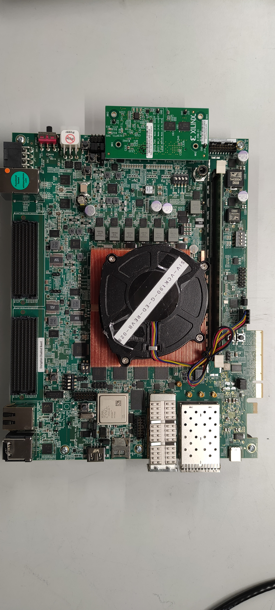
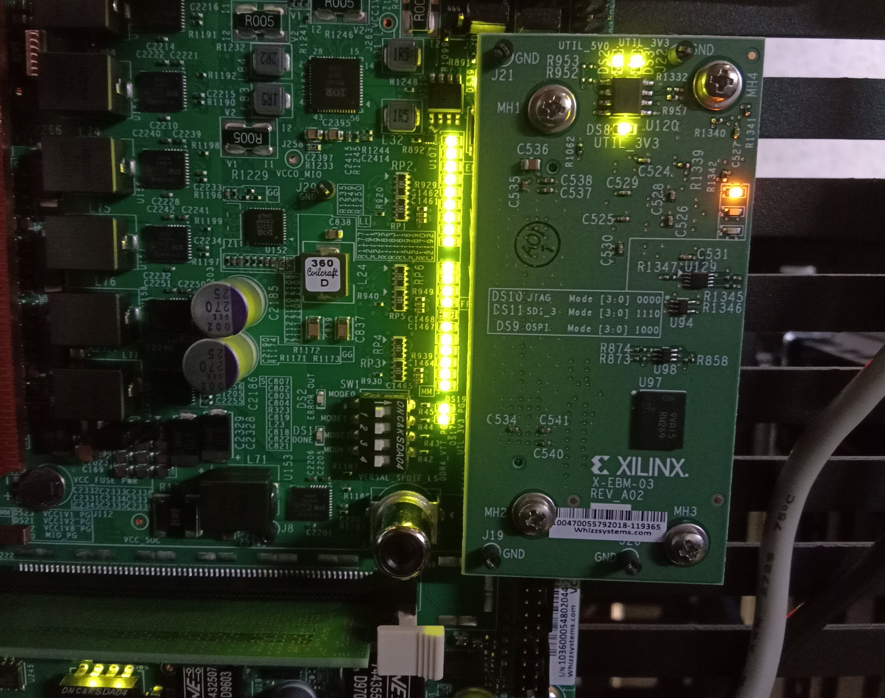
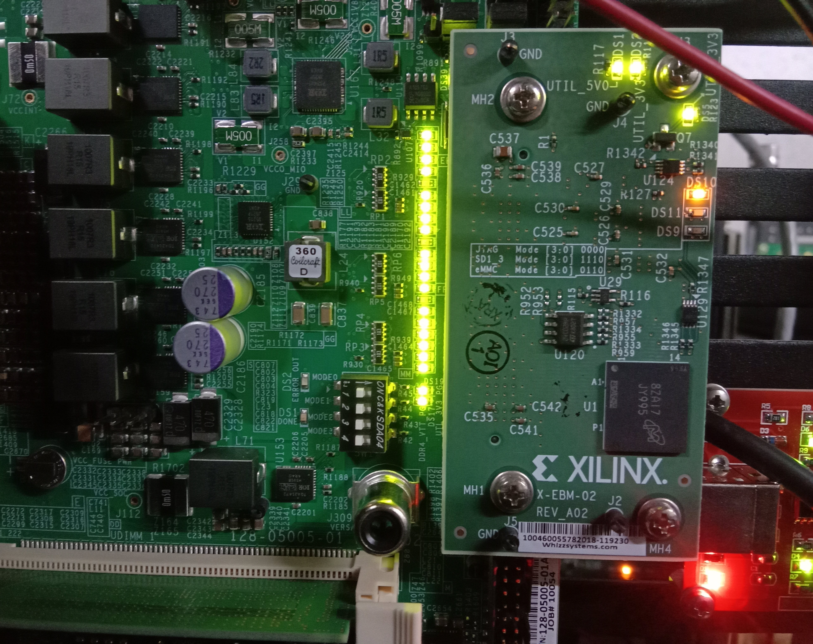

..
   Copyright 2000-2021 Xilinx, Inc.

   Licensed under the Apache License, Version 2.0 (the "License"); you may not use this file except in compliance with the License. You may obtain a copy of the License at

       http://www.apache.org/licenses/LICENSE-2.0

   Unless required by applicable law or agreed to in writing, software distributed under the License is distributed on an "AS IS" BASIS, WITHOUT WARRANTIES OR CONDITIONS OF ANY KIND, either express or implied. See the License for the specific language governing permissions and
   limitations under the License.

**********************
Boot and Configuration
**********************

The purpose of this chapter is to show how to integrate and load boot loaders, bare-metal applications (For APU/RPU), and the Linux Operating System for a Versal |reg| ACAP. This chapter discusses the following topics:

- System software: PLM, Trusted firmware-A (TF-A), U-Boot
- Steps to generate boot image for standalone application.
- Boot sequences for SD boot, and QSPI and OSPI boot modes.

You can achieve these configurations using the Vitis |trade| software platform and the PetaLinux tool flow. While :doc:`../2-cips-noc-ip-config` focused only on creating software blocks for each processing unit in the PS, this chapter explains how these blocks can be loaded as a part of a larger system.

===============
System Software
===============

The following system software blocks cover most of the boot and configuration for this chapter.

Platform Loader and Manager
~~~~~~~~~~~~~~~~~~~~~~~~~~~

The platform loader and manager (PLM) is the software that runs on one of the dedicated processors in the Platform Management Controller (PMC) block of the Versal ACAP. It is responsible for boot and run time management, including platform management, error management, partial reconfiguration, and subsystem restart of the device. The PLM can reload images, and load partial PDIs and service interrupts. The PLM reads the programmable device image from the boot source and configures the components of the system, including the NoC initialization, DDR memory initialization, programmable logic, and processing system, and then completes the device boot.

U-Boot
~~~~~~

U-Boot acts as a secondary boot loader. After the PLM handoff, U-Boot loads Linux onto the Arm A72 APU and configures the rest of the peripherals in the processing system based on the board configuration. U-Boot can fetch images from various memory sources like eMMC, SATA, TFTP, SD, and QSPI. U-Boot can be configured and built using the PetaLinux tool flow.

Trusted Firmware-A
~~~~~~~~~~~~~~~~~~~~

The Trusted Firmware-A (ATF) is a transparent bare-metal application layer executed in Exception Level 3 (EL3) on the APU. The ATF includes a Secure Monitor layer for switching between the secure and the non-secure world. The Secure Monitor calls and implementation of Trusted Board Boot Requirements (TBBR) makes the ATF layer a mandatory requirement to load Linux on the APU on Versal ACAP. The PLM loads the ATF to be executed by the APU, which keeps running in EL3 awaiting a service request. The PLM also loads U-Boot into the DDR memory to be executed by the APU. The DDR memory loads the Linux OS in the SMP mode on the APU. The ATF (`bl31.elf`) is built, by default, in PetaLinux. You can find it in the PetaLinux project images directory.

.. _generating-boot-image-for-standalone-application:

================================================
Generating Boot Image for Standalone Application
================================================

The Vitis software platform supports boot image creation wizard for Versal ACAP. To generate a boot image PDI or ``Boot.bin``, you can either use Bootgen command line options or use the wizard in Vitis. This tutorial shows how to create Boot image using Bootgen, which is released as a part of the Vitis software platform package. The primary function of Bootgen is to integrate the various partitions of the bootable image. Bootgen uses a BIF file (Bootgen Image Format) as an input and generates a single file image in binary BIN or PDI format. It outputs a single file image which can be loaded into non-volatile memory (QSPI or SD card). Use the following steps to generate a PDI/BIN file:

1. Open the XSCT Console view in the Vitis IDE, if not already open, by clicking on **Window → Show View**. Type `xsct console` within the search bar of the Show View wizard. Click **Open** to open the console.

   .. image:: ./media/image49.png

2. Create a folder where you want to generate the boot image by typing the following command in the XSCT Console:

   .. code-block::

        mkdir bootimages
        cd bootimages/
    
3. Copy the sd_boot.bif file present within the ``<design-package>/<board-name>/ready_to_test/qspi_images/standalone/<cips or cips_noc>/<apu or rpu>/`` directory, the PDI file present within ``<Vitis platform project>/hw/<.pdi-file>``, and the application elf files present within the ``<Vitis application-project>/Debug`` folder to the folder created in step 2.

   .. note:: If needed, open the `sd_boot.bif` file in a text editor of your choice and modify the name of the PDI or elfs as per your Vitis projects.

4. Run the following command in the XSCT Console view.

   .. code-block::

      bootgen -image <bif filename>.bif -arch versal -o BOOT.BIN

   The following log is displayed in the XSCT Console view.

   .. image:: ./media/image51.jpeg

======================================================
Loading Petalinux Images on a Versal Board using JTAG
======================================================

This section describes how to load Versal Petalinux images using JTAG mode on the Versal board. 

1. Build the Linux images using the command:

   .. code::
   
      $petalinux-build

2. Build the BOOT.BIN using the command: 

   .. code::
   
      $petalinux-package --boot --uboot

3. Create the Tcl script using `petalinux` command from the Versal project directory:

   .. code::
   
      $petalinux-boot --jtag --kernel --tcl versal.tcl

   .. note:: 
      
      The ``versal.tcl`` file includes commands to select appropriate targets and download application files to required locations in the DDR memory.

      .. image:: ./media/versal_tcl.JPG
 
4. Modify the generated `versal.tcl` file as follows:

   a. Rename `ramdisk.cpio.gz` to `rootfs.cpio.gz.u-boot` as this tutorial uses the `rootfs` image.
   b. Add the following lines to load `BOOT.BIN` to the DDR memory before the `con` command:

      .. code-block:: 

         puts stderr "INFO: Loading image: BOOT.BIN at 0x70000000" 
         dow -data -force "BOOT.BIN" 0x70000000
	 after 2000

5. Set the boot mode switch SW1 to ON-ON-ON-ON JTAG boot mode, as shown in the following figure.

   .. image:: ./media/jtag-boot-mode.png
      :width: 500

6. Configure the Tera Term serial application with default serial settings **115200,N8** and open the Tera Term console. 

7. In the XSCT console, connect to the target over JTAG using the `connect` command: 

   .. code::
   
      xsct% connect

   The connect command returns the channel ID of the connection.

8. Run the following target command to list the available targets and select a target using its ID.

   .. code::

      xsct% targets

   The IDs can change from session to session as the targets are assigned IDs as they are discovered on the JTAG chain.

9. Download the `versal.tcl` file which will load the `BOOT.BIN`, `rootfs.cpio.gz.uboot`, and `boot.scr` images on the DDR memory of the VCK190 board using the following commands:

   .. code-block::

      xsct% targets 1
      xsct% rst
      xsct > source versal.tcl

10. After running the preceding commands, you can see the PLM and U-Boot boot logs on the serial console. For example:

    .. code-block::

         U-Boot 2022.01 (Feb 16 2022 - 14:57:10 +0000)

	CPU:   Versal
	Silicon: v2
	Model: Xilinx Versal vck190 Eval board revA
	DRAM:  8 GiB
	EL Level:       EL2
	MMC:   mmc@f1050000: 0
	Loading Environment from nowhere... OK
	In:    serial@ff000000
	Out:   serial@ff000000
	Err:   serial@ff000000
	Bootmode: JTAG_MODE
	Net:
	ZYNQ GEM: ff0c0000, mdio bus ff0c0000, phyaddr 1, interface rgmii-id
	zynq_gem ethernet@ff0c0000: Failed to read eth PHY id, err: -2

	Warning: ethernet@ff0c0000 (eth0) using random MAC address - fe:77:f4:77:5c:c7
	eth0: ethernet@ff0c0000
	ZYNQ GEM: ff0d0000, mdio bus ff0c0000, phyaddr 2, interface rgmii-id
	zynq_gem ethernet@ff0d0000: Failed to read eth PHY id, err: -2

	Warning: ethernet@ff0d0000 (eth1) using random MAC address - c6:e7:dd:d5:b1:05
	, eth1: ethernet@ff0d0000
         Hit any key to stop autoboot:  5  4  3  2  0 
         Versal>

.. _boot-sequence-sd-boot-mode:
 	
==============================
Boot Sequence for SD-Boot Mode
==============================

The following steps demonstrate the boot sequence for the SD-boot mode.

1. To verify the image, copy the required images to the SD card:

   - For standalone, copy the `BOOT.BIN` to the SD card.

   - For Linux images, navigate to the `<plnx-proj-root>/images/linux` and copy `BOOT.BIN`, Image, `rootfs.cpio.gz.uboot`, `boot.scr` to the SD card.

   .. note:: You can either boot the VCK190/VMK180 board using the ready-to-test images as part of the released package path, ``<design-package>/<vck190 or vmk180>/ready_to_test/qspi_images/linux/``, or refer to :ref:`creating-linux-images-using-petalinux` to build your own set of Linux images using the PetaLinux tool.

2. Load the SD card into the VMK180/VCK190 board in the J302 connector.

3. Connect the Micro USB cable into the VMK180/VCK190 Board Micro USB port (J207), and the other end into an open USB port on the host machine.

4. Configure the board to boot in SD-Boot mode (1-ON, 2-OFF, 3-OFF, 4-OFF) by setting the SW1 switch as shown in the following figure.

   .. image:: ./media/sd_boot_mode.JPG

5. Connect 12V power to the VMK180/VCK190 6-Pin Molex connector.

6. Start a terminal session using Tera Term or Minicom depending on the host machine being used. Set the COM port and baud rate for your system, as shown in the following figure.

   .. image:: ./media/image46.png

7. For port settings, verify COM Port in the device manager and select the com port with interface-0.

8. Turn on the VMK180/VCK190 board using the power switch (SW13).

   .. note:: Logs for standalone images are displayed on the terminal. For Linux images, you can log in using `user: root` and `pw: root` after the boot-up sequence on the terminal. After that, run `gpiotest` on the terminal. You will see logs as shown in the following figure.

   .. image:: ./media/led_example_console_prints.PNG

================================
Boot Sequence for QSPI Boot Mode
================================

This section demonstrates the boot sequence for the QSPI boot mode. For this, you need to connect a QSPI daughter card (part number: X_EBM-01, REV_A01) as shown in the following figure:

*Figure 2:* **Daughter Card on VCK190**

.. note:: For standalone, copy the BOOT.BIN to the SD card. For Linux images, you can either boot the VCK190/VMK180 board using the ready-to-test images as part of the released package path, ``<design-package>/<vck190 or vmk180>/ready_to_test/qspi_images/linux/``, or refer to :ref:`creating-linux-images-using-petalinux` to build your own set of Linux images using the PetaLinux tool.

You need to flash the images to the daughter card using the following steps:

.. note:: The following steps use the SD boot mode to load an image to indirectly program the QSPI Flash.

1. With the card powered off, install the QSPI daughter card.

2. Power on the board. Refer to section Loading Petalinux images on Veral Board using JTAG on how to load images on the DDR memory over JTAG.

3. At the U-Boot stage, when the message **Hit any key to stop autoboot:** appears, hit any key, then run the following commands to flash the images on the QSPI daughter card:

   .. code-block::
      
         // check QSPI is available or not
         sf probe 0 0 0
         // Erase QSPI Flash of size 256 MB
         sf erase 0x0 0x10000000
         // Copy BOOT.BIN file from DDR address,0x70000000 to QSPI Flash address,0x0
         sf write 0x70000000 0x0 <BOOT.BIN_filesize_in_hex>
         // Copy Image file from DDR address,0x00200000 to QSPI Flash address,0xF00000
         sf write 0x00200000 0xF00000 <Image_filesize_in_hex>
         // Copy rootfs.cpio.gz.u-boot file from DDR address,0x04000000 to QSPI Flash address,0x2E00000
         sf write 0x04000000 0x2E00000 <rootfs.cpio.gz.u-boot_filesize_in_hex>
         // Copy boot.scr file from DDR address,0x20000000  to QSPI Flash address,0x7F80000
         sf write 0x20000000 0x7F80000 <boot.scr_filesize_in_hex>

4. After flashing the images, turn off the power switch on the board, and change the SW1 boot mode pin settings to QSPI boot mode (ON-OFF-ON-ON, M[0:3] = 0100) as shown in the following figure:

   .. image:: ./media/image52.png
      :width: 600

5. Power cycle the board. The board now boots up using the images in the QSPI flash.

================================
Boot Sequence for OSPI Boot Mode
================================

To configure the design for the OSPI boot mode, see OSPI Boot Mode Configuration. This section demonstrates the boot sequence for the OSPI boot mode. For this, you need to connect an OSPI daughter card (part number X-EBM-03 REV_A02) as shown in the following figure:

.. note:: The OSPI daughter card is not provided with the VCK190 Kit. 

.. note:: For standalone, copy the `BOOT.BIN` to the SD card. For Linux images, you can either boot the VCK190 or VMK180 board using the ready-to-test images as part of the released package path, ``<design-package>/<vck190 or vmk180>/ready_to_test/ospi_images/linux``, or refer to :ref:`creating-linux-images-using-petalinux` to build your own set of Linux images using the PetaLinux tool.

To flash the images to the daughter card, use the following steps:

.. note:: The following steps use the SD boot mode to load an image to indirectly program the OSPI Flash.

1. With the card powered off, install the OSPI daughter card.
   
2. Power on the board. Refer to section Loading Petalinux images on Veral Board using JTAG on how to load images on the DDR memory over JTAG.
   
3. At the U-Boot stage, when the message **Hit any key to stop autoboot:** appears, hit any key, then run the following commands to flash the images on the OSPI daughter card:

   .. code-block::
      
         // Check if OSPI flash is available or not
         sf probe 0 0 0
         // Erase the OSPI Flash of size 256 MB
         sf erase 0x0 0x10000000
         // Copy BOOT.BIN file from DDR address,0x70000000 to OSPI Flash address,0x0
         sf write 0x70000000 0x0 <BOOT.BIN_filesize_in_hex>
         // Copy Image file from DDR address,0x00200000 to QSPI Flash address,0xF00000
         sf write 0x00200000 0xF00000 <Image_filesize_in_hex>
         // Copy rootfs.cpio.gz.u-boot file from DDR address,0x04000000 to OSPI Flash address,0x2E00000
         sf write 0x04000000 0x2E00000 <rootfs.cpio.gz.u-boot_filesize_in_hex>
         // Copy boot.scr file from DDR address,0x20000000 to OSPI Flash address,0x7F80000
         sf write 0x20000000 0x7F80000 <boot.scr_filesize_in_hex>

4. After flashing the images, turn off the power switch on the board.
   
5. Change the SW1 boot mode pin settings to OSPI boot mode, that is, MODE[0:3] pins = 0001, ON-ON-ON-OFF.
   
6. Power cycle the board. The board now boots up using the images in the OSPI flash.

.. note:: For the VMK180 production board, OSPI images are not provided as part of the design package. Only VCK190 OSPI images are shared as part of the design package.

================================
Boot Sequence for eMMC Boot Mode
================================

To configure the design for the eMMC boot mode, see eMMC Boot Mode Configuration. This section demonstrates the boot sequence for the eMMC boot mode. For this, you need to connect an eMMC daughter card (part number X-EBM-02, REV_A02) as shown in the following figure:

.. note:: The eMMC daughter card is not provided with the VCK190 Kit. 

.. note:: For standalone, copy the BOOT.BIN to the SD card. For Linux images, you can either boot the VCK190 or vmk180 board using the ready-to-test images as part of the released package path, ``<designpackage>/<vck190 or YAML_DT_BOARD_FLAGS_vmk180>/ready_to_test/emmc_images/linux``, or refer to :ref:`creating-linux-images-using-petalinux` to build your own set of Linux images using the PetaLinux tool.

To format the eMMC flash on the Versal ACAP board for the first time, use the following steps:

1. With the card powered off, install the eMMC daughter card.

2. Set the boot mode switch SW1 to ON-ON-ON-ON JTAG Boot mode, as shown in the following figure.

   .. image:: ./media/vck190_jtag_boot_mode_sw1_settings.png
      :width: 500

   This example uses the XSCT console to download a BOOT image file (BOOT.BIN). It uses the U-Boot console to load Linux images to format the eMMC flash.

3. Ensure that the Ethernet cable is connected from the host to the board. Set up dhcp and tftpb server on the host. 

4. Copy the Linux images `BOOT.BIN`, Image, `rootfs.cpio.gz.u-boot`, and `boot.scr` to host tftp home directory.

5. In the XSCT console, connect to the target over JTAG using the `connect` command:

   .. code-block::
   
       xsct% connect

   The connect command returns the channel ID of the connection. 

6. Run the `target` command to list the available targets and to select a target using its ID. The targets are assigned IDs as they are discovered on the JTAG chain, so the IDs can change from session to session.

   .. code-block::

	 xsct% targets

7. Download the BOOT.BIN on the VCK190 board using the following commands to get the U-Boot console.

   .. code-block::
   
		xsct% targets 1
		xsct% rst
		xsct% device program BOOT.BIN

   After executing this command, you can see the PLM and U-Boot boot logs on the serial console.

8. At the U-Boot stage, when the message **"Hit any key to stop autoboot:"** appears, hit any key, then run the following commands to flash the images on the eMMC daughter card:

   .. code-block::

        dhcp
        tftpboot 0x80000 Image
        tftpboot 0x2000000 rootfs.cpio.gz.u-boot
        booti 0x80000 0x2000000 0x1000          

   After executing the previous U-Boot commands, Linux starts booting and stops at Linux console prompt waiting for user input commands.

9. Run the following commands from the Linux console prompt to create the eMMC Linux bootable partition and format the eMMC with FAT32 file system.

   .. code-block::
	
        xilinx-vck190-20221:~$ fdisk /dev/mmcblk0
        The number of cylinders for this disk is set to 233472.
        There is nothing wrong with that, but this is larger than 1024,
        and could in certain setups cause problems with:
        1) software that runs at boot time (e.g., old versions of LILO)
        2) booting and partitioning software from other OSs
        (e.g., DOS FDISK, OS/2 FDISK)

        Command (m for help): m
        Command Action
        a       toggle a bootable flag  
        b       edit bsd disklabel
        c       toggle the dos compatibility flag
        d       delete a partition
        l       list known partition types
        n       add a new partition
        o       create a new empty DOS partition table
        p       print the partition table
        q       quit without saving changes
        s       create a new empty Sun disklabel
        t       change a partition's system id
        u       change display/entry units
        v       verify the partition table
        w       write table to disk and exit

        Command (m for help): n
        Partition type
        p   primary partition (1-4)
        e   extended
        p
        Partition number (1-4): 1
        First sector (16-14942207, default 16):
        Using default value 16
        Last sector or +size{,K,M,G,T} (16-14942207, default 14942207):
        Using default value 14942207

        Command (m for help): w
        The partition table has been altered.
        Calling ioctl() to re-read partition table
        fdisk: WARNING: rereading partition table failed, kernel still uses old table: Device or resource busy

        xilinx-vck190-20221:~$ mkfs.vfat -F 32 -n boot /dev/mmcblk0p1

   eMMC flash is formatted with the FAT32 filesystem.

Flashing Linux Images to the eMMC Flash
~~~~~~~~~~~~~~~~~~~~~~~~~~~~~~~~~~~~~~~~

To flash the Linux images to the eMMC Flash, use the following steps:

1. With the card powered off, install the eMMC daughter card.

2. Set the boot mode switch SW1 to ON-ON-ON-ON JTAG Boot mode.

3. Power on the board. Refer to `Loading Petalinux Images on a Versal Board using JTAG <#loading-petalinux-images-on-a-versal-board-using-jtag>`__ on how to load images on the DDR memory over JTAG.

4. At the U-Boot stage, when the message **Hit any key to stop autoboot:** appears, hit any key, then run the following commands to flash the images on the eMMC daughter card:

   .. code-block::
      
         // Check emmc is  FAT filesystem formatted or not.
         fatls mmc 0
         // copy BOOT.BIN file from DDR address,0x70000000 to emmc
         fatwrite mmc 0 0x70000000 BOOT.BIN <size in hex>
         // copy Image file from DDR address,0x00200000 to emmc
         fatwrite mmc 0 0x00200000 Image <size in hex>
         // copy rootfs.cpio.gz.u-boot file from DDR address,0x04000000 to emmc
         fatwrite mmc 0 0x04000000 rootfs.cpio.gz.u-boot <size in hex>
         // copy boot.scr file from DDR address, 0x20000000 to emmc
         fatwrite mmc 0 0x20000000 boot.scr <size in hex>

5. After flashing the images, turn off the power switch on the board, and change the SW1 boot mode pin settings to eMMC boot mode, ON-OFF-OFF-ON (MODE[0:3]= 0110).

6. Power cycle the board. The board now boots up using the images in the eMMC flash.

.. |trade|  unicode:: U+02122 .. TRADEMARK SIGN
   :ltrim:
.. |reg|    unicode:: U+000AE .. REGISTERED TRADEMARK SIGN
   :ltrim:

