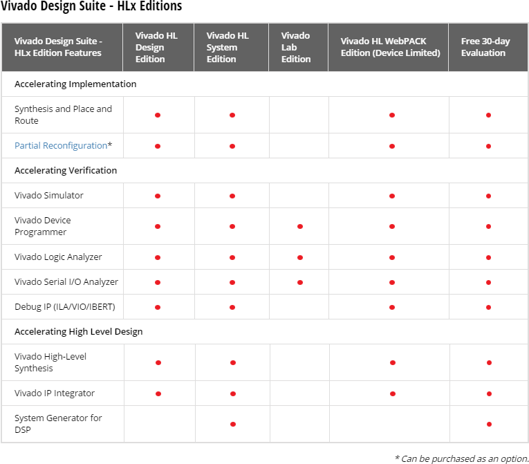
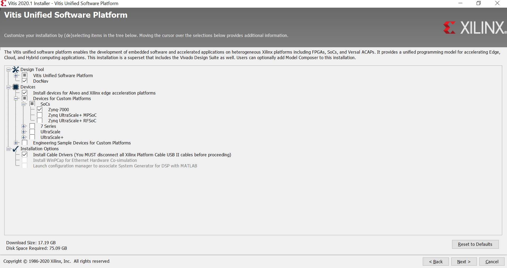

<th width="100%" colspan="6"><h1>Zynq-7000 SoC Embedded Design Tutorial 2020.2 (UG1165)</h1>
</th>

  </tr>

</table>

# Introduction

## How Zynq Devices Simplify Embedded Processor Design

Embedded systems are complex. Hardware and software portions of an embedded design are projects in themselves. Merging the two design components so that they function as one system creates additional challenges. Add an FPGA design project to the mix, and your design has the potential to become complicated.

The Zynq SoC solution reduces this complexity by offering an Arm&reg; Cortex&trade;-A9 dual core, along with programmable logic, all within a single SoC. To simplify the design process, Xilinx offers the Vivado Design Suite and the Vitis software platform. This set of tools provides you with everything you need to simplify embedded system design for a device that merges an SoC with an FPGA. This combination of tools offers hardware and software application design, debugging capability, code execution, and transfer of the design onto actual boards for verification and validation.

### Vivado Design Suite, System Edition

Xilinx offers a broad range of development system tools, collectively
called the Vivado&reg; Design Suite. Various Vivado Design Suite editions
can be used for embedded system development. In this guide, you will
use the System Edition. The Vivado Design Suite editions are shown in
the following figure.

### Other Vivado Components

Other Vivado components include:

-   Embedded/soft IP for Xilinx embedded processors

-   Documentation

-   Sample projects

## Vitis Unified Software Platform

The Vitis&trade; software platform includes the Vivado Design Suite, and
works with hardware designs created in Vivado. The Vitis unified
software platform is an integrated development environment (IDE) for
the development of embedded software applications targeted towards
Xilinx embedded processors. The Vitis software platform is based on
the Eclipse open source. For more information about the Eclipse
development environment, see
[http://www.eclipse.org](http://www.eclipse.org/).

## PetaLinux Tools

The PetaLinux tools offer everything necessary to customize, build, and deploy embedded Linux solutions on Xilinx processing systems. For more information, see the [Embedded Design Tools](https://www.xilinx.com/support/download/index.html/content/xilinx/en/downloadNav/embedded-design-tools.html) web page.

The PetaLinux Tools design hub provides information and links to documentation specific to the PetaLinux Tools. For more information, see [Embedded Design Hub - PetaLinux Tools](https://www.xilinx.com/cgi-bin/docs/ndoc?t=design%2Bhubs%3Bd%3Ddh0016-petalinux-tools-hub.html).

## How the Xilinx Design Tools Expedite the Design Process

You can use the Vivado Design Suite tools to add design sources to your hardware. These include the IP integrator, which simplifies the process of adding IP to your existing project and creating connections for ports (such as clock and reset).

You can accomplish all your hardware system development using the Vivado tools along with IP integrator. This includes specification of the microprocessor, peripherals, and the interconnection of these components, along with their respective detailed configuration.

The Vitis software platform is used for software development, and can be installed and used without any other Xilinx tools installed on the machine on which it is loaded. The Vitis software platform can also be used to debug software applications.

The Zynq SoC Processing System (PS) can be booted and made to run without programming the FPGA (programmable logic or PL). However, in order to use any soft IP in the fabric, or to bond out PS peripherals using EMIO, programming of the PL is required. You can program the PL in the Vitis software platform.

For more information on the embedded design process, see the *Vivado Design Suite Tutorial: Embedded Processor Hardware Design* ([UG940](https://www.xilinx.com/cgi-bin/docs/rdoc?v=2020.2%3Bd%3Dug940-vivado-tutorial-embedded-design.pdf)).

## Getting Started

### Hardware Requirements for this Guide

This tutorial targets the Zynq ZC702 Rev 1.0 evaluation board, and can also be used for Rev 1.0 boards. To use this guide, you need the following hardware items, which are included with the evaluation board:

-   The ZC702 evaluation board

-   AC power adapter (12 VDC)

-   USB Type-A to USB Mini-B cable (for UART communications)

-   USB Type-A to USB Micro cable for programming and debugging via
    USB-Micro JTAG connection

-   SD-MMC flash card for Linux booting

-   Ethernet cable to connect target board with host machine

### Installation Requirements

#### Vitis Software Platform and Vivado Design Suite

Ensure that you have both the Vitis software platform and the Vivado Design Suite installed. Visit the [Xilinx Support Page](https://www.xilinx.com/support/download.html) to ensure that you download the latest software version. To install the Vitis software platform, follow the instructions in the Installation section of the
*Vitis Unified Software Platform Documentation: Embedded Software Development* ([UG1400](https://www.xilinx.com/cgi-bin/docs/rdoc?v=2020.2%3Bd%3Dug1400-vitis-embedded.pdf)). When you install the Vitis software platform, the Vivado Design Suite
is installed automatically.

To install Vivado by itself, see the *Vivado Design Suite User Guide: Release Notes, Installation, and Licensing* ([UG973](https://www.xilinx.com/cgi-bin/docs/rdoc?v=2020.2%3Bt%3Dvivado%2Binstall%2Bguide)).

#### PetaLinux Tools

The PetaLinux tool offers a full Linux distribution building system which includes the Linux OS as well as a complete configuration, build, and deploy environment for Xilinx silicon.

Install the PetaLinux Tools to run through the Linux portion of this tutorial. PetaLinux tools run under the Linux host system running one of the following:

-   Red Hat Enterprise Workstation/Server 7.4, 7.5, 7.6 (64-bit)

-   CentOS Workstation/Server 7.4, 7.5, 7.6 (64-bit)

-   Ubuntu Linux Workstation/Server 16.04.5, 16.04.6, 18.04.1, 18.04.02
    (64-bit)

This can use either a dedicated Linux host system or a virtual machine running one of these Linux operating systems on your Windows development platform.

When you install PetaLinux Tools on your system of choice, you must do the following:

-   Download PetaLinux software (version 2020.2) from the Xilinx
    Website.

-   Install the PetaLinux (version 2020.2) release package.

-   Add common system packages and libraries to the workstation or
    virtual machine. For more details, see the Installation
    Requirements from the *PetaLinux Tools Documentation: Reference
    Guide* ([UG1144](https://www.xilinx.com/cgi-bin/docs/rdoc?v=2020.2%3Bd%3Dug1144-petalinux-tools-reference-guide.pdf))
    .

###### Prerequisites

-   8 GB RAM (recommended minimum for Xilinx tools)

-   2 GHz CPU clock or equivalent (minimum of 8 cores)

-   100 GB free HDD space

###### Extract the PetaLinux Package

By default, the installer installs the package as a subdirectory within the current directory. Alternatively, you can specify an installation path. Run the downloaded PetaLinux installer.

**Note:** Ensure that the PetaLinux installation path is kept short. The PetaLinux build will fail if the path exceeds 255 characters.

`bash ./petalinux-v2020.2-final-installer.run`

PetaLinux is installed in the petalinux-v2020.2-final directory, directly underneath the working directory of this command. If the installer is placed in the home directory /home/user, PetaLinux is installed in /home/user/petalinux-v2020.2-final.

Refer to [Linux Booting and Debug in the Vitis Software Platform](./7-linux-booting-debug.md) for additional information about the PetaLinux environment setup, project creation, and project usage examples. A detailed guide on PetaLinux Installation and usage can be found in the *PetaLinux Tools Documentation: Reference Guide* ([UG1144](https://www.xilinx.com/cgi-bin/docs/rdoc?v=2020.2%3Bd%3Dug1144-petalinux-tools-reference-guide.pdf)).

#### Software Licensing

Xilinx software uses FLEXnet licensing. When the software is first run, it performs a license verification process. If the license verification does not find a valid license, the license wizard guides you through the process of obtaining a license and ensuring that the license can be used with the tools installed. If you do not need the full version of the software, you can use an evaluation license.For installation instructions and information, see the *Vivado Design Suite User Guide: Release Notes, Installation, and Licensing* ([UG973](https://www.xilinx.com/cgi-bin/docs/rdoc?v=2020.2%3Bt%3Dvivado%2Binstall%2Bguide)).

## Design Files for this Tutorial

The reference design files for this tutorial are provided in the [ref_files](./ref_files/) directory, organized with design number or chapter name. Chapters that need to use reference files will point to the specific ``ref_files`` subdirectory.

Design files contain the source code for all the sections.

Work through the first examples in the [next chapter](./2-using-zynq.md).

© Copyright 2015–2021 Xilinx, Inc.

Licensed under the Apache License, Version 2.0 (the "License"); you may not use this file except in compliance with the License. You may obtain a copy of the License at

http://www.apache.org/licenses/LICENSE-2.0

Unless required by applicable law or agreed to in writing, software distributed under the License is distributed on an "AS IS" BASIS, WITHOUT WARRANTIES OR CONDITIONS OF ANY KIND, either express or implied. See the License for the specific language governing permissions and limitations under the License.