# Using the Zynq SoC Processing System

Now that you have been introduced to the Xilinx&reg; Vivado&reg; Design Suite, you can look at how to use it to develop an embedded system using the Zynq&reg;-7000 SoC processing system (PS).

The Zynq SoC consists of Arm&reg; Cortex&trade;-A9 cores, many hard intellectual property components (IPs), and programmable logic (PL). This offering can be used in two ways:

-   The Zynq SoC PS can be used in a standalone mode, without attaching any additional fabric IP.
-   IP cores can be instantiated in fabric and attached to the Zynq PS as a PS+PL combination.

## Embedded System Configuration

Creation of a Zynq device system design involves configuring the PS to
select the appropriate boot devices and peripherals. To start with, as
long as the PS peripherals and available MIO connections meet the
design requirements, no bitstream is required. This chapter guides you
through creating a simple PS-based design that does not require a
bitstream.

## Example 1: Creating a New Embedded Project with Zynq SoC

For this example, you will launch the Vivado Design Suite and create a project with an embedded processor system as the top level.

### Input and Output Files

- Input Files: N/A
- Output Files: Vivado hardware handoff file system_wrapper.xsa

### Creating Your Hardware Design

1.  Start the Vivado Design Suite.

    - On Windows 10, click the start menu and find **Xilinx Design Tools -> Vivado 2020.2**.
    - On Linux, run `source <Vivado installation path>/settings64.sh` to set up the environment and run ``vivado &`` to launch the Vivado IDE.

2.  In the Vivado Quick Start page, click **Create Project** to open the New Project wizard.

3.  Use the information in the table below to make selections in each of the wizard screens.

    | Screen              | System Property                                                                            | Setting or Command to Use     |
    | ------------------- | ------------------------------------------------------------------------------------------ | ----------------------------- |
    | Project Name        | Project name                                                                               | edt_zc702                     |
    |                     | Project Location                                                                           | C:/edt                        |
    |                     | Create Project Subdirectory                                                                | Leave this checked.            |
    |                     | Project is an extensible Vitis platform                                                    | Leave this unchecked.          |
    | Project Type        | Specify the type of sources for your design. You can start with RTL or a synthesized EDIF. | RTL Project                   |
    |                     | Do not specify sources at this time                                                        | Leave this checked.            |
    |                     | Project is a an extensible Vitis platform                                                  | Leave this unchecked.          |
    | Default Part        | Choose a default Xilinx part or board for your project                                     | Select the Boards tab.           |
    |                     | Boards                                                                                     | ZYNQ-7 ZC702 Evaluation Board |
    | New Project Summary | Project Summary                                                                            | Review the project summary.   |

4.  Click **Finish**. The New Project wizard closes and the project you just created opens in the Vivado design tool.

### Creating an Embedded Processor Block Diagram

Perform the following steps to create an embedded processor project.

1. Create a new block diagram:

   - In the Flow Navigator, under **IP Integrator**, click **Create Block Design**.  
   - The Create Block Design dialog box opens.
   - Update **Design Name** if necessary. In this example, let's change it to **system**.
   - Click **OK**.

    The Diagram window opens with a message that states that this design
    is empty. To get started, you will next add some IP from the catalog.

2.  Add the  ZYNQ Processing System IP to the block diagram:

    - Click the **Add IP** button. 
    - In the search box, type **zynq** to find the Zynq device IP options.
    - Double-click the **ZYNQ7 Processing System** IP to add it to the block design.

    The ZYNQ Processing System IP block appears in the Diagram view, as shown in the following figure.

    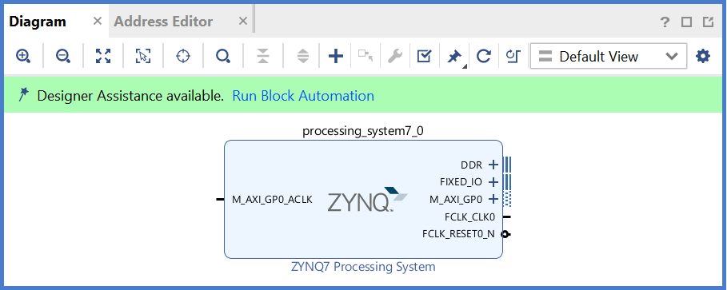

### Configuring the Zynq-7000 Processing System with Presets in Vivado

In the Block Diagram window, notice the message stating that Designer assistance is available, as shown in the following figure.

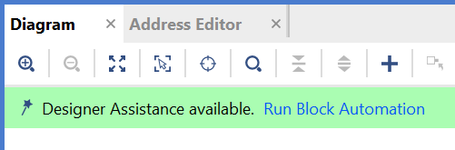

1.  Click the **Run Block Automation** link. The Run Block Automation
    view opens.

    Note that Cross Trigger In and Cross Trigger Out are disabled. For a
    detailed tutorial with information about cross trigger set-up, refer
    to the _Vivado Design Suite Tutorial: Embedded Processor Hardware Design_ ([UG940](https://www.xilinx.com/cgi-bin/docs/rdoc?v=2020.2;d=ug940-vivado-tutorial-embedded-design.pdf)).

2.  Click **OK** to accept the default processor system options and make default pin connections.

    The automation result looks like this. It configures PS properties inside the block and connects fixed IO and DDR pins.

    

### Validating the Design and Connecting Ports

Now, let's validate the design.

1.  Right-click in the white space of the Diagram window and select **Validate Design**. Alternatively, you can press the **F6** key or the check button on the block diagram toolbar.

    - A critical message appears, indicating that the ``M_AXI_GP0_ACLK`` must be connected.

    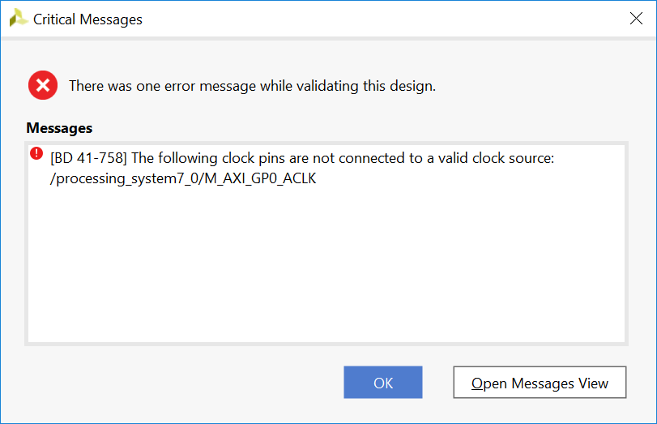

    - Click **OK** to close the message window.

2.  Connect the ``M_AXI_GP0_ACLK`` signal to PS generated PL clock signal.

    - The PS can generate four clock signals with ``FCLK_CLK<number>``. These are the clocks for the PL fabric. The clock frequency can be adjusted in PS block settings.
    - In the Diagram window of the ZYNQ7 Processing System block, locate the **M_AXI_GP0_ACLK** port. Hover your mouse over the connector port until the pencil button appears.
    - Click the **M_AXI_GP0_ACLK** port and drag to the **FCLK_CLK0** port to make a connection between the two ports.

    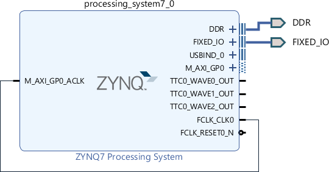

3.  Validate the design again to ensure there are no other errors.

    - Right-click in the white space of the Diagram window and select **Validate Design**.

    A dialog box with the following message opens:

    ```
    Validation successful. There are no errors or critical warnings in this design.
    ```

    - Click **OK** to close the message.

### Creating an HDL Wrapper for the Block Diagram

1.  Click the **Sources** window.

    - It should be in **Hierarchy** tab by default. If it's not there, click the **Hierarchy** tab.

2.  Expand **Design Sources**, right-click the block diagram file **system(system.bd)**, and select **Create HDL Wrapper**.

    The Create HDL Wrapper view opens. You will use this view to create an HDL wrapper file for the processor subsystem.

    **TIP:** The HDL wrapper is a top-level entity required by the design tools.

3.  Select **Let Vivado manage wrapper and auto-update** and click **OK**.

    - ``system_wrapper.v`` is generated. It is set to the top module of this design automatically.


### Generating the Block Design

1.  In **Flow Navigator** window, click **Generate Block Design** under **IP Integrator**.

2.  Change the Synthesis Options to **Global**.

    **Note:**  If the synthesis option is **Global**, only wrapper files are generated during the block design generation phase, and the design will be synthesized as a whole at the synthesis stage. If the synthesis option is **Out of context per IP** or **Out of context per Block design**, the wrapper of the IP or block design will be generated and synthesized during block design generation, and the generated netlists will be combined together at the synthesis stage.

3.  Click **Generate**.

    This step builds all the required output products for the selected source. For example, constraints do not need to be manually created for the IP processor system. The Vivado tools automatically generate the XDC file for the processor subsystem when **Generate Output Products** is selected.

4.  When the Generate Output Products process completes, click **OK**.

5.  In the Sources window, click the **IP Sources** view. Here you can
    see the output products that you just generated, as shown in the
    following figure.

    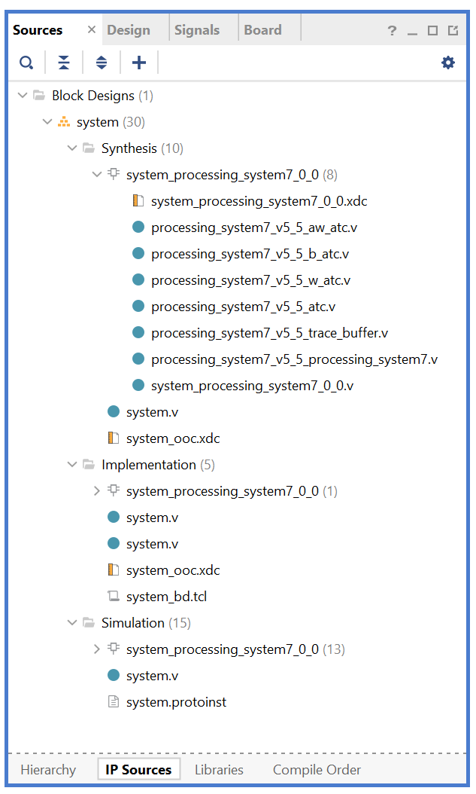


### Exporting Hardware

Two types of hardware can be exported from Vivado: pre-synthesis and post-implementation. In the block design for this example, the hardware in the PL is the signal from ``FCLK_CLK0`` to ``M_AXI_GP0_ACLK``. It drives the clock of ``M_AXI_GP0``. Because only pure PS functions will be tested in this example and PL resources will not be used, no loads are added to the ``M_AXI_GP0`` AXI interface. You can skip the synthesis, implementation and bitstream generation phases to save time. We will export the pre-synthesis hardware in this case.

1.  From the Vivado main menu, select **File→ Export → Export Hardware**. The Export Hardware Platform wizard opens.

2.  Use the information in the following table to make selections in each of the wizard screens. Click **Next** wherever necessary.

   | Screen | System Property | Setting or Command to Use |
   | ------------- | --------------- | ------------------------- |
   | Output        |                 | Pre-synthesis.             |
   | Files         | XSA file name   | Leave as system_wrapper.   |
   |               | Export to       | Leave as C:/edt/edt_zc702. |

3.  Click **Finish**.

    - After a while, the Vivado Tcl Console reports the following message; ``system_wrapper.xsa`` is the exported hardware handoff file.

    ```
    write_hw_platform -fixed -force -file C:/edt/edt_zc702/system_wrapper.xsa
    INFO: [Vivado 12-4895] Creating Hardware Platform: C:/edt/edt_zc702/system_wrapper.xsa ...
    INFO: [Hsi 55-2053] elapsed time for repository (C:/Xilinx/Vivado/2020.2/data\embeddedsw) loading 1 seconds
    INFO: [Vivado 12-12467] The Hardware Platform can be used for Hardware
    INFO: [Vivado 12-4896] Successfully created Hardware Platform: C:/edt/edt_zc702/system_wrapper.xsa
    ```


**What's Next?**

Now you can start developing the software for your project using the Vitis software platform. The next sections help you create a software application for your hardware platform.


## Example 2: Creating and Running a "Hello World" Application

In this example, you will learn how to manage the board settings, make
cable connections, connect to the board through your PC, and run a
simple "Hello World" software application in JTAG mode using System
Debugger in the Vitis IDE.

### Input and Output Files

- Input Files: ``system_wrapper.xsa``
- Output Files: ``hello_world.elf``

### Setting Up the Board

1.  Connect the power cable to the board.

2.  Connect the USB UART cable to J17.

3.  Connect the USB JTAG cable:

    - Connect a micro USB cable between the host machine and the ZC702 target board U23. Be careful not to use J1 by mistake.
    - Make sure that the **SW10** switch settings for JTAG selection are set to choose USB JTAG:

      -   Bit-1 is 0
      -   Bit-2 is 1

    

**Note:** 0 = switch is open. 1 = switch is closed.

4.  Setup JTAG boot mode using the switch indicated in the following figure.

    - Ensure that jumpers **J27** and **J28** are placed on the side farther from the SD card slot.
    - Change the **SW16** switch setting as shown in the following figure.

    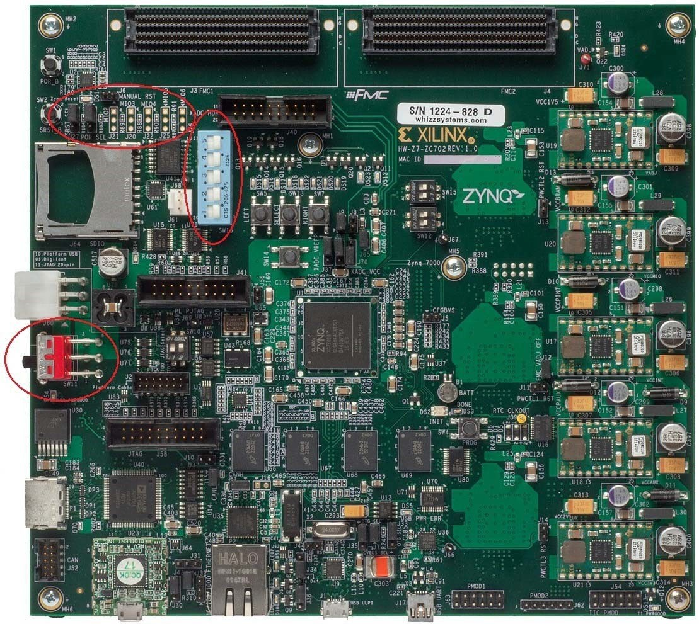

5. Power on the ZC702 board.

### Creating a Vitis Platform Project

1. Launch the Vitis IDE with any of the actions below:

    - From the Vivado IDE, select **Tools -> Launch Vitis IDE**.
    - On Windows, launch the Vitis IDE by using the desktop shortcut or **Windows start menu → Xilinx Design Suite → Xilinx Vitis 2020.2**.
    - On Linux, run `source <Vitis Installation Directory>/settings64.sh` to set up the environment and run `vitis &`.

2. Select the workspace location as **C:/edt/edt_zc702_workspace** or any given location path.

    - Vitis will create the workspace folder if it is not already created.

    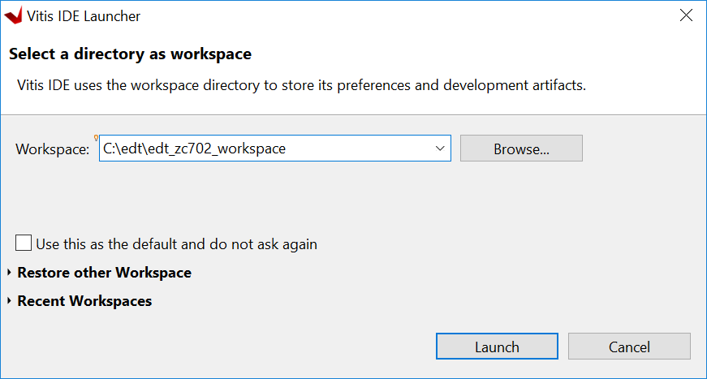

    - Click **Launch**. The Vitis IDE opens.

3. Review the Welcome page and close it.

4. Click **File → New → Platform Project** to create a platform project from the XSA file generated by Vivado.

    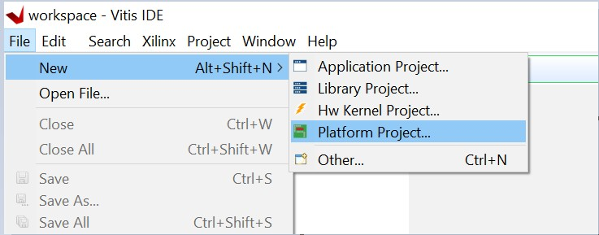

4.  When the New Platform Project wizard opens, enter the platform project name as **zc702_edt**, as shown in following figure. Click **Next**.

    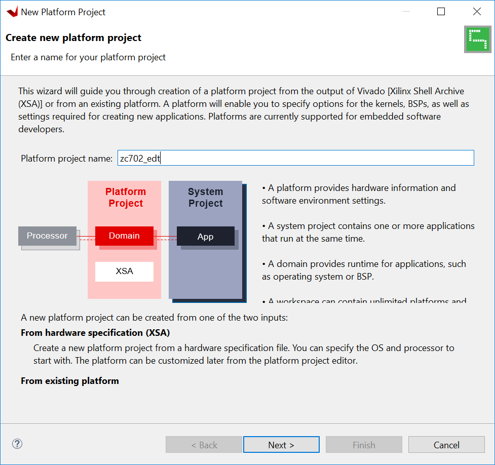

5.  In the **Platform** page, you see the **Create a new platform from hardware (XSA)** tab by default. Under **Hardware Specification**, click **browse** to specify the XSA file **C:\edt\edt_zc702\system_wrapper.xsa**, and click **OK**.

    - When the XSA file is selected, the Software Specification fields are updated so that the operating system is **standalone** and the processor is **ps7_cortexa9_0**.
    - Keep the **Generate boot components** option selected, as shown in the following figure.
    - Click **Finish**.

    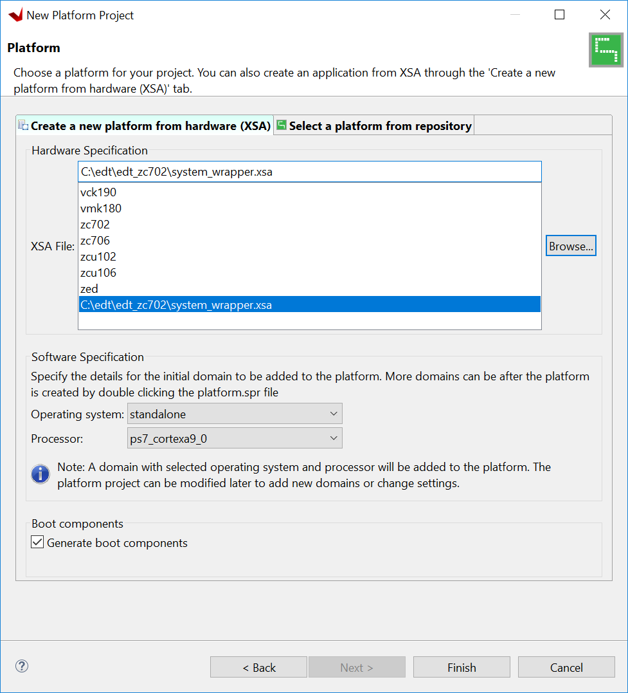    

6.  The platform project is created. In the **Explorer** view, double-click **zc702_edt → platform.spr** to view the platform view as shown in the following figure.

    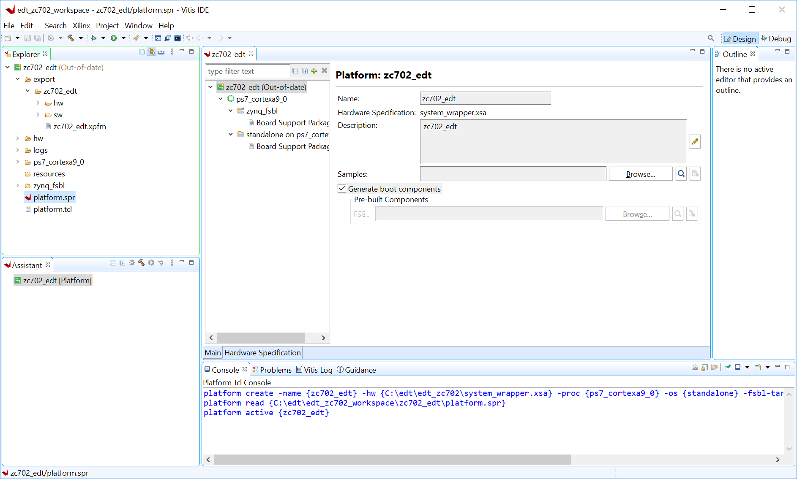

7.  In the **Explorer** view, expand **export → zc702_edt** to find the exported Hardware Specification file, ``system_wrapper.xsa`` (under the ``hw`` folder), and the top-level platform XML file, ``zc702_edt.xpfm``. Double-click on the XSA file to see the address
    map for the entire processing system, as shown in the following figure.

    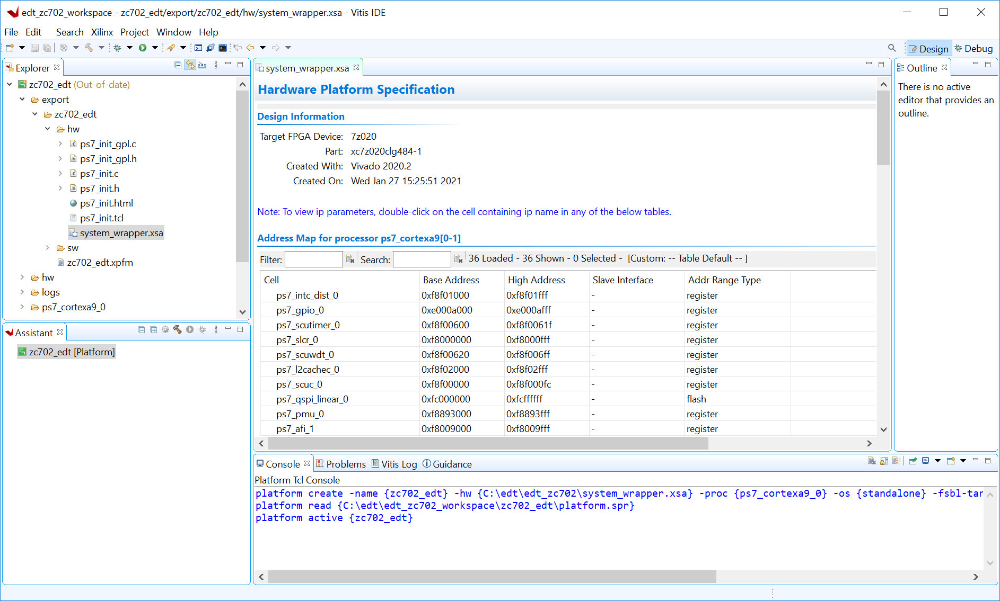

8.  Build the platform project either by clicking the hammer button or by right-clicking on the platform project and selecting **Build Project** as shown in following figure.

    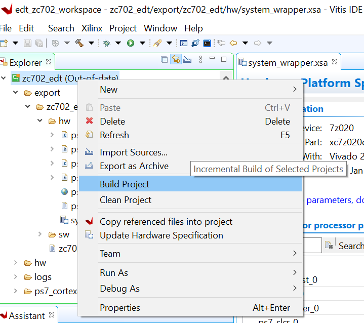

9.  As the project builds, you can see the output in the Console window.

    The build process takes some time because it is not only building the standalone BSP, but also boot components such as FSBL.


**What Just Happened?**

Using the Vitis IDE, you have created a platform project and exported
the XSA file to the workspace in the ``C:\\designs\\workspace``. The export
operation generated a standalone domain with a ps7_cortexa9_0
processor and an FSBL application project. You have built a platform
project, and the generated Xilinx platform definition file
(``zc702_edt.xpfm``) can be used as a platform for the applications that
you create in the Vitis IDE.

### Creating the Hello World application


1.  Select **File → New → Application Project**.

    The New Application Project wizard opens. Enable the option **Skip welcome page next time** and click **Next**.

2.  Use the information in the following table to make your selections
    in the wizard screens.

    | Screen                     | System Properties                             | Setting or Command to Use                  |
    | --------------------------------- | --------------------------------------------- | ------------------------------------------ |
    | Platform                          | Select a platform from repository             | Click zc702_edt [custom].                   |
    | Application Project Details       | Application project name                      | Enter hello_world.                          |
    |                                   | System project name                           | Keep hello_world_system.                    |
    |                                   | Target Processor                              | Keep ps7_cortexa9_0 selected.               |
    |                                   | Show all processors in hardware specification | Keep unchecked.                             |
    | Domain                            | Select a domain                               | Keep standalone on ps7_cortex9_0 selected. |
    | Templates                         | Available Templates                           | Hello World.                                |

    - Click **Finish**. The Vitis software platform creates the hello_world application project and hello_world_system project in the Explorer view.

    While entering the application project name, the Vitis IDE populates the system project name automatically with *<application name> + "_system"*. You are free to update the system project name if you wish.

    By default, the New Application Wizard only shows the processors used by the domains in the platform. If you want to create a new platform during the application creation process, enable the **Show all processors in hardware specification** option.

3. Right-click the **hello_world** standalone application and select **Build Project** to generate the ``hello_world.elf`` binary file.

### Running the Hello World Application on a ZC702 Board

1.  Open a serial communication utility for the COM port assigned on your system.

    The Vitis software platform provides a serial terminal utility will be used throughout the tutorial. You can also use your preferred serial terminal application.

    - To open this utility, select **Window → Show view**.
    - In the Show View dialog box, type **terminal** in the search box.
    - Select **Vitis Serial Terminal**.
    - Click **Open**.

    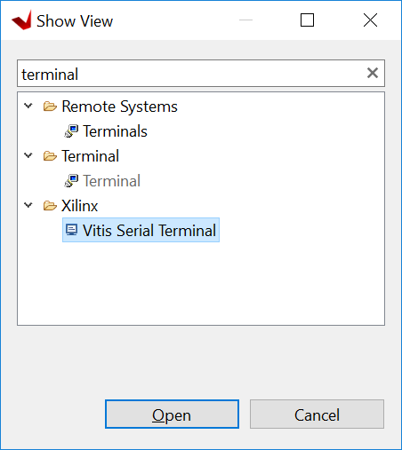    

2.  Click the **Add** button in the Vitis Serial Terminal to connect to a serial terminal.

    - Select the port from the dropdown menu.
    - Keep the Advanced Settings as-is.
    - Click **OK**

    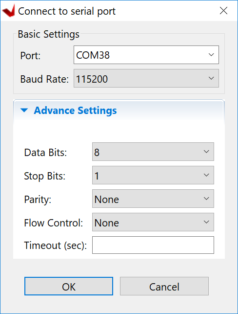

3. Right-click **hello_world** and select **Run as → Run Configurations**.

4. Right-click **Single Application Debug** and click **New Configuration**. The Vitis software platform creates the new run configuration, named Debugger_hello_world-Default.

    The configurations associated with the application are pre-populated
    in the Main tab of the Run Configurations dialog box.

5. Click the **Target Setup** page and review the settings. The default choice is the Tcl script.

6. Click **Run**.

    "Hello World" appears on the Vitis Serial Terminal, as shown in the following figure.

    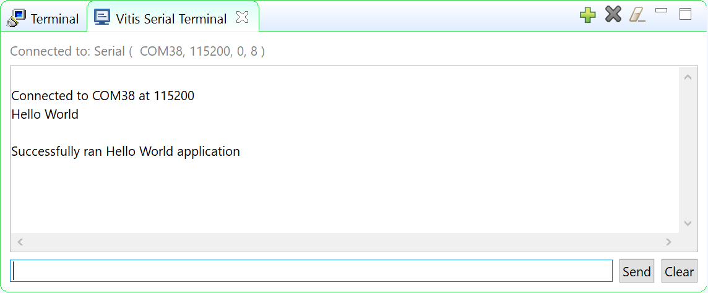

    **Note:** No bitstream download is required for the above
    software application to be executed on the Zynq SoC evaluation board.
    The Arm Cortex-A9 dual core is already present on the board. Basic
    initialization of this system to run a simple application is accomplished by
    the device initialization Tcl script.

**What Just Happened?**

The application software sent the \"Hello World\" string to the UART1
peripheral of the PS section.

From UART1, the \"Hello World\" string goes byte-by-byte to the serial
terminal application running on the host machine, which displays it as
a string.

## Additional Information

### Domain or Board Support Package

A domain or board support package (BSP) is a collection of software
drivers and, optionally, the operating system on which to build your
application. It is the support code for a given hardware platform or
board that helps in basic initialization at power up and helps
software applications to be run on top of it. You can create multiple
applications to run on the domain. A domain is tied to a single
processor in the platform.

### Standalone OS

Standalone is a simple, low-level software layer. It provides access to basic processor features such as caches, interrupts, and exceptions, as well as the basic processor features of a hosted environment. These basic features include
standard input/output, profiling, abort, and exit. It is a single
threaded semi-hosted environment.

**IMPORTANT!** The application you ran in this chapter was created on
top of the standalone OS. The domain/BSP that your software
application targets is selected during the New Platform Project
creation process.

Learn how to debug using the Vitis software platform in the [next chapter](./3-debugging-vitis.md).


© Copyright 2015–2021 Xilinx, Inc.

Licensed under the Apache License, Version 2.0 (the "License"); you may not use this file except in compliance with the License. You may obtain a copy of the License at

http://www.apache.org/licenses/LICENSE-2.0

Unless required by applicable law or agreed to in writing, software distributed under the License is distributed on an "AS IS" BASIS, WITHOUT WARRANTIES OR CONDITIONS OF ANY KIND, either express or implied. See the License for the specific language governing permissions and limitations under the License.
