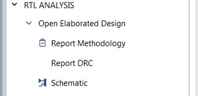
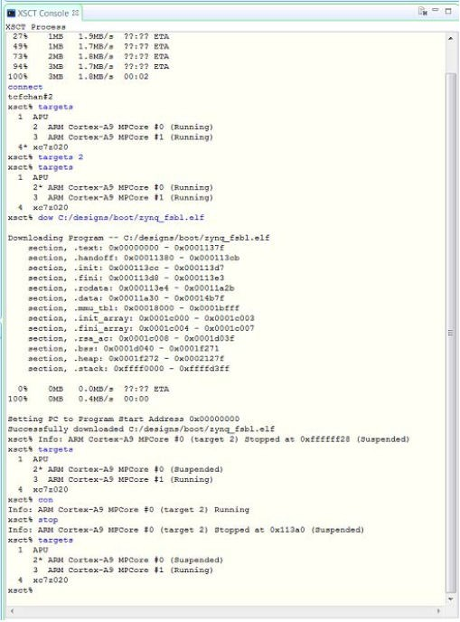
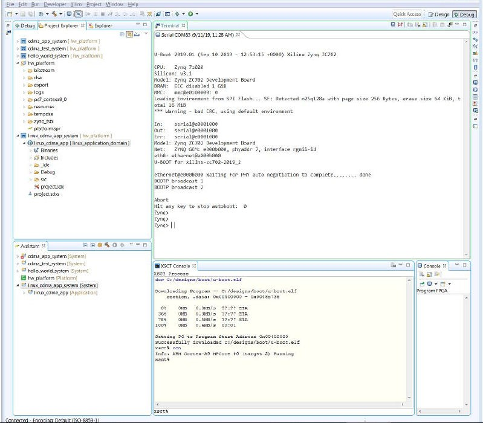
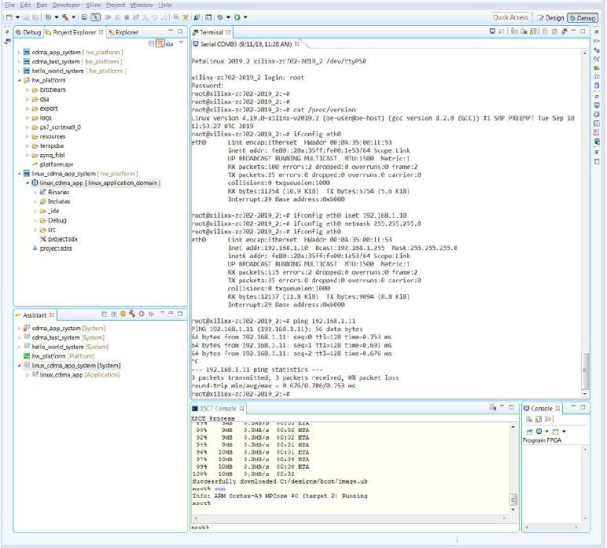
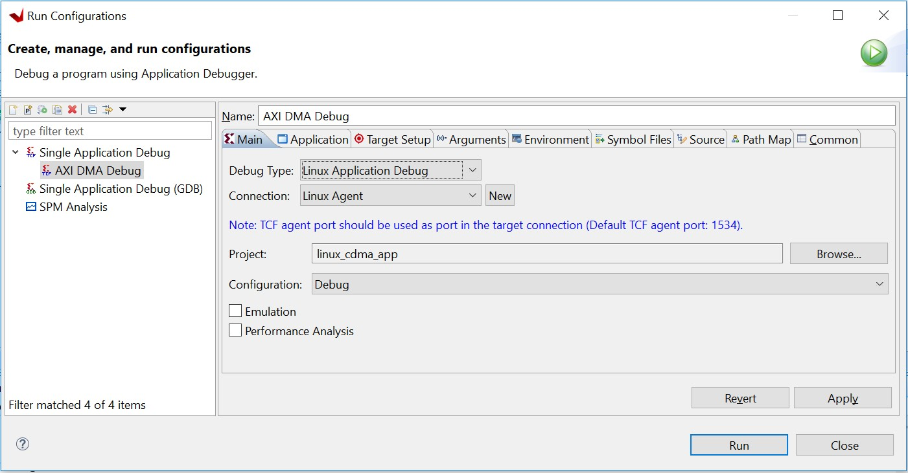
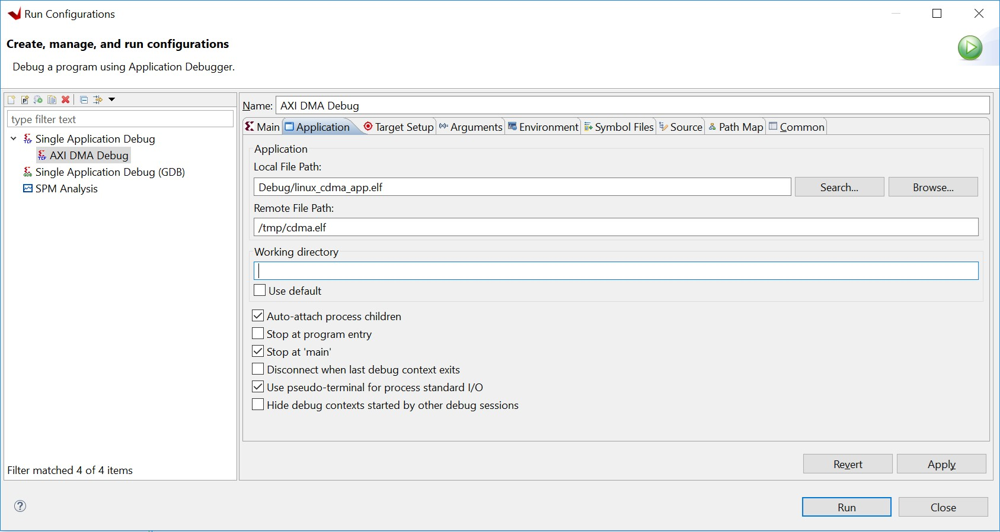
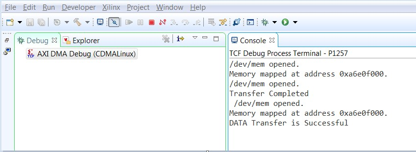

<p align="right">
            Read this page in other languages:<a href="../docs-jp/4-debugging-vitis.md">日本語</a>    <table style="width:100%"><table style="width:100%">
  <tr>

<th width="100%" colspan="6"><h1>Zynq-7000 SoC Embedded Design Tutorial 2020.2 (UG1165)</h1>
</th>

  </tr>

</table>

# Building and Debugging Linux Applications for ZYNQ-7

The earlier examples highlighted the creation of bare-metal applications. This chapter demonstrates how to develop Linux applications.

## Example 6: Creating Linux Images

In this example, you will configure and build a Linux operating system platform for an Arm™ Cortex-A9 core based APU on a Zynq® 7000. You can configure and build Linux images using the PetaLinux tool flow, along with the board-specific BSP. The Linux application is developed in the Vitis IDE.

### Input and Output Files

- Input:
  - Hardware XSA (``system_wrapper.xsa`` generated in Example 1)
  - [PetaLinux ZC702 BSP](https://www.xilinx.com/support/download/index.html/content/xilinx/en/downloadNav/embedded-design-tools.html)

- Output:
  - PetaLinux boot images (``BOOT.BIN``, ``image.ub``)
  - PetaLinux application (hello_linux)

 **IMPORTANT!:**

> 1. This example requires a Linux host machine with PetaLinux installed. Refer to the _PetaLinux Tools Documentation: Reference Guide_ ([UG1144](https://www.xilinx.com/cgi-bin/docs/rdoc?v=latest;d=ug1144-petalinux-tools-reference-guide.pdf)) for information about dependencies for PetaLinux 2020.2.

> 2. This example uses the [PetaLinux ZC702 BSP](https://www.xilinx.com/support/download/index.html/content/xilinx/en/downloadNav/embedded-design-tools.html) to create a PetaLinux project. Ensure that you have downloaded the zc702 BSP for PetaLinux as instructed on the [PetaLinux Tools download page](https://www.xilinx.com/member/forms/download/xef.html?filename=xilinx-zc702-v2020.2-final.bsp).

### Creating a PetaLinux Image

1. Create a PetaLinux project using the following command:

    ```bash
    petalinux-create -t project -s <path to the xilinx-zc702-v2020.2-final.bsp>
    ```

    **Note:** ``xilinx-zc702-v2020.2-final.bsp`` is the PetaLinux BSP for the zc702 Production Silicon Rev 1.0 Board.

    This creates a PetaLinux project directory, ``xilinx-zc702-2020.2``.

2. Reconfigure the project with ``system_wrapper.xsa``:

   - The created PetaLinux project uses the default hardware setup in the ZC702 Linux BSP. In this example, you will reconfigure the PetaLinux project based on the Zynq design that you configured using the Vivado® Design Suite in [Example 1](./2-using-zynq.md#example-1-creating-a-new-embedded-project-with-zynq-soc).

   - Copy the hardware platform ``system_wrapper.xsa`` to the Linux host machine.

   - Reconfigure the project using the following command:

   ```bash
   cd xilinx-zc702-2020.2
   petalinux-config --get-hw-description=<path containing system_wrapper.xsa>
   ```

    This command opens the PetaLinux Configuration window. You can review these settings. If required, make changes in the configuration. For this example, the default settings from the BSP are sufficient to generate the required boot images.

    If you would prefer to skip the configuration window and keep the default settings, run the following command:

    ```
    petalinux-config --get-hw-description=<path containing system_wrapper.xsa> --silentconfig
    ```

3.  Build the PetaLinux project:

    - In the `<PetaLinux-project>` directory, e.g. ``xilinx-zc702-2020.2``, build the Linux images using the following command:

    ```bash
    petalinux-build
    ```

    After the above statement executes successfully, verify the images
     and the timestamp in the images directory in the PetaLinux project
     folder using the following commands:

    ``` bash
    cd images/linux
    ls -al
    ```

4.  Generate the boot image using the following command:

    ```bash
    petalinux-package --boot --fsbl zynqmp_fsbl.elf --u-boot
    ```

    This creates a ``BOOT.BIN`` image file in the ``<petalinux-project>/images/linux/`` directory.

    The logs indicate that the above command includes PMU_FW and ATF in ``BOOT.BIN``. You can also add `--pmufw <PMUFW_ELF>` and `--atf <ATF_ELF>` in the above command if you would prefer to use custom firmware images. Refer to `petalinux-package --boot --help` for more details about the boot image package command.

    **Note:** The option to add bitstream, `--fpga`, is missing
    from the above command intentionally because so far the hardware
    configuration is based only on a PS with no design in the PL. If a bitstream
    is present in the design, `--fpga` can be added in the
    ``petalinux-package`` command as shown below:

    ```bash
    petalinux-package --boot --fsbl zynqmp_fsbl.elf --fpga system.bit --pmufw pmufw.elf --atf bl31.elf --u-boot u-boot.elf
    ```

### Verifyìng the Image on the ZC702 Board

 To verify the image, follow these steps:

1. Copy the `BOOT.BIN`, `image.ub`, and `boot.scr` files to the SD card. Here, `boot.scr` is read by U-Boot to load the kernel and rootfs.

2. Load the SD card into the zc702 board, in the J100 connector.
<!--TODO: update SW number for SD Boot-->
3. Configure the board to boot in SD boot mode by setting switch SW6 as
     shown in the following figure.

    

5. Connect 12V power to the zc702 6-pin Molex connector.

6. Start a serial terminal session using Tera Term or Minicom depending on the host machine being used. set the COM port and baud rate for your system as shown in the following figure.

     

7. For port settings, verify the COM port in the device manager and select the COM port with interface-0.

8. Turn on the ZC702 board using SW1, and wait until Linux loads on the board.


## Example 7: Creating Hello World Application for Linux in Vitis IDE

<!--Merge with the next chapter-->
### Linux Domain Creation for Linux Applications

Now that Linux is running on the board, you can create a Linux domain
followed by a Linux application. The steps to create a Linux domain
are given below:

1.  Go to the Explorer view in the Vitis software platform and expand
    the **hw_platform** platform project.

2.  Open the hardware by double clicking **platform.spr**.

3.  The platform view opens. Click the **+** button in the right corner
    to add a domain, as shown in the following figure.

    

4.  When the New Domain dialog box opens, enter the details as given
    below:

    | Option             | Value                    |
    | ------------------ | ------------------------ |
    | Name               | linux_domain             |
    | Display Name       | linux_application_domain |
    | OS                 | Linux                    |
    | Processor          | ps7_cortexa9             |
    | Supported Runtimes | C/C++                    |

    - Select **Use pre-built software components**

    - Create one boot directory in the C:\designs folder, then copy the
    boot components into it (FSBL, PMUFW from the Vitis software
    platform, ATF, u-boot.elf and image.ub from PetaLinux).

    - Create one BIF file as below.

       

    - Click **OK** to finish and observe
    that the Linux domain has been added to the hw_platform as shown
    below.

        

    Now you are ready with Linux domain to create Linux applications.


### Creating Linux Applications in the Vitis IDE

1. Create a Linux domain:

   - Double-click **platform.spr** in the zc702_edt platform to open platform configurations.
   - Click the **+** button to add a domain.
   - Input the following domain parameters:
       - Name: **linux**
       - OS: **linux**
       - Keep the other options as-is and click **OK**.
   - Review the Linux domain configuration details.
   - Build the platform project by clicking the hammer icon.

   

2. Create a Linux application:

   - Click **File → New → Application Project**.
   - Click **Next** on the welcome page.
   - Select platform: **zc702_edt**. Click **Next**.
   - Enter the application project name, **hello_linux**, and the target processor, **psu_cortexa53 SMP**.
   - Keep the default domain: **linux**.
   - Keep the SYSROOT, rootfs, and kernel image empty, and click **Next**.
   - Select the **Linux Hello World** template. Click **Finish**.

   **Note:** If you input an extracted SYSROOT directory, Vitis can find include files and libraries in SYSROOT. SYSROOT is generated by the PetaLinux project `petalinux-build --sdk`. Refer to the _PetaLinux Tools Documentation: Reference Guide_ ([UG1144](https://www.xilinx.com/cgi-bin/docs/rdoc?v=2020.2;d=ug1144-petalinux-tools-reference-guide.pdf)) for more information about SYSROOT generation.

   **Note:** If you input a rootfs and kernel image, Vitis can help to generate the ``SD_card.img`` when building the Linux system project.

3. Build the hello_linux application.

   - Select **hello_linux**.
   - Click the hammer button to build the application.

### Preparing the Linux Agent for Remote Connection

The Vitis IDE needs a channel to download the application to the running target. When the target runs Linux, it uses TCF Agent running on Linux. TCF Agent is added to the Linux rootfs from the PetaLinux configuration by default. When Linux boots up, it launches TCF Agent automatically. The Vitis IDE talks to TCF Agent on the board using an Ethernet connection.

1. Prepare for running the Linux application on the zc702 board. Vitis can download the Linux application to the board, which runs Linux through a network connection. It is important to ensure that the connection between the host machine and the board works well.

   - Make sure the USB UART cable is still connected with the zc702 board. Turn on your serial console and connect to the UART port.
   - Connect an Ethernet cable between the host and the zc702 board.
       - It can be a direct connection from the host to the zc702 board.
       - You can also connect the host and the zc702 board using a router.
   - Power on the board and let Linux run on zc702 (see [Verifying the Image on the zc702 Board](#verify-the-image-on-the-zc702-board)).
   - Set up a networking software environment.
       - If the host and the board are connected directly, run `ifconfig eth0 192.168.1.1` to setup an IP address on the board. Go to **Control Panel → Network and Internet → Network and Sharing Center**, and click **Change Adapter Settings**. Find your Ethernet adapter, then right-click and select **Properties**. Double-click **Internet Protocol Version 4 (TCP/IPv4)**, and select **Use the following IP address**. Input the IP address **192.168.1.2**. Click **OK**.
       - If the host and the board are connected through a router, they should be able to get an IP address from the router. If the Ethernet cable is plugged in after the board boots up, you can get the IP address manually by running the `udhcpc eth0` command, which returns the board IP address.
       - Have the host and the zc702 board ping each other to make sure the network is set up correctly.

2. Set up the Linux agent in the Vitis IDE.

   - Click the **Target Connections** icon on the toolbar.
   - It can also be launched by going to **Window → Show View...** and then looking for the target.

   

   - In the Target Connections window, double-click **Linux TCF Agent → Linux Agent[default]**.
   - Input the IP address of your board.
   - Click **Test Connection**.

   

   - Vitis should return a pop-up confirmation for success.

   

### Running the Linux Application from the Vitis IDE

1. Run the Linux application:

   - Right-click **hello_linux**, and select **Run As → Run Configurations**.
   - Expand **Single Application Debug** and select **Debugger_hello_linux-Default**.
   - Review the configurations:
       - Debug type: **Linux Application Debug**
       - Connection: **Linux Agent**
   - Click **Run**.

   

   - The console should print **Hello World**.

    


2. Disconnect the connection:

   - Click the **Terminate** button on the toolbar or press **Ctrl+F2**.
   - Click the **Disconnect** button on the toolbar.

### Debugging a Linux Application from the Vitis IDE

Debugging Linux applications requires the Linux agent to be set up properly. Refer to [Preparing the Linux Agent for Remote Connection](#prepare-linux-agent-for-remote-connection) for detailed steps.

1. Debug the Linux application:

   - Right-click **hello_linux**, then select **Debug As → Debug Configurations**.
   - Expand **Single Application Debug** and select **Debugger_hello_linux-Default**.
   - Review the configurations:
     - Debug type: **Linux Application Debug**
     - Connection: **Linux Agent**
   - Click **Debug**.

    The debug configuration has identical options to the run configuration. The difference between debugging and running is that debugging stops at the `main()` function.

2. Try the debugging features:

    Hello World is a simple application. It does not contain much to debug, but you can try the following to explore the Vitis debugger:

    - Review the tabs on the upper right corner: Variables, Breakpoints, Expressions, and the rest.
    - Review the call stack on the left.
    - The next line to execute has a green background.
    - Step over by clicking the icon on the toolbar or pressing **F6** on the keyboard. The printed string will be shown on the Console panel.

    

3. Disconnect the connection:

   - Click the **Terminate button** on the toolbar or press **Ctrl+F2**.
   - Click the **Disconnect** button on the toolbar.

## Summary

In this chapter, you learned how to:

- Create a Linux boot image with PetaLinux.
- Create simple Linux applications with the Vitis IDE.
- Run and debug using the Vitis IDE.

In the [next chapter](./7-design1-using-gpio-timer-interrupts.md), we will connect all points previously introduced and create a system design.

© Copyright 2017-2021 Xilinx, Inc.


<!--TODO merge it-->
### Booting Linux on the Target Board

You will now boot Linux on the Zynq-7000 SoC ZC702 target board using
JTAG mode.

***Note*:** Additional boot options will be explained in [Linux Booting and Debug in the Software
Platform](6-linux-booting-debug.md).

1.  Check the following Board Connection and Setting for Linux booting
    using JTAG mode:

    a.  Ensure that the settings of Jumpers J27 and J28 are set as
        described in [Creating a Platform Project in the Vitis Software Platform with an XSA from Vivado](2-using-zynq.md#creating-a-platform-project-in-the-vitis-software-platform-with-an-xsa-from-vivado).

    b.  Ensure that the SW16 switch is set as shown in the following
        figure.

    c.  Connect an Ethernet cable from the Zynq SoC board to your
        network.

    d.  Connect the Windows Host machine to your network.

    e.  Connect the power cable to the board.

        

2.  Connect a micro USB cable between the Windows host machine and the
    target board with the following SW10 switch settings, as shown in
    [Booting Linux on the Target Board](6-linux-booting-debug.md#booting-linux-on-the-target-board).

    -   Bit-1 is 0

    -   Bit-2 is 1

    ***Note*:** 0 = switch is open. 1 = switch is closed. The correct JTAG
    mode has to be selected, according to the user interface. The JTAG
    mode is controlled by switch SW10 on the ZC702 and SW4 on the ZC706.

    

3.  Connect a USB cable to connector J17 on the target board with the
    Windows Host machine. This is used for USB to serial transfer.

4.  Change Ethernet Jumper J30 and J43 as shown in the following figure.

        

5.  Power on the target board.

6.  Launch the Vitis software platform and open the same workspace you
    used in [Using the Zynq SoC Processing System](2-using-zynq.md) and [Using the GP Port in Zynq Devices](3-using-gp-port-zynq.md).

7.  If the serial terminal is not open, connect the serial communication
    utility with the baud rate set to **115200**.

    ***Note*:** This is the baud rate that the UART is programmed to on
    Zynq devices.


## Linux OS Based Application Software for the CDMA System

In this section, you will create a Linux-based application software
for CDMA using the `mmap()` system call provided by Linux and run it on
the hardware to check the functionality of the CDMA IP.

The `mmap()` system call is used to map specified kernel memory area to
the User layer, so that you can read or write on it depending on the
attribute provided during the memory mapping.


***Note*:** Details about the `mmap()` system call is beyond the scope of this guide.

**CAUTION!** *Use of the mmap() call might crash the kernel if it
accesses, by mistake, some restricted area or shared resources of the
kernel.*

The `main()` function in the application software is the entry point for
the execution. It initializes the source array with the specified test
pattern and clears the destination array. Then it copies the source
array contents to the DDR memory starting at location 0x20000000 and
makes the DMA register setting to initiate DMA transfer to the
destination. After the DMA transfer, the application reads the status
of the transfer and displays the result on the serial terminal.


## Example 8: Linux Application Software for AXI CDMA


### Linux Application Software for AXI CDMA

Application software creation is composed of the following steps:

1.  Initialize the whole source array, which is in the User layer with
    value 0xa5a5a5a5.

2.  Clear the whole destination buffer, which is in the User layer, by
    writing all zeroes.

3.  Map the kernel memory location starting from 0x20000000 to the User
    layer with writing permission using mmap() system calls.By doing so, you can write to the specified kernel memory.

4.  Copy the source array contents to the mapped kernel memory.

5.  Un-map the kernel memory from the User layer.

6.  Map the AXI CDMA register memory location to the User layer with
    reading and writing permission using the mmap() system call. Make
    the following CDMA register settings from the User layer:

    a.  Reset DMA to stop any previous communication.

    b.  Enable interrupt to get the status of the DMA transfer.

    c.  Set the CDMA in simple mode.

    d.  Verify that the CDMA is idle.

    e.  Set the source buffer starting location, 0x20000000, to the CDMA
        register.

    f.  Set the destination buffer starting location, 0x30000000, to the
        CDMA register.

    g.  Set the number of bytes to be transferred in the CDMA register.
        Writing to this register starts the DMA transfer.

7.  Continuously read the DMA transfer status until the transfer
    finishes.

8.  After CDMA transfer finishes, un-map the CDMA register memory for
    editing from the User layer using the mmap() system call.

9.  Map the kernel memory location starting from 0x30000000 to the User
    layer with reading and writing permissions.

10. Copy the kernel memory contents starting from 0x30000000 to the User
    layer destination array.

11. Un-map the kernel memory from the User layer.

12. Compare the source array with the destination array.

13. Display the comparison result in the serial terminal. If the
    comparison is successful, the message "DATA Transfer is
    Successful" displays. Otherwise, the serial terminal displays an
    error message.

### Running Linux CDMA Application Using the Vitis Software Platform

Detailed steps on running Linux on the target board are outlined in[Linux Booting and Debug in the Vitis Software Platform](6-linux-booting-debug.md). 
If you are not comfortable running Linux, run through the [Linux Booting and Debug in the Vitis Software Platform](6-linux-booting-debug.md) examples prior to running this
example. Running a Linux OS based application is composed of the following steps:

1.  [Booting Linux on the Target Board](#booting-linux-on-the-target-board)

2.  [Linux Domain Creation for Linux Applications](#linux-domain-creation-for-linux-applications)

3.  [Building an Application and Running it on the Target Board Using the Vitis Software Platform](#building-an-application-and-running-it-on-the-target-board-using-the-vitis-software-platform)

### Booting Linux on the Target Board
<!--TODO: reduce steps here. Refer to Example 3-->
You will now boot Linux on the Zynq-7000 SoC ZC702 target board using
JTAG mode.

***Note*:** Additional boot options will be explained in [Linux Booting and Debug in the Software
Platform](6-linux-booting-debug.md).

1.  Check the following Board Connection and Setting for Linux booting
    using JTAG mode:

    a.  Ensure that the settings of Jumpers J27 and J28 are set as
        described in [Creating a Platform Project in the Vitis Software Platform with an XSA from Vivado](2-using-zynq.md#creating-a-platform-project-in-the-vitis-software-platform-with-an-xsa-from-vivado).

    b.  Ensure that the SW16 switch is set as shown in the following
        figure.

    c.  Connect an Ethernet cable from the Zynq SoC board to your
        network.

    d.  Connect the Windows Host machine to your network.

    e.  Connect the power cable to the board.

        

2.  Connect a micro USB cable between the Windows host machine and the
    target board with the following SW10 switch settings, as shown in
    [Booting Linux on the Target Board](6-linux-booting-debug.md#booting-linux-on-the-target-board).

    -   Bit-1 is 0

    -   Bit-2 is 1

    ***Note*:** 0 = switch is open. 1 = switch is closed. The correct JTAG
    mode has to be selected, according to the user interface. The JTAG
    mode is controlled by switch SW10 on the ZC702 and SW4 on the ZC706.

    

3.  Connect a USB cable to connector J17 on the target board with the
    Windows Host machine. This is used for USB to serial transfer.

4.  Change Ethernet Jumper J30 and J43 as shown in the following figure.

        

5.  Power on the target board.

6.  Launch the Vitis software platform and open the same workspace you
    used in [Using the Zynq SoC Processing System](2-using-zynq.md) and [Using the GP Port in Zynq Devices](3-using-gp-port-zynq.md).

7.  If the serial terminal is not open, connect the serial communication
    utility with the baud rate set to **115200**.

    ***Note*:** This is the baud rate that the UART is programmed to on
    Zynq devices.

8.  Select **Xilinx → Program FPGA**, then click **Program** to download
    the bitstream.

9.  Open the Xilinx System Debugger (XSCT) tool by selecting **Xilinx →
    XSCT Console**.

10. At the XSCT prompt, do the following:

    -  Type connect to connect with the PS section.

    -  Type targets to get the list of target processors.

    -  Type targets 2 to select the processor CPU1.

        ```
        xsct% targets
        1 APU
        2 Arm Cortex-A9 MPCore #0 (Running)
        3 Arm Cortex-A9 MPCore #1 (Running)
        4 xc7z020
        xsct% targets 2
        xsct% targets
        1 APU
        2* Arm Cortex-A9 MPCore #0 (Running)
        3 Arm Cortex-A9 MPCore #1 (Running)
        4 xc7z020
        ```

    -  Type dow <tutorial_download_path>/zynq_fsbl.elf to download PetaLinux FSBL.

    -  Type con to start execution of FSBL and then type stop to stop it.

        

    -  Type dow <tutorial_download_path>/u-boot.elf to download PetaLinux U- Boot.elf.

    -  Type con to start execution of U-Boot.  On the serial terminal, the autoboot countdown message appears:

      	```
        Hit any key to stop autoboot: 3
        ```

    -  Press **Enter**.

        Automatic booting from U-Boot stops and a command prompt appears on
        the serial terminal.

        

    -  At the XSCT Prompt, type stop. The U-Boot execution stops.

    -  Type dow -data <tutorial_download_path>/image.ub 0x30000000 to
        download the Linux Kernel image at location 0x3000000.

    -  Type con to start executing U-Boot.

11. At the command prompt of the serial terminal, type **bootm 0x30000000**. Press Enter. The Linux OS boots.

12. If required, provide the Zynq login as **root** and the password as
    **root** on the serial terminal to complete booting the processor.

    After booting completes, # prompt appears on the serial terminal.

13. At the root@Xilinx-ZC702-2020.2:~# prompt, make sure that the
    board Ethernet connection is configured:

    -  Check the IP address of the board by typing the following
        command at the Zynq prompt: ``ifconfig eth0``.

    This command displays all the details of the currently active
    interface. In the message that displays, the inet addr value denotes
    the IP address that is assigned to the Zynq SoC board.

    -  If inet addr and netmask values do not exist, you can assign them
        using the following commands:

        ```
        root@Xilinx-ZC702-2020.2:~# ifconfig eth0 inet 192.168.1.10
        root@Xilinx-ZC702-2020.2:~# ifconfig eth0 netmask 255.255.255.0
        ```

14. Confirm that the IP address settings on the Windows machine are set
    up to match the board settings. Adjust the local area connection
    properties by opening your network connections.

    -  Right-click the local area connection that is linked to the
        XC702 board and select Properties.

    -  In the Local Area Connection Properties dialog box, select
        **Internet Protocol Version 4 (TCP/IPv4)** from the item list and
        select **Properties**.

    -  Select **Use the following IP address** and set the following
        values:

        ```
        IP address: 192.168.1.11
        Subnet mask: 255.255.255.0
        ```

    -  Click **OK** to accept the values.

15. In the Windows machine command prompt, check the connection with the
    board by typing ping followed by the board IP address. The ping response displays in a loop.

    This response means that the connection between the Windows host
    machine and the target board is established.

16. Press **Ctrl+C** to stop displaying the ping response on the Windows
    host machine command prompt.

    

    Linux booting completes on the target board and the connection between
    the host machine and the target board is complete.


### Building an Application and Running it on the Target Board Using the Vitis Software Platform

1.  Now that Linux is running on the board, create a Linux application
    to use the CDMA. Select File → New → Application Project.

2.  Use the information in the table below to make your selections in
    the wizard screens.

   | Wizard Screen               | System Property                                     | Setting or Command to Use                                                                           |
   | --------------------------- | --------------------------------------------------- | --------------------------------------------------------------------------------------------------- |
   | Platform                    | Select a platform from repository                   | Click hw_platform [custom].                                                                         |
   | Application Project Details | Application project name                            | Enter linux_cdma_app                                                                                |
   |                             | Select target processor for the Application project | Select ps7_cortexa9 SMP.                                                                            |
   | DomainDomain                | Select a domain                                     | Click linux_application_domain                                                                      |
   |                             | Application settings                                | If known, enter the sysroot, root FS, and kernel image paths. Otherwise, leave these options blank. |
   | Templates                   | Available Templates                                 | Linux Empty Application                                                                             |


3.  Click **Finish**.

    The New Application Project wizard closes and the Vitis software
    platform creates the linux_cdma_app project under the Explorer view.

4.  In the Explorer view, expand linux_cdma_app project, right-click the
    **src** directory, and select **Import Sources** to open the
    Import Sources dialog box.

5.  In the **Import Sources** dialog box, click the **Browse** button
    next to the **File system** field and specify the design files
    directory already downloaded. Select the **linux_cdma_app.c**
    example application file and click **Finish**.

    ***Note*:** The example application software file is available in the
    ZIP file that accompanies this guide. See [Design Files for This Tutorial](2-using-zynq.md#design-files-for-this-tutorial).

6.  Build the application project either by clicking the hammer button
    or by right-clicking on the linux_cdma_app project and selecting
    **Build Project**. The binary file linux_cdma_app.elf is
    generated.

7.  Right-click linux_cdma_app and select **Run As → Run
    Configurations** to open the Run Configurations dialog box, shown
    in the following figure.

8.  Right-click **Xilinx C/C++ application (Application Debugger)** and select **New**.

        

9.  Click **New** button next to the Connection to open the Target
    Connection Details dialog box.

10. In the Target Connection Details dialog box, apply the settings
    below:

    - Specify a name in the **Target Name** field. For the purposes of
        this exercise, use CDMALinux.

    - In the **Host** field, enter the target board IP address.

    To determine the target board IP address, type ifconfig eth0 at the
    Zynq\prompt in the serial terminal. The terminal displays the target
    IP address that is assigned to the board.

    - In the **Port** field, type 1534.

11. Click **OK** to create the connection.

12. As shown in the following figure, on the **Application** tab, enter
    application data settings for the following:

    - Project Name: linux_cdma_app

    - Local File Path: Debug/linux_cdma_app.elf

    - Remote File Path: /tmp/cdma.elf

    

13. Click **Run**. The application executes, and the message DATA
    Transfer is Successful appears in the console window, as shown in the following figure.

    