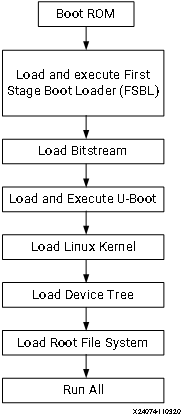
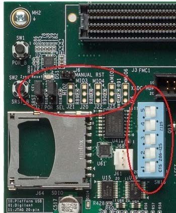
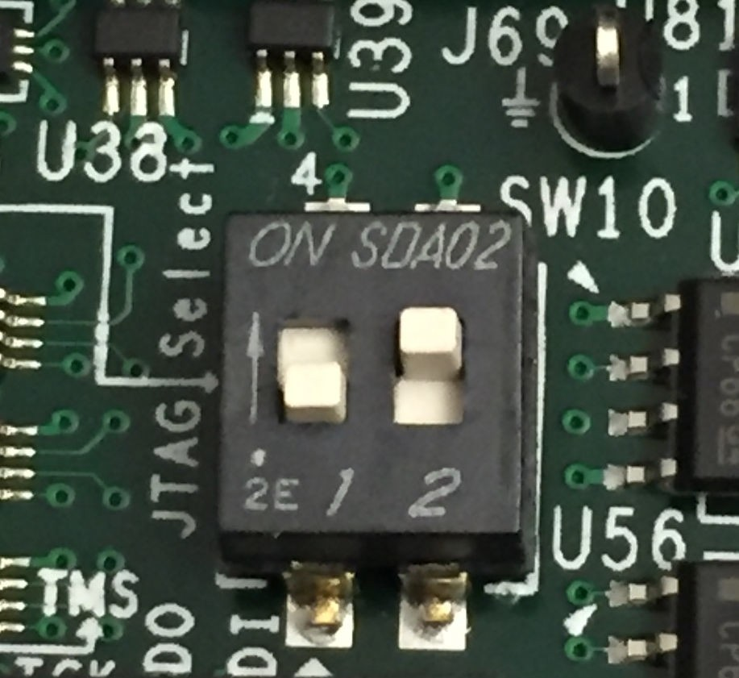
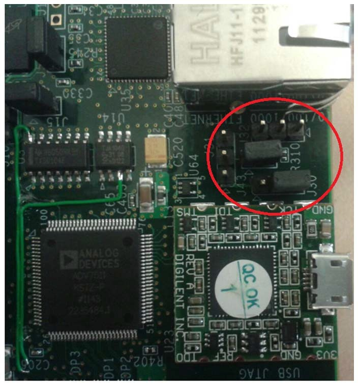
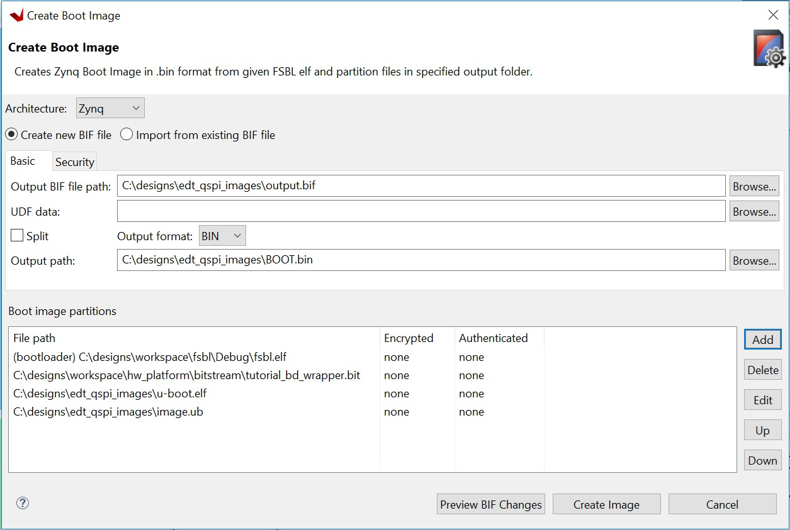
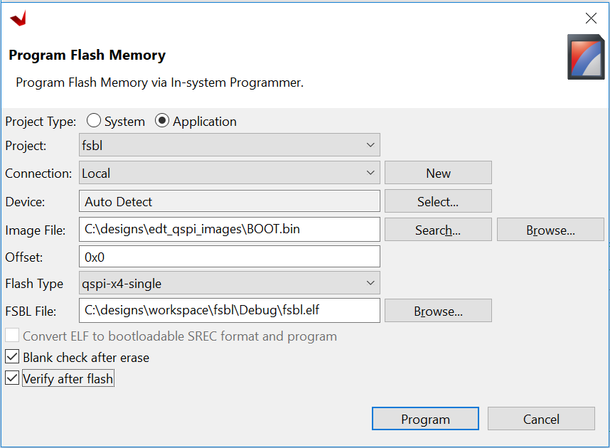
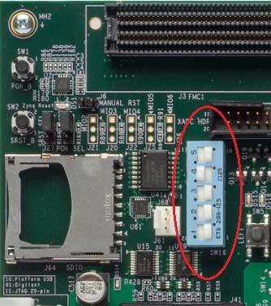

<p align="right">
            Read this page in other languages:<a href="../docs-jp/6-linux-booting-debug.md">日本語</a>    <table style="width:100%"><table style="width:100%">
  <tr>

<th width="100%" colspan="6"><h1>Zynq-7000 SoC Embedded Design Tutorial 2020.2 (UG1165)</h1>
</th>

  </tr>

</table>

- [Linux Boot Image Configuration](#linux-boot-image-configuration)
  - [Boot Methods](#boot-methods)
    - [Master Boot Method](#master-boot-method)
    - [Slave Boot Method](#slave-boot-method)
    - [Booting Linux from JTAG](#booting-linux-from-jtag)
  - [Example 9: Booting Linux with JTAG](#example-9-booting-linux-with-jtag)
    - [Input and Output Files](#input-and-output-files)
    - [Booting Linux in JTAG Mode](#booting-linux-in-jtag-mode)
  - [Example 10: Booting Linux from QSPI Flash](#example-10-booting-linux-from-qspi-flash)
    - [Input and Output Files](#input-and-output-files-1)
    - [Configure PetaLinux for Booting from QSPI](#configure-petalinux-for-booting-from-qspi)
    - [Make a Linux Bootable Image for QSPI Flash With Vitis](#make-a-linux-bootable-image-for-qspi-flash-with-vitis)
    - [Program QSPI Flash with the Flash Programming Tool](#program-qspi-flash-with-the-flash-programming-tool)
    - [(Optional) Program QSPI Flash with the Boot Image Using JTAG](#optional-program-qspi-flash-with-the-boot-image-using-jtag)
    - [Booting Linux from QSPI Flash](#booting-linux-from-qspi-flash)

# Linux Boot Image Configuration

In previous chapters, we used SD Boot mode for all examples for Linux. SD Boot is easy to use for development. Sometimes we need to change boot source to QSPI Flash for its reliability and anti-vibration. In the board bring-up development phase, since the peripherals may not be available yet, boot with JTAG is a common technique for debugging.
 
This chapter describes the detailed steps of use cases mentioned above.

## Boot Methods

The following boot methods are available for ZYNQ-7000 devices:

-   Master Boot Method

-   Slave Boot Method

### Master Boot Method

In the master boot method, different kinds of non-volatile memories
such as QSPI, NAND, NOR flash, and SD cards are used to store boot
images. In this method, the CPU loads and executes the external boot
images from non-volatile memory into the Processor System (PS). The
master boot method is further divided into Secure and Non Secure
modes. Refer to the *Zynq-7000 SoC Technical Reference Manual*
([UG585](https://www.xilinx.com/cgi-bin/docs/ndoc?t=user_guides;d=ug585-Zynq-7000-TRM.pdf)) for more detail.

The boot process is initiated by one of the Arm&reg; Cortex&trade;-A9 CPUs in
the processing system (PS) and it executes on-chip ROM code. The
on-chip ROM code is responsible for loading the first stage boot
loader (FSBL). The FSBL does the following:

-   Configures the FPGA with the hardware bitstream (if it exists)

-   Configures the MIO interface

-   Initializes the DDR controller

-   Initializes the clock PLL

-   Loads and executes the Linux U-Boot image from non-volatile memory
    to DDR

The U-Boot loads and starts the execution of the kernel image, the
root file system, and the device tree from non-volatile RAM to DDR. It
finishes booting Linux on the target platform.

### Slave Boot Method

JTAG can only be used in slave boot mode. An external host computer
acts as the master to load the boot components into the OCM, DDR or FPGA using a JTAG
connection.

***Note*:** The PS CPU remains in idle mode while the boot image
loads. The slave boot method is always a non-secure mode of booting.

In JTAG boot mode, the CPU enters halt mode immediately after it
disables access to all security related items and enables the JTAG
port. You must download the boot images into the DDR memory before
restarting the CPU for execution.

### Booting Linux from JTAG

The flow chart in the following figure describes the process used to
boot Linux on the target platform.

 

## Example 9: Booting Linux with JTAG

This section covers the flow for booting Linux on the target board
using the pre-compiled images with JTAG.

### Input and Output Files

- Input Files: files generated by PetaLinux in Example 4 or Example 5
  - zynq_fsbl.elf
  - u-boot.elf
  - Image.ub
- Output Files: N/A

### Booting Linux in JTAG Mode


1.  Check the following board connections and settings for Linux booting
    using JTAG mode:

    - Ensure that the settings of Jumpers J27 and J28 are set as described in [Example 2 - Board Setup](2-using-zynq.md#setup-the-boardo).

    - Ensure that the SW16 switch is set to 00000, as shown in the following figure.

           

    - Connect an Ethernet cable from the Zynq-7000 SoC board to your
        network or directly to your host machine.

    - Connect the Windows Host machine to your network.

    - Connect the power cable to the board.

             

2.  Connect a Micro USB cable between the Windows host machine and the
    target board JTAG port with the following **SW10** switch settings, as shown in
    the following figure.

    -   Bit-1 is 0

    -   Bit-2 is 1

    ***Note*:** 0 = switch is open. 1 = switch is closed. The correct JTAG
    mode has to be selected, according to the user interface. The JTAG
    mode is controlled by switch SW10 on the zc702 and SW4 on the zc706.

    

3.  Connect a USB cable to connector J17 on the target board with the
    Windows Host machine. This is used for USB to serial transfer.

4.  Change Ethernet Jumper J30 and J43 as shown in the following figure.

        

5.  Power on the target board.

6.  Launch Vitis IDE with any workspace.

7.  If the serial terminal is not open, connect the serial communication
    utility with the baud rate set to **115200**.

    ***Note*:** This is the baud rate that the UART is programmed to on
    Zynq devices.

8.  Download the bitstream by selecting **Xilinx → Program FPGA**, then
    clicking **Program**.

9.  Open the Xilinx System Debugger (XSCT) tool by selecting **Xilinx → XSCT Console**.

10. At the XSCT prompt, do the following:

    - Run `connect` to connect with the PS section.

    - Run `targets` to get the list of target processors.

    - Run `ta 2` to select the processor CPU1.

    ```
    xsct% targets
    1 APU
    2 Arm Cortex-A9 MPCore #0 (Running)
    3 Arm Cortex-A9 MPCore #1 (Running)
    4 xc7z020
    xsct% ta 2
    xsct% targets
    1 APU
    2* Arm Cortex-A9 MPCore #0 (Running)
    3 Arm Cortex-A9 MPCore #1 (Running)
    4 xc7z02022
    ```

    - Run `dow zynq_fsbl.elf` to download
        PetaLinux FSBL.

    - Run `con` to start execution of FSBL and then run `stop` to stop
        it.

    - Run `dow u-boot.elf` to download
        PetaLinux U- Boot.elf.

    - Run con to start execution of U-Boot. On the serial terminal, the autoboot countdown message appears: ``Hit any key to stop autoboot: 3``.

    - Press **Enter**. Automatic booting from U-Boot stops and a command prompt appears on the serial terminal.

    - At the XSCT Prompt, run `stop`. The U-Boot execution stops.

    - Run `dow -data image.ub 0x30000000` to download the Linux Kernel
        image.

    - Run `con` to start executing U-Boot.

11. At the command prompt of the serial terminal, run `bootm 0x30000000`.
    The Linux OS boots.

## Example 10: Booting Linux from QSPI Flash

In this example, we will make a linux boot image for QSPI Flash.

### Input and Output Files

- Input Files: PetaLinux project in Example 4 or Example 5
  - zynq_fsbl.elf
  - u-boot.elf
  - FPGA bit file: system.bit in PetaLinux image directory or system_wrapper.bit in Vivado directory
  - image.ub
- Output Files: BOOT.BIN binary to write to QSPI Flash

### Configure PetaLinux for Booting from QSPI

PetaLinux must be configured for QSPI flash boot mode and rebuilt. By default, the Boot option is SD boot. After changing the configuration, the generated u-boot will load image from QSPI Flash instead of SD card.

1.  Change to the root directory of your PetaLinux project:

    ```bash
    $ cd <plnx-proj-root>
    ```

2.  Launch the top-level system configuration menu:

    ```bash
    $ petalinux-config
    ```

3.  Select **Subsystem AUTO Hardware Settings**.

4.  Select **Advanced Bootable Images Storage Settings**.

    - Select **boot image settings**.

    - Select **Image Storage Media**.
    
    - Select boot device as **primary flash**.

5.  Under the **Advanced Bootable Images Storage Settings** sub-menu:

    - Select **kernel image settings**.

    - Select **Image Storage Media**.

    - Select the storage device as **primary flash**.

6.  Save the configuration settings and exit the configuration wizard.

7.  Rebuild PetaLinux project

    - Run `petalinux-build` command.

    PetaLinux will generate the new u-boot and boot.scr.

    ***Note*:** For more information, refer to the *PetaLinux Tools
    Documentation: Reference Guide*
    ([UG1144](https://www.xilinx.com/cgi-bin/docs/rdoc?v=2020.2%3Bd%3Dug1144-petalinux-tools-reference-guide.pdf)).

### Make a Linux Bootable Image for QSPI Flash With Vitis

1.  In the Vitis IDE, select **Xilinx → Create Boot Image** to open the Create Boot Image wizard.

        

2.  From the **Architecture** drop-down list, select **Zynq**.

3.  Specify the output BIF location.

    - Click **Browse** next to the **Output BIF file path** field
    - Navigate to your output.bif path.

4.  Specify the output image path

    - Click **Browse** next to the **Output path** field, and navigate to
    your output BOOT.bin location.

5.  Click **Add** to add the following boot image partitions:

    -   fsbl.elf (bootloader)

    -   Add Bitstream file system_wrapper.bit.

    -   Add U-Boot image u-boot.elf.

    -   Add the PetaLinux output image, image.ub, and provide the offset
          0x520000 (image.ub: PetaLinux image consists of kernel image,
          device tree blob and minimal rootfs).

6.  Click **Create Image** to create the BOOT.bin file in the specified
    output path folder.


### Program QSPI Flash with the Flash Programming Tool

Following the steps below, you can program QSPI Flash with the flash
programming tool in the Vitis software platform:

1.  Power on the ZC702 Board.

2.  If a serial terminal is not open, connect the serial terminal with
    the baud rate set to 115200.

***Note*:** This is the baud rate to which the UART is programmed on
Zynq devices.

3.  Select **Xilinx → Program Flash**.

4.  Select the BOOT.bin file to flash and select **Program** (see the following figure).

        

On successful programming, a message appears in the console window
saying Flash Operation Successful.

5.  Power off the board and follow the booting steps in [Booting Linux
    from QSPI Flash](#booting-linux-from-qspi-flash) or [Booting Linux
    from the SD Card](#booting-linux-from-the-sd-card), as appropriate
    to your design.

### (Optional) Program QSPI Flash with the Boot Image Using JTAG

This is an alternative way for programming QSPI Flash with the Flash Programming Tool. You can program QSPI Flash using JTAG and u-boot. This method provides more control to user becuase u-boot is programmable. For example, you can extend this method to use Ethernet, rather than JTAG, to send BOOT.bin to the ZC702 DDR memory so that the program process can be faster. Here are the basic steps using JTAG.

1.  Power on the ZC702 Board.

2.  If a serial terminal is not already open, connect the serial
    terminal with the baud rate set to 115200.

    ***Note*:** This is the baud rate that the UART is programmed to on
    Zynq devices.

3.  Select **Xilinx → XSCT Console** to open the XSCT tool.

4.  From the XSCT prompt, do the following:

    - Run `connect` to connect with the PS section.

    - Run `targets` to get the list of target processors.

    - Run `ta 2` to select the processor CPU1.

    - Run `dow fsbl.elf` to download the FSBL image.

    - Run `con` and then run `stop` to use FSBL to initialize the ZYNQ-7000 device.

    - Run `dow u-boot.elf` to download the Linux U-Boot.

    - Run `dow -data BOOT.bin 0x08000000` to download the Linux
        bootable image to the target memory at location 0x08000000.

        You just downloaded the binary executable to DDR memory. You can
        download the binary executable to any address in DDR memory.

    - Type `con` to start execution of U-Boot. U-Boot begins booting. On the serial terminal, the autoboot countdown message appears:

        ``Hit any key to stop autoboot: 3``

5.  Press **Enter**. Automatic booting from U-Boot stops and the U-Boot command prompt appears on the serial terminal.

6.  Do the following steps to use U-Boot to program the bootable image to QSPI Flash in the serial console:

    -  At the prompt, run `sf probe 0 0 0` to select the QSPI Flash.

    - Run `sf erase 0 0x01000000` to erase the Flash data.This command completely erases 16 MB of on-board QSPI Flash memory.

    - Run `sf write 0x08000000 0 0xffffff` to write the boot image on the
    QSPI Flash.

    Note that you already copied the bootable image at DDR location
    0x08000000. This command copied the data, of the size equivalent to
    the bootable image size, from DDR to QSPI location 0x0.

    For this example, because you have 16 MB of Flash memory, you copied
    16 MB of data. You can change the argument to adjust the bootable
    image size.

7.  Power off the board and follow the booting steps described in the
    following section.

### Booting Linux from QSPI Flash

1.  After you program the QSPI Flash, set the SW16 switch on your board as shown in the following figure.

        

2.  Connect the Serial terminal using an 115200 baud rate setting.

    ***Note*:** This is the baud rate that the UART is programmed to on
    Zynq devices.

3.  Switch on the board power.

    A Linux booting message appears on the serial terminal. After booting
    finishes, the `root@xilinx-zc702-2020_2:~#` prompt appears. Enter the
    login and password as root when prompted.

4.  Check the Board IP address connectivity as described in [Booting Linux Using JTAG Mode](#booting-linux-using-jtag-mode).

    For Linux Application creation and debugging, refer to [Example Design: Debugging the Linux Application Using the Vitis Software Platform](#example-design-debugging-the-linux-application-using-the-vitis-software-platform).


© Copyright 2015–2020 Xilinx, Inc.
