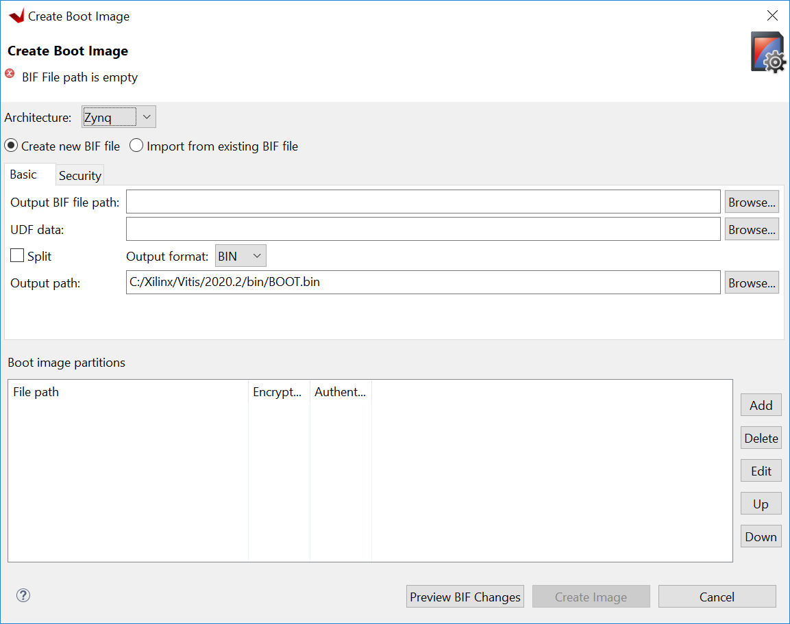
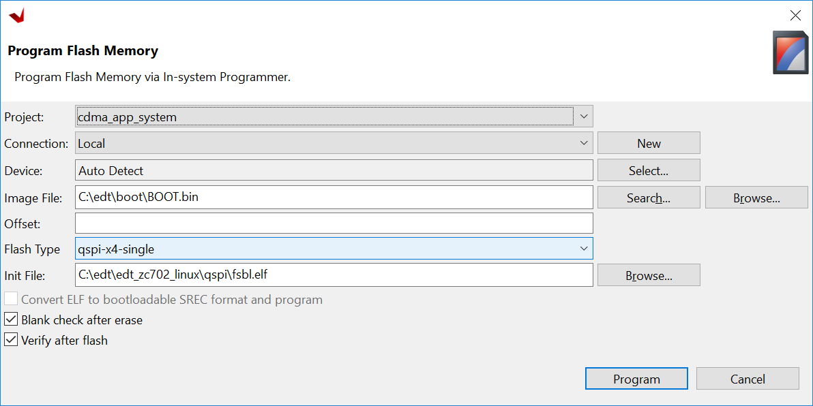

<th width="100%" colspan="6"><h1>Zynq-7000 SoC Embedded Design Tutorial 2020.2 (UG1165)</h1>
</th>

  </tr>

</table>


# Linux Boot Image Configuration

In previous chapters, we used SD Boot mode for all examples for Linux. SD Boot is easy to use for development. Sometimes we need to change boot source to QSPI Flash for its reliability and anti-vibration. In the board bring-up development phase, since the peripherals may not be available yet, boot with JTAG is a common technique for debugging.
 
This chapter describes the detailed steps of use cases mentioned above.

## Boot Methods

The following boot methods are available for ZYNQ-7000 devices:

-   Master Boot Method

-   Slave Boot Method

### Master Boot Method

In the master boot method, different kinds of non-volatile memories
such as QSPI, NAND, NOR flash, and SD cards are used to store boot
images. In this method, the CPU loads and executes the external boot
images from non-volatile memory into the Processor System (PS). The
master boot method is further divided into Secure and Non Secure
modes. Refer to the *Zynq-7000 SoC Technical Reference Manual*
([UG585](https://www.xilinx.com/cgi-bin/docs/ndoc?t=user_guides;d=ug585-Zynq-7000-TRM.pdf)) for more detail.

The boot process is initiated by one of the Arm&reg; Cortex&trade;-A9 CPUs in
the processing system (PS) and it executes on-chip ROM code. The
on-chip ROM code is responsible for loading the first stage boot
loader (FSBL). The FSBL does the following:

-   Configures the FPGA with the hardware bitstream (if it exists)

-   Configures the MIO interface

-   Initializes the DDR controller

-   Initializes the clock PLL

-   Loads and executes the Linux U-Boot image from non-volatile memory
    to DDR

The U-Boot loads and starts the execution of the kernel image, the
root file system, and the device tree from non-volatile RAM to DDR. It
finishes booting Linux on the target platform.

### Slave Boot Method

JTAG can only be used in slave boot mode. An external host computer
acts as the master to load the boot components into the OCM, DDR or FPGA using a JTAG
connection.

***Note*:** The PS CPU remains in idle mode while the boot image
loads. The slave boot method is always a non-secure mode of booting.

In JTAG boot mode, the CPU enters halt mode immediately after it
disables access to all security related items and enables the JTAG
port. You must download the boot images into the DDR memory before
restarting the CPU for execution.

### Booting Linux from JTAG

The flow chart in the following figure describes the process used to
boot Linux on the target platform.

 

## Example 9: Booting Linux with JTAG

This section covers the flow for booting Linux on the target board
using the pre-compiled images with JTAG.

### Input and Output Files

- Input Files: files generated by PetaLinux in Example 4 or Example 5
  - zynq_fsbl.elf
  - u-boot.elf
  - Image.ub
- Output Files: N/A

### Booting Linux in JTAG Mode


1.  Check the following board connections and settings for Linux booting
    using JTAG mode:

    - Ensure that the settings of Jumpers J27 and J28 are set as described in [Example 2 - Board Setup](2-using-zynq.md#setup-the-boardo).

    - Ensure that the SW16 switch is set to 00000, as shown in the following figure.

           

    - Connect an Ethernet cable from the Zynq-7000 SoC board to your
        network or directly to your host machine.

    - Connect the Windows Host machine to your network.

    - Connect the power cable to the board.

             

2.  Connect a Micro USB cable between the Windows host machine and the
    target board JTAG port with the following **SW10** switch settings, as shown in
    the following figure.

    -   Bit-1 is 0

    -   Bit-2 is 1

    ***Note*:** 0 = switch is open. 1 = switch is closed. The correct JTAG
    mode has to be selected, according to the user interface. The JTAG
    mode is controlled by switch SW10 on the zc702 and SW4 on the zc706.

    

3.  Connect a USB cable to connector J17 on the target board with the
    Windows Host machine. This is used for USB to serial transfer.

4.  Change Ethernet Jumper J30 and J43 as shown in the following figure.

        

5.  Power on the target board.

6.  Launch Vitis IDE with any workspace.

7.  If the serial terminal is not open, connect the serial communication
    utility with the baud rate set to **115200**.

    ***Note*:** This is the baud rate that the UART is programmed to on
    Zynq devices.

8.  Download the bitstream by selecting **Xilinx → Program FPGA**, then
    clicking **Program**.

9.  Open the Xilinx System Debugger (XSCT) tool by selecting **Xilinx → XSCT Console**.

10. At the XSCT prompt, do the following:

    - Run `connect` to connect with the PS section.

    - Run `targets` to get the list of target processors.

    - Run `ta 2` to select the processor CPU1.

    ```
    xsct% targets
    1 APU
    2 Arm Cortex-A9 MPCore #0 (Running)
    3 Arm Cortex-A9 MPCore #1 (Running)
    4 xc7z020
    xsct% ta 2
    xsct% targets
    1 APU
    2* Arm Cortex-A9 MPCore #0 (Running)
    3 Arm Cortex-A9 MPCore #1 (Running)
    4 xc7z02022
    ```

    - Run `dow zynq_fsbl.elf` to download
        PetaLinux FSBL.

    - Run `con` to start execution of FSBL and then run `stop` to stop
        it.

    - Run `dow u-boot.elf` to download
        PetaLinux U- Boot.elf.

    - Run con to start execution of U-Boot. On the serial terminal, the autoboot countdown message appears: ``Hit any key to stop autoboot: 3``.

    - Press **Enter**. Automatic booting from U-Boot stops and a command prompt appears on the serial terminal.

    - At the XSCT Prompt, run `stop`. The U-Boot execution stops.

    - Run `dow -data image.ub 0x30000000` to download the Linux Kernel
        image.

    - Run `con` to start executing U-Boot.

11. At the command prompt of the serial terminal, run `bootm 0x30000000`.
    The Linux OS boots.

## Example 10: Booting Linux from QSPI Flash

In this example, we will make a linux boot image for QSPI Flash, write it into Flash and let it boot.

QSPI Flash on board normally has less capacity than SD Card or eMMC because of its relatively high price. So we will need to plan its layout carefully. Linux kernel image and rootfs can be stored in the same QSPI as this example, or stored in another non-volatile storage such as SD card, NAND Flash or eMMC. The only difference would be the BOOT.BIN packaging contents.

In this example, we will not only package normal boot components, such as FSBL, bitstream, and u-boot into BOOT.BIN, but also boot.scr that u-boot reads and the flat image image.ub which contains Linux kernel, device tree (which Linux kernel reads) and rootfs.

The normal boot components can be packaged continuously. After bootrom loads FSBL, FSBL can load bitstream and u-boot properly and give control to u-boot.

U-boot reads boot.scr from Flash offset 0x00FC0000 by default. So we should assign boot.scr to this address during packaging.

It's programmed in boot.scr by default that if boot mode is QSPI, it would read image.ub from Flash offset 0x01000000 (16MB). But since ZC702 has only 16MB QSPI Flash, we need to modify boot.scr to load it from around 5MB area. Since the petalinux-package command uses 0x00520000 by default, we can keep using this address.

Here's the memory address layout we will create in this example.

| Partition | Flash Offset Address                         | Size       | DDR Loading Address           |
| --------- | -------------------------------------------- | ---------- | ----------------------------- |
| FSBL      | 0x0                                          | Very Small | Address info embedded in ELF  |
| Bitstream | Continuous with previous partition           | 3.9MB      | FSBL loads it as data         |
| u-boot    | Continuous with previous partition           | Very Small | Address info embedded in ELF  |
| image.ub  | U-boot loads it from 0x00520000              | 11MB       | U-boot loads it to 0x10000000 |
| boot.scr  | U-boot reads it from Flash offset 0x00FC0000 | 2KB        | U-boot loads it to 0x03000000 |

### Input and Output Files

- Input Files: PetaLinux project in Example 4 or Example 5
  - zynq_fsbl.elf
  - u-boot.elf
  - FPGA bit file: system.bit in PetaLinux image directory or system_wrapper.bit in Vivado directory
  - image.ub
  - boot.scr
- Output Files: BOOT.BIN binary to write to QSPI Flash

### Configure PetaLinux for Booting from QSPI

PetaLinux must be configured for QSPI flash boot mode and rebuilt. By default, the Boot option is SD boot. After changing the configuration, the generated u-boot will load image from QSPI Flash instead of SD card.

1.  Change to the root directory of your PetaLinux project:

    ```bash
    $ cd <plnx-proj-root>
    ```

2.  Launch the top-level system configuration menu:

    ```bash
    $ petalinux-config
    ```

3.  Select **Subsystem AUTO Hardware Settings**.

4.  Select **Advanced Bootable Images Storage Settings**.

    - Select **boot image settings**.

    - Select **Image Storage Media**.
    
    - Select boot device as **primary flash**.

5.  Under the **Advanced Bootable Images Storage Settings** sub-menu:

    - Select **kernel image settings**.

    - Select **Image Storage Media**.

    - Select the storage device as **primary flash**.

6.  Save the configuration settings and exit the configuration wizard.

### Reduce Root File System Size

Since we have limited QSPI Flash size, we need to shrink the rootfs size so that the rootfs can be packed into 16MB QSPI Flash. If in your system you have larger QSPI Flash, this step can be skipped.

1. Use your favorite editor to open rootfs_config file in `<PetaLinux Project>/project-spec/configs` directory.

2. Comment these lines

    ```
    CONFIG_imagefeature-hwcodecs=y
    CONFIG_can-utils=y
    ```

    Save the file and quit the text editor. 

3. Run `petalinux-config -c rootfs --silentconfig` to update the rootfs configuration

### Changing boot.scr for image.ub Offset Address and Size

By default, boot.scr load image.ub from 0x01000000. You can open boot.scr with text editors to check the behavior. If your system has more than 16MB QSPI Flash, this step can be skipped. But you need to pay attention to boot image packaging step to make sure the image.ub offset address is set to match the offset address in boot.scr.

1. Use text editor to open `<PetaLinux Project>/project-spec/meta-user/recipes-bsp/u-boot/u-boot-zynq-scr.bbappend`

2. Change QSPI_KERNEL_OFFSET_zynq to 0x520000, QSPI_FIT_IMAGE_SIZE_zynq to 0xAE0000, because these two variables are used in `/project-spec/meta-user/recipes-bsp/u-boot/u-boot-zynq-scr/boot.cmd.default.initrd` as `sf read @@QSPI_FIT_IMAGE_LOAD_ADDRESS@@ @@QSPI_KERNEL_OFFSET@@ @@QSPI_FIT_IMAGE_SIZE@@;`

    ```
    QSPI_KERNEL_OFFSET_zynq = "0x520000"
    QSPI_FIT_IMAGE_SIZE_zynq = "0xAE0000"
    ```

    Save the file and quit the text editor.


### Build the PetaLinux Image

1.  Rebuild PetaLinux project

    - Run `petalinux-build` command.

    PetaLinux will generate the new u-boot and boot.scr.

    ***Note*:** For more information, refer to the *PetaLinux Tools
    Documentation: Reference Guide*
    ([UG1144](https://www.xilinx.com/cgi-bin/docs/rdoc?v=2020.2%3Bd%3Dug1144-petalinux-tools-reference-guide.pdf)).

### Make a Linux Bootable Image for QSPI Flash with PetaLinux

BOOT.BIN is generated by bootgen utility. It reads in BIF for boot partition information. PetaLinux can help to create the BIF file with command line options and call bootgen to generate the BOOT.BIN file. Alternatively, Vitis IDE can create BIF files with GUI wizards and call bootgen as well. We will introduce PetaLinux way in this section and introduce Vitis IDE method in the next section.

1. Run the `petalinux-package --boot` command in `<PetaLinux Project>/images/linux` directory

    ```
    cd images/linux
    petalinux-package --boot --fpga ./system.bit --u-boot --add boot.scr --offset 0xfc0000 --kernel --force
    ```

    **BOOT.BIN** would be generated in the images/linux directory.

    - `--fpga` option assigns the FPGA bit file. It's optional.
    - `--u-boot` will package u-boot.elf into BOOT.BIN
    - `--add --offset` will add a data file to a specific Flash offset.
    - `--kernel` adds image.ub to Flash offset 0x520000.
    - `--force` would force to overwrite if BOOT.BIN already exists
    - FSBL would be added by default. We don't need to add an option to assign it.

    You can review the **bootgen.bif** contents in `<PetaLinux Project>/build/` directory.


### Make a Linux Bootable Image for QSPI Flash With Vitis

This method is an alternative to PetaLinux method.

If your PetaLinux tools and Vitis Software Platform are not installed on the same machine, please copy PetaLinux generated boot component files to the Vitis environment first.

1.  In the Vitis IDE, go to menu **Xilinx → Create Boot Image** to open the Create Boot Image wizard.

        

    Note: You may see different initial screen for Create Boot Image wizard. When a system project is selected, Vitis IDE will try to generate initial BIF for this project. When a platform project is selected, or if it's in an empty workspace, Vitis will show the wizard with no initial values.

2.  From the **Architecture** drop-down list, select **Zynq**.

3. Choose **Create New BIF File**

4.  Specify the **Output BIF file path**.

    - Click **Browse** next to the **Output BIF file path** field
    - Navigate to any path. For example, `C:\edt\boot\output.bif`
    - Click **Save**
    - The **Output path** field will be updated automatically. The output BOOT.bin will be in the same directory with BIF by default. You can also change the output path.

5.  Click **Add** to add the following boot image partitions:

    | File Path  | Partition Type | Offset   |
    | ---------- | -------------- | -------- |
    | fsbl.elf   | bootloader     |          |
    | system.bit | datafile       |          |
    | u-boot.elf | datafile       |          |
    | image.ub   | datafile       | 0x520000 |
    | boot.scr   | datafile       | 0xfc0000 |

6.  Click **Create Image** to create the BOOT.bin file in the specified output path folder.

7. Review the generated BIF. It should look like this example.

    ```
    //arch = zynq; split = false; format = BIN
    the_ROM_image:
    {
        [bootloader]C:\edt\edt_zc702_linux\qspi\fsbl.elf
        C:\edt\edt_zc702_linux\qspi\system.bit
        C:\edt\edt_zc702_linux\qspi\u-boot.elf
        [offset = 0x520000]C:\edt\edt_zc702_linux\qspi\image.ub
        [offset = 0xFC0000]C:\edt\edt_zc702_linux\qspi\boot.scr
    }
    ```


### Program QSPI Flash with the Flash Programming Tool

You can use the Flash Programming Tool in Vitis IDE to program BOOT.BIN into the QSPI Flash. The Program Flash GUI Wizard in Vitis IDE provides an easy way to select files and programming modes. Once the settings are ready, it can call program_flash command line tool to do the programming task. This is an easy to use method. You can also use JTAG to load u-boot to DDR and use the u-boot to program QSPI Flash. We will introduce this method in next section.

Following the steps below, you can program QSPI Flash with the flash
programming tool in the Vitis software platform:

1.  Power on the ZC702 Board in JTAG boot mode (SW16 = 00000).

2.  Select **Xilinx → Program Flash** in Vitis IDE.

3.  Select Image File to the BOOT.bin file

4. Select Flash Type to **qspi-x4-single**

5. Enable **Blank Check after Erase** and **Verify after flash**.

6. Select **Program**.

        

On successful programming, a message appears in the console window
saying Flash Operation Successful.

6.  Power off the board and boot it in QSPI Boot Mode (SW16=01000)

### (Optional) Program QSPI Flash with the Boot Image Using JTAG

This is an alternative way for programming QSPI Flash with the Flash Programming Tool. You can program QSPI Flash using JTAG and u-boot. This method provides more control to user becuase u-boot is programmable. For example, you can extend this method to use Ethernet, rather than JTAG, to send BOOT.bin to the ZC702 DDR memory so that the program process can be faster. Here are the basic steps using JTAG.

1.  Power on the ZC702 Board.

2.  If a serial terminal is not already open, connect the serial
    terminal with the baud rate set to 115200.

    ***Note*:** This is the baud rate that the UART is programmed to on
    Zynq devices.

3.  Select **Xilinx → XSCT Console** to open the XSCT tool.

4.  From the XSCT prompt, do the following:

    - Run `connect` to connect with the PS section.

    - Run `targets` to get the list of target processors.

    - Run `ta 2` to select the processor CPU1.

    - Run `dow fsbl.elf` to download the FSBL image.

    - Run `con` and then run `stop` to use FSBL to initialize the ZYNQ-7000 device.

    - Run `dow u-boot.elf` to download the Linux U-Boot.

    - Run `dow -data BOOT.bin 0x08000000` to download the Linux
        bootable image to the target memory at location 0x08000000.

        You just downloaded the binary executable to DDR memory. You can
        download the binary executable to any address in DDR memory.

    - Type `con` to start execution of U-Boot. U-Boot begins booting. On the serial terminal, the autoboot countdown message appears:

        ``Hit any key to stop autoboot: 3``

5.  Press **Enter**. Automatic booting from U-Boot stops and the U-Boot command prompt appears on the serial terminal.

6.  Do the following steps to use U-Boot to program the bootable image to QSPI Flash in the serial console:

    -  At the prompt, run `sf probe 0 1000000 0` to select the QSPI Flash and set clock to 1MHz

    - Run `sf erase 0 0x01000000` to erase the Flash data.This command completely erases 16 MB of on-board QSPI Flash memory.

    - Run `sf write 0x08000000 0 0xffffff` to write the boot image on the
    QSPI Flash.

    Note that you already copied the bootable image at DDR location
    0x08000000. This command copied the data, of the size equivalent to
    the bootable image size, from DDR to QSPI location 0x0.

    For this example, because you have 16 MB of Flash memory, you copied
    16 MB of data. You can change the argument to adjust the bootable
    image size.

7.  Power off the board and follow the booting steps described in the
    following section.

### Booting Linux from QSPI Flash

1.  After you program the QSPI Flash, set the SW16 switch on your board as shown in the following figure.

        

2.  Connect the Serial terminal using an 115200 baud rate setting.

    ***Note*:** This is the baud rate that the UART is programmed to on
    Zynq devices.

3.  Switch on the board power.

    A Linux booting message appears on the serial terminal. After booting
    finishes, the `root@xilinx-zc702-2020_2:~#` prompt appears. Enter the
    login and password as root when prompted.

4.  Check the Board IP address connectivity as described in [Booting Linux Using JTAG Mode](#booting-linux-using-jtag-mode).

    For Linux Application creation and debugging, refer to [Example Design: Debugging the Linux Application Using the Vitis Software Platform](#example-design-debugging-the-linux-application-using-the-vitis-software-platform).


© Copyright 2015–2021 Xilinx, Inc.
