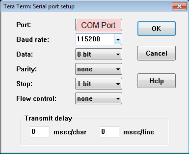
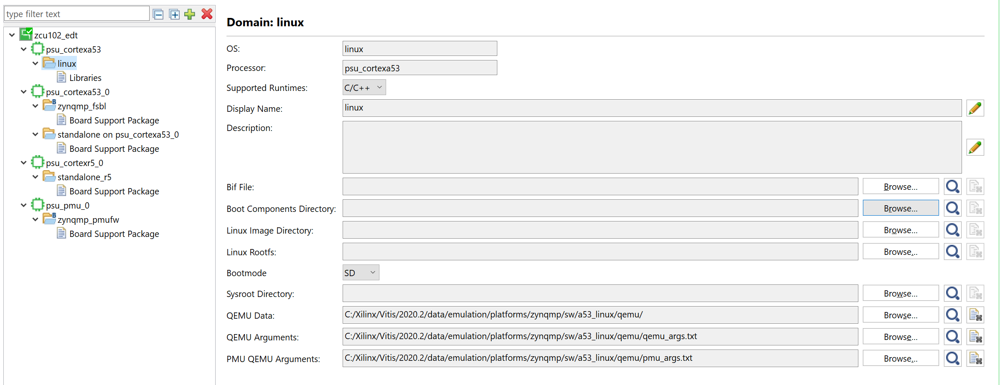
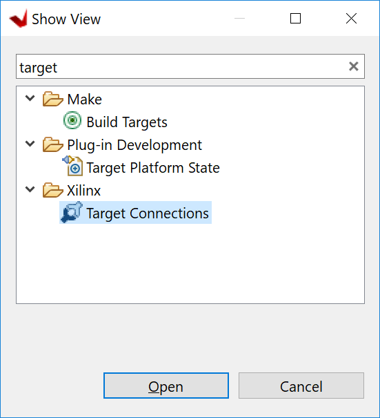
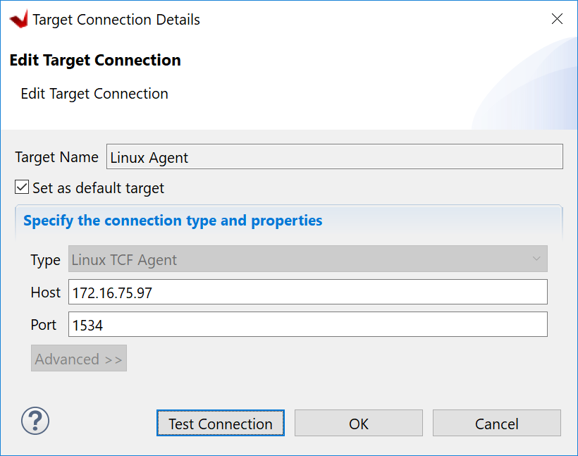
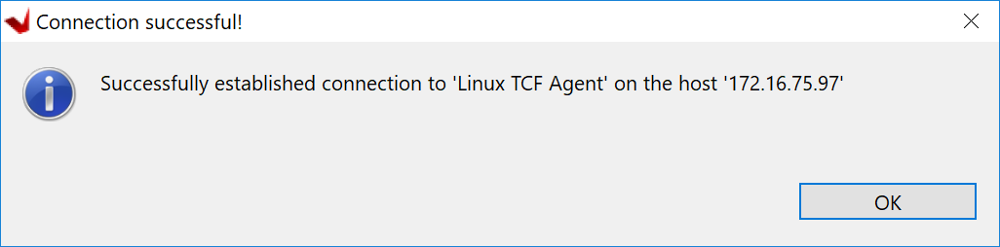
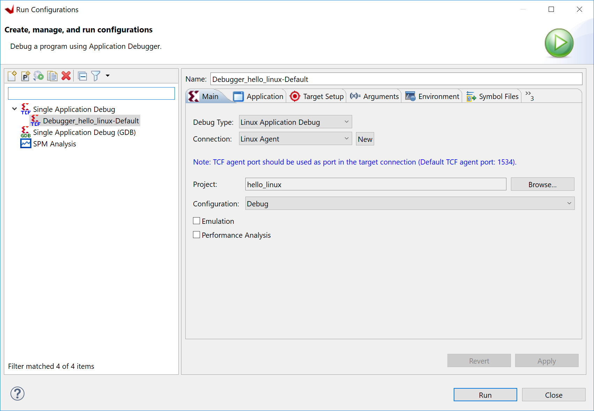

<p align="right">
            Read this page in other languages:<a href="../docs-jp/4-build-sw-for-ps-subsystems.md">日本語</a>    <table style="width:100%"><table style="width:100%">
  <tr>

<th width="100%" colspan="6"><h1>Zync UltraScale+ MPSoC Embedded Design Tutorial 2020.2 (UG1209)</h1>
</th>

  </tr>

</table>

# Build Linux Applications for PS

The earlier examples highlighted creation of the bootloader images and bare-metal applications for APU, RPU, and PMU using the Vitis IDE. In this chapter, we will introduce how to develop Linux applications.

## Example 6: Create Linux Images and Applications using PetaLinux

In this example, you will configure and build Linux Operating System
 Platform for Arm Cortex-A53 core based APU on Zynq UltraScale+. You
 can configure and build Linux images using the PetaLinux tool flow,
 along with the board-specific BSP. Linux application will be developed in Vitis IDE.

### Input and Output Files

- Input: 
  - hardware XSA (edt_zcu102_wrapper.xsa generated by example 1)
  - [ZCU102 PetaLinux BSP][3]
- Output:
  - PetaLinux boot images (BOOT.BIN, image.ub)
  - PetaLinux application (hello_linux)

 **IMPORTANT!**

> 1. This example needs a Linux Host machine with PetaLinux installed. Please refer to PetaLinux Tools Documentation: Reference Guide* ([UG1144][1])
 for information about dependencies for PetaLinux 2020.2.
 
>2.  This example uses the [ZCU102 PetaLinux BSP][3] to create a PetaLinux
    project. Ensure that you have downloaded the ZCU102 BSP for
    PetaLinux as instructed in [PetaLinux Tools download page][2].

[1]: https://www.xilinx.com/cgi-bin/docs/rdoc?v=latest;d=ug1144-petalinux-tools-reference-guide.pdf
[2]: https://www.xilinx.com/support/download/index.html/content/xilinx/en/downloadNav/embedded-design-tools.html
[3]: https://www.xilinx.com/member/forms/download/xef.html?filename=xilinx-zcu102-v2020.2-final.bsp

1. Create a PetaLinux project using the following command:

    ```bash
    petalinux-create -t project -s <path to the xilinx-zcu102-v2020.2-final.bsp>
    ```

    Note: xilinx-zcu102-v2020.2-final.bsp is the PetaLinux BSP for ZCU102 Production Silicon Rev1.0 Board.

    This creates a PetaLinux project directory, xilinx-zcu102-2020.2.

2. Reconfigure the project with edt_zcu102_wrapper.xsa
   
   - The created PetaLinux project uses default hardware setup in ZCU102 Linux BSP. For this example, we will reconfigure the PetaLinux Project based on the Zynq
    UltraScale+ hardware platform that you configured using Vivado Design
    Suite in [Zynq UltraScale+ MPSoC Processing System Configuration](3-system-configuration.md).
   
   - Copy the hardware platform edt_zcu102_wrapper.xsa to the Linux Host machine.

   - Reconfigure the project using the following command:

   ```bash
   cd xilinx-zcu102-2020.2
   petalinux-config --get-hw-description=<path containing edt_zcu102_wrapper.xsa>
   ```

    This command opens the PetaLinux Configuration window. You can review these settings. If required, make changes in the configuration. For this example, the default settings from the BSP are sufficient to generate required boot images. 
    
    If you'd like to skip the configuration window and keep default settings, you can run the following command.

    ```
    petalinux-config --get-hw-description=<path containing edt_zcu102_wrapper.xsa> --silentconfig
    ```

3.  Build the PetaLinux project

    - In `<PetaLinux-project>` directory, e.g. xilinx-zcu102-2020.2, build the Linux images using the following command:

    ```bash
    petalinux-build
    ```

    After the above statement executes successfully, verify the images
     and the timestamp in the images directory in the PetaLinux project
     folder using the following commands:

    ``` bash
    cd images/linux
    ls -al
    ```

4.  Generate the Boot image using the following command:

    ```bash
    petalinux-package --boot --fsbl zynqmp_fsbl.elf --u-boot
    ```

    This creates a **BOOT.BIN** image file in **<petalinux-project>/images/linux/** directory.

    The logs indicate that the above command includes PMU_FW and ATF in BOOT.BIN. You can also add `--pmufw <PMUFW_ELF>` and `--atf <ATF_ELF>` in the above command if you'd like to use any custom firmware images. Refer `petalinux-package --boot --help` for more details about boot image package command details.

    **Note**: The option to add bitstream, that is `--fpga`, is missing
    from the above command intentionally because so far the hardware
    configuration is based only on PS with no design in PL. If a bitstream
    is present in the design, `--fpga` can be added in the
    petalinux-package command as shown below:
    
    ```bash
    petalinux-package --boot --fsbl zynqmp_fsbl.elf --fpga system.bit --pmufw pmufw.elf --atf bl31.elf --u-boot u-boot.elf
    ```

### Verify the Image on the ZCU102 Board

 To verify the image, follow these steps:

1. Copy `BOOT.BIN`, `image.ub`, and `boot.scr` files to the SD card. Here
     `boot.scr` is read by U-Boot to load kernel and rootfs.

2. Load the SD card into the ZCU102 board, in the J100 connector.

3. Connect a Micro USB cable from ZCU102 Board USB UART port (J83), to
     USB port on the host Machine.

4. Configure the Board to Boot in SD-Boot mode by setting switch SW6 as
     shown in the following figure.

    

5. Connect 12V Power to the ZCU102 6-Pin Molex connector.

6. Start a serial terminal session, using Tera
     Term or Minicom depending on the host machine being used. set the
     COM port and baud rate for your system, as shown in the following
     figure.

     

7. For port settings, verify COM port in the device manager and select
     the COM port with interface-0.

8. Turn on the ZCU102 Board using SW1, and wait until Linux loads on
     the board.

### Create Linux Applications in Vitis IDE

1. Create a Linux domain 

   - Double click **platform.spr** in zcu102_edt platform to open platform configurations
   - Click + button to add a domain
   - Input domain parameters
       - Name: **linux**
       - OS: **linux**
       - Keep other options as is and click **OK**
   - Review the Linux domain configuration details

   

   - Build the platform project by clicking the hammer icon

2. Create a Linux application

   - Click menu **File -> New -> Application Project**
   - Click **Next** on welcome page.
   - Select platform: **zcu102_edt**. Click **Next**.
   - Input Application Project name: **hello_linux**
       - Target processor: **psu_cortexa53 SMP**
   - Keep the default domain: **linux**
   - Keep empty of SYSROOT, rootfs and Kernel image and click **next**
   - Select template: Linux Hello World. Click **Finish**.

   Note: If user inputs extracted SYSROOT directory, Vitis can find include files and libraries in SYSROOT. SYSROOT is generated by PetaLinux project `petalinux-build --sdk`. Please refer UG1144 for more info about SYSROOT generation.

   Note: If user inputs rootfs and Kernel image, Vitis can help to generate SD_card.img when building the Linux system project.

3. Build the **hello_linux** application

   - Select **hello_linux**
   - Click hammer button to build the application

4. Prepare for running the Linux application on ZCU102

    Vitis can download the Linux application to the board which runs Linux through network. We need to make sure the network between the host machine and the board links well.

   - Make sure USB UART cable is still connected with the ZCU102 board. Turn on your serial console and connect to the UART port.
   - Connect Ethernet cable between the host and the ZCU102 board
       - It can be a direct connection from host to ZCU102 board.
       - You can also connect the host and the ZCU102 board via a router: Host connect to the router; ZCU102 board connect to the router.
   - Power on the board and let Linux run on ZCU102 (See step [Verify the Image on the ZCU102 Board](#verify-the-image-on-the-zcu102-board))
   - Setup networking software environment
       - If host and the board are connected directly, run `ifconfig eth0 192.168.1.1` to setup IP address on the board; Go to **Control Panel -> Network and Internet -> Network and Sharing Center**, click **change adapter settings**. Find your Ethernet adapter, right click and select **Properties**. Double click **Internet Protocol Version 4 (TCP/IPv4)**, select **Use the following IP address**. Input IP address: **192.168.1.2**. Click OK.
       - If host and the board are connected through a router, they should be able to get IP address from the router. If the Ethernet cable is plugged in after the board boots up, you can get the IP address manually by this command `udhcpc eth0`. It will return the board IP address.
       - Ping each other to make sure the network is setup correctly.

5. Setup Linux Agent in Vitis IDE

   - Click the **target connections** icon on the tool bar. 
   - It can also be launched by menu **Window -> Show View...** -> search for target

   

   - In the target connections window, double click **Linux TCF Agent -> Linux Agent[default]**
   - Input the IP address of your board
   - Click **Test Connection**

   

   - Vitis should return a pop-up confirmation for success.

   

6. Run the Linux application

   - Right click **hello_linux**, select **Run As -> Run Configuration**
   - Expand **Single Application Debug** and select **Debugger_hello_linux-Default**
   - Review the configurations
       - Debug type: Linux Application Debug
       - Connection: Linux Agent
   - Click **Run**

   

   - The console would print **Hello World**.

    


 Next, you will debug software for Zynq UltraScale+ devices using the
 Vitis IDE in [Debugging with the Vitis
 Debugger](6-debugging-with-vitis-debugger.md).