# Design Example 1: Using GPIOs, Timers, and Interrupts

 The Zynq ZCU102 UltraScale+ Evaluation Board comes with a few user
 configurable Switches and LEDs. This design example makes use of
 bare-metal and Linux applications to toggle these LEDs, with the
 following details:

- The Linux applications configure a set of PL LEDs to toggle using a
     PS Dip Switch, and another set of PL LEDs to toggle using a PL Dip
     Switch (SW17).

- The Linux APU A-53 Core 0 hosts this Linux application, while the
     RPU R5-0 hosts another bare-metal application.

- The R5-Core 0 application uses an AXI Timer IP in Programmable logic
     to toggle PS LED (DS50). The application is configured to toggle
     the LED state every time the timer counter expires, and the Timer
     in the PL is set to reset periodically after a user-configurable
     time interval. The system is configured such that the APU Linux
     Application and RPU Bare-metal Application run simultaneously.

## Configuring Hardware

 The first step in this design is to configure the PS and PL sections.
 This can be done in Vivado IP integrator. You start with adding the
 required IPs from the Vivado IP catalog and then connect the
 components to blocks in the PS subsystem.

1. If the Vivado Design Suite is already open, start from the block diagram shown in and jump to step 4.

2. Open the Vivado Project that you created in Introduction tutorial step 3:

    `C:/edt/edt_zcu102/edt_zcu102.xpr`

3. Save the project as design_example_1

    - Click File -> Project -> Save As 
    - Input project name **design_example_1**
    - Uncheck **Include run results**
    - Click **OK**
    
    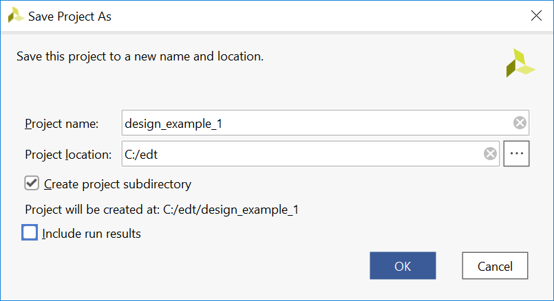

4. In the Flow Navigator, under IP integrator, click **Open Block Design** and select `edt_zcu102.bd`.

    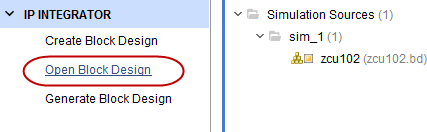

### Adding the AXI Timer and AXI GPIO IP

1. Adding the AXI Timer IP

    - Right-click in the block diagram and select **Add IP** from the IP catalog.

    - In the catalog, select **AXI Timer**.

    The IP Details information displays, as shown in the following figure.

    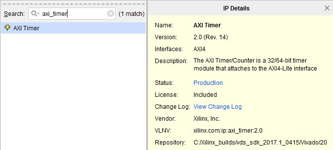

    - Double-click the **AXI Timer** IP to add it to the design.

2. Review **AXI Timer** configurations

    - Double-click the **AXI Timer** IP block to configure the IP, as
     shown in following figure.

    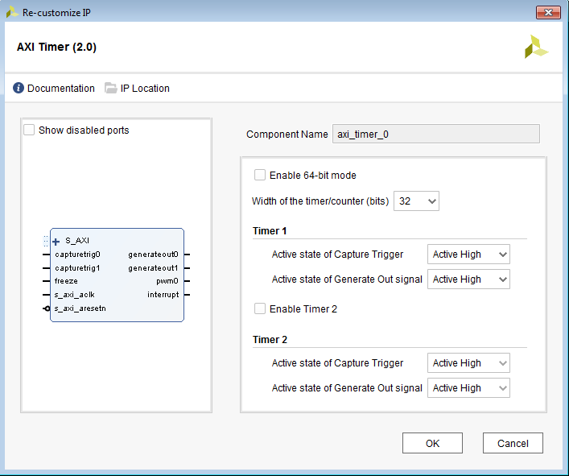

    - Click **OK** to close the window.

3. Adding the **AXI GPIO** IP

    - right-click in the block diagram and select **Add IP**.
    Search for "AXI GPIO" and double-click the **AXI GPIO** IP to add it to the design.

4. Adding the second **AXI GPIO** IP

    - Copy the **axi_gpio_0** IP by typing **Ctrl+C**
    - Paste it by typing **Ctrl+V**
    - You can see axi_gpio_1 is created.

5. Configure **axi_gpio_0** for push buttons

    - Double-click **axi_gpio_0** to open its configurations
    - Select **Push button 5bits** from the Board Interface drop-down list on **GPIO** row.

    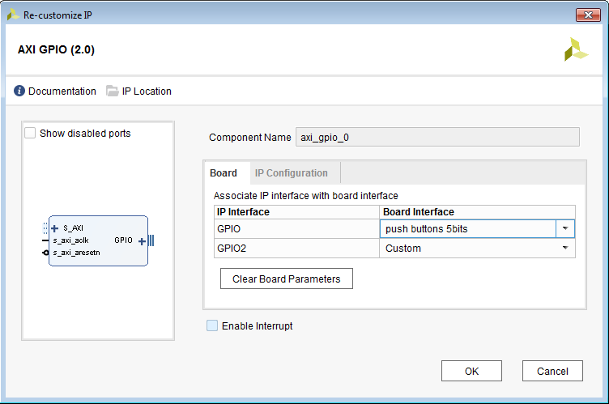

    - Click **OK**

6. Configure **axi_gpio_1** for PL LEDs

    - Double-click **axi_gpio_1** to open its configurations
    - Select **led_8bits** from the Board Interface drop-down list on **GPIO** row.

    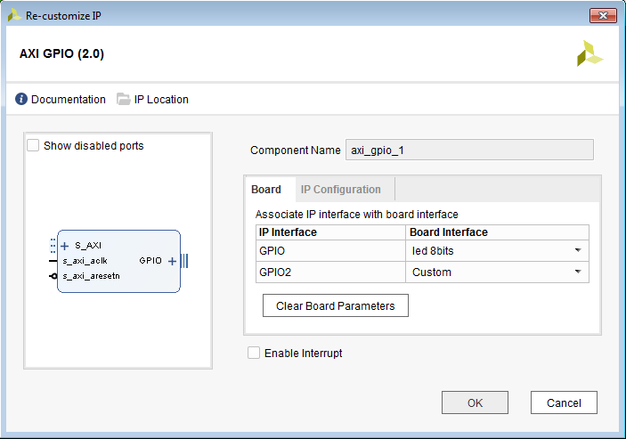

    - Click **OK**.

### Connecting IP Blocks to Create a Complete System

We will connect the IP blocks we instantiated above to the PS block.

- Use PS HPM LPD AXI to control AXI interface of GPIO and Timer.
- Connect Interrupt signals

1. Enable PS AXI HPM LPD AXI Interface

   - Double-click the **Zynq UltraScale+ MPSoC** IP block
   - Select **PS-PL Configuration** tab
   - Enable **AXI HPM0 LPD**, expand it, set the AXI HPM0 LPD Data Width drop-down to **128**-bit
   - Click **OK** to close the window
   - Check that **M_AXI_HPM0_LPD** interface shows up on MPSoC block.

   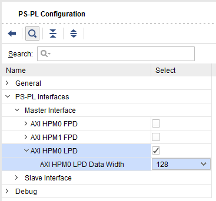

2. Connect the AXI interfaces

    - Click **Run Connection Automation**
    - Check **All Automation**
    - Go through each tab to review the planning connections
    - Click **OK** to execute the automated connection
    - Check the connection result

    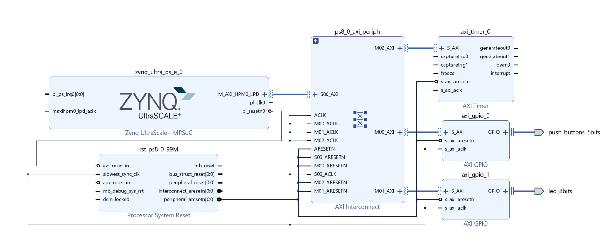

3. Connect the interrupt signals

    - Connect axi_timer_0.interrupt to zynq_ultra_ps_e_0.pl_ps_irq0[0:0]
    - We wil not use interrupt mode of AXI GPIO. 
    - Review the final block diagram.

    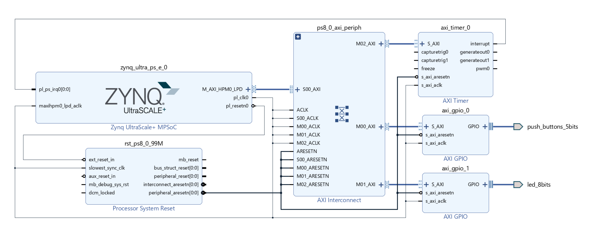

    >Note: If you have multiple interrupt signals to connect to PS, you can concat them to a bus with a `concat` block. You can add `concat` from **Add IP**.

4. Verify the address settings of IP cores

    - In the Address Editor view, verify
     that the corresponding IPs are assigned with some addresses during connection automation. If they are not assigned, please click Assign All button to assign address for them.

     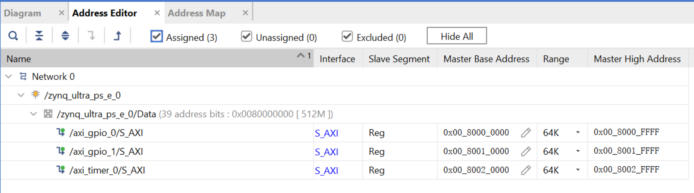

### Export the post-implementation hardware platform

We will run implementation of the Vivado design and export the post-implementation design. The Vivado generated bitstream will be included in the XSA file. It can make the software tests and boot image generation steps easier in Vitis. Please note that Vitis IDE also accepts pre-synthesis XSA for application development. Bitstream is only needed for debugging PL designs.

1. Validate the block diagram design

    - Return to the block diagram view
    - Save the Block Design (press **Ctrl + S**).
    - Click the **Validate Design** botton on the block diagram tool bar. Alternatively, you can press the **F6** key.

    It takes a while to validate the design. A message dialog box will pop up and states "Validation successful. There are no errors or critical warnings in this design." If it reports any errors or critical warnings, please review the previous steps and correct the errors.

    - Click **OK** to close the message.

2. Generate output products

    - Click **Generate Block Design** in Flow Navigator panel.
    - Click **Generate**
    - When the Generate Output Products process completes, click **OK**.
    - In the Block Diagram Sources window, click the **IP Sources** tab.
     Here you can see the output products that you just generated, as
     shown in the following figure.

    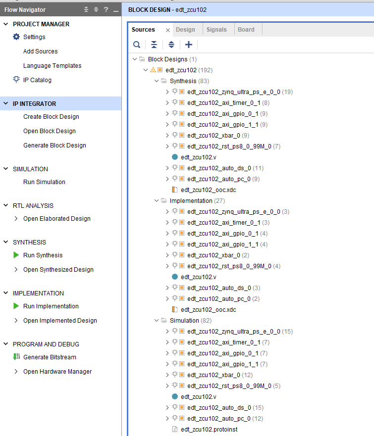

3. Make sure you have an HDL top file

    - Since this design is saved from introduction design, we have already done it.

4. Run synthesis, implementation and bitstream generation

    - Click **Generate Bitstream**
    - Vivado will pop up a message "There are no implementation results available. OK to launch synthesis and implementation?"
    - Click **Yes**
    - Review the Launch Runs dialogue, set proper number of jobs to run simultaneously, and click **OK**.
    - Wait for Vivado to complete implementation. After it finishes, it will pop-up a Bitstream Generation Completed window. Click **Cancel** to close it.

    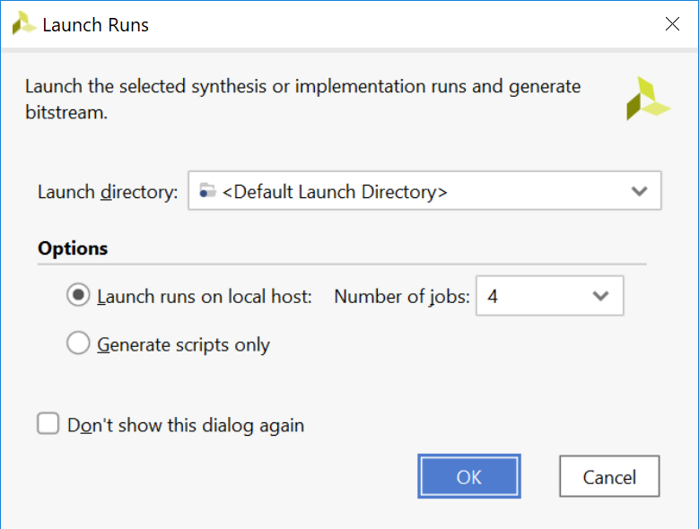

5. Exporting Hardware Platform

    - Select menu **File→ Export → Export Hardware**. The Export Hardware Platform window opens.
    - Click **Next**
    - Select **Include Bitstream** and click Next.
    - Specify XSA file name and path. We keep default in this example. Click **Next**.
    - Review the summary and click **Finish** to close the window.
    - The hardware platform file is generates in the specified path.

## Configuring Software

 This use case has a bare-metal application running on an R5 core and a
 Linux Application running on APU Linux Target. Most of the software
 blocks will remain the same as mentioned in [Build Software for PS Subsystems](4-build-sw-for-ps-subsystems.md). The software for this
 design example requires additional drivers for components added in the
 PL Logic. For this reason, you will need to generate a new Bare-metal
 BSP in the Vitis IDE using the Hardware files generated for this
 design. Linux also requires the Linux BSP to be reconfigured in sync
 with the new hardware platform file (XSA).

 Before you configure the software, first look at the application
 design scheme. The system has a bare-metal application on RPU, which
 starts with toggling the PS LEDs for a user configurable period. The
 LEDs are set to toggle in synchronization with PL AXI Timer running in
 the PL block. The application sets the AXI Timer in the generate mode
 and generates an interrupt every time the Timer count expires. The
 application is designed to toggle the PS LED state after handling the
 Timer interrupt. The application runs in an infinite while loop and
 sets the RPU in WFI mode after toggling the LEDs for the
 user-configured time period. This LED toggling sequence can be
 repeated again by getting the RPU out of WFI mode using an external
 interrupt. For this reason,

 the UART interrupt is also configured and enabled in the same
 application. While this application runs on the RPU, the Linux target
 also hosts another Linux application. The Linux application uses user
 Input from PS or PL switches to toggle PL LEDs. This Linux application
 also runs in an infinite while loop, waiting for user input to toggle
 PL LEDs. The next set of steps show how to configure System software
 and build user applications for this design.

### Configure and Build Linux Using PetaLinux

1. Create the Linux images using PetaLinux. The Linux images must be
     created in sync with the hardware configuration for this design.
     You will also need to configure PetaLinux to create images for SD
     boot.

2. Repeat steps 2 to 13 as described in [Example Project: Create Linux Images using PetaLinux](4-build-sw-for-ps-subsystems.md#example-project-create-linux-images-using-petalinux) to update the device tree and build Linux images using PetaLinux. 

3. Follow step 15 to verify the images. The next step is to create a Bare-metal Application targeted for Arm Cortex-R5F based RPU.

### Creating the Bare-Metal Application Project

1. In the Vitis IDE, select **File → New → Application Project**. The
     New Project wizard opens.

2. Use the information in the table below to make your selections in
     the wizard.

    *Table 12:* **Settings to Create Timer-Based RPU Application Project**

   |  Wizard Screen      |     System Properties          |  Settings      |
   |---------------------|--------------------------------|----------------|
   |  Platform           |  Select platform from repository   |  edt_zcu102_wrapper |
   |  Application project details       |  Application project name       |  tmr_psled_r5       |
   |                      |  System project  name   |   tmr_psled_r5_system                  |
   |                      |  Target processor   |  psu_cortexr5_0     |
   |  Domain             |  Domain             |  psu_cortexr5_0     |
   |  Templates          |  Available templates         |  Empty Application  |

3. Click **Finish**.

    The New Project wizard closes and the Vitis IDE creates the
    tmr_psled_r5 application project, which you can view in the Project
    Explorer.

4. In the Project Explorer tab, expand the tmr_psled_r5 project.

5. Right-click the **src** directory, and select **Import** to open the Import dialog box.

6. Expand General in the Import dialog box and select File System.

7. Click **Next**.

8. Select **Browse** and navigate to the `design-files/design1` folder, which you saved earlier (see [Design Files for This Tutorial](2-getting-started.md#design-files-for-this-tutorial)).

9. Click **OK**.

10. Select and add the timer_psled_r5.c file.

11. Click **Finish**.

 The Vitis IDE automatically builds the application and displays the
 status in the console window.

### Modifying the Linker Script

1. In the Project Explorer, expand the tmr_psled_r5 project.

2. In the `src` directory, double-click `lscript.ld` to open the linker script for this project.

3. In the linker script in Available Memory Regions, modify following  attributes for psu_r5_ddr_0\_MEM_0:

    Base Address: `0x70000000`
    Size: `0x10000000`

    The following figure shows the linker
    script modification. The following figure is for representation only.
    Actual memory regions might vary in case of isolation settings.

    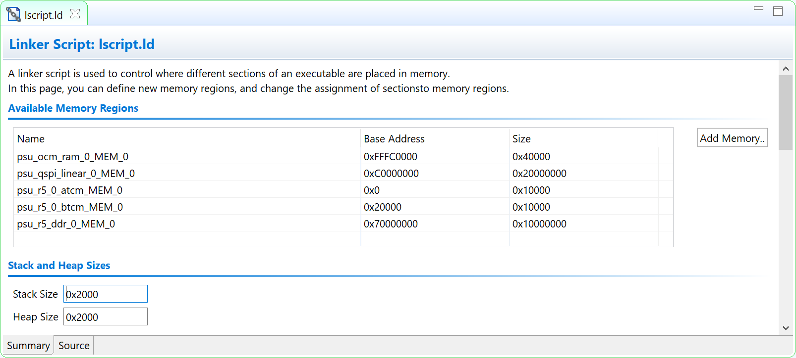

    This modification in the linker script ensures that the RPU bare-metal
    application resides above `0x70000000` base address in the DDR, and
    occupies no more than 256 MB of size.

4. Type **Ctrl + S** to save the changes.

5. Right-click the **tmr_psled_r5** project and select **Build Project**.

6. Verify that the application is compiled and linked successfully and that thetmr_psled_r5.elf file was generated in the `tmr_psled_r5\Debug` folder.

7. Verify that the BSP is configured for UART_1. For more information, see [Modifying the Board Support Package](4-build-sw-for-ps-subsystems.md#modifying-the-board-support-package).

#### Creating the Linux Domain for Linux Applications

 To create a Linux domain for generating Linux applications, follow
 these steps:

1. In the Explorer view of the Vitis IDE, expand the edt_zcu102_wrapper platform project.

     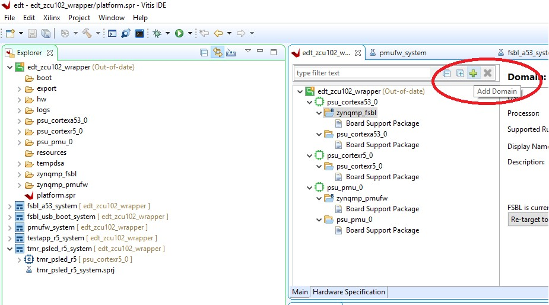

2. Double-click **platform.spr** in the Explorer view to open the platform explorer.

3. Click  in the top-right corner to add the domain.

4. When the new domain window opens, enter the following details:

    - Name: Linux_Domain

    - Display name: Linux_Domain

    - OS: Linux

    - Processor: psu_cortexa53_0

    - Supported runtimes: C/C++

    - Architecture: 64-bit

    - Bif file: Provide a sample bif file

    - Boot Component Directory: Create a boot directory and provide the path

    - Linux Image Directory: Provide the same boot directory path

5. Build the domain to create Linux applications.

### Creating the Linux Application Project

1. In the Vitis IDE, select **File→ New → Application Project**. The New Project wizard opens.

2. Use the information in the table below to make your selections in the wizard.

    *Table 13:* **Settings to Create New Linux Application Project**

   |  Wizard Screen      |  System Properties          |  Settings       |
   |---------------------|-----------------------------|-----------------|
   |  Platform           |  Select platform from repository   |  edt_zcu102_wrapper |
   |  Application project details       |  Application  project name       |  ps_pl_linux_app    |
   |                      |  System project name    |  ps_pl_linux_app_system                 |
   |                      |  Target processor   |  psu_cortexa53 SMP  |
   |  Domain             |  Domain             |  Linux_Domain        |
   |  Templates          |  Available templates         |  Linux Empty Application        |

3. Click **Finish**.

    The New Project wizard closes and the Vitis IDE creates the
    ps_pl_linux_app application project, which can be found in the Project
    Explorer view.

4. In the Project Explorer view, expand the ps_pl_linux_app project.

5. Right-click the src directory, and select **Import** to open the Import view.

6. Expand General in the Import dialog box and select **File System**.

7. Click **Next**.

8. Select **Browse** and navigate to the design-files/design1 folder, which you saved earlier (see [Design Files for This Tutorial](2-getting-started.md#design-files-for-this-tutorial)).

9. Click **OK**.

10. Select and add the ps_pl_linux_app.c file.

 >***Note*:** The application might fail to build because of a missing
 reference to the pthread library. The next section shows how to add
 the pthread library.

### Modifying the Build Settings

 This application makes use of Pthreads from the pthread library. Add
 the pthread library as follows:

1. Right-click **ps_pl_linux_app**, and click **C/C++ Build Settings**.

2. Refer to the following figures to add the pthread library.

    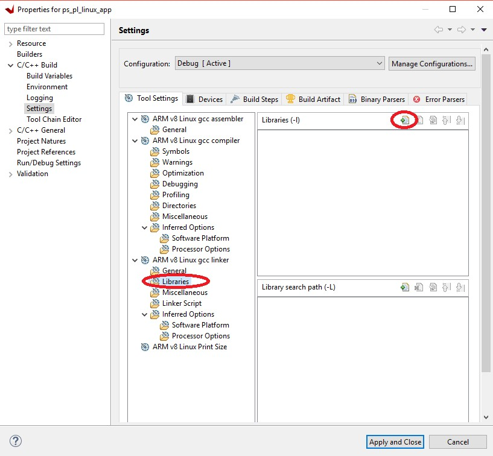

    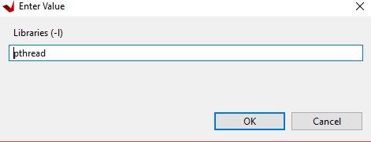

3. Click **OK** in both the windows.

4. Right-click the application and select **Build** to build the
     application.

### Creating a Boot Image

 Now that all the individual images are ready, you will create the boot
 image to load all of these components on a Zynq UltraScale+ device.
 This can be done using the Create Boot Image wizard in the Vitis IDE,
 using the following steps. This example creates a Boot Image BOOT.bin
 in C:\\edt\\design1.

1. Launch the Vitis IDE, if it is not already running.

2. Set the workspace based on the project you created in [Zynq UltraScale+ MPSoC Processing System Configuration](3-system-configuration.md). For example: `C:\edt`.

3. Select **Xilinx → Create Boot Image**.

4. See the following figure for settings in the Create Boot Image wizard.

5. Add the partitions as shown in the following figure.

    >***Note*:** For detailed steps on how to add partitions, see [Boot Sequence for SD-Boot](8-boot-and-configuration.md#boot-sequence-for-sd-boot).

    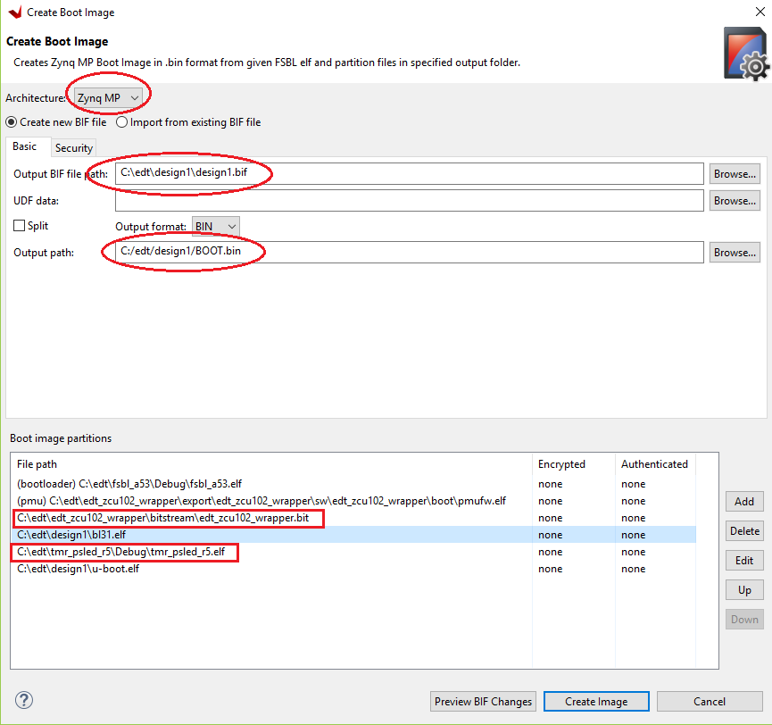

    >***Note*:** This Boot image requires PL bitstream
    `edt_zcu102_wrapper.bit` (Partition Type - Datafile, Destination Device - PL). The bitstream partition needs to be added right after the
    bootloader while you create the boot image. Also note that the R5
    application `tmr_psled_r5.elf` is added as partition in this boot image.

6. After adding all the partitions, click **Create Image**.

    >**IMPORTANT!** *Ensure that you have set the correct exception levels
    for ATF (EL-3, TrustZone) and U- Boot (EL-2) partitions. These
    settings can be ignored for other partitions.*

## Running the Image on a ZCU102 Board

### Prepare the SD Card

 Copy the images and executables on an SD card and load it in the SD
 card slot in the Board.

1. Copy files BOOT.bin and image.ub to an SD card.

    >***Note*:** BOOT.bin is located in `C:\edt\design1`.

2. Copy the Linux application, `ps_pl_linux_app.elf`, to the same SD card. The application can be found in `C:\edt\ps_pl_linux_app\Debug`.

### Target Setup

1. Load the SD card into the ZCU102 board, in the J100 connector.

2. Connect the USB-UART on the Board to the Host machine.

3. Connect the Micro USB cable into the ZCU102 Board Micro USB port J83, and the other end into an open USB port on the host machine.

4. Configure the Board to Boot in SD-Boot mode by setting switch SW6 as shown in the following figure.

    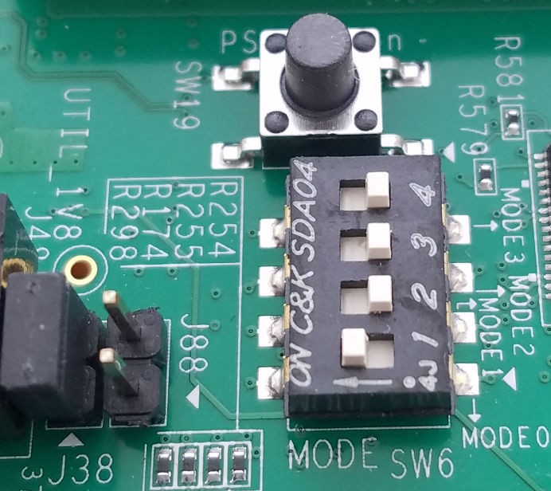

5. Connect 12V Power to the ZCU102 6-Pin Molex connector.

6. Start a terminal session, using Tera Term or Minicom depending on the host machine being used, as well as the COM port and baud rate for your system, as shown in .

7. For port settings, verify the COM port in the device manager.

    There are four USB-UART interfaces exposed by the ZCU102 Board.

8. Select the COM Port associated with the interface with the lowest
     number. In this case, for UART-0, select the COM port with
     interface-0.

9. Similarly, for UART-1, select COM port with interface-1.

    Remember that the R5 BSP has been configured to use UART-1, and so R5
    application messages will appear on the COM port with the UART-1
    terminal.

### Power ON Target and Run Applications

1. Turn on the ZCU102 Board using SW1, and wait until Linux loads on the board.

    You can see the initial Boot sequence messages on your Terminal Screen
    representing UART-0. Also, the terminal screen configured for UART-1
    also prints a message. This is the print message from the R-5
    bare-metal Application running on RPU, configured to use UART-1
    interface. This application is loaded by the FSBL onto RPU.

2. Now that this application is running, notice the PS LED being toggled by the application, and follow the instructions in the application terminal.

    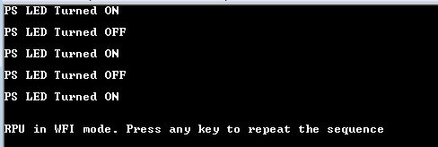

### Running Linux Applications

 After Linux is up on the ZCU102 system, log in to the Linux target
 with login: root and password: root. The Linux target is now ready for
 running applications.

 Run the Linux application using following steps:

1. Copy the application from SD card mount point to /tmp

    `# cp /run/media/mmcblk0p1/ps_pl_linux_app.elf /tmp`

    >***Note*:** Mount the SD card manually if you fail to find SD card
    contents in this location:`# mount /dev/mmcblk0p1 /media/`. Copy the
    application to `/tmp`. `# cp /media/ps_pl_linux_app.elf /tmp`.

2. Run the application.

    `# /tmp/ps_pl_linux_app.elf`

    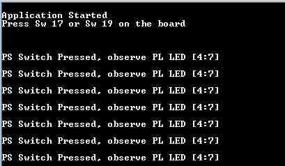

© Copyright 2017-2020 Xilinx, Inc.