<p class="sphinxhide" align="right"><a href="../../../../docs-cn/README.md">简体中文</a> | <a href="../../../../docs-jp/README.md">日本語</a></p>
<table class="sphinxhide" style="width:100%">
 <tr>
    <td align="center"><h1>Embedded Design Documentation</h1>
    </td>
 </tr>
</table>

# Versal Dhrystone Benchmark User Guide

# Table of Contents

- [Introduction](#introduction)

- [Before You Begin](#before-you-begin)

- [Tutorial Requirements](#tutorial-requirements)

- [Build Tutorial Design](#build-tutorial-design)

- [Create new application project for Dhrystone](#create-new-application-project-for-dhrystone)

- [Build Dhrystone application](#build-dhrystone-application)

- [Run the Dhrystone application](#run-the-dhrystone-application)

- [Performance calculation](#performance-calculation)


# Introduction
AMD Versal™ Adaptive SoC combines adaptable processing and acceleration engines with programmable logic and configurable connectivity to enable custom, heterogeneous hardware solutions for a wide variety of applications in Data Center, automotive, 5G wireless, wired network, and defense.

This tutorial provides step by step instructions to generate reference design for Dhrystone benchmark, building & running Dhrystone application.

## Objectives
After completing this tutorial, users should be able to:

- Generate programmable device image (PDI) for tutorial design.
- Build Dhrystone application and execute it on VCK190 evaluation kit.
- Calculate Dhrystone performance number.

## Directory structure

```
.
└── Dhrystone
    ├── Design.......................Contains Vivado design scripts
    │   ├── design.tcl..................................Generates reference design PDI/XSA
    │   └── run.tcl.....................................Top tcl for project setup, calls design.tcl
    ├── Images.......................Contains images that appear in README.md
    │   ├── apu_clock_configuration.png.................APU clock configuration
    │   ├── axi_noc_0_configuration_ddr_basic.png.......DDR basic configuration
    │   ├── axi_noc_0_connectivity.png..................NoC0 connectivity
    │   ├── axi_noc_0_ddr_configuration.png.............DDR memory configuration
    │   ├── axi_noc_0_general.png.......................NoC0 general configuration
    │   ├── axi_noc_0_inputs.png........................NoC0 input clock configuration
    │   ├── browse_and_add_xsa.png......................Add XSA
    │   ├── browse_import_source_code_finish.png........Complete importing source code
    │   ├── build_complete.png..........................Build complete
    │   ├── build_project.png...........................Build project
    │   ├── configure_domain_settings.png...............Domain settings
    │   ├── create_a_new_application_project.png........Start new application project
    │   ├── create_application_project.png..............Create new application
    │   ├── create_empty_application_template.png.......Create application template
    │   ├── create_hardware_description.png.............Hardware description window
    │   ├── debug_level_none.png........................Add debug level
    │   ├── download_and_run_dhrystone_application.png..Download and run Dhrystone application
    │   ├── expand_and_view_source_files.png............Browse and view source code
    │   ├── import_source_code.png......................Import source code
    │   ├── launch_xsct_and_connect_board.png...........Launch XSCT and connect to board
    │   ├── name_new_application_project.png............Added new application
    │   ├── optimization_optimize_most_O3.png...........Add optimization level
    │   ├── optimization_properties.png.................Go to optimization properties
    │   ├── processor_cips_block_diagram.png............CIPS block diagram
    │   ├── program_pdi.png.............................Load the PDI over JTAG
    │   ├── project_templ ate.png........................Added project template
    │   ├── select_a72_0_target_and_reset.png...........Select A72_0 and Reset
    │   ├── source_run_tcl.png..........................Source run.tcl in Vivado 
    │   ├── vck190_sw1_jtag_bootmode.png................VCK190 JTAG boot mode settings on SW1
    │   └── vck190_targets_list.png.....................List the VCK190 targets
    ├── README.md....................Includes tutorial overview
    └── Source_code..................Source code for Dhrystone application
        ├── dhry_1.c
        ├── dhry_2.c
        ├── dhry.h
        ├── LICENSE
        └── README.md

```

# Before you Begin
Recommended general knowledge of:
* VCK190 evaluation board
* Versal JTAG boot mode
* AMD Vivado™ Design Suite
* AMD Vitis™ Unified Software Platform Tool

Key Versal Reference Documents:
* VCK190 Evaluation Board User Guide [(UG1366)](https://www.xilinx.com/support/documentation/boards_and_kits/vck190/ug1366-vck190-eval-bd.pdf)
* Versal Adaptive SoC Technical Reference Manual [(AM011)](https://www.xilinx.com/support/documentation/architecture-manuals/am011-versal-acap-trm.pdf)
* Versal Adaptive SoC System Software Developers Guide [(UG1304)](https://www.xilinx.com/support/documentation/sw_manuals/xilinx2021_1/ug1304-versal-acap-ssdg.pdf)
* Control Interfaces and Processing System v3.0 (CIPS) [(PG352)](https://www.xilinx.com/support/documentation/ip_documentation/versal_cips/v3_0/pg352-cips.pdf)

Key Dhrystone Documents:
* Dhrystone Benchmarking for ARM Cortex Processors - https://developer.arm.com/documentation/dai0273/a/
* Dhrystone Benchmark - https://www.eembc.org/techlit/datasheets/dhrystone_wp.pdf

## Tutorial Requirements
This tutorial is demonstrated on the VCK190 evaluation kit. Install necessary licenses for Vivado, Vitis and XSCT/XSDB tools. Contact your AMD sales representative incase of any license issues. Refet to https://www.xilinx.com/products/boards-and-kits/vck190.html for more information.

#### Hardware Requirements:
* Host machine with an operating system supported by Vivado Design Suite, Vitis tool and XSCT/XSDB.
* VCK190 EV2 evaluation board, which includes:
  * Versal ACAP EK-VCK190-G-ED
  * AC power adapter (100-240VAC input, 12VDC 15.0A output).
  * System controller microSD card in socket (J302).
  * USB Type-C cable (for JTAG and UART communications).

#### Software Requirements:
To build tutorial design and execute Dhrystone application, following tools must be available or installed:
  * Vivado Design Suite and Vitis tool
     - Visit https://www.xilinx.com/support/download.html for details on latest tool versions.
     - For more information on installation, refer to [UG1400 Vitis Unified Software Platform Embedded Software Development](https://www.xilinx.com/support/documentation/sw_manuals/xilinx2020_2/ug1400-vitis-embedded.pdf).
  * Scripts to create tutorial designs are provided in the [Build Tutorial Design](#build-tutorial-design) section of this document.
  * UART serial terminal recommended:
     - You can use Vitis serial Terminal or a terminal emulator program for UART (that is, Putty or Tera Term) to display valuable PLM log boot status and Dhrystone Benchmark logs.

# Build Tutorial Design
The following instructions detail how to build the Dhrystone Benchmark design and create the PDI/XSA.

* Copy the Design directory and files to a local project directory. Following is a snippet of the top level directory Performance_Benchmark/Dhrystone/

```
└── Dhrystone
    ├── Design
    │   ├── design.tcl
    │	└── run.tcl
```

* Launch Vivado Design Suite

* In the Vivdado Tcl console, cd to the tutorial directory, ```
 (i.e., /<Path to workspace>/Performance_Benchmark/Dhrystone/Design/). ```

* Source the run.tcl from the tutorial directory as follows:

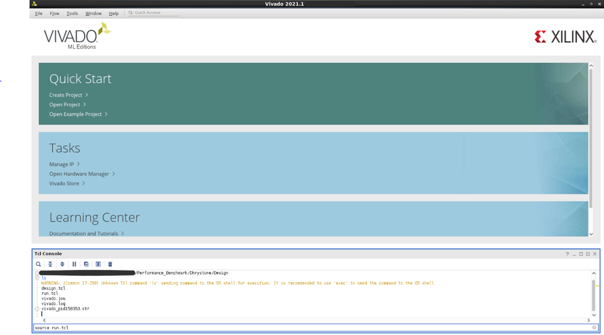

Sourcing the run.tcl script does the following:
 * Creates a project directory
 * Sources and runs the *design.tcl*, which does the following:
     * Selects target Versal VC1902 device. 
     * Creates IPs and ports.
     * Creates blocks, configures and connects IP (that is), control, interfaces, and processing system (CIPS), Smartconnect).
     * Runs placement and routing.
     * Creates a programmable device image (PDI) and Xilinx Support Archive (XSA).
	You can find PDI and XSA at,
	```
	PDI - /<path for workspace>/Performance_Benchmark/Dhrystone/Design/runs/dperf_<*>/dhrystone_tutorial.runs/impl_1/dhrystone_perf_wrapper.pdi
	XSA - /<path for workspace>/Performance_Benchmark/Dhrystone/Design/dhrystone_tutorial.xsa
	```

## Hardware Design Details
Tutorial design creates a block design with CIPS-IP and NoC IP upon sourcing run.tcl script. Details on IP configuration are captured below.

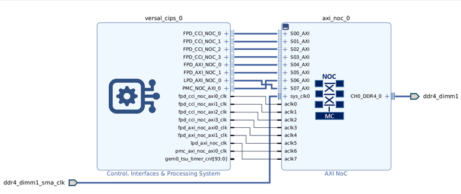

### APU clock configuration

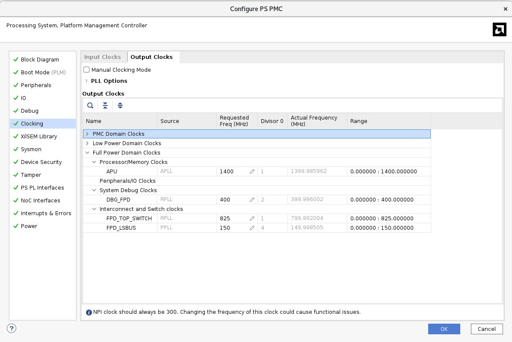

### NoC interfaces details

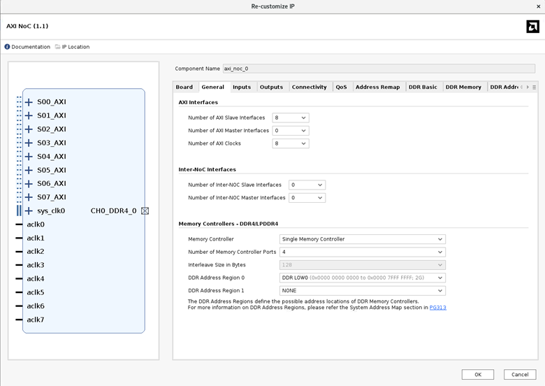

### NoC inputs

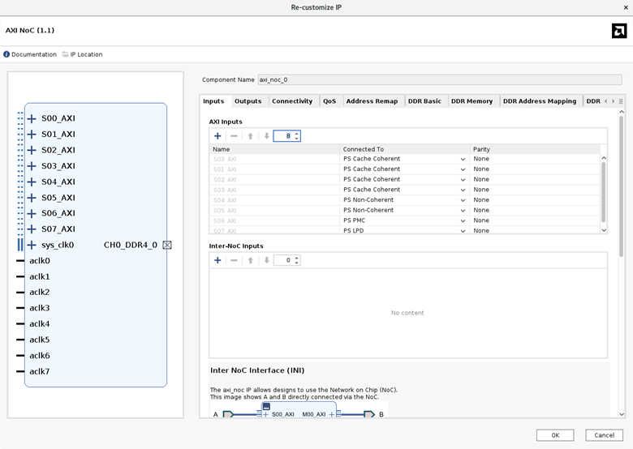

### NoC port connectivity

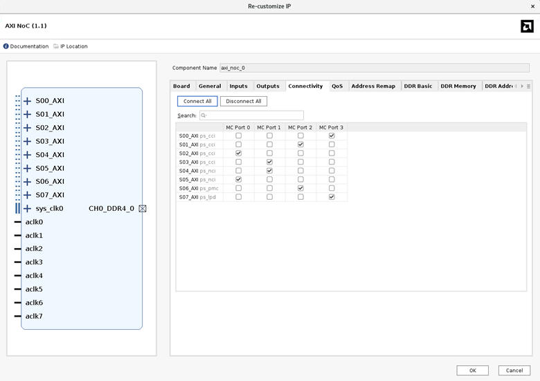

### DDR configurations

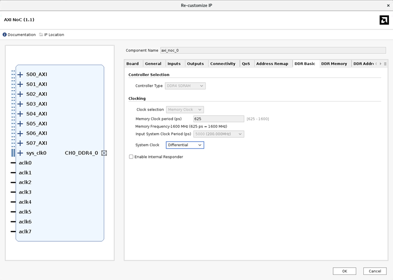

### DDR memory options

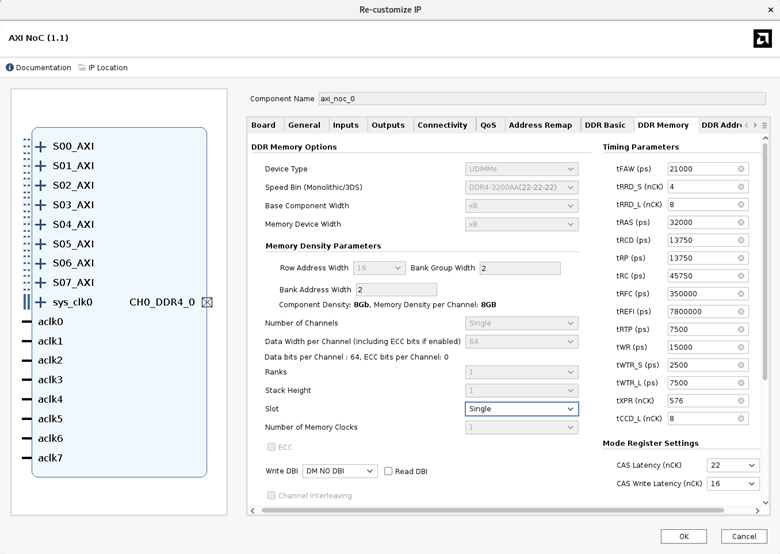

# Create new application project for Dhrystone
To create Dhrystone application project please follow below steps.
1.	Create workspace and launch Vitis tool.
2.	Provide your workspace path with the help of browse button as shown below and click Launch button to open VITIS IDE wizard.
	Here browse till,
	```/<path for workspace>/Performance_Benchmark/Dhrystone/```

## Create application project
Go to menu bar, then select ***File->New Component->Platform***. Choose the file name and folder where the platform must be created. Click Next.

  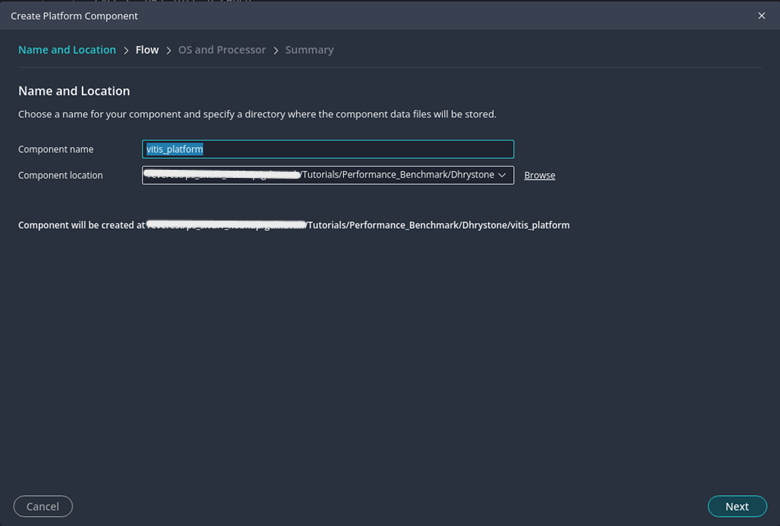

## Add Hardware Description file
Add hardware description file (XSA) by navigating to the folder containing the (.xsa) file by clicking on the Browse button. 
```/<path for workspace>/Performance_Benchmark/Dhrystone/Design/dhrystone_tutorial.xsa``` 
Click Next.

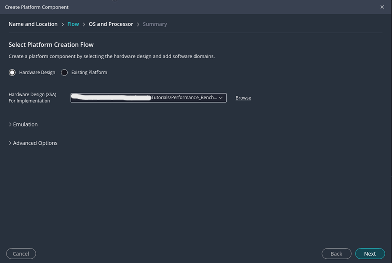

#### Set Domain configuration
Now, you see the see the following page that shows the Operating System ***standalone***, Processor ***psv_cortexa72_0***, Compiler ***gcc***. Click Next button.

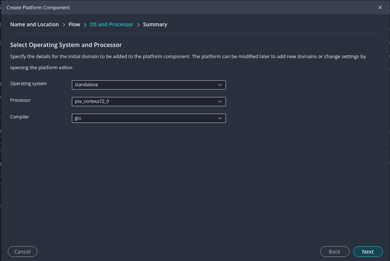

You see the following Summary Page to review your specifications. Click Finish.
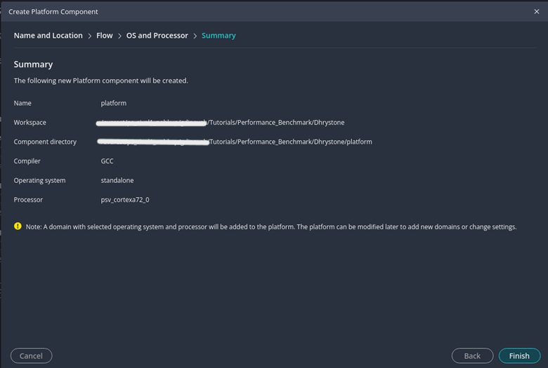

## Create Dhrystone application
#### Create Empty Application template
Now, navigate to Examples in the sidebar. Select the Empty Application from the list of examples. Click Create Application Component from the Template.

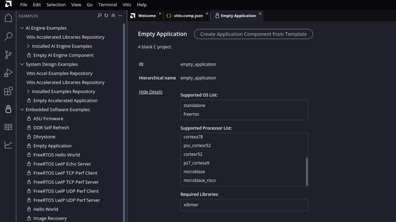

Choose a Component Name. Click Next.
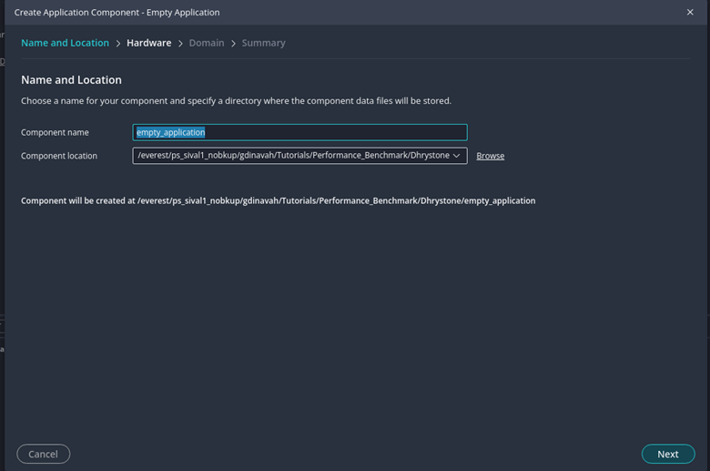

Select the same platform that was initially created. Click Next.
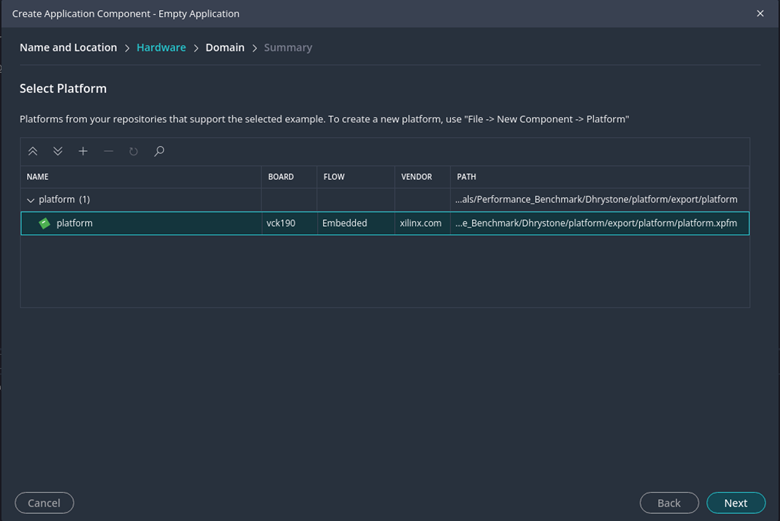

Leave the Domain with default details. Click Next.
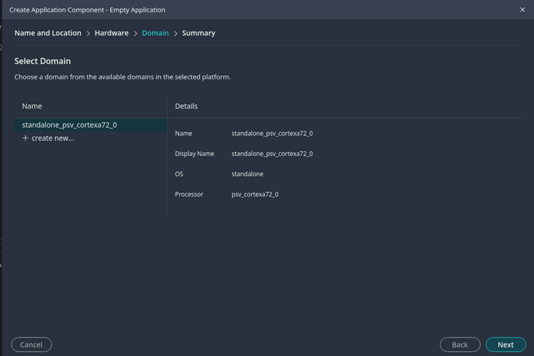

Review the Summary Page. CLick Next.
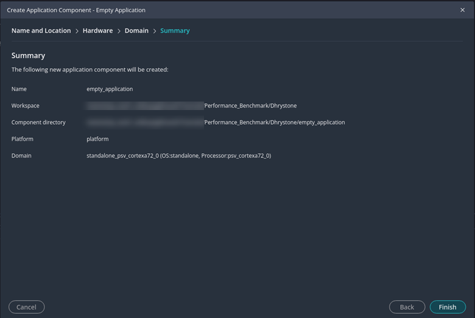

#### Import Dhrystone source code
After the application in created, navigate to the ***src*** folder under the application as shown and import the Source_code files. 
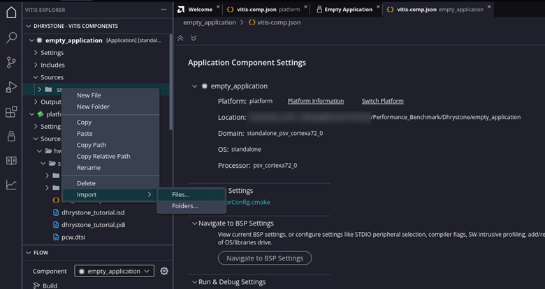

Browse source path ``` /<Path to workspace>/Performance_Benchmark/Dhrystone/Source_code/ ```, select all source files and click ***Open*** to import. 
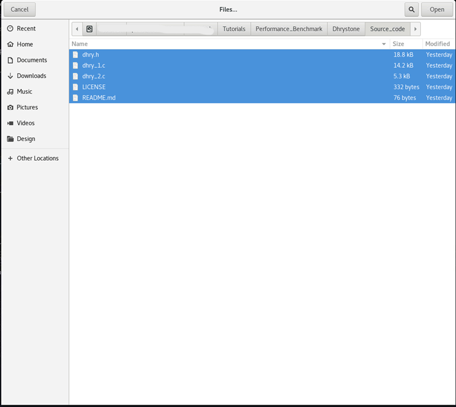

All the source files are imported and you can view them as shown in the following image.
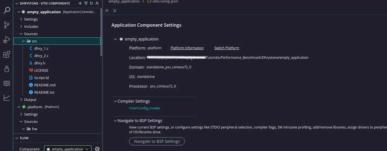

# Build Dhrystone application
## Optimization Level
Navigate to the UserConfig.cmake which is present in the src folder of empty_application. Modify the optimization Level to ***-O3*** and set other optimisaation flags to ***-fno-common*** for better performance.
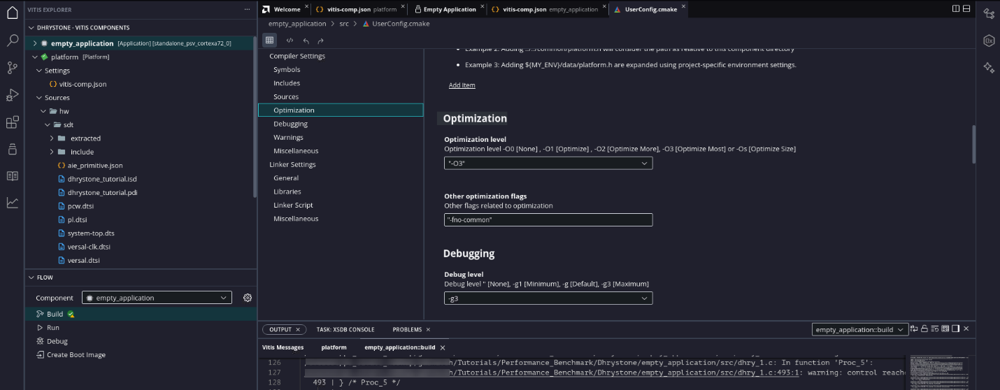

Navigate to Debugging and set the Debug level as None.
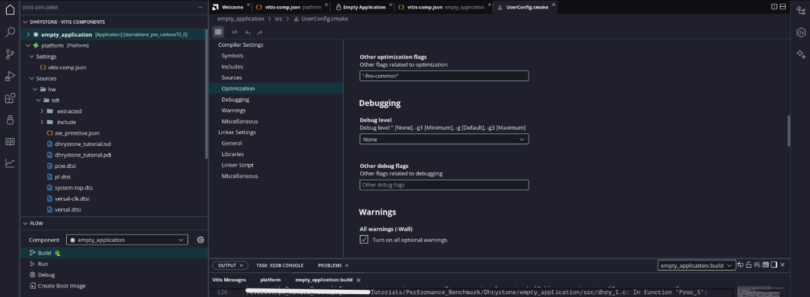

## Build Project
Under the Flow Navigator, click Build. After the build is over, the executable is generated and you can verify the build logs in the console. 
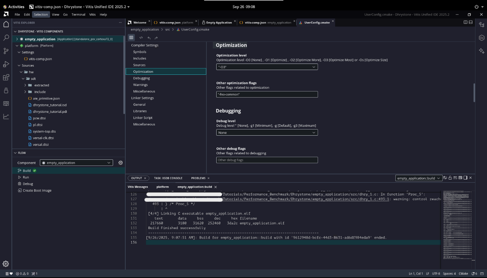

# Run the Dhrystone application
Execute the following steps to run the Dhrystone application.

* Insert the SD card with system controller image into the VCK190 board, in the J302 connector. Set System controller boot mode to SD1 (SW11 = 0111).

* Connect the USB Type-C cable into the VCK190 Board USB Type-C port (J207), and the other end into an open USB port on the host machine.

* Configure the board to boot in JTAG mode by setting switch SW1 = 0000 as shown in the following figure.

 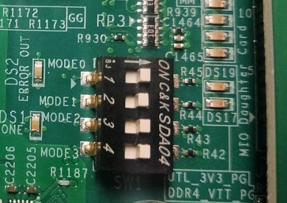

* Connect 180W (12V) power to the VCK190 6-Pin Molex connector(J16).

* Power on the VCK190 board using the power switch (SW13).

* Open serial port in Tera Term/Putty and set baud rate (115200) for logs.

* Go to Vitis command prompt, run *xsdb* or *xsct* command.
	Note - Refer to Vivado/Vitis installation paths for this tools.

* Now run *connect* command to launch hw_server

* List the targets by running *targets* command.

 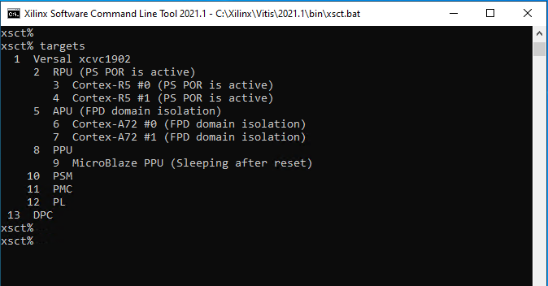

* Program the design
```
xsdb% device program /<path for workspace>/Performance_Benchmark/Dhrystone/Design/runs/dperf_<*>/dhrystone_tutorial.runs/impl_1/dhrystone_perf_wrapper.pdi
```
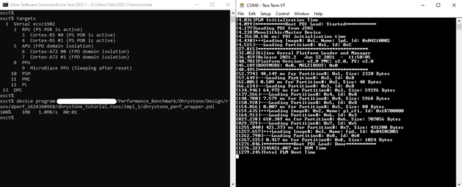

* Select the A72_0 target and Reset
```
xsct% target -set -filter {name =~ "*A72*#0"}
xsct% rst -processor -skip-activate-subsystem
```
* Download and run the Dhrystone benchmark application.
Before executing Dhrystone Benchmark, please refer ***4 Running Dhrystone section*** of Dhrystone Benchmarking for ARM Cortex Processors - https://developer.arm.com/documentation/dai0273/a/
```
xsct% dow -force /<path for workspace>/Performance_Benchmark/Dhrystone/Dhrystone_Benchmark/Debug/Dhrystone_Benchmark.elf
xsct% con
```
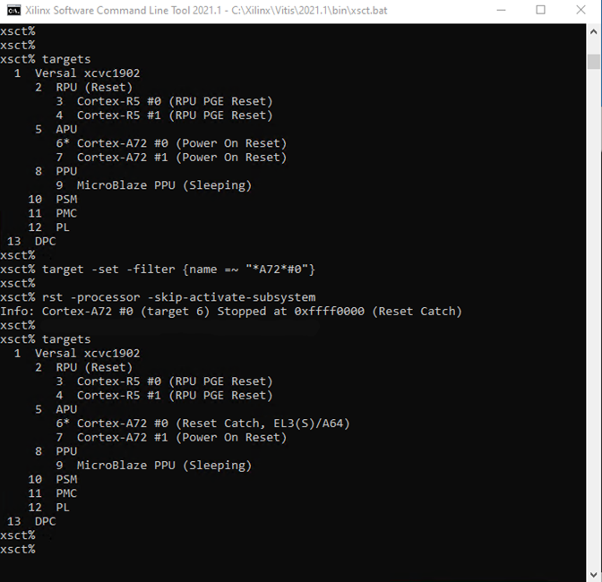

Observe the prints in Putty Terminal

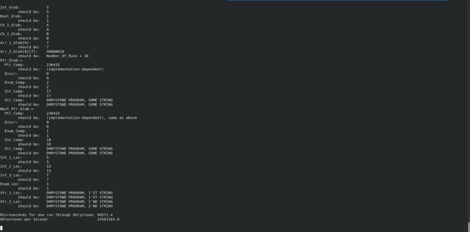

For performance number calculation, use the Dhrystones per second value from last UART log print.

# Performance calculation

You can calculate the DMIPS (Dhrystone MIPS) number using the following formula:
```
DMIPS = Dhrystones per second / 1757
     14583183/1757
     = 8300.0472


A more commonly reported figure is DMIPS / MHz, where MHz is CPU Frequency
      i.e 8300.0472/1400 = 5.92
```
Note: 
1. For more details on formula please refer ***5 Measurement characteristics*** of Dhrystone Benchmarking for ARM Cortex Processors - https://developer.arm.com/documentation/dai0273/a/
2. For CPU Frequency configured in design please refer ***APU clock configuration*** section.
