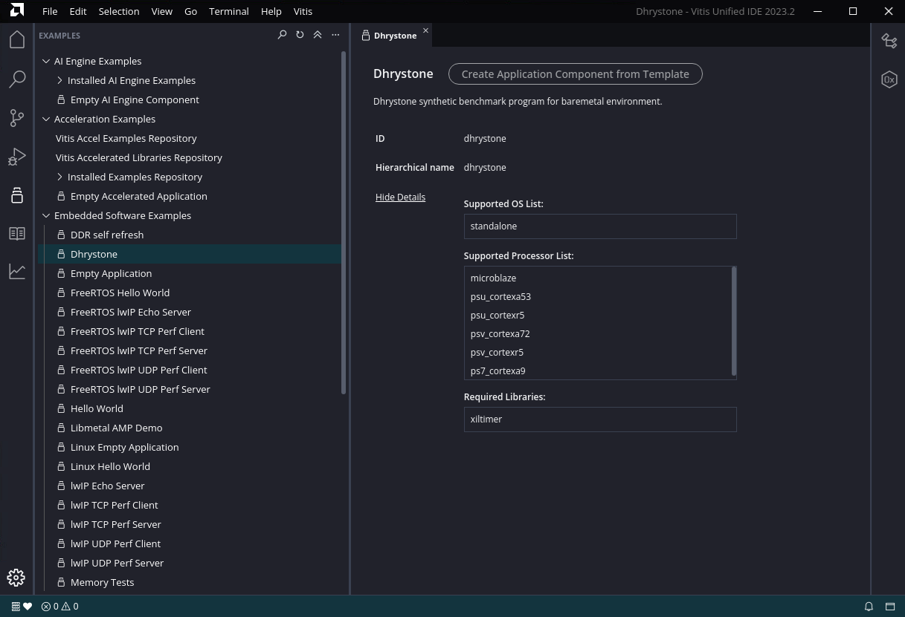
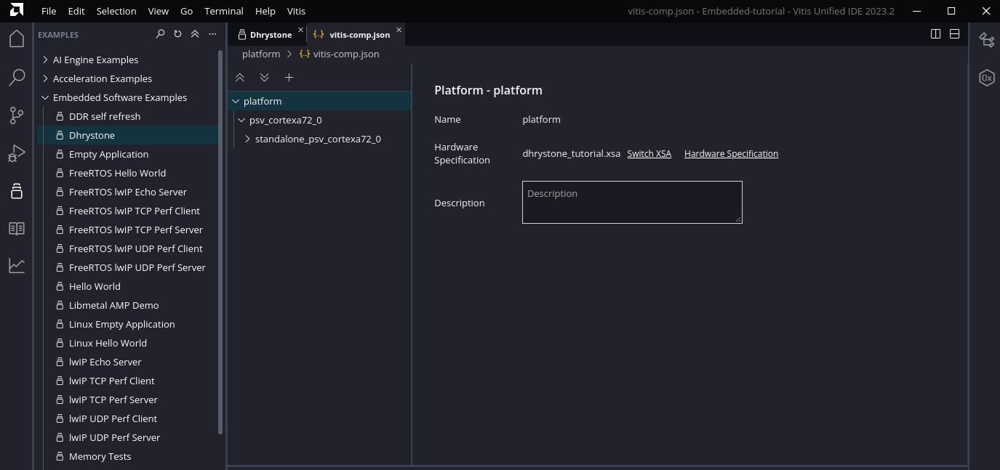
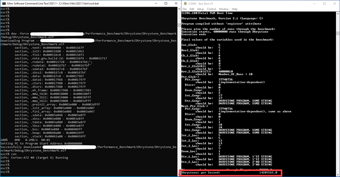

# Versal Dhrystone Benchmark User Guide

## Table of Contents

- [Introduction](#introduction)

- [Prerequisites](#before-you-begin)

- [Tutorial Requirements](#tutorial-requirements)

- [Build Tutorial Design](#build-tutorial-design)

- [Create New Application Project for Dhrystone](#create-new-application-project-for-dhrystone)

- [Build Dhrystone Application](#build-dhrystone-application)

- [Run Dhrystone Application](#run-the-dhrystone-application)

- [Performance Calculation](#performance-calculation)

## Introduction

AMD Versal&trade; adaptive SoC combines adaptable processing and acceleration engines with programmable logic and configurable connectivity to enable custom, heterogeneous hardware solutions for a wide variety of applications in data center, automotive, 5G wireless, wired network, and defense.

This tutorial provides step-by-step instructions for generating a reference design for the Dhrystone benchmark and building and running the Dhrystone application.

### Objectives

After completing this tutorial, users can:

- Generate programmable device image (PDI) for tutorial design.
- Build a Dhrystone application and execute it on the VCK190 evaluation kit.
- Calculate Dhrystone performance number.

### Directory Structure

```
.
└── Dhrystone
    ├── Design.......................Contains Vivado design scripts
    │   ├── design.tcl..................................Generates reference design PDI/XSA
    │   └── run.tcl.....................................Top tcl for project setup, calls design.tcl
    ├── Images.......................Contains images that appear in README.md
    │   ├── apu_clock_configuration.png.................APU clock configuration
    │   ├── axi_noc_0_configuration_ddr_basic.png.......DDR basic configuration
    │   ├── axi_noc_0_connectivity.png..................NoC0 connectivity
    │   ├── axi_noc_0_ddr_configuration.png.............DDR memory configuration
    │   ├── axi_noc_0_general.png.......................NoC0 general configuration
    │   ├── axi_noc_0_inputs.png........................NoC0 input clock configuration
    │   ├── browse_and_add_xsa.png......................Add XSA
    │   ├── browse_import_source_code_finish.png........Complete importing source code
    │   ├── build_complete.png..........................Build complete
    │   ├── build_project.png...........................Build project
    │   ├── configure_domain_settings.png...............Domain settings
    │   ├── create_a_new_application_project.png........Start new application project
    │   ├── create_application_project.png..............Create new application
    │   ├── create_empty_application_template.png.......Create application template
    │   ├── create_hardware_description.png.............Hardware description window
    │   ├── debug_level_none.png........................Add debug level
    │   ├── download_and_run_dhrystone_application.png..Download and run Dhrystone application
    │   ├── expand_and_view_source_files.png............Browse and view source code
    │   ├── import_source_code.png......................Import source code
    │   ├── launch_xsct_and_connect_board.png...........Launch XSCT and connect to board
    │   ├── name_new_application_project.png............Added new application
    │   ├── optimization_optimize_most_O3.png...........Add optimization level
    │   ├── optimization_properties.png.................Go to optimization properties
    │   ├── processor_cips_block_diagram.png............CIPS block diagram
    │   ├── program_pdi.png.............................Load the PDI over JTAG
    │   ├── project_template.png........................Added project template
    │   ├── select_a72_0_target_and_reset.png...........Select A72_0 and Reset
    │   ├── source_run_tcl.png..........................Source run.tcl in Vivado
    │   ├── vck190_sw1_jtag_bootmode.png................VCK190 JTAG boot mode settings on SW1
    │   └── vck190_targets_list.png.....................List the VCK190 targets
    ├── README.md....................Includes tutorial overview
    └── Source_code..................Source code for Dhrystone application
        ├── dhry_1.c
        ├── dhry_2.c
        ├── dhry.h
        ├── LICENSE
        └── README.md
```

## Prerequisites

Recommended general knowledge of:

- VCK190 evaluation board
- Versal JTAG boot mode
- AMD Vivado&trade; Design Suite
- AMD Vitis&trade; Unified Software Platform Tool

Key Versal reference documents

- VCK190 Evaluation Board User Guide [(UG1366)](https://www.xilinx.com/support/documentation/boards_and_kits/vck190/ug1366-vck190-eval-bd.pdf)
- Versal ACAP Technical Reference Manual [(AM011)](https://www.xilinx.com/support/documentation/architecture-manuals/am011-versal-acap-trm.pdf)
- Versal ACAP System Software Developers Guide [(UG1304)](https://www.xilinx.com/support/documentation/sw_manuals/xilinx2021_1/ug1304-versal-acap-ssdg.pdf)
- Control Interfaces and Processing System v3.0 (CIPS) [(PG352)](https://www.xilinx.com/support/documentation/ip_documentation/versal_cips/v3_0/pg352-cips.pdf)

Key Dhrystone documents

- [Dhrystone Benchmarking for ARM&reg; Cortex&reg; Processors](https://developer.arm.com/documentation/dai0273/a/)
- [Dhrystone Benchmark](https://www.eembc.org/techlit/datasheets/dhrystone_wp.pdf)

### Tutorial Requirements

This tutorial is demonstrated on the VCK190 evaluation kit. Install the necessary licenses for Vivado, Vitis, and XSCT/XSDB tools. Contact your AMD sales representative for any assistance. For more information, see [https://www.xilinx.com/products/boards-and-kits/vck190.html](https://www.xilinx.com/products/boards-and-kits/vck190.html).

#### Hardware Requirements

- A host machine with an operating system supported by Vivado Design Suite, Vitis tool, and XSCT/XSDB.

- VCK190 EV2 evaluation board with:
  - Versal ACAP EK-VCK190-G-ED.
  - AC power adapter (100-240VAC input, 12VDC 15.0A output).
  - System controller microSD card in the socket (J302).
  - USB Type-C cable (for JTAG and UART communications).

#### Software Requirements

The following tools are necessary to build the tutorial design and execute the Dhrystone application:

- Vivado Design Suite and AMD Vitis tool
  - For the latest tool version details, see [https://www.xilinx.com/support/download.html](https://www.xilinx.com/support/download.html).
  - For more information on installation, see [UG1400 Vitis Unified Software Platform Embedded Software Development](https://www.xilinx.com/support/documentation/sw_manuals/xilinx2020_2/ug1400-vitis-embedded.pdf).
- The [Build Tutorial Design](#build-tutorial-design) section of this document provides the scripts to create the tutorial design.
- UART serial terminal recommended:
  - Vitis serial terminal or a terminal emulator program for UART (Putty or Tera Term) can be used to display the valuable PLM log boot status and the Dhrystone Benchmark logs.

## Build the Tutorial Design

Follow these steps to build the Dhrystone Benchmark design and create the PDI/XSA.

1. Copy the Design directory and files to a local project directory. The following is a snippet of the top-level directory: `Performance_Benchmark/Dhrystone/`

   ```
   └── Dhrystone
       ├── Design
       │   ├── design.tcl
       │   └── run.tcl
   ```

2. Launch Vivado Design Suite.

3. In the Vivado Tcl console, navigate to the tutorial directory:

   ```
   cd /<Path to workspace>/Performance_Benchmark/Dhrystone/Design/
   ```

4. Execute [`source run.tcl`](./Design/run.tcl) from the tutorial directory.

   

   Sourcing the `run.tcl` script does the following:

   - Creates a project named dhrystone-tutorrial' in the tutorial directory 
   - Sources and runs the [`design.tcl`](./Design/design.tcl), which in turn does the following:
     - Selects the target Versal VC1902 device
     - Creates IPs and ports
     - Creates blocks
     - Configures and connects IP (Control, interfaces, and Processing System (CIPS), Smartconnect)
     - Runs placement and routing
     - Creates a programmable device image (PDI) and Xilinx Support Archive (XSA).

   You can find PDI and XSA at:

   ```
   PDI - /<path for workspace>/Performance_Benchmark/Dhrystone/Design/runs/dperf_<*>/dhrystone_tutorial.runs/impl_1/dhrystone_perf_wrapper.pdi
   XSA - /<path for workspace>/Performance_Benchmark/Dhrystone/Design/dhrystone_tutorial.xsa
   ```

### Hardware Design Details

The tutorial design creates a block design with CIPS-IP and NoC IP upon sourcing the [`run.tcl`](./Design/run.tcl) script. The following image shows the details of the IP configuration.


#### APU Clock Configuration

Double-clck on the Control, Interfaces & Processing System to launch the Configure PS PMC window.


#### NoC Interfaces Details


#### NoC Inputs


#### NoC Port Connectivity


#### DDR Configurations


#### DDR Memory Options


## Create a New Application Project for Dhrystone

### Create and Browse to the Workspace

1. Create a workspace and launch the Vitis tool.
2. Browse to the workspace.
3. Click **Launch** to open the VITIS IDE wizard.
4. Browse to `/<path for workspace>/Performance_Benchmark/Dhrystone/`.

   

### Create Dhrystone Application Project from Examples

1. Select **Welcome tab->Get Started->Examples->Embedded Software Examples->Dhrystone** from the menu.

2. Click **Create Application Component from Template**

   

3. In the **Name and Location** window, **dhrystone** is the default **Component name**. Change **Component location** if required.

   

4. In the **Select Platform window**, select **Create Platform**.
   
   

5. In the **Name and Location** window, **platform** is the default 
   

6. In the Select Platform Creation Flow window, select Hardware Design.
7. Browse to the XSA file generated from the Vivado Design Suite in Build the   Tutorial Design steps of this tutorial.

   
8. Verify that the **Operating system** and **Processor** are pre-filled from the XSA file as shown in the following figure. 

   

9. Click **Finish**
   

10. The Newly created Platform opens in the vitis-comp.json tab
   


### Create Application Component in the Dhrystone

1. Navigate to the **Dhrystone tab**
2. Click **Create Application Component from Template**
3. In the Name and Location window, **dhrystone** is the default Component name. Click **Next**.
4. Select **platform** and click **Next**.
   
5. Validate the Domain and click **Next**.
   
6. Click **Finish**.
7. Application Component Settings appear in **vitis-comp.json dhrystone** tab
   

## Build Dhrystone Application

### Set Optimization Level

**Note**: Add the optimization Level **-O3**  and **-fno-common** for better performance.

1. Navigate to **VITIS COMPONENTS->dhrystone>Settings** and open ``UserConfig.cmake`` file

   

2. Click **Optimization**

   2.1 Select **Optimization Level** to **-03**.
   
   2.2 Add **-fno-common** in the Other optimization flags.

   2.3 Select **Debug Level** as **None**.

   

### Build the Project

From the Left Menu bar, Expand **FLOW** 

1. Select **platform** from the Component drop-down menu.

   

   Successful build indicates a right-green icon. After the build is over, the executable is generated.

2. Select **dhrystone** from the Component drop-down menu.

   

   For executable file path:
   ```
   /<path for workspace>/<application project name>/build/dhrystone.elf
   ```

## Run the Dhrystone Application

1. Insert the SD card with the system controller image into the System controller boot mode to SD1 (SW11 = 0111).
2. On the host machine, connect the USB Type-C cable into the VCK190 Board USB Type-C port (J207) and the other end into an open USB port.
3. Configure the board to boot in JTAG mode by setting switch SW1 = 0000 as shown in the following image.

   

4. Connect 180W(12V) power to the VCK190 6-Pin Molex connector(J16).

5. Power on the VCK190 board using the power switch (SW13).

6. Open the serial port in Tera Term/Putty and set baud rate(115200) for logs.

7. Go to Vitis command prompt, run `xsdb` or `xsct` commands.
 **Note:** Refer Vivado/Vitis installation paths for this tools.

8. Run the `connect` command to launch hw_server.

   

9. List the targets by running the `targets` command.

   

10. Program the design.

    ```
    xsct% device program /<path for workspace>/Performance_Benchmark/Dhrystone/Design/runs/dperf_<*>/dhrystone_tutorial.runs/impl_1/dhrystone_perf_wrapper.pdi
    ```

    

11. Select the A72_0 target and reset.

    ```xsct% target -set -filter {name =~ "*A72*#0"}
    xsct% rst -processor -skip-activate-subsystem
    ```

    

12. Download and run the Dhrystone benchmark application.

    Before executing Dhrystone Benchmark, see **4 Running Dhrystone section** of the Dhrystone Benchmarking for ARM Cortex Processors- <https://developer.arm.com/documentation/dai0273/a/>

    ```
    xsct% dow -force /<path for workspace>/Performance_Benchmark/Dhrystone/Dhrystone_Benchmark/Debug/Dhrystone_Benchmark.elf
    xsct% con
    ```

    

    For performance number calculation, use the Dhrystones per second value from the last UART log print (highlighted in the previous image).

## Performance Calculation

Calculate DMIPS (Dhrystone MIPS) number by using the following formula:

```
DMIPS = Dhrystones per second / 1757
      = 14285565/1757
      = 8130.6573

A more commonly reported figure is DMIPS / MHz, where MHz is CPU Frequency
      i.e 8130.6573/1400 =  5.80
```

**Note:**

1. For more details on the formula, see **5 Measurement characteristics** of Dhrystone Benchmarking for ARM Cortex Processors - <https://developer.arm.com/documentation/dai0273/a/>
2. For CPU Frequency configured in design, see the **APU clock configuration** section.

## Support

GitHub issues will be used for tracking requests and bugs. For questions go to [forums.xilinx.com](http://forums.xilinx.com/).


<hr class="sphinxhide"></hr>

<p class="sphinxhide" align="center"><sub>Copyright © 2019–2024 Advanced Micro Devices, Inc.</sub></p>

<p class="sphinxhide" align="center"><sup><a href="https://www.amd.com/en/corporate/copyright">Terms and Conditions</a></sup></p>
