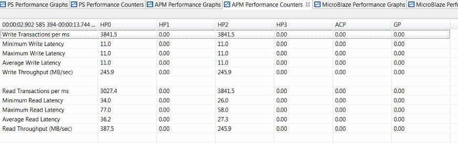

# End-To-End Performance Analysis

The Vitis IDE enables you to perform an end-to-end performance analysis flow (shown in [Figure 47: ATG Configuration to Model Traffic of Zynq 7000 SoC Base TRD](#fig47)). This flow allows you to model the traffic of your estimated design and then validate the performance using your actual design. To better define this end-to-end flow, this chapter describes these steps for an example design. The design chosen is the Zynq®-7000 SoC Base Targeted Reference Design (TRD), described in detail in the *Zynq-7000 SoC ZC702 Base Targeted Reference Design User Guide for Vivado Design Suite 2015.4* ([UG925](https://www.xilinx.com/cgi-bin/docs/bkdoc?k=zc702_zvik%3Bv%3D2015.4%3Bd%3Dug925-zynq-zc702-base-trd.pdf)).

## Assess Requirements

The following figure shows the block diagram of this TRD involving HDMI video input and output and processing using a Sobel filter. There are multiple video frames stored in DDR memory, creating multiple channels of high-bandwidth write and read traffic.

 *Figure 46:* **Zynq 7000 SoC Base TRD Hardware Block Diagram**

Assume for now that this design is in the planning stages and not completed yet. How would you model this design using SPM? The first step is to assess the bandwidth requirements of the system. This involves calculating the expected bandwidth of all of the communication channels in the design, and then deciding on the PS-PL interfaces to use. Since this is AXI traffic, the beats per transaction as well as data locality is also important.

To calculate bandwidth, you need to know the type of data that is being inputted, processed, and then output to a display. As shown in the previous figure, the input data for the TRD is an HDMI source delivering 1080p/60 video with a data format of YCbCr 4:2:2, or 16 bits/pixel. This design also has the requirement of overlaying multiple layers of video on the output display to show the filtered video plus a GUI layer for controls and graphs. The GUI layer will be 1920 x 300 and in RGB 4:4:4 format, while all others are full frame in YCbCr 4:2:2 format. So while the clock frequencies may not be known yet, the system can still be modeled using the required bandwidths of the data traffic.

The following table shows a summary of the bandwidth assessment for the Zynq 7000 SoC Base TRD. The calculated bandwidth of each video channel is listed along with the percentage of DDR bandwidth. The design specification utilizes HP0 and HP2 as they use different ports on the DDR controller. Other connectivity could also be modeled.

 *Table 9:* **Assessment of Bandwidth in Zynq 7000 SoC Base TRD**

|   Description | Video Format   |   Port      |      Type   |  Bandwidth  |    DDR Bandwidth (%) |  
|----------|----------|----------|----------|----------|----------|
| HDMI Video Input   | YCbCr 4:2:2   | HP0      | Write    |  248.8  |  5.8    |
| Processing Input   | YCbCr 4:2:2   | HP2      | Read     |  248.8  |  5.8    |
| Processing Output      | YCbCr 4:2:2   | HP2      | Write    |  248.8  |  5.8    |
| Multi-layer Video Output (Layer 1:1920 x 300 GUI) | RGB 4:4:4     | HP0      | Read     |  138.3  |  3.3    |
| Multi-layer Video Output (Layer 2:1920 x 1080)    | YCbCr 4:2:2   | HP0      | Read     |  248.8  |  5.8    |
| Total Traffic   | N/A      | HP0/HP2  | Write/Read       |  1133.4 |  26.5   |

## Model Design

Now that the bandwidth requirements of the design have been identified, modeling can be performed using the SPM design. While not a necessity, a software application is recommended to model Processing System (PS) traffic. The memory stride software application was used to model high activity in the PS. While this is not the software that will be run in the actual design, it does provide a worst-case test scenario in terms of activity and memory bandwidth.

The following figure shows one way the traffic of the TRD could be modeled using System Performance Modeling (SPM). Assuming the video frames are stored in different parts of memory, the Address Start values were set to ddr0 and ddr2. Furthermore, video data is typically stored as successive lines of data, so the Address Next values were set to increment. Beats/tranx values of 8 and 16 were chosen to model the video DMA to/from the Sobel filter and the multi-layer video output, respectively. The intervals were specified to match the desired throughputs for each port and type, as summarized in the previous table.

 *Figure 47:* **ATG Configuration to Model Traffic of Zynq 7000 SoC Base TRD**

The ATGs were configured with the specified traffic and a run was performed on a ZC702 board. The following figure shows the summary table of results after this run was performed. Both HP0 and HP2 were capable of achieving the desired write and read bandwidth for this design. While the CPU performance results are for the memory stride benchmarks and not the eventual TRD application, it is still important to note the activity.

 *Figure 48:* **Summary of Performance Results for Model of Zynq 7000 SoC Base TRD**

The following figure shows the write and read performance graphs from the Vitis IDE, confirming the details of the achieved performance. The average write latency and write throughput remain consistent during the entire test. The average read latency is noticeably affected by the memory stride benchmarks. This is due to contention at the DDR controller. However, the read throughput remains consistent throughout the test.

 *Figure 49:* **Write and Read Performance for Model of Zynq 7000 SoC Base TRD**

As mentioned in the [Introduction](./1-introduction.md), there are a number of reasons for performing this modeling, especially when the design is in its planning stages. Specific to this design, this includes the following:

- **De-risk for success :** The SPM model proved that the desired latencies and throughputs can be achieved. This provides a much stronger assurance that the Zynq 7000 SoC Base TRD will be able to achieve the same desired performance.

- **Design Improvements:** [Figure 48: Summary of Performance Results for Model of Zynq 7000 SoC Base TRD](#fig48) shows average read latencies of the model to be 40.13 and 32.41 for HP0 and HP2, respectively. For a video design such as this one with definitive frame rate constraints, a display controller could be designed to work within these metrics.

- **What-If Scenarios:** The TRD could consider adding more video layers to the output display. Instead of iterating within the real system, it could be done using SPM. Other options to consider might include: adding a second video pipeline and upgrading to 4K video resolution. All of these scenarios could be modeled and    analyzed before the design phase begins.

## Performance Validation

The performance of the SPM model can be validated with the actual design. Analyze the performance of the Zynq 7000 SoC Base TRD using a properly instrumented design which include an APM (see [Instrumenting Hardware](../docs/9-using-spa-with-custom-target.md#instrumenting-hardware)). For the TRD delivered with 2015.1, this was already the case.

The following figure shows the TRD defined as a block diagram in Vivado Design Suite IP integrator with the APM instance highlighted. The APM was properly configured in Profile mode to ensure that performance results would be reported correctly in the Vitis IDE. HP0 was connected to slot 0 on the APM while HP2 was connected to slot 2. Slot 1 was left open (because HP1 was not used), and the Number of Monitor interfaces was set to 3.

 *Figure 50:* **Vivado IP Integrator Block Diagram of Zynq 7000 SoC Base TRD**

The following figure shows the connection diagram to the ZC702 board in order to run the demonstration. The board was connected as shown, and the design was booted from the SD card.

 *Figure 51:* **Connection Diagram of Zynq 7000 SoC Base TRD Using the ZC702 Board**

The summary table of results is shown in the following figure while the corresponding graphs can be seen in [Figure 53: Write and Read Performance of Zynq 7000 SoC Base TRD](#fig53). The Programmable Logic (PL) performance results can be compared directly with those gathered from the SPM model in [Figure 48: Summary of Performance Results for Model of Zynq 7000 SoC Base TRD](#fig48). The write and read throughputs from the model are all within 2.0% of the actual results.

The write latencies are within a cycle of the actual design, while the average read latencies of the model are within 16.0% of the actual design. While the actual design appears to be more bursty in nature than the SPM model, the average performance values were accurate enough to provide assurance that the TRD would meet its performance goals.

 *Figure 52:* **Summary of Performance Results for Actual Zynq 7000 SoC Base TRD**

 *Figure 53:* **Write and Read Performance of Zynq 7000 SoC Base TRD**

## In-Depth Analysis

A second run of the TRD was performed to investigate the performance impacts of various run- time settings of the TRD. The following table lists all of these settings, as well as a summary of their corresponding performance results captured in the Vitis IDE. The time window is approximately when those settings were used during the test run.

 *Table 10:* **Summary of Performance Metrics from Actual Zynq 7000 SoC Base TRD**

<!--This is a not a normal table. It can't use Markdown style.-->
<table>
<thead>
<tr>
<th rowspan="2">Description</th>
<th rowspan="2">Time Window (s,approx.)</th>
<th colspan="2">L1 Data Cache Accesses (x103)</th>
<th colspan="2">Write Throughputs (MB/s)</th>
<th colspan="2">Read Throughputs (MB/s)</th>
</tr>
<tr >
<th>CPU0</th>
<th>CPU1</th>
<th>HP0</th>
<th>HP2</th>
<th>HP0</th>
<th>HP2</th>
</thead>
<tbody>
</tr>
<tr>
<td>GUI only – minimized</td>
<td>

0-10

</td>
<td>

100

</td>
<td>

100

</td>
<td>

0

</td>
<td>

0

</td>
<td>

37

</td>
<td>

0

</td>
</tr>
<tr >
<td>GUI only – maximized</td>
<td>

10-20

</td>
<td>

100

</td>
<td>

100

</td>
<td>

0

</td>
<td>

0

</td>
<td>

140

</td>
<td>

0

</td>
</tr>
<tr>
<td>Video Enabled</td>
<td>

20-30

</td>
<td>

100

</td>
<td>

100

</td>
<td>

246

</td>
<td>

0

</td>
<td>

382

</td>
<td>

0

</td>
</tr>
<tr >
<td>Sobel filter on – SW mode</td>
<td>

30-50

</td>
<td>2800</td>
<td>

7000

</td>
<td>

246

</td>
<td>

0

</td>
<td>

382

</td>
<td>

0

</td>
</tr>
<tr>
<td>Sobel filter on – HW mode</td>
<td>

50-70

</td>
<td>

100

</td>
<td>

200

</td>
<td>

246

</td>
<td>

246

</td>
<td>

382

</td>
<td>

246

</td>
</tr>
</tbody>
</table>

As listed in this table, the performance impacts can be directly measured in the Vitis IDE. The GUI video output layer actually has two modes in the TRD: a minimized mode (size: 1920 x 80) and a maximized mode (size: 1920 x 300). Between 0-20 seconds, only that portion of the video frame was output by the hardware and sent to the video display, as confirmed by the read throughput results on HP0. After the output video was enabled, the total HP0 read bandwidth included the full video frame plus the GUI layer. The input 4:2:2 video was also written to DDR on HP0.

Turning on the Sobel filtering produced noticeable changes in performance. There was clearly much higher CPU activity when the software (SW) mode was used, including notably L1 data cache accesses. Also, using the Sobel filter in hardware (HW) mode visibly affected the write and read traffic on HP2.

 *Figure 54:* **PS Performance Graphs of Zynq 7000 SoC Base TRD**

The performance results of the Zynq 7000 SoC Base TRD become especially evident in the graphs shown in the previous figure, and the following figure. For the PS performance results in [Figure 54: PS Performance Graphs of Zynq 7000 SoC Base TRD](#fig54), most activity occurs between approximately 30-50 seconds, when the Sobel SW filter mode is used. This period involves consistently high CPU utilization and notably higher values for IPC and L1 data cache accesses, among others.

 *Figure 55:* **PL Performance Graphs of Zynq 7000 SoC Base TRD**

For the PL performance results in [Figure 55: PL Performance Graphs of Zynq 7000 SoC Base TRD](#fig55), all time periods have very distinct characteristics. However, most activity occurs between approximately 50-70 seconds, when the Sobel HW filter mode is used. The write throughput on HP0 and HP2 and the read throughput on HP2 all correspond to expected values for 4:2:2 video streams. The read throughput on HP0 is higher in value as it includes the 4:2:2 full-frame video plus the partial-frame GUI layer.

In summary, instrumenting the Zynq 7000 SoC Base TRD provided two benefits:

- Validating the performance results originally modeled by the SPM

- Providing a deeper analysis into various design settings

Copyright © 2019–2024 Advanced Micro Devices, Inc.

<a href="https://www.amd.com/en/corporate/copyright">Terms and Conditions</a>

