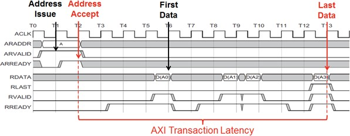

# Monitor Framework

The performance analysis toolbox in the Vitis IDE offers a set of system-level performance measurements. For a design that targets SoCs, this includes performance metrics from both the Programmable Logic (PL) and the Processing System (PS).

The PL performance metrics include the following:

- **(Write/Read) Transactions:** Number of AXI transactions

- **(Write/Read) Throughput:** Write or read bandwidth in MB/s

- **Average (Write/Read) Latency:** Average write or read latency of AXI transactions The PS performance metrics include the following:

  - **CPU Utilization (%):** Percentage of non-idling CPU clock cycles

  - **CPU Instructions Per Cycle (IPC) :** Estimated number of executed
     instructions per cycle

  - **L1 Data Cache Access and Miss Rate (%) :** Number of L1 data cache
     accesses and the miss rate

  - **CPU (Write/Read) Stall Cycles Per Instruction :** Estimated number
     of stall cycles per instruction due to memory writes (write) and
     data cache refills (read)

This mix of performance metrics is gathered from different parts of the target and combined into a common timeline and display, enabling system-level performance analysis. In order to gather and display these metrics, the Vitis IDE includes a monitor framework that accesses various profile counters across a target system, as well as a host-target communication framework to perform the sampling and offloading of these counters.

The metadata required by the Vitis IDE to perform this monitoring is exported by AMD Vivado&trade; Design Suite and read by the Vitis IDE when a Hardware Platform Specification project is created. While this export/import procedure has already been performed for the System Performance Modeling (SPM) project, it can also be executed on your design (see Instrumenting Hardware). In other words, all of the monitoring and analysis described herein is available and applicable to the SPM design as well as your design. This extension is addressed in [End-To-End Performance Analysis](10-end-to-end-performance-analysis.md).

## PL Profile Counters

An AXI Performance Monitor (APM) inserted into a design provides the PL profile counters (see [Instrumenting Hardware](../docs/9-using-spa-with-custom-target.md#instrumenting-hardware) for information about how to do this insertion for your design). There are six counters per connected AXI interface. The following table lists how these counters are used. Note that these are incrementing up-counters that capture a running total of bytes transferred, total latency, and the number of completed AXI transactions, respectively. As shown in the following table, the difference of these counters between successive samples (signified by Δ) is used in the calculations of average throughput and latency across a given Sample Interval. The Vitis IDE uses a default sample interval of approximately 50 ms.

 *Table 3:* **Profile Counters per AXI Interface in AXI Performance Monitor**

| APM Counter Metric      | Performance Metrics Equation                                                  |
| ----------------------- | ----------------------------------------------------------------------------- |
| Write Byte Count        | Write Throughput =(∆(Write Byte Count))/(Sample Interval)                     |
| Write Latency Count     | Average Write Latency = (∆(Write Latency Count))/(∆(Write Transaction Count)) |
| Write Transaction Count | Use equation above                                                            |
| Read Byte Count         | Read Throughput = (∆(Read Byte Count))/(Sample Interval)                      |
| Read Latency Count      | Average Read Latency =(∆(Read Latency Count))/(∆(Read  Transaction Count))    |
| Read Transaction Count  | Use equation above                                                            |

Because there are many events that constitute an AXI transaction, it is important to understand the events that the Vitis IDE captures and how latency is calculated. The following figure shows a timing diagram of an example AXI read transaction, including address, data, and control signals.

*Figure 7:* **Example AXI Transaction Timeline Showing Read Latency Used in the Vitis IDE**

The start event used by the Vitis IDE is Address Accept (ARVALID=1 and ARREADY=1), while the end event is Last Data (RLAST=1 and RVALID=1 and RREADY=1). The difference between these two events within a common transaction is deemed the Transaction Latency.

>***Note*:** The APM does not support:
>
>- More than 32 out-standing transactions. Where the transactions can be initialization of more than 32 addresses before the first data block initiation (or) transfer/acceptance of 32 data blocks before first address.
>
>- Interleaved transactions. Where the transactions can be address initialization of new data transaction before finishing the current data transaction (before getting wlast/rlast).

## PS Profile Counters

The PS profile counters comprise the Arm Performance Monitor Unit (PMU) included with each Cortex-A9 CPU. The following table shows how the six counters in each PMU are automatically configured by the Vitis IDE, as well as the performance metric equations they provide for each CPU. As shown later in this guide, these are the metrics that are directly graphed in the Vitis IDE.

 *Table 4:* **Profile Counters used in Arm Performance Monitor Unit**

| Event Name        | Event | Description                                                | Performance Metrics Equation                                                |
| ----------------- | ----- | ---------------------------------------------------------- | --------------------------------------------------------------------------- |
| CCNT              | N/A   | Non-idle clock cycle  counter                              | CPU Utilization(%) =  100x∆CCNT/(2*∆(SPM reference clock))                  |
| INST_RENAME       | 0x68  | Number of instructions that went through register renaming | CPU Instructions Per Cycle(IPC) = (∆(INST_RENAME))/CCNT                     |
| L1D_CACHE_REFILL  | 0x03  | L1 data cache misses                                       | L1 Data Cache Miss Rate (%) = 100*(∆(L1D_CACHE_REFILL))/(∆(L1D_CACH E))     |
| 1D_CACHE          | 0x04  | L1 data cache misses                                       | L1 Data Cache Miss Rate (%) = 100*(∆(L1D_CACHE_REFILL))/(∆(L1D_CACH E))     |
| D CACHE_DEP_STALL | 0x61  | Data cache dependent stall cycles with pending linefill    | Read Stall Cycles Per Instruction = (∆(DCACHE_DEP_STALL))/(∆(INST_ RENAME)) |
| MEM_WRITE_STALL   | 0x81  | Processor stall cycles waiting for memory write            | Write Stall Cycles Per Instruction = (∆(MEM_WRITE_STALL))/(∆(INST_R ENAME)) |

## Host-Target Communication

Now that you appreciate the profile counters and how they are processed and displayed in the SPA toolbox, it is also important to understand how those counters are sampled and transferred from the target to the host machine.

The Vitis IDE tool itself runs on a host machine and includes a hardware server using the Target Communication Framework (TCF). TCF can efficiently communicate with the target over the JTAG programming cable. This TCF-based hardware server controls and samples the profile counters listed in [Table 1: BEEBS Benchmarks Provided in Pre-Compiled Program Table](../docs/2-system-performance-modeling-project.md#table1) and [Table 2: Memory Stride Benchmarks Provided in Pre-Compiled Program](../docs/2-system-performance-modeling-project.md#table2) in the least intrusive manner possible. The APM and PMU counters are read using memory-mapped access via the Zynq 7000 SoC central interconnect. The counter values are then processed as described previously and displayed in the Vitis IDE.

Copyright © 2019–2024 Advanced Micro Devices, Inc.

<a href="https://www.amd.com/en/corporate/copyright">Terms and Conditions</a>

