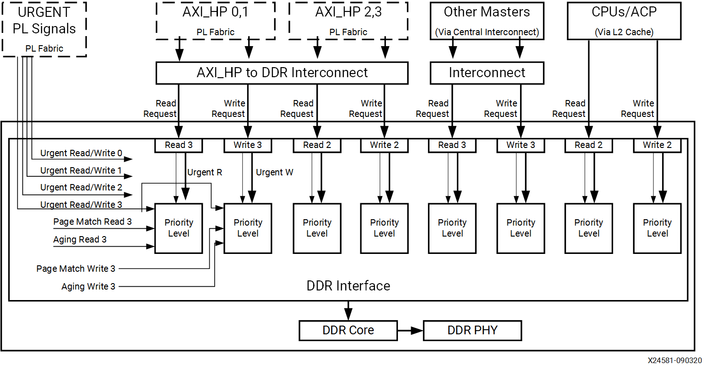
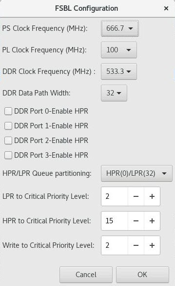
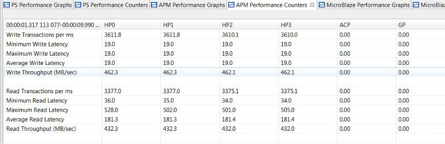
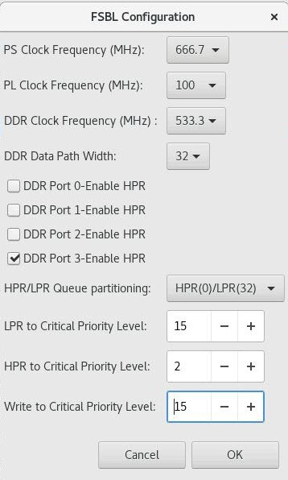
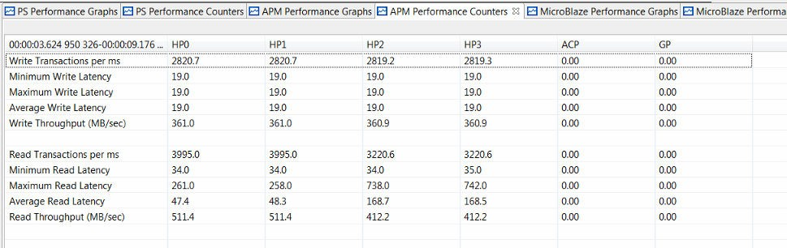
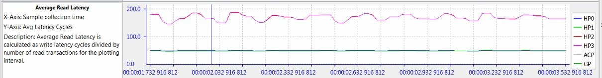
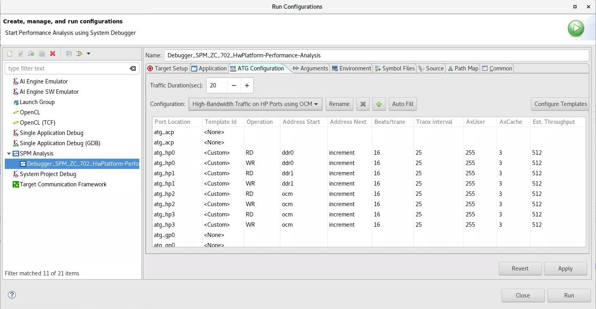
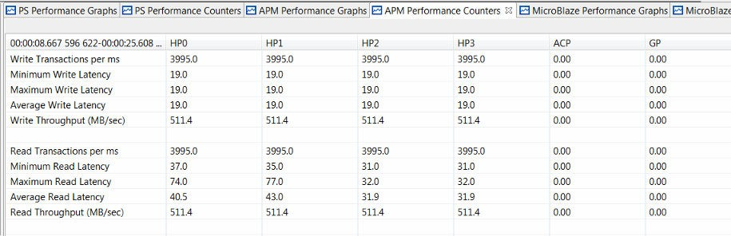

# Evaluating DDR Controller Settings

The Zynq 7000 SoC family of devices offers some control over the allocation of bandwidth to the DDR memory. These settings are provided in the on-chip DDR controller (DDRC). You can modify clock frequencies and DDRC settings for the SPM design in the Vitis IDE. This chapter shows that while bandwidth cannot necessarily be created, it can indeed be re-allocated.

It is important to understand the connectivity to the DDRC. The following figure shows the block diagram of the Zynq 7000 SoC DDRC. There are four ports on the DDRC which service traffic from the CPUs and the Accelerator Coherency Port (ACP) (port 0), other masters via the central interconnect (port 1), HP ports HP2 and HP3 (port 2), and HP ports HP0 and HP1 (port 3). The settings for the DDRC are part of the PS7 or First Stage Boot Loader (FSBL) which configures various system settings early in the boot process. For more information, see the "DDR Memory Controller" chapter of the *Zynq-7000 SoC Technical Reference Manual* ([UG585](https://www.xilinx.com/cgi-bin/docs/ndoc?t=user_guides;d=ug585-Zynq-7000-TRM.pdf)).

 *Figure 25:* **Block Diagram of Zynq 7000 SoC DDR Controller**

 

From the Vitis IDE Project Explorer, select the System Performance Modeling (SPM) project (default name is SPM_ZC_702_HwPlatform), and then right-click and select **Configure FSBL Parameters**.
 
> ***Note*:** Configure FSBL Parameters** feature is only available to Zynq 7000.

The following figure shows the dialog box that opens, containing the default FSBL settings for the SPM design. The settings include the following:

- **(PS/PL/DDR) Clock Frequency (MHz) :** You can specify clock frequencies for the processing system (PS), programmable logic (PL), and DDR.

- **DDR Data Path Width :** You can specify a data path width of 16 or 32 bits.

- **DDR Port (0/1/2/3)-Enable HPR:** You can enable high-performance reads (HPR) for the four DDR ports.

- **HPR/LPR Queue Partitioning:** The DDRC contains a queue for read requests with a constant total depth of 32 requests. You can specify how this queue is allocated across HPR and low- priority reads (LPR).

- **(LPR/HPR/Write) to Critical Priority Level:** The last three values shown in the following figure are critical levels which specify the number of clocks (unit is 32 DDR clock cycles) that the three different queues (that is, LPR, HPR, and Write) can be starved before they go critical. Once a critical state is reached, that queue becomes top priority. That is, a smaller value means higher priority for that queue.

 *Figure 26:* **Default FSBL Configuration Settings for SPM Design**

These DDRC settings can also be modified in the Vivado® Design Suite. In a Vivado IP integrator based design, you can double-click on the Zynq 7000 Processing System IP block in the block diagram. A configuration dialog box opens, in which you can re-customize the IP. The DDR Controller settings are listed under DDR Configuration, and the specific options of interest are under Enable Advanced options. When that box is checked, you can view and modify settings such as read/write priority, high-priority read (HPR), and other important settings that can impact performance. The functionality of these settings is described in depth in the *Zynq-7000 SoC Technical Reference Manual* ([UG585](https://www.xilinx.com/cgi-bin/docs/ndoc?t=user_guides;d=ug585-Zynq-7000-TRM.pdf)).

## Default DDRC Settings

Baseline results were created by running HP only traffic using the default FSBL settings, as shown in the previous figure. The PL traffic was the high-bandwidth HP traffic shown in [Figure 20: ATG Traffic Configuration Modeling High-Bandwidth Traffic on HP Ports](../docs/6-evaluating-high-performance-ports.md#fig20); however, the traffic duration was set to 10s. Also, no software application was run. You can configure by modifying the Debug Configuration. Select the Application tab, and then uncheck the Download Applications check box.

This traffic scenario was run on a ZC702 board, and the results can be seen in the following figure. Note that default DDRC settings were used because they have not been modified yet. The HP ports sustained a higher bandwidth than the previous results shown in [Figure 21: Summary of Performance Results from Modeling High-Bandwidth Traffic on HP Ports](../docs/6-evaluating-high-performance-ports.md#fig21) because there is no DDR traffic from the CPUs.

 *Figure 27:* **HP Port Performance Using Default DDR Configuration Settings**

The total DDR bandwidth is therefore the sum of the bandwidths measured on the HP ports, calculated as follows:

`Total bandwidth= 462.3 + 462.3 + 462.1 + 462.1 + 432.3 + 432.3 + 432.0 + 432.0=3577.4 MB/sec`

This total bandwidth is 83.7% of the theoretical maximum throughput of the DDR. This is very good performance considering the mix of high-bandwidth reads and writes from four different HP ports.

## Modified DDRC Settings

You can modify the DDRC settings and re-run the HP only test above to compare performance results. Note that while modifying the DDRC settings is important for this stress test, it may not be desirable for your design. In fact, most designs will achieve desired performance using the default DDRC settings.

 *Figure 28:* **Modified FSBL Configuration Settings for SPM Design**

Consider the scenario where high priority is desired for the read traffic on HP0 and HP1. In a Zynq 7000 SoC, these HP ports are serviced by DDR port 3 (see [Figure 25: Block Diagram of Zynq 7000 SoC DDR Controller](#fig25)). As shown in the previous figure, this can be accomplished by adding HPR to DDR port 3. The request queue was also partitioned by assigning 24 requests for HPR and eight requests for LPR. The HPR requests were further prioritized by decreasing its critical priority level to two while increasing the LPR and write critical levels to 15. This was an important step to ensure the HPRs received the desired priority.

 *Figure 29:* **HP Port Performance Using Modified DDR Controller Settings**

The previous figure shows the results in the Vitis IDE after modifying the DDRC settings and re-running the same HP only traffic. HP0 and HP1 were able to achieve their requested read throughputs of 512 MB/sec due to the high priority of their transactions at the DDR controller. However, the achieved throughputs of all other traffic (read requests for HP2 and HP3 and all writes) were reduced. This was due to the low priority of those transactions -- in other words, just as was specified in the DDRC settings. The total bandwidth of this test can be calculated as follows:

 `Total bandwidth=361 + 361 + 360.9 + 360.9 + 511.4 + 511.4 + 412.2 + 412.2= 3291 MB/s`

Note that this total bandwidth is within 2.3% of the total bandwidth achieved with the default DDRC settings (summarized in and totaled in ). This is very important to observe: changing the DDRC settings does not create bandwidth but only re-allocates it. That is, a larger percentage of the total bandwidth issued by the DDR controller was re-allocated to the requested high priority ports: HP0 and HP1. Meanwhile, the total bandwidth stayed relatively constant.

Another way to observe this re-allocation of priorities can be seen in the read latency graph shown in the following figure. Since the DDRC is configured to provide high priority to read traffic on HP0 and HP1, the latency on those ports is relatively low. That is, read requests on those ports are being serviced by the DDRC at a higher priority whereas read requests on the other HP ports, HP2 and HP3, are being treated as low priority and therefore, their latency is much higher. The impact of this is increased throughput on HP0 and HP1 and decreased throughput on HP2 and HP3.

 *Figure 30:* **Read Latency of HP Ports Using Modified DDR Controller Settings**

## Utilizing On-Chip Memory

Consider the case where it is a design requirement to obtain 512 MB/sec for both write and read traffic from all HP ports. How do you leverage other memory to augment the DDRC bandwidth? This would require a total bandwidth of 8 \* 512 = 4096 MB/sec, or 96.0% of the theoretical maximum throughput of the DDR. While this is not achievable from a typical DDR controller and memory with an even mix of writes and reads, the on-chip memory (OCM) can be explored for additional data buffering. This is an independent 256 KB memory within the Zynq 7000 SoC PS that provides an excellent low-latency scratch pad.

The following figure shows one particular traffic scenario that utilizes the OCM. Compare this scenario to the original one shown in Figure 7-3. While the requested throughputs are kept the same for all operations and types, the traffic on HP2 and HP3 now uses the OCM.

 *Figure 31:* **ATG Traffic Configuration Modeling High-Bandwidth Traffic on HP Ports Using Both DDR and OCM**

The results of such a traffic scenario are shown in the following figure. Since the OCM was used to augment the DDR bandwidth, the desired bandwidth of 512 MB/sec was sustained for both write and read operations on all four HP ports. Also noteworthy, the average read latency from the OCM is 31-32 cycles while the average from the DDR is 40-44 cycles. Note that these latency values depend on many factors in a system, so it is important to utilize the SPM design and analyze under various conditions.

 *Figure 32:* **Summary of Performance from High-Bandwidth Traffic on HP Ports using Both DDR and OCM**

You could exploit the bandwidth re-allocation provided by modifying DDRC settings. For example, you may have higher bandwidth or lower latency requirements for a given IP core in your programmable logic design. Once you know which HP port to connect that core to (or at least plan to connect to) you can allocate more bandwidth to that particular HP port pair. For example, in the [End-To-End Performance Analysis](10-end-to-end-performance-analysis.md), a multi-layer video display controller may have higher bandwidth requirements than other AXI masters in the system.

There are other combinations of HPRs and critical levels that could work well for other design criteria and constraints. For example, you could use these settings to improve the run-time performance of your software by increasing the priority of DDR port 0. This port is connected to the L2 cache, which in turn services the PUs and the ACP port.

With the performance analysis capabilities provided in the Vitis IDE, you now have the ability to verify these performance results.

> ***Note*:** The Zynq UltraScale+ MPSoC also provides many ways to tune the DDR parameters and AXI QoR. The Vitis IDE does not provide a specific GUI to do it. You need to modify the registers with XSCT or customized FSBL.

Copyright © 2019–2024 Advanced Micro Devices, Inc.

<a href="https://www.amd.com/en/corporate/copyright">Terms and Conditions</a>

