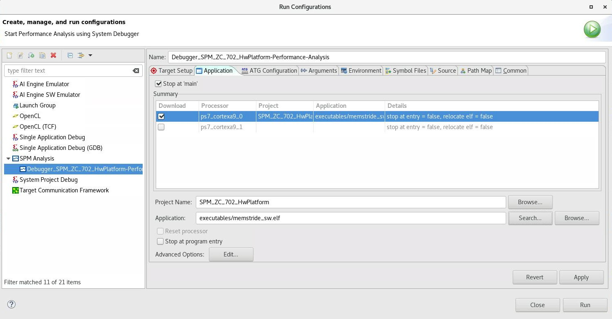
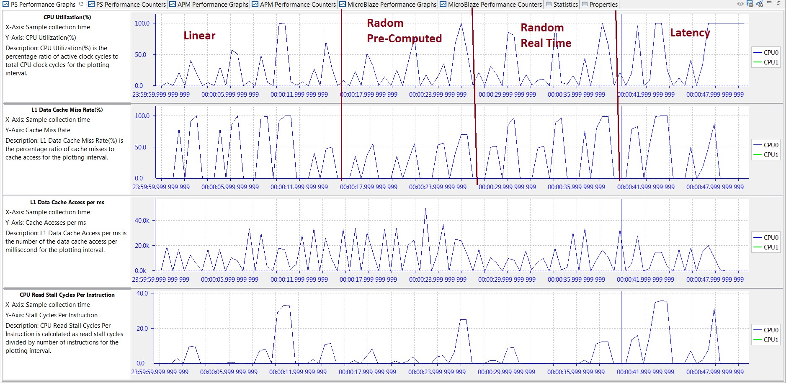
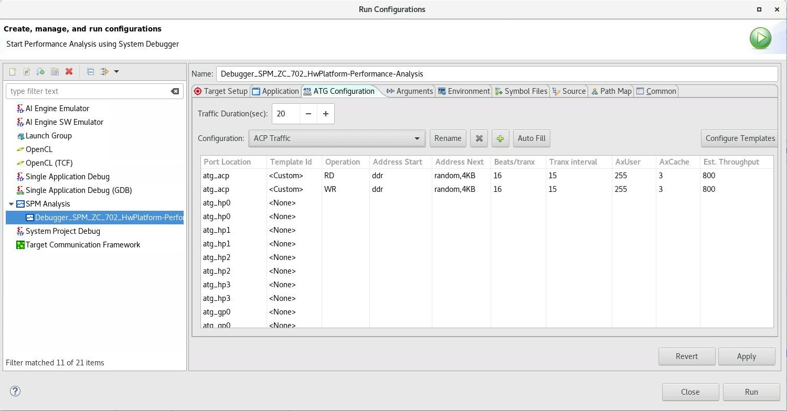
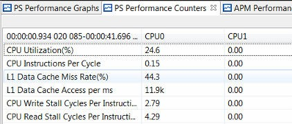
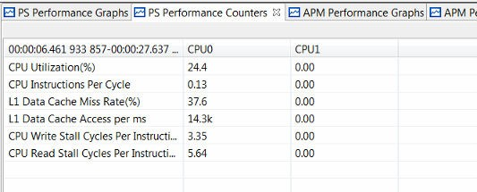
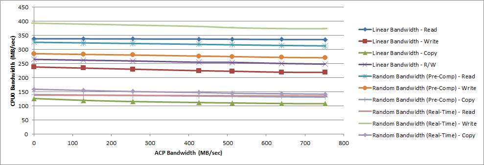

# Evaluating Memory Hierarchy and the ACP

The System Performance Modeling (SPM) design can be used to evaluate the performance effects of the Zynq 7000 SoC cache. You can assess baseline performance using software only, and then you can evaluate the effects of traffic on the Accelerator Coherency Port (ACP). While running software only can produce fairly predictable memory performance, introducing other traffic activity into the system may lead to less intuitive results. Specifically, CPU and ACP traffic have the potential to impact each other at the shared L2 cache. The SPM design allows you to do this analysis very easily.

## Assess Memory Performance

To begin the evaluation, the SPM design can be used to assess a baseline performance using software only. An application to use for this evaluation is the memory stride benchmarks program, one of the pre-compiled executables that comes with the SPM project.

The following figure shows how this was defined in the Vitis™ IDE using the memory stride software executable (see [SPM Software](../docs/2-system-performance-modeling-project.md#spm-software)). This software was instrumented to calculate bandwidth and average latency (see [Instrumenting Software](../docs/9-using-spa-with-custom-target.md#instrumenting-software)).

 *Figure 33:* **Application Setup using Memory Stride Software**

*Table 7:* **Software-Only Bandwidth Results for Memory Stride Benchmarks (in MB/sec)**

<table>
<thead>
<tr>
<th rowspan="2">Pattern Type</td>
<th rowspan="2">Operation Type</td>
<th colspan="3">Working Set Size</td>
</tr>
<tr>
<th>4 KB</td>
<th>64 KB</td>
<th>1024 KB</td>
</tr>
</thead>
<tbody>
<tr>
<td>

Linear

</td>
<td>

Read

</td>
<td>

2141.4

</td>
<td>

338.4

</td>
<td>

118.1

</td>
</tr>
<tr>
<td></td>
<td>

Write

</td>
<td>

2114.8

</td>
<td>

238.4

</td>
<td>

57.6

</td>
</tr>
<tr>
<td></td>
<td>

Copy

</td>
<td>

1248.4

</td>
<td>

126.7

</td>
<td>

32.9

</td>
</tr>
<tr>
<td></td>
<td>

Read/Write

</td>
<td>

1194.4

</td>
<td>

265.2

</td>
<td>

64.4

</td>
</tr>
<tr>
<td>

Random (Pre- Computed)

</td>
<td>

Read

</td>
<td>

1019.9

</td>
<td>

325.9

</td>
<td>

92.4

</td>
</tr>
<tr>
<td></td>
<td>

Write

</td>
<td>

532.4

</td>
<td>

285.6

</td>
<td>

64.1

</td>
</tr>
<tr>
<td></td>
<td>

Copy

</td>
<td>

442.6

</td>
<td>

140.6

</td>
<td>

31.9

</td>
</tr>
<tr>
<td>Random (Real-Time)</td>
<td>Read</td>
<td>

337.2

</td>
<td>

138.7

</td>
<td>

41.5

</td>
</tr>
<tr>
<td></td>
<td>Write</td>
<td>

409.8

</td>
<td>

393.6

</td>
<td>

70.0

</td>
</tr>
<tr>
<td></td>
<td>Copy</td>
<td>

409.7

</td>
<td>

159.4

</td>
<td>

32.8

</td>
</tr>
</tbody>
</table>

*Table 8:* **Software-Only Latency Results for Memory Stride Benchmarks (in nsec)**

<table>
<thead>
<tr>
<th rowspan="2">Pattern Type</td>
<th rowspan="2">Operation Type</td>
<th colspan="3">Working Set Size</td>
</tr>
<tr>
<th>4 KB</td>
<th>64 KB</td>
<th>1024 KB</td>
</tr>
</thead>
<tbody>
<tr>
<td>Linear</td>
<td>Read</td>
<td>

1.87

</td>
<td>

11.82

</td>
<td>

33.88

</td>
</tr>
<tr>
<td>Random (Pre- Computed)</td>
<td>Read</td>
<td>

1.89

</td>
<td>

16.78

</td>
<td>

69.46

</td>
</tr>
</tbody>
</table>

Using no traffic in the Programmable Logic (PL), bandwidth results (in MB/sec) for the software- only tests are listed in [Table 7: Software-Only Bandwidth Results for Memory Stride Benchmarks (in MB/sec)](#table7), while latency results (in nsec) are shown in [Table 8: Software-Only Latency Results for Memory Stride Benchmarks (in nsec)](#table8). Three different working set sizes were used to specifically test the bandwidth of different stages of the memory hierarchy: 4 KB, 64 KB, and 1024 KB. These are the three sizes used by the pre-compiled memory stride executable in the SPM project. The locality of these data arrays is known based on their size and the fact that there is little else in the heap used by the program.

Within a working set size, the highest bandwidths are achieved by the linear bandwidth tests as they can take advantage of the 32-byte cache lines. Operations such as copy and read/write are generally slower because they involve a mix of read and write operations. Among the three different set sizes, the 4 KB array sustains the highest bandwidth while the 1024 KB array sustains the lowest bandwidth.

There are 36 total tests performed, as the 12 benchmarks listed in [Table 7: Software-Only Bandwidth Results for Memory Stride Benchmarks (in MB/sec)](#table7) and [Table 8: Software-Only Latency Results for Memory Stride Benchmarks (in nsec)](#table8) are each run on the three different data array sizes. Since a sleep time of one second was inserted between each test, the CPU utilization gives a clear view of when these benchmarks were run. The following figure helps orient the timeline for the results. The three data sizes were run from smallest to largest within each benchmark, which can be seen in the value and length of the utilization of CPU0.

 *Figure 34:* **PS Performance Graphs for Memory Stride Benchmarks**

The previous figure also shows three other graphs reported in the PS Performance panel, including: L1 Data Cache Miss Rate, and CPU Write/Read Stall Cycles Per Instruction. While the periodic nature of
the memory stride benchmarks is reflected in these graphs, these three graphs can also provide information as to where the data is being retrieved. Every third benchmark has a L1 data cache miss rate of 0% - that was when the 4 KB working set size was used. The other two set sizes do not fit in the L1 data cache and, therefore, have at or near 100% miss rates.

The software impact of these cache misses can be seen in the Stall Cycles Per Instruction. A higher number of stall cycles means the processor is spending more cycles waiting for either a memory write (write) or a data cache refill (read). This would, in turn, lower the effective bandwidth of that benchmark. An example is the Linear Bandwidth -- Copy benchmark which was performed between approximately 10-11s. The high number of CPU write/read stall cycles per instruction during this time shows why it sustains one of the lowest bandwidths of all memory stride benchmarks (33.23 MB/s; see [Table 7: Software-Only Bandwidth Results for Memory Stride Benchmarks (in MB/sec)](#_bookmark47).

## Data Size and Locality

To better visualize the performance of the memory hierarchy, the working set size used in the memory stride tests was swept across a range of values between 1 KB and 4096 KB. This enables a clear view of how data size and locality can affect the bandwidth and latency achieved by the CPU.

 *Figure 35:* **CPU Memory Bandwidth Achieved During Memory Stride Tests**

The previous figure shows the memory bandwidth achieved by CPU0 during the memory stride tests. For clarity, the random bandwidth (real-time) tests are not shown in the graph. As the working set size increases, there are noticeable transitions at the L1 and L2 data cache boundaries as the working set size no longer fits into the previous cache. The following figure shows similar transition points for the average memory access latency achieved by CPU0 during the memory stride tests. However, while the bandwidth decreases with an increasing working set size, the latency noticeably increases.

 *Figure 36:* **CPU Memory Access Latency Achieved During Memory Stride Tests**

## Shared L2 Cache

Now that baseline performance measurements have been made between the CPUs and the memories, traffic can be added on the Accelerator Coherency Port (ACP) to analyze its effects on system performance. The memory stride software (see [SPM Software](../docs/2-system-performance-modeling-project.md#spm-software)) was run again on CPU0; however, this time traffic was added to the ACP. Since the L2 cache is shared by the CPUs and the ACP, there is expected to be some contention to occur at that memory.

The following figure shows the ATG configuration that models the initial traffic on the ACP. It specifies random addressing within a 4 KB region and utilizes the memory path through the L2 cache to the DDR. The first value for Tranx Interval is 100 clock cycles, which configures the ATGs to request a throughput of 128 MB/sec at 100 MHz. Keeping every other setting constant, the values for Tranx Interval were decreased, thus increasing the requested throughputs. The values used for this transaction interval include: 100, 50, 30, 25, 20, and, 17. These intervals lead to request throughputs of 128, 256, 426, 512, 640, and 752 MB/s.

 *Figure 37:* **ATG Configuration Modeling Traffic on ACP**

This traffic scenario enables an exploration of bandwidth tradeoffs between the CPUs and the ACP. Note that this models the case where the CPU and ACP are not using a shared memory space. Similarly to the DDR, the L2 data cache allocates its bandwidth based on scheduling. If the combined bandwidth is higher than what the L2 cache can support, then contention in the form of backpressure is introduced.

 *Figure 38:* **Performance Summary for Memory Stride and No ACP Traffic**

The previous figure shows the performance summary table in the Vitis IDE after running memory stride with no ACP traffic, while the following figure shows the same summary table with memory stride running plus read/write traffic on the ACP requesting 752 MB/sec (Tranx Interval of 17). These are the two bounds of the test, and the differences are noticeable. While the ACP traffic is clearly evident in the following figure, the CPU statistics are generally very similar.

 *Figure 39:* **Performance Summary for Memory Stride and ACP Traffic Requesting 752 MB/sec**

One difference is in the CPU Write Stall Cycles Per Instruction and the CPU Read Stall Cycles Per Instruction. While these values are 2.79 and 4.29 with no ACP traffic, they increase to 3.35 and 5.64, respectively, with high-bandwidth ACP traffic. High values for these two metrics means the CPU is stalling often on memory writes and data cache refills. The reason for the increase in these values is the contention at the L2 cache, since the ACP traffic is consuming a significant amount of L2 cache bandwidth.

The following figure shows how the write and read performance on the ACP is affected by this contention. There is minimal impact on the ACP write performance, with only slight increases in latency during the
various software benchmarks. However, the average read latency is clearly affected by the memory stride software activity, showing a periodicity reflecting the sequence of benchmarks. The ACP throughput is also affected, dropping to a worst-case value of approximately 640 MB/s. While the requested bandwidth of 752 MB/s is perhaps unrealistically high and persistent for a typical design, it does provide a stress test of the system.

 *Figure 40:* **ACP Performance Results in the Vitis IDE Showing Impact on Latency**

As the requested ACP bandwidth was swept in value, the sustained CPU bandwidth was also recorded. The following figure shows the bandwidth achieved by CPU0 with memory stride using a working set size of 4 KB.

 *Figure 41:* **Performance Achieved by CPU0 vs. ACP Bandwidth (Set Size = 4 KB)**

The following figure shows the CPU0 bandwidth when memory stride operated on the 64 KB set size.

 *Figure 42:* **Performance Achieved by CPU0 vs. ACP Bandwidth (Set Size = 64 KB)**

The following figure shows the bandwidth when memory stride used the 1024 KB set size. Due to their set sizes, these results are assumed to be good measurements of achieved bandwidth from the L1 data cache, the L2 data cache, and the DDR, respectively.

 *Figure 43:* **Performance Achieved by CPU0 vs. ACP Bandwidth (Set Size = 1024 KB)**

When running the memory stride software with a working set size of 4 KB, the CPU bandwidth was unaffected by the traffic on the ACP. When using set sizes of 64 KB and 1024 KB, the ACP traffic does have a measurable impact on the CPU bandwidth. The largest decrease in CPU0 bandwidth was 14.6% for the Linear Bandwidth - Copy benchmark operating on a set size of 64 KB.

Copyright © 2019–2024 Advanced Micro Devices, Inc.

<a href="https://www.amd.com/en/corporate/copyright">Terms and Conditions</a>

