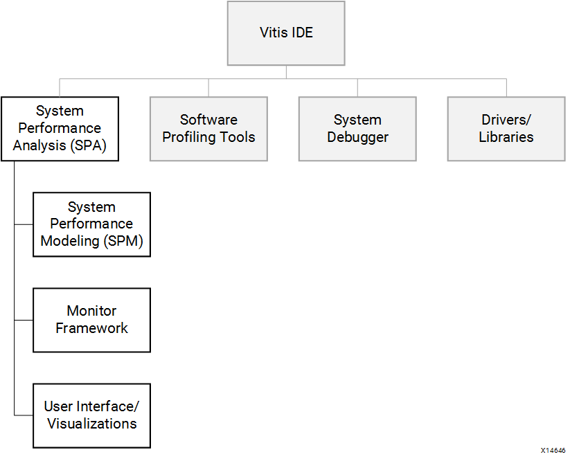
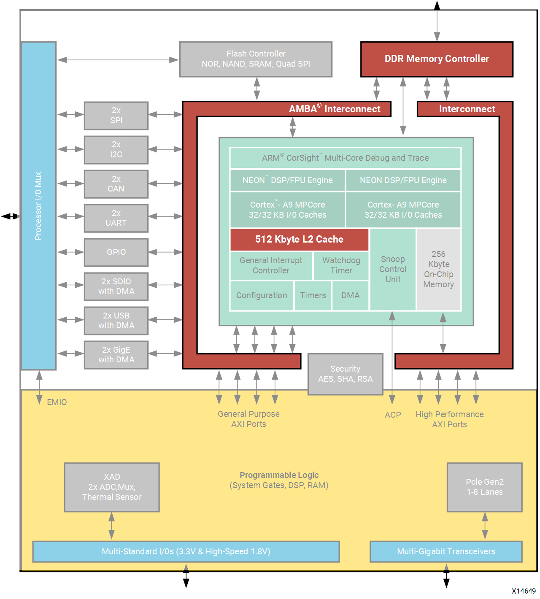
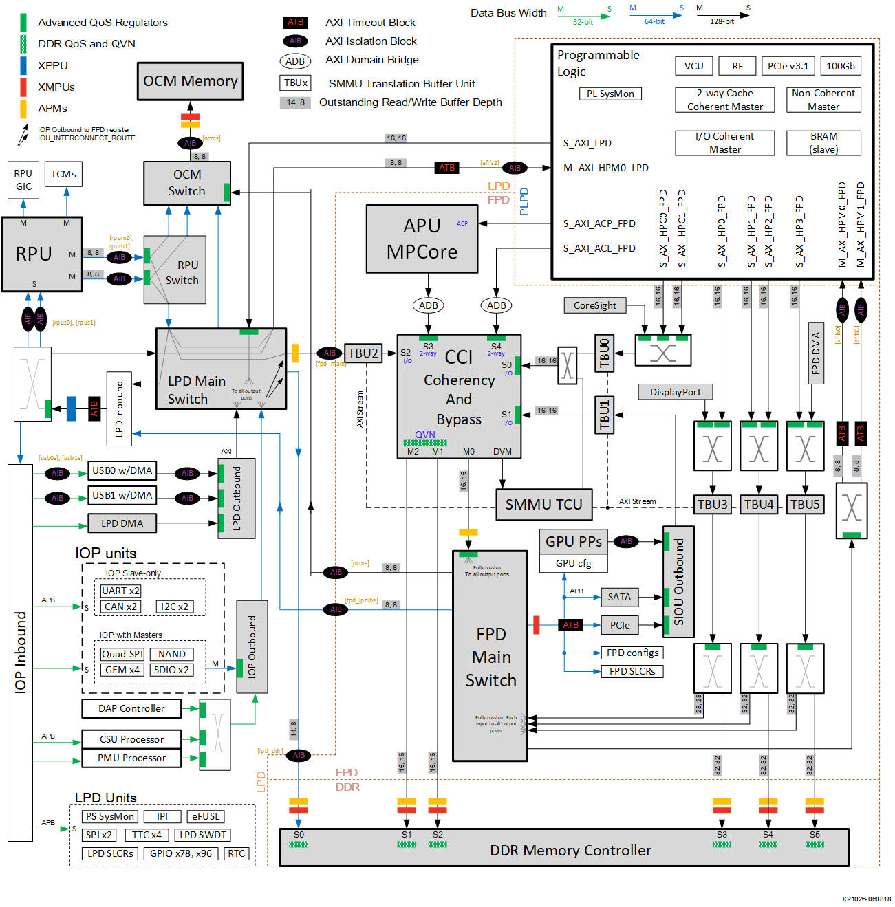

# Introduction 

The Xilinx® SoC device family has had several generations, from Zynq&reg;-7000 devices and Zynq UltraScale+&trade; MPSoCs to Versal&trade; ACAPs. They integrate the Processing System (PS) with the Programmable Logic (PL) in one chip. The PS and PL are connected through standard Arm® AMBA® AXI interfaces designed for performance and system integration. This style of SoC requires novel performance analysis and benchmarking techniques to provide you with a clear understanding of system performance. It is critical to understand the SoC architecture so that you can use its full potential and differentiate your products in the marketplace.

## System Performance Analysis Toolbox

To address the need for performance analysis and benchmarking techniques, the Xilinx Vitis™ integrated design environment (IDE) has been enhanced with a System Performance Analysis (SPA) toolbox to provide early exploration of hardware and software systems. Specifically, a Zynq-7000 SoC designer is presented with insights into both the PS and the PL to understand the interactions across such a complex, heterogeneous system. You can observe system performance at critical stages of a design flow, enabling you to refine the performance of your system.

The following figure shows how the SPA toolbox fits into the feature set of the Vitis IDE. Other important features of the Vitis software platform include software profiling tools, a system debugger, and supporting drivers and libraries. The SPA toolbox contains a monitor framework, user interface, and visualizations that are common for two important use models: an early exploration environment called System Performance Modeling (SPM) and the monitoring and analysis of your own designs. This common toolbox can be used for performance validation to ensure consistent and expected performance throughout the design process.

*Figure 1:* **Vitis IDE Features Including the SPA Toolbox**

SPM is a unique feature of the Vitis software platform that enables complex performance modeling before design work has started. SPM is executed on hardware target. It includes a highly configurable, fixed bitstream containing one AXI traffic generator for each PS-PL AXI interface. These traffic generators are configurable modules used by the Vitis software platform to model PL traffic activity. Software applications can also be run simultaneously in the processing system, and you can specify system configuration parameters.

## Performance Analysis Flow

Using the SPM design, the Vitis software platform enables you to achieve an end-to-end performance analysis flow. This flow allows you to model the traffic of your estimated design and then validate the performance using your actual design.

 *Figure 2:* **End-to-End Performance Analysis Flow**

 As shown in the previous figure, this is a four-step process that includes:

- **Assess Requirements:** You first estimate the AXI traffic requirements of your design, including data throughput at the PS-PL interfaces of the target system.

- **Model Design:** Based on these traffic requirements, you then use SPM to model your design. Because actual target hardware is used, real-time clock rates are achieved. This provides improved run-times over other modeling environments, as well as increased accuracy because real system activity is being monitored.

- **Performance Validation:** As you develop your design, you can validate the performance results by monitoring and visualizing your actual design.

- **In-Depth Analysis:** The the Vitis software platform performance tools also enable a deep-dive analysis into your design to evaluate design options and gauge the impact of design improvements.

There are multiple benefits to achieving such an end-to-end performance analysis flow, including:

- **Reduce risk for success:** Achieving the desired latencies and throughput with SPM-based models usually means that the final design will achieve the same performance. While this is not guaranteed, you can assume that the SoC model might be able to meet your performance goals.

- **Design Improvements:** Running traffic scenarios using SPM will provide valuable insights into system performance (for example, latencies) that will help you in your actual design work.

- **What-If Scenarios:** The SPM is a highly-configurable model and you can use it to try variations of capabilities, features, and architectures.

## Background

Targeting a design to the Xilinx SoC devices (Zynq-7000, Zynq UltraScale+ MPSoC, or Versal ACAP) can be facilitated if you are aware of the numerous system resources and their capabilities. After you become acquainted with the device, then you can decide how to map your functionality onto those resources and optimize the performance of your design.

### Zynq-7000 Architecture Highlights

 *Figure 3:* **Block Diagram of Zynq-7000 SoC**

The previous figure shows the block diagram of the Zynq-7000 SoC. The PS includes two Arm Cortex-A9 cores, a 512 KB L2 cache, a 256 KB on-chip memory, and a number of peripherals and controllers.

The PL includes configurable system gates, DSPs, and block memories. There are three types of interfaces between the PS and PL:

- **General Purpose (GP) AXI Ports:** Control ports connected directly to the slave interconnect.

- **Accelerator Coherency Port (ACP):** Low-latency access to PL masters, with optional coherency with L1 and L2 cache.

- **High-Performance (HP) AXI Ports:** PL bus masters with high-bandwidth datapaths to the DDR and OCM memories.

These interfaces serve a variety of purposes for communication between the PS, the Programmable Logic (PL), and any external memory (for example, DDR SDRAM or simply DDR).

*Figure 4:* **Zynq-7000 SoC Block Diagram with Shared Resources Highlighted**

The previous figure highlights the shared resources in the Zynq-7000 SoC block diagram. A design that fully uses all of the capabilities of this SoC requires multiple channels of high- bandwidth communication. All of this traffic in the system inevitably involves shared resources. In a poorly designed system this could lead to multiple points of contention across the L2 cache, the DDR memory controller, and the high-speed interconnects. To optimize the performance of a design that fully uses all of these resources, a designer requires observability into multiple areas of such a system. Improvements can then be made through code changes, design connectivity, or system settings.

An example is the L2 cache. Because the ACP shares the L2 cache with the Cortex-A9 CPUs, high-throughput traffic from either the ACP or the processors has the potential to impact the performance of the other.
While this effect can be anticipated, understanding the nature and extent of this impact can be challenging.

This is where the performance capabilities of the Vitis IDE can be exploited. The Vitis IDE provides the visualizations to better understand this impact as well as SPM: an exploratory, early design environment. Tables and real-time graphs are provided to visualize PS and PL performance metrics on a common timeline. This provides much needed insight into when and where things occur to quickly isolate any potential issues. Furthermore, the same performance metrics are calculated for the SPM design as well as your own design, therefore providing early performance exploration as well as consistent results across a design flow.

### Zynq UltraScale+ MPSoC Architecture Highlights

The Zynq UltraScale+ MPSoC is the next generation of Zynq-7000. Its PS includes dual-core or quad-core Arm® Cortex-A53 APU, dual-core Arm® Cortex-R5, optional Mali-400 GPU, VCU and a number of peripherals and controllers.

*Figure:* **Block Diagram of Zynq UltraScale+ MPSoC**

The DDR memory controller has six ports. Different masters can access the DDR Controller. Below are some of the masters in a system that can require some DDR bandwidth.  

 - PS Processors: APU & RPU
 - Multiple PL Interfaces can master into the DDR Memory Controller
 - High-speed peripherals that has master ports in the PS can utilize it, e.g., USB, PCIe, DisplayPort, SATA.
 - PS DMAs in FPD and LPD  
 - IO peripherals with Masters, e.g. QSPI, NAND, GEM, SDIO controllers

The Processing System has some hardened APM blocks (yellow blocks in the previous diagram). They can provide more performance details for AXI interfaces inside PS.

The PL includes configurable system gates, DSPs, and block memories. The interface performance between PS and PL would be critical to application performance. There are five types of interfaces between the PS and PL.

- **General Purpose (HPM) AXI Ports:** Low-latency AXI master ports for accessing AXI slaves in the
PL.

- **High-Performance (HP and HPC) AXI Ports:** High-performance AXI slave ports that
are accessed by AXI masters in the PL.

- **Accelerator Coherency Port (ACP):** Cache-coherent accelerator coherency slave port that can be
accessed by AXI masters in the PL.

- **AXI Coherency Extension(ACE) AXI Ports:** Two way AXI coherency extension slave port that can be accessed by AXI masters in the PL.

These interfaces serve a variety of purposes for communication between the PS, the PL, and any external memory (for example, DDR4 SDRAM, etc.).

### Understanding Your Software

Before you begin using the performance tools and analyzing performance results, it is important to understand what design is being used and what is being measured. The next chapters summarize the SPM design and the performance monitor framework used by the Vitis software platform.
