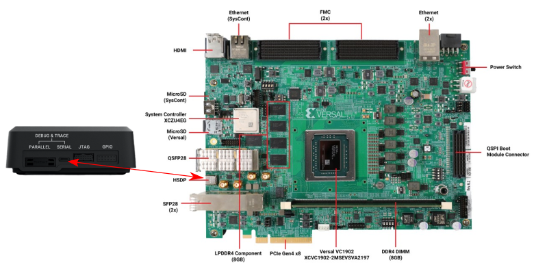
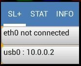
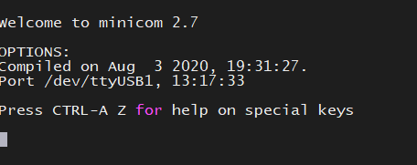
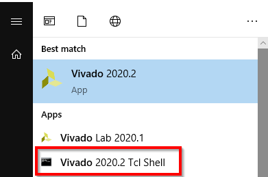
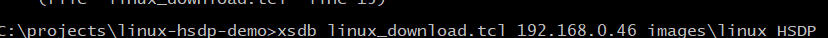
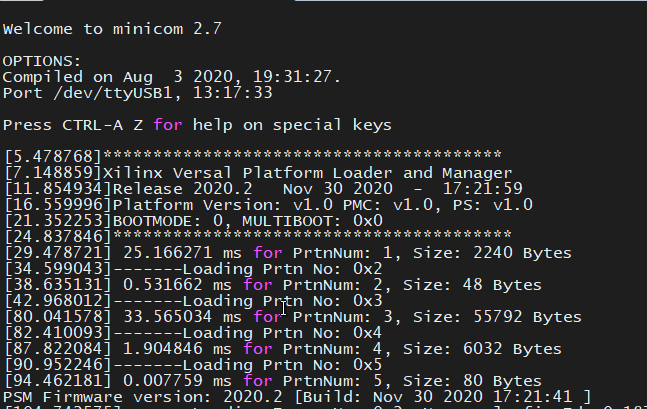
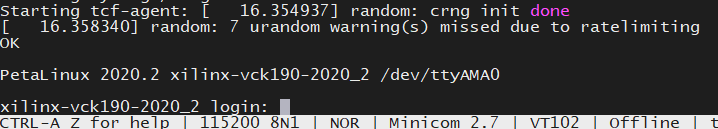

# System Design Example for High-Speed Debug Port with SmartLynq+ Module

## Introduction

This chapter demonstrates how to build a system based on Versal devices that utilizes both the SmartLynq+ module and High-Speed Debug Port (HSDP). It also demonstrates the steps to set up the SmartLynq+ module and download a Linux image using either JTAG or the HSDP.

> **Important:** *This tutorial requires a SmartLynq+ module, a VCK190 or VMK180 evaluation board, and a Linux host machine.*

## Design Example: Enabling the HSDP

This section starts with the VCK190 or VMK180 project that you built in the preceding chapter (or, the pre-built project in the design package `<design-package>/smartlynq_plus/vck190/design_files/vck190_edt_versal_hsdp.xpr.zip`). You will modify the project to include HSDP support.

### Modifying the Design to Enable the HSDP

This design uses the project built in [System Design Example using Scalar Engine and Adaptable Engine](#5-system-design-example.md) and enables the HSDP interface. You can do this using the Vivado IP integrator.

1. Open the Vivado project you created in [Chapter 5: System Design Example using Scalar Engine and Adaptable Engine](#5-system-design-example.md).

    `C:/edt/edt_versal/edt_versal.xpr`

2. In the Flow Navigator, under **IP Integrator**, click **Open Block Design**.

    

3. Double-click the Versal ACAP CIPS IP core and click **Debug → Debug Configuration**.
    

4. Under **High-Speed Debug Port (HSDP)**, select **AURORA** as the **Pathway to/from Debug Packet Controller (DPC)**.

    

5. Set the following options:
   - **GT Selection** to **HSDP1 GT**
   - **GT Refclk Selection** to **REFCLK1**
   - **GT Refclk Freq (MHz)** to **156.25**

   >***Note*:** Line rate will be fixed at **10.0 Gb/s**.

6. Click **OK** to save the changes. Two ports are created on the CIPS IP `gt_refclk1` and `HSDP1_GT`.

7. In the **IP Integrator** canvas, right-click on `gt_refclk1` and select **Make External**. Do the same for **HSDP1\_GT**.

    

    

8. Click **Validate Design**, then **Save**.

### Synthesizing, Implementing, and Generating the Device Image

1. In the Flow Navigator, under **Programming and Debug**, click **Generate Device Image** to launch implementation.
  
  >***Note*:** When the device image generation completes, the device image generation completed dialog box opens.

    

### Exporting Hardware (XSA)

1. From the Vivado tool-bar, select **File → Export → Export Hardware**. The Export Hardware Dialog Box will open.

    

1. Choose **Fixed** and click **Next**.

1. Choose **Include Device Image** and click **Next**.

1. Provide the name for your exported file (example: `edt_versal_wrapper_with_hsdp`). Click **Next**.

1. Click **Finish**.

## Creating the HSDP-enabled Linux Image Using PetaLinux

This example re-builds the PetaLinux project using the HSDP enabled XSA that was built in the preceding step. The assumption is that the PetaLinux project has been created as per the instructions in [System Design Example using Scalar Engine and Adaptable Engine](#5-system-design-example.md).

> **Important:** If you are building this tutorial without having created a PetaLinux project in the preceding chapter, you can follow steps 1 through 12 in the [Example Project: Creating Linux Images Using PetaLinux](./5-system-design-example.md#example-project-creating-Linux-images-using-PetaLinux) section to create a new PetaLinux project.

This example needs a Linux host machine. Refer to the [PetaLinux Tools Documentation Reference Guide (UG1144)](https://www.xilinx.com/member/versal_tools_ea.html#embedded) for information on dependencies and installation procedure for the PetaLinux tool.

1. Change to the PetaLinux project directory that was created in [Example Project: Creating Linux Images Using PetaLinux](./5-system-design-example.md#example-project-creating-Linux-images-using-PetaLinux) using the following command.

    `$ cd led_example`

1. Copy the new hardware platform project XSA to the Linux host machine one directory above the PetaLinux build root.

    >***Note*:** Ensure you are using the updated the XSA file which you generated in the prior step.

1. Reconfigure the BSP using the following commands.

    ```
    petalinux-config --get-hw-description=<path till the directory containing the respective xsa file>
    ```

1. Build the Linux images using the following command.

    ```
    $ PetaLinux-build
    ```

1.  Once the build completes, package the boot images with the following command:

    ```
    $ PetaLinux-package --force --boot --atf --u-boot
    ``` 

    > ***Note*:** The packaged Linux boot images are placed in the `<PetaLinux-project>/images/Linux/` directory in the PetaLinux build root.  Make a note of this directory location as it will be used in the next steps. If you intend to use a different machine than the one that was used to build PetaLinux (for example, a Windows Based PC) to download the Linux boot images using SmartLynq+, the contents of this directory should be transferred to that machine before proceeding to the next steps.
    
## Setting Up the SmartLynq+ Module

Once the Linux images have been built and packaged, they can be loaded onto the VCK190 or VMK180 board using either JTAG or HSDP. This section demonstrates the basic steps required to set up the SmartLynq+ module for connectivity using HSDP.

1. Connect the USB-C cable between the VCK190 USB-C connector and the SmartLynq+ module.

    

1. Connect the SmartLynq+ to either Ethernet or USB.

    * **Using Ethernet:** Connect an Ethernet cable between Ethernet port on the SmartLynq+ and your local area network.
    * **Using USB:** Connect the provided USB cable between the USB port on the SmartLynq+ and your PC.

1. Connect the SmartLynq+'s provided power adapter to the SmartLynq+ and power on the VCK190/VMK180 board.

1. Once the SmartLynq+ finishes booting up an IP address will appear on the screen under either `eth0` or `usb0`.  Make note of this IP address as it will be the IP address used to connect to the SmartLynq+ in both the Ethernet and USB use case.

    

    > ***Note*:** If using Ethernet, the SmartLynq+ will acquire an IP address from a DHCP server found on the network.  If using USB the USB port will have a fixed IP of `10.0.0.2`.

1. Copy the Linux download scripts from the design package `<design-package>/smartlynq_plus/xsdb`.

### Using the SmartLynq+ as a Serial Terminal

The SmartLynq+ can also be used as a serial terminal to remotely view UART output from the VCK190. This feature can be useful when physical access to the remote setup is not available. The SmartLynq+ module has the minicom application pre-installed, which can be used to connect directly to the UART on the VCK190.

1. Using an SSH client such as `PuTTY` on Windows or `ssh` on Unix based systems, connect using SSH to the IP address shown on the SmartLynq+ display.  
    * Username: `xilinx`
    * Password: `xilinx`
    
    For example, if your SmartLynq+ displays IP address `192.168.0.10`, you should issue the following command: `ssh xilinx@192.168.0.10`.

1. By default, the minicom application will use hardware flow control. To successfully connect to the UART on Xilinx boards, hardware flow control should be disabled as it is not used on the VCK190 UART.  This can be done by entering the minicom setup mode by issuing `sudo minicom -s` and disabling the feature or by issuing the following command as root to modify the minicom default configuration:

    ```
    echo "pu rtscts No" | sudo tee -a /etc/minicom/minirc.dfl
    ```

1. Finally, to connect to the VCK190/VMK180 serial terminal output do the following:
    ```
    sudo minicom --device /dev/ttyUSB1
    ```

2. Leave this terminal open and proceed to the next section.

    

### Booting Linux Images over JTAG or HSDP

SmartLynq+ can be used to download Linux images directly to the VCK190/VMK180 without using an SD Card. Linux images can be loaded using JTAG or HSDP.

The design package included with this tutorial contains a script that will download the Linux images created in the prior steps using the SmartLynq+ Module. The script can use either JTAG or HSDP.  

1. On the machine with access to the SmartLynq+ module, open the Vivado tcl shell.

    

1. Change the working directory to the PetaLinux build root if working on the machine used to build PetaLinux, or the location where the `images/Linux` directory was transferred to the local machine in the preceding steps.

1. At the Vivado tcl shell, issue the following to download the images using HSDP:

    ```
    xsdb Linux_download.tcl <smartlynq+ ip> images/Linux HSDP
    ```

    This will first load `BOOT.BIN` using JTAG after which an HSDP link will be auto-negotiated and the rest of the boot images will be loaded using HSDP, offering a substantial speed increase compared to JTAG.

    

    > ***Note*:** It is also possible to download the Linux images using JTAG by changing the scripts last argument to `FTDI-JTAG` `xsdb Linux-download <smartlynq+ ip> images/Linux FTDI-JTAG`. This will use JTAG to program all of the Linux boot images.  Take note of the difference in download speed when using HSDP.

2.  Returning to the terminal opened in the prior section, Versal boot messages can be viewed from the VCK190 UART:
    

3.  Once Linux has completed booting using either JTAG or HSDP, you will be presented with the following login screen:
    

## Useful Links

* For more information on using PL hardware debug cores such as the AXIS-ILA, AXIS-VIO, PCIe Debugger, and/or DDRMC Calibration Interfaces refer to the [UG908: Vivado Design Suite User Guide Programming and Debugging](https://www.xilinx.com/support/documentation/sw_manuals/xilinx2020_2/ug908-vivado-programming-debugging.pdf).
* For more information on the SmartLynq+ Module, refer to [SmartLynq+ Module User Guide]().

## Summary

In this section you have built a design that uses the HSDP, connected the SmartLynq+ module, configured the SmartLynq+ for remote UART access, and used the HSDP to download Linux images onto your board.

 © Copyright 2020 Xilinx, Inc.
