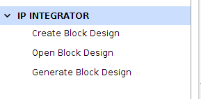
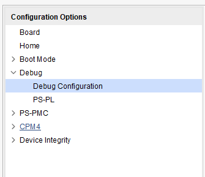
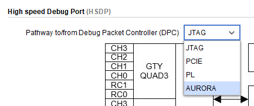
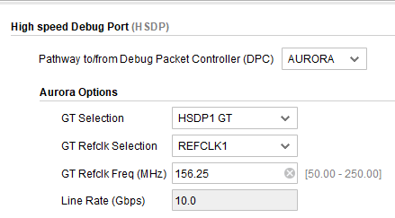
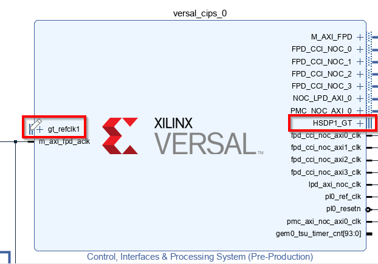
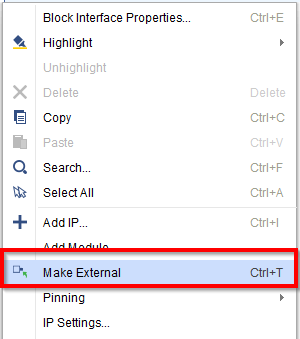
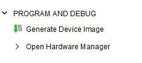
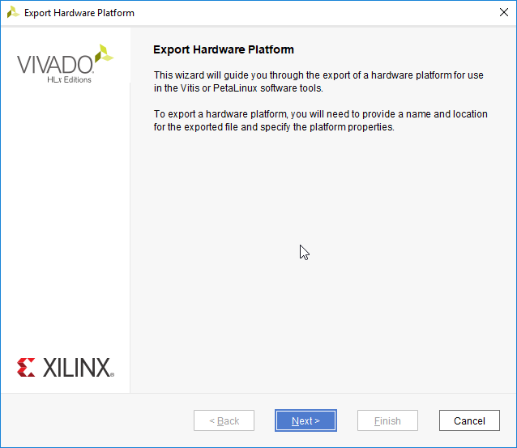

# System Design Example for SmartLynq+ HSDP

## Introduction
This chapter guides you through building a system based on Versal devices that utilizes both the SmartLynq+ Module and High-Speed Debug Port (HSDP).  It also demonstrates the steps to setup the SmartLynq+ Module and download a Linux image using both JTAG and High-Speed Debug Port.  

## Design Example: Enabling High-Speed Debug Port (HSDP)
To use High-Speed Debug Port, the design must be modified to include HSDP support.  

### Enabling HSDP

This design uses the project built in chapter 5 and enables the High-Speed Debug Port (HSDP) interface.  You can do this using the Vivado IP Integrator.  
1. Open the Vivado project you created in [Chapter 5: System Design Example using Scalar Engine and Adaptable Engine](#chapter-5).

    `C:/edt/edt_versal/edt_versal.xpr`

2. In the Flow Navigator, under **IP Integrator**, click **Open Block
     Design**.

    

1. Double-click the Versal ACAP CIPS IP core and click **Debug -> Debug Configuration**.
    

1. Under **High-Speed Debug Port (HSDP)** select **AURORA** as the **Pathway to/from Debug Packet Controller (DPC)**.   

1. Set the following options:
   - **GT Selection** to **HSDP1 GT**
   - **GT Refclk Selection** to **REFCLK1** 
   - **GT Refclk Freq (MHz)** to **156.25**  
   **Note:** _Line rate will be fixed at **10.0 Gbps**._
<!-- 1. When finished the High-Speed Debug Port menu should contain the following settings:
      -->

1. Click **OK** to save the changes.  Two ports will be created on the CIPS IP `gt_refclk1` and `HSDP1_GT`.

1. In the **IP Integrator** canvas, right click on `gt_refclk1` and select **Make External**.  Do the same for **HSDP1\_GT**.
    
    

1. Click **Validate Design**, then **Save**.

### Synthesizing, Implementing, and Generating the Device Image

1. In the Flow Navigator, under **Programming and Debug**, click **Generate Device Image** to launch implementation.
  _Note: when the device image generation completes, the device image generation completed dialog box opens._
    

### Exporting Hardware (XSA)

1.  From the Vivado tool-bar, select **File → Export → Export Hardware**.  The Export Hardware Dialog Box will open.
    

1.  Choose **Fixed** and click **Next**.

1.  Choose **Include Device Image** and click **Next**.

1.  Provide the name for your exported file (example: `edt_versal_wrapper_with_hsdp`).  Click **Next**.

1.  Click **Finish**.

## Creating the HSDP Enabled Linux Image Using Petalinux

This example re-builds the PetaLinux project using the HSDP enabled XSA that was built in the prior step.  The assumption is that the PetaLinux project has been created as per the instructions in [Chapter 5](5-system-design-example.md).  

This example needs a Linux host machine. Refer to the [PetaLinux Tools Documentation Reference Guide (UG1144)](https://www.xilinx.com/member/versal_tools_ea.html#embedded) for information on dependencies and installation procedure for the PetaLinux tool.

1. Change to the PetaLinux project directory that was created in [Chapter 5](5-system-design-example.md#example-project-creating-linux-images-using-petalinux) using the following command.

    `$cd led_example`

1. Copy the new hardware platform project XSA to the Linux host machine.

    >***Note*:** Ensure you are using the updated the XSA file which you generated in the prior step.

1. Build the Linux images using the following command.

    `$ petalinux-build`

1.  Once the build completes, package the boot images with the following command:
    
    `$ petalinux-package --force --boot --atf --u-boot` 

    > **Note:** the packaged linux boot images will be placed in the `images/linux` directory in the PetaLinux build root.  Make note of this directory location as it will be used in the next steps.  If you intend to use a Windows machine to download the Linux boot images using SmartLynq+ the contents of this directory should be transferred to that machine.
    
## Using SmartLynq+ High-Speed Debug Port for Linux Image Download and Boot

Once the Linux images have been built and packaged, they can be loaded onto the VCK190 or VMK180 board using either JTAG or High-Speed Debug Port.  

1.  Connect the USB-C cable between the Board and the SmartLynq+.
1.  Connect the SmartLynq+ using either Ethernet or USB.
    * **Using Ethernet:** Connect an Ethernet cable between Ethernet port on the SmartLynq+ and your local area network.
    * **Using USB:** Connect the provided USB cable between the USB port on the SmartLynq+ and your PC.
1.  Connect the SmartLynq+'s provided power adapter to the SmartLynq+ and power on the VCK190/VMK180 board.
1.  Once the SmartLynq+ finishes booting up an IP address will appear on the screen under either `eth0` or `usb0`.  This will be the IP address used to connect to the SmartLynq+ in both the Ethernet and USB use case.
    * _If using Ethernet the SmartLynq+ will acquire an IP address from a DHCP server found on the network.  If using USB the USB port will have a fixed IP of `10.0.0.2`._ 
1.  Copy the Linux download scripts from the design package `<design-package>/smartlynq_plus/xsdb`.

### Using The SmartLynq+ as a Serial Terminal

The SmartLynq+ can also be used as a serial terminal to remotely view serial terminal output.  This feature can be useful when physical access to the remote setup is not available.

1.  Using an SSH client such as `PuTTY` on Windows or `ssh` on Unix based systems, connect using SSH to the IP address shown on the SmartLynq+ display.  
    * Username: `xilinx`
    * Password: `xilinx`
1.  SmartLynq+ ships with the `minicom` application pre-installed, which can be used to connect to a serial terminal.  To connect to the VCK190/VMK180 serial terminal output do the following:
    * `sudo minicom --device /dev/ttyUSB1`

It is now possible to view the boot loader output as well as access a serial terminal on the VCK190/VMK180.

### Booting Linux Images over JTAG or HSDP

SmartLynq+ can be used to download linux images directly to the VCK190/VMK180 without using an SD Card.  Linux images can be loaded using JTAG or HSDP.

1.  To load the Linux images, do one of the following:
    * **To use HSDP** `xsdb linux_download.tcl <smartlynq+ ip> images/linux HSDP`.  
        * This will first load `BOOT.BIN` using JTAG after which an HSDP link will be auto-negotiated and the rest of the boot images will be loaded using HSDP, offering a substantial speed increase compared to JTAG.
    * **To use JTAG** `xsdb linux-download <smartlynq+ ip> images/linux FTDI-JTAG`.
        * This will use JTAG to program all of the Linux boot images.

