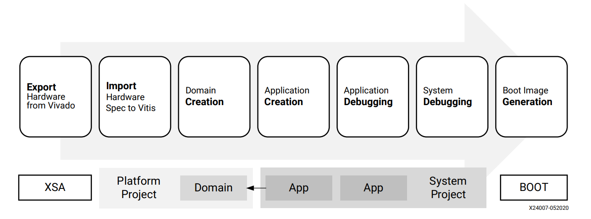

# Vitis Embedded Software Debugging Guide Overview 

This document is targeted at embedded software developers who are using the embedded software development flow in the Vitis™ unified software platform for application development using Xilinx™ FPGA, SoC, and ACAP devices. During the course of software development, effective use of the debug options available with the tool can help speed up product development, reduce time to market, and enable a good experience with the tool flow. The [Debug](https://www.xilinx.com/html_docs/xilinx2021_1/vitis_doc/debugappproj.html) section in the _Vitis Embedded Software Development Flow documentation_ ([UG1400](https://www.xilinx.com/html_docs/xilinx2021_1/vitis_doc)) introduces the Debug options available in the tool.

This is not a user guide or a tutorial; rather, is a practical self-help guide to empower you to choose the right debug options. It should be used in conjunction with the _Vitis Embedded Software Development Flow documentation_ ([UG1400](https://www.xilinx.com/html_docs/xilinx2021_1/vitis_doc)). In this document, various debug scenarios are provided with examples to demonstrate an appropriate selection and usage of the available basic and advanced debug options during bare-metal/Linux application development. 

The Vitis Embedded Software Debugging Guide has been broken into the following main sections:

## [Debugging Bare-Metal Applications](docs/./2-debugging-bare-metal-applications)

This chapter covers the debug options available for bare-metal application development. It provides example applications to recreate common debug scenarios and highlight the usage of the available debug options (for example, debug views in the Vitis GUI, debug configurations, memory dump, and so on). Common errors generated by the tool are listed with guidance about how to manage them.

## [Debugging Linux Applications](/docs/3-debugging-linux-applications)

This chapter covers the debug options available for Linux application development. It provides example applications to recreate common debug scenarios and highlight the usage of the available debug options (for example, debug views in the Vitis GUI, debug configurations, step functions, and so on). Common errors generated by the tool are listed with guidance about how to manage them.

## [Advanced Debug Techniques](/docs/4-advanced-debug-techniques)

This chapter covers advanced debug techniques for tough use cases. Topics such as Xen aware debugging, using a remote host, and attaching an application to System Debugger, as well as debugging on QEMU, GDB, and so on are described in greater detail. A sample application is provided as reference.

## [Summary](/docs/5-summary)

This chapter summarizes the key takeaways from the previous chapters in a table for ease of reference.

# Xilinx Debug Solution Overview

The following figure shows the embedded software development workflow for the Vitis software platform. 

For more details about the workspace structure in the Vitis tool, refer to [this section](https://www.xilinx.com/html_docs/xilinx2021_1/vitis_doc/vitis_embedded_getstarted.html#voe1588842154054) in [UG1400](https://www.xilinx.com/html_docs/xilinx2021_1/vitis_doc). During the course of the workflow, the use of debug is required mostly after the Application Creation stage. The Vitis software platform provides the following debug tools, which are tightly integrated with the Vitis IDE.

## Debuggers

The debugger in the Vitis software platform enables you to see what is happening to a program while it executes. You can set breakpoints or watchpoints to stop the processor, step through program execution, view the program variables, and view the contents of the memory in the system. The debugger supports debugging through Xilinx System Debugger and GNU Debugger (GDB). 

### Xilinx System Debugger 

Xilinx System Debugger is derived from open source tools and is integrated with the Vitis software platform. For the typical XSDB flow, refer to [this section](https://www.xilinx.com/html_docs/xilinx2021_1/vitis_doc/debugappproj.html#hgr1567764336349) in [UG1400](https://www.xilinx.com/html_docs/xilinx2021_1/vitis_doc).

### GDB

GNU Debugger (GDB) is an open source project: https://www.gnu.org/software/gdb/ and supporters debugging of a vast variety of application languages. GDB is integrated with Vitis and can be used for debugging. For the typical GDB flow, refer to [this section](https://www.xilinx.com/html_docs/xilinx2021_1/vitis_doc/debugappproj.html#ariaid-title10) in [UG1400](https://www.xilinx.com/html_docs/xilinx2021_1/vitis_doc).

## Xilinx Software Command-line Tool (XSCT)

XSCT is an interactive and scriptable command-line interface to the Vitis IDE. As with other Xilinx tools, the scripting language for XSCT is based on the tools command language (Tcl). You can run XSCT commands interactively or script the commands for automation. XSCT supports the following actions:

- Creating domains, platform projects, system projects, and application projects
- Managing repositories
- Setting toolchain preferences
- Configuring and building domains/BSPs and applications
- Downloading and running applications on hardware targets
- Creating and flashing boot images by running Bootgen and program_flash tools

For more details, refer to the [XSCT User Guide](https://www.xilinx.com/html_docs/xilinx2021_1/vitis_doc/jed1590410655455.html) which is available as part of [UG1400](https://www.xilinx.com/html_docs/xilinx2021_1/vitis_doc).

_Copyright 2021 Xilinx Inc. Licensed under the Apache License, Version 2.0 (the "License"); you may not use this file except in compliance with the License. You may obtain a copy of the License at http://www.apache.org/licenses/LICENSE-2.0. Unless required by applicable law or agreed to in writing, software distributed under the License is distributed on an "AS IS" BASIS, WITHOUT WARRANTIES OR CONDITIONS OF ANY KIND, either express or implied. See the License for the specific language governing permissions and limitations under the License._
