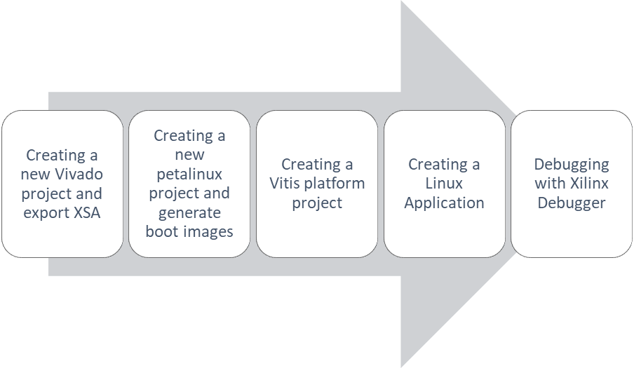
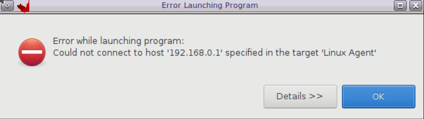
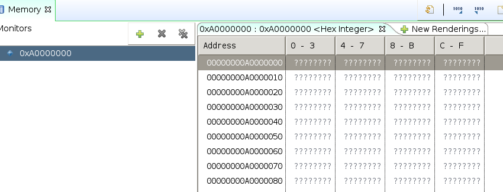
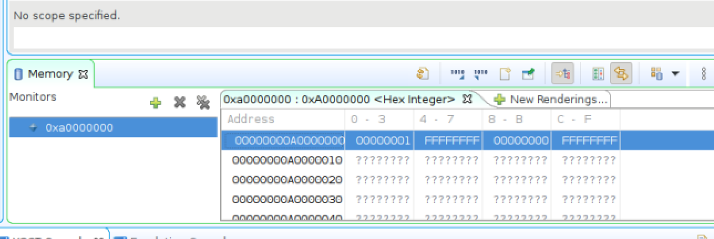
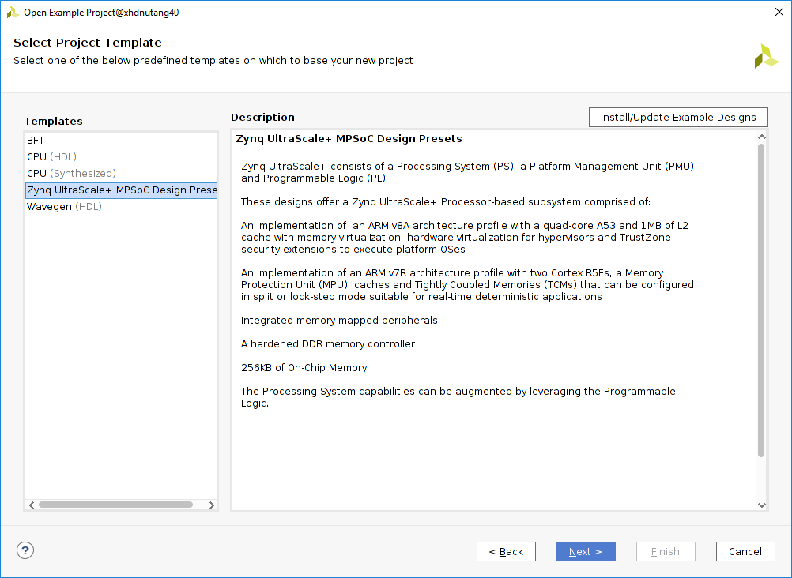
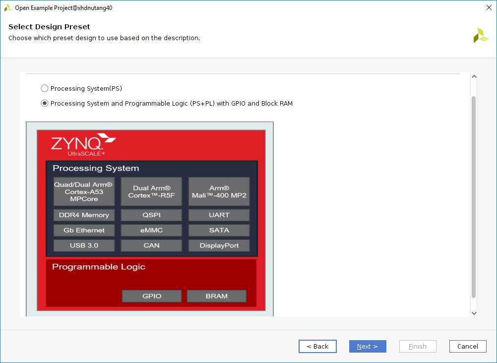
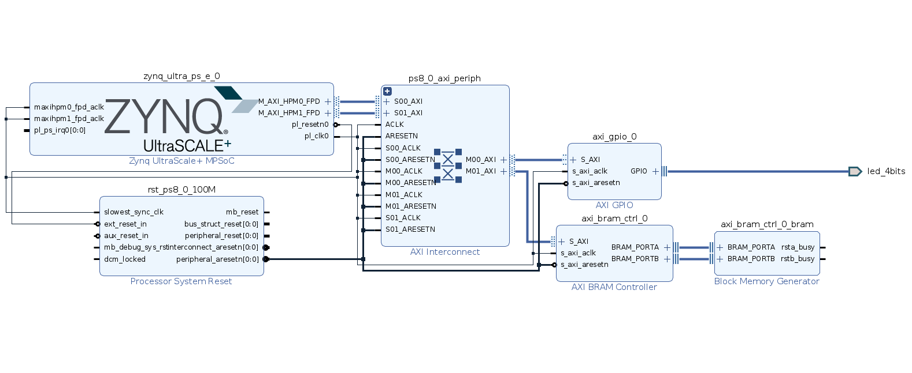
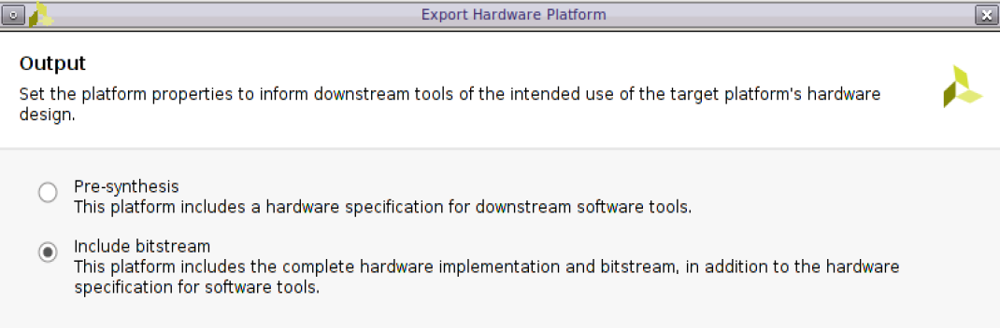

# Debugging Linux Applications

The Vitis IDE provides a familiar environment for debugging Linux applications for a target platform. This section covers the following Linux application debug features:

- Setting breakpoints
- Stepping through program execution
- Viewing program variables, memory contents, and the stack 

The following diagram illustrates the general Linux application debug flow. The Xilinx System Debugger an integrated debugger supporting Zynq®-7000 SoC, Zynq UltraScale+ MPSoC, and MicroBlaze™ and Versal™ processors.




**Note:** Refer to the [Appendix](#appendix) section for supplementary information about creating a hardware design and building software boot images.  

## Getting Started

Linux debug setup is a mandatory step. Setup allows you to create platform and application projects in the Vitis IDE.

1. Open a terminal and navigate to your desired work directory.
2. Download [petalinux_build.sh](https://github.com/Xilinx/Embedded-Design-Tutorials/blob/2022.2/docs/Vitis-Embedded-Software-Debugging/docs/3-debugging-linux-applications/script/petalinux_build.sh) and the [ZCU104 BSP](https://www.xilinx.com/member/forms/download/xef.html?filename=xilinx-zcu104-v2021.1-final.bsp). Copy both files to your desired working directory; for example, `UG1515/petalinux_prj`.
3. Source the PetaLinux tool.
4. Follow the steps in the [PetaLinux Build](#petalinux-build) section to complete the PetaLinux build and configuration manually.
   **Note:** You can skip the manual steps by using the automated `petalinux_build.sh` script to generate Linux images. However, make sure to select the appropriate configuration whenever prompted.

5. Navigate to `xilinx-zcu104-2021.1/hardware/xilinx-zcu104-2021.1/outputs` in your PetaLinux project and copy `project_1.xsa` to your desired Vitis work directory (in the following example, it is `vitis_work_dir`) as `zcu104.xsa`.

    ```
    $ cd xilinx-zcu104-2021.1/hardware/xilinx-zcu104-2021.1/outputs
    $ cp project_1.xsa vitis_work_dir/zcu104.xsa
    ```

    **Note:** If you create a custom ZCU104 XSA by following the steps in [Vivado Design](#vivado-design), you can use it as it is here.

6. Download the [Vitis-workspace.tcl](https://github.com/Xilinx/Embedded-Design-Tutorials/blob/2022.2/docs/Vitis-Embedded-Software-Debugging/docs/3-debugging-linux-applications/script/Vitis-workspace.tcl) script. Copy it to your Vitis work directory (in this example, `vitis_work_dir`) as you did for `zcu104.xsa`. Download the source file [linux_test_application.c](https://github.com/Xilinx/Embedded-Design-Tutorials/blob/2022.2/docs/Vitis-Embedded-Software-Debugging/docs/3-debugging-linux-applications/src/linux_test_application.c) to `vitis_work_dir/src`. These files are required to set up the Vitis workspace. Your Vitis work directory should be structured like the example below after downloading these files.

    ```
    vitis_work_dir
    |
    |_ zcu104.xsa
    |
    |_ vitis-workspace.tcl
    |
    |_ src
      |
      |_ linux_test_application.c

    ```

7. Run the `Vitis-workspace.tcl` script for workspace setup in XSCT. After successful execution of the script, a Vitis worskpace named `linux_debug_ws` will be created witha ZCU104 based platform and a Linux test application.

    ```
    vitis_work_dir
    |
    |_ zcu104.xsa
    |
    |_ vitis-workspace.tcl
    |
    |_ src
    |   |
    |   |_ linux_test_application.c
    |
    |_ linux_debug_ws

    ```

8. Launch the Vitis IDE with **linux_debug_ws**. 

## Error 1: There is no Linux TCF agent running on the specified 192.168.0.1

1. Download [sdk-2020.2.0.0.sh](https://www.xilinx.com/bin/public/openDownload?filename=sdk-2020.2.0.0.sh) and copy it to your working directory.
2. Create a folder named `toolchain_mismatch` within your working directory. In a terminal, run the `sdk-2020.2.0.0.sh` script and install the sysroot inside the `toolchain_mismatch` folder.

    ```
    $ sh sdk-2020.2.0.0.sh
    ```

3. In the Vitis workspace, double-click **linux_test_app_system.sprj** to open it, and set up a sysroot path to `toolchain_mistmatch/sysroots/aarch64-xilinx-linux`.
4. Build the `linux_test_app` application to generate `linux_test_app.elf`.
5. Right-click the **linux_test_app** application project and navigate to **Debug As > Launch on Hardware (Single Application Debug)**.

   

### Setting Up the Ethernet Connection

- Set your host machine's Ethernet address to a static IP (suggested: 192.168.1.10).
- Using the serial terminal, configure the board's IP address to 192.168.1.11:

  ```
  ifconfig eth0 192.168.1.11
  ```
  **Note:** This can be any address other than the one that the host is configured to.

- Ping the host machine using the terminal to verify connectivity.

  ```
  ping 192.168.1.10 –c 1
  ```

### Setting Up the TCF Agent

- In the Vitis IDE, click **Target Connections**. If the Target Connections view is not visible, select **Window > Show View > Other > Xilinx > Target Connections** and click **OK**.
- Go to the **Linux TCF Agent** option and double-click to edit it.
- Change the host IP address to 192.168.1.11. 
- Click **OK**.


## Error 2: (Linux-Agent : Disconnected) : No such file or directory

1. Right-click the `linux_test_app` application project and navigate to **Debug As > Launch on Hardware (Single Application Debug)**.

   

   This error occurs due to a mismatch between the Linux application toolchain and the TCF agent toolchain. Update to the appropriate toolchain to resolve this issue.

2. In the PetaLinux project folder structure, navigate to the `images/linux` folder to find the `sdk.sh` script. Run this shell script to set up a new and appropriate sysroot required for the Linux application.

3. In the Vitis workspace, double-click to open **linux_test_app_system.sprj** and set up a new and correct sysroot path to `images/linux/sysroots/aarch64-xilinx-linux`.

## Error 3: Cannot Read Target Memory, Input/Output Error

Sometimes you might try to watch the value of a pointer variable and find that it leads to a “Cannot read target memory” error. This section explores an error case in which a pointer allocated by `mmap()` can be printed but cannot be read using the debugger.

1. Enable the `_ERROR3_` macro in the application source file `linux_test_application.c` and disable `_ERROR5_` and `_ERROR6_` as shown below.

    ```
    #define _ERROR3_
    //#define _ERROR5_
    //#define _ERROR6_
    ```

2. Build the application project.
3. Right-click the **linux_test_app** application project and navigate to**Debug As > Launch on Hardware (Single Application Debug)**.

   

There is a service called `ptrace()` (process trace) which is used by debuggers. It provides extensive control over the operation of its target. This includes the manipulation of its file descriptors, memory, and registers. It can single-step through the target's code as well as observe and intercept system calls and their results. See [this web page](http://man7.org/linux/man-pages/man2/ptrace.2.html) for more information. GDB and the TCF debugger both use `ptrace()`. However, Linux does not make I/O memory accessible through `ptrace()`. To work around the issue, an application can access the I/O memory and write a function which will read the address.

## Error 4: Memory View Both Physical Address and Virtual Address Return ????????

In the current debug session, navigate to **Memory** view and try to access 0xA0000000. It returns ????????, as shown below.



This behavior might be observed many times: the memory returned by `mmap()*` for either `/dev/mem` or `/dev/uioX` cannot be viewed in the Memory, Variables, or Expressions views. Vitis is unable to access it either by physical or vitural address. The _memory_ when accessed in Memory view shows all values as **????????**. 

To workaround this issue, we will add a memory region **0xA0000000-0xA000000F** to the target's memory map. We will use XSCT command _memmap_ for this modification. Open the XSCT console and work through the following steps to fix this issue.

```
xsct% connect
xsct% ta
  1  PS TAP
     2  PMU
     3  PL
  4  PSU
     5  RPU (Reset)
        6  Cortex-R5 #0 (RPU Reset)
        7  Cortex-R5 #1 (RPU Reset)
     8 APU
        9  Cortex-A53 #0 (Reset Catch, EL3(S)/A64)
       10  Cortex-A53 #1 (Reset Catch, EL3(S)/A64)
       11  Cortex-A53 #2 (Reset Catch, EL3(S)/A64)
       12  Cortex-A53 #3 (Reset Catch, EL3(S)/A64)

xsct% ta 4
xsct% memmap -addr 0xa0000000 -size 0x10

```




## Error 5: Multithread Application Debug

Enable the `_ERROR5_` macro in the application source file `linux_test_application.c` and disable `_ERROR3_` and `_ERROR6_` as shown below.

```
//#define _ERROR3_
#define _ERROR5_
//#define _ERROR6_
```

The goal of multithread application debugging is to make the application thread-safe. You need to debug the application and identify the locations to protect read/write operations.

1. Right-click the **linux_test_app** application project and navigate to **Debug As > Launch on Hardware (Single Application Debug)**. 
2. The code will stop at the program entry. There are various debugging techniques such as breakpoints, stepping, and so on to identify the data that needs to be protected. This example will use the breakpoint inside thread function.
3. Put a breakpoint at below two lines.

    ```
    printf("\n Job %d started\n", counter);
    .......
    .......
    printf("\n Job %d finished\n", counter);
    ```
5. Click **Resume** and check the Job ID printed in the console. Here, the job to be done is not thread-safe.
6. Open the **Variables** view to track the counter variable value.

   


7. Use a synchronization mechanism (mutex, for example) to ensure that two or more concurrent threads do not simultaneously execute read/writes.

8. Uncomment the mutex code lines listed below from the application to make it thread-safe.

    ```
    ............................
    ............................

    #ifdef _ERROR5_
    void* doSomeThing(void *arg)
    {
      //  pthread_mutex_lock(&lock);
      .................
      .................
      // pthread_mutex_unlock(&lock);
      .................
    }
    #endif
    ............................
    ............................
    #ifdef _ERROR5_
    /* if (pthread_mutex_init(&lock, NULL) != 0)
        {
            printf("\n mutex init failed\n");
            return 1;
        }
    */
    ...............
    ...............
    ...............
    //    pthread_mutex_destroy(&lock);
    ```
9. Rebuild the application.
10. Right-click the **linux_test_app** application project and navigate to **Debug As > Launch on Hardware (Single Application Debug)**. 
11. Observe the output.


## Error 6 : Dynamic Memory Allocation

Enable the `_ERROR6_` macro in the application source file `linux_test_application.c` and disable `_ERROR3_` and `_ERROR5_` as shown below.

```
//#define _ERROR3_
//#define _ERROR5_
#define _ERROR6_
```
The goal of dynamic memory allocation debugging is to understand memory management.

1. Right-click the **linux_test_app** application project and navigate to **Debug As > Launch on Hardware (Single Application Debug)**. 
2. The code will stop at the program entry.
3. Use debugging techniques such as the Variables view, step over, breakpoints, and so on to identify the incorrect memory assignment.
4. Place a breakpoint at the following lines.

    ```
    *ptr = i + 1;
    ptr++;
    ```         
5. Click **Resume** and let the tool stop at the breakpoint.
6. Open **Variables** view to check the **ptr** value. Observe that a value is not correctly assigned to a pointer.

    
 

8. Comment out the following code lines:

    ```
    #ifdef _ERROR6_
    ................
    ................
    ................
    //ptr = i + 1;
    //ptr++;
    ................
    ```

9. Uncomment the following line of code to make the appropriate pointer assignment.

    ```
    #ifdef _ERROR6_
    ................
    ................
    ................
    ................
    ptr[i] = i + 1;
    ................
    ```

10. Rebuild the application.
11. Right-click the **linux_test_app** application project and navigate to **Debug As > Launch on Hardware (Single Application Debug)**. 
12. Observe the output.

## Appendix

[Vivado Design](#Vivado-Design) explains how to use a Vivado example design to create a Vivado project. This set of steps gives you the XSA file from Vivado to export. You can skip the manual steps and use this Tcl script to create an XSA directly.

[PetaLinux Build](#petalinux-build) explains how to create a PetaLinux project, and how to configure and build boot images. 

### Vivado Design

**Note**: You can skip these steps by running the [automation steps](#automation-steps) instead. 

#### Creating the Block Design

The first step is to create a block design. You can create this according to your specific requirements, but here you will create a Zynq UltraScale+ MPSoC based example project using a template, as explained below.

1. On the Welcome screen, navigate to **Quick Start** and click **Open Example Project**.

   

2. The Create Example Project wizard will be launched. Click **Next**.

3. In the Select Project Template window, click **Install/Update Example Designs** to install templates.

   

4. A new window will pop up with a list of preset designs. Right-click **Zynq Ultrascale+ MPSoC Design Presets**, and then click **Install...**.

    

5. After successful installation, click **Close**. 

6. You will now be able to see the **Zynq Ultrascale+ MPSoC Design Presets** template. Select the template and click **Next**.

   

7. Update the Project Name to "zcu104" and update the path.

8. In the next window, select **Zynq UltraScale+ MPSoC ZCU104 Evaluation Board** and click **Next**. Here, you can see two preset designs. Select the second option, **Processing System and Programmable Logic (PS+PL) with GPIO and Block RAM**, and click **Finish**.

   

  The block design you have created for the example project is shown in the following figure.

  

#### Generating the Bitstream

The preset example creates an HDL wrapper and also generates output products. You can directly perform synthesis and implementation, and you can generate a bitstream. To generate a bitstream, click **Generate Bitstream**. 

#### Exporting the XSA

After successful bitsream generation, navigate to **File > Export > Export Hardware** to launch the Export Hardware Platform wizard. 
Click **Next** and export the hardware with the **Include bitstream** option. Enter the desired XSA name and complete the wizard.




#### Automation Steps

Launch the Vivado Tcl console. Source `vivado_design.tcl`. 

### PetaLinux Build

It is required to configure the PetaLinux project to support Linux application debug. Run the following commands for each step listed below.  

1. Create the PetaLinux project:

    ```
    petalinux-create -t project -s {$PWD}/xilinx-zcu104-v2021.1-final.bsp
    ```

2. Configure the hardware description (optional):

    ```
    petalinux-config --get-hw-description <path to XSA>
    ```

3. Configure the root file system to enable TCF agent:

    ```
    petalinux-config -c rootfs
    ```

    - Select `Filesystem Packages`: 

        ```
        Filesystem Packages ---> 
        ```

    - Scroll down to select `misc`.

        ```
        misc --->
        ```

    - Scroll down to select `tcf-agent`. Ensure that the `tcf-agent` is enabled.

        ```
        [*] tcf-agent 
        [ ] tcf-agent-dev 
        [ ] tcf-agent-dbg
        ```

4. Go back to the `Filesystem Packages` menu and click **console**.

    ```
    console --->
    ```

5. Navigate to `network`.

    ```
    network --->
    ```

6. Click into the `dropbear` submenu and make sure that `dropbear` is enabled:

    ```
    [*] dropbear
    ```

7. Go back to the previous menu to select OpenSSH and ensure that `openssh-sftp-server` is enabled.

    ```
    [ ] openssh 
    [ ] openssh-ssh 
    [ ] openssh-sftp 
    [*] openssh-sftp-server 
    [ ] openssh-keygen 
    [ ] openssh-dbg 
    [ ] openssh-dev 
    [ ] openssh-misc 
    [ ] openssh-sshd 
    [ ] openssh-scp
    ```

8. Save the configuration and exit. 

9. Build: 

    ```
    petalinux-build
    ```

10. Sysroot:

    ```
    petalinux-build --sdk
    ```

**Note:** You can skip all the above steps by using the `petalinux_build.sh` script to build the Linux images. 


_Copyright 2021 Xilinx Inc. Licensed under the Apache License, Version 2.0 (the "License"); you may not use this file except in compliance with the License. You may obtain a copy of the License at http://www.apache.org/licenses/LICENSE-2.0. Unless required by applicable law or agreed to in writing, software distributed under the License is distributed on an "AS IS" BASIS, WITHOUT WARRANTIES OR CONDITIONS OF ANY KIND, either express or implied. See the License for the specific language governing permissions and limitations under the License._
