

            Read this page in other languages:<a href="../docs-jp/4-build-sw-for-ps-subsystems.md">日本語</a>    <table style="width:100%"><table style="width:100%">
  <tr>

<th width="100%" colspan="6"><h1>Zync UltraScale+ MPSoC Embedded Design Tutorial 2020.2 (UG1209)</h1>
</th>

  </tr>
  <tr>
    <td width="17%" align="center"><a href="../README.md">1. Introduction</a></td>
    <td width="16%" align="center"><a href="2-getting-started.md">2. Getting Started</a></td>
    <td width="17%" align="center"><a href="3-system-configuration.md">3. Zynq UltraScale+ MPSoC System Configuration</a></td>
    <td width="17%" align="center">4. Build Software for PS Subsystems</td>
</tr>
<tr>
    <td width="17%" align="center"><a href="5-debugging-with-vitis-debugger.md">5. Building Linux Applications for PS</a></td>
    <td width="16%" align="center"><a href="6-boot-and-configuration.md">6. Debugging Standalone Applications</a></td>
    <td width="17%" align="center"><a href="7-system-design-examples.md">7. Debugging Linux Applications</a></td>
    <td width="17%" align="center"><a href="6-boot-and-configuration.md">8. Boot and Configuration</a></td>    
  </tr>
</table>

- [Build Standalone Software for PS Subsystems](#build-standalone-software-for-ps-subsystems)
  - [Creating a Platform Using Vitis IDE](#creating-a-platform-using-vitis-ide)
  - [Example Project 1: Running the "Hello World" Application from Arm Cortex-A53](#example-project-1-running-the-hello-world-application-from-arm-cortex-a53)
    - [Board Setup](#board-setup)
    - [Connect Serial Port](#connect-serial-port)
    - [Create Hello World Application on ARM Cortex-A53](#create-hello-world-application-on-arm-cortex-a53)
    - [Run Hello World on the Board](#run-hello-world-on-the-board)
      - [What Just Happened?](#what-just-happened)
      - [One Step Further](#one-step-further)
  - [Additional Information](#additional-information)
    - [Domain](#domain)
      - [Board Support Package](#board-support-package)
      - [Standalone BSP](#standalone-bsp)
  - [Example Project 2: Create a Bare-Metal System Application Project in the Vitis IDE](#example-project-2-create-a-bare-metal-system-application-project-in-the-vitis-ide)
    - [Create Custom Bare-Metal Application for Arm Cortex-A53 based APU](#create-custom-bare-metal-application-for-arm-cortex-a53-based-apu)
    - [Modify the Application Source Code](#modify-the-application-source-code)
    - [Create Custom Bare-Metal Application for Arm Cortex-R5 based RPU](#create-custom-bare-metal-application-for-arm-cortex-r5-based-rpu)
      - [Creating the Application Project](#creating-the-application-project)
      - [Modifying the Linker Script](#modifying-the-linker-script)
      - [Modifying the Board Support Package](#modifying-the-board-support-package)
  - [Reviewing Software Projects in the Platform](#reviewing-software-projects-in-the-platform)
    - [Reviewing FSBL in Platform](#reviewing-fsbl-in-platform)
    - [Reviewing PMU Firmware in Platform](#reviewing-pmu-firmware-in-platform)

# Build Standalone Software for PS Subsystems

This chapter lists the steps to configure and build software for PS
subsystems. 

In previous chapter, [Zynq UltraScale+ MPSoC Processing System
Configuration](3-system-configuration.md), you created and exported the hardware
design from Vivado. The exported XSA file contains the hardware
handoff, the processing system initialization (psu_init),
and the PL bitstream. In this chapter, you will import the XSA to the Vitis™ IDE 
and PetaLinux to configure software for the processing system.

You will use the Vitis IDE to perform the following tasks:

1. Create a Platform project for the hardware XSA. First Stage Boot Loader (FSBL) and PMU firmware for PMU (platform management unit) will be created as boot components in this platform project.

2. Create bare-metal applications for APU and RPU.

3. Create a Linux application.

## Creating a Platform Using Vitis IDE

The main processing units in the processing system in Zynq UltraScale+
are listed below.

- **Application Processing Unit:** Quad-core Arm® Cortex™-A53 MPCore Processors.
- **Real Time Processing Unit:** Dual-core Arm Cortex™-R5F MPCore Processors.
- **Graphics Processing Unit:** Arm Mali™ 400 MP2 GPU
- **Platform Management Unit (PMU):** Xilinx MicroBlaze based platform management unit.

The platform project reads in hardware info from XSA file and contains the runtime environment for the above processing units. Application software can link against the libraries generated in the platform project. 

Here are the steps of creating a platform project.

1. Launch the Vitis IDE 

   - From the open Vivado IDE, click Tools -> Launch Vitis IDE; or
   - Click the Windows start menu -> Xilinx Design Tools -> Xilinx Vitis 2020.2; or
   - Double-click the `C:\Xilinx\Vitis\2020.2\bin\vitis.bat` file.

2. Select the workspace `C\edt\edt_zcu102_workspace` and continue.

   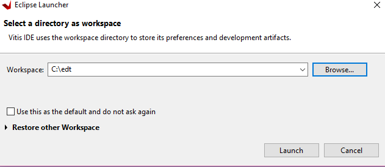

   >Note: If the directory doesn't exist, Vitis will create it.

3. In the Vitis IDE, go to **File → New → Platform Project**.

4. In the Create New Platform page, enter the platform name `zcu102_edt` and click **Next**.

5. In the Platform view, go with the default tab **Create from hardware specification (XSA)**. 

   > Note: **Select a platform from repository** tab can be used when you have a pre-built platform and you'd like to copy it to local to modify it.

6. Click **Browse...** to select the XSA file exported from previous chapter.

7. Select the preferred operating system, processor, and architecture.

| Wizard Screen                   | Property        |
|---------------------------------|-----------------|
| Operating System                | Standalone      |
| Processor                       | psu_cortexa53_0 |
| Architecture                    | 64-bit          |
| Generate Boot Components        | Keep it checked |
| Target processor to create FSBL | psu_cortexa53_0 |

    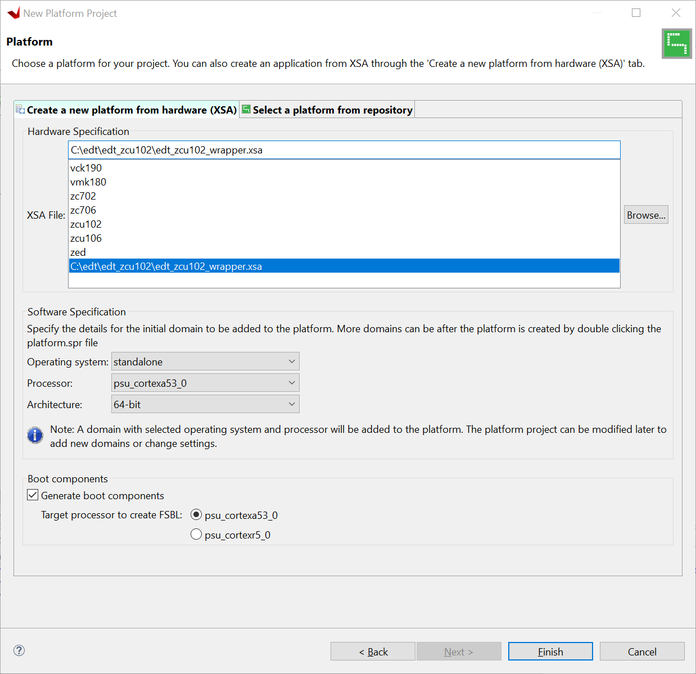

8.  Click **Finish**.

9.  In a few minutes, the Vitis IDE generates the platform. The files
     that are generated are displayed in the explorer window as shown
     in the following figure.

    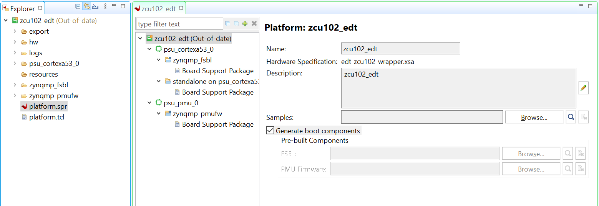

10. Default FSBL and PMU firmware comes with the platform project and
     psu_cortexa53_0 domain also added to the platform. We can add
     multiple domains to platform and we can also create FSBL like any
     other application.

<!-- TODO: remove these libraries because they are not used in the following tutorial. -->
11. **Optional**: To add the following libraries by modifying the standalone
     on psu_cortexa53_0 domain, follow these steps:

    a.  Double-click the **standalone on psu_cortexa53_0** BSP.

    b.  Click **Modify BSP Settings**.

    c.  On the Overview page, select the xilffs, xilpm, xilsecure libraries.

12. Now build the hardware by right-clicking the platform, then
     selecting **Build Project**.

    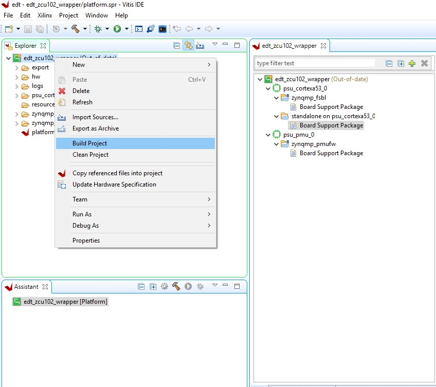

    The platform project is ready. You can create applications using this
    platform and test on zcu102 hardware.

    > Note: The project build process will build the standlaone BSP, FSBL and PMUFW. FSBL and PMUFW has their own BSP. The build process will take some time.

## Example Project 1: Running the "Hello World" Application from Arm Cortex-A53

 In this example, you will learn how to manage the board settings, make
 cable connections, connect to the board through your PC, and run a
 simple hello world software application from Arm Cortex-A53 in JTAG
 mode using System Debugger in the Vitis IDE.

### Board Setup

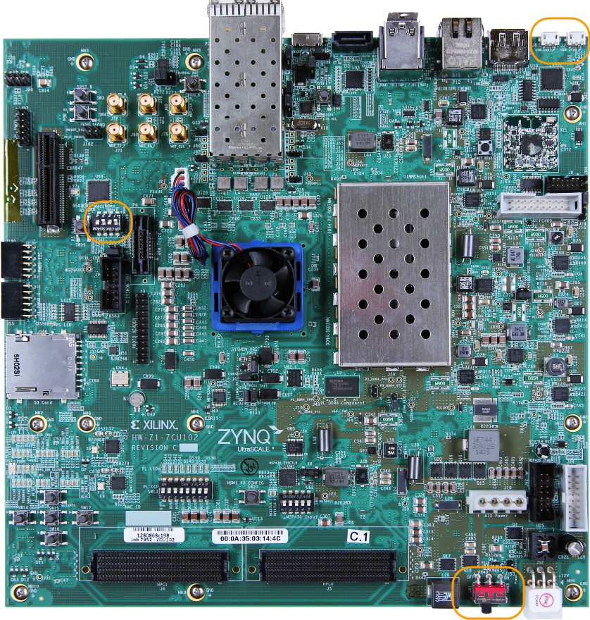

1. Connect the power cable to the board.

2. Connect a USB micro cable between the Windows host machine and J2 **USB JTAG** connector on the target board.

3. Connect a USB micro cable to connector J83 on the target board with the Windows host machine.
     This is used for **USB to serial transfer**.

4. Ensure that SW6 Switch, on the bottom right, is set to **JTAG boot mode** as shown in the following figure.

   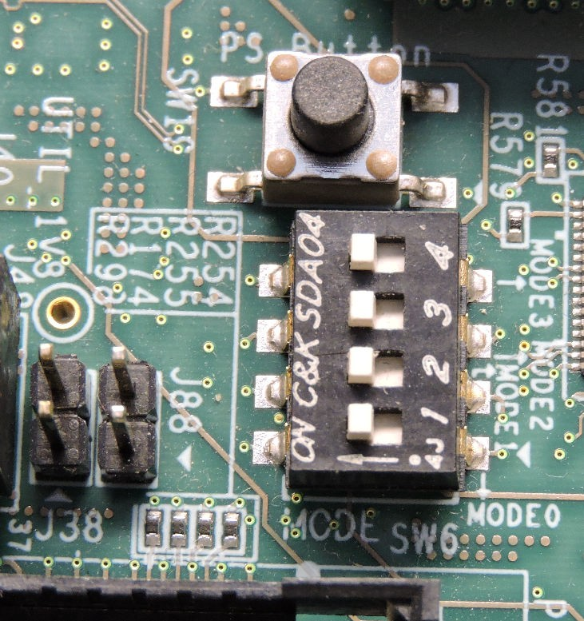

5. Power on the ZCU102 board.

### Connect Serial Port

1. Open your preferred serial communication utility for the COM port.
     
   **Note**: It can be any serial communication utilities in your system. The Vitis IDE provides a serial terminal utility. We will use it throughout the tutorial; 
   select **Window→ Show View → Vitis Serial Terminal** in Vitis IDE to open it.

   **Note**: On Linux, you'll need root previliage to use UART.

2.  Click the **+** button to set the serial configuration.

    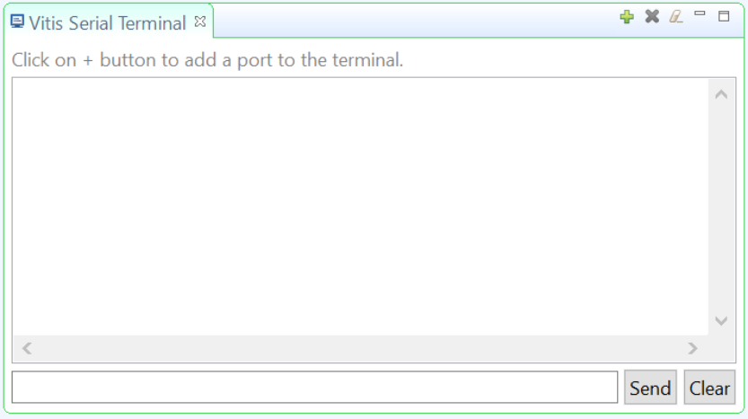

3. To find out the correct COM port, on Windows, verify the port details in the **Device Manager**. On Linux, check the COM port in `/dev`

    MPSoC UART-0 corresponds to COM port with Interface-0. Windows Device Manager provides a mapping between Interface-x to COM-x.

    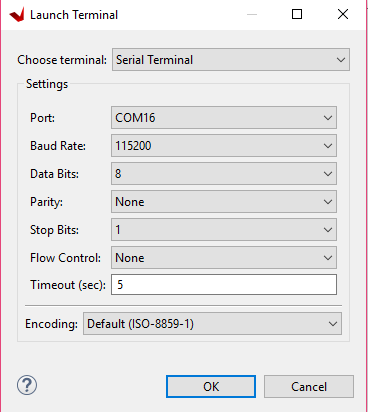

    The the above example, please use COM5 for Interface-0 and Baud rate 115200.

4. Click the drop down menu of **Port**, select the port number for Interface-0 (COM5 in this example).

   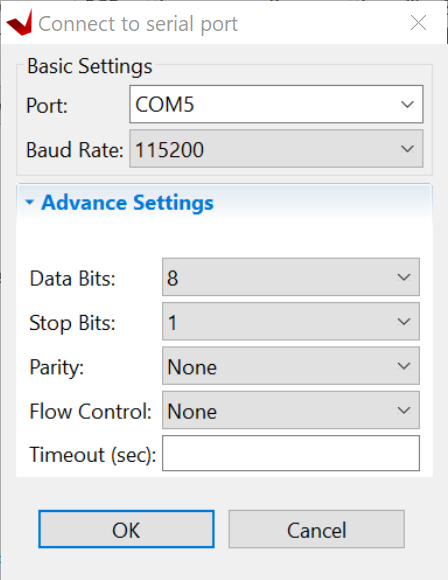

5. Keep other settings and click OK to connect.

6. It will show connect status in the Vitis Serial Terminal window

   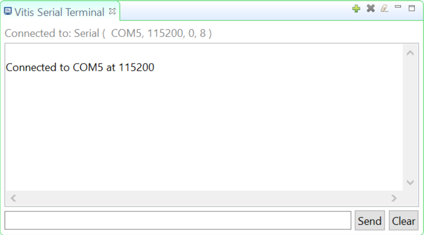

### Create Hello World Application on ARM Cortex-A53

To send the "Hello World" string to the UART0 peripheral, follow these steps:

1. Select **File→ New → Application Project**. The Create new
     application project wizard welcome screen opens.

2. Click **Next**.

3. Use the information in the table below to make your selections in
     the wizard screens.

    *Table 3*: **New Application Project Settings for Standalone APU Application**

     | Wizard Screen               | System Properties               | Settings                      |
     |-----------------------------|---------------------------------|-------------------------------|
     | Platform                    | Select platform from repository | zcu102_edt            |
     | Application project details | Application project name        | hello_a53                      |
     |                             | System project name             | hello_system               |
     |                             | Target processor                | psu_cortexa53_0               |
     | Domain                      | Domain                          | standalone on psu_cortexa53_0 |
     | Templates                   | Available templates             | Hello World                   |

    The Vitis IDE creates the **hello_a53_system** project in the Explorer view. **hello_a53** sits inside **hello_a53_system**.

### Run Hello World on the Board
    
1. Right-click the **hello_a53 application project** and select **Build** to build the application.

2. Right-click **hello_a53** and select **Run as → Run Configurations**.

3. Right-click **Xilinx Application Debugger** and click **New Configuration**.

    The Vitis IDE creates the new run configuration, named
    Debugger_hello_a53-Default.

    The configurations associated with the application are pre-populated
    in the Main page of the launch configurations.

4.  Click the **Target Setup** page and review the settings.

    >***Note*:** The board should be in JTAG boot mode before power cycling.

5. Power cycle the board.

6. Click **Run**.

    Hello World appears on the serial communication utility in Terminal 1,
    as shown in the following figure.

    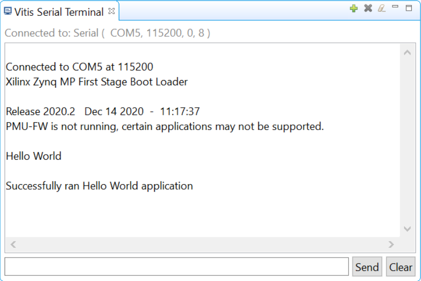

    >***Note*:** There was no bitstream download required for the above
    software application to be executed on the Zynq UltraScale+ evaluation
    board. The Arm Cortex-A53 quad-core is already present in the
    processing system. Basic initialization of this system to run a simple
    application is done by the device initialization Tcl script.

7. Power cycle the board and retain same connections and board settings
     for the next section.

#### What Just Happened?

 The application software sent the "Hello World" string to the UART0
 peripheral of the PS section.

 From UART0, the "Hello world" string goes byte-by-byte to the serial
 terminal application running on the host machine, which displays it as
 a string.

#### One Step Further

Could you create a "Hello World" application for Arm Cortex-R5F and launch it though JTAG?

**Hints**:

1. In the New Project Wizard, you need to select proper target processor.

## Additional Information

Here's some explantion of the terms we used above.

### Domain

A domain can refer to the settings and files of a standalone BSP, a
Linux OS, a third-party OS/BSP like FreeRTOS, or a component like the
device tree generator.

You can create multiple applications to run on the domain. 
A domain is tied to a single processor or a cluster of isomorphic processors (for example: A53_0 or A53) in the platform.

#### Board Support Package

 The board support package (BSP) is the support code for a given
 hardware platform or board that helps in basic initialization at power
 up and helps software applications to be run on top of it. It can be
 specific to some operating systems with boot loader and device
 drivers.

 >**TIP:** *To reset the BSP source, double-click **platform.prj**,
 select a BSP in a domain, and click **Reset BSP Source**. This action
 only resets the source files while settings are not touched. To change the target domain after an
 application project creation, double-click the **project.prj** file in
 Explorer view. In the Application Project Settings, select
 **Domain→Domain change option →Drop-down Domain**, then select
 available domains for this application.

#### Standalone BSP

 Standalone is a simple, low-level software layer. It provides access
 to basic processor features such as caches, interrupts, and
 exceptions, as well as the basic processor features of a hosted
 environment. These basic features include standard input/output,
 profiling, abort, and exit. It is a single threaded semi-hosted
 environment.

## Example Project 2: Create a Bare-Metal System Application Project in the Vitis IDE

In this example, we will do apply some custimizations to the hello world applications we created for Arm Cortex-A53, import a prepared source code for Arm Cortex-R5, adjust linkscript, and combine them in a system project.

### Create Custom Bare-Metal Application for Arm Cortex-A53 based APU

Now that the FSBL is created, you will now create a simple bare-metal
application targeted for an Arm A53 Core 0.

For this example, you will use the hello_a53 application that you
created in [Example Project: Running the "Hello World" Application from Arm Cortex-A53](#example-project-running-the-hello-world-application-from-arm-cortex-a53).

In hello_a53, you selected a simple Hello World application. This
application can be loaded on APU by FSBL running on either APU or RPU.
The Vitis IDE also provides a few other bare-metal application
templates to make it easy to start running applications on Zynq
UltraScale+ devices. Alternatively, you can also select the Empty
Application template and copy or create your custom application source
code in the application folder structure.

### Modify the Application Source Code

1. In the Explorer view, click **hello_a53 → src → helloworld.c**.

    This opens the helloworld.c source file for the hello_a53 application.

2. Modify the arguments in the print command, as shown below.

    `Print(\"Hello World from APU\\n\\r\");`

    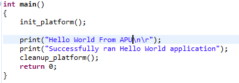

3. Type **Ctrl + S** to save the changes.

4. Right-click the **test_a 53** project and select **Build Project**.

5. Verify that the application is
     compiled and linked successfully and the hello_a53.elf file is
     generated in the **hello_a53 → Debug folder**.
     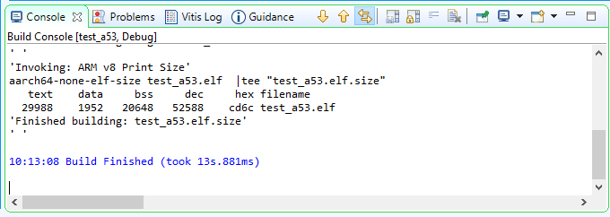

### Create Custom Bare-Metal Application for Arm Cortex-R5 based RPU

 In this example, you will create a bare-metal application project for
 Arm Cortex-R5F based RPU. For this project, you will need to import
 the application source files available in the Design Files ZIP file
 released with this tutorial. For information about locating these
 design files, refer to [Design Files for This
 Tutorial](2-getting-started.md#design-files-for-this-tutorial).

#### Creating the Application Project

1. In the Vitis IDE, select **File→ New → Application Project** to open
     the New Project wizard.

2. Use the information in the following table to make your selections
     in the wizard.

    *Table 6:* **Settings to Create New RPU Application Project**

| Wizard Screen               | System Properties               | Settings           |
|-----------------------------|---------------------------------|--------------------|
| Platform                    | Select platform from repository | edt_zcu102_wrapper |
| Application project details | Application project name        | testapp_r5         |
|                             | System project name             | testapp_r5_system  |
|                             | Target processor                | psu_cortexr5_0     |
| Domain                      | Domain                          | psu_cortexr5_0     |
| Templates                   | Available templates             | Empty application  |

3. Click **Finish**.

    The New Project wizard closes and the Vitis IDE creates the testapp_r5
    application project, which can be found in the Explorer view.

4. In the Explorer view, expand the **testapp_r5 project**.

5. Right-click the **src directory**, and select **Import** to open the
     Import view.

6. Expand **General** in the Import view and select **File System**.

7. Click **Next**.

8. Select **Browse** and navigate to the design files folder, which you
     saved earlier (see [Design Files for This Tutorial](2-getting-started.md#design-files-for-this-tutorial)).

9. Click **OK**.

10. Select the **testapp.c file**.

11. Click **Finish**.

12. Open **testapp.c** to review the source code for this application.
     The application configures the UART interrupt and sets the
     processor to WFI mode.

#### Modifying the Linker Script

1. In the Explorer view, expand the **testapp_r5 project**.

2. In the src directory, double-click **lscript.ld** to open the linker
     script for this project.

3. In the linker script, in Available Memory Regions, modify following
     attributes for psu_r5_ddr_0\_MEM_0:

    - Base Address: 0x70000000

    - Size: 0x10000000

    The linker script modification is shown in following figure. The
    following figure is for representation only. Actual memory regions may
    vary in case of Isolation settings.

    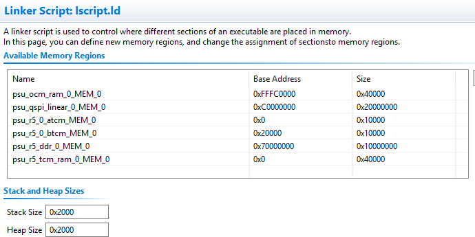

    This modification in the linker script ensures that the RPU bare-metal
    application resides above 0x70000000 base address in the DDR, and
    occupies no more than 256 MB of size.

4. Type **Ctrl + S** to save the changes.

5. Right-click the **testapp_r5** project and select **Build Project**.

6. Verify that the application is compiled and linked successfully and
     that the `testapp_r5.elf` file was generated in the testapp_r5/Debug folder.

#### Modifying the Board Support Package

 The ZCU102 Evaluation kit has a USB-TO-QUAD-UART Bridge IC from
 Silicon Labs (CP2108). This enables you to select a different UART
 port for applications running on Cortex-A53 and Cortex-R5F cores. For
 this example, let Cortex-A53 use the UART 0 by default, and send and
 receive RPU serial data over UART 1. This requires a small
 modification in the r5_bsp file.

1. Navigate to psu_cortexr5_0 domain BSP settings. In the Board Support
     Package Settings page, expand Overview and click **Standalone**.

2. Modify the stdin and stdout values to psu_uart_1, as shown in the
     figure below.

    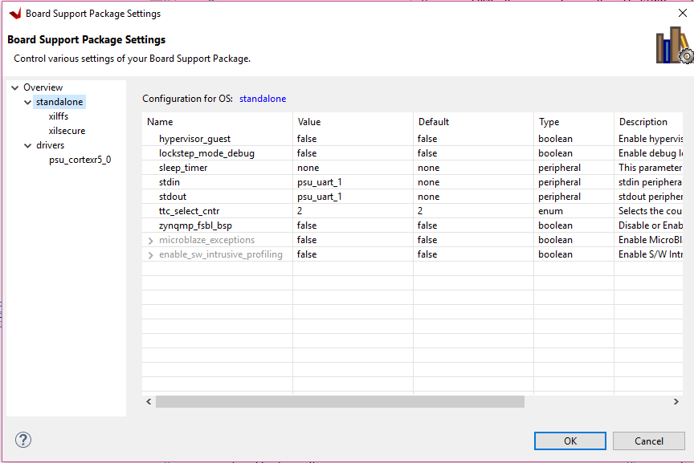

3. Click **OK**.

4. Build the psu_cortexr5_0 domain and the testapp_r5 application.

5. Verify that the application is compiled and linked successfully and
     that the `testapp_r5.elf` was generated in the `testapp_r5/Debug` folder.

## Reviewing Software Projects in the Platform

### Reviewing FSBL in Platform

To review the FSBL in platform, follow these steps:

1. In the Explorer view, navigate to zynqmp_fsbl by expanding the
     edt_zcu102_wrapper platform (right pane) to see the FSBL source
     code for Zynq-7000 devices. You can edit this source for
     customizations.

2. The platform generated FSBL is involved in PS initialization while
     launching standalone applications using JTAG.

3. This FSBL is created for the psu_cortexa53_0, but you can also
     re-target the FSBL to psu_cortexr5_0 using the re-target to
     psu_cortexr5_0 option in the zynqmp_fsbl domain settings.

### Reviewing PMU Firmware in Platform

To review the PMU firmware in the platform, follow these steps:

1. Click the desired platform drop-down menu to view the zynqmp_pmufw
     software project that was created within the platform by default.

2. The zynqmp_pmufw software project contains the source code of PMU
     firmware for psu_pmu_0. Compile and run the firmware on psu_pmu_0.

    The psu_pmu_0 processor domain is created automatically for the
    zynqmp_pmufw software project.

© Copyright 2017-2020 Xilinx, Inc.
