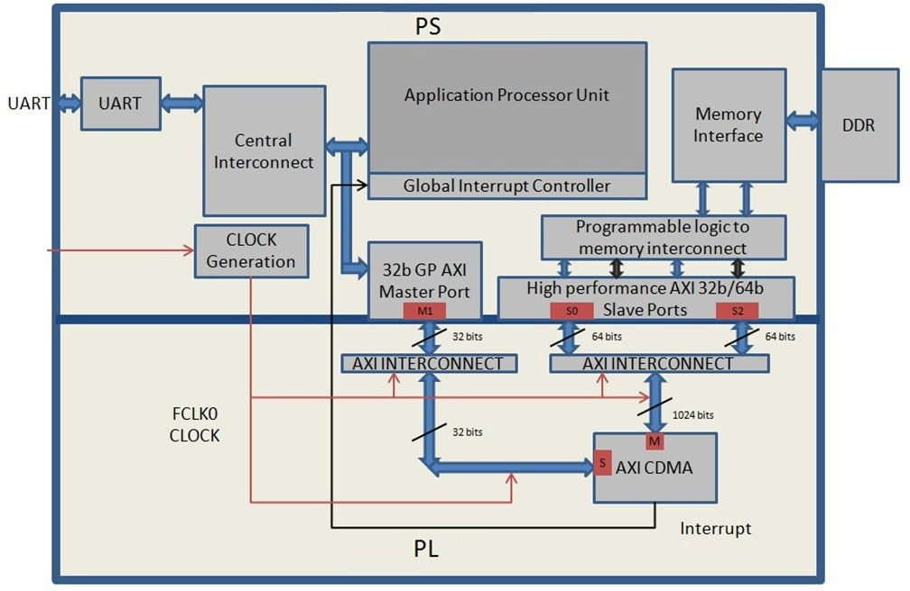
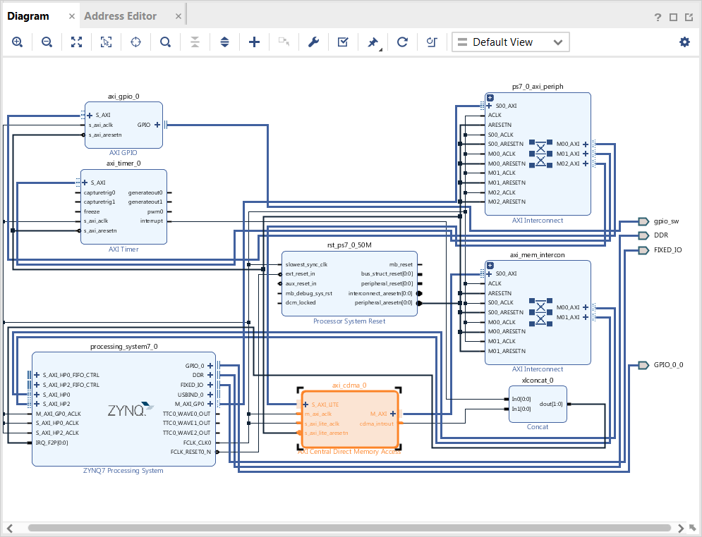
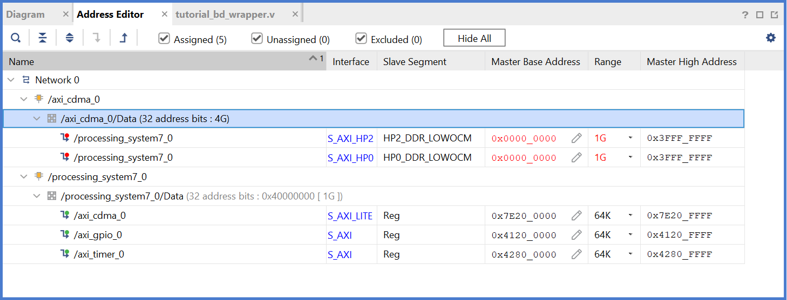
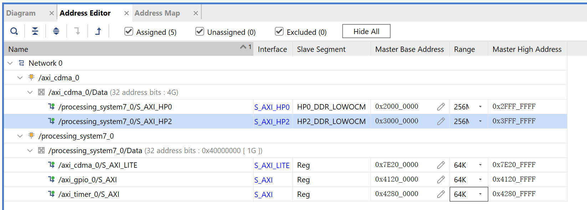

# Using the HP Slave Port with AXI CDMA IP

In this chapter, you will instantiate AXI CDM\A (Central DMA) IP in fabric and
integrate it with the processing system high performance (HP) 64-bit
slave port. In this system, a AXI CDMA instance acts as a master device to copy an
array of the data from the source buffer location to the destination
buffer location in the DDR system memory. The AXI CDMA uses the processing
system HP slave port to get read/write access to the DDR system memory.

You will write standalone application software and Linux OS based
application software using mmap() for the data transfer using the AXI CDMA
block. You will also execute both standalone and Linux-based
application software separately on the ZC702 board.

## Integrating AXI CDMA with the Zynq SoC PS HP Slave Port

Xilinx&reg; Zynq&reg;-7000 SoC devices internally provide four high
performance (HP) AXI slave interface ports that connect the
programmable logic (PL) to asynchronous FIFO interface (AFI) blocks in
the processing system (PS). The HP ports enable a high throughput data
path between AXI masters in the programmable logic and the processing
system's memory system (DDR and on- chip memory). HP slave ports are
configurable to 64-bit or 32-bit interfaces.

In this section, you will create a design using AXI CDMA intellectual
property (IP) as master in fabric and integrate it with the PS HP 64
bit slave port. The block diagram for the system is as shown in the
following figure.



This system covers the following connections:

-   The AXI CDMA slave port is connected to the PS general purpose master
    port 1 (`M_AXI_GP1`). It is used by the PS CPU to configure the AXI
    CDMA register set for the data transfer and also to check the
    status.

-   The AXI CDMA master port is connected to the PS high performance slave
    port 0 (`S_AXI_HP0`). It is used by the AXI CDMA to read from the
    DDR system memory. It acts as the source buffer location for the
    CDMA during data transfer.

-   The AXI CDMA master port is connected to the PS high performance slave
    port 2 (`S_AXI_HP2`). It is used by the AXI CDMA to write the data
    to the DDR system memory. It acts as a destination buffer location
    for the CDMA during the Data transfer.

-   The AXI CDMA interrupt is connected from the fabric to the PS section
    interrupt controller. After data transfer or errors during data
    transaction, the AXI CDMA interrupt is triggered.

In this system, you will configure the HP slave port 0 to access a DDR
memory location range from 0x20000000 to 0x2fffffff. This DDR system
memory location acts as the source buffer location to CDMA for reading
the data.

You will also configure HP slave port 2 to access a DDR memory
location range from 0x30000000 to 0x3fffffff. This DDR system memory
location acts as a destination location to CDMA for writing the data.

You will also configure the AXI CDMA IP data width of the data
transfer channel to 1024 bits with the maximum burst length set to 32.
With this setting, the CDMA maximum transfer size is set to 1024x32 bits
in one transaction.

You will write the application software code for the above system.
When you execute the code, it first initializes the source buffer
memory with the specified data pattern and also clears the destination
buffer memory by writing all zeroes to the memory location. It then
starts configuring the CDMA register for the DMA transfer. It writes
the source buffer location, destination buffer location, and number of
bytes to be transferred to the CDMA registers and waits for the CDMA
interrupt. When the interrupt occurs, it checks the status of the DMA
transfers.

If the data transfer status is successful, it compares the source
buffer data with the destination buffer data and displays the
comparison result on the serial terminal.

If the data transfer status is an error, it displays the error status
on the serial terminal and stops execution.

## Example 7: Integrating AXI CDMA with the PS HP Slave Port

### Input and Output Files

- Input files:
  - Vivado design from [Example 6](5-using-gp-port-zynq.md#example-6-adding-peripheral-pl-ip)
  - Vitis workspace
- Output files:
  - Updated Vivado design and exported hardware handoff `system_wrapper.xsa`
  - `cdma_app.elf` to control and test the AXI CDMA IP

### Update the Vivado Design

1.  Start with the system you created in [Example 6: Adding Peripheral PL IP](5-using-gp-port-zynq.md#example-6-adding-peripheral-pl-ip).

    - Open the Vivado&reg; design from [Example 6](5-using-gp-port-zynq.md#example-6-adding-peripheral-pl-ip).
    - Open the block design from Flow Navigator **Open Block Design**.

2.  Add the CDMA IP:

    - In the Diagram window, right-click in the blank space and select **Add IP**.

    - In the search box, type "CDMA" and double-click the **AXI Central Direct Memory Access** IP to add it to the block design. The AXI
    Central Direct Memory Access IP block appears in the Diagram view.

3.  Add the **Contact** IP to concatenate the interrupt signals:

    - In the Diagram window, right-click in the blank space and select **Add IP**.

    - In the search box type "concat" and double-click the **Concat** IP to
    add it to the block design. The Concat IP block appears in the
    Diagram window. This block is used to concatenate the two
    interrupt signals if you are using the prior design with the AXI
    Timer.

    - Right-click the net from the interrupt port to the **IRQ_F2P[0:0]** port and select **Delete**.

    - Click the **IRQ_F2P[0:0]** port and drag to the **dout[1:0]** output
    port on the **Concat** IP core to make a connection between the two
    ports.

    - Click the **interrupt** port on the AXI Timer IP core and drag to the
    **In0[0:0]** input port on the Concat IP core to make a connection
    between the two ports.

    - Click the **cdma_introut** port on the AXI CDMA IP core and drag to the
    **In1[0:0]** input port on the Concat IP core to make a connection
    between the two ports.

4. Customize the PS to enable the **AXI HP0** and **AXI HP2** interface:

    - Right-click the **ZYNQ7 Processing System** core and select
    **Customize Block**.

    - Select **PS-PL Configuration** and expand the **HP Slave AXI Interface**.

    - Select the checkbox for **S AXI HP0 interface** and for **S AXI HP2 interface**.

   - Click **OK** to accept the changes.

5. Customize the CDMA IP:

   - Right-click the **AXI CDMA IP** core and select **Customize Block**.

   - Set the block settings in the Re-customize IP wizard page as
    follows:

    | System Property                 | Setting or Command to Use |
    | ------------------------------- | ------------------------- |
    | Enable Scatter Gather           | Unchecked                 |
    | Disable 4K Boundary Checks      | Unchecked                 |
    | Allow Unaligned Transfers       | Unchecked                 |
    | Write/Read Data Width           | 1024                      |
    | Write/Read Burst Size           | 32                        |
    | Enable Asynchronous Mode (Auto) | Unchecked                 |
    | Enable CDMA Store and Forward   | Unchecked                 |
    | Address Width                   | 32                        |

    - Click **OK** to accept the changes.

6. Connect the blocks

   - Click the **Run Connection Automation** link in the Diagram window
    to automate the remaining connections.

   - In the Run Connection Automation dialog box make sure the **All Automation** box is checked, then click **OK** to accept the
    default connections. The finished diagram should look like the following figure.

    

    **Note:** You might receive a critical warning message regarding
    forcibly mapping a net into a conflicting address. Address the error
    by manually updating the memory mapped address in the next steps.
    Click **OK** if you see the error message.

7. Assign the address manually. In most cases, Vivado connection automation can set up the address correctly. In the current use case, it is confused by the physical connection because HP0 and HP2 now cover the same address range. Resolve this issue by making sure that the address range of these two ports does not overlap. 

   - Select the **Address Editor** window.

        

    - In the Address Editor window, expand **axi_cdma_0 → axi_cdma_0/Data**. Right-click **HP2_DDR_LOWOCM** and select **Unassign**.

    - In the Range column for **S_AXI_HP0**, select **256M**.

    - Under Offset Address for **S_AXI_HP0**, set a value of
    **0x2000_0000**.

    - In the Address Editor window, expand **axi_cdma_0 → axi_cdma_0/Data → Unassigned**. Right-click **HP2_DDR_LOWOCM** and select **Assign**.

    - In the Range column for **S_AXI_HP2**, select **256M**.

    - Under Offset Address for **S_AXI_HP2**, set a value of **0x3000_0000**.

    

8. Generate the bitstream:

   - In the Flow Navigator, select **Generate Bitstream** under **PROGRAM AND DEBUG**. The Save Project dialog box opens.
   - Ensure that the **Block Design - system** check box is selected, then click **Save**.
   - A message might appear that states synthesis is out of date. If it does, click **Yes**.

9. Export the hardware after bitstream generation completes:

    - Click **File → Export → Export Hardware**.

    **Note:** Make sure to select **Include bitstream** instead of **Pre-synthesis** on the Output page of the Export Hardware Platform wizard.

### Designing Standalone Application Software for the Design

The CDMA-based system that you designed in this chapter requires
application software to execute on the board. This section describes
the details of this software.

The `main()` function in the application software is the entry point for
the execution. It initializes the source memory buffer with the
specified test pattern and clears the destination memory buffer by
writing all zeroes.

The application software then configures the CDMA register sets by
providing information such as source buffer and destination buffer
starting locations. To initiate DMA transfer, it writes the number of
bytes to be transferred in the CDMA register and waits for the CDMA
interrupt to happen. After the interrupt, it checks the status of the
DMA transfer and compares the source buffer with the destination
buffer. Finally, it prints the comparison result in the serial
terminal and stops running.

### Application Software Programming Model

The application software does the following tasks:

1.  Initializes the source buffer with the specified test pattern. The
    source buffer location ranges from 0x20000000 to 0x2fffffff.

    Clears the destination buffer by writing all zeroes into the
    destination address range. The destination buffer location ranges from
    0x30000000 to 0x3fffffff.

2.  Initializes the AXI CDMA IP and does the following:

    a.  Associates a CDMA callback function with AXI CDMA ISR and enables
        the interrupt.

        This callback function executes during the CDMA interrupt. It sets the
        interrupt done and/or error flags depending on the DMA transfer
        status.

        Application software waits for the callback function to populate these
        flags and executes the software according to the status flag.

    b.  Configures the CDMA in simple mode.

    c.  Checks the status register of the CDMA IP to verify the CDMA idle
        status.

    d.  Sets the source buffer starting location, 0x20000000, to the CDMA
        register.

    e.  Sets the destination buffer starting location, 0x30000000, to the
        CDMA register.

    f.  Sets the number of bytes to transfer to the CDMA register. The
        application software starts the DMA transfer.

3.  After the CDMA interrupt is triggered, the DMA transfer is checked.
    status.

    If the transfer status is successful, the application software
    compares the source buffer location with the destination buffer
    location and displays the comparison result on the serial terminal,
    and then exits from the execution.

    If the transfer status displays an error, the software prints the
    error status in the serial terminal and stops running.

### Creating the Standalone CDMA Application

1. Launch the Vitis software platform and open the workspace you worked on before.

2. Update the hardware specification:

    - Right-click the **zc702_edt** platform, and select **Update Hardware Specification**.
    - Confirm the path and click **OK**.
    - Build the platform by clicking the hammer button on the toolbar.

3.  Select **File → New → Application Project**. 
   
   - The New Application Project wizard opens. Use the information in the table below to make your selections in the wizard screens.

| Screen               | System Property                   | Setting or Command to Use                                                                                             |
| --------------------------- | --------------------------------- | --------------------------------------------------------------------------------------------------------------------- |
| Platform                    | Select a platform from repository | Click zc702_edt [custom]. |
| Application Project Details | Application project name          | Enter cdma_app.                                                                                                        |
| Domain                      | Select a domain                   | Click standalone on ps7_cortex9_0.                                                                                    |
| Templates                   | Available Templates               | Empty Application                                                                                                     |


   - Click **Finish**. The New Application Project wizard closes and the Vitis software
        platform creates the cdma_app application project under the Explorer view.

4.  In the Explorer view, expand the **cdma_app** project, right-click
    the **src** directory, and select **Import Sources** to open the Import Sources dialog box.

2.  In the Import Sources dialog box, click the **Browse** button
    next to the **From directory** field and specify the design files
    folder to [ref_files/example7](https://github.com/Xilinx/Embedded-Design-Tutorials/tree/master/docs/Introduction/Zynq7000-EDT/ref_files/example7).

3.  Select the **cdma_app.c** file and click **Finish**.

4.  Build the CDMA application project either by clicking the hammer
    button or by right-clicking on the **cdma_app** project and
    selecting **Build Project**.

### Running CDMA the App on ZC702

1.  Open the serial communication utility with baud rate set to
    **115200**.

    **Note:** This is the baud rate that the UART is programmed to on
    Zynq devices.

2.  Make sure that the boot mode of the board is set to JTAG and power on.

    **Note:** Refer to [Board Setup in Example 2](2-using-zynq.md)
    for information about setting up the board.

3.  Run the project.

    - Right-click **cdma_app** and select **Run as → Run on Hardware**

4.  Check the status of the CDMA transfer in the serial terminal. If the
    transfer is successful, the message "DMA Transfer is Successful"
    displays. Otherwise, the serial terminal displays an error
    message.

    The expected result on the serial console is as follows:

    ```
    --- Entering main() ---
    Start Transfer

    --- Transfer Done ---
    Start Transfer

    --- Transfer Done ---
    XAxiCdma_Interrupt: Passed
    DMA Transfer is Successful
    ```

Up until now, the examples you have been working with have all been developed and debugged in a lab environment. JTAG is required to configure and control the applications. How can you deploy applications to the board so that it can run the applications after booting by itself? See the [next chapter](./7-linux-booting-debug.md) for Linux boot image configuration.

------

© Copyright 2015–2021 Xilinx, Inc.

Licensed under the Apache License, Version 2.0 (the "License"); you may not use this file except in compliance with the License. You may obtain a copy of the License at

http://www.apache.org/licenses/LICENSE-2.0

Unless required by applicable law or agreed to in writing, software distributed under the License is distributed on an "AS IS" BASIS, WITHOUT WARRANTIES OR CONDITIONS OF ANY KIND, either express or implied. See the License for the specific language governing permissions and limitations under the License.
