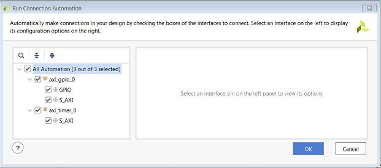
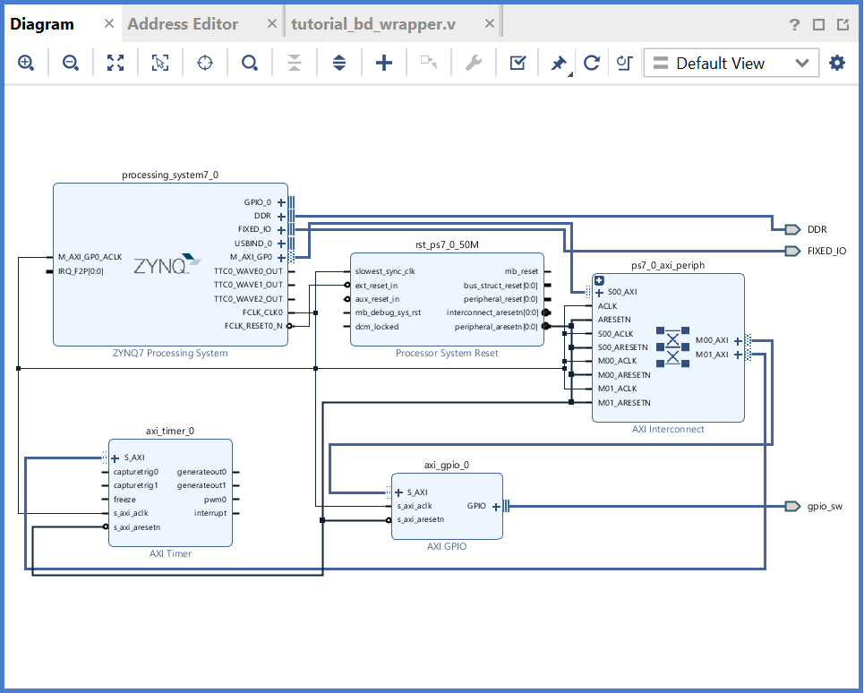
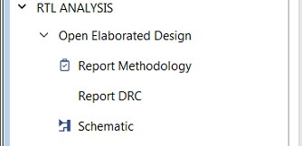
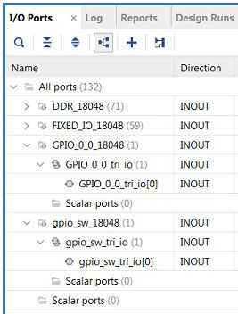

            Read this page in other languages:<a href="../docs-jp/3-using-gp-port-zynq.md">日本語</a>    <table style="width:100%"><table style="width:100%">
  <tr>

<th width="100%" colspan="6"><h1>Zynq-7000 SoC Embedded Design Tutorial 2020.2 (UG1165)</h1>
</th>

  </tr>
  <tr>
    <td width="33%" align="center"><a href="../README.md">1. Introduction</a></td>
    <td width="33%" align="center"><a href="2-using-zynq.md">2. Using the Zynq SoC Processing System</a></td>
    <td width="33%" align="center">3. Using the GP Port in Zynq Devices</td>
</tr>
<tr><td width="33%" align="center"><a href="4-debugging-vitis.md">4. Debugging with the Vitis Software Platform</a></td>
    <td width="33%" align="center"><a href="5-using-hp-port.md">5. Using the HP Slave Port with AXI CDMA IP</a></td>
    <td width="33%" align="center"><a href="6-linux-booting-debug.md">6. Linux Booting and Debug in the Vitis Software Platform</a></td>
  </tr>
  <tr>
      <td width="33%" align="center"><a href="7-custom-ip-driver-linux.md">7. Creating Custom IP and Device Driver for Linux
  </a></td>
      <td width="33%" align="center"><a href="8-sw-profiling.md">8. Software Profiling Using the Vitis Software Platform</a></td>    
      <td width="33%" align="center"><a href="9-linux-aware-debugging.md">9. Linux Aware Debugging</a></td>    
    </tr>
</table>

# Using the GP Port in Zynq Devices

One of the unique features of using the Xilinx&reg; Zynq&reg;-7000 SoC as an
embedded design platform is in using the Zynq SoC processing system
(PS) for its Arm Cortex-A9 dual core processing system as well as the
programmable logic (PL) available on it.

In this chapter, you will create a design with:

-   AXI GPIO and AXI Timer in fabric (PL) with interrupt from fabric to
    PS section

-   Zynq SoC PS GPIO pin connected to the fabric (PL) side pin using the
    EMIO interface

The flow of this chapter is similar to that in <a href="2-using-zynq.md">Using the
Zynq SoC Processing System</a> and uses the Zynq device as a
base hardware design. It is assumed that you understand the concepts
discussed in <a href="2-using-zynq.md">Using the
Zynq SoC Processing System</a> regarding adding the Zynq device into a Vivado IP
integrator block diagram design. If you skipped that chapter, you
might want to look at it because we will continually refer to it throughout this chapter.

## Adding IP in PL to the Zynq SoC Processing System

There is no restriction on the complexity of an intellectual property
(IP) that can be added in fabric to be tightly coupled with the Zynq&reg;
SoC PS. This section covers a simple example with the AXI GPIO, AXI
Timer with interrupt, and the PS section GPIO pin connected to PL side
pin using the EMIO interface.

In this section, you will create a design to check the functionality
of the AXI GPIO, AXI Timer with interrupt instantiated in fabric, and
PS section GPIO with EMIO interface. The block diagram for the system
is as shown in the following figure.

You can use the system created in <a href="2-using-zynq.md">Using the
Zynq SoC Processing System</a> and continue after [Creating an Embedded Processor Project](2-using-zynq.md#creating-an-embedded-processor-project).

In the examples in this chapter, we will expand on the design in <a href="2-using-zynq.md">Using the
Zynq SoC Processing System</a>. You will make the following design changes:

-   The fabric-side AXI GPIO is assigned a 1-bit channel width and is
    connected to the SW5 push- button switch on the ZC702 board.

-   The PS GPIO ports are modified to include a 1-bit interface that
    routes a fabric pin (via the EMIO interface) to the SW7
    push-button switch on the board.

-   In the PS section, another 1-bit GPIO is connected to the DS23 LED
    on the board, which is on the MIO port.

-   The AXI timer interrupt is connected from fabric to the PS section
    interrupt controller. The timer starts when you press any of the
    selected push buttons on the board. After the timer expires, the
    timer interrupt is triggered.

-   Along with making the above hardware changes, you will write the
    application software code. The code will function as follows:

    -   A message appears in the serial terminal and asks you to select
        the push button switch to use on the board (either SW7 or
        SW5).

    -   When the appropriate button is pressed, the timer automatically
        starts, switches LED DS23 OFF, and waits for the timer
        interrupt to happen.

    -   After the timer interrupt, LED DS23 switches ON and execution
        starts again and waits for you to select the push button
        switch in the serial terminal again.

## Example Project: Validate Instantiated Fabric IP Functionality

In this example, you will add the AXI GPIO, AXI Timer, the interrupt
instantiated in fabric, and the EMIO interface. You will then validate
the fabric additions.

1.  Open the Vivado&reg; Design Suite.

2.  Under the Recent Projects column, click the **edt_tutorial** design
    that you created in <a href="2-using-zynq.md">Using the
    Zynq SoC Processing System</a>.

3.  Under **IP Integrator**, click **Open Block Design**.

4.  In the Diagram window, right-click in the blank space and select
    **Add IP**.

5.  In the search box, type AXI GPIO and double-click the **AXI GPIO**
    IP to add it to the block design. The AXI GPIO IP block appears in
    the Diagram window.

6.  In the Diagram window, right-click in the blank space and select
    **Add IP**.

7.  In the search box, type AXI Timer and double-click the **AXI Timer**
    IP to add it to the block design. The AXI Timer IP block appears
    in the Diagram view.

8.  You must also edit the EMIO configuration of the ZYNQ7 SoC
    processing system and enable interrupts. Right-click the **ZYNQ7
    Processing System** IP block and select **Customize Block**.

    ***Note*:** You can also double-click the IP block to customize.

    The Re-customize IP dialog box opens, as shown in the following figure.

    

9.  Click **MIO Configuration**.

10. Expand **I/O Peripherals→ GPIO** and select the **EMIO GPIO
    (Width)** check box.

11. Change the EMIO GPIO (Width) to **1**.

12. Navigate to Interrupts→ Fabric Interrupts→ PL-PS Interrupt Ports.

13. Check the **Fabric Interrupts** box and also check
    **IRQ_F2P\[15:0\]** to enable PL-PS interrupts in the IP core.

14. Click **OK** to accept the changes to the ZYNQ7 Processing System
    IP. The diagram looks like the following figure.

    

15. Click the **Run Connection Automation** link at the top of the page
    to automate the connection process for the newly added IP blocks.

16. In the Run Connection Automation dialog box, select the check box next to **All Automation**, as shown in the following figure.

        

17. Click **OK**.

    Upon completion, the updated diagram looks like the following figure.

    

18. Right-click the **AXI GPIO** IP block and select **Customize
    Block**.

    ***Note*:** You can also double-click the IP block to make
    customizations.

19. Under the **Board** page, make sure that both **GPIO** and **GPIO2**
    are set to **Custom**.

20. Select the **IP Configuration** page. In the GPIO section, change
    the **GPIO Width** to **1** because you only need one GPIO port.
    Also ensure that **All Inputs** and **All Outputs** are both
    unchecked.

21. Click **OK** to accept the changes.

22. Notice that the Interrupt port is not automatically connected to the
    AXI Timer IP Core. In the Block Diagram view, locate the
    IRQ_F2P\[0:0\] port on the ZYNQ7 Processing System.

23. Scroll your mouse over the connector port until the pencil button
    appears, then click the **IRQ_F2P\[0:0\]** port and drag to the
    **interrupt** output port on the AXI Timer IP core to make a
    connection between the two ports.

24. Notice that the ZYNQ7 Processing System GPIO_0 port is not
    connected. Right-click the **GPIO_0** output port on the **ZYNQ7 Processing System** and select **Make External**.

    The pins are external but do not have the needed constraints for our
    board. To constrain your hardware pins to specific device locations,
    follow the steps below. These steps can be used for any manual pin
    placements.

25. Click **Open Elaborated Design** under RTL Analysis in the Flow
    Navigator view.

    

26. When the Elaborate Design message box opens, as shown in the following figure, click **OK**.

        

    **TIP:** *The design might take a few minutes to elaborate. If you
    want to do something else in Vivado while the design elaborates, you
    can click the **Background** button to have Vivado continue running
    the process in the background.*

27. Select **I/O Planning** from the drop-down menu, as shown in the following figure, to display the **I/O Ports** window.

        

28. Under the I/O Ports window at the bottom of the Vivado window (as
    seen in the following figure), expand the **GPIO_0\_0_18048** and
    **gpio_sw_18048** ports to check the site (pin) map.

    

29. Find **GPIO_0\_0_tri_io\[0\]** and set the following properties,
    shown in the following figure:

    -   Package Pin = F19

    -   I/O Std = LVCMOS25

30. Find **gpio_sw_tri_io\[0\]** and set the following properties, shown
    in the following figure:

    -   Package Pin = G19

    -   I/O Std = LVCMOS25

    

    ***Note*:** For additional information about creating other design
    constraints, refer to the *Vivado Design Suite User Guide: Using
    Constraints* ([UG903](https://www.xilinx.com/cgi-bin/docs/rdoc?v=2020.1%3Bd%3Dug903-vivado-using-constraints.pdf)).

31. In the Flow Navigator, under Program and Debug, select **Generate
    Bitstream**.

    The Save Project view opens. Make sure the **Elaborated Design -
    constrs_1** check box is selected and click **Save**.

    A message might appear that states that synthesis is out of date. If
    this happens, click **Yes**.

32. The Save Constraints dialog box appears (shown in the following
    figure). Provide a file name (GPIO_Constraints) and click **OK**.
    If the Synthesis is Out-of-date dialog box opens, click **Yes** to
    rerun synthesis. The Launch Runs dialog box opens. Click **OK** to
    launch synthesis.

    

    A constraints file is created and saved under the **Constraints**
    folder on the **Hierarchy** view of the **Sources** window.

    

33. After bitstream generation completes, export the hardware using
    **File→ Export → Export Hardware**. Use the information in the
    table below to make selections in each of the wizard screens.
    Click **Next** where necessary.

    <table>
    <thead>
    <tr class="header">
    <th><blockquote>
    
<strong>Wizard Screen</strong>

    </blockquote></th>
    <th><blockquote>
    
<strong>System Property</strong>

    </blockquote></th>
    <th><blockquote>
    
<strong>Setting or Command to Use</strong>

    </blockquote></th>
    </tr>
    </thead>
    <tbody>
    <tr class="odd">
    <td>Export Hardware Platform</td>
    <td>Platform type</td>
    <td>Fixed</td>
    </tr>
    <tr class="even">
    <td>Output</td>
    <td></td>
    <td>Include bitstream</td>
    </tr>
    </tbody>
    </table>

    <table>
    <thead>
    <tr class="header">
    <th><blockquote>
    
<strong>Wizard Screen</strong>

    </blockquote></th>
    <th><blockquote>
    
<strong>System Property</strong>

    </blockquote></th>
    <th><blockquote>
    
<strong>Setting or Command to Use</strong>

    </blockquote></th>
    </tr>
    </thead>
    <tbody>
    <tr class="odd">
    <td>Files</td>
    <td>XSA file name</td>
    <td>Leave as tutorial_bd_wrapper</td>
    </tr>
    <tr class="even">
    <td></td>
    <td><strong>Export to</strong></td>
    <td>Leave as C:/designs/ edt_tutorial</td>
    </tr>
    </tbody>
    </table>

    ***Note*:** If a pop-up appears saying the module is already exported,
    click **Yes**.

34. Click **Finish** as shown in the following figure.

        

## Working with the Vitis Software Platform

Open the Vitis IDE and manually update the exported hardware from
Vivado.

1.  In the Explorer view, right-click on the **hw_platform** platform
    project and click on the **Update Hardware Specification** option
    as shown in the following figure.

    

2.  In the Update Hardware Specification view, browse for the exported XSA file (C:/designs/edt_tutorial/tutorial_bd_wrapper.xsa) from Vitis and click **OK**. A view opens stating that the hardware specification for the platform project has been updated, as shown in the following figure. Click **OK**.

        

3.  Rebuild the out-of-date platform project. Right-click the
    **hw_platform** project. Select **Clean Project** followed by
    **Build Project**.

4.  After the hw_platform project build completes, the hw_platform.xpfm
    file is generated, as shown in the following figure.

    

5.  Open the helloworld.c file from the hello_world project created with
    standalone PS in <a href="2-using-zynq.md">Using the
    Zynq SoC Processing System</a> and modify the application software code as
    described in [Standalone Application Software for the
    Design](#standalone-application-software-for-the-design).

6.  Save the file and re-build the project.

7.  Open the serial communication utility with baud rate set to
    **115200**.

    ***Note*:** This is the baud rate that the UART is programmed to on
    Zynq devices.

8.  Connect to the board. Because you have a bitstream for the PL fabric, you must download the bitstream.

9.  Select **Xilinx → Program FPGA**. The Program FPGA view opens.
    Browse for the bitstream exported from Vivado.

    

10. Click **Program** to download the bitstream and program the PL
    fabric. When the FPGA programming is done, progress information
    pop up opens and shows the status as FPGA configuration complete.

11. Run the project similar to the steps in
    [Creating a Platform Project in the Vitis Software Platform with an XSA from Vivado](2-using-zynq.md#creating-a-platform-project-in-the-vitis-software-platform-with-an-xsa-from-vivado).

    If steps 9 and 10 fail, open the **Run Configurations** view,
    browse for the bitstream file exported by Vivado, and then click
    the **Run** button as shown in following figure. With this step,
    the FPGA is programmed and the application runs.

        

12. In the system, the AXI GPIO pin is connected to push button **SW5**
    on the board, and the PS section GPIO pin is connected to push
    button **SW7** on the board via an EMIO interface.

13. Follow the instructions printed on the serial terminal to run the
    application. See the following figure for serial output logs.

    

## Standalone Application Software for the Design

The system you designed in this chapter requires application software
for the execution on the board. This section describes the details
about the application software.

The main() function in the application software is the entry point for
the execution. This function includes initialization and the required
settings for all peripherals connected in the system. It also has a
selection procedure for the execution of the different use cases, such
as AXI GPIO and PS GPIO using EMIO interface. You can select different
use cases by following the instruction on the serial terminal.

### Application Software Steps

Application software is composed of the following steps:

1.  Initialize the AXI GPIO module.

2.  Set a direction control for the AXI GPIO pin as an input pin, which
    is connected with the **SW5** push button on the board. The
    location is fixed via LOC constraint in the user constraint file
    (XDC) during system creation.

3.  Initialize the AXI TIMER module with device ID 0.

4.  Associate a timer callback function with AXI timer ISR.

    This function is called every time the timer interrupt happens. This
    callback switches on the LED **DS23** on the board and sets the
    interrupt flag.

    The main() function uses the interrupt flag to halt execution, waits
    for timer interrupt to happen, and then restarts the execution.

5.  Set the reset value of the timer, which is loaded to the timer
    during reset and timer starts.

6.  Set timer options such as Interrupt mode and Auto Reload mode.

7.  Initialize the PS section GPIO.

8.  Set the PS section GPIO, channel 0, pin number 10 to the output pin,
    which is mapped to the MIO pin and physically connected to the LED
    **DS23** on the board.

9.  Set PS Section GPIO channel number 2, pin number 0, to an input pin,
    which is mapped to PL side pin via the EMIO interface and
    physically connected to the **SW7** push button switch.

10. Initialize Snoop control unit Global Interrupt controller. Also,
    register Timer interrupt routine to interrupt ID \'91\', register
    the exceptional handler, and enable the interrupt.

11. Execute a sequence in the loop to select between AXI GPIO or PS GPIO
    use case via serial terminal.

    The software accepts your selection from the serial terminal and
    executes the procedure accordingly. After the selection of the use
    case via the serial terminal, you must press a push button on the
    board as per the instruction on terminal. This action switches off the
    LED DS23, starts the timer, and tells the function to wait infinitely
    for the Timer interrupt to happen. After the Timer interrupt happens,
    LED DS23 switches ON and restarts execution.

#### Application Software Code

The Application software for the system is included in helloworld.c,
which is available in the ZIP file that accompanies this guide. For
more details, see [Design Files for This Tutorial](2-using-zynq.md#design-files-for-this-tutorial).

© Copyright 2015–2020 Xilinx, Inc.
